# PaldarkLab-—-Project-Overview

# PaldarkLab — Project Overview
Relevant source files

- [Config/DefaultEngine.ini](https://github.com/thanhtinpro/devin-paldarklab/blob/864c77b4/Config/DefaultEngine.ini)
- [Config/DefaultGame.ini](https://github.com/thanhtinpro/devin-paldarklab/blob/864c77b4/Config/DefaultGame.ini)
- [Documents/Devlog/Q1-Milestone-Build.md](https://github.com/thanhtinpro/devin-paldarklab/blob/864c77b4/Documents/Devlog/Q1-Milestone-Build.md?plain=1)
- [Documents/Devlog/Q2-Milestone-Build.md](https://github.com/thanhtinpro/devin-paldarklab/blob/864c77b4/Documents/Devlog/Q2-Milestone-Build.md?plain=1)
- [Documents/Devlog/Q3-Milestone-Build.md](https://github.com/thanhtinpro/devin-paldarklab/blob/864c77b4/Documents/Devlog/Q3-Milestone-Build.md?plain=1)
- [Documents/Devlog/Q4-Milestone-Build.md](https://github.com/thanhtinpro/devin-paldarklab/blob/864c77b4/Documents/Devlog/Q4-Milestone-Build.md?plain=1)
- [Documents/PALDARK/00-VISION.md](https://github.com/thanhtinpro/devin-paldarklab/blob/864c77b4/Documents/PALDARK/00-VISION.md?plain=1)
- [Documents/PALDARK/01-GameDesign.md](https://github.com/thanhtinpro/devin-paldarklab/blob/864c77b4/Documents/PALDARK/01-GameDesign.md?plain=1)
- [Documents/PALDARK/03-Roadmap_1_Year.md](https://github.com/thanhtinpro/devin-paldarklab/blob/864c77b4/Documents/PALDARK/03-Roadmap_1_Year.md?plain=1)
- [PaldarkLab.uproject](https://github.com/thanhtinpro/devin-paldarklab/blob/864c77b4/PaldarkLab.uproject)
- [README.md](https://github.com/thanhtinpro/devin-paldarklab/blob/864c77b4/README.md?plain=1)
- [Source/PaldarkLab/Public/Combat/PaldarkLagCompensationTypes.h](https://github.com/thanhtinpro/devin-paldarklab/blob/864c77b4/Source/PaldarkLab/Public/Combat/PaldarkLagCompensationTypes.h)

PaldarkLab is the technical foundation and C++ skeleton for PALDARK, a high-stakes 4-player co-op extraction shooter. The project blends the companion-driven gameplay of *Palworld* with the tactical tension of *Escape from Tarkov* and the CQB mechanics of *Ready or Not*.

Built on a modular C++ architecture inspired by Epic Games' *Lyra Starter Game*, PaldarkLab implements a vendor-neutral "Experience" system that allows for rapid iteration on game modes, pawn configurations, and environmental content.

### Core Game Concept

The PALDARK experience revolves around the Hub-and-Spoke meta-loop. Players inhabit a persistent Hub Town (a social shard) where they manage their Pal roster, trade at the Marketplace, and prepare for raids. The gameplay transitions into "The Dark Zone"—a high-risk environment where players must capture wild Pals, loot resources, and reach an extraction point before death results in the permanent loss of their gear and companions.

For details, see [Game Concept and Vision](#1.1).

### Technical Architecture

The codebase is partitioned into three distinct C++ modules to ensure clean dependency management and optimized build times.

| Module | Loading Phase | Purpose |
| --- | --- | --- |
| `PaldarkLabCore` | `PreDefault` | Native Gameplay Tags, Log Categories, and shared types used by all modules. |
| `PaldarkLab` | `Default` | Main runtime logic, GAS implementation, AI FSM, and Experience system. |
| `PaldarkLabEditor` | `Default` | Editor-only utilities and asset validation logic. |

The project utilizes a custom `UPaldarkAssetManager` to handle async-loading of Primary Data Assets, including `UPaldarkExperienceDefinition` and `UPaldarkPawnData`[Config/DefaultGame.ini#17-45](https://github.com/thanhtinpro/devin-paldarklab/blob/864c77b4/Config/DefaultGame.ini#L17-L45)

For details, see [Module Architecture and Build System](#1.2).

### System Relationship Diagram

The following diagram illustrates how high-level game concepts (Natural Language Space) map to specific C++ classes and data entities (Code Entity Space).

System Mapping: Vision to Code

[Flowchart Diagram]

Sources: [Documents/PALDARK/00-VISION.md#11-13](https://github.com/thanhtinpro/devin-paldarklab/blob/864c77b4/Documents/PALDARK/00-VISION.md?plain=1#L11-L13)[Documents/PALDARK/01-GameDesign.md#31-42](https://github.com/thanhtinpro/devin-paldarklab/blob/864c77b4/Documents/PALDARK/01-GameDesign.md?plain=1#L31-L42)[Source/PaldarkLab/Public/PaldarkLab.h#1-20](https://github.com/thanhtinpro/devin-paldarklab/blob/864c77b4/Source/PaldarkLab/Public/PaldarkLab.h#L1-L20)

### 52-Week Development Roadmap

The project follows a structured 4-quarter roadmap, moving from technical foundation to a feature-complete Alpha.

1. Q1: Foundation — Core framework, movement, and the "Primitive Loop" (Sprint, Shoot, Inventory) [Documents/Devlog/Q1-Milestone-Build.md#24-26](https://github.com/thanhtinpro/devin-paldarklab/blob/864c77b4/Documents/Devlog/Q1-Milestone-Build.md?plain=1#L24-L26)
2. Q2: Combat & Network — 4-player dedicated server support, Lag Compensation, and Pal Combat AI [Documents/Devlog/Q2-Milestone-Build.md#17-22](https://github.com/thanhtinpro/devin-paldarklab/blob/864c77b4/Documents/Devlog/Q2-Milestone-Build.md?plain=1#L17-L22)
3. Q3: Content & World — Multiple maps, expanded Pal species roster, and the Tame mechanic [Documents/Devlog/Q3-Milestone-Build.md#17-23](https://github.com/thanhtinpro/devin-paldarklab/blob/864c77b4/Documents/Devlog/Q3-Milestone-Build.md?plain=1#L17-L23)
4. Q4: Polish & Beta — Hub Town social systems, AWS Backend integration, and Save/Load persistence [Documents/Devlog/Q4-Milestone-Build.md#22-27](https://github.com/thanhtinpro/devin-paldarklab/blob/864c77b4/Documents/Devlog/Q4-Milestone-Build.md?plain=1#L22-L27)

For details, see [Development Roadmap and Devlogs](#1.3).

### Module Dependency and Execution Flow

This diagram shows the boot-up sequence and module dependencies required to initialize a Paldark Experience.

Initialization Flow

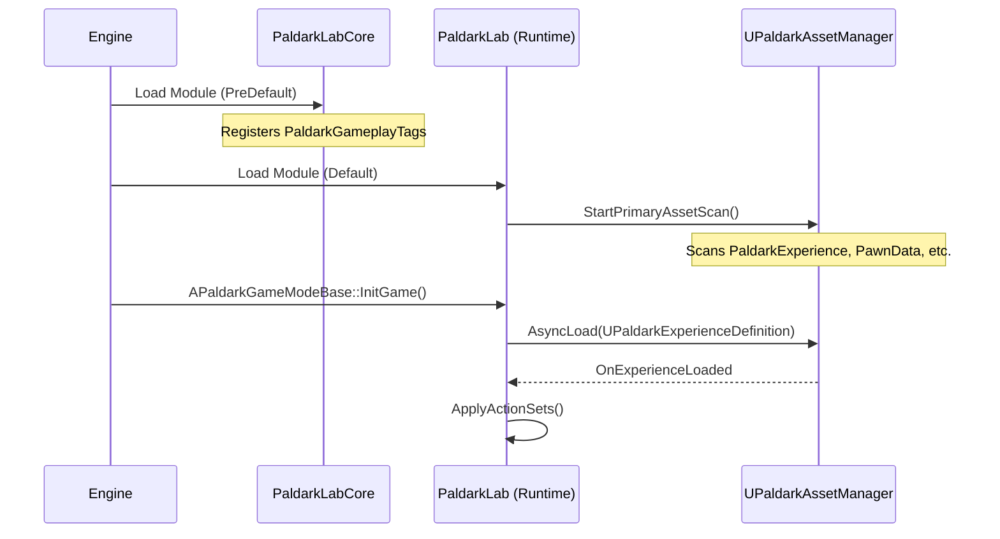
```mermaid
sequenceDiagram
    participant E as Engine
    participant C as PaldarkLabCore
    participant R as PaldarkLab (Runtime)
    participant AM as UPaldarkAssetManager
    E->>C: Load Module (PreDefault)
    Note over C: Registers PaldarkGameplayTags
    E->>R: Load Module (Default)
    R->>AM: StartPrimaryAssetScan()
    Note over AM: Scans PaldarkExperience, PawnData, etc.
    E->>R: APaldarkGameModeBase::InitGame()
    R->>AM: AsyncLoad(UPaldarkExperienceDefinition)
    AM-->>R: OnExperienceLoaded
    R->>R: ApplyActionSets()
```

Sources: [PaldarkLab.uproject#6-32](https://github.com/thanhtinpro/devin-paldarklab/blob/864c77b4/PaldarkLab.uproject#L6-L32)[Config/DefaultGame.ini#9-25](https://github.com/thanhtinpro/devin-paldarklab/blob/864c77b4/Config/DefaultGame.ini#L9-L25)[README.md#39-45](https://github.com/thanhtinpro/devin-paldarklab/blob/864c77b4/README.md?plain=1#L39-L45)

---

### Child Pages

- [Game Concept and Vision](#1.1) — Detailed breakdown of the 3 Game Pillars: *Pal Bond Trumps Gun*, *Information is Survival*, and *Tame Once, Trust Forever*.
- [Module Architecture and Build System](#1.2) — Technical deep dive into the three-module layout, build targets (Game/Server/Editor), and the `PaldarkRaidContent` plugin.
- [Development Roadmap and Devlogs](#1.3) — Comprehensive history of the 52-week development cycle and quarterly milestone outcomes.

Sources: [README.md#9-16](https://github.com/thanhtinpro/devin-paldarklab/blob/864c77b4/README.md?plain=1#L9-L16)[Documents/PALDARK/03-Roadmap_1_Year.md#11-20](https://github.com/thanhtinpro/devin-paldarklab/blob/864c77b4/Documents/PALDARK/03-Roadmap_1_Year.md?plain=1#L11-L20)[PaldarkLab.uproject#6-32](https://github.com/thanhtinpro/devin-paldarklab/blob/864c77b4/PaldarkLab.uproject#L6-L32)

---

# Game-Concept-and-Vision

# Game Concept and Vision
Relevant source files

- [Documents/Courses/12-Udemy-ue4-pro-unreal-engine-game-coding.md](https://github.com/thanhtinpro/devin-paldarklab/blob/864c77b4/Documents/Courses/12-Udemy-ue4-pro-unreal-engine-game-coding.md?plain=1)
- [Documents/Courses/13-Udemy-ue5-multiplayer-in-unreal-with-gas-and-aws-dedicated-servers.md](https://github.com/thanhtinpro/devin-paldarklab/blob/864c77b4/Documents/Courses/13-Udemy-ue5-multiplayer-in-unreal-with-gas-and-aws-dedicated-servers.md?plain=1)
- [Documents/GameDesign/01-ActionRoguelike_GDD.md](https://github.com/thanhtinpro/devin-paldarklab/blob/864c77b4/Documents/GameDesign/01-ActionRoguelike_GDD.md?plain=1)
- [Documents/GameDesign/04-ReadyOrNot_GDD.md](https://github.com/thanhtinpro/devin-paldarklab/blob/864c77b4/Documents/GameDesign/04-ReadyOrNot_GDD.md?plain=1)
- [Documents/GameDesign/10-MP_Shooter_GDD.md](https://github.com/thanhtinpro/devin-paldarklab/blob/864c77b4/Documents/GameDesign/10-MP_Shooter_GDD.md?plain=1)
- [Documents/GameDesign/12-Pro_UE_GDD.md](https://github.com/thanhtinpro/devin-paldarklab/blob/864c77b4/Documents/GameDesign/12-Pro_UE_GDD.md?plain=1)
- [Documents/GameDesign/13-Crunch_GDD.md](https://github.com/thanhtinpro/devin-paldarklab/blob/864c77b4/Documents/GameDesign/13-Crunch_GDD.md?plain=1)
- [Documents/PALDARK/00-VISION.md](https://github.com/thanhtinpro/devin-paldarklab/blob/864c77b4/Documents/PALDARK/00-VISION.md?plain=1)
- [Documents/PALDARK/01-GameDesign.md](https://github.com/thanhtinpro/devin-paldarklab/blob/864c77b4/Documents/PALDARK/01-GameDesign.md?plain=1)
- [Documents/PALDARK/03-Roadmap_1_Year.md](https://github.com/thanhtinpro/devin-paldarklab/blob/864c77b4/Documents/PALDARK/03-Roadmap_1_Year.md?plain=1)
- [Documents/Projects/Palworld_Assessment.md](https://github.com/thanhtinpro/devin-paldarklab/blob/864c77b4/Documents/Projects/Palworld_Assessment.md?plain=1)
- [Documents/Projects/ReadyOrNot_Assessment.md](https://github.com/thanhtinpro/devin-paldarklab/blob/864c77b4/Documents/Projects/ReadyOrNot_Assessment.md?plain=1)

This page details the core game concept, player fantasy, and the high-level technical architecture of PALDARK. It serves as the foundational vision for the 4-player co-op extraction shooter, bridging the creative goals with the technical implementation patterns derived from Lyra, Ready or Not, and Palworld.

## 1. Executive Summary

PALDARK is a high-stakes, tactical extraction shooter set in a post-apocalyptic world where players (Tamers) must enter "Dark Zones" to capture rare Pals, scavenge for technology, and survive against "Echo Pals"—ancient creatures driven mad by neural radiation [Documents/PALDARK/00-VISION.md#11-13](https://github.com/thanhtinpro/devin-paldarklab/blob/864c77b4/Documents/PALDARK/00-VISION.md?plain=1#L11-L13) The game combines the tension of *Escape from Tarkov*, the companion mechanics of *Palworld*, and the tactical pacing and AI depth of *Ready or Not*[Documents/PALDARK/00-VISION.md#13](https://github.com/thanhtinpro/devin-paldarklab/blob/864c77b4/Documents/PALDARK/00-VISION.md?plain=1#L13-L13)

### Core Technical Pillars

- Individual Pal AI: Utilizing an Activity FSM (Finite State Machine) pattern to create lifelike companions and hostile threats [Documents/PALDARK/01-GameDesign.md#101-102](https://github.com/thanhtinpro/devin-paldarklab/blob/864c77b4/Documents/PALDARK/01-GameDesign.md?plain=1#L101-L102)
- Authoritative Extraction Loop: A server-authoritative match lifecycle managed by AWS GameLift [Documents/PALDARK/01-GameDesign.md#54-55](https://github.com/thanhtinpro/devin-paldarklab/blob/864c77b4/Documents/PALDARK/01-GameDesign.md?plain=1#L54-L55)
- Persistent Social Hub: A shared 8-player shard for meta-progression, breeding, and squad planning [Documents/PALDARK/01-GameDesign.md#196](https://github.com/thanhtinpro/devin-paldarklab/blob/864c77b4/Documents/PALDARK/01-GameDesign.md?plain=1#L196-L196)

Sources:[Documents/PALDARK/00-VISION.md#11-13](https://github.com/thanhtinpro/devin-paldarklab/blob/864c77b4/Documents/PALDARK/00-VISION.md?plain=1#L11-L13)[Documents/PALDARK/01-GameDesign.md#54-55](https://github.com/thanhtinpro/devin-paldarklab/blob/864c77b4/Documents/PALDARK/01-GameDesign.md?plain=1#L54-L55)[Documents/PALDARK/01-GameDesign.md#101-102](https://github.com/thanhtinpro/devin-paldarklab/blob/864c77b4/Documents/PALDARK/01-GameDesign.md?plain=1#L101-L102)

---

## 2. The Meta-Loop: Hub-and-Spoke

The gameplay is structured around a "Hub-and-Spoke" model, alternating between a persistent social environment and instanced tactical raids.

### Phase 1: Hub Town (Social & Persistence)

Players reside in an 8-player social shard [Documents/PALDARK/01-GameDesign.md#196](https://github.com/thanhtinpro/devin-paldarklab/blob/864c77b4/Documents/PALDARK/01-GameDesign.md?plain=1#L196-L196)

- Pal Stable: Manage the roster of captured Pals [Documents/PALDARK/01-GameDesign.md#198](https://github.com/thanhtinpro/devin-paldarklab/blob/864c77b4/Documents/PALDARK/01-GameDesign.md?plain=1#L198-L198)
- Marketplace: Trade scavenged loot and equipment.
- Briefing Room: Players select a map, equip gear, and vote on the raid destination [Documents/PALDARK/01-GameDesign.md#84](https://github.com/thanhtinpro/devin-paldarklab/blob/864c77b4/Documents/PALDARK/01-GameDesign.md?plain=1#L84-L84)

### Phase 2: The Raid (Extraction Match)

Players drop into a 1km x 1km Dark Zone for 45–90 minutes [Documents/PALDARK/01-GameDesign.md#85](https://github.com/thanhtinpro/devin-paldarklab/blob/864c77b4/Documents/PALDARK/01-GameDesign.md?plain=1#L85-L85)

- Scouting: Use Pal senses to detect threats [Documents/PALDARK/00-VISION.md#72-73](https://github.com/thanhtinpro/devin-paldarklab/blob/864c77b4/Documents/PALDARK/00-VISION.md?plain=1#L72-L73)
- Combat: Tactical engagements using GAS-based abilities and hitscan weaponry [Documents/PALDARK/01-GameDesign.md#142-152](https://github.com/thanhtinpro/devin-paldarklab/blob/864c77b4/Documents/PALDARK/01-GameDesign.md?plain=1#L142-L152)
- Taming: Use Pal Spheres to capture new Echo Pals [Documents/PALDARK/01-GameDesign.md#175-177](https://github.com/thanhtinpro/devin-paldarklab/blob/864c77b4/Documents/PALDARK/01-GameDesign.md?plain=1#L175-L177)
- Extraction: Reach a beacon and hold the position until the timer expires [Documents/PALDARK/01-GameDesign.md#128-132](https://github.com/thanhtinpro/devin-paldarklab/blob/864c77b4/Documents/PALDARK/01-GameDesign.md?plain=1#L128-L132)

### Technical Flow Diagram: Session Transition

The following diagram illustrates the transition from the Hub (managed by `UPaldarkHubSubsystem`) to a Raid (managed by `UPaldarkMatchSubsystem`).

| Component | Code Entity | Role |
| --- | --- | --- |
| Hub Subsystem | `UPaldarkHubSubsystem` | Manages building registration and travel state. |
| Briefing Component | `UPaldarkBriefingSessionComponent` | Handles the voting state machine and map selection. |
| Match Subsystem | `UPaldarkMatchSubsystem` | Tracks match phases (Warmup, Active, Extracting). |
| Net Subsystem | `UPaldarkNetSubsystem` | Interfaces with AWS GameLift to request fleet sessions. |

[Flowchart Diagram]

Sources:[Documents/PALDARK/01-GameDesign.md#46-73](https://github.com/thanhtinpro/devin-paldarklab/blob/864c77b4/Documents/PALDARK/01-GameDesign.md?plain=1#L46-L73)[Documents/GameDesign/13-Crunch_GDD.md#47-69](https://github.com/thanhtinpro/devin-paldarklab/blob/864c77b4/Documents/GameDesign/13-Crunch_GDD.md?plain=1#L47-L69)

---

## 3. The Pal Companion System

Pals are not mere weapons; they are persistent companions with distinct personalities driven by an Activity FSM [Documents/PALDARK/00-VISION.md#61](https://github.com/thanhtinpro/devin-paldarklab/blob/864c77b4/Documents/PALDARK/00-VISION.md?plain=1#L61-L61)

### Pal Bond and Progression

The relationship between player and Pal is tracked via a Bond Level (0-20), which unlocks specific tactical behaviors [Documents/PALDARK/01-GameDesign.md#108-117](https://github.com/thanhtinpro/devin-paldarklab/blob/864c77b4/Documents/PALDARK/01-GameDesign.md?plain=1#L108-L117):

- Low Bond: Basic following and attacking.
- Mid Bond: Scouting ahead and marking enemies via `UPaldarkPalPerceptionComponent`.
- High Bond: Reviving the player or executing signature GAS abilities.

### AI Architecture: Activity FSM

Unlike standard "swarm" AI, PALDARK uses a Utility-based Activity FSM ported from the *Ready or Not* pattern [Documents/GameDesign/04-ReadyOrNot_GDD.md#151-155](https://github.com/thanhtinpro/devin-paldarklab/blob/864c77b4/Documents/GameDesign/04-ReadyOrNot_GDD.md?plain=1#L151-L155) Each Pal evaluates its state every tick to choose the most appropriate behavior.

| Activity | Priority | Logic |
| --- | --- | --- |
| Idle | 10 | Default state when no targets or commands exist. |
| Follow | 20 | Maintain distance from the owner based on `FollowDistance`. |
| Investigate | 30 | Move toward a ping or noise source to scout. |
| Combat | 40 | Engage threats using `UPaldarkGameplayAbility_PalAttack`. |

### Code Entity Bridge: Pal AI

This diagram maps the conceptual AI behaviors to the specific C++ classes responsible for execution.

[Flowchart Diagram]

Sources:[Documents/PALDARK/01-GameDesign.md#123-126](https://github.com/thanhtinpro/devin-paldarklab/blob/864c77b4/Documents/PALDARK/01-GameDesign.md?plain=1#L123-L126)[Documents/GameDesign/04-ReadyOrNot_GDD.md#94-103](https://github.com/thanhtinpro/devin-paldarklab/blob/864c77b4/Documents/GameDesign/04-ReadyOrNot_GDD.md?plain=1#L94-L103)

---

## 4. Player Fantasy and Gameplay Pillars

The design of PALDARK is governed by three primary pillars that dictate all technical decisions [Documents/PALDARK/00-VISION.md#55-57](https://github.com/thanhtinpro/devin-paldarklab/blob/864c77b4/Documents/PALDARK/00-VISION.md?plain=1#L55-L57)

### Pillar 1: Pal Bond Trumps Gun

- Concept: Losing a high-bond Pal is more significant than losing a weapon [Documents/PALDARK/00-VISION.md#61](https://github.com/thanhtinpro/devin-paldarklab/blob/864c77b4/Documents/PALDARK/00-VISION.md?plain=1#L61-L61)
- Implementation: Permanent death for Pals in raids, but with a 5-minute recovery window if the squad can extract the "Pal Soul" [Documents/PALDARK/00-VISION.md#65](https://github.com/thanhtinpro/devin-paldarklab/blob/864c77b4/Documents/PALDARK/00-VISION.md?plain=1#L65-L65)

### Pillar 2: Information is Survival

- Concept: Sound and visual cues are the primary tools for survival [Documents/PALDARK/00-VISION.md#68](https://github.com/thanhtinpro/devin-paldarklab/blob/864c77b4/Documents/PALDARK/00-VISION.md?plain=1#L68-L68)
- Implementation:
- FMOD Audio Propagation: Sound occludes and muffles through walls based on material density [Documents/GameDesign/04-ReadyOrNot_GDD.md#110-114](https://github.com/thanhtinpro/devin-paldarklab/blob/864c77b4/Documents/GameDesign/04-ReadyOrNot_GDD.md?plain=1#L110-L114)
- Threat Awareness: A `UPaldarkThreatSubsystem` uses a spatial Octree to allow AI and players to query nearby danger sources [Documents/GameDesign/04-ReadyOrNot_GDD.md#105-108](https://github.com/thanhtinpro/devin-paldarklab/blob/864c77b4/Documents/GameDesign/04-ReadyOrNot_GDD.md?plain=1#L105-L108)

### Pillar 3: Tame Once, Trust Forever

- Concept: Captured Pals represent a legacy, including genetic traits and lineage [Documents/PALDARK/00-VISION.md#77](https://github.com/thanhtinpro/devin-paldarklab/blob/864c77b4/Documents/PALDARK/00-VISION.md?plain=1#L77-L77)
- Implementation: A genetic system where 4 stats (Speed, Strength, Stealth, Smarts) are inherited during breeding in the Hub Town [Documents/PALDARK/01-GameDesign.md#118-122](https://github.com/thanhtinpro/devin-paldarklab/blob/864c77b4/Documents/PALDARK/01-GameDesign.md?plain=1#L118-L122)

Sources:[Documents/PALDARK/00-VISION.md#59-84](https://github.com/thanhtinpro/devin-paldarklab/blob/864c77b4/Documents/PALDARK/00-VISION.md?plain=1#L59-L84)[Documents/PALDARK/01-GameDesign.md#118-122](https://github.com/thanhtinpro/devin-paldarklab/blob/864c77b4/Documents/PALDARK/01-GameDesign.md?plain=1#L118-L122)[Documents/GameDesign/04-ReadyOrNot_GDD.md#105-114](https://github.com/thanhtinpro/devin-paldarklab/blob/864c77b4/Documents/GameDesign/04-ReadyOrNot_GDD.md?plain=1#L105-L114)

---

## 5. Development Roadmap Summary

The project follows a 52-week roadmap divided into four quarters to achieve a playable Beta [Documents/PALDARK/03-Roadmap_1_Year.md#1-18](https://github.com/thanhtinpro/devin-paldarklab/blob/864c77b4/Documents/PALDARK/03-Roadmap_1_Year.md?plain=1#L1-L18)

| Quarter | Focus | Key Milestone |
| --- | --- | --- |
| Q1: Foundation | Lyra Base, Pawn Skeleton, Basic GAS [Documents/PALDARK/03-Roadmap_1_Year.md#24-37](https://github.com/thanhtinpro/devin-paldarklab/blob/864c77b4/Documents/PALDARK/03-Roadmap_1_Year.md?plain=1#L24-L37) | Pal follows player on a test map. |
| Q2: Combat & Net | 4-Player Dedicated, Lag Comp, Extraction Loop [Documents/PALDARK/03-Roadmap_1_Year.md#89-134](https://github.com/thanhtinpro/devin-paldarklab/blob/864c77b4/Documents/PALDARK/03-Roadmap_1_Year.md?plain=1#L89-L134) | First "Vertical Slice" with full raid loop. |
| Q3: Content | 10 Pal Species, 3 Maps, Inventory Fragments [Documents/PALDARK/03-Roadmap_1_Year.md#145-187](https://github.com/thanhtinpro/devin-paldarklab/blob/864c77b4/Documents/PALDARK/03-Roadmap_1_Year.md?plain=1#L145-L187) | Content sufficient for 5+ hours of play. |
| Q4: Polish & Beta | Hub Town, AWS Backend, Breeding [Documents/PALDARK/03-Roadmap_1_Year.md#198-220](https://github.com/thanhtinpro/devin-paldarklab/blob/864c77b4/Documents/PALDARK/03-Roadmap_1_Year.md?plain=1#L198-L220) | Closed Beta release with persistent saves. |

Sources:[Documents/PALDARK/03-Roadmap_1_Year.md#1-220](https://github.com/thanhtinpro/devin-paldarklab/blob/864c77b4/Documents/PALDARK/03-Roadmap_1_Year.md?plain=1#L1-L220)

---

# Module-Architecture-and-Build-System

# Module Architecture and Build System
Relevant source files

- [Documents/UE5_Course/P01_CPP_Build.md](https://github.com/thanhtinpro/devin-paldarklab/blob/864c77b4/Documents/UE5_Course/P01_CPP_Build.md?plain=1)
- [Plugins/PaldarkRaidContent/Content/GameFeatures/README.md](https://github.com/thanhtinpro/devin-paldarklab/blob/864c77b4/Plugins/PaldarkRaidContent/Content/GameFeatures/README.md?plain=1)
- [Plugins/PaldarkRaidContent/PaldarkRaidContent.uplugin](https://github.com/thanhtinpro/devin-paldarklab/blob/864c77b4/Plugins/PaldarkRaidContent/PaldarkRaidContent.uplugin)
- [Plugins/PaldarkRaidContent/Source/PaldarkRaidContent/PaldarkRaidContent.Build.cs](https://github.com/thanhtinpro/devin-paldarklab/blob/864c77b4/Plugins/PaldarkRaidContent/Source/PaldarkRaidContent/PaldarkRaidContent.Build.cs)
- [Plugins/PaldarkRaidContent/Source/PaldarkRaidContent/Private/PaldarkRaidContent.cpp](https://github.com/thanhtinpro/devin-paldarklab/blob/864c77b4/Plugins/PaldarkRaidContent/Source/PaldarkRaidContent/Private/PaldarkRaidContent.cpp)
- [Plugins/PaldarkRaidContent/Source/PaldarkRaidContent/Public/PaldarkRaidContent.h](https://github.com/thanhtinpro/devin-paldarklab/blob/864c77b4/Plugins/PaldarkRaidContent/Source/PaldarkRaidContent/Public/PaldarkRaidContent.h)
- [Source/PaldarkLab.Target.cs](https://github.com/thanhtinpro/devin-paldarklab/blob/864c77b4/Source/PaldarkLab.Target.cs)
- [Source/PaldarkLab/PaldarkLab.Build.cs](https://github.com/thanhtinpro/devin-paldarklab/blob/864c77b4/Source/PaldarkLab/PaldarkLab.Build.cs)
- [Source/PaldarkLabCore/PaldarkLabCore.Build.cs](https://github.com/thanhtinpro/devin-paldarklab/blob/864c77b4/Source/PaldarkLabCore/PaldarkLabCore.Build.cs)
- [Source/PaldarkLabCore/Private/PaldarkGameplayTags.cpp](https://github.com/thanhtinpro/devin-paldarklab/blob/864c77b4/Source/PaldarkLabCore/Private/PaldarkGameplayTags.cpp)
- [Source/PaldarkLabCore/Private/PaldarkLabCore.cpp](https://github.com/thanhtinpro/devin-paldarklab/blob/864c77b4/Source/PaldarkLabCore/Private/PaldarkLabCore.cpp)
- [Source/PaldarkLabCore/Public/PaldarkGameplayTags.h](https://github.com/thanhtinpro/devin-paldarklab/blob/864c77b4/Source/PaldarkLabCore/Public/PaldarkGameplayTags.h)
- [Source/PaldarkLabCore/Public/PaldarkLabCore.h](https://github.com/thanhtinpro/devin-paldarklab/blob/864c77b4/Source/PaldarkLabCore/Public/PaldarkLabCore.h)
- [Source/PaldarkLabCore/Public/PaldarkLogCategories.h](https://github.com/thanhtinpro/devin-paldarklab/blob/864c77b4/Source/PaldarkLabCore/Public/PaldarkLogCategories.h)
- [Source/PaldarkLabEditor.Target.cs](https://github.com/thanhtinpro/devin-paldarklab/blob/864c77b4/Source/PaldarkLabEditor.Target.cs)
- [Source/PaldarkLabEditor/PaldarkLabEditor.Build.cs](https://github.com/thanhtinpro/devin-paldarklab/blob/864c77b4/Source/PaldarkLabEditor/PaldarkLabEditor.Build.cs)
- [Source/PaldarkLabEditor/Private/PaldarkLabEditor.cpp](https://github.com/thanhtinpro/devin-paldarklab/blob/864c77b4/Source/PaldarkLabEditor/Private/PaldarkLabEditor.cpp)
- [Source/PaldarkLabEditor/Public/PaldarkLabEditor.h](https://github.com/thanhtinpro/devin-paldarklab/blob/864c77b4/Source/PaldarkLabEditor/Public/PaldarkLabEditor.h)
- [Source/PaldarkLabServer.Target.cs](https://github.com/thanhtinpro/devin-paldarklab/blob/864c77b4/Source/PaldarkLabServer.Target.cs)
- [scripts/ci/validate_paldarklab.py](https://github.com/thanhtinpro/devin-paldarklab/blob/864c77b4/scripts/ci/validate_paldarklab.py)

The PaldarkLab project utilizes a multi-module C++ architecture designed for scalability, clear dependency management, and high-performance server-authoritative gameplay. The system is split into three primary modules with distinct loading phases and responsibilities, complemented by a Game Feature plugin for content delivery and a CI validation suite to maintain structural integrity.

## Three-Module Layout

The codebase is partitioned into three distinct modules to separate core definitions from runtime logic and editor utilities. This separation prevents circular dependencies and optimizes build times.

### 1. PaldarkLabCore (PreDefault)

This is the foundation of the project. It loads in the `PreDefault` phase to ensure its contents are available to all other modules at the earliest possible moment [scripts/ci/validate_paldarklab.py#33](https://github.com/thanhtinpro/devin-paldarklab/blob/864c77b4/scripts/ci/validate_paldarklab.py#L33-L33)

- Role: Centralizes native Gameplay Tags, log categories, and shared types [Source/PaldarkLabCore/PaldarkLabCore.Build.cs#1-2](https://github.com/thanhtinpro/devin-paldarklab/blob/864c77b4/Source/PaldarkLabCore/PaldarkLabCore.Build.cs#L1-L2)
- Key Entity:`PaldarkGameplayTags` namespace. It uses `UE_DECLARE_GAMEPLAY_TAG_EXTERN` and `UE_DEFINE_GAMEPLAY_TAG` to provide compile-time references to tags used by the GAS, Input, and AI systems [Source/PaldarkLabCore/Public/PaldarkGameplayTags.h#23-27](https://github.com/thanhtinpro/devin-paldarklab/blob/864c77b4/Source/PaldarkLabCore/Public/PaldarkGameplayTags.h#L23-L27)[Source/PaldarkLabCore/Private/PaldarkGameplayTags.cpp#9-12](https://github.com/thanhtinpro/devin-paldarklab/blob/864c77b4/Source/PaldarkLabCore/Private/PaldarkGameplayTags.cpp#L9-L12)
- Logging: Defines the 7 primary log categories (e.g., `LogPaldark`, `LogPaldarkPal`, `LogPaldarkNet`) [Source/PaldarkLabCore/Private/PaldarkLabCore.cpp#7-13](https://github.com/thanhtinpro/devin-paldarklab/blob/864c77b4/Source/PaldarkLabCore/Private/PaldarkLabCore.cpp#L7-L13)

### 2. PaldarkLab (Default)

The primary runtime module containing the majority of the game logic [scripts/ci/validate_paldarklab.py#32](https://github.com/thanhtinpro/devin-paldarklab/blob/864c77b4/scripts/ci/validate_paldarklab.py#L32-L32)

- Role: Implements the Experience system, Player/Pal Pawn logic, GAS integration, and network subsystems [Source/PaldarkLab/PaldarkLab.Build.cs#1-3](https://github.com/thanhtinpro/devin-paldarklab/blob/864c77b4/Source/PaldarkLab/PaldarkLab.Build.cs#L1-L3)
- Dependencies: Inherits from `PaldarkLabCore` and includes engine modules like `EnhancedInput`, `GameplayAbilities`, and `GameFeatures`[Source/PaldarkLab/PaldarkLab.Build.cs#18-32](https://github.com/thanhtinpro/devin-paldarklab/blob/864c77b4/Source/PaldarkLab/PaldarkLab.Build.cs#L18-L32)

### 3. PaldarkLabEditor (Editor)

An editor-only module that is excluded from cooked Game and Server builds [Source/PaldarkLabEditor/PaldarkLabEditor.Build.cs#1-3](https://github.com/thanhtinpro/devin-paldarklab/blob/864c77b4/Source/PaldarkLabEditor/PaldarkLabEditor.Build.cs#L1-L3)

- Role: Contains asset validators, custom detail panels, and editor-specific utilities [Source/PaldarkLabEditor/PaldarkLabEditor.Build.cs#2-3](https://github.com/thanhtinpro/devin-paldarklab/blob/864c77b4/Source/PaldarkLabEditor/PaldarkLabEditor.Build.cs#L2-L3)
- Dependencies: Depends on both `PaldarkLab` and `PaldarkLabCore` to allow editor tools to inspect runtime classes [Source/PaldarkLabEditor/PaldarkLabEditor.Build.cs#20-21](https://github.com/thanhtinpro/devin-paldarklab/blob/864c77b4/Source/PaldarkLabEditor/PaldarkLabEditor.Build.cs#L20-L21)

### Module Dependency and Loading Flow

The following diagram illustrates the relationship between modules and their loading order.

Diagram: Module Dependency Hierarchy

[Flowchart Diagram]

Sources: [scripts/ci/validate_paldarklab.py#31-35](https://github.com/thanhtinpro/devin-paldarklab/blob/864c77b4/scripts/ci/validate_paldarklab.py#L31-L35)[Source/PaldarkLab/PaldarkLab.Build.cs#30](https://github.com/thanhtinpro/devin-paldarklab/blob/864c77b4/Source/PaldarkLab/PaldarkLab.Build.cs#L30-L30)[Source/PaldarkLabEditor/PaldarkLabEditor.Build.cs#20-21](https://github.com/thanhtinpro/devin-paldarklab/blob/864c77b4/Source/PaldarkLabEditor/PaldarkLabEditor.Build.cs#L20-L21)

## Build Targets

The project defines three distinct build targets to support development, deployment, and content creation [scripts/ci/validate_paldarklab.py#37-41](https://github.com/thanhtinpro/devin-paldarklab/blob/864c77b4/scripts/ci/validate_paldarklab.py#L37-L41)

| Target Name | Type | Included Modules | Purpose |
| --- | --- | --- | --- |
| `PaldarkLab` | `Game` | `PaldarkLabCore`, `PaldarkLab` | Client-side executable for players. |
| `PaldarkLabServer` | `Server` | `PaldarkLabCore`, `PaldarkLab` | Dedicated server build (headless). |
| `PaldarkLabEditor` | `Editor` | `PaldarkLabCore`, `PaldarkLab`, `PaldarkLabEditor` | Unreal Editor build for developers. |

Sources: [Source/PaldarkLabEditor.Target.cs#10-19](https://github.com/thanhtinpro/devin-paldarklab/blob/864c77b4/Source/PaldarkLabEditor.Target.cs#L10-L19)[scripts/ci/validate_paldarklab.py#37-41](https://github.com/thanhtinpro/devin-paldarklab/blob/864c77b4/scripts/ci/validate_paldarklab.py#L37-L41)

## PaldarkRaidContent Game Feature Plugin

To support modular content delivery (e.g., new Raid maps, Pal species, or seasonal mechanics), the project uses the `PaldarkRaidContent` Game Feature plugin [Plugins/PaldarkRaidContent/Source/PaldarkRaidContent/PaldarkRaidContent.Build.cs#1-3](https://github.com/thanhtinpro/devin-paldarklab/blob/864c77b4/Plugins/PaldarkRaidContent/Source/PaldarkRaidContent/PaldarkRaidContent.Build.cs#L1-L3)

- Modular Gameplay: Built on top of the `ModularGameplay` and `GameFeatures` engine services [Plugins/PaldarkRaidContent/Source/PaldarkRaidContent/PaldarkRaidContent.Build.cs#31-32](https://github.com/thanhtinpro/devin-paldarklab/blob/864c77b4/Plugins/PaldarkRaidContent/Source/PaldarkRaidContent/PaldarkRaidContent.Build.cs#L31-L32)
- Delayed Loading: This plugin is loaded later than the main game modules, allowing for dynamic activation/deactivation of raid content without modifying the core executable [Plugins/PaldarkRaidContent/Source/PaldarkRaidContent/PaldarkRaidContent.Build.cs#7-9](https://github.com/thanhtinpro/devin-paldarklab/blob/864c77b4/Plugins/PaldarkRaidContent/Source/PaldarkRaidContent/PaldarkRaidContent.Build.cs#L7-L9)
- Data-Driven: Much of the functionality is authored via `GameFeatureData_RaidContent.uasset` by designers, while the C++ module provides the necessary runtime surface area [Plugins/PaldarkRaidContent/Source/PaldarkRaidContent/Public/PaldarkRaidContent.h#3-7](https://github.com/thanhtinpro/devin-paldarklab/blob/864c77b4/Plugins/PaldarkRaidContent/Source/PaldarkRaidContent/Public/PaldarkRaidContent.h#L3-L7)

Sources: [Plugins/PaldarkRaidContent/Source/PaldarkRaidContent/PaldarkRaidContent.Build.cs#1-16](https://github.com/thanhtinpro/devin-paldarklab/blob/864c77b4/Plugins/PaldarkRaidContent/Source/PaldarkRaidContent/PaldarkRaidContent.Build.cs#L1-L16)[Plugins/PaldarkRaidContent/Source/PaldarkRaidContent/Public/PaldarkRaidContent.h#1-19](https://github.com/thanhtinpro/devin-paldarklab/blob/864c77b4/Plugins/PaldarkRaidContent/Source/PaldarkRaidContent/Public/PaldarkRaidContent.h#L1-L19)

## CI Validation System

A specialized Python script, `validate_paldarklab.py`, enforces structural contracts across the codebase during CI runs without requiring the full UE5 SDK [scripts/ci/validate_paldarklab.py#1-2](https://github.com/thanhtinpro/devin-paldarklab/blob/864c77b4/scripts/ci/validate_paldarklab.py#L1-L2)

### Enforced Contracts

1. Module Configuration: Validates that `PaldarkLab.uproject` correctly declares the three modules and their loading phases [scripts/ci/validate_paldarklab.py#5-6](https://github.com/thanhtinpro/devin-paldarklab/blob/864c77b4/scripts/ci/validate_paldarklab.py#L5-L6)
2. Naming Standards: Ensures that `Build.cs` classes follow the `<Module>ModuleRules` pattern [scripts/ci/validate_paldarklab.py#7-8](https://github.com/thanhtinpro/devin-paldarklab/blob/864c77b4/scripts/ci/validate_paldarklab.py#L7-L8)
3. File Integrity: Checks that no source files contain a UTF-8 BOM, as per project roadmap requirements [scripts/ci/validate_paldarklab.py#14](https://github.com/thanhtinpro/devin-paldarklab/blob/864c77b4/scripts/ci/validate_paldarklab.py#L14-L14)
4. Log Synchronization: Validates that the log categories defined in `PaldarkLabCore.cpp` match exactly with those listed in `Config/DefaultEngine.ini`[scripts/ci/validate_paldarklab.py#11-13](https://github.com/thanhtinpro/devin-paldarklab/blob/864c77b4/scripts/ci/validate_paldarklab.py#L11-L13)
5. Framework Skeleton: Verifies the existence and UCLASS declaration of critical framework classes (e.g., `UPaldarkAssetManager`, `APaldarkGameModeBase`, `UPaldarkExperienceDefinition`) [scripts/ci/validate_paldarklab.py#65-71](https://github.com/thanhtinpro/devin-paldarklab/blob/864c77b4/scripts/ci/validate_paldarklab.py#L65-L71)

### Code Entity Mapping

The following diagram bridges the validation script's logic to the actual codebase entities it monitors.

Diagram: CI Validation Scope

[Flowchart Diagram]

Sources: [scripts/ci/validate_paldarklab.py#31-35](https://github.com/thanhtinpro/devin-paldarklab/blob/864c77b4/scripts/ci/validate_paldarklab.py#L31-L35)[scripts/ci/validate_paldarklab.py#43-59](https://github.com/thanhtinpro/devin-paldarklab/blob/864c77b4/scripts/ci/validate_paldarklab.py#L43-L59)[scripts/ci/validate_paldarklab.py#65-71](https://github.com/thanhtinpro/devin-paldarklab/blob/864c77b4/scripts/ci/validate_paldarklab.py#L65-L71)[Source/PaldarkLabCore/Private/PaldarkLabCore.cpp#7-13](https://github.com/thanhtinpro/devin-paldarklab/blob/864c77b4/Source/PaldarkLabCore/Private/PaldarkLabCore.cpp#L7-L13)

## Summary of Core Module Exports

The `PaldarkLabCore` module provides the following critical native tags used for system initialization:

| Tag Variable | Tag String | Purpose |
| --- | --- | --- |
| `TAG_Paldark_Experience_Default` | `"Paldark.Experience.Default"` | Baseline experience marker [Source/PaldarkLabCore/Private/PaldarkGameplayTags.cpp#9](https://github.com/thanhtinpro/devin-paldarklab/blob/864c77b4/Source/PaldarkLabCore/Private/PaldarkGameplayTags.cpp#L9-L9) |
| `TAG_Paldark_Pawn_Player` | `"Paldark.Pawn.Player"` | Identifies player-controlled pawns [Source/PaldarkLabCore/Private/PaldarkGameplayTags.cpp#11](https://github.com/thanhtinpro/devin-paldarklab/blob/864c77b4/Source/PaldarkLabCore/Private/PaldarkGameplayTags.cpp#L11-L11) |
| `TAG_Paldark_InputTag_Move` | `"Paldark.InputTag.Move"` | Lookup key for Enhanced Input [Source/PaldarkLabCore/Private/PaldarkGameplayTags.cpp#17](https://github.com/thanhtinpro/devin-paldarklab/blob/864c77b4/Source/PaldarkLabCore/Private/PaldarkGameplayTags.cpp#L17-L17) |
| `TAG_Paldark_Net_Mode_ListenServer` | `"Paldark.Net.Mode.ListenServer"` | Network topology identification [Source/PaldarkLabCore/Private/PaldarkGameplayTags.cpp#70](https://github.com/thanhtinpro/devin-paldarklab/blob/864c77b4/Source/PaldarkLabCore/Private/PaldarkGameplayTags.cpp#L70-L70) |

Sources: [Source/PaldarkLabCore/Public/PaldarkGameplayTags.h#23-113](https://github.com/thanhtinpro/devin-paldarklab/blob/864c77b4/Source/PaldarkLabCore/Public/PaldarkGameplayTags.h#L23-L113)[Source/PaldarkLabCore/Private/PaldarkGameplayTags.cpp#1-71](https://github.com/thanhtinpro/devin-paldarklab/blob/864c77b4/Source/PaldarkLabCore/Private/PaldarkGameplayTags.cpp#L1-L71)

---

# Development-Roadmap-and-Devlogs

# Development Roadmap and Devlogs
Relevant source files

- [Documents/Devlog/Q1-Bug-Bash.md](https://github.com/thanhtinpro/devin-paldarklab/blob/864c77b4/Documents/Devlog/Q1-Bug-Bash.md?plain=1)
- [Documents/Devlog/Q1-Milestone-Build.md](https://github.com/thanhtinpro/devin-paldarklab/blob/864c77b4/Documents/Devlog/Q1-Milestone-Build.md?plain=1)
- [Documents/Devlog/Q1-Playtest-Checklist.md](https://github.com/thanhtinpro/devin-paldarklab/blob/864c77b4/Documents/Devlog/Q1-Playtest-Checklist.md?plain=1)
- [Documents/Devlog/Q2-Bug-Bash.md](https://github.com/thanhtinpro/devin-paldarklab/blob/864c77b4/Documents/Devlog/Q2-Bug-Bash.md?plain=1)
- [Documents/Devlog/Q2-Milestone-Build.md](https://github.com/thanhtinpro/devin-paldarklab/blob/864c77b4/Documents/Devlog/Q2-Milestone-Build.md?plain=1)
- [Documents/Devlog/Q2-Playtest-Checklist.md](https://github.com/thanhtinpro/devin-paldarklab/blob/864c77b4/Documents/Devlog/Q2-Playtest-Checklist.md?plain=1)
- [Documents/Devlog/Q3-Bug-Bash.md](https://github.com/thanhtinpro/devin-paldarklab/blob/864c77b4/Documents/Devlog/Q3-Bug-Bash.md?plain=1)
- [Documents/Devlog/Q3-Milestone-Build.md](https://github.com/thanhtinpro/devin-paldarklab/blob/864c77b4/Documents/Devlog/Q3-Milestone-Build.md?plain=1)
- [Documents/Devlog/Q3-Playtest-Checklist.md](https://github.com/thanhtinpro/devin-paldarklab/blob/864c77b4/Documents/Devlog/Q3-Playtest-Checklist.md?plain=1)
- [Documents/Devlog/Q4-Bug-Bash.md](https://github.com/thanhtinpro/devin-paldarklab/blob/864c77b4/Documents/Devlog/Q4-Bug-Bash.md?plain=1)
- [Documents/Devlog/Q4-Milestone-Build.md](https://github.com/thanhtinpro/devin-paldarklab/blob/864c77b4/Documents/Devlog/Q4-Milestone-Build.md?plain=1)
- [Documents/Devlog/Q4-Playtest-Checklist.md](https://github.com/thanhtinpro/devin-paldarklab/blob/864c77b4/Documents/Devlog/Q4-Playtest-Checklist.md?plain=1)
- [Documents/Devlog/W20-21-Build.md](https://github.com/thanhtinpro/devin-paldarklab/blob/864c77b4/Documents/Devlog/W20-21-Build.md?plain=1)
- [Documents/Devlog/W24-25-Build.md](https://github.com/thanhtinpro/devin-paldarklab/blob/864c77b4/Documents/Devlog/W24-25-Build.md?plain=1)
- [Source/PaldarkLab/Private/Hub/PaldarkBriefingWidget.cpp](https://github.com/thanhtinpro/devin-paldarklab/blob/864c77b4/Source/PaldarkLab/Private/Hub/PaldarkBriefingWidget.cpp)
- [Source/PaldarkLab/Private/Match/PaldarkExtractionBeacon.cpp](https://github.com/thanhtinpro/devin-paldarklab/blob/864c77b4/Source/PaldarkLab/Private/Match/PaldarkExtractionBeacon.cpp)
- [Source/PaldarkLab/Private/Pal/PaldarkPalSphere.cpp](https://github.com/thanhtinpro/devin-paldarklab/blob/864c77b4/Source/PaldarkLab/Private/Pal/PaldarkPalSphere.cpp)
- [Source/PaldarkLab/Public/Hub/PaldarkBriefingWidget.h](https://github.com/thanhtinpro/devin-paldarklab/blob/864c77b4/Source/PaldarkLab/Public/Hub/PaldarkBriefingWidget.h)
- [Source/PaldarkLab/Public/Match/PaldarkExtractionBeacon.h](https://github.com/thanhtinpro/devin-paldarklab/blob/864c77b4/Source/PaldarkLab/Public/Match/PaldarkExtractionBeacon.h)
- [Source/PaldarkLab/Public/Match/PaldarkMatchSubsystem.h](https://github.com/thanhtinpro/devin-paldarklab/blob/864c77b4/Source/PaldarkLab/Public/Match/PaldarkMatchSubsystem.h)
- [Source/PaldarkLab/Public/Match/PaldarkMatchTypes.h](https://github.com/thanhtinpro/devin-paldarklab/blob/864c77b4/Source/PaldarkLab/Public/Match/PaldarkMatchTypes.h)
- [Source/PaldarkLab/Public/Pal/PaldarkPalCharacter_Direhound.h](https://github.com/thanhtinpro/devin-paldarklab/blob/864c77b4/Source/PaldarkLab/Public/Pal/PaldarkPalCharacter_Direhound.h)
- [Source/PaldarkLab/Public/Pal/PaldarkPalCharacter_Stoneclad.h](https://github.com/thanhtinpro/devin-paldarklab/blob/864c77b4/Source/PaldarkLab/Public/Pal/PaldarkPalCharacter_Stoneclad.h)

This page summarizes the 52-week development lifecycle of PaldarkLab, organized into four quarterly milestones. It tracks the evolution of the codebase from the initial C++ skeleton to a feature-complete co-op extraction shooter with AWS backend integration and persistent save systems.

## 52-Week Roadmap Overview

The project follows a "Vertical Slice" methodology, where each quarter concludes with a playable milestone build that validates specific architectural pillars.

| Quarter | Theme | Primary Deliverable | Key Systems Built |
| --- | --- | --- | --- |
| Q1 | Foundation | Primitive Loop | GAS, Experience Loading, Basic AI, Inventory Fragments |
| Q2 | Combat & Net | Vertical Slice 1 | Dedicated Server, Lag Comp, Match FSM, Hostile AI |
| Q3 | Content & World | Vertical Slice 2 | Tame Mechanic, 10 Pal Species, Loot Tables, 3 Maps |
| Q4 | Polish & Beta | Alpha-Ready Slice | Hub Town, AWS Backend, Save/Load, Briefing/Voting |

Sources:[Documents/Devlog/Q1-Milestone-Build.md#3-7](https://github.com/thanhtinpro/devin-paldarklab/blob/864c77b4/Documents/Devlog/Q1-Milestone-Build.md?plain=1#L3-L7)[Documents/Devlog/Q2-Milestone-Build.md#3-7](https://github.com/thanhtinpro/devin-paldarklab/blob/864c77b4/Documents/Devlog/Q2-Milestone-Build.md?plain=1#L3-L7)[Documents/Devlog/Q3-Milestone-Build.md#3-7](https://github.com/thanhtinpro/devin-paldarklab/blob/864c77b4/Documents/Devlog/Q3-Milestone-Build.md?plain=1#L3-L7)[Documents/Devlog/Q4-Milestone-Build.md#3-7](https://github.com/thanhtinpro/devin-paldarklab/blob/864c77b4/Documents/Devlog/Q4-Milestone-Build.md?plain=1#L3-L7)

---

## Quarterly Milestone Breakdown

### Q1: Foundation (Weeks 1-13)

The focus was on establishing the Lyra-inspired experience pattern and the core pawn/component architecture.

- Experience Loading: Implemented `APaldarkGameModeBase` to parse URL options and load `UPaldarkExperienceDefinition` via the `UPaldarkAssetManager`[Documents/Devlog/Q1-Milestone-Build.md#38](https://github.com/thanhtinpro/devin-paldarklab/blob/864c77b4/Documents/Devlog/Q1-Milestone-Build.md?plain=1#L38-L38)
- Pawn Architecture: Established the 12-slot component pattern for `APaldarkCharacter` and 8-slot for `APaldarkPalCharacter`[Documents/Devlog/Q1-Milestone-Build.md#22](https://github.com/thanhtinpro/devin-paldarklab/blob/864c77b4/Documents/Devlog/Q1-Milestone-Build.md?plain=1#L22-L22)
- Primitive GAS: Created `UPaldarkAttributeSet` and `UPaldarkGameplayAbility_Sprint`[Documents/Devlog/Q1-Milestone-Build.md#24](https://github.com/thanhtinpro/devin-paldarklab/blob/864c77b4/Documents/Devlog/Q1-Milestone-Build.md?plain=1#L24-L24)

Sources:[Documents/Devlog/Q1-Milestone-Build.md#13-45](https://github.com/thanhtinpro/devin-paldarklab/blob/864c77b4/Documents/Devlog/Q1-Milestone-Build.md?plain=1#L13-L45)

### Q2: Combat & Networking (Weeks 14-26)

Transitioned from local play to a 4-player authoritative dedicated server model.

- Lag Compensation: Developed `UPaldarkLagCompensationComponent` utilizing a 1-second `FPaldarkFramePackage` buffer for server-side hitscan rewinding [Documents/Devlog/Q2-Milestone-Build.md#37](https://github.com/thanhtinpro/devin-paldarklab/blob/864c77b4/Documents/Devlog/Q2-Milestone-Build.md?plain=1#L37-L37)
- Match Orchestration: Introduced `UPaldarkMatchSubsystem`, a server-only `UWorldSubsystem` driving a 4-state FSM (`Warmup` -> `Active` -> `Extracting` -> `Ended`) [Source/PaldarkLab/Public/Match/PaldarkMatchSubsystem.h#3-15](https://github.com/thanhtinpro/devin-paldarklab/blob/864c77b4/Source/PaldarkLab/Public/Match/PaldarkMatchSubsystem.h#L3-L15)
- AI Specialization: Expanded the Pal AI with the `UPaldarkHostilePackSubsystem` for coordinated group behavior in species like `APaldarkPalCharacter_Direhound`[Documents/Devlog/W20-21-Build.md#111-131](https://github.com/thanhtinpro/devin-paldarklab/blob/864c77b4/Documents/Devlog/W20-21-Build.md?plain=1#L111-L131)

Sources:[Documents/Devlog/Q2-Milestone-Build.md#13-41](https://github.com/thanhtinpro/devin-paldarklab/blob/864c77b4/Documents/Devlog/Q2-Milestone-Build.md?plain=1#L13-L41)[Source/PaldarkLab/Public/Match/PaldarkMatchSubsystem.h#1-116](https://github.com/thanhtinpro/devin-paldarklab/blob/864c77b4/Source/PaldarkLab/Public/Match/PaldarkMatchSubsystem.h#L1-L116)

### Q3: Content & World (Weeks 27-39)

Scaled the game's content breadth and introduced the core "Tame" capture mechanic.

- Tame System: Implemented `UPaldarkPalTameComponent` using a capture probability formula based on health percentage and stun attributes [Documents/Devlog/Q3-Milestone-Build.md#42](https://github.com/thanhtinpro/devin-paldarklab/blob/864c77b4/Documents/Devlog/Q3-Milestone-Build.md?plain=1#L42-L42)
- Asynchronous Loading: Integrated `UPaldarkPalSpawnSubsystem` with `FStreamableManager` to prevent hitches during Pal spawning [Documents/Devlog/Q3-Milestone-Build.md#38](https://github.com/thanhtinpro/devin-paldarklab/blob/864c77b4/Documents/Devlog/Q3-Milestone-Build.md?plain=1#L38-L38)
- World Systems: Created `UPaldarkPOISubsystem` for discovery and `UPaldarkLootTable` for weighted drop distributions [Documents/Devlog/Q3-Milestone-Build.md#40-41](https://github.com/thanhtinpro/devin-paldarklab/blob/864c77b4/Documents/Devlog/Q3-Milestone-Build.md?plain=1#L40-L41)

Sources:[Documents/Devlog/Q3-Milestone-Build.md#13-45](https://github.com/thanhtinpro/devin-paldarklab/blob/864c77b4/Documents/Devlog/Q3-Milestone-Build.md?plain=1#L13-L45)

### Q4: Polish & Beta (Weeks 40-52)

Finalized the "Hub-and-Spoke" meta-loop and external integrations.

- Hub Town: Developed `UPaldarkHubSubsystem` and `UPaldarkBriefingSessionComponent` for multi-player voting and travel coordination [Documents/Devlog/Q4-Milestone-Build.md#41-44](https://github.com/thanhtinpro/devin-paldarklab/blob/864c77b4/Documents/Devlog/Q4-Milestone-Build.md?plain=1#L41-L44)
- AWS Backend: Integrated Cognito auth and Lambda fleet allocation via `UPaldarkBackendSubsystem`[Documents/Devlog/Q4-Milestone-Build.md#42](https://github.com/thanhtinpro/devin-paldarklab/blob/864c77b4/Documents/Devlog/Q4-Milestone-Build.md?plain=1#L42-L42)
- Persistence: Built `UPaldarkSaveSubsystem` to serialize `FPaldarkInventorySnapshot` and `FPaldarkRosterSnapshot` to `USaveGame`[Documents/Devlog/Q4-Milestone-Build.md#45](https://github.com/thanhtinpro/devin-paldarklab/blob/864c77b4/Documents/Devlog/Q4-Milestone-Build.md?plain=1#L45-L45)

Sources:[Documents/Devlog/Q4-Milestone-Build.md#13-45](https://github.com/thanhtinpro/devin-paldarklab/blob/864c77b4/Documents/Devlog/Q4-Milestone-Build.md?plain=1#L13-L45)

---

## Technical Data Flow: Match Lifecycle

This diagram bridges the Natural Language roadmap phases to the Code Entities responsible for match state transitions.

### Match State Progression

| Phase | Triggering Code Entity | Effect |
| --- | --- | --- |
| Warmup | `APaldarkGameMode_Extraction::PostLogin` | Registers players in `UPaldarkMatchSubsystem::PlayerRows` |
| Active | `UPaldarkMatchSubsystem::OnWarmupTimerExpired` | Flips `CurrentPhase` to `Active`; enables damage/combat |
| Extracting | `APaldarkExtractionBeacon::RecordExtraction` | Updates `EPaldarkPlayerOutcome` to `Extracted` for a player |
| Ended | `UPaldarkMatchSubsystem::EvaluateEndCondition` | Terminal state; triggers `OnMatchEnded` delegate |

Sources:[Source/PaldarkLab/Public/Match/PaldarkMatchSubsystem.h#3-15](https://github.com/thanhtinpro/devin-paldarklab/blob/864c77b4/Source/PaldarkLab/Public/Match/PaldarkMatchSubsystem.h#L3-L15)[Documents/Devlog/W24-25-Build.md#35-51](https://github.com/thanhtinpro/devin-paldarklab/blob/864c77b4/Documents/Devlog/W24-25-Build.md?plain=1#L35-L51)

### Match Lifecycle Diagram

[Flowchart Diagram]

Sources:[Source/PaldarkLab/Public/Match/PaldarkMatchSubsystem.h#81-98](https://github.com/thanhtinpro/devin-paldarklab/blob/864c77b4/Source/PaldarkLab/Public/Match/PaldarkMatchSubsystem.h#L81-L98)[Documents/Devlog/W24-25-Build.md#159-173](https://github.com/thanhtinpro/devin-paldarklab/blob/864c77b4/Documents/Devlog/W24-25-Build.md?plain=1#L159-L173)[Source/PaldarkLab/Public/Hub/PaldarkBriefingWidget.h#78-84](https://github.com/thanhtinpro/devin-paldarklab/blob/864c77b4/Source/PaldarkLab/Public/Hub/PaldarkBriefingWidget.h#L78-L84)

---

## Hub-to-Raid Transition Flow

This diagram illustrates the architectural handshake between the Hub subsystems and the Raid environment.

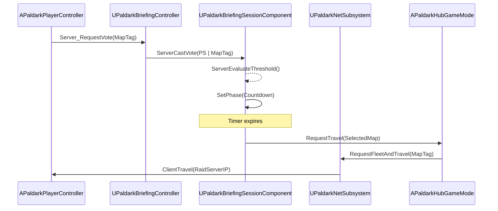
```mermaid
sequenceDiagram
    participant PC as APaldarkPlayerController
    participant BC as UPaldarkBriefingController
    participant BS as UPaldarkBriefingSessionComponent
    participant NS as UPaldarkNetSubsystem
    participant GM as APaldarkHubGameMode
    PC->>BC: Server_RequestVote(MapTag)
    BC->>BS: ServerCastVote(PS | MapTag)
    BS-->>BS: ServerEvaluateThreshold()
    BS->>BS: SetPhase(Countdown)
    Note over BS: Timer expires
    BS->>GM: RequestTravel(SelectedMap)
    GM->>NS: RequestFleetAndTravel(MapTag)
    NS->>PC: ClientTravel(RaidServerIP)
```

Sources:[Documents/Devlog/Q4-Milestone-Build.md#44](https://github.com/thanhtinpro/devin-paldarklab/blob/864c77b4/Documents/Devlog/Q4-Milestone-Build.md?plain=1#L44-L44)[Source/PaldarkLab/Public/Hub/PaldarkBriefingWidget.h#44-50](https://github.com/thanhtinpro/devin-paldarklab/blob/864c77b4/Source/PaldarkLab/Public/Hub/PaldarkBriefingWidget.h#L44-L50)[Documents/Devlog/W40-48-Build.md#44](https://github.com/thanhtinpro/devin-paldarklab/blob/864c77b4/Documents/Devlog/W40-48-Build.md?plain=1#L44-L44) (implied)

---

## Bug Bash and Quality Assurance

Each quarter concludes with a "Bug Bash" day to address architectural debt before moving to the next roadmap axis. Issues are tracked using a priority legend (P0-P3).

### Q3 Bug Bash Summary (Example)

| ID | Priority | Issue | Component | Resolution |
| --- | --- | --- | --- | --- |
| L-20 | P1 | `UPaldarkNetSubsystem` login events not exposed to BP | Network | Added `BlueprintAssignable` delegates `OnPlayerLogin/Logout` |
| L-21 | P1 | Game Feature plugins don't auto-activate | Core | Added `RequiredGameFeatures` array to `UPaldarkExperienceDefinition` |
| L-32 | P2 | Inventory performance at scale | Inventory | Migrated to `FFastArraySerializer` scaffold |

Sources:[Documents/Devlog/Q3-Bug-Bash.md#19-39](https://github.com/thanhtinpro/devin-paldarklab/blob/864c77b4/Documents/Devlog/Q3-Bug-Bash.md?plain=1#L19-L39)[Documents/Devlog/Q4-Milestone-Build.md#17-21](https://github.com/thanhtinpro/devin-paldarklab/blob/864c77b4/Documents/Devlog/Q4-Milestone-Build.md?plain=1#L17-L21)

---

## Technical Devlogs Index

- W20-21 (Hostile AI): Details the implementation of `APaldarkPalCharacter_Direhound` and the `UPaldarkActivity_Patrol` logic [Documents/Devlog/W20-21-Build.md#1-134](https://github.com/thanhtinpro/devin-paldarklab/blob/864c77b4/Documents/Devlog/W20-21-Build.md?plain=1#L1-L134)
- W24-25 (Extraction Flow): Documents the server-authoritative match FSM and `APaldarkExtractionBeacon` logic [Documents/Devlog/W24-25-Build.md#1-180](https://github.com/thanhtinpro/devin-paldarklab/blob/864c77b4/Documents/Devlog/W24-25-Build.md?plain=1#L1-L180)
- Q1-Q4 Milestone Reports: High-level summaries of pillar coverage (Networking, GAS, AI, etc.) against roadmap targets [Documents/Devlog/Q1-Milestone-Build.md](https://github.com/thanhtinpro/devin-paldarklab/blob/864c77b4/Documents/Devlog/Q1-Milestone-Build.md?plain=1)[Documents/Devlog/Q2-Milestone-Build.md](https://github.com/thanhtinpro/devin-paldarklab/blob/864c77b4/Documents/Devlog/Q2-Milestone-Build.md?plain=1)[Documents/Devlog/Q3-Milestone-Build.md](https://github.com/thanhtinpro/devin-paldarklab/blob/864c77b4/Documents/Devlog/Q3-Milestone-Build.md?plain=1)[Documents/Devlog/Q4-Milestone-Build.md](https://github.com/thanhtinpro/devin-paldarklab/blob/864c77b4/Documents/Devlog/Q4-Milestone-Build.md?plain=1)

---

# Core-Framework-and-Experience-System

# Core Framework and Experience System
Relevant source files

- [Source/PaldarkLab/Private/Experience/PaldarkExperienceActionSet.cpp](https://github.com/thanhtinpro/devin-paldarklab/blob/864c77b4/Source/PaldarkLab/Private/Experience/PaldarkExperienceActionSet.cpp)
- [Source/PaldarkLab/Private/Experience/PaldarkExperienceDefinition.cpp](https://github.com/thanhtinpro/devin-paldarklab/blob/864c77b4/Source/PaldarkLab/Private/Experience/PaldarkExperienceDefinition.cpp)
- [Source/PaldarkLab/Private/Experience/PaldarkPawnData.cpp](https://github.com/thanhtinpro/devin-paldarklab/blob/864c77b4/Source/PaldarkLab/Private/Experience/PaldarkPawnData.cpp)
- [Source/PaldarkLab/Private/Framework/PaldarkAssetManager.cpp](https://github.com/thanhtinpro/devin-paldarklab/blob/864c77b4/Source/PaldarkLab/Private/Framework/PaldarkAssetManager.cpp)
- [Source/PaldarkLab/Private/Framework/PaldarkGameModeBase.cpp](https://github.com/thanhtinpro/devin-paldarklab/blob/864c77b4/Source/PaldarkLab/Private/Framework/PaldarkGameModeBase.cpp)
- [Source/PaldarkLab/Private/Pal/PaldarkHostilePackSubsystem.cpp](https://github.com/thanhtinpro/devin-paldarklab/blob/864c77b4/Source/PaldarkLab/Private/Pal/PaldarkHostilePackSubsystem.cpp)
- [Source/PaldarkLab/Private/Pal/PaldarkPalSpawnSubsystem.cpp](https://github.com/thanhtinpro/devin-paldarklab/blob/864c77b4/Source/PaldarkLab/Private/Pal/PaldarkPalSpawnSubsystem.cpp)
- [Source/PaldarkLab/Private/Subsystems/PaldarkLabWorldSubsystem.cpp](https://github.com/thanhtinpro/devin-paldarklab/blob/864c77b4/Source/PaldarkLab/Private/Subsystems/PaldarkLabWorldSubsystem.cpp)
- [Source/PaldarkLab/Public/Experience/PaldarkExperienceActionSet.h](https://github.com/thanhtinpro/devin-paldarklab/blob/864c77b4/Source/PaldarkLab/Public/Experience/PaldarkExperienceActionSet.h)
- [Source/PaldarkLab/Public/Experience/PaldarkExperienceDefinition.h](https://github.com/thanhtinpro/devin-paldarklab/blob/864c77b4/Source/PaldarkLab/Public/Experience/PaldarkExperienceDefinition.h)
- [Source/PaldarkLab/Public/Experience/PaldarkPawnData.h](https://github.com/thanhtinpro/devin-paldarklab/blob/864c77b4/Source/PaldarkLab/Public/Experience/PaldarkPawnData.h)
- [Source/PaldarkLab/Public/Framework/PaldarkAssetManager.h](https://github.com/thanhtinpro/devin-paldarklab/blob/864c77b4/Source/PaldarkLab/Public/Framework/PaldarkAssetManager.h)
- [Source/PaldarkLab/Public/Framework/PaldarkGameModeBase.h](https://github.com/thanhtinpro/devin-paldarklab/blob/864c77b4/Source/PaldarkLab/Public/Framework/PaldarkGameModeBase.h)
- [Source/PaldarkLab/Public/Pal/PaldarkHostilePackSubsystem.h](https://github.com/thanhtinpro/devin-paldarklab/blob/864c77b4/Source/PaldarkLab/Public/Pal/PaldarkHostilePackSubsystem.h)

The Experience System in PaldarkLab is a data-driven orchestration layer inspired by the Lyra Starter Game. It decouples game logic from specific levels, allowing designers to define the "rules of engagement"—including pawn classes, input configurations, granted abilities, and game feature plugins—via `UPaldarkExperienceDefinition` data assets. This system ensures that the same map can host different game modes (e.g., a 4-player Raid vs. an 8-player Hub Town) simply by changing a URL parameter.

### System Overview

The framework centers on a handshake between the `APaldarkGameModeBase` (server-side orchestrator) and the `UPaldarkAssetManager`. When a session starts, the GameMode resolves which experience to load, async-loads the required assets, and applies overrides to the global game state.

Experience Loading Flow:

1. Resolution: `APaldarkGameModeBase` parses the `?Experience=` URL option.
2. Async Loading: `UPaldarkAssetManager` loads the `UPaldarkExperienceDefinition` and its bundled `UPaldarkPawnData`.
3. Activation: The GameMode applies class overrides (PlayerController, PlayerState) and grants initial tags/abilities.
4. Replication: The resolved experience ID is mirrored to `APaldarkGameStateBase` so clients can synchronize their local systems (HUD, Input).

### Code Entity Mapping

The following diagram illustrates how natural language concepts map to specific C++ classes and data assets within the framework.

Experience System Entity Map:

[Flowchart Diagram]

Sources: [Source/PaldarkLab/Public/Framework/PaldarkGameModeBase.h#5-16](https://github.com/thanhtinpro/devin-paldarklab/blob/864c77b4/Source/PaldarkLab/Public/Framework/PaldarkGameModeBase.h#L5-L16)[Source/PaldarkLab/Public/Experience/PaldarkExperienceDefinition.h#3-15](https://github.com/thanhtinpro/devin-paldarklab/blob/864c77b4/Source/PaldarkLab/Public/Experience/PaldarkExperienceDefinition.h#L3-L15)

### The Experience Pipeline

The pipeline is designed to be asynchronous to prevent hitching during map transitions. `APaldarkGameModeBase` acts as the primary driver for this lifecycle.

Framework Lifecycle:

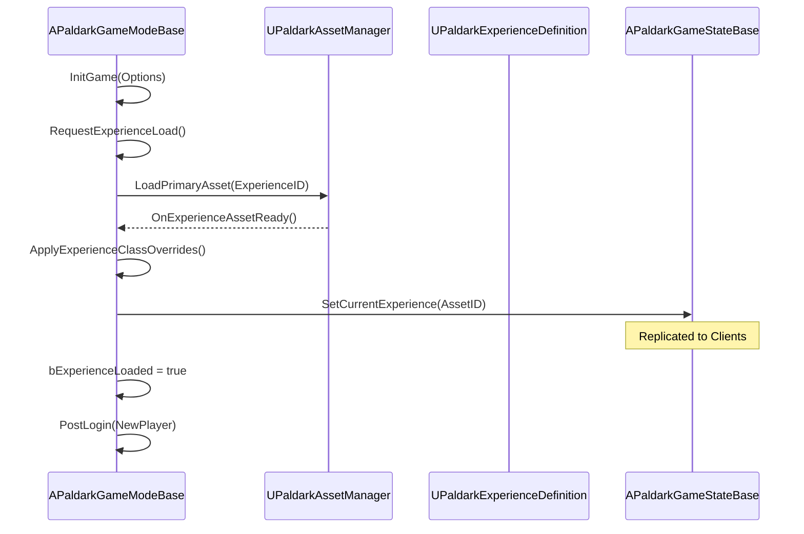
```mermaid
sequenceDiagram
    participant GM as APaldarkGameModeBase
    participant AM as UPaldarkAssetManager
    participant EXP as UPaldarkExperienceDefinition
    participant GS as APaldarkGameStateBase
    GM->>GM: InitGame(Options)
    GM->>GM: RequestExperienceLoad()
    GM->>AM: LoadPrimaryAsset(ExperienceID)
    AM-->>GM: OnExperienceAssetReady()
    GM->>GM: ApplyExperienceClassOverrides()
    GM->>GS: SetCurrentExperience(AssetID)
    Note over GS: Replicated to Clients
    GM->>GM: bExperienceLoaded = true
    GM->>GM: PostLogin(NewPlayer)
```

Sources: [Source/PaldarkLab/Private/Framework/PaldarkGameModeBase.cpp#36-43](https://github.com/thanhtinpro/devin-paldarklab/blob/864c77b4/Source/PaldarkLab/Private/Framework/PaldarkGameModeBase.cpp#L36-L43)[Source/PaldarkLab/Private/Framework/PaldarkGameModeBase.cpp#161-209](https://github.com/thanhtinpro/devin-paldarklab/blob/864c77b4/Source/PaldarkLab/Private/Framework/PaldarkGameModeBase.cpp#L161-L209)

### Component Sub-Systems

The framework is supported by several specialized subsystems that handle specific aspects of the game world:

| Subsystem | Responsibility |
| --- | --- |
| `UPaldarkAssetManager` | Handles synchronous and asynchronous loading of Primary Assets (Experiences, PawnData). [Source/PaldarkLab/Private/Framework/PaldarkAssetManager.cpp#20-49](https://github.com/thanhtinpro/devin-paldarklab/blob/864c77b4/Source/PaldarkLab/Private/Framework/PaldarkAssetManager.cpp#L20-L49) |
| `UPaldarkPalSpawnSubsystem` | Manages "Pre-Warming" of Pal assets during experience load to prevent runtime hitches. [Source/PaldarkLab/Private/Pal/PaldarkPalSpawnSubsystem.cpp#71-137](https://github.com/thanhtinpro/devin-paldarklab/blob/864c77b4/Source/PaldarkLab/Private/Pal/PaldarkPalSpawnSubsystem.cpp#L71-L137) |
| `UPaldarkHostilePackSubsystem` | Coordinates AI threat sharing within specific "Packs" (e.g., Direhound packs). [Source/PaldarkLab/Public/Pal/PaldarkHostilePackSubsystem.h#3-9](https://github.com/thanhtinpro/devin-paldarklab/blob/864c77b4/Source/PaldarkLab/Public/Pal/PaldarkHostilePackSubsystem.h#L3-L9) |
| `UPaldarkLabWorldSubsystem` | A tickable utility for tracking specific actors in the live world. [Source/PaldarkLab/Private/Subsystems/PaldarkLabWorldSubsystem.cpp#1-5](https://github.com/thanhtinpro/devin-paldarklab/blob/864c77b4/Source/PaldarkLab/Private/Subsystems/PaldarkLabWorldSubsystem.cpp#L1-L5) |

### Detailed Sub-Pages

For in-depth technical documentation on the framework's constituents, refer to the following child pages:

#### [Experience Loading Pipeline](#2.1)

Covers the step-by-step logic of `APaldarkGameModeBase`, including URL parsing, `UPaldarkExperienceActionSet` application, and the validation of `RequiredGameFeatures`.

- Key Files: `PaldarkGameModeBase.cpp`, `PaldarkExperienceDefinition.h`

#### [Pawn Data and Input Configuration](#2.2)

Explains how `UPaldarkPawnData` links a Pawn class to its `UPaldarkInputConfig`. Details the Enhanced Input binding process where Gameplay Tags are mapped to `UInputAction` assets.

- Key Files: `PaldarkPawnData.h`, `PaldarkInputConfig.h`

#### [Gameplay Tags and Native Tag Registry](#2.3)

Documents the centralized tag system used for everything from input and state to squad commands and network modes.

- Key Files: `PaldarkGameplayTags.h` (in PaldarkLabCore)

---

Sources:

- [Source/PaldarkLab/Public/Framework/PaldarkGameModeBase.h#1-113](https://github.com/thanhtinpro/devin-paldarklab/blob/864c77b4/Source/PaldarkLab/Public/Framework/PaldarkGameModeBase.h#L1-L113)
- [Source/PaldarkLab/Public/Experience/PaldarkExperienceDefinition.h#1-115](https://github.com/thanhtinpro/devin-paldarklab/blob/864c77b4/Source/PaldarkLab/Public/Experience/PaldarkExperienceDefinition.h#L1-L115)
- [Source/PaldarkLab/Public/Experience/PaldarkPawnData.h#1-142](https://github.com/thanhtinpro/devin-paldarklab/blob/864c77b4/Source/PaldarkLab/Public/Experience/PaldarkPawnData.h#L1-L142)
- [Source/PaldarkLab/Private/Framework/PaldarkAssetManager.cpp#1-63](https://github.com/thanhtinpro/devin-paldarklab/blob/864c77b4/Source/PaldarkLab/Private/Framework/PaldarkAssetManager.cpp#L1-L63)
- [Source/PaldarkLab/Public/Pal/PaldarkHostilePackSubsystem.h#1-100](https://github.com/thanhtinpro/devin-paldarklab/blob/864c77b4/Source/PaldarkLab/Public/Pal/PaldarkHostilePackSubsystem.h#L1-L100)

---

# Experience-Loading-Pipeline

# Experience Loading Pipeline
Relevant source files

- [Config/DefaultEngine.ini](https://github.com/thanhtinpro/devin-paldarklab/blob/864c77b4/Config/DefaultEngine.ini)
- [Config/DefaultGame.ini](https://github.com/thanhtinpro/devin-paldarklab/blob/864c77b4/Config/DefaultGame.ini)
- [PaldarkLab.uproject](https://github.com/thanhtinpro/devin-paldarklab/blob/864c77b4/PaldarkLab.uproject)
- [Source/PaldarkLab/Private/Experience/PaldarkExperienceActionSet.cpp](https://github.com/thanhtinpro/devin-paldarklab/blob/864c77b4/Source/PaldarkLab/Private/Experience/PaldarkExperienceActionSet.cpp)
- [Source/PaldarkLab/Private/Experience/PaldarkExperienceDefinition.cpp](https://github.com/thanhtinpro/devin-paldarklab/blob/864c77b4/Source/PaldarkLab/Private/Experience/PaldarkExperienceDefinition.cpp)
- [Source/PaldarkLab/Private/Experience/PaldarkPawnData.cpp](https://github.com/thanhtinpro/devin-paldarklab/blob/864c77b4/Source/PaldarkLab/Private/Experience/PaldarkPawnData.cpp)
- [Source/PaldarkLab/Private/Framework/PaldarkAssetManager.cpp](https://github.com/thanhtinpro/devin-paldarklab/blob/864c77b4/Source/PaldarkLab/Private/Framework/PaldarkAssetManager.cpp)
- [Source/PaldarkLab/Private/Framework/PaldarkGameModeBase.cpp](https://github.com/thanhtinpro/devin-paldarklab/blob/864c77b4/Source/PaldarkLab/Private/Framework/PaldarkGameModeBase.cpp)
- [Source/PaldarkLab/Private/Framework/PaldarkGameStateBase.cpp](https://github.com/thanhtinpro/devin-paldarklab/blob/864c77b4/Source/PaldarkLab/Private/Framework/PaldarkGameStateBase.cpp)
- [Source/PaldarkLab/Private/Pal/PaldarkHostilePackSubsystem.cpp](https://github.com/thanhtinpro/devin-paldarklab/blob/864c77b4/Source/PaldarkLab/Private/Pal/PaldarkHostilePackSubsystem.cpp)
- [Source/PaldarkLab/Private/Pal/PaldarkPalSpawnSubsystem.cpp](https://github.com/thanhtinpro/devin-paldarklab/blob/864c77b4/Source/PaldarkLab/Private/Pal/PaldarkPalSpawnSubsystem.cpp)
- [Source/PaldarkLab/Private/Player/PaldarkPlayerState.cpp](https://github.com/thanhtinpro/devin-paldarklab/blob/864c77b4/Source/PaldarkLab/Private/Player/PaldarkPlayerState.cpp)
- [Source/PaldarkLab/Private/Subsystems/PaldarkLabWorldSubsystem.cpp](https://github.com/thanhtinpro/devin-paldarklab/blob/864c77b4/Source/PaldarkLab/Private/Subsystems/PaldarkLabWorldSubsystem.cpp)
- [Source/PaldarkLab/Public/Experience/PaldarkExperienceActionSet.h](https://github.com/thanhtinpro/devin-paldarklab/blob/864c77b4/Source/PaldarkLab/Public/Experience/PaldarkExperienceActionSet.h)
- [Source/PaldarkLab/Public/Experience/PaldarkExperienceDefinition.h](https://github.com/thanhtinpro/devin-paldarklab/blob/864c77b4/Source/PaldarkLab/Public/Experience/PaldarkExperienceDefinition.h)
- [Source/PaldarkLab/Public/Experience/PaldarkPawnData.h](https://github.com/thanhtinpro/devin-paldarklab/blob/864c77b4/Source/PaldarkLab/Public/Experience/PaldarkPawnData.h)
- [Source/PaldarkLab/Public/Framework/PaldarkAssetManager.h](https://github.com/thanhtinpro/devin-paldarklab/blob/864c77b4/Source/PaldarkLab/Public/Framework/PaldarkAssetManager.h)
- [Source/PaldarkLab/Public/Framework/PaldarkGameModeBase.h](https://github.com/thanhtinpro/devin-paldarklab/blob/864c77b4/Source/PaldarkLab/Public/Framework/PaldarkGameModeBase.h)
- [Source/PaldarkLab/Public/Pal/PaldarkHostilePackSubsystem.h](https://github.com/thanhtinpro/devin-paldarklab/blob/864c77b4/Source/PaldarkLab/Public/Pal/PaldarkHostilePackSubsystem.h)
- [Source/PaldarkLab/Public/Player/PaldarkPlayerState.h](https://github.com/thanhtinpro/devin-paldarklab/blob/864c77b4/Source/PaldarkLab/Public/Player/PaldarkPlayerState.h)

The Experience Loading Pipeline is a server-authoritative system responsible for orchestrating the transition between different gameplay modes (e.g., Hub Town vs. Raid). It leverages a data-driven approach inspired by the Lyra Starter Game, where a `UPaldarkExperienceDefinition` primary asset defines the entire rulebook for a session, including pawn classes, input configurations, and gameplay feature plugins.

## System Architecture

The pipeline is driven by `APaldarkGameModeBase`, which manages the lifecycle from URL parsing to state replication via `APaldarkGameStateBase`.

### Experience Loading Sequence

This diagram illustrates the flow from level initialization to the point where the experience is considered "Ready" for players.

Title: Experience Loading Flow

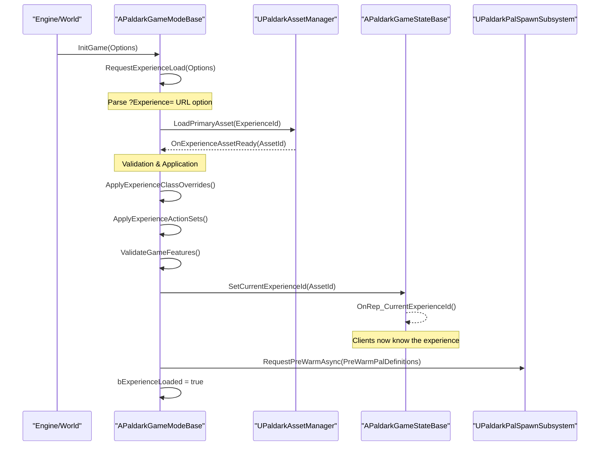
```mermaid
sequenceDiagram
    participant Engine as "Engine/World"
    participant GM as "APaldarkGameModeBase"
    participant AM as "UPaldarkAssetManager"
    participant GS as "APaldarkGameStateBase"
    participant SS as "UPaldarkPalSpawnSubsystem"
    Engine->>GM: InitGame(Options)
    GM->>GM: RequestExperienceLoad(Options)
    Note over GM: Parse ?Experience= URL option
    GM->>AM: LoadPrimaryAsset(ExperienceId)
    AM-->>GM: OnExperienceAssetReady(AssetId)
    Note over GM: Validation & Application
    GM->>GM: ApplyExperienceClassOverrides()
    GM->>GM: ApplyExperienceActionSets()
    GM->>GM: ValidateGameFeatures()
    GM->>GS: SetCurrentExperienceId(AssetId)
    GS-->>GS: OnRep_CurrentExperienceId()
    Note over GS: Clients now know the experience
    GM->>SS: RequestPreWarmAsync(PreWarmPalDefinitions)
    GM->>GM: bExperienceLoaded = true
```

Sources:[Source/PaldarkLab/Private/Framework/PaldarkGameModeBase.cpp#36-43](https://github.com/thanhtinpro/devin-paldarklab/blob/864c77b4/Source/PaldarkLab/Private/Framework/PaldarkGameModeBase.cpp#L36-L43)[Source/PaldarkLab/Private/Framework/PaldarkGameModeBase.cpp#161-209](https://github.com/thanhtinpro/devin-paldarklab/blob/864c77b4/Source/PaldarkLab/Private/Framework/PaldarkGameModeBase.cpp#L161-L209)[Source/PaldarkLab/Private/Framework/PaldarkGameModeBase.cpp#211-230](https://github.com/thanhtinpro/devin-paldarklab/blob/864c77b4/Source/PaldarkLab/Private/Framework/PaldarkGameModeBase.cpp#L211-L230)

---

## Data Entities and Definitions

The system relies on several key `UPrimaryDataAsset` types registered in `DefaultGame.ini`.

### UPaldarkExperienceDefinition

The top-level asset that aggregates all requirements for a play session.

- DefaultPawnData: Points to the `UPaldarkPawnData` for player spawning [Source/PaldarkLab/Public/Experience/PaldarkExperienceDefinition.h#47](https://github.com/thanhtinpro/devin-paldarklab/blob/864c77b4/Source/PaldarkLab/Public/Experience/PaldarkExperienceDefinition.h#L47-L47)
- ActionSets: A list of `UPaldarkExperienceActionSet` assets that provide additive tags and features [Source/PaldarkLab/Public/Experience/PaldarkExperienceDefinition.h#58](https://github.com/thanhtinpro/devin-paldarklab/blob/864c77b4/Source/PaldarkLab/Public/Experience/PaldarkExperienceDefinition.h#L58-L58)
- RequiredGameFeatures: List of plugin names (e.g., "PaldarkRaidContent") that must be active [Source/PaldarkLab/Public/Experience/PaldarkExperienceDefinition.h#135](https://github.com/thanhtinpro/devin-paldarklab/blob/864c77b4/Source/PaldarkLab/Public/Experience/PaldarkExperienceDefinition.h#L135-L135)
- PreWarmPalDefinitions: List of Pal species to async-load immediately to prevent hitches during combat [Source/PaldarkLab/Public/Experience/PaldarkExperienceDefinition.h#101](https://github.com/thanhtinpro/devin-paldarklab/blob/864c77b4/Source/PaldarkLab/Public/Experience/PaldarkExperienceDefinition.h#L101-L101)

### UPaldarkPawnData

Defines the "what" and "how" of player control.

- PawnClass: The actual actor class to spawn [Source/PaldarkLab/Public/Experience/PaldarkPawnData.h#86](https://github.com/thanhtinpro/devin-paldarklab/blob/864c77b4/Source/PaldarkLab/Public/Experience/PaldarkPawnData.h#L86-L86)
- DefaultMappingContexts: List of `FPaldarkMappingContextAndPriority` for Enhanced Input [Source/PaldarkLab/Public/Experience/PaldarkPawnData.h#98](https://github.com/thanhtinpro/devin-paldarklab/blob/864c77b4/Source/PaldarkLab/Public/Experience/PaldarkPawnData.h#L98-L98)
- GrantedAbilities: GAS abilities granted to the player on possession [Source/PaldarkLab/Public/Experience/PaldarkPawnData.h#118](https://github.com/thanhtinpro/devin-paldarklab/blob/864c77b4/Source/PaldarkLab/Public/Experience/PaldarkPawnData.h#L118-L118)

Title: Experience Data Association

[Class Diagram]

Sources:[Source/PaldarkLab/Public/Experience/PaldarkExperienceDefinition.h#33-140](https://github.com/thanhtinpro/devin-paldarklab/blob/864c77b4/Source/PaldarkLab/Public/Experience/PaldarkExperienceDefinition.h#L33-L140)[Source/PaldarkLab/Public/Experience/PaldarkPawnData.h#76-142](https://github.com/thanhtinpro/devin-paldarklab/blob/864c77b4/Source/PaldarkLab/Public/Experience/PaldarkPawnData.h#L76-L142)

---

## Implementation Details

### URL Option Parsing

The `APaldarkGameModeBase::RequestExperienceLoad` function resolves the experience ID using the following priority:

1. URL Option: `?Experience=PaldarkExperience.Name`[Source/PaldarkLab/Private/Framework/PaldarkGameModeBase.cpp#164](https://github.com/thanhtinpro/devin-paldarklab/blob/864c77b4/Source/PaldarkLab/Private/Framework/PaldarkGameModeBase.cpp#L164-L164)
2. Default Experience: The `DefaultExperience` property configured in `DefaultGame.ini`[Source/PaldarkLab/Private/Framework/PaldarkGameModeBase.cpp#165-169](https://github.com/thanhtinpro/devin-paldarklab/blob/864c77b4/Source/PaldarkLab/Private/Framework/PaldarkGameModeBase.cpp#L165-L169)

### Async Asset Loading

Assets are loaded via `UPaldarkAssetManager`. The GameMode uses `LoadPrimaryAsset` with an empty bundle list for the definition itself, but specific sub-systems like `UPaldarkPalSpawnSubsystem` use the "Spawn" bundle to pull in skeletal meshes and textures for Pals [Source/PaldarkLab/Private/Pal/PaldarkPalSpawnSubsystem.cpp#147-155](https://github.com/thanhtinpro/devin-paldarklab/blob/864c77b4/Source/PaldarkLab/Private/Pal/PaldarkPalSpawnSubsystem.cpp#L147-L155)

### Class Overrides and Validation

Once the asset is loaded, `APaldarkGameModeBase` applies runtime overrides:

- Controller/State Classes: If `PlayerControllerClass` or `PlayerStateClass` are defined in the experience, they replace the GameMode defaults [Source/PaldarkLab/Public/Experience/PaldarkExperienceDefinition.h#60-70](https://github.com/thanhtinpro/devin-paldarklab/blob/864c77b4/Source/PaldarkLab/Public/Experience/PaldarkExperienceDefinition.h#L60-L70)
- GameMode Assertion: The system checks `RequiredGameModeClass`. If the current GameMode is not a subclass of the requirement, it logs a critical error [Source/PaldarkLab/Public/Experience/PaldarkExperienceDefinition.h#71-81](https://github.com/thanhtinpro/devin-paldarklab/blob/864c77b4/Source/PaldarkLab/Public/Experience/PaldarkExperienceDefinition.h#L71-L81)
- Game Feature Validation: The system iterates `RequiredGameFeatures` and verifies they are enabled in the `UGameFeaturesSubsystem`[Source/PaldarkLab/Public/Experience/PaldarkExperienceDefinition.h#114-135](https://github.com/thanhtinpro/devin-paldarklab/blob/864c77b4/Source/PaldarkLab/Public/Experience/PaldarkExperienceDefinition.h#L114-L135)

### State Replication

The `ResolvedExperienceId` is set on the `APaldarkGameStateBase`. This property is replicated to all clients, triggering an `OnRep` function that allows client-side systems (like the HUD or Local Player Subsystem) to react to the loaded experience [Source/PaldarkLab/Public/Framework/PaldarkGameModeBase.h#87-90](https://github.com/thanhtinpro/devin-paldarklab/blob/864c77b4/Source/PaldarkLab/Public/Framework/PaldarkGameModeBase.h#L87-L90)

### Pal Pre-Warming

To prevent frame-rate hitches when a Pal is first spawned (e.g., during a raid), the `UPaldarkPalSpawnSubsystem` performs a "Pre-Warm".

- The GameMode calls `RequestPalDefinitionPreWarm`[Source/PaldarkLab/Public/Framework/PaldarkGameModeBase.h#85](https://github.com/thanhtinpro/devin-paldarklab/blob/864c77b4/Source/PaldarkLab/Public/Framework/PaldarkGameModeBase.h#L85-L85)
- The subsystem issues an async load for the `UPaldarkPalDefinition` using the Spawn bundle [Source/PaldarkLab/Private/Pal/PaldarkPalSpawnSubsystem.cpp#143-147](https://github.com/thanhtinpro/devin-paldarklab/blob/864c77b4/Source/PaldarkLab/Private/Pal/PaldarkPalSpawnSubsystem.cpp#L143-L147)
- This ensures the `SkeletalMesh` and `AnimInstance` are in memory before `SpawnPalAsync` is ever called [Source/PaldarkLab/Private/Pal/PaldarkPalSpawnSubsystem.cpp#180-184](https://github.com/thanhtinpro/devin-paldarklab/blob/864c77b4/Source/PaldarkLab/Private/Pal/PaldarkPalSpawnSubsystem.cpp#L180-L184)

Sources:[Source/PaldarkLab/Private/Framework/PaldarkGameModeBase.cpp#211-250](https://github.com/thanhtinpro/devin-paldarklab/blob/864c77b4/Source/PaldarkLab/Private/Framework/PaldarkGameModeBase.cpp#L211-L250)[Source/PaldarkLab/Private/Pal/PaldarkPalSpawnSubsystem.cpp#71-137](https://github.com/thanhtinpro/devin-paldarklab/blob/864c77b4/Source/PaldarkLab/Private/Pal/PaldarkPalSpawnSubsystem.cpp#L71-L137)[Source/PaldarkLab/Public/Framework/PaldarkGameModeBase.h#47-53](https://github.com/thanhtinpro/devin-paldarklab/blob/864c77b4/Source/PaldarkLab/Public/Framework/PaldarkGameModeBase.h#L47-L53)

---

# Pawn-Data-and-Input-Configuration

# Pawn Data and Input Configuration
Relevant source files

- [Config/DefaultInput.ini](https://github.com/thanhtinpro/devin-paldarklab/blob/864c77b4/Config/DefaultInput.ini)
- [Documents/UE5_Course/P04_Enhanced_Input.md](https://github.com/thanhtinpro/devin-paldarklab/blob/864c77b4/Documents/UE5_Course/P04_Enhanced_Input.md?plain=1)
- [Source/PaldarkLab/Private/Experience/PaldarkExperienceActionSet.cpp](https://github.com/thanhtinpro/devin-paldarklab/blob/864c77b4/Source/PaldarkLab/Private/Experience/PaldarkExperienceActionSet.cpp)
- [Source/PaldarkLab/Private/Experience/PaldarkExperienceDefinition.cpp](https://github.com/thanhtinpro/devin-paldarklab/blob/864c77b4/Source/PaldarkLab/Private/Experience/PaldarkExperienceDefinition.cpp)
- [Source/PaldarkLab/Private/Experience/PaldarkInputConfig.cpp](https://github.com/thanhtinpro/devin-paldarklab/blob/864c77b4/Source/PaldarkLab/Private/Experience/PaldarkInputConfig.cpp)
- [Source/PaldarkLab/Private/Experience/PaldarkPawnData.cpp](https://github.com/thanhtinpro/devin-paldarklab/blob/864c77b4/Source/PaldarkLab/Private/Experience/PaldarkPawnData.cpp)
- [Source/PaldarkLab/Private/Framework/PaldarkAssetManager.cpp](https://github.com/thanhtinpro/devin-paldarklab/blob/864c77b4/Source/PaldarkLab/Private/Framework/PaldarkAssetManager.cpp)
- [Source/PaldarkLab/Private/Pal/PaldarkPalCharacter.cpp](https://github.com/thanhtinpro/devin-paldarklab/blob/864c77b4/Source/PaldarkLab/Private/Pal/PaldarkPalCharacter.cpp)
- [Source/PaldarkLab/Private/Player/PaldarkCharacter.cpp](https://github.com/thanhtinpro/devin-paldarklab/blob/864c77b4/Source/PaldarkLab/Private/Player/PaldarkCharacter.cpp)
- [Source/PaldarkLab/Private/Player/PaldarkPlayerController.cpp](https://github.com/thanhtinpro/devin-paldarklab/blob/864c77b4/Source/PaldarkLab/Private/Player/PaldarkPlayerController.cpp)
- [Source/PaldarkLab/Public/Experience/PaldarkInputConfig.h](https://github.com/thanhtinpro/devin-paldarklab/blob/864c77b4/Source/PaldarkLab/Public/Experience/PaldarkInputConfig.h)
- [Source/PaldarkLab/Public/Experience/PaldarkPawnData.h](https://github.com/thanhtinpro/devin-paldarklab/blob/864c77b4/Source/PaldarkLab/Public/Experience/PaldarkPawnData.h)
- [Source/PaldarkLab/Public/Framework/PaldarkAssetManager.h](https://github.com/thanhtinpro/devin-paldarklab/blob/864c77b4/Source/PaldarkLab/Public/Framework/PaldarkAssetManager.h)
- [Source/PaldarkLab/Public/Pal/PaldarkPalCharacter.h](https://github.com/thanhtinpro/devin-paldarklab/blob/864c77b4/Source/PaldarkLab/Public/Pal/PaldarkPalCharacter.h)
- [Source/PaldarkLab/Public/Pal/PaldarkPalDefinition.h](https://github.com/thanhtinpro/devin-paldarklab/blob/864c77b4/Source/PaldarkLab/Public/Pal/PaldarkPalDefinition.h)
- [Source/PaldarkLab/Public/Player/PaldarkCharacter.h](https://github.com/thanhtinpro/devin-paldarklab/blob/864c77b4/Source/PaldarkLab/Public/Player/PaldarkCharacter.h)

The PaldarkLab framework utilizes a data-driven approach to pawn initialization and input handling, heavily inspired by the Lyra Experience pattern. By decoupling class references and input bindings into `UPaldarkPawnData` and `UPaldarkInputConfig` assets, the system allows designers to swap player behavior, abilities, and control schemes without modifying C++ code.

## UPaldarkPawnData

`UPaldarkPawnData` is the central "identity" asset for a player character within a specific experience [Source/PaldarkLab/Public/Experience/PaldarkPawnData.h#1-6](https://github.com/thanhtinpro/devin-paldarklab/blob/864c77b4/Source/PaldarkLab/Public/Experience/PaldarkPawnData.h#L1-L6) It acts as a bridge between the high-level `UPaldarkExperienceDefinition` and the physical `APaldarkCharacter` actor spawned in the world.

### Key Components of Pawn Data

| Property | Type | Description |
| --- | --- | --- |
| `PawnClass` | `TSoftClassPtr<APawn>` | The actual actor class to spawn for the player [Source/PaldarkLab/Public/Experience/PaldarkPawnData.h#86](https://github.com/thanhtinpro/devin-paldarklab/blob/864c77b4/Source/PaldarkLab/Public/Experience/PaldarkPawnData.h#L86-L86) |
| `DefaultMappingContexts` | `TArray<FPaldarkMappingContextAndPriority>` | A list of Enhanced Input Mapping Contexts (IMCs) and their priorities [Source/PaldarkLab/Public/Experience/PaldarkPawnData.h#98](https://github.com/thanhtinpro/devin-paldarklab/blob/864c77b4/Source/PaldarkLab/Public/Experience/PaldarkPawnData.h#L98-L98) |
| `InputConfig` | `TSoftObjectPtr<UPaldarkInputConfig>` | The mapping of Gameplay Tags to specific `UInputAction` assets [Source/PaldarkLab/Public/Experience/PaldarkPawnData.h#104](https://github.com/thanhtinpro/devin-paldarklab/blob/864c77b4/Source/PaldarkLab/Public/Experience/PaldarkPawnData.h#L104-L104) |
| `GrantedAbilities` | `TArray<TSoftClassPtr<UPaldarkGameplayAbility>>` | Abilities automatically granted to the player's Ability System Component (ASC) on possession [Source/PaldarkLab/Public/Experience/PaldarkPawnData.h#118](https://github.com/thanhtinpro/devin-paldarklab/blob/864c77b4/Source/PaldarkLab/Public/Experience/PaldarkPawnData.h#L118-L118) |
| `StartupEffects` | `TArray<TSoftClassPtr<UGameplayEffect>>` | Effects applied at startup (e.g., attribute initialization) [Source/PaldarkLab/Public/Experience/PaldarkPawnData.h#124](https://github.com/thanhtinpro/devin-paldarklab/blob/864c77b4/Source/PaldarkLab/Public/Experience/PaldarkPawnData.h#L124-L124) |
| `DefaultAnimInstanceClass` | `TSoftClassPtr<UPaldarkAnimInstance>` | The animation blueprint used to drive the character's skeletal mesh [Source/PaldarkLab/Public/Experience/PaldarkPawnData.h#139](https://github.com/thanhtinpro/devin-paldarklab/blob/864c77b4/Source/PaldarkLab/Public/Experience/PaldarkPawnData.h#L139-L139) |

Sources:[Source/PaldarkLab/Public/Experience/PaldarkPawnData.h#75-142](https://github.com/thanhtinpro/devin-paldarklab/blob/864c77b4/Source/PaldarkLab/Public/Experience/PaldarkPawnData.h#L75-L142)

## Enhanced Input Configuration

The input system moves away from legacy hardcoded strings to a tag-based lookup system defined in `UPaldarkInputConfig`. This allows `APaldarkCharacter` to bind logic to "Input Tags" rather than specific keys or `UInputAction` assets.

### Input Data Flow

The following diagram illustrates how a physical key press is translated into a gameplay action through the configuration assets.

Paldark Input Binding Pipeline

[Flowchart Diagram]

Sources:[Source/PaldarkLab/Public/Experience/PaldarkInputConfig.h](https://github.com/thanhtinpro/devin-paldarklab/blob/864c77b4/Source/PaldarkLab/Public/Experience/PaldarkInputConfig.h)[Documents/UE5_Course/P04_Enhanced_Input.md#71-135](https://github.com/thanhtinpro/devin-paldarklab/blob/864c77b4/Documents/UE5_Course/P04_Enhanced_Input.md?plain=1#L71-L135)

### UPaldarkInputConfig

This asset contains two primary arrays:

1. NativeInputActions: Maps tags like `Paldark.InputTag.Move` or `Paldark.InputTag.Look` to actions handled directly by the character class [Source/PaldarkLab/Public/Player/PaldarkCharacter.h#104-107](https://github.com/thanhtinpro/devin-paldarklab/blob/864c77b4/Source/PaldarkLab/Public/Player/PaldarkCharacter.h#L104-L107)
2. AbilityInputActions: Maps tags to actions that trigger Gameplay Abilities (e.g., `Paldark.InputTag.Sprint`, `Paldark.InputTag.Fire`) [Source/PaldarkLab/Public/Player/PaldarkCharacter.h#112-118](https://github.com/thanhtinpro/devin-paldarklab/blob/864c77b4/Source/PaldarkLab/Public/Player/PaldarkCharacter.h#L112-L118)

## Binding Pipeline in APaldarkCharacter

The `APaldarkCharacter` class manages the binding of inputs during the possession lifecycle.

### 1. Data Initialization

When `APaldarkPlayerController::OnPossess` is called, it resolves the `UPaldarkPawnData` from the current experience and passes it to the character via `SetPawnData`[Source/PaldarkLab/Private/Player/PaldarkPlayerController.cpp#138-142](https://github.com/thanhtinpro/devin-paldarklab/blob/864c77b4/Source/PaldarkLab/Private/Player/PaldarkPlayerController.cpp#L138-L142)

### 2. Native Action Binding

In `SetupPlayerInputComponent`, the character iterates through the `NativeInputActions` in the `InputConfig`. It uses `BindNativeInputActions` to link tags to C++ functions [Source/PaldarkLab/Private/Player/PaldarkCharacter.cpp#89](https://github.com/thanhtinpro/devin-paldarklab/blob/864c77b4/Source/PaldarkLab/Private/Player/PaldarkCharacter.cpp#L89-L89):

- `Paldark.InputTag.Move` -> `Input_Move`[Source/PaldarkLab/Private/Player/PaldarkCharacter.cpp#104](https://github.com/thanhtinpro/devin-paldarklab/blob/864c77b4/Source/PaldarkLab/Private/Player/PaldarkCharacter.cpp#L104-L104)
- `Paldark.InputTag.Look` -> `Input_Look`[Source/PaldarkLab/Private/Player/PaldarkCharacter.cpp#105](https://github.com/thanhtinpro/devin-paldarklab/blob/864c77b4/Source/PaldarkLab/Private/Player/PaldarkCharacter.cpp#L105-L105)
- `Paldark.InputTag.Jump` -> `Input_Jump_Pressed` / `Input_Jump_Released`[Source/PaldarkLab/Private/Player/PaldarkCharacter.cpp#106-107](https://github.com/thanhtinpro/devin-paldarklab/blob/864c77b4/Source/PaldarkLab/Private/Player/PaldarkCharacter.cpp#L106-L107)

### 3. Ability Action Binding

The `BindAbilityInputActions` function handles inputs that should interact with the Gameplay Ability System [Source/PaldarkLab/Public/Player/PaldarkCharacter.h#99](https://github.com/thanhtinpro/devin-paldarklab/blob/864c77b4/Source/PaldarkLab/Public/Player/PaldarkCharacter.h#L99-L99) These inputs typically trigger `TryActivateAbilityByTag` on the Ability System Component (ASC).

Initialization Sequence

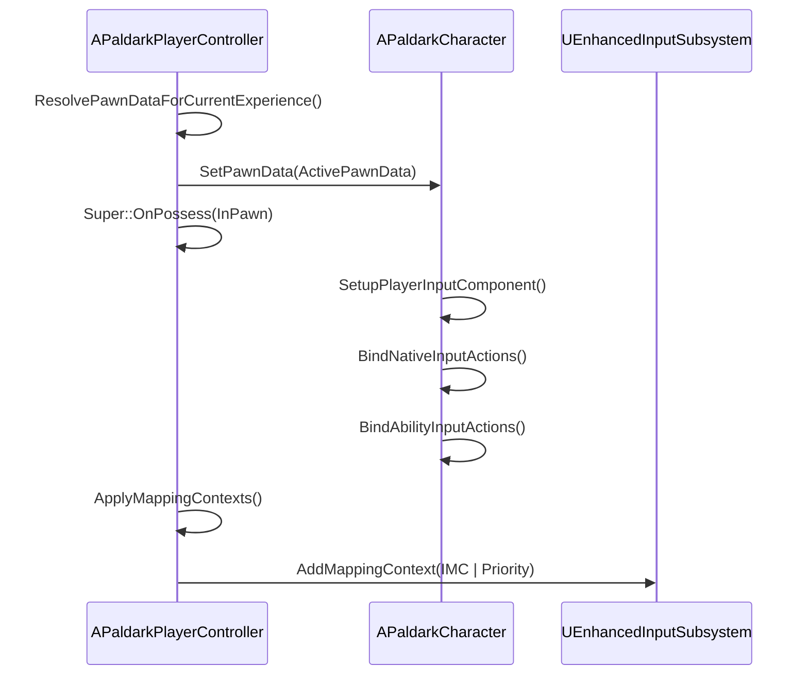
```mermaid
sequenceDiagram
    participant PC as APaldarkPlayerController
    participant Char as APaldarkCharacter
    participant Sub as UEnhancedInputSubsystem
    PC->>PC: ResolvePawnDataForCurrentExperience()
    PC->>Char: SetPawnData(ActivePawnData)
    PC->>PC: Super::OnPossess(InPawn)
    Char->>Char: SetupPlayerInputComponent()
    Char->>Char: BindNativeInputActions()
    Char->>Char: BindAbilityInputActions()
    PC->>PC: ApplyMappingContexts()
    PC->>Sub: AddMappingContext(IMC | Priority)
```

Sources:[Source/PaldarkLab/Private/Player/PaldarkPlayerController.cpp#133-150](https://github.com/thanhtinpro/devin-paldarklab/blob/864c77b4/Source/PaldarkLab/Private/Player/PaldarkPlayerController.cpp#L133-L150)[Source/PaldarkLab/Private/Player/PaldarkCharacter.cpp#84-118](https://github.com/thanhtinpro/devin-paldarklab/blob/864c77b4/Source/PaldarkLab/Private/Player/PaldarkCharacter.cpp#L84-L118)

## Pal Companion Configuration

`UPaldarkPawnData` also defines the `DefaultPalCompanions` array, using the `FPaldarkPalCompanionSpec` struct [Source/PaldarkLab/Public/Experience/PaldarkPawnData.h#33-51](https://github.com/thanhtinpro/devin-paldarklab/blob/864c77b4/Source/PaldarkLab/Public/Experience/PaldarkPawnData.h#L33-L51)

- PalClass: A soft class pointer to the `APaldarkPalCharacter` to be spawned [Source/PaldarkLab/Public/Experience/PaldarkPawnData.h#40](https://github.com/thanhtinpro/devin-paldarklab/blob/864c77b4/Source/PaldarkLab/Public/Experience/PaldarkPawnData.h#L40-L40)
- SpawnOffset: Determines where the Pal appears relative to the player (defaulting to behind and slightly to the side) [Source/PaldarkLab/Public/Experience/PaldarkPawnData.h#45](https://github.com/thanhtinpro/devin-paldarklab/blob/864c77b4/Source/PaldarkLab/Public/Experience/PaldarkPawnData.h#L45-L45)
- FollowDistanceOverride: Allows designers to tune the leashing distance per experience [Source/PaldarkLab/Public/Experience/PaldarkPawnData.h#50](https://github.com/thanhtinpro/devin-paldarklab/blob/864c77b4/Source/PaldarkLab/Public/Experience/PaldarkPawnData.h#L50-L50)

The `APaldarkPlayerController` (or specific debug commands) reads this list on possession to spawn and leash the Pal companions to the player character [Source/PaldarkLab/Public/Experience/PaldarkPawnData.h#28-31](https://github.com/thanhtinpro/devin-paldarklab/blob/864c77b4/Source/PaldarkLab/Public/Experience/PaldarkPawnData.h#L28-L31)

Sources:[Source/PaldarkLab/Public/Experience/PaldarkPawnData.h#28-51](https://github.com/thanhtinpro/devin-paldarklab/blob/864c77b4/Source/PaldarkLab/Public/Experience/PaldarkPawnData.h#L28-L51)[Source/PaldarkLab/Public/Pal/PaldarkPalCharacter.h#33-37](https://github.com/thanhtinpro/devin-paldarklab/blob/864c77b4/Source/PaldarkLab/Public/Pal/PaldarkPalCharacter.h#L33-L37)

---

# Gameplay-Tags-and-Native-Tag-Registry

# Gameplay Tags and Native Tag Registry
Relevant source files

- [Plugins/PaldarkRaidContent/Source/PaldarkRaidContent/Private/PaldarkRaidContent.cpp](https://github.com/thanhtinpro/devin-paldarklab/blob/864c77b4/Plugins/PaldarkRaidContent/Source/PaldarkRaidContent/Private/PaldarkRaidContent.cpp)
- [Source/PaldarkLabCore/Private/PaldarkGameplayTags.cpp](https://github.com/thanhtinpro/devin-paldarklab/blob/864c77b4/Source/PaldarkLabCore/Private/PaldarkGameplayTags.cpp)
- [Source/PaldarkLabCore/Private/PaldarkLabCore.cpp](https://github.com/thanhtinpro/devin-paldarklab/blob/864c77b4/Source/PaldarkLabCore/Private/PaldarkLabCore.cpp)
- [Source/PaldarkLabCore/Public/PaldarkGameplayTags.h](https://github.com/thanhtinpro/devin-paldarklab/blob/864c77b4/Source/PaldarkLabCore/Public/PaldarkGameplayTags.h)
- [Source/PaldarkLabCore/Public/PaldarkLabCore.h](https://github.com/thanhtinpro/devin-paldarklab/blob/864c77b4/Source/PaldarkLabCore/Public/PaldarkLabCore.h)
- [Source/PaldarkLabCore/Public/PaldarkLogCategories.h](https://github.com/thanhtinpro/devin-paldarklab/blob/864c77b4/Source/PaldarkLabCore/Public/PaldarkLogCategories.h)
- [scripts/ci/validate_paldarklab.py](https://github.com/thanhtinpro/devin-paldarklab/blob/864c77b4/scripts/ci/validate_paldarklab.py)

This page documents the centralized gameplay tag management system in PaldarkLab. To ensure type safety and compile-time validation, the project utilizes a native tag registry pattern within a dedicated core module. This approach prevents string-based errors and provides a single source of truth for the tags used across the experience, input, AI, and networking systems.

## Native Tag Architecture

PaldarkLab implements its native tags within the `PaldarkGameplayTags` namespace. This namespace is housed in the `PaldarkLabCore` module [Source/PaldarkLabCore/Public/PaldarkGameplayTags.h#23-24](https://github.com/thanhtinpro/devin-paldarklab/blob/864c77b4/Source/PaldarkLabCore/Public/PaldarkGameplayTags.h#L23-L24)

### PreDefault Loading Phase

The `PaldarkLabCore` module is configured with a `PreDefault` loading phase [scripts/ci/validate_paldarklab.py#33](https://github.com/thanhtinpro/devin-paldarklab/blob/864c77b4/scripts/ci/validate_paldarklab.py#L33-L33) This is a critical architectural requirement:

1. Dependency Resolution: Tags must be registered before the `PaldarkLab` (runtime) or `PaldarkLabEditor` modules attempt to reference them during their own initialization [Source/PaldarkLabCore/Public/PaldarkGameplayTags.h#7-9](https://github.com/thanhtinpro/devin-paldarklab/blob/864c77b4/Source/PaldarkLabCore/Public/PaldarkGameplayTags.h#L7-L9)
2. Static Initialization: Tag registration occurs via `UE_DEFINE_GAMEPLAY_TAG` macros in the `.cpp` file, which are executed during module load [Source/PaldarkLabCore/Private/PaldarkGameplayTags.cpp#6-8](https://github.com/thanhtinpro/devin-paldarklab/blob/864c77b4/Source/PaldarkLabCore/Private/PaldarkGameplayTags.cpp#L6-L8)

### Macro Implementation

The system uses the standard Unreal Engine native tag macros to expose tags to the rest of the C++ codebase:

- Header: `UE_DECLARE_GAMEPLAY_TAG_EXTERN` is used to declare the tag handle, making it accessible to other modules via the `PALDARKLABCORE_API` specifier [Source/PaldarkLabCore/Public/PaldarkGameplayTags.h#27](https://github.com/thanhtinpro/devin-paldarklab/blob/864c77b4/Source/PaldarkLabCore/Public/PaldarkGameplayTags.h#L27-L27)
- Source: `UE_DEFINE_GAMEPLAY_TAG` defines the tag and associates it with the actual string identifier used by the `UGameplayTagsManager`[Source/PaldarkLabCore/Private/PaldarkGameplayTags.cpp#9-12](https://github.com/thanhtinpro/devin-paldarklab/blob/864c77b4/Source/PaldarkLabCore/Private/PaldarkGameplayTags.cpp#L9-L12)

### Tag Registry Flow

The following diagram illustrates how native tags bridge the gap between C++ definitions and the Engine's tag manager.

Native Tag Registration and Lookup

[Flowchart Diagram]

Sources: [Source/PaldarkLabCore/Public/PaldarkGameplayTags.h#23-45](https://github.com/thanhtinpro/devin-paldarklab/blob/864c77b4/Source/PaldarkLabCore/Public/PaldarkGameplayTags.h#L23-L45)[Source/PaldarkLabCore/Private/PaldarkGameplayTags.cpp#1-20](https://github.com/thanhtinpro/devin-paldarklab/blob/864c77b4/Source/PaldarkLabCore/Private/PaldarkGameplayTags.cpp#L1-L20)

---

## Tag Taxonomy and Namespaces

The project follows a strict hierarchical naming convention, largely inspired by the Lyra Starter Game, to ensure the tag tree remains organized and searchable within the Project Settings [Source/PaldarkLabCore/Public/PaldarkGameplayTags.h#12-16](https://github.com/thanhtinpro/devin-paldarklab/blob/864c77b4/Source/PaldarkLabCore/Public/PaldarkGameplayTags.h#L12-L16)

### Core System Tags

| Namespace | Purpose | Example Tag |
| --- | --- | --- |
| `Paldark.Experience` | Gating the experience loading system [Source/PaldarkLabCore/Public/PaldarkGameplayTags.h#13](https://github.com/thanhtinpro/devin-paldarklab/blob/864c77b4/Source/PaldarkLabCore/Public/PaldarkGameplayTags.h#L13-L13) | `TAG_Paldark_Experience_RaidSandbox` |
| `Paldark.Pawn` | Pawn classification (Player vs Pal) [Source/PaldarkLabCore/Public/PaldarkGameplayTags.h#33-35](https://github.com/thanhtinpro/devin-paldarklab/blob/864c77b4/Source/PaldarkLabCore/Public/PaldarkGameplayTags.h#L33-L35) | `TAG_Paldark_Pawn_Pal` |
| `Paldark.Net` | Network roles and topology state [Source/PaldarkLabCore/Public/PaldarkGameplayTags.h#102-112](https://github.com/thanhtinpro/devin-paldarklab/blob/864c77b4/Source/PaldarkLabCore/Public/PaldarkGameplayTags.h#L102-L112) | `TAG_Paldark_Net_Mode_ListenServer` |
| `Paldark.Team` | Team identification for GAS filtering [Source/PaldarkLabCore/Private/PaldarkGameplayTags.cpp#90-91](https://github.com/thanhtinpro/devin-paldarklab/blob/864c77b4/Source/PaldarkLabCore/Private/PaldarkGameplayTags.cpp#L90-L91) | `TAG_Paldark_Team_Hostile` |

### Gameplay and AI Tags

| Namespace | Purpose | Example Tag |
| --- | --- | --- |
| `Paldark.InputTag` | Enhanced Input lookup keys [Source/PaldarkLabCore/Public/PaldarkGameplayTags.h#37-44](https://github.com/thanhtinpro/devin-paldarklab/blob/864c77b4/Source/PaldarkLabCore/Public/PaldarkGameplayTags.h#L37-L44) | `TAG_Paldark_InputTag_Look` |
| `Paldark.Ability` | GAS Ability identity and cancellation [Source/PaldarkLabCore/Public/PaldarkGameplayTags.h#52](https://github.com/thanhtinpro/devin-paldarklab/blob/864c77b4/Source/PaldarkLabCore/Public/PaldarkGameplayTags.h#L52-L52) | `TAG_Paldark_Ability_Sprint` |
| `Paldark.State` | Active states (e.g., Sprinting, Dead) [Source/PaldarkLabCore/Public/PaldarkGameplayTags.h#53-64](https://github.com/thanhtinpro/devin-paldarklab/blob/864c77b4/Source/PaldarkLabCore/Public/PaldarkGameplayTags.h#L53-L64) | `TAG_Paldark_State_IsDead` |
| `Paldark.Pal.Activity` | Pal FSM identity tags [Source/PaldarkLabCore/Public/PaldarkGameplayTags.h#74-80](https://github.com/thanhtinpro/devin-paldarklab/blob/864c77b4/Source/PaldarkLabCore/Public/PaldarkGameplayTags.h#L74-L80) | `TAG_Paldark_Pal_Activity_Follow` |
| `Paldark.Pal.Species` | Pal breed identification [Source/PaldarkLabCore/Private/PaldarkGameplayTags.cpp#97-98](https://github.com/thanhtinpro/devin-paldarklab/blob/864c77b4/Source/PaldarkLabCore/Private/PaldarkGameplayTags.cpp#L97-L98) | `TAG_Paldark_Pal_Species_Direhound` |

### Specialized Systems

- SetByCaller: Used for passing magnitudes to Gameplay Effect execution calculations. For example, `TAG_Paldark_SetByCaller_BaseDamage` allows the combat system to inject dynamic damage values into an effect spec [Source/PaldarkLabCore/Public/PaldarkGameplayTags.h#71-72](https://github.com/thanhtinpro/devin-paldarklab/blob/864c77b4/Source/PaldarkLabCore/Public/PaldarkGameplayTags.h#L71-L72)
- LagComp: Used to categorize the results of server-side rewind traces (e.g., `TAG_Paldark_LagComp_HitConfirmed`) [Source/PaldarkLabCore/Public/PaldarkGameplayTags.h#114-120](https://github.com/thanhtinpro/devin-paldarklab/blob/864c77b4/Source/PaldarkLabCore/Public/PaldarkGameplayTags.h#L114-L120)
- Squad Commands: Facilitates the Pal ordering system, using tags like `Paldark.Squad.Command.Attack` to broadcast instructions to Pal AI [Source/PaldarkLabCore/Private/PaldarkGameplayTags.cpp#108-111](https://github.com/thanhtinpro/devin-paldarklab/blob/864c77b4/Source/PaldarkLabCore/Private/PaldarkGameplayTags.cpp#L108-L111)

---

## Data Flow: Input to Ability

The most common use of native tags in PaldarkLab is the mapping of hardware input to Gameplay Abilities via `UPaldarkInputConfig`.

Input Mapping Pipeline

[Flowchart Diagram]

Sources: [Source/PaldarkLabCore/Public/PaldarkGameplayTags.h#37-44](https://github.com/thanhtinpro/devin-paldarklab/blob/864c77b4/Source/PaldarkLabCore/Public/PaldarkGameplayTags.h#L37-L44)[Source/PaldarkLabCore/Private/PaldarkGameplayTags.cpp#17-19](https://github.com/thanhtinpro/devin-paldarklab/blob/864c77b4/Source/PaldarkLabCore/Private/PaldarkGameplayTags.cpp#L17-L19)

### Validation and Maintenance

The `validate_paldarklab.py` CI script ensures that the `PaldarkGameplayTags` registry remains consistent. It checks that the header and source files exist in the `PaldarkLabCore` module and verifies that key framework tags required for the experience system are present [scripts/ci/validate_paldarklab.py#121-136](https://github.com/thanhtinpro/devin-paldarklab/blob/864c77b4/scripts/ci/validate_paldarklab.py#L121-L136)

Sources:

- [Source/PaldarkLabCore/Public/PaldarkGameplayTags.h#1-120](https://github.com/thanhtinpro/devin-paldarklab/blob/864c77b4/Source/PaldarkLabCore/Public/PaldarkGameplayTags.h#L1-L120)
- [Source/PaldarkLabCore/Private/PaldarkGameplayTags.cpp#1-111](https://github.com/thanhtinpro/devin-paldarklab/blob/864c77b4/Source/PaldarkLabCore/Private/PaldarkGameplayTags.cpp#L1-L111)
- [Source/PaldarkLabCore/Private/PaldarkLabCore.cpp#1-26](https://github.com/thanhtinpro/devin-paldarklab/blob/864c77b4/Source/PaldarkLabCore/Private/PaldarkLabCore.cpp#L1-L26)
- [scripts/ci/validate_paldarklab.py#31-35](https://github.com/thanhtinpro/devin-paldarklab/blob/864c77b4/scripts/ci/validate_paldarklab.py#L31-L35)
- [scripts/ci/validate_paldarklab.py#121-136](https://github.com/thanhtinpro/devin-paldarklab/blob/864c77b4/scripts/ci/validate_paldarklab.py#L121-L136)

---

# Player-Character-System

# Player Character System
Relevant source files

- [Source/PaldarkLab/Private/Framework/PaldarkGameStateBase.cpp](https://github.com/thanhtinpro/devin-paldarklab/blob/864c77b4/Source/PaldarkLab/Private/Framework/PaldarkGameStateBase.cpp)
- [Source/PaldarkLab/Private/Pal/PaldarkPalCharacter.cpp](https://github.com/thanhtinpro/devin-paldarklab/blob/864c77b4/Source/PaldarkLab/Private/Pal/PaldarkPalCharacter.cpp)
- [Source/PaldarkLab/Private/Player/PaldarkCharacter.cpp](https://github.com/thanhtinpro/devin-paldarklab/blob/864c77b4/Source/PaldarkLab/Private/Player/PaldarkCharacter.cpp)
- [Source/PaldarkLab/Private/Player/PaldarkPlayerController.cpp](https://github.com/thanhtinpro/devin-paldarklab/blob/864c77b4/Source/PaldarkLab/Private/Player/PaldarkPlayerController.cpp)
- [Source/PaldarkLab/Private/Player/PaldarkPlayerState.cpp](https://github.com/thanhtinpro/devin-paldarklab/blob/864c77b4/Source/PaldarkLab/Private/Player/PaldarkPlayerState.cpp)
- [Source/PaldarkLab/Public/Pal/PaldarkPalCharacter.h](https://github.com/thanhtinpro/devin-paldarklab/blob/864c77b4/Source/PaldarkLab/Public/Pal/PaldarkPalCharacter.h)
- [Source/PaldarkLab/Public/Pal/PaldarkPalDefinition.h](https://github.com/thanhtinpro/devin-paldarklab/blob/864c77b4/Source/PaldarkLab/Public/Pal/PaldarkPalDefinition.h)
- [Source/PaldarkLab/Public/Player/PaldarkCharacter.h](https://github.com/thanhtinpro/devin-paldarklab/blob/864c77b4/Source/PaldarkLab/Public/Player/PaldarkCharacter.h)
- [Source/PaldarkLab/Public/Player/PaldarkPlayerController.h](https://github.com/thanhtinpro/devin-paldarklab/blob/864c77b4/Source/PaldarkLab/Public/Player/PaldarkPlayerController.h)
- [Source/PaldarkLab/Public/Player/PaldarkPlayerState.h](https://github.com/thanhtinpro/devin-paldarklab/blob/864c77b4/Source/PaldarkLab/Public/Player/PaldarkPlayerState.h)

The Player Character System in PaldarkLab follows a modular, component-based architecture designed for high extensibility and network-authoritative gameplay. It centers around a 13-slot component pattern on the character, a robust lifecycle management in the player controller, and a persistent state object that handles the Gameplay Ability System (GAS) integration.

## System Architecture Overview

The system is split into three primary classes that coordinate to manage the player's presence in the world, their inputs, and their persistent attributes.

### Core Entities

| Class | Responsibility |
| --- | --- |
| `APaldarkCharacter` | The physical representation (Pawn) in the world. Manages the 13-slot component suite and bone-accurate hitboxes for lag compensation. |
| `APaldarkPlayerController` | The "brain" of the player. Handles the transition between Hub and Raid, clock synchronization, and the granting of abilities from `UPaldarkPawnData`. |
| `APaldarkPlayerState` | The persistent data container. Owns the `UPaldarkAbilitySystemComponent` so that player attributes (Health, Stamina) and active effects survive pawn death and respawn. |

### Entity Relationships

This diagram illustrates how the core player entities relate to one another and the data assets that drive them.

Player Entity Relationship Diagram

[Flowchart Diagram]

Sources: [Source/PaldarkLab/Public/Player/PaldarkCharacter.h#62-69](https://github.com/thanhtinpro/devin-paldarklab/blob/864c77b4/Source/PaldarkLab/Public/Player/PaldarkCharacter.h#L62-L69)[Source/PaldarkLab/Private/Player/PaldarkPlayerController.cpp#133-166](https://github.com/thanhtinpro/devin-paldarklab/blob/864c77b4/Source/PaldarkLab/Private/Player/PaldarkPlayerController.cpp#L133-L166)[Source/PaldarkLab/Public/Player/PaldarkPlayerState.h#3-14](https://github.com/thanhtinpro/devin-paldarklab/blob/864c77b4/Source/PaldarkLab/Public/Player/PaldarkPlayerState.h#L3-L14)

---

## APaldarkCharacter and Component Slots

The `APaldarkCharacter` class uses a "Slot" pattern to maintain a stable C++ interface while allowing different subsystems to be developed independently. Instead of a monolithic character class, functionality is delegated to specialized components.

- 13-Slot Suite: Includes slots for Health, Combat, Damage, Stamina, Equipment, Inventory, Activity, Interaction, Locomotion, PalCompanion, Roster, LagComp, and Network.
- Lag Compensation: Features per-bone hitboxes (e.g., `head`, `pelvis`, `spine_03`) used by the `UPaldarkLagCompensationComponent` for server-side rewinding during hitscan combat.
- Team Identity: Implements `GetTeamTag` (defaulting to `Paldark.Team.Player`) which is used by Pal AI to differentiate between allies and threats.

For details on the component implementations and the death/loot-bag spawning logic, see [APaldarkCharacter and Component Slots](#3.1).

Sources: [Source/PaldarkLab/Private/Player/PaldarkCharacter.cpp#72-104](https://github.com/thanhtinpro/devin-paldarklab/blob/864c77b4/Source/PaldarkLab/Private/Player/PaldarkCharacter.cpp#L72-L104)[Source/PaldarkLab/Private/Player/PaldarkCharacter.cpp#122-138](https://github.com/thanhtinpro/devin-paldarklab/blob/864c77b4/Source/PaldarkLab/Private/Player/PaldarkCharacter.cpp#L122-L138)[Source/PaldarkLab/Public/Player/PaldarkCharacter.h#71-77](https://github.com/thanhtinpro/devin-paldarklab/blob/864c77b4/Source/PaldarkLab/Public/Player/PaldarkCharacter.h#L71-L77)

---

## Player Controller and Network Synchronization

`APaldarkPlayerController` manages the high-level player lifecycle and ensures the client and server remain synchronized, particularly regarding time and input.

- Pawn Data Resolution: During `OnPossess`, the controller resolves `UPaldarkPawnData` from the current experience and uses it to grant GAS abilities and apply Enhanced Input mapping contexts.
- Clock Synchronization: Implements a `ServerRequestServerTime` / `ClientReportServerTime` handshake to calculate `ClientServerDelta`. This allows `GetServerTime()` to provide a consistent timestamp for lag-compensated actions.
- Squad Coordination: Owns the RPCs for the ping system (`Server_RequestPing`) and the mark-enemy system (`Server_RequestMarkUnderCrosshair`).

For details on the time-sync handshake and squad RPCs, see [Player Controller and Network Synchronization](#3.2).

Sources: [Source/PaldarkLab/Private/Player/PaldarkPlayerController.cpp#133-166](https://github.com/thanhtinpro/devin-paldarklab/blob/864c77b4/Source/PaldarkLab/Private/Player/PaldarkPlayerController.cpp#L133-L166)[Source/PaldarkLab/Public/Player/PaldarkPlayerController.h#56-67](https://github.com/thanhtinpro/devin-paldarklab/blob/864c77b4/Source/PaldarkLab/Public/Player/PaldarkPlayerController.h#L56-L67)[Source/PaldarkLab/Public/Player/PaldarkPlayerController.h#81-90](https://github.com/thanhtinpro/devin-paldarklab/blob/864c77b4/Source/PaldarkLab/Public/Player/PaldarkPlayerController.h#L81-L90)

---

## APaldarkPlayerState and GAS Integration

Unlike typical AI pawns where the Ability System Component (ASC) lives on the Actor, `APaldarkCharacter` retrieves its ASC from the `APaldarkPlayerState`.

- Survival Across Death: By placing the `UPaldarkAbilitySystemComponent` and `UPaldarkAttributeSet` on the PlayerState, attributes like current health or experience points are preserved even if the Pawn is destroyed and recreated.
- Match Outcomes: Tracks the player's status within a raid (e.g., `Alive`, `Extracted`, `KIA`) and replicates `ExtractionProgress` for HUD updates.
- Pal Storage: Owns the `UPaldarkPalDepositComponent`, which acts as the persistent storage for a player's captured Pals.

Sources: [Source/PaldarkLab/Private/Player/PaldarkPlayerState.cpp#17-31](https://github.com/thanhtinpro/devin-paldarklab/blob/864c77b4/Source/PaldarkLab/Private/Player/PaldarkPlayerState.cpp#L17-L31)[Source/PaldarkLab/Public/Player/PaldarkPlayerState.h#59-64](https://github.com/thanhtinpro/devin-paldarklab/blob/864c77b4/Source/PaldarkLab/Public/Player/PaldarkPlayerState.h#L59-L64)[Source/PaldarkLab/Public/Player/PaldarkPlayerState.h#127-135](https://github.com/thanhtinpro/devin-paldarklab/blob/864c77b4/Source/PaldarkLab/Public/Player/PaldarkPlayerState.h#L127-L135)

---

## Animation System Integration

The character system links to the animation system via `UPaldarkAnimInstance`.

- Layered Animation: Uses `IPaldarkAnimLayerInterface` to allow different weapon types or locomotion styles to swap animation layers dynamically.
- Data-Driven: The `UPaldarkPawnData` defines the `DefaultAnimInstanceClass` used by the character mesh.
- Pal Animations: `UPaldarkPalAnimInstance` provides specialized logic for companion Pals, reading state from the Pal's locomotion and activity components.

For details on layer swapping and the animation state machines, see [Animation System](#3.3).

Sources: [Source/PaldarkLab/Public/Pal/PaldarkPalDefinition.h#83-88](https://github.com/thanhtinpro/devin-paldarklab/blob/864c77b4/Source/PaldarkLab/Public/Pal/PaldarkPalDefinition.h#L83-L88)[Source/PaldarkLab/Public/Player/PaldarkCharacter.h#120-126](https://github.com/thanhtinpro/devin-paldarklab/blob/864c77b4/Source/PaldarkLab/Public/Player/PaldarkCharacter.h#L120-L126)

---

## System Interaction Flow

The following sequence diagram shows how the system initializes during the possession lifecycle.

Player Possession and GAS Initialization

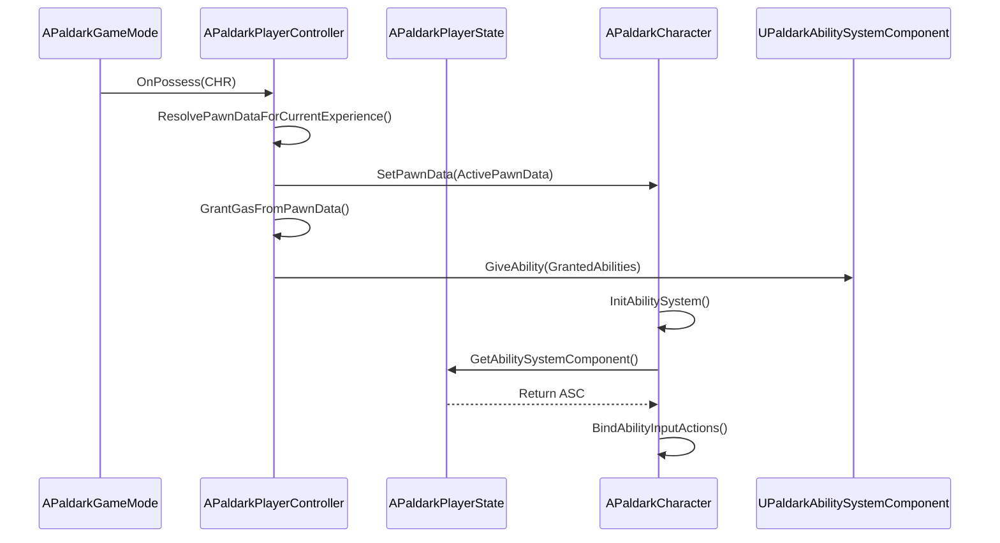
```mermaid
sequenceDiagram
    participant GM as APaldarkGameMode
    participant PC as APaldarkPlayerController
    participant PS as APaldarkPlayerState
    participant CHR as APaldarkCharacter
    participant ASC as UPaldarkAbilitySystemComponent
    GM->>PC: OnPossess(CHR)
    PC->>PC: ResolvePawnDataForCurrentExperience()
    PC->>CHR: SetPawnData(ActivePawnData)
    PC->>PC: GrantGasFromPawnData()
    PC->>ASC: GiveAbility(GrantedAbilities)
    CHR->>CHR: InitAbilitySystem()
    CHR->>PS: GetAbilitySystemComponent()
    PS-->>CHR: Return ASC
    CHR->>CHR: BindAbilityInputActions()
```

Sources: [Source/PaldarkLab/Private/Player/PaldarkPlayerController.cpp#133-166](https://github.com/thanhtinpro/devin-paldarklab/blob/864c77b4/Source/PaldarkLab/Private/Player/PaldarkPlayerController.cpp#L133-L166)[Source/PaldarkLab/Private/Player/PaldarkCharacter.cpp#94-99](https://github.com/thanhtinpro/devin-paldarklab/blob/864c77b4/Source/PaldarkLab/Private/Player/PaldarkCharacter.cpp#L94-L99)

---

# APaldarkCharacter-and-Component-Slots

# APaldarkCharacter and Component Slots
Relevant source files

- [Source/PaldarkLab/Private/Pal/PaldarkPalCharacter.cpp](https://github.com/thanhtinpro/devin-paldarklab/blob/864c77b4/Source/PaldarkLab/Private/Pal/PaldarkPalCharacter.cpp)
- [Source/PaldarkLab/Private/Player/Components/PaldarkPlayerActivityComponent.cpp](https://github.com/thanhtinpro/devin-paldarklab/blob/864c77b4/Source/PaldarkLab/Private/Player/Components/PaldarkPlayerActivityComponent.cpp)
- [Source/PaldarkLab/Private/Player/Components/PaldarkPlayerCombatComponent.cpp](https://github.com/thanhtinpro/devin-paldarklab/blob/864c77b4/Source/PaldarkLab/Private/Player/Components/PaldarkPlayerCombatComponent.cpp)
- [Source/PaldarkLab/Private/Player/Components/PaldarkPlayerDamageComponent.cpp](https://github.com/thanhtinpro/devin-paldarklab/blob/864c77b4/Source/PaldarkLab/Private/Player/Components/PaldarkPlayerDamageComponent.cpp)
- [Source/PaldarkLab/Private/Player/Components/PaldarkPlayerEquipmentComponent.cpp](https://github.com/thanhtinpro/devin-paldarklab/blob/864c77b4/Source/PaldarkLab/Private/Player/Components/PaldarkPlayerEquipmentComponent.cpp)
- [Source/PaldarkLab/Private/Player/Components/PaldarkPlayerHealthComponent.cpp](https://github.com/thanhtinpro/devin-paldarklab/blob/864c77b4/Source/PaldarkLab/Private/Player/Components/PaldarkPlayerHealthComponent.cpp)
- [Source/PaldarkLab/Private/Player/Components/PaldarkPlayerInteractionComponent.cpp](https://github.com/thanhtinpro/devin-paldarklab/blob/864c77b4/Source/PaldarkLab/Private/Player/Components/PaldarkPlayerInteractionComponent.cpp)
- [Source/PaldarkLab/Private/Player/Components/PaldarkPlayerLocomotionExtComponent.cpp](https://github.com/thanhtinpro/devin-paldarklab/blob/864c77b4/Source/PaldarkLab/Private/Player/Components/PaldarkPlayerLocomotionExtComponent.cpp)
- [Source/PaldarkLab/Private/Player/Components/PaldarkPlayerNetworkComponent.cpp](https://github.com/thanhtinpro/devin-paldarklab/blob/864c77b4/Source/PaldarkLab/Private/Player/Components/PaldarkPlayerNetworkComponent.cpp)
- [Source/PaldarkLab/Private/Player/Components/PaldarkPlayerPalCompanionComponent.cpp](https://github.com/thanhtinpro/devin-paldarklab/blob/864c77b4/Source/PaldarkLab/Private/Player/Components/PaldarkPlayerPalCompanionComponent.cpp)
- [Source/PaldarkLab/Private/Player/Components/PaldarkPlayerStaminaComponent.cpp](https://github.com/thanhtinpro/devin-paldarklab/blob/864c77b4/Source/PaldarkLab/Private/Player/Components/PaldarkPlayerStaminaComponent.cpp)
- [Source/PaldarkLab/Private/Player/PaldarkCharacter.cpp](https://github.com/thanhtinpro/devin-paldarklab/blob/864c77b4/Source/PaldarkLab/Private/Player/PaldarkCharacter.cpp)
- [Source/PaldarkLab/Private/Player/PaldarkPlayerController.cpp](https://github.com/thanhtinpro/devin-paldarklab/blob/864c77b4/Source/PaldarkLab/Private/Player/PaldarkPlayerController.cpp)
- [Source/PaldarkLab/Public/Pal/Components/PaldarkPalHealthComponent.h](https://github.com/thanhtinpro/devin-paldarklab/blob/864c77b4/Source/PaldarkLab/Public/Pal/Components/PaldarkPalHealthComponent.h)
- [Source/PaldarkLab/Public/Pal/PaldarkPalCharacter.h](https://github.com/thanhtinpro/devin-paldarklab/blob/864c77b4/Source/PaldarkLab/Public/Pal/PaldarkPalCharacter.h)
- [Source/PaldarkLab/Public/Pal/PaldarkPalDefinition.h](https://github.com/thanhtinpro/devin-paldarklab/blob/864c77b4/Source/PaldarkLab/Public/Pal/PaldarkPalDefinition.h)
- [Source/PaldarkLab/Public/Player/Components/PaldarkPlayerCombatComponent.h](https://github.com/thanhtinpro/devin-paldarklab/blob/864c77b4/Source/PaldarkLab/Public/Player/Components/PaldarkPlayerCombatComponent.h)
- [Source/PaldarkLab/Public/Player/Components/PaldarkPlayerDamageComponent.h](https://github.com/thanhtinpro/devin-paldarklab/blob/864c77b4/Source/PaldarkLab/Public/Player/Components/PaldarkPlayerDamageComponent.h)
- [Source/PaldarkLab/Public/Player/Components/PaldarkPlayerEquipmentComponent.h](https://github.com/thanhtinpro/devin-paldarklab/blob/864c77b4/Source/PaldarkLab/Public/Player/Components/PaldarkPlayerEquipmentComponent.h)
- [Source/PaldarkLab/Public/Player/Components/PaldarkPlayerHealthComponent.h](https://github.com/thanhtinpro/devin-paldarklab/blob/864c77b4/Source/PaldarkLab/Public/Player/Components/PaldarkPlayerHealthComponent.h)
- [Source/PaldarkLab/Public/Player/Components/PaldarkPlayerStaminaComponent.h](https://github.com/thanhtinpro/devin-paldarklab/blob/864c77b4/Source/PaldarkLab/Public/Player/Components/PaldarkPlayerStaminaComponent.h)
- [Source/PaldarkLab/Public/Player/PaldarkCharacter.h](https://github.com/thanhtinpro/devin-paldarklab/blob/864c77b4/Source/PaldarkLab/Public/Player/PaldarkCharacter.h)

The `APaldarkCharacter` class serves as the primary player pawn in PaldarkLab. It implements a 13-slot component architecture designed for modularity, allowing individual systems (GAS, Inventory, Squads, etc.) to be developed and integrated without constantly modifying the base character class. This architecture ensures that the character remains a stable entry point while delegating complex logic to specialized actor components.

## Component Slot Architecture

`APaldarkCharacter` defines 13 `TObjectPtr` slots in its header, which are initialized as default subobjects in the constructor [Source/PaldarkLab/Private/Player/PaldarkCharacter.cpp#75-104](https://github.com/thanhtinpro/devin-paldarklab/blob/864c77b4/Source/PaldarkLab/Private/Player/PaldarkCharacter.cpp#L75-L104) These slots are marked `VisibleAnywhere` and `BlueprintReadOnly`, enabling designers to swap specific component implementations in Blueprint subclasses without breaking C++ serialization or requiring re-instantiation [Source/PaldarkLab/Public/Player/PaldarkCharacter.h#132-152](https://github.com/thanhtinpro/devin-paldarklab/blob/864c77b4/Source/PaldarkLab/Public/Player/PaldarkCharacter.h#L132-L152)

### Player Component Slots (13 Slots)

| Slot Name | Component Class | Purpose |
| --- | --- | --- |
| HealthSlot | `UPaldarkPlayerHealthComponent` | Manages player vitals and death state [Source/PaldarkLab/Private/Player/PaldarkCharacter.cpp#75](https://github.com/thanhtinpro/devin-paldarklab/blob/864c77b4/Source/PaldarkLab/Private/Player/PaldarkCharacter.cpp#L75-L75) |
| StaminaSlot | `UPaldarkPlayerStaminaComponent` | Tracks stamina for sprinting and physical actions [Source/PaldarkLab/Private/Player/PaldarkCharacter.cpp#76](https://github.com/thanhtinpro/devin-paldarklab/blob/864c77b4/Source/PaldarkLab/Private/Player/PaldarkCharacter.cpp#L76-L76) |
| CombatSlot | `UPaldarkPlayerCombatComponent` | Manages weapon state and targeting [Source/PaldarkLab/Private/Player/PaldarkCharacter.cpp#77](https://github.com/thanhtinpro/devin-paldarklab/blob/864c77b4/Source/PaldarkLab/Private/Player/PaldarkCharacter.cpp#L77-L77) |
| InventorySlot | `UPaldarkPlayerInventoryComponent` | Handles item storage and weight [Source/PaldarkLab/Private/Player/PaldarkCharacter.cpp#78](https://github.com/thanhtinpro/devin-paldarklab/blob/864c77b4/Source/PaldarkLab/Private/Player/PaldarkCharacter.cpp#L78-L78) |
| EquipmentSlot | `UPaldarkPlayerEquipmentComponent` | Manages equipped gear and active items [Source/PaldarkLab/Private/Player/PaldarkCharacter.cpp#79](https://github.com/thanhtinpro/devin-paldarklab/blob/864c77b4/Source/PaldarkLab/Private/Player/PaldarkCharacter.cpp#L79-L79) |
| PalCompanionSlot | `UPaldarkPlayerPalCompanionComponent` | Manages active Pal companion logic [Source/PaldarkLab/Private/Player/PaldarkCharacter.cpp#80](https://github.com/thanhtinpro/devin-paldarklab/blob/864c77b4/Source/PaldarkLab/Private/Player/PaldarkCharacter.cpp#L80-L80) |
| LocomotionExtSlot | `UPaldarkPlayerLocomotionExtComponent` | Extended movement logic beyond standard CMC [Source/PaldarkLab/Private/Player/PaldarkCharacter.cpp#81](https://github.com/thanhtinpro/devin-paldarklab/blob/864c77b4/Source/PaldarkLab/Private/Player/PaldarkCharacter.cpp#L81-L81) |
| ActivitySlot | `UPaldarkPlayerActivityComponent` | Tracks player state machines (e.g., Harvesting, Looting) [Source/PaldarkLab/Private/Player/PaldarkCharacter.cpp#82](https://github.com/thanhtinpro/devin-paldarklab/blob/864c77b4/Source/PaldarkLab/Private/Player/PaldarkCharacter.cpp#L82-L82) |
| InteractionSlot | `UPaldarkPlayerInteractionComponent` | Manages world interaction traces [Source/PaldarkLab/Private/Player/PaldarkCharacter.cpp#83](https://github.com/thanhtinpro/devin-paldarklab/blob/864c77b4/Source/PaldarkLab/Private/Player/PaldarkCharacter.cpp#L83-L83) |
| NetworkSlot | `UPaldarkPlayerNetworkComponent` | Handles client-server synchronization tasks [Source/PaldarkLab/Private/Player/PaldarkCharacter.cpp#85](https://github.com/thanhtinpro/devin-paldarklab/blob/864c77b4/Source/PaldarkLab/Private/Player/PaldarkCharacter.cpp#L85-L85) |
| DamageSlot | `UPaldarkPlayerDamageComponent` | Processes incoming damage and hit reactions [Source/PaldarkLab/Private/Player/PaldarkCharacter.cpp#86](https://github.com/thanhtinpro/devin-paldarklab/blob/864c77b4/Source/PaldarkLab/Private/Player/PaldarkCharacter.cpp#L86-L86) |
| LagCompSlot | `UPaldarkLagCompensationComponent` | Server-side rewind and hit registration [Source/PaldarkLab/Private/Player/PaldarkCharacter.cpp#91](https://github.com/thanhtinpro/devin-paldarklab/blob/864c77b4/Source/PaldarkLab/Private/Player/PaldarkCharacter.cpp#L91-L91) |
| RosterSlot | `UPaldarkPlayerPalRosterComponent` | Match-scoped list of tamed Pals [Source/PaldarkLab/Private/Player/PaldarkCharacter.cpp#104](https://github.com/thanhtinpro/devin-paldarklab/blob/864c77b4/Source/PaldarkLab/Private/Player/PaldarkCharacter.cpp#L104-L104) |

Sources:[Source/PaldarkLab/Public/Player/PaldarkCharacter.h#132-152](https://github.com/thanhtinpro/devin-paldarklab/blob/864c77b4/Source/PaldarkLab/Public/Player/PaldarkCharacter.h#L132-L152)[Source/PaldarkLab/Private/Player/PaldarkCharacter.cpp#75-104](https://github.com/thanhtinpro/devin-paldarklab/blob/864c77b4/Source/PaldarkLab/Private/Player/PaldarkCharacter.cpp#L75-L104)

## Pawn Initialization and GAS Lifecycle

The character's lifecycle is driven by the `APaldarkPlayerController` and the experience's `UPaldarkPawnData`.

### SetPawnData and Input Binding

During `APaldarkPlayerController::OnPossess`, the controller resolves the `UPaldarkPawnData` from the current experience and passes it to the character via `SetPawnData`[Source/PaldarkLab/Private/Player/PaldarkPlayerController.cpp#138-143](https://github.com/thanhtinpro/devin-paldarklab/blob/864c77b4/Source/PaldarkLab/Private/Player/PaldarkPlayerController.cpp#L138-L143) This cached data is then used in `SetupPlayerInputComponent` to bind Move, Look, and Jump actions using the `UPaldarkInputConfig`[Source/PaldarkLab/Public/Player/PaldarkCharacter.h#84-89](https://github.com/thanhtinpro/devin-paldarklab/blob/864c77b4/Source/PaldarkLab/Public/Player/PaldarkCharacter.h#L84-L89)

### InitAbilitySystem

`APaldarkCharacter` implements a split GAS initialization pattern:

1. Server-side:`InitAbilitySystem` is called in `PossessedBy` once the `APaldarkPlayerState` is available [Source/PaldarkLab/Private/Player/PaldarkCharacter.cpp#94](https://github.com/thanhtinpro/devin-paldarklab/blob/864c77b4/Source/PaldarkLab/Private/Player/PaldarkCharacter.cpp#L94-L94)
2. Client-side:`InitAbilitySystem` is called in `OnRep_PlayerState` to ensure the autonomous proxy has a valid reference to the ASC owned by the PlayerState [Source/PaldarkLab/Public/Player/PaldarkCharacter.h#82](https://github.com/thanhtinpro/devin-paldarklab/blob/864c77b4/Source/PaldarkLab/Public/Player/PaldarkCharacter.h#L82-L82)

Sources:[Source/PaldarkLab/Private/Player/PaldarkPlayerController.cpp#133-166](https://github.com/thanhtinpro/devin-paldarklab/blob/864c77b4/Source/PaldarkLab/Private/Player/PaldarkPlayerController.cpp#L133-L166)[Source/PaldarkLab/Public/Player/PaldarkCharacter.h#91-94](https://github.com/thanhtinpro/devin-paldarklab/blob/864c77b4/Source/PaldarkLab/Public/Player/PaldarkCharacter.h#L91-L94)

## Lag Compensation and Hitboxes

To support high-precision hitscan combat, `APaldarkCharacter` defines a set of per-bone hitbox components used by the `UPaldarkLagCompensationComponent`.

### HitCollisionBoxes

The constructor initializes a static array of `FBoxSpec` structures defining bone names (e.g., `head`, `pelvis`, `upperarm_l`) and their corresponding extents [Source/PaldarkLab/Private/Player/PaldarkCharacter.cpp#122-138](https://github.com/thanhtinpro/devin-paldarklab/blob/864c77b4/Source/PaldarkLab/Private/Player/PaldarkCharacter.cpp#L122-L138) These `UBoxComponent` instances are attached to the skeletal mesh sockets.

- Default State: Set to `NoCollision` to avoid interfering with movement or live physics [Source/PaldarkLab/Private/Player/PaldarkCharacter.cpp#108-111](https://github.com/thanhtinpro/devin-paldarklab/blob/864c77b4/Source/PaldarkLab/Private/Player/PaldarkCharacter.cpp#L108-L111)
- Rewind State: During a server-side rewind trace, the lag compensation system snapshots their transforms and flips them to `QueryOnly`[Source/PaldarkLab/Private/Player/PaldarkCharacter.cpp#110-111](https://github.com/thanhtinpro/devin-paldarklab/blob/864c77b4/Source/PaldarkLab/Private/Player/PaldarkCharacter.cpp#L110-L111)

### Diagram: Lag Compensation Data Flow

Title: "Lag Compensation Snapshot and Rewind Flow"

Sources:[Source/PaldarkLab/Private/Player/PaldarkCharacter.cpp#106-138](https://github.com/thanhtinpro/devin-paldarklab/blob/864c77b4/Source/PaldarkLab/Private/Player/PaldarkCharacter.cpp#L106-L138)[Source/PaldarkLab/Private/Player/PaldarkPlayerController.cpp#4-6](https://github.com/thanhtinpro/devin-paldarklab/blob/864c77b4/Source/PaldarkLab/Private/Player/PaldarkPlayerController.cpp#L4-L6)

## Team and Death Mechanics

### Team Identification

The character identifies its faction via `GetTeamTag`, which returns a `FGameplayTag` (defaulting to `Paldark.Team.Player`) [Source/PaldarkLab/Public/Player/PaldarkCharacter.h#76-77](https://github.com/thanhtinpro/devin-paldarklab/blob/864c77b4/Source/PaldarkLab/Public/Player/PaldarkCharacter.h#L76-L77) This is utilized by the Pal AI's `UPaldarkPalPerceptionComponent` to determine hostile vs. friendly targets [Source/PaldarkLab/Public/Pal/PaldarkPalCharacter.h#99-100](https://github.com/thanhtinpro/devin-paldarklab/blob/864c77b4/Source/PaldarkLab/Public/Pal/PaldarkPalCharacter.h#L99-L100)

### Death and Loot Spawning

When a character's health reaches zero (managed by the `HealthSlot`), the server triggers the death flow. This involves:

1. Loot Bag Spawning: The `APaldarkLootBag` actor is spawned at the character's location, populated with items from the `InventorySlot`[Source/PaldarkLab/Private/Player/PaldarkCharacter.cpp#22](https://github.com/thanhtinpro/devin-paldarklab/blob/864c77b4/Source/PaldarkLab/Private/Player/PaldarkCharacter.cpp#L22-L22)
2. Match State Update: The `UPaldarkMatchSubsystem` is notified of the player's KIA status [Source/PaldarkLab/Private/Player/PaldarkCharacter.cpp#23](https://github.com/thanhtinpro/devin-paldarklab/blob/864c77b4/Source/PaldarkLab/Private/Player/PaldarkCharacter.cpp#L23-L23)

### Diagram: Character Component Interaction

Title: "Character Component Slot Communication"

Sources:[Source/PaldarkLab/Private/Player/PaldarkCharacter.cpp#22-24](https://github.com/thanhtinpro/devin-paldarklab/blob/864c77b4/Source/PaldarkLab/Private/Player/PaldarkCharacter.cpp#L22-L24)[Source/PaldarkLab/Public/Player/PaldarkCharacter.h#71-77](https://github.com/thanhtinpro/devin-paldarklab/blob/864c77b4/Source/PaldarkLab/Public/Player/PaldarkCharacter.h#L71-L77)[Source/PaldarkLab/Public/Pal/PaldarkPalCharacter.h#96-100](https://github.com/thanhtinpro/devin-paldarklab/blob/864c77b4/Source/PaldarkLab/Public/Pal/PaldarkPalCharacter.h#L96-L100)

---

# Player-Controller-and-Network-Synchronization

# Player Controller and Network Synchronization
Relevant source files

- [Documents/Devlog/W16-17-Build.md](https://github.com/thanhtinpro/devin-paldarklab/blob/864c77b4/Documents/Devlog/W16-17-Build.md?plain=1)
- [Source/PaldarkLab/Private/Pal/PaldarkPalCharacter.cpp](https://github.com/thanhtinpro/devin-paldarklab/blob/864c77b4/Source/PaldarkLab/Private/Pal/PaldarkPalCharacter.cpp)
- [Source/PaldarkLab/Private/Player/PaldarkCharacter.cpp](https://github.com/thanhtinpro/devin-paldarklab/blob/864c77b4/Source/PaldarkLab/Private/Player/PaldarkCharacter.cpp)
- [Source/PaldarkLab/Private/Player/PaldarkPlayerController.cpp](https://github.com/thanhtinpro/devin-paldarklab/blob/864c77b4/Source/PaldarkLab/Private/Player/PaldarkPlayerController.cpp)
- [Source/PaldarkLab/Public/Combat/PaldarkLagCompensationComponent.h](https://github.com/thanhtinpro/devin-paldarklab/blob/864c77b4/Source/PaldarkLab/Public/Combat/PaldarkLagCompensationComponent.h)
- [Source/PaldarkLab/Public/Pal/PaldarkPalCharacter.h](https://github.com/thanhtinpro/devin-paldarklab/blob/864c77b4/Source/PaldarkLab/Public/Pal/PaldarkPalCharacter.h)
- [Source/PaldarkLab/Public/Pal/PaldarkPalDefinition.h](https://github.com/thanhtinpro/devin-paldarklab/blob/864c77b4/Source/PaldarkLab/Public/Pal/PaldarkPalDefinition.h)
- [Source/PaldarkLab/Public/Player/PaldarkCharacter.h](https://github.com/thanhtinpro/devin-paldarklab/blob/864c77b4/Source/PaldarkLab/Public/Player/PaldarkCharacter.h)
- [Source/PaldarkLab/Public/Player/PaldarkPlayerController.h](https://github.com/thanhtinpro/devin-paldarklab/blob/864c77b4/Source/PaldarkLab/Public/Player/PaldarkPlayerController.h)

The `APaldarkPlayerController` serves as the primary interface between the human player and the PaldarkLab framework. It manages the lifecycle of pawn possession, initializes the Gameplay Ability System (GAS) for the player, and maintains a high-precision clock synchronization handshake required for server-authoritative combat and lag compensation.

## Possession and Pawn Data Resolution

When a player joins or respawns, the controller resolves the necessary configuration from the active experience. This ensures that the correct input mappings, abilities, and attributes are applied based on the current game mode (e.g., Hub vs. Raid).

### OnPossess Flow

The possession logic is sequenced to ensure data is available before the character attempts to bind inputs.

1. Resolve Pawn Data: The controller calls `ResolvePawnDataForCurrentExperience` to fetch the `UPaldarkPawnData` from the `APaldarkGameStateBase`[Source/PaldarkLab/Private/Player/PaldarkPlayerController.cpp#47-68](https://github.com/thanhtinpro/devin-paldarklab/blob/864c77b4/Source/PaldarkLab/Private/Player/PaldarkPlayerController.cpp#L47-L68)
2. Initialize Character: It passes this data to the `APaldarkCharacter` via `SetPawnData`[Source/PaldarkLab/Private/Player/PaldarkPlayerController.cpp#140-143](https://github.com/thanhtinpro/devin-paldarklab/blob/864c77b4/Source/PaldarkLab/Private/Player/PaldarkPlayerController.cpp#L140-L143)
3. Apply Input: Enhanced Input Mapping Contexts (IMCs) from the Pawn Data are pushed to the `UEnhancedInputLocalPlayerSubsystem`[Source/PaldarkLab/Private/Player/PaldarkPlayerController.cpp#70-106](https://github.com/thanhtinpro/devin-paldarklab/blob/864c77b4/Source/PaldarkLab/Private/Player/PaldarkPlayerController.cpp#L70-L106)
4. Grant GAS: On the server, the controller calls `GrantGasFromPawnData` to initialize the player's ability set [Source/PaldarkLab/Private/Player/PaldarkPlayerController.cpp#154-157](https://github.com/thanhtinpro/devin-paldarklab/blob/864c77b4/Source/PaldarkLab/Private/Player/PaldarkPlayerController.cpp#L154-L157)

### Granting Abilities

`GrantGasFromPawnData` performs a synchronous load of soft ability classes defined in the Pawn Data and grants them to the `APaldarkPlayerState`'s Ability System Component (ASC) [Source/PaldarkLab/Private/Player/PaldarkPlayerController.cpp#168-211](https://github.com/thanhtinpro/devin-paldarklab/blob/864c77b4/Source/PaldarkLab/Private/Player/PaldarkPlayerController.cpp#L168-L211)

Sources:[Source/PaldarkLab/Private/Player/PaldarkPlayerController.cpp#133-166](https://github.com/thanhtinpro/devin-paldarklab/blob/864c77b4/Source/PaldarkLab/Private/Player/PaldarkPlayerController.cpp#L133-L166)[Source/PaldarkLab/Public/Player/PaldarkPlayerController.h#37-40](https://github.com/thanhtinpro/devin-paldarklab/blob/864c77b4/Source/PaldarkLab/Public/Player/PaldarkPlayerController.h#L37-L40)

## Network Clock Synchronization

To support server-side rewind (lag compensation), the client and server must share a synchronized time coordinate. PaldarkLab implements a continuous ping-pong handshake to calculate the offset between client local time and server world time.

### The Handshake Mechanism

The synchronization relies on two primary RPCs and a local delta variable.

| Entity | Function | Purpose |
| --- | --- | --- |
| Client | `CheckTimeSync` | Monitors `TimeSyncFrequency` (default 5s) to trigger a new handshake [Source/PaldarkLab/Private/Player/PaldarkPlayerController.cpp#115-118](https://github.com/thanhtinpro/devin-paldarklab/blob/864c77b4/Source/PaldarkLab/Private/Player/PaldarkPlayerController.cpp#L115-L118) |
| Client → Server | `ServerRequestServerTime` | Reliable RPC sending the client's local timestamp [Source/PaldarkLab/Public/Player/PaldarkPlayerController.h#109-110](https://github.com/thanhtinpro/devin-paldarklab/blob/864c77b4/Source/PaldarkLab/Public/Player/PaldarkPlayerController.h#L109-L110) |
| Server → Client | `ClientReportServerTime` | Reliable RPC echoing the client timestamp and the server's current `GetTimeSeconds()`[Source/PaldarkLab/Public/Player/PaldarkPlayerController.h#112-113](https://github.com/thanhtinpro/devin-paldarklab/blob/864c77b4/Source/PaldarkLab/Public/Player/PaldarkPlayerController.h#L112-L113) |
| Client | `ClientServerDelta` | Calculated as `ServerTime - (ClientTime + RoundTripTime / 2)`. |

### Key Time Accessors

- `GetServerTime()`: On the server, returns `GetWorld()->GetTimeSeconds()`. On the client, returns local world time adjusted by the `ClientServerDelta`[Source/PaldarkLab/Public/Player/PaldarkPlayerController.h#56-67](https://github.com/thanhtinpro/devin-paldarklab/blob/864c77b4/Source/PaldarkLab/Public/Player/PaldarkPlayerController.h#L56-L67)
- `GetSingleTripTime()`: Returns the most recent estimate of half the Round Trip Time (RTT), used to back-date hitscan requests [Source/PaldarkLab/Public/Player/PaldarkPlayerController.h#69-74](https://github.com/thanhtinpro/devin-paldarklab/blob/864c77b4/Source/PaldarkLab/Public/Player/PaldarkPlayerController.h#L69-L74)

Sources:[Source/PaldarkLab/Public/Player/PaldarkPlayerController.h#56-74](https://github.com/thanhtinpro/devin-paldarklab/blob/864c77b4/Source/PaldarkLab/Public/Player/PaldarkPlayerController.h#L56-L74)[Documents/Devlog/W16-17-Build.md#60-72](https://github.com/thanhtinpro/devin-paldarklab/blob/864c77b4/Documents/Devlog/W16-17-Build.md?plain=1#L60-L72)

## Combat and Squad RPCs

The Player Controller handles high-level requests for combat validation and squad coordination that require server authority.

### Hitscan Validation

While the `UPaldarkLagCompensationComponent` performs the actual rewind logic, the communication starts with the client detecting a local hit and sending a `ServerScoreRequest_Hitscan`[Source/PaldarkLab/Public/Combat/PaldarkLagCompensationComponent.h#98-103](https://github.com/thanhtinpro/devin-paldarklab/blob/864c77b4/Source/PaldarkLab/Public/Combat/PaldarkLagCompensationComponent.h#L98-L103) This RPC includes the `HitTime`, which the client calculates using `GetServerTime() - GetSingleTripTime()` to tell the server exactly when the shot occurred in "server time" [Source/PaldarkLab/Public/Combat/PaldarkLagCompensationComponent.h#71-80](https://github.com/thanhtinpro/devin-paldarklab/blob/864c77b4/Source/PaldarkLab/Public/Combat/PaldarkLagCompensationComponent.h#L71-L80)

### Squad Coordination

The controller facilitates the "Ping" system and actor marking:

- `Server_RequestPing`: Spawns a `APaldarkPingMarker` at a world location [Source/PaldarkLab/Public/Player/PaldarkPlayerController.h#81-82](https://github.com/thanhtinpro/devin-paldarklab/blob/864c77b4/Source/PaldarkLab/Public/Player/PaldarkPlayerController.h#L81-L82)
- `Server_RequestMarkUnderCrosshair`: Performs a server-side line trace (anti-cheat) up to `MarkEnemyTraceDistance` to identify and mark an actor for the squad [Source/PaldarkLab/Public/Player/PaldarkPlayerController.h#89-96](https://github.com/thanhtinpro/devin-paldarklab/blob/864c77b4/Source/PaldarkLab/Public/Player/PaldarkPlayerController.h#L89-L96)

### Logic Flow: Client to Server Hit Validation

Title: Hitscan Synchronization Flow

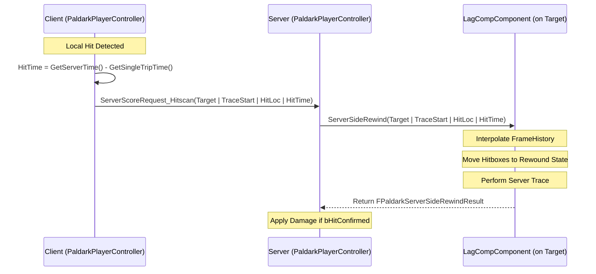
```mermaid
sequenceDiagram
    participant C as Client (PaldarkPlayerController)
    participant S as Server (PaldarkPlayerController)
    participant L as LagCompComponent (on Target)
    Note over C: Local Hit Detected
    C->>C: HitTime = GetServerTime() - GetSingleTripTime()
    C->>S: ServerScoreRequest_Hitscan(Target | TraceStart | HitLoc | HitTime)
    S->>L: ServerSideRewind(Target | TraceStart | HitLoc | HitTime)
    Note over L: Interpolate FrameHistory
    Note over L: Move Hitboxes to Rewound State
    Note over L: Perform Server Trace
    L-->>S: Return FPaldarkServerSideRewindResult
    Note over S: Apply Damage if bHitConfirmed
```

Sources:[Source/PaldarkLab/Public/Combat/PaldarkLagCompensationComponent.h#81-103](https://github.com/thanhtinpro/devin-paldarklab/blob/864c77b4/Source/PaldarkLab/Public/Combat/PaldarkLagCompensationComponent.h#L81-L103)[Source/PaldarkLab/Public/Player/PaldarkPlayerController.h#76-90](https://github.com/thanhtinpro/devin-paldarklab/blob/864c77b4/Source/PaldarkLab/Public/Player/PaldarkPlayerController.h#L76-L90)[Documents/Devlog/W16-17-Build.md#29-44](https://github.com/thanhtinpro/devin-paldarklab/blob/864c77b4/Documents/Devlog/W16-17-Build.md?plain=1#L29-L44)

## Component Architecture

The `APaldarkPlayerController` uses a component-based approach to manage UI and game-state logic that must persist across pawn deaths.

### Controller Component Slots

Title: Player Controller Component Mapping

[Flowchart Diagram]

- `StableController`: Manages Pal deposit/withdrawal/healing at Hub buildings [Source/PaldarkLab/Public/Player/PaldarkPlayerController.h#45-46](https://github.com/thanhtinpro/devin-paldarklab/blob/864c77b4/Source/PaldarkLab/Public/Player/PaldarkPlayerController.h#L45-L46)
- `MarketplaceController`: Handles item transactions and currency [Source/PaldarkLab/Public/Player/PaldarkPlayerController.h#48-49](https://github.com/thanhtinpro/devin-paldarklab/blob/864c77b4/Source/PaldarkLab/Public/Player/PaldarkPlayerController.h#L48-L49)
- `BriefingController`: Manages the raid voting and countdown UI [Source/PaldarkLab/Public/Player/PaldarkPlayerController.h#53-54](https://github.com/thanhtinpro/devin-paldarklab/blob/864c77b4/Source/PaldarkLab/Public/Player/PaldarkPlayerController.h#L53-L54)

Sources:[Source/PaldarkLab/Private/Player/PaldarkPlayerController.cpp#36-45](https://github.com/thanhtinpro/devin-paldarklab/blob/864c77b4/Source/PaldarkLab/Private/Player/PaldarkPlayerController.cpp#L36-L45)[Source/PaldarkLab/Public/Player/PaldarkPlayerController.h#41-54](https://github.com/thanhtinpro/devin-paldarklab/blob/864c77b4/Source/PaldarkLab/Public/Player/PaldarkPlayerController.h#L41-L54)

---

# Animation-System

# Animation System
Relevant source files

- [Source/PaldarkLab/Private/Anim/PaldarkAnimInstance.cpp](https://github.com/thanhtinpro/devin-paldarklab/blob/864c77b4/Source/PaldarkLab/Private/Anim/PaldarkAnimInstance.cpp)
- [Source/PaldarkLab/Private/Anim/PaldarkPalAnimInstance.cpp](https://github.com/thanhtinpro/devin-paldarklab/blob/864c77b4/Source/PaldarkLab/Private/Anim/PaldarkPalAnimInstance.cpp)
- [Source/PaldarkLab/Public/Anim/PaldarkAnimInstance.h](https://github.com/thanhtinpro/devin-paldarklab/blob/864c77b4/Source/PaldarkLab/Public/Anim/PaldarkAnimInstance.h)
- [Source/PaldarkLab/Public/Anim/PaldarkPalAnimInstance.h](https://github.com/thanhtinpro/devin-paldarklab/blob/864c77b4/Source/PaldarkLab/Public/Anim/PaldarkPalAnimInstance.h)

The PaldarkLab animation system is built on a high-performance, multi-threaded architecture inspired by the Lyra Starter Game. It utilizes a Thread-Safe Snapshot pattern to decouple game-thread logic (character state, movement data, and gameplay tags) from worker-thread animation evaluation. This ensures that the `AnimGraph` can run in parallel without risking race conditions or `UObject` access violations.

## Architecture and Data Flow

The system is centered around `UPaldarkAnimInstance`, which acts as the base class for all characters. It splits animation updates into two distinct phases: a Game Thread (GT) phase for capturing data and a Worker Thread (WT) phase for deriving animation properties.

### Thread-Safe Snapshot Pattern

1. NativeUpdateAnimation (GT): Captures raw primitive data (Velocity, Rotation, Tags) into a `FPaldarkAnimSnapshot` struct [[Source/PaldarkLab/Public/Anim/PaldarkAnimInstance.h#41-58](https://github.com/thanhtinpro/devin-paldarklab/blob/864c77b4/[Source/PaldarkLab/Public/Anim/PaldarkAnimInstance.h#L41-L58)[Source/PaldarkLab/Private/Anim/PaldarkAnimInstance.cpp#51-92](https://github.com/thanhtinpro/devin-paldarklab/blob/864c77b4/Source/PaldarkLab/Private/Anim/PaldarkAnimInstance.cpp#L51-L92)].
2. NativeThreadSafeUpdateAnimation (WT): Reads the snapshot to calculate properties like `Speed`, `Direction`, and `bShouldMove`. This phase never dereferences `UObject` pointers [[Source/PaldarkLab/Private/Anim/PaldarkAnimInstance.cpp#94-136](https://github.com/thanhtinpro/devin-paldarklab/blob/864c77b4/[Source/PaldarkLab/Private/Anim/PaldarkAnimInstance.cpp#L94-L136)].

### Animation Data Flow Diagram

This diagram illustrates how character state transitions from the Game Thread to the Parallel Animation Evaluation.

[Flowchart Diagram]

Sources: [Source/PaldarkLab/Public/Anim/PaldarkAnimInstance.h#14-24](https://github.com/thanhtinpro/devin-paldarklab/blob/864c77b4/Source/PaldarkLab/Public/Anim/PaldarkAnimInstance.h#L14-L24)[Source/PaldarkLab/Private/Anim/PaldarkAnimInstance.cpp#51-136](https://github.com/thanhtinpro/devin-paldarklab/blob/864c77b4/Source/PaldarkLab/Private/Anim/PaldarkAnimInstance.cpp#L51-L136)

## Base Animation Instance (`UPaldarkAnimInstance`)

The `UPaldarkAnimInstance` provides the foundation for locomotion and state transitions used by both players and Pals.

### Key Properties Derived for AnimGraph

The following properties are exposed to Blueprints for use in State Machine transitions and Blend Space inputs [[Source/PaldarkLab/Public/Anim/PaldarkAnimInstance.h#72-94](https://github.com/thanhtinpro/devin-paldarklab/blob/864c77b4/[Source/PaldarkLab/Public/Anim/PaldarkAnimInstance.h#L72-L94)]:

| Property | Type | Description |
| --- | --- | --- |
| `Speed` | `float` | Horizontal velocity magnitude. Used for Walk/Run blend spaces [[Source/PaldarkLab/Private/Anim/PaldarkAnimInstance.cpp#103](https://github.com/thanhtinpro/devin-paldarklab/blob/864c77b4/[Source/PaldarkLab/Private/Anim/PaldarkAnimInstance.cpp#L103-L103)]. |
| `Direction` | `float` | Signed yaw delta [-180, 180] between velocity and actor facing [[Source/PaldarkLab/Private/Anim/PaldarkAnimInstance.cpp#116](https://github.com/thanhtinpro/devin-paldarklab/blob/864c77b4/[Source/PaldarkLab/Private/Anim/PaldarkAnimInstance.cpp#L116-L116)]. |
| `bIsInAir` | `bool` | Mirrors `CharacterMovement->IsFalling()`[[Source/PaldarkLab/Private/Anim/PaldarkAnimInstance.cpp#120](https://github.com/thanhtinpro/devin-paldarklab/blob/864c77b4/[Source/PaldarkLab/Private/Anim/PaldarkAnimInstance.cpp#L120-L120)]. |
| `bIsSprinting` | `bool` | True if `Paldark.State.Sprinting` tag is present on the ASC [[Source/PaldarkLab/Private/Anim/PaldarkAnimInstance.cpp#122](https://github.com/thanhtinpro/devin-paldarklab/blob/864c77b4/[Source/PaldarkLab/Private/Anim/PaldarkAnimInstance.cpp#L122-L122)]. |
| `bShouldMove` | `bool` | Grounded, accelerating, and speed > 3.0 cm/s to prevent jitter [[Source/PaldarkLab/Private/Anim/PaldarkAnimInstance.cpp#127](https://github.com/thanhtinpro/devin-paldarklab/blob/864c77b4/[Source/PaldarkLab/Private/Anim/PaldarkAnimInstance.cpp#L127-L127)]. |

Sources: [Source/PaldarkLab/Public/Anim/PaldarkAnimInstance.h#72-94](https://github.com/thanhtinpro/devin-paldarklab/blob/864c77b4/Source/PaldarkLab/Public/Anim/PaldarkAnimInstance.h#L72-L94)[Source/PaldarkLab/Private/Anim/PaldarkAnimInstance.cpp#94-136](https://github.com/thanhtinpro/devin-paldarklab/blob/864c77b4/Source/PaldarkLab/Private/Anim/PaldarkAnimInstance.cpp#L94-L136)

## Pal Animation Instance (`UPaldarkPalAnimInstance`)

The `UPaldarkPalAnimInstance` extends the base system to handle AI-specific states such as hostility, flight, and activity-driven poses [[Source/PaldarkLab/Public/Anim/PaldarkPalAnimInstance.h#23-48](https://github.com/thanhtinpro/devin-paldarklab/blob/864c77b4/[Source/PaldarkLab/Public/Anim/PaldarkPalAnimInstance.h#L23-L48)].

### Pal-Specific State Mapping

It integrates with the `UPaldarkPalActivityComponent` to read the current AI activity and translate it into animation parameters.

| Code Entity | Derived Anim Property | Animation Purpose |
| --- | --- | --- |
| `Paldark.Team.Hostile` | `bIsHostile` | Switches between "Follow" and "Stalk" sub-trees [[Source/PaldarkLab/Private/Anim/PaldarkPalAnimInstance.cpp#60](https://github.com/thanhtinpro/devin-paldarklab/blob/864c77b4/[Source/PaldarkLab/Private/Anim/PaldarkPalAnimInstance.cpp#L60-L60)]. |
| `MOVE_Flying` | `bIsFlying` | Drives flight loops for species like Razorbird [[Source/PaldarkLab/Private/Anim/PaldarkPalAnimInstance.cpp#63](https://github.com/thanhtinpro/devin-paldarklab/blob/864c77b4/[Source/PaldarkLab/Private/Anim/PaldarkPalAnimInstance.cpp#L63-L63)]. |
| `Paldark.Pal.Activity.Combat` | `bIsInCombat` | Activates additive combat-stance poses [[Source/PaldarkLab/Private/Anim/PaldarkPalAnimInstance.cpp#64-65](https://github.com/thanhtinpro/devin-paldarklab/blob/864c77b4/[Source/PaldarkLab/Private/Anim/PaldarkPalAnimInstance.cpp#L64-L65)]. |
| `CurrentActivityTag` | `CurrentActivityTag` | Allows fine-grained transitions (e.g., Investigate vs. Patrol) [[Source/PaldarkLab/Private/Anim/PaldarkPalAnimInstance.cpp#67](https://github.com/thanhtinpro/devin-paldarklab/blob/864c77b4/[Source/PaldarkLab/Private/Anim/PaldarkPalAnimInstance.cpp#L67-L67)]. |

### Pal State Logic Diagram

This diagram shows how the Pal-specific components bridge to the animation properties.

[Flowchart Diagram]

Sources: [Source/PaldarkLab/Public/Anim/PaldarkPalAnimInstance.h#50-62](https://github.com/thanhtinpro/devin-paldarklab/blob/864c77b4/Source/PaldarkLab/Public/Anim/PaldarkPalAnimInstance.h#L50-L62)[Source/PaldarkLab/Private/Anim/PaldarkPalAnimInstance.cpp#33-68](https://github.com/thanhtinpro/devin-paldarklab/blob/864c77b4/Source/PaldarkLab/Private/Anim/PaldarkPalAnimInstance.cpp#L33-L68)

## Integration and Setup

### Pawn Data Linkage

The link between character logic and animation is established via `UPaldarkPawnData`. The `DefaultAnimInstanceClass` property in the Pawn Data asset defines which AnimBP is assigned to the skeletal mesh upon spawning. For Pals, this is further defined in the `UPaldarkPalDefinition`[[Source/PaldarkLab/Public/Anim/PaldarkPalAnimInstance.h#8-10](https://github.com/thanhtinpro/devin-paldarklab/blob/864c77b4/[Source/PaldarkLab/Public/Anim/PaldarkPalAnimInstance.h#L8-L10)].

### Anim Layer Interfaces

To support modularity, the system uses `IPaldarkAnimLayerInterface` (referenced in `PaldarkPalAnimInstance.h`). This allows different species (e.g., Direhound vs. Razorbird) to share a master `ABP_Paldark_Pal` logic while providing unique animation sequences for locomotion and combat via interface overrides [[Source/PaldarkLab/Public/Anim/PaldarkPalAnimInstance.h#8-10](https://github.com/thanhtinpro/devin-paldarklab/blob/864c77b4/[Source/PaldarkLab/Public/Anim/PaldarkPalAnimInstance.h#L8-L10)].

### Initialization Workflow

1. NativeInitializeAnimation: Caches the `ACharacter` and resolves the `UPaldarkAbilitySystemComponent` via `IAbilitySystemInterface`[[Source/PaldarkLab/Private/Anim/PaldarkAnimInstance.cpp#21-49](https://github.com/thanhtinpro/devin-paldarklab/blob/864c77b4/[Source/PaldarkLab/Private/Anim/PaldarkAnimInstance.cpp#L21-L49)].
2. Tag Resolution: Gameplay tags like `Paldark.State.Sprinting` are cached once during initialization to avoid expensive tag registry lookups during the update loop [[Source/PaldarkLab/Private/Anim/PaldarkAnimInstance.cpp#42](https://github.com/thanhtinpro/devin-paldarklab/blob/864c77b4/[Source/PaldarkLab/Private/Anim/PaldarkAnimInstance.cpp#L42-L42)].

Sources: [Source/PaldarkLab/Private/Anim/PaldarkAnimInstance.cpp#21-49](https://github.com/thanhtinpro/devin-paldarklab/blob/864c77b4/Source/PaldarkLab/Private/Anim/PaldarkAnimInstance.cpp#L21-L49)[Source/PaldarkLab/Public/Anim/PaldarkPalAnimInstance.h#8-10](https://github.com/thanhtinpro/devin-paldarklab/blob/864c77b4/Source/PaldarkLab/Public/Anim/PaldarkPalAnimInstance.h#L8-L10)

---

# Gameplay-Ability-System-(GAS)-Integration

# Gameplay Ability System (GAS) Integration
Relevant source files

- [Source/PaldarkLab/Private/Gas/Abilities/PaldarkGameplayAbility_Sprint.cpp](https://github.com/thanhtinpro/devin-paldarklab/blob/864c77b4/Source/PaldarkLab/Private/Gas/Abilities/PaldarkGameplayAbility_Sprint.cpp)
- [Source/PaldarkLab/Private/Gas/PaldarkAbilitySystemComponent.cpp](https://github.com/thanhtinpro/devin-paldarklab/blob/864c77b4/Source/PaldarkLab/Private/Gas/PaldarkAbilitySystemComponent.cpp)
- [Source/PaldarkLab/Private/Gas/PaldarkAttributeSet.cpp](https://github.com/thanhtinpro/devin-paldarklab/blob/864c77b4/Source/PaldarkLab/Private/Gas/PaldarkAttributeSet.cpp)
- [Source/PaldarkLab/Private/Gas/PaldarkDamageExecutionCalculation.cpp](https://github.com/thanhtinpro/devin-paldarklab/blob/864c77b4/Source/PaldarkLab/Private/Gas/PaldarkDamageExecutionCalculation.cpp)
- [Source/PaldarkLab/Private/Gas/PaldarkGameplayAbility.cpp](https://github.com/thanhtinpro/devin-paldarklab/blob/864c77b4/Source/PaldarkLab/Private/Gas/PaldarkGameplayAbility.cpp)
- [Source/PaldarkLab/Public/Gas/Abilities/PaldarkGameplayAbility_Sprint.h](https://github.com/thanhtinpro/devin-paldarklab/blob/864c77b4/Source/PaldarkLab/Public/Gas/Abilities/PaldarkGameplayAbility_Sprint.h)
- [Source/PaldarkLab/Public/Gas/PaldarkAbilitySystemComponent.h](https://github.com/thanhtinpro/devin-paldarklab/blob/864c77b4/Source/PaldarkLab/Public/Gas/PaldarkAbilitySystemComponent.h)
- [Source/PaldarkLab/Public/Gas/PaldarkAttributeSet.h](https://github.com/thanhtinpro/devin-paldarklab/blob/864c77b4/Source/PaldarkLab/Public/Gas/PaldarkAttributeSet.h)
- [Source/PaldarkLab/Public/Gas/PaldarkDamageExecutionCalculation.h](https://github.com/thanhtinpro/devin-paldarklab/blob/864c77b4/Source/PaldarkLab/Public/Gas/PaldarkDamageExecutionCalculation.h)
- [Source/PaldarkLab/Public/Gas/PaldarkGameplayAbility.h](https://github.com/thanhtinpro/devin-paldarklab/blob/864c77b4/Source/PaldarkLab/Public/Gas/PaldarkGameplayAbility.h)

PaldarkLab utilizes the Gameplay Ability System (GAS) as the primary framework for combat, locomotion modifiers, and attribute management. The implementation follows a "Thin Base Class" pattern, extending core GAS classes to integrate with the project's Gameplay Tag taxonomy and Enhanced Input system.

## Core System Architecture

The GAS implementation is centered around three primary C++ classes that extend the engine's base functionality to support Paldark-specific requirements like tag-keyed input and custom damage logic.

### Ability System Component (ASC)

`UPaldarkAbilitySystemComponent` serves as the project-specific extension of `UAbilitySystemComponent`. It provides helper methods to bridge the gap between Enhanced Input and ability activation using Gameplay Tags [Source/PaldarkLab/Public/Gas/PaldarkAbilitySystemComponent.h#1-8](https://github.com/thanhtinpro/devin-paldarklab/blob/864c77b4/Source/PaldarkLab/Public/Gas/PaldarkAbilitySystemComponent.h#L1-L8)

- Input Mapping: Instead of using integer-based input IDs, PaldarkLab uses `FGameplayTag` to identify input actions.
- Activation: `TryActivateAbilityByActivationTag` allows the character to trigger abilities by passing a tag (e.g., `Paldark.InputTag.Sprint`) [Source/PaldarkLab/Private/Gas/PaldarkAbilitySystemComponent.cpp#16-35](https://github.com/thanhtinpro/devin-paldarklab/blob/864c77b4/Source/PaldarkLab/Private/Gas/PaldarkAbilitySystemComponent.cpp#L16-L35)
- Cancellation: `CancelAbilityByActivationTag` provides a symmetric way to end "hold-to-activate" abilities [Source/PaldarkLab/Private/Gas/PaldarkAbilitySystemComponent.cpp#37-51](https://github.com/thanhtinpro/devin-paldarklab/blob/864c77b4/Source/PaldarkLab/Private/Gas/PaldarkAbilitySystemComponent.cpp#L37-L51)

### Gameplay Ability Base

`UPaldarkGameplayAbility` is the abstract base class for all abilities (Sprint, Fire, Pal Attacks). It adds a `ActivationInputTag` property, which concrete subclasses set in their constructors to define which input tag triggers them [Source/PaldarkLab/Public/Gas/PaldarkGameplayAbility.h#23-29](https://github.com/thanhtinpro/devin-paldarklab/blob/864c77b4/Source/PaldarkLab/Public/Gas/PaldarkGameplayAbility.h#L23-L29)

### Code Entity Space: GAS Core

[Flowchart Diagram]

Sources: [Source/PaldarkLab/Public/Gas/PaldarkAbilitySystemComponent.h#19-35](https://github.com/thanhtinpro/devin-paldarklab/blob/864c77b4/Source/PaldarkLab/Public/Gas/PaldarkAbilitySystemComponent.h#L19-L35)[Source/PaldarkLab/Public/Gas/PaldarkGameplayAbility.h#18-35](https://github.com/thanhtinpro/devin-paldarklab/blob/864c77b4/Source/PaldarkLab/Public/Gas/PaldarkGameplayAbility.h#L18-L35)[Source/PaldarkLab/Public/Gas/PaldarkAttributeSet.h#65-137](https://github.com/thanhtinpro/devin-paldarklab/blob/864c77b4/Source/PaldarkLab/Public/Gas/PaldarkAttributeSet.h#L65-L137)[Source/PaldarkLab/Public/Gas/PaldarkDamageExecutionCalculation.h#38-47](https://github.com/thanhtinpro/devin-paldarklab/blob/864c77b4/Source/PaldarkLab/Public/Gas/PaldarkDamageExecutionCalculation.h#L38-L47)

## Attribute Set and Damage Pipeline

Attributes in PaldarkLab are categorized into Vital (Health, Stamina), Locomotion (MoveSpeed), and Defense (Armor).

| Attribute | Category | Purpose |
| --- | --- | --- |
| `Health` | Vital | Current HP; triggers death at 0 [Source/PaldarkLab/Public/Gas/PaldarkAttributeSet.h#88](https://github.com/thanhtinpro/devin-paldarklab/blob/864c77b4/Source/PaldarkLab/Public/Gas/PaldarkAttributeSet.h#L88-L88) |
| `Stamina` | Vital | Drained by sprinting; limits physical actions [Source/PaldarkLab/Public/Gas/PaldarkAttributeSet.h#100](https://github.com/thanhtinpro/devin-paldarklab/blob/864c77b4/Source/PaldarkLab/Public/Gas/PaldarkAttributeSet.h#L100-L100) |
| `MoveSpeed` | Locomotion | Base walk speed in cm/s; modified by Sprint [Source/PaldarkLab/Public/Gas/PaldarkAttributeSet.h#113](https://github.com/thanhtinpro/devin-paldarklab/blob/864c77b4/Source/PaldarkLab/Public/Gas/PaldarkAttributeSet.h#L113-L113) |
| `Armor` | Defense | Mitigates incoming damage via execution calculation [Source/PaldarkLab/Public/Gas/PaldarkAttributeSet.h#120](https://github.com/thanhtinpro/devin-paldarklab/blob/864c77b4/Source/PaldarkLab/Public/Gas/PaldarkAttributeSet.h#L120-L120) |
| `IncomingDamage` | Meta | Transient meta-attribute used for damage calculations [Source/PaldarkLab/Public/Gas/PaldarkAttributeSet.h#130](https://github.com/thanhtinpro/devin-paldarklab/blob/864c77b4/Source/PaldarkLab/Public/Gas/PaldarkAttributeSet.h#L130-L130) |

### Damage Execution Flow

Damage is processed through `UPaldarkDamageExecutionCalculation`, which implements a diminishing returns formula: `FinalDamage = BaseDamage * HeadshotMult * (100 / (100 + Armor))`[Source/PaldarkLab/Private/Gas/PaldarkDamageExecutionCalculation.cpp#93-99](https://github.com/thanhtinpro/devin-paldarklab/blob/864c77b4/Source/PaldarkLab/Private/Gas/PaldarkDamageExecutionCalculation.cpp#L93-L99)

1. Capture: The calculation captures the target's `Armor` attribute [Source/PaldarkLab/Private/Gas/PaldarkDamageExecutionCalculation.cpp#23](https://github.com/thanhtinpro/devin-paldarklab/blob/864c77b4/Source/PaldarkLab/Private/Gas/PaldarkDamageExecutionCalculation.cpp#L23-L23)
2. SetByCaller: It reads `BaseDamage` (Weapon + Pal) and `HeadshotMultiplier` from the effect spec [Source/PaldarkLab/Private/Gas/PaldarkDamageExecutionCalculation.cpp#61-76](https://github.com/thanhtinpro/devin-paldarklab/blob/864c77b4/Source/PaldarkLab/Private/Gas/PaldarkDamageExecutionCalculation.cpp#L61-L76)
3. Output: The result is written to the meta-attribute `IncomingDamage`[Source/PaldarkLab/Private/Gas/PaldarkDamageExecutionCalculation.cpp#108-113](https://github.com/thanhtinpro/devin-paldarklab/blob/864c77b4/Source/PaldarkLab/Private/Gas/PaldarkDamageExecutionCalculation.cpp#L108-L113)
4. Application: `UPaldarkAttributeSet::PostGameplayEffectExecute` consumes `IncomingDamage`, reduces `Health`, and broadcasts `OnHealthZeroed` if the target dies [Source/PaldarkLab/Private/Gas/PaldarkAttributeSet.cpp#121-146](https://github.com/thanhtinpro/devin-paldarklab/blob/864c77b4/Source/PaldarkLab/Private/Gas/PaldarkAttributeSet.cpp#L121-L146)

For details, see [Attribute Set and Damage Calculation](#4.1).

## Ability Implementations

### Player Abilities

Player-specific abilities handle locomotion and weapon interaction. `UPaldarkGameplayAbility_Sprint` is a primary example, managing a periodic `SprintCostEffect` (Stamina drain) and an infinite `SprintMoveSpeedEffect` (Speed buff) while active [Source/PaldarkLab/Private/Gas/Abilities/PaldarkGameplayAbility_Sprint.cpp#49-66](https://github.com/thanhtinpro/devin-paldarklab/blob/864c77b4/Source/PaldarkLab/Private/Gas/Abilities/PaldarkGameplayAbility_Sprint.cpp#L49-L66)

For details, see [Player Abilities](#4.2).

### Pal Attack Abilities

Pal attacks use a specialized base class, `UPaldarkGameplayAbility_PalAttack`. These abilities are typically `ServerOnly` and handle various shapes of influence, such as line-of-sight Bite attacks or cone-based Fire Breath.

For details, see [Pal Attack Abilities](#4.3).

### Data Flow: Damage Pipeline

[Flowchart Diagram]

Sources: [Source/PaldarkLab/Private/Gas/PaldarkDamageExecutionCalculation.cpp#61-113](https://github.com/thanhtinpro/devin-paldarklab/blob/864c77b4/Source/PaldarkLab/Private/Gas/PaldarkDamageExecutionCalculation.cpp#L61-L113)[Source/PaldarkLab/Private/Gas/PaldarkAttributeSet.cpp#121-148](https://github.com/thanhtinpro/devin-paldarklab/blob/864c77b4/Source/PaldarkLab/Private/Gas/PaldarkAttributeSet.cpp#L121-L148)

## Sources

- [Source/PaldarkLab/Public/Gas/PaldarkAttributeSet.h#1-137](https://github.com/thanhtinpro/devin-paldarklab/blob/864c77b4/Source/PaldarkLab/Public/Gas/PaldarkAttributeSet.h#L1-L137)
- [Source/PaldarkLab/Private/Gas/PaldarkAttributeSet.cpp#1-155](https://github.com/thanhtinpro/devin-paldarklab/blob/864c77b4/Source/PaldarkLab/Private/Gas/PaldarkAttributeSet.cpp#L1-L155)
- [Source/PaldarkLab/Public/Gas/PaldarkAbilitySystemComponent.h#1-35](https://github.com/thanhtinpro/devin-paldarklab/blob/864c77b4/Source/PaldarkLab/Public/Gas/PaldarkAbilitySystemComponent.h#L1-L35)
- [Source/PaldarkLab/Private/Gas/PaldarkAbilitySystemComponent.cpp#16-51](https://github.com/thanhtinpro/devin-paldarklab/blob/864c77b4/Source/PaldarkLab/Private/Gas/PaldarkAbilitySystemComponent.cpp#L16-L51)
- [Source/PaldarkLab/Public/Gas/PaldarkGameplayAbility.h#1-35](https://github.com/thanhtinpro/devin-paldarklab/blob/864c77b4/Source/PaldarkLab/Public/Gas/PaldarkGameplayAbility.h#L1-L35)
- [Source/PaldarkLab/Public/Gas/PaldarkDamageExecutionCalculation.h#1-47](https://github.com/thanhtinpro/devin-paldarklab/blob/864c77b4/Source/PaldarkLab/Public/Gas/PaldarkDamageExecutionCalculation.h#L1-L47)
- [Source/PaldarkLab/Private/Gas/PaldarkDamageExecutionCalculation.cpp#1-114](https://github.com/thanhtinpro/devin-paldarklab/blob/864c77b4/Source/PaldarkLab/Private/Gas/PaldarkDamageExecutionCalculation.cpp#L1-L114)
- [Source/PaldarkLab/Private/Gas/Abilities/PaldarkGameplayAbility_Sprint.cpp#10-113](https://github.com/thanhtinpro/devin-paldarklab/blob/864c77b4/Source/PaldarkLab/Private/Gas/Abilities/PaldarkGameplayAbility_Sprint.cpp#L10-L113)

---

# Attribute-Set-and-Damage-Calculation

# Attribute Set and Damage Calculation
Relevant source files

- [Documents/GameDesign/11-Aura_RPG_GDD.md](https://github.com/thanhtinpro/devin-paldarklab/blob/864c77b4/Documents/GameDesign/11-Aura_RPG_GDD.md?plain=1)
- [Documents/UE5_Course/P08_GAS.md](https://github.com/thanhtinpro/devin-paldarklab/blob/864c77b4/Documents/UE5_Course/P08_GAS.md?plain=1)
- [Source/PaldarkLab/Private/Gas/PaldarkAttributeSet.cpp](https://github.com/thanhtinpro/devin-paldarklab/blob/864c77b4/Source/PaldarkLab/Private/Gas/PaldarkAttributeSet.cpp)
- [Source/PaldarkLab/Private/Gas/PaldarkDamageExecutionCalculation.cpp](https://github.com/thanhtinpro/devin-paldarklab/blob/864c77b4/Source/PaldarkLab/Private/Gas/PaldarkDamageExecutionCalculation.cpp)
- [Source/PaldarkLab/Public/Gas/PaldarkAttributeSet.h](https://github.com/thanhtinpro/devin-paldarklab/blob/864c77b4/Source/PaldarkLab/Public/Gas/PaldarkAttributeSet.h)
- [Source/PaldarkLab/Public/Gas/PaldarkDamageExecutionCalculation.h](https://github.com/thanhtinpro/devin-paldarklab/blob/864c77b4/Source/PaldarkLab/Public/Gas/PaldarkDamageExecutionCalculation.h)

This section details the Gameplay Ability System (GAS) attribute architecture and the server-authoritative damage pipeline used in PaldarkLab. The system follows a "Transparent Damage Chain" pattern, where every step from raw weapon power to final health reduction is calculated in a single, auditable execution class.

## UPaldarkAttributeSet

The `UPaldarkAttributeSet` serves as the primary data storage for all numerical actor stats. It is categorized into Vital, Locomotion, and Defensive attributes.

### Attribute Categories

- Vital Attributes:`Health`, `MaxHealth`, `Stamina`, `MaxStamina`. These represent the current state of the actor [Source/PaldarkLab/Public/Gas/PaldarkAttributeSet.h#87-105](https://github.com/thanhtinpro/devin-paldarklab/blob/864c77b4/Source/PaldarkLab/Public/Gas/PaldarkAttributeSet.h#L87-L105)
- Locomotion Attributes:`MoveSpeed`. This value is read by the character movement component to drive walk and sprint speeds [Source/PaldarkLab/Public/Gas/PaldarkAttributeSet.h#112-113](https://github.com/thanhtinpro/devin-paldarklab/blob/864c77b4/Source/PaldarkLab/Public/Gas/PaldarkAttributeSet.h#L112-L113)
- Defensive Attributes:`Armor`. Used by the damage execution calculation to mitigate incoming hits [Source/PaldarkLab/Public/Gas/PaldarkAttributeSet.h#119-121](https://github.com/thanhtinpro/devin-paldarklab/blob/864c77b4/Source/PaldarkLab/Public/Gas/PaldarkAttributeSet.h#L119-L121)
- Meta Attributes:`IncomingDamage`. A transient, non-replicated attribute used as a buffer for the execution calculation result before it is applied to Health [Source/PaldarkLab/Public/Gas/PaldarkAttributeSet.h#129-131](https://github.com/thanhtinpro/devin-paldarklab/blob/864c77b4/Source/PaldarkLab/Public/Gas/PaldarkAttributeSet.h#L129-L131)

### Lifecycle and Validation

The attribute set enforces safety constraints during the `PreAttributeChange` and `PostGameplayEffectExecute` phases:

1. Clamping:`Health` and `Stamina` are strictly clamped between 0 and their respective `Max` values [Source/PaldarkLab/Private/Gas/PaldarkAttributeSet.cpp#64-71](https://github.com/thanhtinpro/devin-paldarklab/blob/864c77b4/Source/PaldarkLab/Private/Gas/PaldarkAttributeSet.cpp#L64-L71)
2. Safety Floors:`MaxHealth`, `MaxStamina`, and `MaxStun` are floored at 1.0 to prevent divide-by-zero errors in formulas [Source/PaldarkLab/Private/Gas/PaldarkAttributeSet.cpp#77-101](https://github.com/thanhtinpro/devin-paldarklab/blob/864c77b4/Source/PaldarkLab/Private/Gas/PaldarkAttributeSet.cpp#L77-L101)
3. Death Broadcast: When an instant damage effect drives `Health` to zero on the server, the `OnHealthZeroed` delegate is broadcasted [Source/PaldarkLab/Private/Gas/PaldarkAttributeSet.cpp#142-146](https://github.com/thanhtinpro/devin-paldarklab/blob/864c77b4/Source/PaldarkLab/Private/Gas/PaldarkAttributeSet.cpp#L142-L146)

### Replication Strategy

All persistent attributes use `REPNOTIFY_Always`. This ensures that even if a value oscillates rapidly (e.g., stamina draining and regenerating in the same tick), the client-side UI and logic receive the updates [Source/PaldarkLab/Private/Gas/PaldarkAttributeSet.cpp#38-45](https://github.com/thanhtinpro/devin-paldarklab/blob/864c77b4/Source/PaldarkLab/Private/Gas/PaldarkAttributeSet.cpp#L38-L45)

Sources:

- [Source/PaldarkLab/Public/Gas/PaldarkAttributeSet.h#1-137](https://github.com/thanhtinpro/devin-paldarklab/blob/864c77b4/Source/PaldarkLab/Public/Gas/PaldarkAttributeSet.h#L1-L137)
- [Source/PaldarkLab/Private/Gas/PaldarkAttributeSet.cpp#1-155](https://github.com/thanhtinpro/devin-paldarklab/blob/864c77b4/Source/PaldarkLab/Private/Gas/PaldarkAttributeSet.cpp#L1-L155)

---

## Damage Calculation Pipeline

PaldarkLab uses `UPaldarkDamageExecutionCalculation` to centralize combat logic. This class captures attributes from both the attacker and the defender to produce a final damage value.

### Data Flow: From Ability to Health

The damage flow is initiated by a `GameplayAbility` (such as `GA_HitscanFire`) and processed through `GE_Damage_Standard`.

#### 1. Attribute Capture

The execution calculation captures the defender's `Armor` attribute at the moment of execution (Snapshot: False) to ensure real-time mitigation values are used [Source/PaldarkLab/Private/Gas/PaldarkDamageExecutionCalculation.cpp#23-38](https://github.com/thanhtinpro/devin-paldarklab/blob/864c77b4/Source/PaldarkLab/Private/Gas/PaldarkDamageExecutionCalculation.cpp#L23-L38)

#### 2. SetByCaller Magnitudes

Instead of hardcoding damage in the Gameplay Effect, magnitudes are passed via `SetByCaller` tags:

- `Paldark.SetByCaller.BaseDamage`: Weapon-specific damage [Source/PaldarkLab/Private/Gas/PaldarkDamageExecutionCalculation.cpp#61-64](https://github.com/thanhtinpro/devin-paldarklab/blob/864c77b4/Source/PaldarkLab/Private/Gas/PaldarkDamageExecutionCalculation.cpp#L61-L64)
- `Paldark.SetByCaller.PalDamage`: Damage contributed by Pal abilities [Source/PaldarkLab/Private/Gas/PaldarkDamageExecutionCalculation.cpp#66-69](https://github.com/thanhtinpro/devin-paldarklab/blob/864c77b4/Source/PaldarkLab/Private/Gas/PaldarkDamageExecutionCalculation.cpp#L66-L69)
- `Paldark.SetByCaller.HeadshotMultiplier`: Applied if the hit detection identifies a head-bone collision [Source/PaldarkLab/Private/Gas/PaldarkDamageExecutionCalculation.cpp#73-76](https://github.com/thanhtinpro/devin-paldarklab/blob/864c77b4/Source/PaldarkLab/Private/Gas/PaldarkDamageExecutionCalculation.cpp#L73-L76)

#### 3. The Formula

The final damage is calculated using a diminishing returns curve for armor:
`FinalDamage = (WeaponDamage + PalDamage) * HeadshotMultiplier * (100 / (100 + Armor))`[Source/PaldarkLab/Private/Gas/PaldarkDamageExecutionCalculation.cpp#98-99](https://github.com/thanhtinpro/devin-paldarklab/blob/864c77b4/Source/PaldarkLab/Private/Gas/PaldarkDamageExecutionCalculation.cpp#L98-L99)

### Damage Flow Diagram

Damage Execution Sequence

[Flowchart Diagram]

Sources:

- [Source/PaldarkLab/Public/Gas/PaldarkDamageExecutionCalculation.h#1-48](https://github.com/thanhtinpro/devin-paldarklab/blob/864c77b4/Source/PaldarkLab/Public/Gas/PaldarkDamageExecutionCalculation.h#L1-L48)
- [Source/PaldarkLab/Private/Gas/PaldarkDamageExecutionCalculation.cpp#41-114](https://github.com/thanhtinpro/devin-paldarklab/blob/864c77b4/Source/PaldarkLab/Private/Gas/PaldarkDamageExecutionCalculation.cpp#L41-L114)
- [Documents/UE5_Course/P08_GAS.md#145-173](https://github.com/thanhtinpro/devin-paldarklab/blob/864c77b4/Documents/UE5_Course/P08_GAS.md?plain=1#L145-L173)

---

## Technical Mapping: Code Entities to System Roles

This diagram associates the C++ classes and specific logic gates with their functional roles in the combat system.

System Entity Mapping

### Key Function Implementation Details

| Function | Role | Source |
| --- | --- | --- |
| `PreAttributeChange` | Enforces attribute bounds before they are applied (clamping). | [PaldarkAttributeSet.cpp#60-103](https://github.com/thanhtinpro/devin-paldarklab/blob/864c77b4/PaldarkAttributeSet.cpp#L60-L103) |
| `PostGameplayEffectExecute` | Consumes `IncomingDamage`, applies to `Health`, and triggers death. | [PaldarkAttributeSet.cpp#105-155](https://github.com/thanhtinpro/devin-paldarklab/blob/864c77b4/PaldarkAttributeSet.cpp#L105-L155) |
| `Execute_Implementation` | Captures `Armor`, reads `SetByCaller` tags, and calculates final damage. | [PaldarkDamageExecutionCalculation.cpp#41-114](https://github.com/thanhtinpro/devin-paldarklab/blob/864c77b4/PaldarkDamageExecutionCalculation.cpp#L41-L114) |
| `DECLARE_ATTRIBUTE_CAPTUREDEF` | Defines which attributes the execution needs to snapshot. | [PaldarkDamageExecutionCalculation.cpp#16-24](https://github.com/thanhtinpro/devin-paldarklab/blob/864c77b4/PaldarkDamageExecutionCalculation.cpp#L16-L24) |

Sources:

- [Source/PaldarkLab/Private/Gas/PaldarkAttributeSet.cpp#60-155](https://github.com/thanhtinpro/devin-paldarklab/blob/864c77b4/Source/PaldarkLab/Private/Gas/PaldarkAttributeSet.cpp#L60-L155)
- [Source/PaldarkLab/Private/Gas/PaldarkDamageExecutionCalculation.cpp#11-114](https://github.com/thanhtinpro/devin-paldarklab/blob/864c77b4/Source/PaldarkLab/Private/Gas/PaldarkDamageExecutionCalculation.cpp#L11-L114)
- [Documents/GameDesign/11-Aura_RPG_GDD.md#81-88](https://github.com/thanhtinpro/devin-paldarklab/blob/864c77b4/Documents/GameDesign/11-Aura_RPG_GDD.md?plain=1#L81-L88)

---

# Player-Abilities

# Player Abilities
Relevant source files

- [Source/PaldarkLab/Private/Gas/Abilities/PaldarkGameplayAbility_HitscanFire.cpp](https://github.com/thanhtinpro/devin-paldarklab/blob/864c77b4/Source/PaldarkLab/Private/Gas/Abilities/PaldarkGameplayAbility_HitscanFire.cpp)
- [Source/PaldarkLab/Private/Gas/Abilities/PaldarkGameplayAbility_Sprint.cpp](https://github.com/thanhtinpro/devin-paldarklab/blob/864c77b4/Source/PaldarkLab/Private/Gas/Abilities/PaldarkGameplayAbility_Sprint.cpp)
- [Source/PaldarkLab/Private/Gas/Abilities/PaldarkGameplayAbility_UsePalSphere.cpp](https://github.com/thanhtinpro/devin-paldarklab/blob/864c77b4/Source/PaldarkLab/Private/Gas/Abilities/PaldarkGameplayAbility_UsePalSphere.cpp)
- [Source/PaldarkLab/Private/Gas/PaldarkAbilitySystemComponent.cpp](https://github.com/thanhtinpro/devin-paldarklab/blob/864c77b4/Source/PaldarkLab/Private/Gas/PaldarkAbilitySystemComponent.cpp)
- [Source/PaldarkLab/Private/Gas/PaldarkGameplayAbility.cpp](https://github.com/thanhtinpro/devin-paldarklab/blob/864c77b4/Source/PaldarkLab/Private/Gas/PaldarkGameplayAbility.cpp)
- [Source/PaldarkLab/Public/Gas/Abilities/PaldarkGameplayAbility_HitscanFire.h](https://github.com/thanhtinpro/devin-paldarklab/blob/864c77b4/Source/PaldarkLab/Public/Gas/Abilities/PaldarkGameplayAbility_HitscanFire.h)
- [Source/PaldarkLab/Public/Gas/Abilities/PaldarkGameplayAbility_Sprint.h](https://github.com/thanhtinpro/devin-paldarklab/blob/864c77b4/Source/PaldarkLab/Public/Gas/Abilities/PaldarkGameplayAbility_Sprint.h)
- [Source/PaldarkLab/Public/Gas/Abilities/PaldarkGameplayAbility_UsePalSphere.h](https://github.com/thanhtinpro/devin-paldarklab/blob/864c77b4/Source/PaldarkLab/Public/Gas/Abilities/PaldarkGameplayAbility_UsePalSphere.h)
- [Source/PaldarkLab/Public/Gas/PaldarkAbilitySystemComponent.h](https://github.com/thanhtinpro/devin-paldarklab/blob/864c77b4/Source/PaldarkLab/Public/Gas/PaldarkAbilitySystemComponent.h)
- [Source/PaldarkLab/Public/Gas/PaldarkGameplayAbility.h](https://github.com/thanhtinpro/devin-paldarklab/blob/864c77b4/Source/PaldarkLab/Public/Gas/PaldarkGameplayAbility.h)

The player character in PaldarkLab interacts with the world primarily through the Gameplay Ability System (GAS). Player-facing abilities range from locomotion modifiers like sprinting to complex combat interactions such as hitscan firing and Pal-taming projectile launches. These abilities are unified by a tag-keyed input system that bridges Enhanced Input to GAS activations.

## Ability System Architecture

The core of the ability system is the `UPaldarkAbilitySystemComponent` (ASC). It serves as the project-specific extension point for cross-cutting hooks like input binding and ability lifecycle logging [Source/PaldarkLab/Public/Gas/PaldarkAbilitySystemComponent.h#1-8](https://github.com/thanhtinpro/devin-paldarklab/blob/864c77b4/Source/PaldarkLab/Public/Gas/PaldarkAbilitySystemComponent.h#L1-L8)

### Ability Base Class

All player abilities inherit from `UPaldarkGameplayAbility`. This base class introduces project-wide conventions:

- `ActivationInputTag`: A `FGameplayTag` used to link the ability to a specific input action defined in the `UPaldarkInputConfig`[Source/PaldarkLab/Public/Gas/PaldarkGameplayAbility.h#28-29](https://github.com/thanhtinpro/devin-paldarklab/blob/864c77b4/Source/PaldarkLab/Public/Gas/PaldarkGameplayAbility.h#L28-L29)
- `DebugName`: A human-readable string for logging and debug HUDs [Source/PaldarkLab/Public/Gas/PaldarkGameplayAbility.h#33-34](https://github.com/thanhtinpro/devin-paldarklab/blob/864c77b4/Source/PaldarkLab/Public/Gas/PaldarkGameplayAbility.h#L33-L34)
- Default Policies: Abilities default to `InstancedPerActor` with `LocalPredicted` execution [Source/PaldarkLab/Private/Gas/PaldarkGameplayAbility.cpp#8-9](https://github.com/thanhtinpro/devin-paldarklab/blob/864c77b4/Source/PaldarkLab/Private/Gas/PaldarkGameplayAbility.cpp#L8-L9)

### Input to Ability Mapping

The character translates Enhanced Input triggers into GAS calls via the ASC's tag-based helpers.

| Function | Role |
| --- | --- |
| `TryActivateAbilityByActivationTag` | Activates all abilities whose `AbilityTags` match the provided input tag [Source/PaldarkLab/Private/Gas/PaldarkAbilitySystemComponent.cpp#16-27](https://github.com/thanhtinpro/devin-paldarklab/blob/864c77b4/Source/PaldarkLab/Private/Gas/PaldarkAbilitySystemComponent.cpp#L16-L27) |
| `CancelAbilityByActivationTag` | Symmetrically cancels abilities (e.g., on key release) to ensure server/client synchronization [Source/PaldarkLab/Private/Gas/PaldarkAbilitySystemComponent.cpp#37-47](https://github.com/thanhtinpro/devin-paldarklab/blob/864c77b4/Source/PaldarkLab/Private/Gas/PaldarkAbilitySystemComponent.cpp#L37-L47) |

### Ability Granting Data Flow

Player abilities are granted during character initialization based on the `UPaldarkPawnData` assigned to the experience.

[Flowchart Diagram]

Sources: [Source/PaldarkLab/Public/Gas/PaldarkAbilitySystemComponent.h#26-34](https://github.com/thanhtinpro/devin-paldarklab/blob/864c77b4/Source/PaldarkLab/Public/Gas/PaldarkAbilitySystemComponent.h#L26-L34)[Source/PaldarkLab/Public/Gas/PaldarkGameplayAbility.h#25-29](https://github.com/thanhtinpro/devin-paldarklab/blob/864c77b4/Source/PaldarkLab/Public/Gas/PaldarkGameplayAbility.h#L25-L29)

---

## Core Player Abilities

### 1. Sprint (UPaldarkGameplayAbility_Sprint)

The sprint ability manages movement speed increases and periodic stamina consumption. It is designed to be active as long as the player holds the sprint key.

- Logic:

- On Activate: Applies a periodic Stamina-cost Gameplay Effect (`SprintCostEffect`) and an infinite additive MoveSpeed buff (`SprintMoveSpeedEffect`) [Source/PaldarkLab/Private/Gas/Abilities/PaldarkGameplayAbility_Sprint.cpp#49-66](https://github.com/thanhtinpro/devin-paldarklab/blob/864c77b4/Source/PaldarkLab/Private/Gas/Abilities/PaldarkGameplayAbility_Sprint.cpp#L49-L66)
- State Tracking: Adds the `Paldark.State.Sprinting` loose tag to the owner, allowing the Animation Blueprint and HUD to react [Source/PaldarkLab/Private/Gas/Abilities/PaldarkGameplayAbility_Sprint.cpp#68-71](https://github.com/thanhtinpro/devin-paldarklab/blob/864c77b4/Source/PaldarkLab/Private/Gas/Abilities/PaldarkGameplayAbility_Sprint.cpp#L68-L71)
- On End: Removes both Gameplay Effects by their cached handles and strips the sprinting state tag [Source/PaldarkLab/Private/Gas/Abilities/PaldarkGameplayAbility_Sprint.cpp#87-102](https://github.com/thanhtinpro/devin-paldarklab/blob/864c77b4/Source/PaldarkLab/Private/Gas/Abilities/PaldarkGameplayAbility_Sprint.cpp#L87-L102)
- Net Policy: Predicted on the client; the character explicitly calls `CancelAbilityByActivationTag` on input release to ensure symmetry [Source/PaldarkLab/Private/Gas/Abilities/PaldarkGameplayAbility_Sprint.cpp#24-26](https://github.com/thanhtinpro/devin-paldarklab/blob/864c77b4/Source/PaldarkLab/Private/Gas/Abilities/PaldarkGameplayAbility_Sprint.cpp#L24-L26)

Sources: [Source/PaldarkLab/Public/Gas/Abilities/PaldarkGameplayAbility_Sprint.h#10-17](https://github.com/thanhtinpro/devin-paldarklab/blob/864c77b4/Source/PaldarkLab/Public/Gas/Abilities/PaldarkGameplayAbility_Sprint.h#L10-L17)[Source/PaldarkLab/Private/Gas/Abilities/PaldarkGameplayAbility_Sprint.cpp#10-27](https://github.com/thanhtinpro/devin-paldarklab/blob/864c77b4/Source/PaldarkLab/Private/Gas/Abilities/PaldarkGameplayAbility_Sprint.cpp#L10-L27)

### 2. Hitscan Fire (UPaldarkGameplayAbility_HitscanFire)

This ability implements the baseline weapon mechanics (e.g., pistol). In its current implementation, it is Server-Only to ensure authoritative damage application [Source/PaldarkLab/Public/Gas/Abilities/PaldarkGameplayAbility_HitscanFire.h#18-21](https://github.com/thanhtinpro/devin-paldarklab/blob/864c77b4/Source/PaldarkLab/Public/Gas/Abilities/PaldarkGameplayAbility_HitscanFire.h#L18-L21)

- Trace Calculation: Computes a line trace from the player's camera (or pawn forward for AI) [Source/PaldarkLab/Private/Gas/Abilities/PaldarkGameplayAbility_HitscanFire.cpp#51-75](https://github.com/thanhtinpro/devin-paldarklab/blob/864c77b4/Source/PaldarkLab/Private/Gas/Abilities/PaldarkGameplayAbility_HitscanFire.cpp#L51-L75)
- Hit Validation:

- Detects if the hit actor implements `IAbilitySystemInterface`[Source/PaldarkLab/Private/Gas/Abilities/PaldarkGameplayAbility_HitscanFire.cpp#160-176](https://github.com/thanhtinpro/devin-paldarklab/blob/864c77b4/Source/PaldarkLab/Private/Gas/Abilities/PaldarkGameplayAbility_HitscanFire.cpp#L160-L176)
- Checks for headshots by comparing the hit `BoneName` against the `HeadBoneName` (defaulting to "head") [Source/PaldarkLab/Private/Gas/Abilities/PaldarkGameplayAbility_HitscanFire.cpp#178](https://github.com/thanhtinpro/devin-paldarklab/blob/864c77b4/Source/PaldarkLab/Private/Gas/Abilities/PaldarkGameplayAbility_HitscanFire.cpp#L178-L178)
- Damage Pipeline:

- Builds a GE spec using `DamageEffectClass`.
- Passes `BaseDamage` and `HeadshotMultiplier` via SetByCaller magnitudes [Source/PaldarkLab/Public/Gas/Abilities/PaldarkGameplayAbility_HitscanFire.h#66-76](https://github.com/thanhtinpro/devin-paldarklab/blob/864c77b4/Source/PaldarkLab/Public/Gas/Abilities/PaldarkGameplayAbility_HitscanFire.h#L66-L76)
- Applies the effect to the target's ASC [Source/PaldarkLab/Private/Gas/Abilities/PaldarkGameplayAbility_HitscanFire.cpp#203-206](https://github.com/thanhtinpro/devin-paldarklab/blob/864c77b4/Source/PaldarkLab/Private/Gas/Abilities/PaldarkGameplayAbility_HitscanFire.cpp#L203-L206)

Sources: [Source/PaldarkLab/Public/Gas/Abilities/PaldarkGameplayAbility_HitscanFire.h#40-96](https://github.com/thanhtinpro/devin-paldarklab/blob/864c77b4/Source/PaldarkLab/Public/Gas/Abilities/PaldarkGameplayAbility_HitscanFire.h#L40-L96)[Source/PaldarkLab/Private/Gas/Abilities/PaldarkGameplayAbility_HitscanFire.cpp#35-77](https://github.com/thanhtinpro/devin-paldarklab/blob/864c77b4/Source/PaldarkLab/Private/Gas/Abilities/PaldarkGameplayAbility_HitscanFire.cpp#L35-L77)

### 3. Use Pal Sphere (UPaldarkGameplayAbility_UsePalSphere)

This ability handles the taming mechanic by consuming inventory items and launching a projectile. It is Server-Initiated to prevent inventory desyncs [Source/PaldarkLab/Private/Gas/Abilities/PaldarkGameplayAbility_UsePalSphere.cpp#18](https://github.com/thanhtinpro/devin-paldarklab/blob/864c77b4/Source/PaldarkLab/Private/Gas/Abilities/PaldarkGameplayAbility_UsePalSphere.cpp#L18-L18)

- Inventory Check: Queries the `UPaldarkPlayerInventoryComponent` for the required sphere tier tag (e.g., `TAG_Paldark_Item_PalSphere_T1`). If the item is missing, the ability aborts [Source/PaldarkLab/Private/Gas/Abilities/PaldarkGameplayAbility_UsePalSphere.cpp#73-81](https://github.com/thanhtinpro/devin-paldarklab/blob/864c77b4/Source/PaldarkLab/Private/Gas/Abilities/PaldarkGameplayAbility_UsePalSphere.cpp#L73-L81)
- Projectile Spawning:

- Calculates a spawn transform at a muzzle offset (default: 60cm forward, 50cm up) to clear the player's capsule [Source/PaldarkLab/Public/Gas/Abilities/PaldarkGameplayAbility_UsePalSphere.h#59-63](https://github.com/thanhtinpro/devin-paldarklab/blob/864c77b4/Source/PaldarkLab/Public/Gas/Abilities/PaldarkGameplayAbility_UsePalSphere.h#L59-L63)
- Uses `SpawnActorDeferred` to instantiate an `APaldarkPalSphere`[Source/PaldarkLab/Private/Gas/Abilities/PaldarkGameplayAbility_UsePalSphere.cpp#109-114](https://github.com/thanhtinpro/devin-paldarklab/blob/864c77b4/Source/PaldarkLab/Private/Gas/Abilities/PaldarkGameplayAbility_UsePalSphere.cpp#L109-L114)
- Calls `InitForThrow` on the sphere to pass the owner and tier data before finalizing spawn [Source/PaldarkLab/Private/Gas/Abilities/PaldarkGameplayAbility_UsePalSphere.cpp#124-125](https://github.com/thanhtinpro/devin-paldarklab/blob/864c77b4/Source/PaldarkLab/Private/Gas/Abilities/PaldarkGameplayAbility_UsePalSphere.cpp#L124-L125)

Sources: [Source/PaldarkLab/Public/Gas/Abilities/PaldarkGameplayAbility_UsePalSphere.h#1-21](https://github.com/thanhtinpro/devin-paldarklab/blob/864c77b4/Source/PaldarkLab/Public/Gas/Abilities/PaldarkGameplayAbility_UsePalSphere.h#L1-L21)[Source/PaldarkLab/Private/Gas/Abilities/PaldarkGameplayAbility_UsePalSphere.cpp#12-29](https://github.com/thanhtinpro/devin-paldarklab/blob/864c77b4/Source/PaldarkLab/Private/Gas/Abilities/PaldarkGameplayAbility_UsePalSphere.cpp#L12-L29)

---

## Technical Execution Flow

The following diagram illustrates the sequence for a server-authoritative ability like `UsePalSphere`.

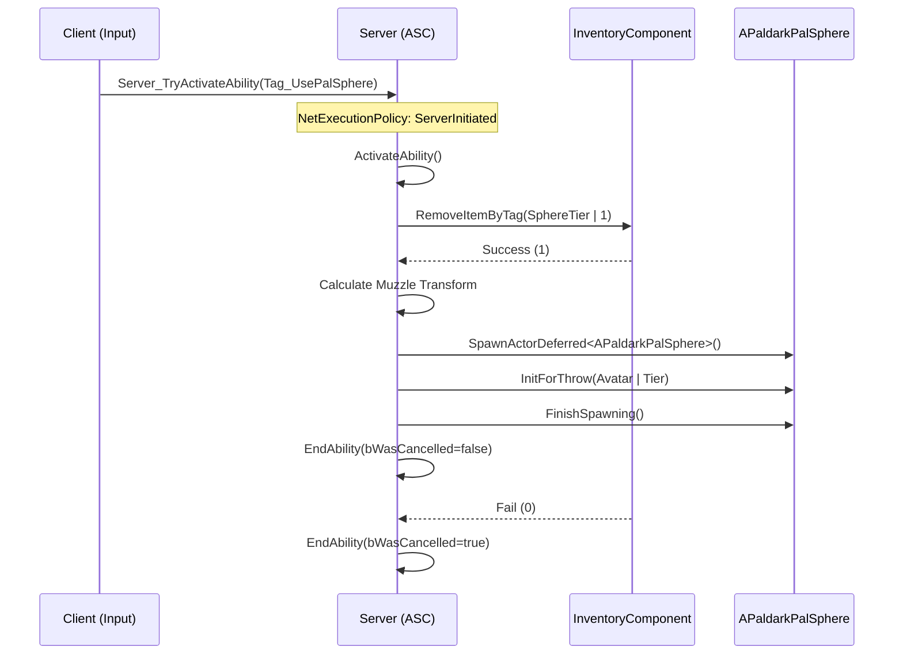
```mermaid
sequenceDiagram
    participant C as Client (Input)
    participant S as Server (ASC)
    participant I as InventoryComponent
    participant P as APaldarkPalSphere
    C->>S: Server_TryActivateAbility(Tag_UsePalSphere)
    Note over S: NetExecutionPolicy: ServerInitiated
    S->>S: ActivateAbility()
    S->>I: RemoveItemByTag(SphereTier | 1)
    I-->>S: Success (1)
    S->>S: Calculate Muzzle Transform
    S->>P: SpawnActorDeferred<APaldarkPalSphere>()
    S->>P: InitForThrow(Avatar | Tier)
    S->>P: FinishSpawning()
    S->>S: EndAbility(bWasCancelled=false)
    I-->>S: Fail (0)
    S->>S: EndAbility(bWasCancelled=true)
```

Sources: [Source/PaldarkLab/Private/Gas/Abilities/PaldarkGameplayAbility_UsePalSphere.cpp#31-135](https://github.com/thanhtinpro/devin-paldarklab/blob/864c77b4/Source/PaldarkLab/Private/Gas/Abilities/PaldarkGameplayAbility_UsePalSphere.cpp#L31-L135)[Source/PaldarkLab/Public/Gas/Abilities/PaldarkGameplayAbility_UsePalSphere.h#8-18](https://github.com/thanhtinpro/devin-paldarklab/blob/864c77b4/Source/PaldarkLab/Public/Gas/Abilities/PaldarkGameplayAbility_UsePalSphere.h#L8-L18)

---

# Pal-Attack-Abilities

# Pal Attack Abilities
Relevant source files

- [Source/PaldarkLab/Private/Gas/Abilities/PaldarkGameplayAbility_PalAttack.cpp](https://github.com/thanhtinpro/devin-paldarklab/blob/864c77b4/Source/PaldarkLab/Private/Gas/Abilities/PaldarkGameplayAbility_PalAttack.cpp)
- [Source/PaldarkLab/Private/Gas/Abilities/PaldarkGameplayAbility_PalAttack_Bite.cpp](https://github.com/thanhtinpro/devin-paldarklab/blob/864c77b4/Source/PaldarkLab/Private/Gas/Abilities/PaldarkGameplayAbility_PalAttack_Bite.cpp)
- [Source/PaldarkLab/Private/Gas/Abilities/PaldarkGameplayAbility_PalAttack_ChainLightning.cpp](https://github.com/thanhtinpro/devin-paldarklab/blob/864c77b4/Source/PaldarkLab/Private/Gas/Abilities/PaldarkGameplayAbility_PalAttack_ChainLightning.cpp)
- [Source/PaldarkLab/Private/Gas/Abilities/PaldarkGameplayAbility_PalAttack_Charge.cpp](https://github.com/thanhtinpro/devin-paldarklab/blob/864c77b4/Source/PaldarkLab/Private/Gas/Abilities/PaldarkGameplayAbility_PalAttack_Charge.cpp)
- [Source/PaldarkLab/Private/Gas/Abilities/PaldarkGameplayAbility_PalAttack_FireBreath.cpp](https://github.com/thanhtinpro/devin-paldarklab/blob/864c77b4/Source/PaldarkLab/Private/Gas/Abilities/PaldarkGameplayAbility_PalAttack_FireBreath.cpp)
- [Source/PaldarkLab/Private/Gas/Abilities/PaldarkGameplayAbility_PalAttack_VineWhip.cpp](https://github.com/thanhtinpro/devin-paldarklab/blob/864c77b4/Source/PaldarkLab/Private/Gas/Abilities/PaldarkGameplayAbility_PalAttack_VineWhip.cpp)
- [Source/PaldarkLab/Public/Gas/Abilities/PaldarkGameplayAbility_PalAttack.h](https://github.com/thanhtinpro/devin-paldarklab/blob/864c77b4/Source/PaldarkLab/Public/Gas/Abilities/PaldarkGameplayAbility_PalAttack.h)
- [Source/PaldarkLab/Public/Gas/Abilities/PaldarkGameplayAbility_PalAttack_ChainLightning.h](https://github.com/thanhtinpro/devin-paldarklab/blob/864c77b4/Source/PaldarkLab/Public/Gas/Abilities/PaldarkGameplayAbility_PalAttack_ChainLightning.h)
- [Source/PaldarkLab/Public/Gas/Abilities/PaldarkGameplayAbility_PalAttack_Charge.h](https://github.com/thanhtinpro/devin-paldarklab/blob/864c77b4/Source/PaldarkLab/Public/Gas/Abilities/PaldarkGameplayAbility_PalAttack_Charge.h)
- [Source/PaldarkLab/Public/Gas/Abilities/PaldarkGameplayAbility_PalAttack_FireBreath.h](https://github.com/thanhtinpro/devin-paldarklab/blob/864c77b4/Source/PaldarkLab/Public/Gas/Abilities/PaldarkGameplayAbility_PalAttack_FireBreath.h)
- [Source/PaldarkLab/Public/Gas/Abilities/PaldarkGameplayAbility_PalAttack_VineWhip.h](https://github.com/thanhtinpro/devin-paldarklab/blob/864c77b4/Source/PaldarkLab/Public/Gas/Abilities/PaldarkGameplayAbility_PalAttack_VineWhip.h)
- [Source/PaldarkLab/Public/Pal/PaldarkPalCharacter_Vinewraith.h](https://github.com/thanhtinpro/devin-paldarklab/blob/864c77b4/Source/PaldarkLab/Public/Pal/PaldarkPalCharacter_Vinewraith.h)

The Pal Attack Ability system provides a server-authoritative framework for AI-driven combat. Unlike player abilities which rely on client prediction and input binding, Pal attacks are triggered by the AI's combat activity and executed exclusively on the server to maintain game state integrity.

## UPaldarkGameplayAbility_PalAttack Base Class

`UPaldarkGameplayAbility_PalAttack` is the foundational class for all Pal combat maneuvers [Source/PaldarkLab/Public/Gas/Abilities/PaldarkGameplayAbility_PalAttack.h#38-39](https://github.com/thanhtinpro/devin-paldarklab/blob/864c77b4/Source/PaldarkLab/Public/Gas/Abilities/PaldarkGameplayAbility_PalAttack.h#L38-L39) It abstracts the complexity of resolving targets and applying damage through the Gameplay Ability System (GAS).

### Key Architectural Decisions

- No Input Tags: Pal abilities are triggered via `TryActivateAbility` by the `UPaldarkPalCombatComponent` or combat activities, rather than player input [Source/PaldarkLab/Private/Gas/Abilities/PaldarkGameplayAbility_PalAttack.cpp#16-17](https://github.com/thanhtinpro/devin-paldarklab/blob/864c77b4/Source/PaldarkLab/Private/Gas/Abilities/PaldarkGameplayAbility_PalAttack.cpp#L16-L17)
- Server-Only Execution: `NetExecutionPolicy` is set to `ServerOnly`. Clients do not predict Pal attacks; they observe the results (attribute changes, animations) via standard replication [Source/PaldarkLab/Private/Gas/Abilities/PaldarkGameplayAbility_PalAttack.cpp#21-23](https://github.com/thanhtinpro/devin-paldarklab/blob/864c77b4/Source/PaldarkLab/Private/Gas/Abilities/PaldarkGameplayAbility_PalAttack.cpp#L21-L23)
- Target Resolution: The ability resolves the target's `UAbilitySystemComponent` (ASC) by checking if the target actor implements `IAbilitySystemInterface`. If the target is a player pawn, it automatically routes the request to the associated `APlayerState` to find the ASC [Source/PaldarkLab/Private/Gas/Abilities/PaldarkGameplayAbility_PalAttack.cpp#75-94](https://github.com/thanhtinpro/devin-paldarklab/blob/864c77b4/Source/PaldarkLab/Private/Gas/Abilities/PaldarkGameplayAbility_PalAttack.cpp#L75-L94)

### Data Flow: Pal Attack Activation

The following diagram illustrates how a Pal attack resolves the source and target entities to apply a Gameplay Effect.

Pal Attack Resolution Flow

[Flowchart Diagram]

Sources: [Source/PaldarkLab/Private/Gas/Abilities/PaldarkGameplayAbility_PalAttack.cpp#39-152](https://github.com/thanhtinpro/devin-paldarklab/blob/864c77b4/Source/PaldarkLab/Private/Gas/Abilities/PaldarkGameplayAbility_PalAttack.cpp#L39-L152)

## Concrete Attack Implementations

The system includes specialized subclasses to handle different combat archetypes, from standard melee to complex chain-lightning logic.

### 1. Bite (Standard Melee)

The `UPaldarkGameplayAbility_PalAttack_Bite` is a lightweight specialization used by species like Direhounds. It primarily serves to provide a specific `Paldark.Ability.PalAttack.Bite` tag for AI utility selection [Source/PaldarkLab/Private/Gas/Abilities/PaldarkGameplayAbility_PalAttack_Bite.cpp#5-14](https://github.com/thanhtinpro/devin-paldarklab/blob/864c77b4/Source/PaldarkLab/Private/Gas/Abilities/PaldarkGameplayAbility_PalAttack_Bite.cpp#L5-L14)

### 2. Charge (Physics Knockback)

`UPaldarkGameplayAbility_PalAttack_Charge` (used by Stoneclad) extends the base attack to include a physics impulse. It calculates a launch vector from the Pal to the target, adds a vertical "kicker" to reduce ground friction, and calls `LaunchCharacter` on the target [Source/PaldarkLab/Private/Gas/Abilities/PaldarkGameplayAbility_PalAttack_Charge.cpp#64-77](https://github.com/thanhtinpro/devin-paldarklab/blob/864c77b4/Source/PaldarkLab/Private/Gas/Abilities/PaldarkGameplayAbility_PalAttack_Charge.cpp#L64-L77)

- KnockbackImpulse: Default 1200.f [Source/PaldarkLab/Public/Gas/Abilities/PaldarkGameplayAbility_PalAttack_Charge.h#48](https://github.com/thanhtinpro/devin-paldarklab/blob/864c77b4/Source/PaldarkLab/Public/Gas/Abilities/PaldarkGameplayAbility_PalAttack_Charge.h#L48-L48)
- VerticalLiftRatio: Default 0.25f to ensure the target slides visually [Source/PaldarkLab/Public/Gas/Abilities/PaldarkGameplayAbility_PalAttack_Charge.h#53](https://github.com/thanhtinpro/devin-paldarklab/blob/864c77b4/Source/PaldarkLab/Public/Gas/Abilities/PaldarkGameplayAbility_PalAttack_Charge.h#L53-L53)

### 3. Fire Breath (Cone AoE)

`UPaldarkGameplayAbility_PalAttack_FireBreath` implements a forward-facing cone attack. It performs a sphere overlap and then filters results using a dot-product calculation against the Pal's forward vector [Source/PaldarkLab/Private/Gas/Abilities/PaldarkGameplayAbility_PalAttack_FireBreath.cpp#97-147](https://github.com/thanhtinpro/devin-paldarklab/blob/864c77b4/Source/PaldarkLab/Private/Gas/Abilities/PaldarkGameplayAbility_PalAttack_FireBreath.cpp#L97-L147)

- Team Filtering: It retrieves the Pal's `TeamTag` and ignores any overlapping actors that share the same tag to prevent friendly fire [Source/PaldarkLab/Private/Gas/Abilities/PaldarkGameplayAbility_PalAttack_FireBreath.cpp#130-137](https://github.com/thanhtinpro/devin-paldarklab/blob/864c77b4/Source/PaldarkLab/Private/Gas/Abilities/PaldarkGameplayAbility_PalAttack_FireBreath.cpp#L130-L137)
- Cone Constraints: Uses `ConeRangeCM` and `ConeHalfAngleDeg` to define the volume [Source/PaldarkLab/Public/Gas/Abilities/PaldarkGameplayAbility_PalAttack_FireBreath.h#43-49](https://github.com/thanhtinpro/devin-paldarklab/blob/864c77b4/Source/PaldarkLab/Public/Gas/Abilities/PaldarkGameplayAbility_PalAttack_FireBreath.h#L43-L49)

### 4. Chain Lightning (Iterative Bounce)

`UPaldarkGameplayAbility_PalAttack_ChainLightning` (Boltmane Boss) uses an iterative loop to "bounce" damage between targets.

- Deduplication: Uses a `TSet<AActor*> Hit` to ensure the same target isn't struck twice in a single chain [Source/PaldarkLab/Private/Gas/Abilities/PaldarkGameplayAbility_PalAttack_ChainLightning.cpp#126-141](https://github.com/thanhtinpro/devin-paldarklab/blob/864c77b4/Source/PaldarkLab/Private/Gas/Abilities/PaldarkGameplayAbility_PalAttack_ChainLightning.cpp#L126-L141)
- Bounce Logic: After hitting a target, it searches for the nearest un-hit hostile within `BounceRangeCM`[Source/PaldarkLab/Private/Gas/Abilities/PaldarkGameplayAbility_PalAttack_ChainLightning.cpp#150-184](https://github.com/thanhtinpro/devin-paldarklab/blob/864c77b4/Source/PaldarkLab/Private/Gas/Abilities/PaldarkGameplayAbility_PalAttack_ChainLightning.cpp#L150-L184)
- Falloff: Damage is multiplied by `BounceFalloff` (default 0.7) for each successive jump [Source/PaldarkLab/Private/Gas/Abilities/PaldarkGameplayAbility_PalAttack_ChainLightning.cpp#192](https://github.com/thanhtinpro/devin-paldarklab/blob/864c77b4/Source/PaldarkLab/Private/Gas/Abilities/PaldarkGameplayAbility_PalAttack_ChainLightning.cpp#L192-L192)

Chain Lightning Bounce Logic

[Flowchart Diagram]

Sources: [Source/PaldarkLab/Private/Gas/Abilities/PaldarkGameplayAbility_PalAttack_ChainLightning.cpp#130-193](https://github.com/thanhtinpro/devin-paldarklab/blob/864c77b4/Source/PaldarkLab/Private/Gas/Abilities/PaldarkGameplayAbility_PalAttack_ChainLightning.cpp#L130-L193)

## Damage Configuration

The system uses `SetByCaller` magnitudes to pass damage values to the `UPaldarkDamageExecutionCalculation`. This allows designers to tune Pal damage independently of player weapon damage.

| Tag | Purpose | Source |
| --- | --- | --- |
| `Paldark.SetByCaller.PalDamage` | Primary damage magnitude | `CombatComp->BasePalDamage`[Source/PaldarkLab/Private/Gas/Abilities/PaldarkGameplayAbility_PalAttack.cpp#143-144](https://github.com/thanhtinpro/devin-paldarklab/blob/864c77b4/Source/PaldarkLab/Private/Gas/Abilities/PaldarkGameplayAbility_PalAttack.cpp#L143-L144) |
| `Paldark.SetByCaller.HeadshotMultiplier` | Hardcoded to 1.0f for Pals | `UPaldarkGameplayAbility_PalAttack::ActivateAbility`[Source/PaldarkLab/Private/Gas/Abilities/PaldarkGameplayAbility_PalAttack.cpp#149-150](https://github.com/thanhtinpro/devin-paldarklab/blob/864c77b4/Source/PaldarkLab/Private/Gas/Abilities/PaldarkGameplayAbility_PalAttack.cpp#L149-L150) |

If the `UPaldarkPalCombatComponent` is missing or its `BasePalDamage` is zero, the ability uses a `FallbackBaseDamage` defined in the ability's default properties [Source/PaldarkLab/Private/Gas/Abilities/PaldarkGameplayAbility_PalAttack.cpp#117-119](https://github.com/thanhtinpro/devin-paldarklab/blob/864c77b4/Source/PaldarkLab/Private/Gas/Abilities/PaldarkGameplayAbility_PalAttack.cpp#L117-L119)

Sources:

- [Source/PaldarkLab/Private/Gas/Abilities/PaldarkGameplayAbility_PalAttack.cpp#14-161](https://github.com/thanhtinpro/devin-paldarklab/blob/864c77b4/Source/PaldarkLab/Private/Gas/Abilities/PaldarkGameplayAbility_PalAttack.cpp#L14-L161)
- [Source/PaldarkLab/Public/Gas/Abilities/PaldarkGameplayAbility_PalAttack.h#38-63](https://github.com/thanhtinpro/devin-paldarklab/blob/864c77b4/Source/PaldarkLab/Public/Gas/Abilities/PaldarkGameplayAbility_PalAttack.h#L38-L63)
- [Source/PaldarkLab/Private/Gas/Abilities/PaldarkGameplayAbility_PalAttack_Charge.cpp#13-84](https://github.com/thanhtinpro/devin-paldarklab/blob/864c77b4/Source/PaldarkLab/Private/Gas/Abilities/PaldarkGameplayAbility_PalAttack_Charge.cpp#L13-L84)
- [Source/PaldarkLab/Private/Gas/Abilities/PaldarkGameplayAbility_PalAttack_FireBreath.cpp#48-177](https://github.com/thanhtinpro/devin-paldarklab/blob/864c77b4/Source/PaldarkLab/Private/Gas/Abilities/PaldarkGameplayAbility_PalAttack_FireBreath.cpp#L48-L177)
- [Source/PaldarkLab/Private/Gas/Abilities/PaldarkGameplayAbility_PalAttack_ChainLightning.cpp#77-202](https://github.com/thanhtinpro/devin-paldarklab/blob/864c77b4/Source/PaldarkLab/Private/Gas/Abilities/PaldarkGameplayAbility_PalAttack_ChainLightning.cpp#L77-L202)

---

# Pal-AI-System

# Pal AI System
Relevant source files

- [Source/PaldarkLab/Private/Hub/PaldarkBriefingSessionComponent.cpp](https://github.com/thanhtinpro/devin-paldarklab/blob/864c77b4/Source/PaldarkLab/Private/Hub/PaldarkBriefingSessionComponent.cpp)
- [Source/PaldarkLab/Private/Pal/Components/PaldarkPalActivityComponent.cpp](https://github.com/thanhtinpro/devin-paldarklab/blob/864c77b4/Source/PaldarkLab/Private/Pal/Components/PaldarkPalActivityComponent.cpp)
- [Source/PaldarkLab/Private/Pal/PaldarkPalCharacter.cpp](https://github.com/thanhtinpro/devin-paldarklab/blob/864c77b4/Source/PaldarkLab/Private/Pal/PaldarkPalCharacter.cpp)
- [Source/PaldarkLab/Private/Player/PaldarkCharacter.cpp](https://github.com/thanhtinpro/devin-paldarklab/blob/864c77b4/Source/PaldarkLab/Private/Player/PaldarkCharacter.cpp)
- [Source/PaldarkLab/Private/Player/PaldarkPlayerController.cpp](https://github.com/thanhtinpro/devin-paldarklab/blob/864c77b4/Source/PaldarkLab/Private/Player/PaldarkPlayerController.cpp)
- [Source/PaldarkLab/Public/Hub/PaldarkBriefingSessionComponent.h](https://github.com/thanhtinpro/devin-paldarklab/blob/864c77b4/Source/PaldarkLab/Public/Hub/PaldarkBriefingSessionComponent.h)
- [Source/PaldarkLab/Public/Pal/Components/PaldarkPalActivityComponent.h](https://github.com/thanhtinpro/devin-paldarklab/blob/864c77b4/Source/PaldarkLab/Public/Pal/Components/PaldarkPalActivityComponent.h)
- [Source/PaldarkLab/Public/Pal/PaldarkPalCharacter.h](https://github.com/thanhtinpro/devin-paldarklab/blob/864c77b4/Source/PaldarkLab/Public/Pal/PaldarkPalCharacter.h)
- [Source/PaldarkLab/Public/Pal/PaldarkPalDefinition.h](https://github.com/thanhtinpro/devin-paldarklab/blob/864c77b4/Source/PaldarkLab/Public/Pal/PaldarkPalDefinition.h)
- [Source/PaldarkLab/Public/Player/Components/PaldarkPlayerActivityComponent.h](https://github.com/thanhtinpro/devin-paldarklab/blob/864c77b4/Source/PaldarkLab/Public/Player/Components/PaldarkPlayerActivityComponent.h)
- [Source/PaldarkLab/Public/Player/PaldarkCharacter.h](https://github.com/thanhtinpro/devin-paldarklab/blob/864c77b4/Source/PaldarkLab/Public/Player/PaldarkCharacter.h)

The Pal AI System is a component-based architecture that drives the behavior, perception, and combat capabilities of Pal entities. Built upon a Finite State Machine (FSM) pattern called the Activity System, it allows Pals to dynamically switch between idle, following, investigating, and combat behaviors based on environmental stimuli and player commands.

## Architecture Overview

The system centers on `APaldarkPalCharacter`, which utilizes a "component slot" pattern to house specialized logic. Unlike players, Pals own their `UPaldarkAbilitySystemComponent` and `UPaldarkAttributeSet` directly on the Actor, as they lack a `PlayerState`[Source/PaldarkLab/Private/Pal/PaldarkPalCharacter.cpp#87-95](https://github.com/thanhtinpro/devin-paldarklab/blob/864c77b4/Source/PaldarkLab/Private/Pal/PaldarkPalCharacter.cpp#L87-L95)

### Pal Component Slots

Every Pal species inherits from `APaldarkPalCharacter` and features 11 specialized component slots:

| Component Slot | Class | Responsibility |
| --- | --- | --- |
| Activity | `UPaldarkPalActivityComponent` | The FSM driver; selects and ticks the current `UPaldarkBaseActivity`. |
| Perception | `UPaldarkPalPerceptionComponent` | Server-only scanning for threats and team-based target acquisition. |
| Combat | `UPaldarkPalCombatComponent` | Manages attack intervals and triggers Gameplay Abilities. |
| Locomotion | `UPaldarkPalLocomotionComponent` | Handles movement toward players or targets with distance gates. |
| Patrol | `UPaldarkPalPatrolComponent` | Manages waypoint cycling for hostile guards. |
| Data | `UPaldarkPalDataComponent` | Holds a reference to the `UPaldarkPalDefinition` data asset. |
| Health | `UPaldarkPalHealthComponent` | Interface for damage and health state. |
| Tame | `UPaldarkPalTameComponent` | Handles capture probability and transition to player ownership. |

Sources:[Source/PaldarkLab/Public/Pal/PaldarkPalCharacter.h#47-60](https://github.com/thanhtinpro/devin-paldarklab/blob/864c77b4/Source/PaldarkLab/Public/Pal/PaldarkPalCharacter.h#L47-L60)[Source/PaldarkLab/Private/Pal/PaldarkPalCharacter.cpp#57-86](https://github.com/thanhtinpro/devin-paldarklab/blob/864c77b4/Source/PaldarkLab/Private/Pal/PaldarkPalCharacter.cpp#L57-L86)

## Data-Driven Species Definitions

Pal species are defined using `UPaldarkPalDefinition` Primary Data Assets. These assets serve as the "blueprint" for the async spawn pipeline, allowing the engine to stream per-species assets (meshes, animations, abilities) only when needed [Source/PaldarkLab/Public/Pal/PaldarkPalDefinition.h#1-19](https://github.com/thanhtinpro/devin-paldarklab/blob/864c77b4/Source/PaldarkLab/Public/Pal/PaldarkPalDefinition.h#L1-L19)

### Species Definition Pipeline

1. Identity:`SpeciesTag` (e.g., `Paldark.Pal.Species.Direhound`) and `DisplayName`.
2. Asset Bundles: Soft references to `PalClass`, `SkeletalMesh`, and `AnimInstanceClass` categorized under the "Spawn" bundle for async loading.
3. GAS Integration:`GrantedAbilities` are pushed to the Pal's ASC upon possession [Source/PaldarkLab/Public/Pal/PaldarkPalDefinition.h#90-95](https://github.com/thanhtinpro/devin-paldarklab/blob/864c77b4/Source/PaldarkLab/Public/Pal/PaldarkPalDefinition.h#L90-L95)
4. Tuning: Defines `MaxHealth`, `MoveSpeedBase`, and capture parameters like `TameDifficulty`.

For details on the async spawning flow and species setup, see [Pal Spawning and Species Definitions](#5.4).

Sources:[Source/PaldarkLab/Public/Pal/PaldarkPalDefinition.h#44-123](https://github.com/thanhtinpro/devin-paldarklab/blob/864c77b4/Source/PaldarkLab/Public/Pal/PaldarkPalDefinition.h#L44-L123)

## The Activity FSM Driver

The `UPaldarkPalActivityComponent` acts as the brain of the Pal. It maintains a list of `CandidateActivities` and re-evaluates which one should be active every `SelectionInterval` (default 0.25s) [Source/PaldarkLab/Public/Pal/Components/PaldarkPalActivityComponent.h#1-7](https://github.com/thanhtinpro/devin-paldarklab/blob/864c77b4/Source/PaldarkLab/Public/Pal/Components/PaldarkPalActivityComponent.h#L1-L7)

### Selection Logic

The FSM uses a priority-based ladder. At every interval, it calls `EvaluateAndSwitch()`:

1. Preemption: If a candidate has a higher `Priority` than the `CurrentActivity` and its `CanRun()` returns true, it interrupts immediately.
2. Hysteresis: If no higher priority activity is found, the `CurrentActivity` is checked via `ShouldContinue()`. This prevents "flickering" between states (e.g., stopping and starting a Follow behavior at the edge of a distance threshold) [Source/PaldarkLab/Private/Pal/Components/PaldarkPalActivityComponent.cpp#122-148](https://github.com/thanhtinpro/devin-paldarklab/blob/864c77b4/Source/PaldarkLab/Private/Pal/Components/PaldarkPalActivityComponent.cpp#L122-L148)

For the full priority ladder and FSM state logic, see [Activity FSM Architecture](#5.1). For details on specific behaviors like Stalk or Investigate, see [Pal Activities Reference](#5.2).

Sources:[Source/PaldarkLab/Private/Pal/Components/PaldarkPalActivityComponent.cpp#13-35](https://github.com/thanhtinpro/devin-paldarklab/blob/864c77b4/Source/PaldarkLab/Private/Pal/Components/PaldarkPalActivityComponent.cpp#L13-L35)[Source/PaldarkLab/Public/Pal/Components/PaldarkPalActivityComponent.h#62-68](https://github.com/thanhtinpro/devin-paldarklab/blob/864c77b4/Source/PaldarkLab/Public/Pal/Components/PaldarkPalActivityComponent.h#L62-L68)

## Perception and Combat Pipeline

The Pal AI interacts with the world through a server-authoritative pipeline:

### Perception to Activity Bridge

[Flowchart Diagram]

Sources:[Source/PaldarkLab/Private/Pal/PaldarkPalCharacter.cpp#62-66](https://github.com/thanhtinpro/devin-paldarklab/blob/864c77b4/Source/PaldarkLab/Private/Pal/PaldarkPalCharacter.cpp#L62-L66)[Source/PaldarkLab/Private/Pal/Components/PaldarkPalActivityComponent.cpp#28-34](https://github.com/thanhtinpro/devin-paldarklab/blob/864c77b4/Source/PaldarkLab/Private/Pal/Components/PaldarkPalActivityComponent.cpp#L28-L34)

### System Interaction Map

[Flowchart Diagram]

Sources:[Source/PaldarkLab/Public/Pal/PaldarkPalCharacter.h#84-94](https://github.com/thanhtinpro/devin-paldarklab/blob/864c77b4/Source/PaldarkLab/Public/Pal/PaldarkPalCharacter.h#L84-L94)[Source/PaldarkLab/Public/Pal/PaldarkPalDefinition.h#45-50](https://github.com/thanhtinpro/devin-paldarklab/blob/864c77b4/Source/PaldarkLab/Public/Pal/PaldarkPalDefinition.h#L45-L50)

## Coordination and Packs

Hostile Pals can be grouped into packs using `PackTag` (e.g., `Paldark.Pal.Pack.Direhound`). The `UPaldarkHostilePackSubsystem` allows a single Pal's perception of a threat to "fan out" to all nearby pack members, triggering coordinated combat or stalking behaviors across the group.

For more information, see [Hostile Pack Subsystem](#5.5).

Sources:[Source/PaldarkLab/Public/Pal/PaldarkPalCharacter.h#108-112](https://github.com/thanhtinpro/devin-paldarklab/blob/864c77b4/Source/PaldarkLab/Public/Pal/PaldarkPalCharacter.h#L108-L112)[Source/PaldarkLab/Private/Pal/PaldarkPalCharacter.cpp#156-159](https://github.com/thanhtinpro/devin-paldarklab/blob/864c77b4/Source/PaldarkLab/Private/Pal/PaldarkPalCharacter.cpp#L156-L159)

## Child Pages

- [Activity FSM Architecture](#5.1) — Detailed logic of the state machine and priority levels.
- [Pal Activities Reference](#5.2) — Technical implementation of Idle, Follow, Investigate, Combat, and Boss phases.
- [Pal Components: Perception, Combat, Locomotion, and Tame](#5.3) — Deep dive into the functional components.
- [Pal Spawning and Species Definitions](#5.4) — The async loading pipeline and `UPaldarkPalDefinition` setup.
- [Hostile Pack Subsystem](#5.5) — Coordinated AI behavior and pack communication.

---

# Activity-FSM-Architecture

# Activity FSM Architecture
Relevant source files

- [Source/PaldarkLab/Private/Hub/PaldarkBriefingSessionComponent.cpp](https://github.com/thanhtinpro/devin-paldarklab/blob/864c77b4/Source/PaldarkLab/Private/Hub/PaldarkBriefingSessionComponent.cpp)
- [Source/PaldarkLab/Private/Pal/Activities/PaldarkActivity_Combat.cpp](https://github.com/thanhtinpro/devin-paldarklab/blob/864c77b4/Source/PaldarkLab/Private/Pal/Activities/PaldarkActivity_Combat.cpp)
- [Source/PaldarkLab/Private/Pal/Activities/PaldarkActivity_Follow.cpp](https://github.com/thanhtinpro/devin-paldarklab/blob/864c77b4/Source/PaldarkLab/Private/Pal/Activities/PaldarkActivity_Follow.cpp)
- [Source/PaldarkLab/Private/Pal/Activities/PaldarkActivity_FollowSquadCommand.cpp](https://github.com/thanhtinpro/devin-paldarklab/blob/864c77b4/Source/PaldarkLab/Private/Pal/Activities/PaldarkActivity_FollowSquadCommand.cpp)
- [Source/PaldarkLab/Private/Pal/Activities/PaldarkActivity_Idle.cpp](https://github.com/thanhtinpro/devin-paldarklab/blob/864c77b4/Source/PaldarkLab/Private/Pal/Activities/PaldarkActivity_Idle.cpp)
- [Source/PaldarkLab/Private/Pal/Activities/PaldarkActivity_Patrol.cpp](https://github.com/thanhtinpro/devin-paldarklab/blob/864c77b4/Source/PaldarkLab/Private/Pal/Activities/PaldarkActivity_Patrol.cpp)
- [Source/PaldarkLab/Private/Pal/Activities/PaldarkActivity_Stalk.cpp](https://github.com/thanhtinpro/devin-paldarklab/blob/864c77b4/Source/PaldarkLab/Private/Pal/Activities/PaldarkActivity_Stalk.cpp)
- [Source/PaldarkLab/Private/Pal/Activities/PaldarkBaseActivity.cpp](https://github.com/thanhtinpro/devin-paldarklab/blob/864c77b4/Source/PaldarkLab/Private/Pal/Activities/PaldarkBaseActivity.cpp)
- [Source/PaldarkLab/Private/Pal/Components/PaldarkPalActivityComponent.cpp](https://github.com/thanhtinpro/devin-paldarklab/blob/864c77b4/Source/PaldarkLab/Private/Pal/Components/PaldarkPalActivityComponent.cpp)
- [Source/PaldarkLab/Public/Hub/PaldarkBriefingSessionComponent.h](https://github.com/thanhtinpro/devin-paldarklab/blob/864c77b4/Source/PaldarkLab/Public/Hub/PaldarkBriefingSessionComponent.h)
- [Source/PaldarkLab/Public/Pal/Activities/PaldarkActivity_Follow.h](https://github.com/thanhtinpro/devin-paldarklab/blob/864c77b4/Source/PaldarkLab/Public/Pal/Activities/PaldarkActivity_Follow.h)
- [Source/PaldarkLab/Public/Pal/Activities/PaldarkActivity_Idle.h](https://github.com/thanhtinpro/devin-paldarklab/blob/864c77b4/Source/PaldarkLab/Public/Pal/Activities/PaldarkActivity_Idle.h)
- [Source/PaldarkLab/Public/Pal/Activities/PaldarkActivity_Patrol.h](https://github.com/thanhtinpro/devin-paldarklab/blob/864c77b4/Source/PaldarkLab/Public/Pal/Activities/PaldarkActivity_Patrol.h)
- [Source/PaldarkLab/Public/Pal/Activities/PaldarkActivity_Stalk.h](https://github.com/thanhtinpro/devin-paldarklab/blob/864c77b4/Source/PaldarkLab/Public/Pal/Activities/PaldarkActivity_Stalk.h)
- [Source/PaldarkLab/Public/Pal/Activities/PaldarkBaseActivity.h](https://github.com/thanhtinpro/devin-paldarklab/blob/864c77b4/Source/PaldarkLab/Public/Pal/Activities/PaldarkBaseActivity.h)
- [Source/PaldarkLab/Public/Pal/Components/PaldarkPalActivityComponent.h](https://github.com/thanhtinpro/devin-paldarklab/blob/864c77b4/Source/PaldarkLab/Public/Pal/Components/PaldarkPalActivityComponent.h)
- [Source/PaldarkLab/Public/Player/Components/PaldarkPlayerActivityComponent.h](https://github.com/thanhtinpro/devin-paldarklab/blob/864c77b4/Source/PaldarkLab/Public/Player/Components/PaldarkPlayerActivityComponent.h)

The Pal AI system in PaldarkLab utilizes a Finite State Machine (FSM) pattern to drive behavior. Unlike traditional Unreal Engine AI which relies heavily on Behavior Trees, PaldarkLab employs a "BaseActivity" pattern inspired by *Ready or Not*. This architecture centralizes decision-making into discrete, priority-weighted `UObject` instances that manage their own lifecycle and movement logic.

## Core Components

The architecture consists of two primary parts: the driver component and the atomic activity objects.

### UPaldarkPalActivityComponent

The `UPaldarkPalActivityComponent` acts as the FSM driver. It is responsible for instantiating the activity pool, ticking the active state, and evaluating transitions [Source/PaldarkLab/Public/Pal/Components/PaldarkPalActivityComponent.h#3-7](https://github.com/thanhtinpro/devin-paldarklab/blob/864c77b4/Source/PaldarkLab/Public/Pal/Components/PaldarkPalActivityComponent.h#L3-L7)

- Server-Authoritative: The FSM runs exclusively on the server. Clients observe the results through replicated movement and animation states [Source/PaldarkLab/Private/Pal/Components/PaldarkPalActivityComponent.cpp#18-45](https://github.com/thanhtinpro/devin-paldarklab/blob/864c77b4/Source/PaldarkLab/Private/Pal/Components/PaldarkPalActivityComponent.cpp#L18-L45)
- Selection Interval: To optimize performance, the FSM does not re-evaluate every frame. Instead, it uses a `SelectionInterval` (default 0.25s) to check if a higher-priority activity should preempt the current one [Source/PaldarkLab/Public/Pal/Components/PaldarkPalActivityComponent.h#65-67](https://github.com/thanhtinpro/devin-paldarklab/blob/864c77b4/Source/PaldarkLab/Public/Pal/Components/PaldarkPalActivityComponent.h#L65-L67)
- Activity Pool: On `BeginPlay`, the component instantiates all classes defined in `CandidateActivities` into an `ActivityInstances` array [Source/PaldarkLab/Private/Pal/Components/PaldarkPalActivityComponent.cpp#94-120](https://github.com/thanhtinpro/devin-paldarklab/blob/864c77b4/Source/PaldarkLab/Private/Pal/Components/PaldarkPalActivityComponent.cpp#L94-L120)

### UPaldarkBaseActivity

The `UPaldarkBaseActivity` is the abstract base for all Pal behaviors. Each activity is a `UObject` that defines its own conditions for running and its internal logic [Source/PaldarkLab/Public/Pal/Activities/PaldarkBaseActivity.h#3-9](https://github.com/thanhtinpro/devin-paldarklab/blob/864c77b4/Source/PaldarkLab/Public/Pal/Activities/PaldarkBaseActivity.h#L3-L9)

#### Key Lifecycle Methods:

- `CanRun()`: Returns true if the activity's conditions are met (e.g., a threat is detected for Combat) [Source/PaldarkLab/Public/Pal/Activities/PaldarkBaseActivity.h#57-62](https://github.com/thanhtinpro/devin-paldarklab/blob/864c77b4/Source/PaldarkLab/Public/Pal/Activities/PaldarkBaseActivity.h#L57-L62)
- `ShouldContinue()`: A hysteresis hook. It allows an activity to "stick" even if `CanRun()` becomes false (e.g., finishing a move to a location) [Source/PaldarkLab/Public/Pal/Activities/PaldarkBaseActivity.h#64-70](https://github.com/thanhtinpro/devin-paldarklab/blob/864c77b4/Source/PaldarkLab/Public/Pal/Activities/PaldarkBaseActivity.h#L64-L70)
- `EnterActivity()` / `ExitActivity()`: Setup and cleanup hooks called during transitions [Source/PaldarkLab/Public/Pal/Activities/PaldarkBaseActivity.h#74-84](https://github.com/thanhtinpro/devin-paldarklab/blob/864c77b4/Source/PaldarkLab/Public/Pal/Activities/PaldarkBaseActivity.h#L74-L84)
- `TickActivity()`: Runs every component tick while the activity is active [Source/PaldarkLab/Public/Pal/Activities/PaldarkBaseActivity.h#78-80](https://github.com/thanhtinpro/devin-paldarklab/blob/864c77b4/Source/PaldarkLab/Public/Pal/Activities/PaldarkBaseActivity.h#L78-L80)

Sources:

- [Source/PaldarkLab/Public/Pal/Components/PaldarkPalActivityComponent.h#29-100](https://github.com/thanhtinpro/devin-paldarklab/blob/864c77b4/Source/PaldarkLab/Public/Pal/Components/PaldarkPalActivityComponent.h#L29-L100)
- [Source/PaldarkLab/Private/Pal/Components/PaldarkPalActivityComponent.cpp#13-92](https://github.com/thanhtinpro/devin-paldarklab/blob/864c77b4/Source/PaldarkLab/Private/Pal/Components/PaldarkPalActivityComponent.cpp#L13-L92)
- [Source/PaldarkLab/Public/Pal/Activities/PaldarkBaseActivity.h#43-120](https://github.com/thanhtinpro/devin-paldarklab/blob/864c77b4/Source/PaldarkLab/Public/Pal/Activities/PaldarkBaseActivity.h#L43-L120)

---

## Priority Ladder and Selection Logic

Activities are selected based on a fixed priority ladder. When the `SelectionInterval` elapses, the component evaluates all candidates. A higher priority activity will always preempt a lower priority one if its `CanRun()` returns true [Source/PaldarkLab/Private/Pal/Components/PaldarkPalActivityComponent.cpp#122-168](https://github.com/thanhtinpro/devin-paldarklab/blob/864c77b4/Source/PaldarkLab/Private/Pal/Components/PaldarkPalActivityComponent.cpp#L122-L168)

### The Priority Ladder

| Priority | Activity | Tag | Description |
| --- | --- | --- | --- |
| 40 | Combat | `Paldark.Pal.Activity.Combat` | Engages threats using utility-based scoring [Source/PaldarkLab/Private/Pal/Activities/PaldarkActivity_Combat.cpp#16-19](https://github.com/thanhtinpro/devin-paldarklab/blob/864c77b4/Source/PaldarkLab/Private/Pal/Activities/PaldarkActivity_Combat.cpp#L16-L19) |
| 30 | Investigate | `Paldark.Pal.Activity.Investigate` | Moves to a pinged location or sound source [Source/PaldarkLab/Private/Pal/Components/PaldarkPalActivityComponent.cpp#24](https://github.com/thanhtinpro/devin-paldarklab/blob/864c77b4/Source/PaldarkLab/Private/Pal/Components/PaldarkPalActivityComponent.cpp#L24-L24) |
| 25 | Stalk | `Paldark.Pal.Activity.Stalk` | Sneaks toward a threat outside of engagement range [Source/PaldarkLab/Private/Pal/Activities/PaldarkActivity_Stalk.cpp#15-19](https://github.com/thanhtinpro/devin-paldarklab/blob/864c77b4/Source/PaldarkLab/Private/Pal/Activities/PaldarkActivity_Stalk.cpp#L15-L19) |
| 22 | FollowSquadCommand | `Paldark.Pal.Activity.FollowSquadCommand` | Reacts to player-issued squad commands [Source/PaldarkLab/Private/Pal/Activities/PaldarkActivity_FollowSquadCommand.cpp#19-20](https://github.com/thanhtinpro/devin-paldarklab/blob/864c77b4/Source/PaldarkLab/Private/Pal/Activities/PaldarkActivity_FollowSquadCommand.cpp#L19-L20) |
| 20 | Follow | `Paldark.Pal.Activity.Follow` | Default behavior for friendly Pals to follow their owner [Source/PaldarkLab/Private/Pal/Components/PaldarkPalActivityComponent.cpp#23](https://github.com/thanhtinpro/devin-paldarklab/blob/864c77b4/Source/PaldarkLab/Private/Pal/Components/PaldarkPalActivityComponent.cpp#L23-L23) |
| 15 | Patrol | `Paldark.Pal.Activity.Patrol` | Walks between designer-authored waypoints [Source/PaldarkLab/Private/Pal/Activities/PaldarkActivity_Patrol.cpp#14-18](https://github.com/thanhtinpro/devin-paldarklab/blob/864c77b4/Source/PaldarkLab/Private/Pal/Activities/PaldarkActivity_Patrol.cpp#L14-L18) |
| 10 | Idle | `Paldark.Pal.Activity.Idle` | Fallback state when no other conditions are met [Source/PaldarkLab/Private/Pal/Activities/PaldarkActivity_Idle.cpp#8-9](https://github.com/thanhtinpro/devin-paldarklab/blob/864c77b4/Source/PaldarkLab/Private/Pal/Activities/PaldarkActivity_Idle.cpp#L8-L9) |

### Selection Flow (Code Entity Space)

This diagram illustrates how the `UPaldarkPalActivityComponent` iterates through `UPaldarkBaseActivity` instances to determine the active state.

Title: Activity Selection and Preemption Logic

[Flowchart Diagram]

Sources:

- [Source/PaldarkLab/Private/Pal/Components/PaldarkPalActivityComponent.cpp#122-192](https://github.com/thanhtinpro/devin-paldarklab/blob/864c77b4/Source/PaldarkLab/Private/Pal/Components/PaldarkPalActivityComponent.cpp#L122-L192)
- [Source/PaldarkLab/Public/Pal/Activities/PaldarkBaseActivity.h#57-70](https://github.com/thanhtinpro/devin-paldarklab/blob/864c77b4/Source/PaldarkLab/Public/Pal/Activities/PaldarkBaseActivity.h#L57-L70)

---

## Data Flow: Perception to Activity

The transition from a passive state (Patrol/Follow) to an aggressive state (Stalk/Combat) is driven by the `UPaldarkPalPerceptionComponent`.

1. Perception Update: The perception component identifies a threat.
2. Activity Evaluation: On the next `SelectionInterval`, `UPaldarkActivity_Combat::CanRun()` is called.
3. Utility Scoring: Combat uses `BuildConsiderations` to calculate a utility score based on `ThreatDistance`, `PalHealth`, and `AttackReady`[Source/PaldarkLab/Private/Pal/Activities/PaldarkActivity_Combat.cpp#46-82](https://github.com/thanhtinpro/devin-paldarklab/blob/864c77b4/Source/PaldarkLab/Private/Pal/Activities/PaldarkActivity_Combat.cpp#L46-L82)
4. Preemption: Since Combat has Priority 40, it immediately preempts Patrol (15) or Follow (20) if the utility score meets the `MinUtilityScore` threshold [Source/PaldarkLab/Private/Pal/Activities/PaldarkActivity_Combat.cpp#84-111](https://github.com/thanhtinpro/devin-paldarklab/blob/864c77b4/Source/PaldarkLab/Private/Pal/Activities/PaldarkActivity_Combat.cpp#L84-L111)

Title: Natural Language to Code Entity Mapping (Combat Transition)

[Flowchart Diagram]

Sources:

- [Source/PaldarkLab/Private/Pal/Activities/PaldarkActivity_Combat.cpp#46-180](https://github.com/thanhtinpro/devin-paldarklab/blob/864c77b4/Source/PaldarkLab/Private/Pal/Activities/PaldarkActivity_Combat.cpp#L46-L180)
- [Source/PaldarkLab/Private/Pal/Activities/PaldarkActivity_Patrol.cpp#53-63](https://github.com/thanhtinpro/devin-paldarklab/blob/864c77b4/Source/PaldarkLab/Private/Pal/Activities/PaldarkActivity_Patrol.cpp#L53-L63)

---

## Implementation Details

### Hysteresis and Sticky States

To prevent "flickering" between states (e.g., a Pal stopping and starting repeatedly at the edge of a follow radius), activities use `ShouldContinue`.

- Follow: Uses Enter/Exit distance thresholds (hysteresis).
- Investigate: Sticks until the Pal reaches the target location, even if the player moves away [Source/PaldarkLab/Private/Pal/Components/PaldarkPalActivityComponent.cpp#124-127](https://github.com/thanhtinpro/devin-paldarklab/blob/864c77b4/Source/PaldarkLab/Private/Pal/Components/PaldarkPalActivityComponent.cpp#L124-L127)
- FollowSquadCommand: Sticks until the Pal arrives at the command location or a `Stay` command is issued [Source/PaldarkLab/Private/Pal/Activities/PaldarkActivity_FollowSquadCommand.cpp#90-135](https://github.com/thanhtinpro/devin-paldarklab/blob/864c77b4/Source/PaldarkLab/Private/Pal/Activities/PaldarkActivity_FollowSquadCommand.cpp#L90-L135)

### Movement Integration

Activities do not move the Pal directly via Pathfinding in the current version. Instead, they provide input to the `ACharacter` movement system:

- Steering: Activities like `Patrol` and `FollowSquadCommand` calculate a planar delta to their target and call `AddMovementInput`[Source/PaldarkLab/Private/Pal/Activities/PaldarkActivity_Patrol.cpp#97-108](https://github.com/thanhtinpro/devin-paldarklab/blob/864c77b4/Source/PaldarkLab/Private/Pal/Activities/PaldarkActivity_Patrol.cpp#L97-L108); [Source/PaldarkLab/Private/Pal/Activities/PaldarkActivity_FollowSquadCommand.cpp#166-195](https://github.com/thanhtinpro/devin-paldarklab/blob/864c77b4/Source/PaldarkLab/Private/Pal/Activities/PaldarkActivity_FollowSquadCommand.cpp#L166-L195)
- Locomotion Control: Many activities call `Loco->SetFollowEnabled(false)` on `EnterActivity` to prevent the internal `UPaldarkPalLocomotionComponent` from fighting the activity's specific movement logic [Source/PaldarkLab/Private/Pal/Activities/PaldarkActivity_Idle.cpp#15-18](https://github.com/thanhtinpro/devin-paldarklab/blob/864c77b4/Source/PaldarkLab/Private/Pal/Activities/PaldarkActivity_Idle.cpp#L15-L18); [Source/PaldarkLab/Private/Pal/Activities/PaldarkActivity_Combat.cpp#143-146](https://github.com/thanhtinpro/devin-paldarklab/blob/864c77b4/Source/PaldarkLab/Private/Pal/Activities/PaldarkActivity_Combat.cpp#L143-L146)

Sources:

- [Source/PaldarkLab/Private/Pal/Activities/PaldarkActivity_FollowSquadCommand.cpp#90-195](https://github.com/thanhtinpro/devin-paldarklab/blob/864c77b4/Source/PaldarkLab/Private/Pal/Activities/PaldarkActivity_FollowSquadCommand.cpp#L90-L195)
- [Source/PaldarkLab/Private/Pal/Activities/PaldarkActivity_Patrol.cpp#88-109](https://github.com/thanhtinpro/devin-paldarklab/blob/864c77b4/Source/PaldarkLab/Private/Pal/Activities/PaldarkActivity_Patrol.cpp#L88-L109)
- [Source/PaldarkLab/Private/Pal/Activities/PaldarkActivity_Combat.cpp#155-176](https://github.com/thanhtinpro/devin-paldarklab/blob/864c77b4/Source/PaldarkLab/Private/Pal/Activities/PaldarkActivity_Combat.cpp#L155-L176)

---

# Pal-Activities-Reference

# Pal Activities Reference
Relevant source files

- [Documents/Devlog/W18-19-Build.md](https://github.com/thanhtinpro/devin-paldarklab/blob/864c77b4/Documents/Devlog/W18-19-Build.md?plain=1)
- [Source/PaldarkLab/Private/Loot/PaldarkLootBag.cpp](https://github.com/thanhtinpro/devin-paldarklab/blob/864c77b4/Source/PaldarkLab/Private/Loot/PaldarkLootBag.cpp)
- [Source/PaldarkLab/Private/Pal/Activities/PaldarkActivity_BossPhase.cpp](https://github.com/thanhtinpro/devin-paldarklab/blob/864c77b4/Source/PaldarkLab/Private/Pal/Activities/PaldarkActivity_BossPhase.cpp)
- [Source/PaldarkLab/Private/Pal/Activities/PaldarkActivity_Combat.cpp](https://github.com/thanhtinpro/devin-paldarklab/blob/864c77b4/Source/PaldarkLab/Private/Pal/Activities/PaldarkActivity_Combat.cpp)
- [Source/PaldarkLab/Private/Pal/Activities/PaldarkActivity_Follow.cpp](https://github.com/thanhtinpro/devin-paldarklab/blob/864c77b4/Source/PaldarkLab/Private/Pal/Activities/PaldarkActivity_Follow.cpp)
- [Source/PaldarkLab/Private/Pal/Activities/PaldarkActivity_FollowSquadCommand.cpp](https://github.com/thanhtinpro/devin-paldarklab/blob/864c77b4/Source/PaldarkLab/Private/Pal/Activities/PaldarkActivity_FollowSquadCommand.cpp)
- [Source/PaldarkLab/Private/Pal/Activities/PaldarkActivity_Idle.cpp](https://github.com/thanhtinpro/devin-paldarklab/blob/864c77b4/Source/PaldarkLab/Private/Pal/Activities/PaldarkActivity_Idle.cpp)
- [Source/PaldarkLab/Private/Pal/Activities/PaldarkActivity_Investigate.cpp](https://github.com/thanhtinpro/devin-paldarklab/blob/864c77b4/Source/PaldarkLab/Private/Pal/Activities/PaldarkActivity_Investigate.cpp)
- [Source/PaldarkLab/Private/Pal/Activities/PaldarkActivity_Patrol.cpp](https://github.com/thanhtinpro/devin-paldarklab/blob/864c77b4/Source/PaldarkLab/Private/Pal/Activities/PaldarkActivity_Patrol.cpp)
- [Source/PaldarkLab/Private/Pal/Activities/PaldarkActivity_Stalk.cpp](https://github.com/thanhtinpro/devin-paldarklab/blob/864c77b4/Source/PaldarkLab/Private/Pal/Activities/PaldarkActivity_Stalk.cpp)
- [Source/PaldarkLab/Private/Pal/Activities/PaldarkBaseActivity.cpp](https://github.com/thanhtinpro/devin-paldarklab/blob/864c77b4/Source/PaldarkLab/Private/Pal/Activities/PaldarkBaseActivity.cpp)
- [Source/PaldarkLab/Private/Pal/PaldarkPalCharacter_Boltmane.cpp](https://github.com/thanhtinpro/devin-paldarklab/blob/864c77b4/Source/PaldarkLab/Private/Pal/PaldarkPalCharacter_Boltmane.cpp)
- [Source/PaldarkLab/Public/Loot/PaldarkLootBag.h](https://github.com/thanhtinpro/devin-paldarklab/blob/864c77b4/Source/PaldarkLab/Public/Loot/PaldarkLootBag.h)
- [Source/PaldarkLab/Public/Loot/PaldarkLootTable.h](https://github.com/thanhtinpro/devin-paldarklab/blob/864c77b4/Source/PaldarkLab/Public/Loot/PaldarkLootTable.h)
- [Source/PaldarkLab/Public/Pal/Activities/PaldarkActivity_BossPhase.h](https://github.com/thanhtinpro/devin-paldarklab/blob/864c77b4/Source/PaldarkLab/Public/Pal/Activities/PaldarkActivity_BossPhase.h)
- [Source/PaldarkLab/Public/Pal/Activities/PaldarkActivity_Combat.h](https://github.com/thanhtinpro/devin-paldarklab/blob/864c77b4/Source/PaldarkLab/Public/Pal/Activities/PaldarkActivity_Combat.h)
- [Source/PaldarkLab/Public/Pal/Activities/PaldarkActivity_Follow.h](https://github.com/thanhtinpro/devin-paldarklab/blob/864c77b4/Source/PaldarkLab/Public/Pal/Activities/PaldarkActivity_Follow.h)
- [Source/PaldarkLab/Public/Pal/Activities/PaldarkActivity_Idle.h](https://github.com/thanhtinpro/devin-paldarklab/blob/864c77b4/Source/PaldarkLab/Public/Pal/Activities/PaldarkActivity_Idle.h)
- [Source/PaldarkLab/Public/Pal/Activities/PaldarkActivity_Investigate.h](https://github.com/thanhtinpro/devin-paldarklab/blob/864c77b4/Source/PaldarkLab/Public/Pal/Activities/PaldarkActivity_Investigate.h)
- [Source/PaldarkLab/Public/Pal/Activities/PaldarkActivity_Patrol.h](https://github.com/thanhtinpro/devin-paldarklab/blob/864c77b4/Source/PaldarkLab/Public/Pal/Activities/PaldarkActivity_Patrol.h)
- [Source/PaldarkLab/Public/Pal/Activities/PaldarkActivity_Stalk.h](https://github.com/thanhtinpro/devin-paldarklab/blob/864c77b4/Source/PaldarkLab/Public/Pal/Activities/PaldarkActivity_Stalk.h)
- [Source/PaldarkLab/Public/Pal/Activities/PaldarkBaseActivity.h](https://github.com/thanhtinpro/devin-paldarklab/blob/864c77b4/Source/PaldarkLab/Public/Pal/Activities/PaldarkBaseActivity.h)
- [Source/PaldarkLab/Public/Pal/Components/PaldarkPalCombatComponent.h](https://github.com/thanhtinpro/devin-paldarklab/blob/864c77b4/Source/PaldarkLab/Public/Pal/Components/PaldarkPalCombatComponent.h)
- [Source/PaldarkLab/Public/Pal/PaldarkPalCharacter_Boltmane.h](https://github.com/thanhtinpro/devin-paldarklab/blob/864c77b4/Source/PaldarkLab/Public/Pal/PaldarkPalCharacter_Boltmane.h)

The Pal AI system in PaldarkLab is driven by a Finite State Machine (FSM) where each state is a concrete implementation of `UPaldarkBaseActivity`. These activities are `UObject` instances owned and ticked server-side by the `UPaldarkPalActivityComponent`[Source/PaldarkLab/Public/Pal/Activities/PaldarkBaseActivity.h#1-9](https://github.com/thanhtinpro/devin-paldarklab/blob/864c77b4/Source/PaldarkLab/Public/Pal/Activities/PaldarkBaseActivity.h#L1-L9) Each activity encapsulates the logic for specific behaviors such as following a player, patrolling, or engaging in combat.

## Activity Priority Ladder

Activities are selected based on a priority system. The `UPaldarkPalActivityComponent` evaluates `CanRun()` on all candidate activities and executes the one with the highest priority [Source/PaldarkLab/Public/Pal/Activities/PaldarkBaseActivity.h#4-8](https://github.com/thanhtinpro/devin-paldarklab/blob/864c77b4/Source/PaldarkLab/Public/Pal/Activities/PaldarkBaseActivity.h#L4-L8)

| Activity | Priority | Tag | Purpose |
| --- | --- | --- | --- |
| BossPhase | 50 | `Pal.Activity.BossPhase` | High-priority phase transitions for boss Pals. |
| Combat | 40 | `Pal.Activity.Combat` | Utility-based target engagement. |
| Investigate | 30 | `Pal.Activity.Investigate` | Moving to a pinged location or noise. |
| Stalk | 25 | `Pal.Activity.Stalk` | Slow approach when threat is visible but out of range. |
| FollowCommand | 22 | `Pal.Activity.FollowSquadCommand` | Reacting to specific squad orders (Stay/Attack). |
| Follow | 20 | `Pal.Activity.Follow` | Default companion leashing to player. |
| Patrol | 15 | `Pal.Activity.Patrol` | Waypoint cycling for hostile/idle Pals. |
| Idle | 10 | `Pal.Activity.Idle` | Fallback standing state. |

Sources: [Source/PaldarkLab/Public/Pal/Activities/PaldarkActivity_Combat.h#6-7](https://github.com/thanhtinpro/devin-paldarklab/blob/864c77b4/Source/PaldarkLab/Public/Pal/Activities/PaldarkActivity_Combat.h#L6-L7)[Source/PaldarkLab/Private/Pal/Activities/PaldarkActivity_Patrol.cpp#12-19](https://github.com/thanhtinpro/devin-paldarklab/blob/864c77b4/Source/PaldarkLab/Private/Pal/Activities/PaldarkActivity_Patrol.cpp#L12-L19)[Source/PaldarkLab/Private/Pal/Activities/PaldarkActivity_FollowSquadCommand.cpp#17-21](https://github.com/thanhtinpro/devin-paldarklab/blob/864c77b4/Source/PaldarkLab/Private/Pal/Activities/PaldarkActivity_FollowSquadCommand.cpp#L17-L21)[Source/PaldarkLab/Private/Pal/Activities/PaldarkActivity_BossPhase.cpp#16-20](https://github.com/thanhtinpro/devin-paldarklab/blob/864c77b4/Source/PaldarkLab/Private/Pal/Activities/PaldarkActivity_BossPhase.cpp#L16-L20)

## Concrete Activity Implementations

### Combat Activity

The Combat activity uses a "Utility-AI-lite" scoring system to decide when to engage. It calculates a weighted average of three considerations: `ThreatDistance`, `PalHealth`, and `AttackReady`[Documents/Devlog/W18-19-Build.md#32-42](https://github.com/thanhtinpro/devin-paldarklab/blob/864c77b4/Documents/Devlog/W18-19-Build.md?plain=1#L32-L42)

- Implementation: It re-orients the Pal toward the target using `FMath::RInterpConstantTo` at a rate of `FaceTargetRateDegPerSec` and calls `TryFireAttack()` on the `UPaldarkPalCombatComponent` every tick [Source/PaldarkLab/Private/Pal/Activities/PaldarkActivity_Combat.cpp#155-180](https://github.com/thanhtinpro/devin-paldarklab/blob/864c77b4/Source/PaldarkLab/Private/Pal/Activities/PaldarkActivity_Combat.cpp#L155-L180)
- Hysteresis: It uses a `DisengageDistance` (default 2000cm) to prevent the Pal from instantly dropping combat if the target briefly steps out of the perception radius [Source/PaldarkLab/Public/Pal/Activities/PaldarkActivity_Combat.h#69-74](https://github.com/thanhtinpro/devin-paldarklab/blob/864c77b4/Source/PaldarkLab/Public/Pal/Activities/PaldarkActivity_Combat.h#L69-L74)

Combat Utility Logic

[Flowchart Diagram]

Sources: [Source/PaldarkLab/Private/Pal/Activities/PaldarkActivity_Combat.cpp#46-82](https://github.com/thanhtinpro/devin-paldarklab/blob/864c77b4/Source/PaldarkLab/Private/Pal/Activities/PaldarkActivity_Combat.cpp#L46-L82)[Source/PaldarkLab/Public/Pal/Activities/PaldarkActivity_Combat.h#9-25](https://github.com/thanhtinpro/devin-paldarklab/blob/864c77b4/Source/PaldarkLab/Public/Pal/Activities/PaldarkActivity_Combat.h#L9-L25)

### Follow & FollowSquadCommand

The `UPaldarkActivity_Follow` (companion default) and `UPaldarkActivity_FollowSquadCommand` (player-issued) handle leashing and coordination.

- Follow: Uses `EnterDistance` and `ExitDistance` hysteresis to prevent jittering when the player is near the Pal.
- FollowSquadCommand: Listens to `OnSquadCommandIssued` from the `UPaldarkSquadSubsystem`[Source/PaldarkLab/Private/Pal/Activities/PaldarkActivity_FollowSquadCommand.cpp#30-34](https://github.com/thanhtinpro/devin-paldarklab/blob/864c77b4/Source/PaldarkLab/Private/Pal/Activities/PaldarkActivity_FollowSquadCommand.cpp#L30-L34)
- Stay: Calls `Movement->StopMovementImmediately()` and clears pending input [Source/PaldarkLab/Private/Pal/Activities/PaldarkActivity_FollowSquadCommand.cpp#157-163](https://github.com/thanhtinpro/devin-paldarklab/blob/864c77b4/Source/PaldarkLab/Private/Pal/Activities/PaldarkActivity_FollowSquadCommand.cpp#L157-L163)
- Attack/Regroup: Calculates a planar delta to the target location and calls `AddMovementInput`[Source/PaldarkLab/Private/Pal/Activities/PaldarkActivity_FollowSquadCommand.cpp#187-195](https://github.com/thanhtinpro/devin-paldarklab/blob/864c77b4/Source/PaldarkLab/Private/Pal/Activities/PaldarkActivity_FollowSquadCommand.cpp#L187-L195)

Sources: [Source/PaldarkLab/Private/Pal/Activities/PaldarkActivity_FollowSquadCommand.cpp#148-196](https://github.com/thanhtinpro/devin-paldarklab/blob/864c77b4/Source/PaldarkLab/Private/Pal/Activities/PaldarkActivity_FollowSquadCommand.cpp#L148-L196)

### Stalk Activity

Stalk is used by hostile Pals (like the Direhound pack) to approach a target stealthily before entering full combat.

- Activation: Triggers when a threat is visible but the distance is between `MinEngageRange` and `LoseSightDistance`[Source/PaldarkLab/Private/Pal/Activities/Stalk.cpp#62-66](https://github.com/thanhtinpro/devin-paldarklab/blob/864c77b4/Source/PaldarkLab/Private/Pal/Activities/Stalk.cpp#L62-L66)
- Behavior: It scales the `MaxWalkSpeed` by `StalkSpeedScale` (e.g., 0.5x) to create a stalking visual [Source/PaldarkLab/Private/Pal/Activities/Stalk.cpp#83-95](https://github.com/thanhtinpro/devin-paldarklab/blob/864c77b4/Source/PaldarkLab/Private/Pal/Activities/Stalk.cpp#L83-L95) It restores the original speed in `ExitActivity`[Source/PaldarkLab/Private/Pal/Activities/Stalk.cpp#124-142](https://github.com/thanhtinpro/devin-paldarklab/blob/864c77b4/Source/PaldarkLab/Private/Pal/Activities/Stalk.cpp#L124-L142)

Sources: [Source/PaldarkLab/Private/Pal/Activities/PaldarkActivity_Stalk.cpp#73-96](https://github.com/thanhtinpro/devin-paldarklab/blob/864c77b4/Source/PaldarkLab/Private/Pal/Activities/PaldarkActivity_Stalk.cpp#L73-L96)

### Patrol Activity

A fallback behavior for hostile Pals that cycles through waypoints.

- Implementation: Requires a `UPaldarkPalPatrolComponent`[Source/PaldarkLab/Private/Pal/Activities/PaldarkActivity_Patrol.cpp#44-49](https://github.com/thanhtinpro/devin-paldarklab/blob/864c77b4/Source/PaldarkLab/Private/Pal/Activities/PaldarkActivity_Patrol.cpp#L44-L49) It moves toward `GetCurrentWaypoint()` and calls `AdvanceToNextWaypoint()` once within the `ArrivalRadius`[Source/PaldarkLab/Private/Pal/Activities/PaldarkActivity_Patrol.cpp#97-106](https://github.com/thanhtinpro/devin-paldarklab/blob/864c77b4/Source/PaldarkLab/Private/Pal/Activities/PaldarkActivity_Patrol.cpp#L97-L106)
- Input: Uses `AddMovementInput` to drive the character movement component [Source/PaldarkLab/Private/Pal/Activities/PaldarkActivity_Patrol.cpp#108](https://github.com/thanhtinpro/devin-paldarklab/blob/864c77b4/Source/PaldarkLab/Private/Pal/Activities/PaldarkActivity_Patrol.cpp#L108-L108)

Sources: [Source/PaldarkLab/Private/Pal/Activities/PaldarkActivity_Patrol.cpp#88-109](https://github.com/thanhtinpro/devin-paldarklab/blob/864c77b4/Source/PaldarkLab/Private/Pal/Activities/PaldarkActivity_Patrol.cpp#L88-L109)

### BossPhase Activity

Used for complex encounters (e.g., Boltmane boss). It manages health-based phase transitions.

- Phase Logic: Monotonic transitions: `Normal` → `Enraged` → `Telegraph`[Source/PaldarkLab/Private/Pal/Activities/PaldarkActivity_BossPhase.cpp#103-112](https://github.com/thanhtinpro/devin-paldarklab/blob/864c77b4/Source/PaldarkLab/Private/Pal/Activities/PaldarkActivity_BossPhase.cpp#L103-L112)
- Thresholds: Thresholds are hydrated from `UPaldarkPalDefinition` data assets (e.g., Enraged at 50% HP, Telegraph at 25% HP) [Source/PaldarkLab/Private/Pal/Activities/PaldarkActivity_BossPhase.cpp#76-83](https://github.com/thanhtinpro/devin-paldarklab/blob/864c77b4/Source/PaldarkLab/Private/Pal/Activities/PaldarkActivity_BossPhase.cpp#L76-L83)
- Modifiers: On transition, it applies multipliers to `MaxWalkSpeed` and `AttackInterval` to increase difficulty as the boss loses health [Source/PaldarkLab/Private/Pal/Activities/PaldarkActivity_BossPhase.cpp#199-210](https://github.com/thanhtinpro/devin-paldarklab/blob/864c77b4/Source/PaldarkLab/Private/Pal/Activities/PaldarkActivity_BossPhase.cpp#L199-L210)

Sources: [Source/PaldarkLab/Private/Pal/Activities/PaldarkActivity_BossPhase.cpp#92-139](https://github.com/thanhtinpro/devin-paldarklab/blob/864c77b4/Source/PaldarkLab/Private/Pal/Activities/PaldarkActivity_BossPhase.cpp#L92-L139)

## Data Flow: Activity to Locomotion

This diagram illustrates how a selected Activity communicates with the underlying character movement systems.

Activity Execution Flow

[Flowchart Diagram]

Sources: [Source/PaldarkLab/Public/Pal/Activities/PaldarkBaseActivity.h#1-25](https://github.com/thanhtinpro/devin-paldarklab/blob/864c77b4/Source/PaldarkLab/Public/Pal/Activities/PaldarkBaseActivity.h#L1-L25)[Source/PaldarkLab/Private/Pal/Activities/PaldarkActivity_Patrol.cpp#88-109](https://github.com/thanhtinpro/devin-paldarklab/blob/864c77b4/Source/PaldarkLab/Private/Pal/Activities/PaldarkActivity_Patrol.cpp#L88-L109)[Source/PaldarkLab/Private/Pal/Activities/PaldarkActivity_Combat.cpp#155-176](https://github.com/thanhtinpro/devin-paldarklab/blob/864c77b4/Source/PaldarkLab/Private/Pal/Activities/PaldarkActivity_Combat.cpp#L155-L176)

## Activity Lifecycle Methods

All activities inherit from `UPaldarkBaseActivity` and implement the following pipeline:

| Function | Role |
| --- | --- |
| `InitActivity` | Caches component references (`CombatRef`, `PerceptionRef`) to avoid per-tick `FindComponentByClass` calls [Source/PaldarkLab/Public/Pal/Activities/PaldarkBaseActivity.h#51-55](https://github.com/thanhtinpro/devin-paldarklab/blob/864c77b4/Source/PaldarkLab/Public/Pal/Activities/PaldarkBaseActivity.h#L51-L55) |
| `CanRun` | Returns true if conditions for this activity are met (e.g., target found for Combat) [Source/PaldarkLab/Public/Pal/Activities/PaldarkBaseActivity.h#57-62](https://github.com/thanhtinpro/devin-paldarklab/blob/864c77b4/Source/PaldarkLab/Public/Pal/Activities/PaldarkBaseActivity.h#L57-L62) |
| `ShouldContinue` | Hysteresis check; allows an activity to finish its task even if `CanRun` becomes false [Source/PaldarkLab/Public/Pal/Activities/PaldarkBaseActivity.h#64-70](https://github.com/thanhtinpro/devin-paldarklab/blob/864c77b4/Source/PaldarkLab/Public/Pal/Activities/PaldarkBaseActivity.h#L64-L70) |
| `EnterActivity` | One-time setup: tags the Pal, pauses locomotion leashing, or adjusts speeds [Source/PaldarkLab/Public/Pal/Activities/PaldarkBaseActivity.h#75-77](https://github.com/thanhtinpro/devin-paldarklab/blob/864c77b4/Source/PaldarkLab/Public/Pal/Activities/PaldarkBaseActivity.h#L75-L77) |
| `TickActivity` | Per-frame logic: steering, firing attacks, or advancing waypoints [Source/PaldarkLab/Public/Pal/Activities/PaldarkBaseActivity.h#79-80](https://github.com/thanhtinpro/devin-paldarklab/blob/864c77b4/Source/PaldarkLab/Public/Pal/Activities/PaldarkBaseActivity.h#L79-L80) |
| `ExitActivity` | Cleanup: removes tags and restores movement properties [Source/PaldarkLab/Public/Pal/Activities/PaldarkBaseActivity.h#83-84](https://github.com/thanhtinpro/devin-paldarklab/blob/864c77b4/Source/PaldarkLab/Public/Pal/Activities/PaldarkBaseActivity.h#L83-L84) |

Sources: [Source/PaldarkLab/Public/Pal/Activities/PaldarkBaseActivity.h#48-96](https://github.com/thanhtinpro/devin-paldarklab/blob/864c77b4/Source/PaldarkLab/Public/Pal/Activities/PaldarkBaseActivity.h#L48-L96)

---

# Pal-Components-Perception,-Combat,-Locomotion,-and-Tame

# Pal Components: Perception, Combat, Locomotion, and Tame
Relevant source files

- [Source/PaldarkLab/Private/Pal/Components/PaldarkPalAnimDriverComponent.cpp](https://github.com/thanhtinpro/devin-paldarklab/blob/864c77b4/Source/PaldarkLab/Private/Pal/Components/PaldarkPalAnimDriverComponent.cpp)
- [Source/PaldarkLab/Private/Pal/Components/PaldarkPalBondComponent.cpp](https://github.com/thanhtinpro/devin-paldarklab/blob/864c77b4/Source/PaldarkLab/Private/Pal/Components/PaldarkPalBondComponent.cpp)
- [Source/PaldarkLab/Private/Pal/Components/PaldarkPalCombatComponent.cpp](https://github.com/thanhtinpro/devin-paldarklab/blob/864c77b4/Source/PaldarkLab/Private/Pal/Components/PaldarkPalCombatComponent.cpp)
- [Source/PaldarkLab/Private/Pal/Components/PaldarkPalDataComponent.cpp](https://github.com/thanhtinpro/devin-paldarklab/blob/864c77b4/Source/PaldarkLab/Private/Pal/Components/PaldarkPalDataComponent.cpp)
- [Source/PaldarkLab/Private/Pal/Components/PaldarkPalHealthComponent.cpp](https://github.com/thanhtinpro/devin-paldarklab/blob/864c77b4/Source/PaldarkLab/Private/Pal/Components/PaldarkPalHealthComponent.cpp)
- [Source/PaldarkLab/Private/Pal/Components/PaldarkPalLocomotionComponent.cpp](https://github.com/thanhtinpro/devin-paldarklab/blob/864c77b4/Source/PaldarkLab/Private/Pal/Components/PaldarkPalLocomotionComponent.cpp)
- [Source/PaldarkLab/Private/Pal/Components/PaldarkPalPatrolComponent.cpp](https://github.com/thanhtinpro/devin-paldarklab/blob/864c77b4/Source/PaldarkLab/Private/Pal/Components/PaldarkPalPatrolComponent.cpp)
- [Source/PaldarkLab/Private/Pal/Components/PaldarkPalPerceptionComponent.cpp](https://github.com/thanhtinpro/devin-paldarklab/blob/864c77b4/Source/PaldarkLab/Private/Pal/Components/PaldarkPalPerceptionComponent.cpp)
- [Source/PaldarkLab/Private/Pal/Components/PaldarkPalTameComponent.cpp](https://github.com/thanhtinpro/devin-paldarklab/blob/864c77b4/Source/PaldarkLab/Private/Pal/Components/PaldarkPalTameComponent.cpp)
- [Source/PaldarkLab/Public/Pal/Components/PaldarkPalAnimDriverComponent.h](https://github.com/thanhtinpro/devin-paldarklab/blob/864c77b4/Source/PaldarkLab/Public/Pal/Components/PaldarkPalAnimDriverComponent.h)
- [Source/PaldarkLab/Public/Pal/Components/PaldarkPalBondComponent.h](https://github.com/thanhtinpro/devin-paldarklab/blob/864c77b4/Source/PaldarkLab/Public/Pal/Components/PaldarkPalBondComponent.h)
- [Source/PaldarkLab/Public/Pal/Components/PaldarkPalDataComponent.h](https://github.com/thanhtinpro/devin-paldarklab/blob/864c77b4/Source/PaldarkLab/Public/Pal/Components/PaldarkPalDataComponent.h)
- [Source/PaldarkLab/Public/Pal/Components/PaldarkPalLocomotionComponent.h](https://github.com/thanhtinpro/devin-paldarklab/blob/864c77b4/Source/PaldarkLab/Public/Pal/Components/PaldarkPalLocomotionComponent.h)
- [Source/PaldarkLab/Public/Pal/Components/PaldarkPalPatrolComponent.h](https://github.com/thanhtinpro/devin-paldarklab/blob/864c77b4/Source/PaldarkLab/Public/Pal/Components/PaldarkPalPatrolComponent.h)
- [Source/PaldarkLab/Public/Pal/Components/PaldarkPalPerceptionComponent.h](https://github.com/thanhtinpro/devin-paldarklab/blob/864c77b4/Source/PaldarkLab/Public/Pal/Components/PaldarkPalPerceptionComponent.h)
- [Source/PaldarkLab/Public/Pal/Components/PaldarkPalTameComponent.h](https://github.com/thanhtinpro/devin-paldarklab/blob/864c77b4/Source/PaldarkLab/Public/Pal/Components/PaldarkPalTameComponent.h)
- [Source/PaldarkLab/Public/Pal/PaldarkPlayerPalRosterComponent.h](https://github.com/thanhtinpro/devin-paldarklab/blob/864c77b4/Source/PaldarkLab/Public/Pal/PaldarkPlayerPalRosterComponent.h)
- [Source/PaldarkLab/Public/Player/Components/PaldarkPlayerInteractionComponent.h](https://github.com/thanhtinpro/devin-paldarklab/blob/864c77b4/Source/PaldarkLab/Public/Player/Components/PaldarkPlayerInteractionComponent.h)
- [Source/PaldarkLab/Public/Player/Components/PaldarkPlayerLocomotionExtComponent.h](https://github.com/thanhtinpro/devin-paldarklab/blob/864c77b4/Source/PaldarkLab/Public/Player/Components/PaldarkPlayerLocomotionExtComponent.h)
- [Source/PaldarkLab/Public/Player/Components/PaldarkPlayerPalCompanionComponent.h](https://github.com/thanhtinpro/devin-paldarklab/blob/864c77b4/Source/PaldarkLab/Public/Player/Components/PaldarkPlayerPalCompanionComponent.h)

This page details the specialized actor components attached to `APaldarkPalCharacter`. These components handle the sensory, tactical, movement, and progression logic specific to Pals, distinct from the player character's component suite.

## Pal Component Architecture

Pals utilize a modular component-slot architecture. Many of these components are registered as default subobjects in the `APaldarkPalCharacter` constructor to allow Blueprint extension without C++ modification.

### Data and Animation Slots

- `UPaldarkPalDataComponent`: Acts as a skeleton slot referencing the Pal's `UPaldarkPalDefinition` (species data). It is designed for async-loading species data via the `AssetManager`[Source/PaldarkLab/Public/Pal/Components/PaldarkPalDataComponent.h#1-25](https://github.com/thanhtinpro/devin-paldarklab/blob/864c77b4/Source/PaldarkLab/Public/Pal/Components/PaldarkPalDataComponent.h#L1-L25)
- `UPaldarkPalAnimDriverComponent`: Provides a slot for locomotion blend-spaces and montage helpers, which are read by the Pal's Animation Blueprint [Source/PaldarkLab/Public/Pal/Components/PaldarkPalAnimDriverComponent.h#1-25](https://github.com/thanhtinpro/devin-paldarklab/blob/864c77b4/Source/PaldarkLab/Public/Pal/Components/PaldarkPalAnimDriverComponent.h#L1-L25)

## Perception: UPaldarkPalPerceptionComponent

The `UPaldarkPalPerceptionComponent` serves as the "oracle" for the Pal's AI, identifying nearby threats and managing aggro state.

### Implementation Details

- Server-Only Scan: The component ticks only on the server authority [Source/PaldarkLab/Public/Pal/Components/PaldarkPalPerceptionComponent.h#29-30](https://github.com/thanhtinpro/devin-paldarklab/blob/864c77b4/Source/PaldarkLab/Public/Pal/Components/PaldarkPalPerceptionComponent.h#L29-L30)
- Scan Loop: Every `ScanInterval` (default 0.25s), it iterates through actors within `ThreatRadius` (default 1500cm) [Source/PaldarkLab/Public/Pal/Components/PaldarkPalPerceptionComponent.h#92-102](https://github.com/thanhtinpro/devin-paldarklab/blob/864c77b4/Source/PaldarkLab/Public/Pal/Components/PaldarkPalPerceptionComponent.h#L92-L102)
- Threat Filtering: A candidate is valid if its `Paldark.Team.*` tag matches the `HostileTeamTag` and it does not have the `Paldark.State.IsDead` gameplay tag [Source/PaldarkLab/Public/Pal/Components/PaldarkPalPerceptionComponent.h#9-11](https://github.com/thanhtinpro/devin-paldarklab/blob/864c77b4/Source/PaldarkLab/Public/Pal/Components/PaldarkPalPerceptionComponent.h#L9-L11)
- Aggro Hysteresis: To prevent "flickering" between equidistant targets, a new threat must be closer than the current threat by at least `AggroSwitchHysteresisCm` (default 200cm) [Source/PaldarkLab/Public/Pal/Components/PaldarkPalPerceptionComponent.h#12-15](https://github.com/thanhtinpro/devin-paldarklab/blob/864c77b4/Source/PaldarkLab/Public/Pal/Components/PaldarkPalPerceptionComponent.h#L12-L15)
- Threat Grace Period: If a threat is lost (e.g., behind cover), the component retains the `CurrentThreat` for `ThreatGracePeriodSeconds` (default 3s) before reverting to a non-combat state [Source/PaldarkLab/Public/Pal/Components/PaldarkPalPerceptionComponent.h#16-18](https://github.com/thanhtinpro/devin-paldarklab/blob/864c77b4/Source/PaldarkLab/Public/Pal/Components/PaldarkPalPerceptionComponent.h#L16-L18)

### Perception Logic Flow

The following diagram illustrates the relationship between the perception component and the combat system.

Pal Perception to Combat Link

[Flowchart Diagram]

Sources: [Source/PaldarkLab/Public/Pal/Components/PaldarkPalPerceptionComponent.h#45-51](https://github.com/thanhtinpro/devin-paldarklab/blob/864c77b4/Source/PaldarkLab/Public/Pal/Components/PaldarkPalPerceptionComponent.h#L45-L51)[Source/PaldarkLab/Public/Pal/Components/PaldarkPalPerceptionComponent.h#128-132](https://github.com/thanhtinpro/devin-paldarklab/blob/864c77b4/Source/PaldarkLab/Public/Pal/Components/PaldarkPalPerceptionComponent.h#L128-L132)

## Combat: UPaldarkPalCombatComponent

The `UPaldarkPalCombatComponent` manages the execution of Pal abilities. It does not contain AI logic; instead, it provides the interface for Activities (like `UPaldarkActivity_Combat`) to trigger attacks.

- `TryFireAttack`: The primary method used to trigger the Pal's `AttackAbilityClass`.
- `AttackInterval`: Enforces a cooldown between attacks to prevent ability spam.
- Aiming: Automatically orients the Pal toward the `CurrentThreat` provided by the perception component.

Sources: [Source/PaldarkLab/Public/Pal/Components/PaldarkPalCombatComponent.h](https://github.com/thanhtinpro/devin-paldarklab/blob/864c77b4/Source/PaldarkLab/Public/Pal/Components/PaldarkPalCombatComponent.h)

## Locomotion: UPaldarkPalLocomotionComponent

This component handles the physical movement of the Pal, specifically the "Follow" behavior.

- Follow Logic: It calculates the planar distance to a `FollowedPawn`. If the distance exceeds `TargetFollowDistance` (default 500cm), it calls `AddMovementInput` on the owner [Source/PaldarkLab/Public/Pal/Components/PaldarkPalLocomotionComponent.h#3-6](https://github.com/thanhtinpro/devin-paldarklab/blob/864c77b4/Source/PaldarkLab/Public/Pal/Components/PaldarkPalLocomotionComponent.h#L3-L6)
- `bFollowEnabled` Gate: Activities can flip this boolean to pause the follow loop (e.g., during an `Investigate` or `Combat` activity) without clearing the `FollowedPawn` reference [Source/PaldarkLab/Public/Pal/Components/PaldarkPalLocomotionComponent.h#13-18](https://github.com/thanhtinpro/devin-paldarklab/blob/864c77b4/Source/PaldarkLab/Public/Pal/Components/PaldarkPalLocomotionComponent.h#L13-L18)
- Replication: `FollowedPawn` and `bFollowEnabled` are replicated via `OnRep` functions so that clients can update HUDs and Animation Blueprints without constant RPCs [Source/PaldarkLab/Public/Pal/Components/PaldarkPalLocomotionComponent.h#24-33](https://github.com/thanhtinpro/devin-paldarklab/blob/864c77b4/Source/PaldarkLab/Public/Pal/Components/PaldarkPalLocomotionComponent.h#L24-L33)

Sources: [Source/PaldarkLab/Public/Pal/Components/PaldarkPalLocomotionComponent.h#44-113](https://github.com/thanhtinpro/devin-paldarklab/blob/864c77b4/Source/PaldarkLab/Public/Pal/Components/PaldarkPalLocomotionComponent.h#L44-L113)

## Tame and Roster System

The Tame system involves the `UPaldarkPalTameComponent` (on the Pal) and the `UPaldarkPlayerPalRosterComponent` (on the Player).

### Tame Formula (UPaldarkPalTameComponent)

When an `APaldarkPalSphere` hits a Pal, `BeginTameAttempt` is called on the server [Source/PaldarkLab/Private/Pal/Components/PaldarkPalTameComponent.cpp#48-49](https://github.com/thanhtinpro/devin-paldarklab/blob/864c77b4/Source/PaldarkLab/Private/Pal/Components/PaldarkPalTameComponent.cpp#L48-L49)

1. HP Gate: The Pal must be below 80% HP, or the attempt fails with `FailHpTooHigh`[Source/PaldarkLab/Private/Pal/Components/PaldarkPalTameComponent.cpp#89-91](https://github.com/thanhtinpro/devin-paldarklab/blob/864c77b4/Source/PaldarkLab/Private/Pal/Components/PaldarkPalTameComponent.cpp#L89-L91)
2. Probability Calculation:
$$P_{raw} = \text{BaseCaptureProbability} \times (1 - \text{HpPct}) \times (1 + \text{StunPct}) \times \frac{\text{SphereTierMultiplier}}{\text{TameDifficulty}}$$
[Source/PaldarkLab/Public/Pal/Components/PaldarkPalTameComponent.h#16-21](https://github.com/thanhtinpro/devin-paldarklab/blob/864c77b4/Source/PaldarkLab/Public/Pal/Components/PaldarkPalTameComponent.h#L16-L21)
3. Result: On success, the Pal is destroyed and registered to the player's roster. On failure, 30% of `MaxStun` is drained to prevent infinite stun-locking [Source/PaldarkLab/Private/Pal/Components/PaldarkPalTameComponent.cpp#133-142](https://github.com/thanhtinpro/devin-paldarklab/blob/864c77b4/Source/PaldarkLab/Private/Pal/Components/PaldarkPalTameComponent.cpp#L133-L142)

### Player Roster (UPaldarkPlayerPalRosterComponent)

The roster stores `FPaldarkRosterEntry` structs, which are snapshots of a Pal's state at the moment of capture [Source/PaldarkLab/Public/Pal/PaldarkPlayerPalRosterComponent.h#30-32](https://github.com/thanhtinpro/devin-paldarklab/blob/864c77b4/Source/PaldarkLab/Public/Pal/PaldarkPlayerPalRosterComponent.h#L30-L32)

- Snapshots: Includes `PalDefinitionId`, `SpeciesTag`, `BondLevel`, and `HealthAtTame`[Source/PaldarkLab/Public/Pal/PaldarkPlayerPalRosterComponent.h#34-68](https://github.com/thanhtinpro/devin-paldarklab/blob/864c77b4/Source/PaldarkLab/Public/Pal/PaldarkPlayerPalRosterComponent.h#L34-L68)
- Privacy: Uses `COND_OwnerOnly` replication so players cannot see each other's rosters [Source/PaldarkLab/Public/Pal/PaldarkPlayerPalRosterComponent.h#136-139](https://github.com/thanhtinpro/devin-paldarklab/blob/864c77b4/Source/PaldarkLab/Public/Pal/PaldarkPlayerPalRosterComponent.h#L136-L139)

Tame Logic Flow

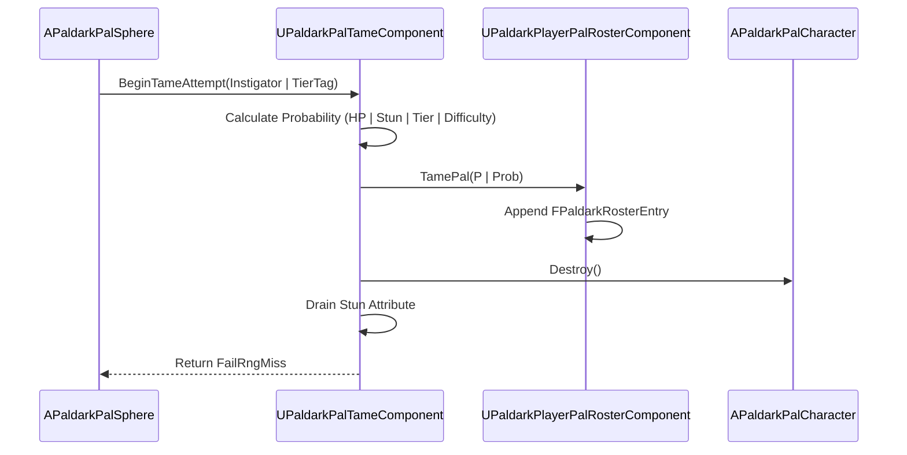
```mermaid
sequenceDiagram
    participant S as APaldarkPalSphere
    participant T as UPaldarkPalTameComponent
    participant R as UPaldarkPlayerPalRosterComponent
    participant P as APaldarkPalCharacter
    S->>T: BeginTameAttempt(Instigator | TierTag)
    T->>T: Calculate Probability (HP | Stun | Tier | Difficulty)
    T->>R: TamePal(P | Prob)
    R->>R: Append FPaldarkRosterEntry
    T->>P: Destroy()
    T->>T: Drain Stun Attribute
    T-->>S: Return FailRngMiss
```

Sources: [Source/PaldarkLab/Private/Pal/Components/PaldarkPalTameComponent.cpp#48-147](https://github.com/thanhtinpro/devin-paldarklab/blob/864c77b4/Source/PaldarkLab/Private/Pal/Components/PaldarkPalTameComponent.cpp#L48-L147)[Source/PaldarkLab/Public/Pal/PaldarkPlayerPalRosterComponent.h#84-88](https://github.com/thanhtinpro/devin-paldarklab/blob/864c77b4/Source/PaldarkLab/Public/Pal/PaldarkPlayerPalRosterComponent.h#L84-L88)

## Bond System: UPaldarkPalBondComponent

The `UPaldarkPalBondComponent` tracks progression for player-owned Pals.

- Bond Level: Range 0–20 [Source/PaldarkLab/Public/Pal/Components/PaldarkPalBondComponent.h#8-9](https://github.com/thanhtinpro/devin-paldarklab/blob/864c77b4/Source/PaldarkLab/Public/Pal/Components/PaldarkPalBondComponent.h#L8-L9)
- XP Events: XP is granted via `AddBondXP` with specific reason tags:

- `Paldark.Bond.Event.Damage`: Pal contributed to a kill.
- `Paldark.Bond.Event.Tame`: Granted upon initial capture (50 XP).
- `Paldark.Bond.Event.ShareFood`: Pal fed by player.
[Source/PaldarkLab/Public/Pal/Components/PaldarkPalBondComponent.h#13-16](https://github.com/thanhtinpro/devin-paldarklab/blob/864c77b4/Source/PaldarkLab/Public/Pal/Components/PaldarkPalBondComponent.h#L13-L16)
- Progression: Uses `BondXPCurve` (a `FRuntimeFloatCurve`) to determine the XP required for the next level [Source/PaldarkLab/Public/Pal/Components/PaldarkPalBondComponent.h#93-99](https://github.com/thanhtinpro/devin-paldarklab/blob/864c77b4/Source/PaldarkLab/Public/Pal/Components/PaldarkPalBondComponent.h#L93-L99)

Sources: [Source/PaldarkLab/Public/Pal/Components/PaldarkPalBondComponent.h#1-122](https://github.com/thanhtinpro/devin-paldarklab/blob/864c77b4/Source/PaldarkLab/Public/Pal/Components/PaldarkPalBondComponent.h#L1-L122)

---

# Pal-Spawning-and-Species-Definitions

# Pal Spawning and Species Definitions
Relevant source files

- [Documents/Devlog/W20-21-Build.md](https://github.com/thanhtinpro/devin-paldarklab/blob/864c77b4/Documents/Devlog/W20-21-Build.md?plain=1)
- [Source/PaldarkLab/Private/Framework/PaldarkGameModeBase.cpp](https://github.com/thanhtinpro/devin-paldarklab/blob/864c77b4/Source/PaldarkLab/Private/Framework/PaldarkGameModeBase.cpp)
- [Source/PaldarkLab/Private/Map/PaldarkPOISubsystem.cpp](https://github.com/thanhtinpro/devin-paldarklab/blob/864c77b4/Source/PaldarkLab/Private/Map/PaldarkPOISubsystem.cpp)
- [Source/PaldarkLab/Private/Map/PaldarkPalSpawnPoint.cpp](https://github.com/thanhtinpro/devin-paldarklab/blob/864c77b4/Source/PaldarkLab/Private/Map/PaldarkPalSpawnPoint.cpp)
- [Source/PaldarkLab/Private/Pal/Activities/PaldarkActivity_BossPhase.cpp](https://github.com/thanhtinpro/devin-paldarklab/blob/864c77b4/Source/PaldarkLab/Private/Pal/Activities/PaldarkActivity_BossPhase.cpp)
- [Source/PaldarkLab/Private/Pal/PaldarkHostilePackSubsystem.cpp](https://github.com/thanhtinpro/devin-paldarklab/blob/864c77b4/Source/PaldarkLab/Private/Pal/PaldarkHostilePackSubsystem.cpp)
- [Source/PaldarkLab/Private/Pal/PaldarkHostilePalSpawner.cpp](https://github.com/thanhtinpro/devin-paldarklab/blob/864c77b4/Source/PaldarkLab/Private/Pal/PaldarkHostilePalSpawner.cpp)
- [Source/PaldarkLab/Private/Pal/PaldarkPalCharacter_Boltmane.cpp](https://github.com/thanhtinpro/devin-paldarklab/blob/864c77b4/Source/PaldarkLab/Private/Pal/PaldarkPalCharacter_Boltmane.cpp)
- [Source/PaldarkLab/Private/Pal/PaldarkPalCharacter_Direhound.cpp](https://github.com/thanhtinpro/devin-paldarklab/blob/864c77b4/Source/PaldarkLab/Private/Pal/PaldarkPalCharacter_Direhound.cpp)
- [Source/PaldarkLab/Private/Pal/PaldarkPalCharacter_Razorbird.cpp](https://github.com/thanhtinpro/devin-paldarklab/blob/864c77b4/Source/PaldarkLab/Private/Pal/PaldarkPalCharacter_Razorbird.cpp)
- [Source/PaldarkLab/Private/Pal/PaldarkPalCharacter_Stoneclad.cpp](https://github.com/thanhtinpro/devin-paldarklab/blob/864c77b4/Source/PaldarkLab/Private/Pal/PaldarkPalCharacter_Stoneclad.cpp)
- [Source/PaldarkLab/Private/Pal/PaldarkPalCharacter_Vinewraith.cpp](https://github.com/thanhtinpro/devin-paldarklab/blob/864c77b4/Source/PaldarkLab/Private/Pal/PaldarkPalCharacter_Vinewraith.cpp)
- [Source/PaldarkLab/Private/Pal/PaldarkPalSpawnSubsystem.cpp](https://github.com/thanhtinpro/devin-paldarklab/blob/864c77b4/Source/PaldarkLab/Private/Pal/PaldarkPalSpawnSubsystem.cpp)
- [Source/PaldarkLab/Private/Subsystems/PaldarkLabWorldSubsystem.cpp](https://github.com/thanhtinpro/devin-paldarklab/blob/864c77b4/Source/PaldarkLab/Private/Subsystems/PaldarkLabWorldSubsystem.cpp)
- [Source/PaldarkLab/Public/Framework/PaldarkGameStateBase.h](https://github.com/thanhtinpro/devin-paldarklab/blob/864c77b4/Source/PaldarkLab/Public/Framework/PaldarkGameStateBase.h)
- [Source/PaldarkLab/Public/Map/PaldarkPOISubsystem.h](https://github.com/thanhtinpro/devin-paldarklab/blob/864c77b4/Source/PaldarkLab/Public/Map/PaldarkPOISubsystem.h)
- [Source/PaldarkLab/Public/Map/PaldarkPalSpawnPoint.h](https://github.com/thanhtinpro/devin-paldarklab/blob/864c77b4/Source/PaldarkLab/Public/Map/PaldarkPalSpawnPoint.h)
- [Source/PaldarkLab/Public/Pal/Activities/PaldarkActivity_BossPhase.h](https://github.com/thanhtinpro/devin-paldarklab/blob/864c77b4/Source/PaldarkLab/Public/Pal/Activities/PaldarkActivity_BossPhase.h)
- [Source/PaldarkLab/Public/Pal/PaldarkHostilePackSubsystem.h](https://github.com/thanhtinpro/devin-paldarklab/blob/864c77b4/Source/PaldarkLab/Public/Pal/PaldarkHostilePackSubsystem.h)
- [Source/PaldarkLab/Public/Pal/PaldarkHostilePalSpawner.h](https://github.com/thanhtinpro/devin-paldarklab/blob/864c77b4/Source/PaldarkLab/Public/Pal/PaldarkHostilePalSpawner.h)
- [Source/PaldarkLab/Public/Pal/PaldarkPalCharacter_Boltmane.h](https://github.com/thanhtinpro/devin-paldarklab/blob/864c77b4/Source/PaldarkLab/Public/Pal/PaldarkPalCharacter_Boltmane.h)
- [Source/PaldarkLab/Public/Pal/PaldarkPalCharacter_Direhound.h](https://github.com/thanhtinpro/devin-paldarklab/blob/864c77b4/Source/PaldarkLab/Public/Pal/PaldarkPalCharacter_Direhound.h)
- [Source/PaldarkLab/Public/Pal/PaldarkPalCharacter_Razorbird.h](https://github.com/thanhtinpro/devin-paldarklab/blob/864c77b4/Source/PaldarkLab/Public/Pal/PaldarkPalCharacter_Razorbird.h)
- [Source/PaldarkLab/Public/Pal/PaldarkPalCharacter_Stoneclad.h](https://github.com/thanhtinpro/devin-paldarklab/blob/864c77b4/Source/PaldarkLab/Public/Pal/PaldarkPalCharacter_Stoneclad.h)
- [Source/PaldarkLab/Public/Pal/PaldarkPalSpawnSubsystem.h](https://github.com/thanhtinpro/devin-paldarklab/blob/864c77b4/Source/PaldarkLab/Public/Pal/PaldarkPalSpawnSubsystem.h)

The Pal Spawning system provides a robust, server-authoritative pipeline for populating the game world with diverse AI entities. It bridges the gap between designer-authored data assets (`UPaldarkPalDefinition`) and runtime actor instantiation via an asynchronous loading pipeline in `UPaldarkPalSpawnSubsystem`. The system supports both single-point spawns (`APaldarkPalSpawnPoint`) and coordinated pack encounters (`APaldarkHostilePalSpawner`).

## Species Definitions: UPaldarkPalDefinition

The `UPaldarkPalDefinition` is a Primary Data Asset that serves as the blueprint for a specific Pal species. It centralizes visual, mechanical, and progression data, allowing designers to define species without modifying C++ code.

### Key Definition Fields

- PalClass: The `APaldarkPalCharacter` subclass to instantiate [Source/PaldarkLab/Public/Pal/PaldarkPalDefinition.h#45-46](https://github.com/thanhtinpro/devin-paldarklab/blob/864c77b4/Source/PaldarkLab/Public/Pal/PaldarkPalDefinition.h#L45-L46)
- SkeletalMesh: Soft reference to the mesh applied to the spawned character [Source/PaldarkLab/Public/Pal/PaldarkPalDefinition.h#48-49](https://github.com/thanhtinpro/devin-paldarklab/blob/864c77b4/Source/PaldarkLab/Public/Pal/PaldarkPalDefinition.h#L48-L49)
- AnimInstanceClass: The animation blueprint class to drive the skeletal mesh [Source/PaldarkLab/Public/Pal/PaldarkPalDefinition.h#51-52](https://github.com/thanhtinpro/devin-paldarklab/blob/864c77b4/Source/PaldarkLab/Public/Pal/PaldarkPalDefinition.h#L51-L52)
- GrantedAbilities: A list of `UPaldarkGameplayAbility` classes automatically granted to the Pal upon spawning [Source/PaldarkLab/Public/Pal/PaldarkPalDefinition.h#54-55](https://github.com/thanhtinpro/devin-paldarklab/blob/864c77b4/Source/PaldarkLab/Public/Pal/PaldarkPalDefinition.h#L54-L55)
- PhaseHealthThresholds: Used for boss-type Pals to trigger phase transitions in `UPaldarkActivity_BossPhase`[Source/PaldarkLab/Public/Pal/PaldarkPalDefinition.h#57-58](https://github.com/thanhtinpro/devin-paldarklab/blob/864c77b4/Source/PaldarkLab/Public/Pal/PaldarkPalDefinition.h#L57-L58)
- TameDifficulty: A multiplier used by `UPaldarkPalTameComponent` to calculate capture probability [Source/PaldarkLab/Public/Pal/PaldarkPalDefinition.h#60-61](https://github.com/thanhtinpro/devin-paldarklab/blob/864c77b4/Source/PaldarkLab/Public/Pal/PaldarkPalDefinition.h#L60-L61)
- LootTableId: Reference to the `UPaldarkLootTable` used when the Pal is defeated [Source/PaldarkLab/Public/Pal/PaldarkPalDefinition.h#63-64](https://github.com/thanhtinpro/devin-paldarklab/blob/864c77b4/Source/PaldarkLab/Public/Pal/PaldarkPalDefinition.h#L63-L64)

Sources:[Source/PaldarkLab/Public/Pal/PaldarkPalDefinition.h#1-70](https://github.com/thanhtinpro/devin-paldarklab/blob/864c77b4/Source/PaldarkLab/Public/Pal/PaldarkPalDefinition.h#L1-L70)

---

## Async Spawn Pipeline: UPaldarkPalSpawnSubsystem

`UPaldarkPalSpawnSubsystem` is a `UWorldSubsystem` that manages the asynchronous loading of Pal assets to prevent hitching during gameplay. It utilizes the Lyra-style "Pre-Warm" pattern.

### The Pre-Warm Flow

The subsystem maintains a `WarmStates` map of `FPaldarkPalPreWarmState` structures [Source/PaldarkLab/Public/Pal/PaldarkPalSpawnSubsystem.h#138](https://github.com/thanhtinpro/devin-paldarklab/blob/864c77b4/Source/PaldarkLab/Public/Pal/PaldarkPalSpawnSubsystem.h#L138-L138)

1. RequestPreWarmAsync: Initiates an async load of the "Spawn" asset bundle (mesh, anims, abilities) for a given `FPrimaryAssetId`[Source/PaldarkLab/Private/Pal/PaldarkPalSpawnSubsystem.cpp#71-74](https://github.com/thanhtinpro/devin-paldarklab/blob/864c77b4/Source/PaldarkLab/Private/Pal/PaldarkPalSpawnSubsystem.cpp#L71-L74)
2. Coalescing: If a request for the same ID is already in flight, the subsystem appends the new callback to `PendingCallbacks` instead of starting a new load [Source/PaldarkLab/Private/Pal/PaldarkPalSpawnSubsystem.cpp#103-127](https://github.com/thanhtinpro/devin-paldarklab/blob/864c77b4/Source/PaldarkLab/Private/Pal/PaldarkPalSpawnSubsystem.cpp#L103-L127)
3. HandleLoadComplete: Once `FStreamableManager` finishes, the subsystem resolves the definition and executes all queued callbacks [Source/PaldarkLab/Private/Pal/PaldarkPalSpawnSubsystem.cpp#167-201](https://github.com/thanhtinpro/devin-paldarklab/blob/864c77b4/Source/PaldarkLab/Private/Pal/PaldarkPalSpawnSubsystem.cpp#L167-L201)
4. SpawnFromWarmedDefinition: A private helper that instantiates the actor, applies the mesh/anim classes, and grants abilities using the now-resident assets [Source/PaldarkLab/Private/Pal/PaldarkPalSpawnSubsystem.cpp#265-315](https://github.com/thanhtinpro/devin-paldarklab/blob/864c77b4/Source/PaldarkLab/Private/Pal/PaldarkPalSpawnSubsystem.cpp#L265-L315)

### Pal Spawn State Machine

The following diagram illustrates the transition from a request to a fully initialized Pal actor.

Title: Pal Async Initialization Pipeline

[Flowchart Diagram]

Sources:[Source/PaldarkLab/Private/Pal/PaldarkPalSpawnSubsystem.cpp#17-315](https://github.com/thanhtinpro/devin-paldarklab/blob/864c77b4/Source/PaldarkLab/Private/Pal/PaldarkPalSpawnSubsystem.cpp#L17-L315)[Source/PaldarkLab/Public/Pal/PaldarkPalSpawnSubsystem.h#1-156](https://github.com/thanhtinpro/devin-paldarklab/blob/864c77b4/Source/PaldarkLab/Public/Pal/PaldarkPalSpawnSubsystem.h#L1-L156)

---

## Spawner Actors

### APaldarkPalSpawnPoint

A designer-placeable actor for single-Pal spawns. It is the primary tool for populating specific locations in a map [Source/PaldarkLab/Public/Map/PaldarkPalSpawnPoint.h#1-31](https://github.com/thanhtinpro/devin-paldarklab/blob/864c77b4/Source/PaldarkLab/Public/Map/PaldarkPalSpawnPoint.h#L1-L31)

- SpeciesTag: The tag (e.g., `Paldark.Pal.Species.Direhound`) used to resolve the definition [Source/PaldarkLab/Public/Map/PaldarkPalSpawnPoint.h#81](https://github.com/thanhtinpro/devin-paldarklab/blob/864c77b4/Source/PaldarkLab/Public/Map/PaldarkPalSpawnPoint.h#L81-L81)
- MaxConcurrentInstances: Limits how many Pals can be active from this point (default 1) [Source/PaldarkLab/Public/Map/PaldarkPalSpawnPoint.h#109](https://github.com/thanhtinpro/devin-paldarklab/blob/864c77b4/Source/PaldarkLab/Public/Map/PaldarkPalSpawnPoint.h#L109-L109)
- FallbackPalClass: Used if no data-asset definition is found, allowing the system to spawn hard-coded C++ subclasses [Source/PaldarkLab/Public/Map/PaldarkPalSpawnPoint.h#95](https://github.com/thanhtinpro/devin-paldarklab/blob/864c77b4/Source/PaldarkLab/Public/Map/PaldarkPalSpawnPoint.h#L95-L95)

### APaldarkHostilePalSpawner

Designed for "Pack" encounters. It spawns a group of Pals and distributes patrol waypoints among them [Source/PaldarkLab/Public/Pal/PaldarkHostilePalSpawner.h#1-6](https://github.com/thanhtinpro/devin-paldarklab/blob/864c77b4/Source/PaldarkLab/Public/Pal/PaldarkHostilePalSpawner.h#L1-L6)

- SpawnCount: Number of Pals to spawn (default 4) [Source/PaldarkLab/Public/Pal/PaldarkHostilePalSpawner.h#60](https://github.com/thanhtinpro/devin-paldarklab/blob/864c77b4/Source/PaldarkLab/Public/Pal/PaldarkHostilePalSpawner.h#L60-L60)
- SpawnSpreadRadius: Randomizes spawn locations in a circle around the spawner to prevent overlap [Source/PaldarkLab/Public/Pal/PaldarkHostilePalSpawner.h#78](https://github.com/thanhtinpro/devin-paldarklab/blob/864c77b4/Source/PaldarkLab/Public/Pal/PaldarkHostilePalSpawner.h#L78-L78)
- WaypointActors: A list of actors whose locations are converted into patrol points for the spawned pack [Source/PaldarkLab/Public/Pal/PaldarkHostilePalSpawner.h#72](https://github.com/thanhtinpro/devin-paldarklab/blob/864c77b4/Source/PaldarkLab/Public/Pal/PaldarkHostilePalSpawner.h#L72-L72)

Sources:[Source/PaldarkLab/Public/Map/PaldarkPalSpawnPoint.h#1-154](https://github.com/thanhtinpro/devin-paldarklab/blob/864c77b4/Source/PaldarkLab/Public/Map/PaldarkPalSpawnPoint.h#L1-L154)[Source/PaldarkLab/Public/Pal/PaldarkHostilePalSpawner.h#1-112](https://github.com/thanhtinpro/devin-paldarklab/blob/864c77b4/Source/PaldarkLab/Public/Pal/PaldarkHostilePalSpawner.h#L1-L112)

---

## Concrete Species Implementations

PaldarkLab ships with four standard hostile species and one boss species, each implemented as a C++ subclass of `APaldarkPalCharacter` with unique tuning and activity ladders.

### Species Comparison Table

| Species | Identity Tag | Primary Activity | Combat Style | Movement |
| --- | --- | --- | --- | --- |
| Direhound | `Paldark.Pal.Species.Direhound` | Stalk (P25) | Melee (Bite) | Ground (Fast) |
| Razorbird | `Paldark.Pal.Species.Razorbird` | Patrol (P15) | Aerial Dive | Flying |
| Stoneclad | `Paldark.Pal.Species.Stoneclad` | Combat (P40) | Tank (Heavy Melee) | Ground (Slow) |
| Vinewraith | `Paldark.Pal.Species.Vinewraith` | Combat (P40) | Ranged (Vine Whip) | Ground (Average) |
| Boltmane | `Paldark.Pal.Species.Boltmane` | BossPhase (P50) | Mixed (Lightning) | Ground (Aggressive) |

### Implementation Details

- Direhound: Features a "creep up + lunge" behavior by splitting logic between `PaldarkActivity_Stalk` and `PaldarkActivity_Combat`[Source/PaldarkLab/Private/Pal/PaldarkPalCharacter_Direhound.cpp#59-109](https://github.com/thanhtinpro/devin-paldarklab/blob/864c77b4/Source/PaldarkLab/Private/Pal/PaldarkPalCharacter_Direhound.cpp#L59-L109)
- Razorbird: Uses `MOVE_Flying` and zero gravity to hover. Designers place waypoints in the air to define its flight path [Source/PaldarkLab/Private/Pal/PaldarkPalCharacter_Razorbird.cpp#28-36](https://github.com/thanhtinpro/devin-paldarklab/blob/864c77b4/Source/PaldarkLab/Private/Pal/PaldarkPalCharacter_Razorbird.cpp#L28-L36)
- Stoneclad: Tuned as a "ground tank" with high `BasePalDamage` (28.f) and slow `AttackInterval` (2.0s) [Source/PaldarkLab/Private/Pal/PaldarkPalCharacter_Stoneclad.cpp#37-43](https://github.com/thanhtinpro/devin-paldarklab/blob/864c77b4/Source/PaldarkLab/Private/Pal/PaldarkPalCharacter_Stoneclad.cpp#L37-L43)
- Boltmane: The first boss implementation, utilizing health thresholds to trigger phase changes and unique lightning abilities [Source/PaldarkLab/Private/Pal/PaldarkPalCharacter_Boltmane.cpp#1-60](https://github.com/thanhtinpro/devin-paldarklab/blob/864c77b4/Source/PaldarkLab/Private/Pal/PaldarkPalCharacter_Boltmane.cpp#L1-L60)

### Code Entity Association

The following diagram maps the species classes to their runtime behavior components and tags.

Title: Species Class and Component Association

[Class Diagram]

Sources:[Source/PaldarkLab/Private/Pal/PaldarkPalCharacter_Direhound.cpp#1-125](https://github.com/thanhtinpro/devin-paldarklab/blob/864c77b4/Source/PaldarkLab/Private/Pal/PaldarkPalCharacter_Direhound.cpp#L1-L125)[Source/PaldarkLab/Private/Pal/PaldarkPalCharacter_Razorbird.cpp#1-117](https://github.com/thanhtinpro/devin-paldarklab/blob/864c77b4/Source/PaldarkLab/Private/Pal/PaldarkPalCharacter_Razorbird.cpp#L1-L117)[Source/PaldarkLab/Private/Pal/PaldarkPalCharacter_Stoneclad.cpp#1-111](https://github.com/thanhtinpro/devin-paldarklab/blob/864c77b4/Source/PaldarkLab/Private/Pal/PaldarkPalCharacter_Stoneclad.cpp#L1-L111)[Source/PaldarkLab/Private/Pal/PaldarkPalCharacter_Vinewraith.cpp#1-105](https://github.com/thanhtinpro/devin-paldarklab/blob/864c77b4/Source/PaldarkLab/Private/Pal/PaldarkPalCharacter_Vinewraith.cpp#L1-L105)[Source/PaldarkLab/Private/Pal/PaldarkPalCharacter_Boltmane.cpp#1-100](https://github.com/thanhtinpro/devin-paldarklab/blob/864c77b4/Source/PaldarkLab/Private/Pal/PaldarkPalCharacter_Boltmane.cpp#L1-L100)

---

# Hostile-Pack-Subsystem

# Hostile Pack Subsystem
Relevant source files

- [Source/PaldarkLab/Private/Framework/PaldarkGameModeBase.cpp](https://github.com/thanhtinpro/devin-paldarklab/blob/864c77b4/Source/PaldarkLab/Private/Framework/PaldarkGameModeBase.cpp)
- [Source/PaldarkLab/Private/Pal/PaldarkHostilePackSubsystem.cpp](https://github.com/thanhtinpro/devin-paldarklab/blob/864c77b4/Source/PaldarkLab/Private/Pal/PaldarkHostilePackSubsystem.cpp)
- [Source/PaldarkLab/Private/Pal/PaldarkPalSpawnSubsystem.cpp](https://github.com/thanhtinpro/devin-paldarklab/blob/864c77b4/Source/PaldarkLab/Private/Pal/PaldarkPalSpawnSubsystem.cpp)
- [Source/PaldarkLab/Private/Subsystems/PaldarkLabWorldSubsystem.cpp](https://github.com/thanhtinpro/devin-paldarklab/blob/864c77b4/Source/PaldarkLab/Private/Subsystems/PaldarkLabWorldSubsystem.cpp)
- [Source/PaldarkLab/Public/Pal/PaldarkHostilePackSubsystem.h](https://github.com/thanhtinpro/devin-paldarklab/blob/864c77b4/Source/PaldarkLab/Public/Pal/PaldarkHostilePackSubsystem.h)
- [Source/PaldarkLabCore/Private/PaldarkGameplayTags.cpp](https://github.com/thanhtinpro/devin-paldarklab/blob/864c77b4/Source/PaldarkLabCore/Private/PaldarkGameplayTags.cpp)
- [Source/PaldarkLabCore/Public/PaldarkGameplayTags.h](https://github.com/thanhtinpro/devin-paldarklab/blob/864c77b4/Source/PaldarkLabCore/Public/PaldarkGameplayTags.h)
- [scripts/ci/validate_paldarklab.py](https://github.com/thanhtinpro/devin-paldarklab/blob/864c77b4/scripts/ci/validate_paldarklab.py)

The Hostile Pack Subsystem is a server-authoritative world subsystem responsible for coordinating the behavior of groups of hostile Pals. It facilitates "threat fan-out," where a single Pal spotting a player can alert nearby packmates, enabling coordinated stalking and combat behaviors without requiring expensive per-tick global searches [Source/PaldarkLab/Public/Pal/PaldarkHostilePackSubsystem.h#3-17](https://github.com/thanhtinpro/devin-paldarklab/blob/864c77b4/Source/PaldarkLab/Public/Pal/PaldarkHostilePackSubsystem.h#L3-L17)

## Architecture Overview

The system uses `UPaldarkHostilePackSubsystem` to maintain a registry of Pals grouped by `FGameplayTag`. This design avoids the performance cost of `TActorIterator` during combat by providing a direct lookup table for pack members [Source/PaldarkLab/Public/Pal/PaldarkHostilePackSubsystem.h#14-17](https://github.com/thanhtinpro/devin-paldarklab/blob/864c77b4/Source/PaldarkLab/Public/Pal/PaldarkHostilePackSubsystem.h#L14-L17)

### Core Components and Data Flow

The following diagram illustrates how the subsystem bridges the high-level "Pack" concept with low-level C++ components:

Pack Coordination Data Flow

[Flowchart Diagram]

Sources: [Source/PaldarkLab/Public/Pal/PaldarkHostilePackSubsystem.h#49-110](https://github.com/thanhtinpro/devin-paldarklab/blob/864c77b4/Source/PaldarkLab/Public/Pal/PaldarkHostilePackSubsystem.h#L49-L110)[Source/PaldarkLab/Private/Pal/PaldarkHostilePackSubsystem.cpp#101-119](https://github.com/thanhtinpro/devin-paldarklab/blob/864c77b4/Source/PaldarkLab/Private/Pal/PaldarkHostilePackSubsystem.cpp#L101-L119)

## Registration Lifecycle

Pals are registered and unregistered based on their actor lifecycle. This ensures the subsystem only tracks active, valid actors in the current world [Source/PaldarkLab/Public/Pal/PaldarkHostilePackSubsystem.h#18-22](https://github.com/thanhtinpro/devin-paldarklab/blob/864c77b4/Source/PaldarkLab/Public/Pal/PaldarkHostilePackSubsystem.h#L18-L22)

| Function | Lifecycle Hook | Description |
| --- | --- | --- |
| `RegisterPalToPack` | `BeginPlay` | Adds an `APaldarkPalCharacter` to the `PackRegistry` under a specific pack tag. |
| `UnregisterPalFromPack` | `EndPlay` | Removes the Pal to prevent "ghost entries" and stale pointers. |
| `ShouldCreateSubsystem` | Engine Init | Restricts subsystem creation to `Game` and `PIE` worlds to prevent leaks in the editor. |

Sources: [Source/PaldarkLab/Public/Pal/PaldarkHostilePackSubsystem.h#62-70](https://github.com/thanhtinpro/devin-paldarklab/blob/864c77b4/Source/PaldarkLab/Public/Pal/PaldarkHostilePackSubsystem.h#L62-L70)[Source/PaldarkLab/Private/Pal/PaldarkHostilePackSubsystem.cpp#33-36](https://github.com/thanhtinpro/devin-paldarklab/blob/864c77b4/Source/PaldarkLab/Private/Pal/PaldarkHostilePackSubsystem.cpp#L33-L36)[Source/PaldarkLab/Private/Pal/PaldarkHostilePackSubsystem.cpp#52-99](https://github.com/thanhtinpro/devin-paldarklab/blob/864c77b4/Source/PaldarkLab/Private/Pal/PaldarkHostilePackSubsystem.cpp#L52-L99)

## Threat Broadcasting Mechanism

The primary logic resides in `BroadcastPackThreat`. When a Pal's perception locks onto a hostile target, it notifies the subsystem to alert its packmates [Source/PaldarkLab/Public/Pal/PaldarkHostilePackSubsystem.h#71-76](https://github.com/thanhtinpro/devin-paldarklab/blob/864c77b4/Source/PaldarkLab/Public/Pal/PaldarkHostilePackSubsystem.h#L71-L76)

### Implementation Logic

1. Initiator Validation: Checks if the initiator has a valid `PackTag`[Source/PaldarkLab/Private/Pal/PaldarkHostilePackSubsystem.cpp#112-119](https://github.com/thanhtinpro/devin-paldarklab/blob/864c77b4/Source/PaldarkLab/Private/Pal/PaldarkHostilePackSubsystem.cpp#L112-L119)
2. Radius Filtering: Iterates through `FPaldarkHostilePack::Members`. Only packmates within `PackBroadcastRadius` (default 2000 cm) are considered [Source/PaldarkLab/Private/Pal/PaldarkHostilePackSubsystem.cpp#127-144](https://github.com/thanhtinpro/devin-paldarklab/blob/864c77b4/Source/PaldarkLab/Private/Pal/PaldarkHostilePackSubsystem.cpp#L127-L144)
3. Feedback-Loop Guard: Before alerting a packmate, the system checks `Perception->GetCurrentThreat()`. If the packmate is already targeting the same actor, the call is skipped to prevent infinite recursion [Source/PaldarkLab/Public/Pal/PaldarkHostilePackSubsystem.h#23-27](https://github.com/thanhtinpro/devin-paldarklab/blob/864c77b4/Source/PaldarkLab/Public/Pal/PaldarkHostilePackSubsystem.h#L23-L27)[Source/PaldarkLab/Private/Pal/PaldarkHostilePackSubsystem.cpp#152-158](https://github.com/thanhtinpro/devin-paldarklab/blob/864c77b4/Source/PaldarkLab/Private/Pal/PaldarkHostilePackSubsystem.cpp#L152-L158)
4. Forced Perception: Calls `ForceThreat(NewThreat)` on the packmate's perception component, effectively "pointing out" the enemy [Source/PaldarkLab/Private/Pal/PaldarkHostilePackSubsystem.cpp#160](https://github.com/thanhtinpro/devin-paldarklab/blob/864c77b4/Source/PaldarkLab/Private/Pal/PaldarkHostilePackSubsystem.cpp#L160-L160)

Threat Broadcast Logic

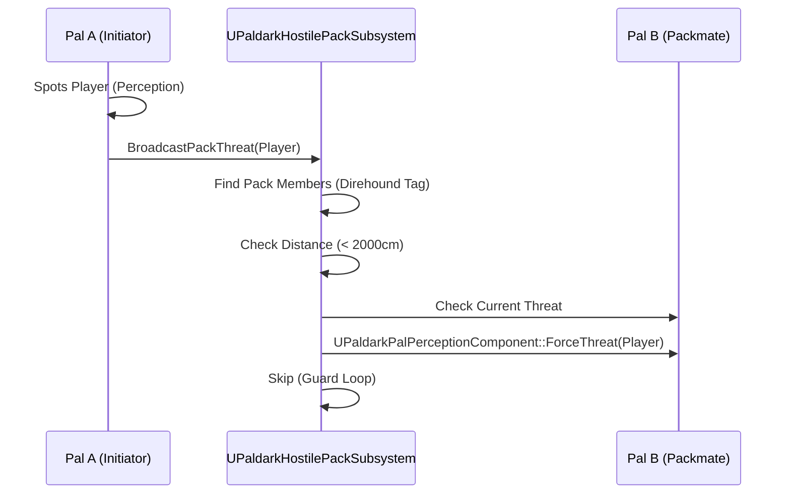
```mermaid
sequenceDiagram
    participant P1 as Pal A (Initiator)
    participant SUB as UPaldarkHostilePackSubsystem
    participant P2 as Pal B (Packmate)
    P1->>P1: Spots Player (Perception)
    P1->>SUB: BroadcastPackThreat(Player)
    SUB->>SUB: Find Pack Members (Direhound Tag)
    SUB->>SUB: Check Distance (< 2000cm)
    SUB->>P2: Check Current Threat
    SUB->>P2: UPaldarkPalPerceptionComponent::ForceThreat(Player)
    SUB->>SUB: Skip (Guard Loop)
```

Sources: [Source/PaldarkLab/Private/Pal/PaldarkHostilePackSubsystem.cpp#101-171](https://github.com/thanhtinpro/devin-paldarklab/blob/864c77b4/Source/PaldarkLab/Private/Pal/PaldarkHostilePackSubsystem.cpp#L101-L171)[Source/PaldarkLab/Public/Pal/PaldarkHostilePackSubsystem.h#86-91](https://github.com/thanhtinpro/devin-paldarklab/blob/864c77b4/Source/PaldarkLab/Public/Pal/PaldarkHostilePackSubsystem.h#L86-L91)

## Gameplay Tags and Grouping

The subsystem relies on the `Paldark.Pal.Pack.*` namespace defined in `PaldarkLabCore`. These tags allow designers to group different species or specific squads into a single tactical unit [Source/PaldarkLabCore/Public/PaldarkGameplayTags.h#128-132](https://github.com/thanhtinpro/devin-paldarklab/blob/864c77b4/Source/PaldarkLabCore/Public/PaldarkGameplayTags.h#L128-L132)

- `TAG_Paldark_Pal_Pack_Direhound`: Used for standard Direhound wolf-pack behavior [Source/PaldarkLabCore/Private/PaldarkGameplayTags.cpp#101](https://github.com/thanhtinpro/devin-paldarklab/blob/864c77b4/Source/PaldarkLabCore/Private/PaldarkGameplayTags.cpp#L101-L101)
- Stalk/Combat Synergy: Once a pack is alerted, the `UPaldarkPalActivityComponent` can transition all members from `Patrol` to `Stalk` or `Combat` simultaneously based on the shared threat [Source/PaldarkLabCore/Private/PaldarkGameplayTags.cpp#94-101](https://github.com/thanhtinpro/devin-paldarklab/blob/864c77b4/Source/PaldarkLabCore/Private/PaldarkGameplayTags.cpp#L94-L101)

Sources: [Source/PaldarkLabCore/Public/PaldarkGameplayTags.h#128-132](https://github.com/thanhtinpro/devin-paldarklab/blob/864c77b4/Source/PaldarkLabCore/Public/PaldarkGameplayTags.h#L128-L132)[Source/PaldarkLabCore/Private/PaldarkGameplayTags.cpp#94-101](https://github.com/thanhtinpro/devin-paldarklab/blob/864c77b4/Source/PaldarkLabCore/Private/PaldarkGameplayTags.cpp#L94-L101)

## Debugging and Utilities

The subsystem provides console commands and logging to inspect pack state at runtime:

- Dump State: `DumpToLog()` outputs all registered pack tags, their member counts, and the physical location of each member to `LogPaldarkPal`[Source/PaldarkLab/Public/Pal/PaldarkHostilePackSubsystem.h#83-84](https://github.com/thanhtinpro/devin-paldarklab/blob/864c77b4/Source/PaldarkLab/Public/Pal/PaldarkHostilePackSubsystem.h#L83-L84)[Source/PaldarkLab/Private/Pal/PaldarkHostilePackSubsystem.cpp#179-201](https://github.com/thanhtinpro/devin-paldarklab/blob/864c77b4/Source/PaldarkLab/Private/Pal/PaldarkHostilePackSubsystem.cpp#L179-L201)
- Pack Size: `GetPackSize(FGameplayTag)` is used for unit testing and AI density heuristics [Source/PaldarkLab/Public/Pal/PaldarkHostilePackSubsystem.h#78-81](https://github.com/thanhtinpro/devin-paldarklab/blob/864c77b4/Source/PaldarkLab/Public/Pal/PaldarkHostilePackSubsystem.h#L78-L81)

Sources: [Source/PaldarkLab/Public/Pal/PaldarkHostilePackSubsystem.h#78-84](https://github.com/thanhtinpro/devin-paldarklab/blob/864c77b4/Source/PaldarkLab/Public/Pal/PaldarkHostilePackSubsystem.h#L78-L84)[Source/PaldarkLab/Private/Pal/PaldarkHostilePackSubsystem.cpp#173-201](https://github.com/thanhtinpro/devin-paldarklab/blob/864c77b4/Source/PaldarkLab/Private/Pal/PaldarkHostilePackSubsystem.cpp#L173-L201)

---

# Combat-and-Lag-Compensation

# Combat and Lag Compensation
Relevant source files

- [Documents/Devlog/W16-17-Build.md](https://github.com/thanhtinpro/devin-paldarklab/blob/864c77b4/Documents/Devlog/W16-17-Build.md?plain=1)
- [README.md](https://github.com/thanhtinpro/devin-paldarklab/blob/864c77b4/README.md?plain=1)
- [Source/PaldarkLab/Public/Combat/PaldarkLagCompensationComponent.h](https://github.com/thanhtinpro/devin-paldarklab/blob/864c77b4/Source/PaldarkLab/Public/Combat/PaldarkLagCompensationComponent.h)
- [Source/PaldarkLab/Public/Combat/PaldarkLagCompensationTypes.h](https://github.com/thanhtinpro/devin-paldarklab/blob/864c77b4/Source/PaldarkLab/Public/Combat/PaldarkLagCompensationTypes.h)

PaldarkLab implements a server-authoritative combat pipeline designed to provide responsive, high-fidelity hit registration in high-latency environments (up to 100ms artificial ping). This system bridges the gap between client-side prediction and server-side validation using a combination of per-bone hitbox snapshotting, clock synchronization, and a robust loot drop mechanism.

## Combat Pipeline Overview

The combat flow is centered around the Server-Side Rewind pattern. When a player fires a weapon, the client performs local prediction and sends a hit request to the server including the exact server-timestamp of the impact. The server then "rewinds" the target's hitboxes to that specific moment in time to validate the shot.

### System Architecture

The following diagram illustrates how the combat entities and components interact during a hitscan fire event:

Hitscan Validation and Rewind Flow

[Flowchart Diagram]

Sources: [Source/PaldarkLab/Public/Combat/PaldarkLagCompensationComponent.h#6-17](https://github.com/thanhtinpro/devin-paldarklab/blob/864c77b4/Source/PaldarkLab/Public/Combat/PaldarkLagCompensationComponent.h#L6-L17)[Source/PaldarkLab/Public/Combat/PaldarkLagCompensationComponent.h#98-103](https://github.com/thanhtinpro/devin-paldarklab/blob/864c77b4/Source/PaldarkLab/Public/Combat/PaldarkLagCompensationComponent.h#L98-L103)[Documents/Devlog/W16-17-Build.md#31-44](https://github.com/thanhtinpro/devin-paldarklab/blob/864c77b4/Documents/Devlog/W16-17-Build.md?plain=1#L31-L44)

## Core Systems

### Lag Compensation (Server-Side Rewind)

The `UPaldarkLagCompensationComponent` is the heart of the networked combat system. It maintains a `FrameHistory` of every character's per-bone hitboxes (head, pelvis, limbs, etc.) for up to 4 seconds of game time.

- Snapshotting: Every server tick, `SaveFramePackage()` captures the `FVector` location and `FRotator` rotation of 16 `UBoxComponent` hitboxes attached to the character's skeletal sockets.
- Rewind Logic: Upon receiving a `ServerScoreRequest_Hitscan`, the server interpolates between the two closest frames in history to create a synthetic frame at the exact `HitTime` reported by the client.
- Validation: The server performs a trace against these rewound boxes. If the trace hits, it returns an `FPaldarkServerSideRewindResult` with `bHitConfirmed` set to true.

For details, see [Server-Side Rewind (Lag Compensation)](#6.1).

### Loot System

The loot system handles the generation and persistence of items when a combatant (Player or Pal) is defeated. It uses a data-driven approach via `UPaldarkLootTable` to roll for items based on weighted probabilities and gameplay tags.

- Trigger: The `UPaldarkLootDropComponent` listens for the `OnHealthZeroed` delegate from the `UPaldarkAttributeSet`.
- Generation: It performs an asynchronous load of the assigned loot table and rolls for entries, considering `GuaranteedWhenTag` conditions.
- Persistence: Results are spawned into the world as an `APaldarkLootBag`, which replicates its contents to nearby players and handles its own cleanup via `AutoCleanupSeconds`.

For details, see [Loot System](#6.2).

## Testing and Debugging

The codebase provides several utilities to verify the accuracy of the lag compensation and combat systems under network stress.

| Command | File | Purpose |
| --- | --- | --- |
| `Paldark.Combat.SpawnDummy` | [README.md#35](https://github.com/thanhtinpro/devin-paldarklab/blob/864c77b4/README.md?plain=1#L35-L35) | Spawns an `APaldarkDummyTarget` with head-bone hitboxes for testing. |
| `Paldark.LagComp.ArtificialPing [Ms]` | [Documents/Devlog/W16-17-Build.md#88](https://github.com/thanhtinpro/devin-paldarklab/blob/864c77b4/Documents/Devlog/W16-17-Build.md?plain=1#L88-L88) | Simulates network latency (wraps `Net PktLag`). |
| `Paldark.LagComp.DumpHistory` | [Source/PaldarkLab/Public/Combat/PaldarkLagCompensationComponent.h#115-119](https://github.com/thanhtinpro/devin-paldarklab/blob/864c77b4/Source/PaldarkLab/Public/Combat/PaldarkLagCompensationComponent.h#L115-L119) | Logs the current state of the frame history buffer to verify snapshotting. |
| `Paldark.Gas.DumpAttributes` | [README.md#33](https://github.com/thanhtinpro/devin-paldarklab/blob/864c77b4/README.md?plain=1#L33-L33) | Displays live Health and Armor values to verify damage application. |

### Combat Entity Mapping

This diagram maps the conceptual combat roles to their specific C++ class implementations.

Combat System Class Mapping

[Flowchart Diagram]

Sources: [Source/PaldarkLab/Public/Combat/PaldarkLagCompensationTypes.h#52](https://github.com/thanhtinpro/devin-paldarklab/blob/864c77b4/Source/PaldarkLab/Public/Combat/PaldarkLagCompensationTypes.h#L52-L52)[Source/PaldarkLab/Public/Combat/PaldarkLagCompensationTypes.h#85](https://github.com/thanhtinpro/devin-paldarklab/blob/864c77b4/Source/PaldarkLab/Public/Combat/PaldarkLagCompensationTypes.h#L85-L85)[README.md#35](https://github.com/thanhtinpro/devin-paldarklab/blob/864c77b4/README.md?plain=1#L35-L35)[Documents/Devlog/W16-17-Build.md#21-27](https://github.com/thanhtinpro/devin-paldarklab/blob/864c77b4/Documents/Devlog/W16-17-Build.md?plain=1#L21-L27)

---

Child Pages:

- [Server-Side Rewind (Lag Compensation)](#6.1)
- [Loot System](#6.2)

---

# Server-Side-Rewind-(Lag-Compensation)

# Server-Side Rewind (Lag Compensation)
Relevant source files

- [Documents/Devlog/W16-17-Build.md](https://github.com/thanhtinpro/devin-paldarklab/blob/864c77b4/Documents/Devlog/W16-17-Build.md?plain=1)
- [README.md](https://github.com/thanhtinpro/devin-paldarklab/blob/864c77b4/README.md?plain=1)
- [Source/PaldarkLab/Private/Combat/PaldarkDummyTarget.cpp](https://github.com/thanhtinpro/devin-paldarklab/blob/864c77b4/Source/PaldarkLab/Private/Combat/PaldarkDummyTarget.cpp)
- [Source/PaldarkLab/Private/Gas/Abilities/PaldarkGameplayAbility_HitscanFire.cpp](https://github.com/thanhtinpro/devin-paldarklab/blob/864c77b4/Source/PaldarkLab/Private/Gas/Abilities/PaldarkGameplayAbility_HitscanFire.cpp)
- [Source/PaldarkLab/Public/Combat/PaldarkDummyTarget.h](https://github.com/thanhtinpro/devin-paldarklab/blob/864c77b4/Source/PaldarkLab/Public/Combat/PaldarkDummyTarget.h)
- [Source/PaldarkLab/Public/Combat/PaldarkLagCompensationComponent.h](https://github.com/thanhtinpro/devin-paldarklab/blob/864c77b4/Source/PaldarkLab/Public/Combat/PaldarkLagCompensationComponent.h)
- [Source/PaldarkLab/Public/Combat/PaldarkLagCompensationTypes.h](https://github.com/thanhtinpro/devin-paldarklab/blob/864c77b4/Source/PaldarkLab/Public/Combat/PaldarkLagCompensationTypes.h)
- [Source/PaldarkLab/Public/Gas/Abilities/PaldarkGameplayAbility_HitscanFire.h](https://github.com/thanhtinpro/devin-paldarklab/blob/864c77b4/Source/PaldarkLab/Public/Gas/Abilities/PaldarkGameplayAbility_HitscanFire.h)

The Server-Side Rewind system provides high-fidelity hitscan validation for the PaldarkLab extraction shooter. It is designed to ensure that players with up to 250ms of latency (plus artificial lag) can land accurate shots against moving targets. The system works by maintaining a historical buffer of character bone transforms on the server and "rewinding" the world state to the exact moment a client claims a hit occurred.

## System Overview

The lag compensation architecture is server-authoritative. While the client predicts the hit locally for immediate feedback, the server performs the final verdict by tracing against historical collision geometry.

### Core Data Structures

The system uses three primary structures to manage historical data and results:

| Structure | Purpose |
| --- | --- |
| `FPaldarkBoxInformation` | Stores a single bone's world-space `Location`, `Rotation`, and `BoxExtent`. |
| `FPaldarkFramePackage` | A collection of `FPaldarkBoxInformation` for all hitboxes on a character at a specific server timestamp. |
| `FPaldarkServerSideRewindResult` | The final verdict containing `bHitConfirmed`, `bHeadShot`, and the authoritative `ImpactPoint`. |

Sources: [Source/PaldarkLab/Public/Combat/PaldarkLagCompensationTypes.h#23-123](https://github.com/thanhtinpro/devin-paldarklab/blob/864c77b4/Source/PaldarkLab/Public/Combat/PaldarkLagCompensationTypes.h#L23-L123)[Documents/Devlog/W16-17-Build.md#21-28](https://github.com/thanhtinpro/devin-paldarklab/blob/864c77b4/Documents/Devlog/W16-17-Build.md?plain=1#L21-L28)

### UPaldarkLagCompensationComponent

This component is the heart of the rewind logic, residing on `APaldarkCharacter` via the `LagCompSlot`.

- Snapshotting: Every server tick, the component calls `SaveFramePackage()` to snapshot the current transforms of all components in the character's `HitCollisionBoxes` map.
- History Management: Snapshots are stored in a `TDoubleLinkedList<FPaldarkFramePackage>`. This allows $O(1)$ insertion at the head and $O(1)$ pruning from the tail.
- Pruning: The `MaxRecordTime` (default 4.0s) determines how far back the server keeps records. Any package older than this threshold is removed during the tick.

Sources: [Source/PaldarkLab/Public/Combat/PaldarkLagCompensationComponent.h#49-160](https://github.com/thanhtinpro/devin-paldarklab/blob/864c77b4/Source/PaldarkLab/Public/Combat/PaldarkLagCompensationComponent.h#L49-L160)[Source/PaldarkLab/Private/Combat/PaldarkLagCompensationComponent.cpp#1-120](https://github.com/thanhtinpro/devin-paldarklab/blob/864c77b4/Source/PaldarkLab/Private/Combat/PaldarkLagCompensationComponent.cpp#L1-L120)[Documents/Devlog/W16-17-Build.md#29-45](https://github.com/thanhtinpro/devin-paldarklab/blob/864c77b4/Documents/Devlog/W16-17-Build.md?plain=1#L29-L45)

## Rewind Logic Flow

The rewind process bridges the gap between the client's perceived time and the server's authoritative history.

### Time Synchronization

To accurately back-date hits, the `APaldarkPlayerController` maintains a clock-sync handshake:

1. Request: Client calls `ServerRequestServerTime(ClientTime)`.
2. Report: Server responds with `ClientReportServerTime(ClientTime, ServerTime)`.
3. Delta: Client calculates `ClientServerDelta` and `SingleTripTime` (half RTT).
4. HitTime: When firing, the client reports `HitTime = GetServerTime() - SingleTripTime`.

Sources: [Documents/Devlog/W16-17-Build.md#60-73](https://github.com/thanhtinpro/devin-paldarklab/blob/864c77b4/Documents/Devlog/W16-17-Build.md?plain=1#L60-L73)

### The Rewind Algorithm

When `ServerScoreRequest_Hitscan` is received, the server executes the following sequence:

[Flowchart Diagram]

Sources: [Source/PaldarkLab/Public/Combat/PaldarkLagCompensationComponent.h#81-103](https://github.com/thanhtinpro/devin-paldarklab/blob/864c77b4/Source/PaldarkLab/Public/Combat/PaldarkLagCompensationComponent.h#L81-L103)[Source/PaldarkLab/Private/Combat/PaldarkLagCompensationComponent.cpp#150-250](https://github.com/thanhtinpro/devin-paldarklab/blob/864c77b4/Source/PaldarkLab/Private/Combat/PaldarkLagCompensationComponent.cpp#L150-L250)[Documents/Devlog/W16-17-Build.md#36-42](https://github.com/thanhtinpro/devin-paldarklab/blob/864c77b4/Documents/Devlog/W16-17-Build.md?plain=1#L36-L42)

## Hitbox Configuration

`APaldarkCharacter` initializes 16 `UBoxComponent` instances attached to specific skeletal sockets. These boxes are normally set to `NoCollision` to avoid interfering with movement or standard physics. They are only enabled during the `ServerSideRewind` trace window.

| Key Bone Groups | Specific Sockets |
| --- | --- |
| Critical | `head` |
| Torso | `pelvis`, `spine_02`, `spine_03` |
| Arms | `upperarm_l/r`, `lowerarm_l/r`, `hand_l/r` |
| Legs | `thigh_l/r`, `calf_l/r`, `foot_l/r` |

Sources: [Documents/Devlog/W16-17-Build.md#46-59](https://github.com/thanhtinpro/devin-paldarklab/blob/864c77b4/Documents/Devlog/W16-17-Build.md?plain=1#L46-L59)[Source/PaldarkLab/Public/Combat/PaldarkLagCompensationComponent.h#133-156](https://github.com/thanhtinpro/devin-paldarklab/blob/864c77b4/Source/PaldarkLab/Public/Combat/PaldarkLagCompensationComponent.h#L133-L156)

## Integration with Gameplay Abilities

The `UPaldarkGameplayAbility_HitscanFire` uses the results of the lag compensation to apply damage.

### Hitscan Pipeline Diagram

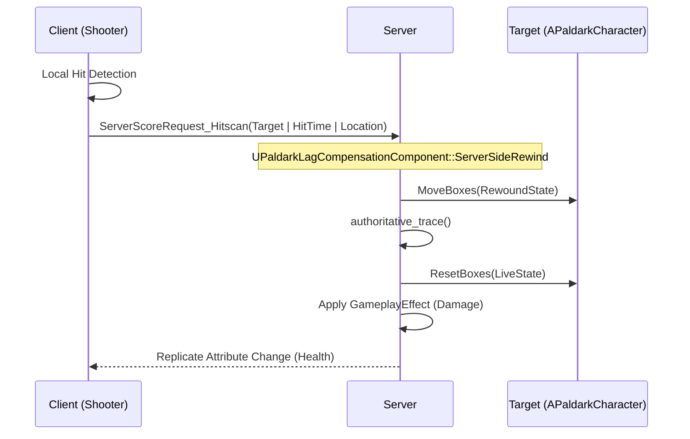
```mermaid
sequenceDiagram
    participant C as Client (Shooter)
    participant S as Server
    participant T as Target (APaldarkCharacter)
    C->>C: Local Hit Detection
    C->>S: ServerScoreRequest_Hitscan(Target | HitTime | Location)
    Note over S: UPaldarkLagCompensationComponent::ServerSideRewind
    S->>T: MoveBoxes(RewoundState)
    S->>S: authoritative_trace()
    S->>T: ResetBoxes(LiveState)
    S->>S: Apply GameplayEffect (Damage)
    S-->>C: Replicate Attribute Change (Health)
```

Sources: [Source/PaldarkLab/Private/Gas/Abilities/PaldarkGameplayAbility_HitscanFire.cpp#125-210](https://github.com/thanhtinpro/devin-paldarklab/blob/864c77b4/Source/PaldarkLab/Private/Gas/Abilities/PaldarkGameplayAbility_HitscanFire.cpp#L125-L210)[Source/PaldarkLab/Public/Combat/PaldarkLagCompensationComponent.h#98-103](https://github.com/thanhtinpro/devin-paldarklab/blob/864c77b4/Source/PaldarkLab/Public/Combat/PaldarkLagCompensationComponent.h#L98-L103)

## Debugging and Validation

Designers can verify the lag compensation history and accuracy using dedicated console commands:

- `Paldark.LagComp.DumpHistory`: Logs the current state of the local pawn's `FrameHistory` and time sync metrics to `LogPaldarkNet`.
- `Paldark.LagComp.SimulateHit [BackdateMs]`: Traces from the camera and sends a score request with a manual back-date (default 100ms) to test interpolation.
- `Paldark.LagComp.ArtificialPing [Ms]`: Wrapper for `Net PktLag` to simulate network conditions in PIE.

Sources: [Documents/Devlog/W16-17-Build.md#82-89](https://github.com/thanhtinpro/devin-paldarklab/blob/864c77b4/Documents/Devlog/W16-17-Build.md?plain=1#L82-L89)[Source/PaldarkLab/Public/Combat/PaldarkLagCompensationComponent.h#115-119](https://github.com/thanhtinpro/devin-paldarklab/blob/864c77b4/Source/PaldarkLab/Public/Combat/PaldarkLagCompensationComponent.h#L115-L119)

---

# Loot-System

# Loot System
Relevant source files

- [Documents/Devlog/W18-19-Build.md](https://github.com/thanhtinpro/devin-paldarklab/blob/864c77b4/Documents/Devlog/W18-19-Build.md?plain=1)
- [Source/PaldarkLab/Private/Loot/PaldarkLootBag.cpp](https://github.com/thanhtinpro/devin-paldarklab/blob/864c77b4/Source/PaldarkLab/Private/Loot/PaldarkLootBag.cpp)
- [Source/PaldarkLab/Private/Loot/PaldarkLootDropComponent.cpp](https://github.com/thanhtinpro/devin-paldarklab/blob/864c77b4/Source/PaldarkLab/Private/Loot/PaldarkLootDropComponent.cpp)
- [Source/PaldarkLab/Private/Loot/PaldarkLootTable.cpp](https://github.com/thanhtinpro/devin-paldarklab/blob/864c77b4/Source/PaldarkLab/Private/Loot/PaldarkLootTable.cpp)
- [Source/PaldarkLab/Private/Map/PaldarkMapDefinition.cpp](https://github.com/thanhtinpro/devin-paldarklab/blob/864c77b4/Source/PaldarkLab/Private/Map/PaldarkMapDefinition.cpp)
- [Source/PaldarkLab/Private/Pal/PaldarkPalDefinition.cpp](https://github.com/thanhtinpro/devin-paldarklab/blob/864c77b4/Source/PaldarkLab/Private/Pal/PaldarkPalDefinition.cpp)
- [Source/PaldarkLab/Public/Loot/PaldarkLootBag.h](https://github.com/thanhtinpro/devin-paldarklab/blob/864c77b4/Source/PaldarkLab/Public/Loot/PaldarkLootBag.h)
- [Source/PaldarkLab/Public/Loot/PaldarkLootDropComponent.h](https://github.com/thanhtinpro/devin-paldarklab/blob/864c77b4/Source/PaldarkLab/Public/Loot/PaldarkLootDropComponent.h)
- [Source/PaldarkLab/Public/Loot/PaldarkLootTable.h](https://github.com/thanhtinpro/devin-paldarklab/blob/864c77b4/Source/PaldarkLab/Public/Loot/PaldarkLootTable.h)
- [Source/PaldarkLab/Public/Map/PaldarkMapDefinition.h](https://github.com/thanhtinpro/devin-paldarklab/blob/864c77b4/Source/PaldarkLab/Public/Map/PaldarkMapDefinition.h)
- [Source/PaldarkLab/Public/Pal/Activities/PaldarkActivity_Combat.h](https://github.com/thanhtinpro/devin-paldarklab/blob/864c77b4/Source/PaldarkLab/Public/Pal/Activities/PaldarkActivity_Combat.h)
- [Source/PaldarkLab/Public/Pal/Components/PaldarkPalCombatComponent.h](https://github.com/thanhtinpro/devin-paldarklab/blob/864c77b4/Source/PaldarkLab/Public/Pal/Components/PaldarkPalCombatComponent.h)

The Loot System provides a server-authoritative pipeline for generating, spawning, and collecting items in the game world. It is primarily driven by Pal deaths but supports arbitrary drop triggers. The system utilizes weighted loot tables, physicalized loot bags with replicated contents, and integration with the player's inventory and encumbrance systems.

## System Architecture

The loot flow is divided into three distinct phases: the Trigger (Pal death or force drop), the Resolution (weighted rolling and merging), and the Interaction (physical bag spawning and pickup).

### Entity Association Diagram

This diagram maps the natural language concepts to the specific C++ entities and data structures used in the codebase.

[Flowchart Diagram]

Sources:[Source/PaldarkLab/Public/Loot/PaldarkLootTable.h#48-147](https://github.com/thanhtinpro/devin-paldarklab/blob/864c77b4/Source/PaldarkLab/Public/Loot/PaldarkLootTable.h#L48-L147)[Source/PaldarkLab/Public/Loot/PaldarkLootDropComponent.h#39-88](https://github.com/thanhtinpro/devin-paldarklab/blob/864c77b4/Source/PaldarkLab/Public/Loot/PaldarkLootDropComponent.h#L39-L88)[Source/PaldarkLab/Public/Loot/PaldarkLootBag.h#58-132](https://github.com/thanhtinpro/devin-paldarklab/blob/864c77b4/Source/PaldarkLab/Public/Loot/PaldarkLootBag.h#L58-L132)

---

## UPaldarkLootTable

Loot tables are authored as `UPrimaryDataAsset` instances under `/Game/Paldark/Loot/`. They use the Lyra-style primary asset convention (`PaldarkLootTable:<RowName>`) [Source/PaldarkLab/Public/Loot/PaldarkLootTable.h#22-24](https://github.com/thanhtinpro/devin-paldarklab/blob/864c77b4/Source/PaldarkLab/Public/Loot/PaldarkLootTable.h#L22-L24)

### Weighted Rolling Logic

The `RollEntries` function implements the core generation logic:

1. Guaranteed Drops: The system checks `FPaldarkLootEntry::GuaranteedWhenTag`. If the context tags (e.g., the dying Pal's `SpeciesTag`) match, the entry is added at `MaxCount` before any rolls occur [Source/PaldarkLab/Private/Loot/PaldarkLootTable.cpp#20-35](https://github.com/thanhtinpro/devin-paldarklab/blob/864c77b4/Source/PaldarkLab/Private/Loot/PaldarkLootTable.cpp#L20-L35)
2. Weighted Picks: The system performs `MaxRolls` (clamped 1-8) independent picks [Source/PaldarkLab/Public/Loot/PaldarkLootTable.h#125-127](https://github.com/thanhtinpro/devin-paldarklab/blob/864c77b4/Source/PaldarkLab/Public/Loot/PaldarkLootTable.h#L125-L127)
3. Merging: Duplicate items from multiple rolls are merged into a single `FPaldarkLootRollResult` to keep the network payload terse [Source/PaldarkLab/Private/Loot/PaldarkLootTable.cpp#67-86](https://github.com/thanhtinpro/devin-paldarklab/blob/864c77b4/Source/PaldarkLab/Private/Loot/PaldarkLootTable.cpp#L67-L86)

### Data Structures

| Class/Struct | Purpose |
| --- | --- |
| `FPaldarkLootEntry` | A single row containing a soft reference to `UPaldarkItemDefinition`, weight, min/max count, and an optional guarantee tag [Source/PaldarkLab/Public/Loot/PaldarkLootTable.h#49-88](https://github.com/thanhtinpro/devin-paldarklab/blob/864c77b4/Source/PaldarkLab/Public/Loot/PaldarkLootTable.h#L49-L88) |
| `FPaldarkLootRollResult` | A transient struct used to pass rolled (Item, Count) pairs from the table to the drop component [Source/PaldarkLab/Public/Loot/PaldarkLootTable.h#92-96](https://github.com/thanhtinpro/devin-paldarklab/blob/864c77b4/Source/PaldarkLab/Public/Loot/PaldarkLootTable.h#L92-L96) |

Sources:[Source/PaldarkLab/Public/Loot/PaldarkLootTable.h#1-147](https://github.com/thanhtinpro/devin-paldarklab/blob/864c77b4/Source/PaldarkLab/Public/Loot/PaldarkLootTable.h#L1-L147)[Source/PaldarkLab/Private/Loot/PaldarkLootTable.cpp#11-89](https://github.com/thanhtinpro/devin-paldarklab/blob/864c77b4/Source/PaldarkLab/Private/Loot/PaldarkLootTable.cpp#L11-L89)

---

## UPaldarkLootDropComponent

This component is the 9th slot in the `APaldarkCharacter` (Pal) component suite [Source/PaldarkLab/Public/Loot/PaldarkLootDropComponent.h#3-5](https://github.com/thanhtinpro/devin-paldarklab/blob/864c77b4/Source/PaldarkLab/Public/Loot/PaldarkLootDropComponent.h#L3-L5) It is server-only and handles the transition from character death to physical loot.

### Execution Pipeline

1. Trigger: Listens to `UPaldarkAttributeSet::OnHealthZeroed` on authority [Source/PaldarkLab/Private/Loot/PaldarkLootDropComponent.cpp#66-67](https://github.com/thanhtinpro/devin-paldarklab/blob/864c77b4/Source/PaldarkLab/Private/Loot/PaldarkLootDropComponent.cpp#L66-L67)
2. Context Capture: Captures the owner's transform and `SpeciesTag` before the owner is destroyed [Source/PaldarkLab/Private/Loot/PaldarkLootDropComponent.cpp#96-105](https://github.com/thanhtinpro/devin-paldarklab/blob/864c77b4/Source/PaldarkLab/Private/Loot/PaldarkLootDropComponent.cpp#L96-L105)
3. Async Loading: Uses `UAssetManager::LoadPrimaryAsset` to load the `LootTableId`. This allows the loot table to remain a soft reference until needed [Source/PaldarkLab/Private/Loot/PaldarkLootDropComponent.cpp#113](https://github.com/thanhtinpro/devin-paldarklab/blob/864c77b4/Source/PaldarkLab/Private/Loot/PaldarkLootDropComponent.cpp#L113-L113)
4. Bag Spawning: Once loaded, it rolls the table and spawns an `APaldarkLootBag` at the captured location [Source/PaldarkLab/Private/Loot/PaldarkLootDropComponent.cpp#151](https://github.com/thanhtinpro/devin-paldarklab/blob/864c77b4/Source/PaldarkLab/Private/Loot/PaldarkLootDropComponent.cpp#L151-L151)

Sources:[Source/PaldarkLab/Public/Loot/PaldarkLootDropComponent.h#1-89](https://github.com/thanhtinpro/devin-paldarklab/blob/864c77b4/Source/PaldarkLab/Public/Loot/PaldarkLootDropComponent.h#L1-L89)[Source/PaldarkLab/Private/Loot/PaldarkLootDropComponent.cpp#1-173](https://github.com/thanhtinpro/devin-paldarklab/blob/864c77b4/Source/PaldarkLab/Private/Loot/PaldarkLootDropComponent.cpp#L1-L173)

---

## APaldarkLootBag

The `APaldarkLootBag` is a replicated actor representing the physical loot container in the world.

### Replicated Contents

Contents are stored in `TArray<FPaldarkLootBagEntry> ReplicatedContents`, which uses `DOREPLIFETIME` to sync with clients [Source/PaldarkLab/Private/Loot/PaldarkLootBag.cpp#36](https://github.com/thanhtinpro/devin-paldarklab/blob/864c77b4/Source/PaldarkLab/Private/Loot/PaldarkLootBag.cpp#L36-L36) This allows clients to predictively show UI prompts or markers.

### Interaction Flow

1. Overlap: A `USphereComponent` (default 50cm radius) detects player overlaps [Source/PaldarkLab/Private/Loot/PaldarkLootBag.cpp#23-26](https://github.com/thanhtinpro/devin-paldarklab/blob/864c77b4/Source/PaldarkLab/Private/Loot/PaldarkLootBag.cpp#L23-L26)
2. Pickup Request: On overlap, the server calls `RequestPickup` for the overlapping `APaldarkCharacter`[Source/PaldarkLab/Private/Loot/PaldarkLootBag.cpp#139-142](https://github.com/thanhtinpro/devin-paldarklab/blob/864c77b4/Source/PaldarkLab/Private/Loot/PaldarkLootBag.cpp#L139-L142)
3. Inventory Integration: The server iterates through the bag's contents and calls `UPaldarkPlayerInventoryComponent::AddItem` for each entry [Source/PaldarkLab/Private/Loot/PaldarkLootBag.cpp#102](https://github.com/thanhtinpro/devin-paldarklab/blob/864c77b4/Source/PaldarkLab/Private/Loot/PaldarkLootBag.cpp#L102-L102)
4. Partial Pickups: If the player is encumbered or the inventory is full, `AddItem` returns the amount actually placed. The bag's entry count is decremented by this amount, and the bag remains in the world [Source/PaldarkLab/Private/Loot/PaldarkLootBag.cpp#103-108](https://github.com/thanhtinpro/devin-paldarklab/blob/864c77b4/Source/PaldarkLab/Private/Loot/PaldarkLootBag.cpp#L103-L108)
5. Auto-Cleanup: To prevent actor accumulation, bags have a default 300-second (5-minute) self-destruction timer [Source/PaldarkLab/Public/Loot/PaldarkLootBag.h#109](https://github.com/thanhtinpro/devin-paldarklab/blob/864c77b4/Source/PaldarkLab/Public/Loot/PaldarkLootBag.h#L109-L109)

### Data Flow Diagram

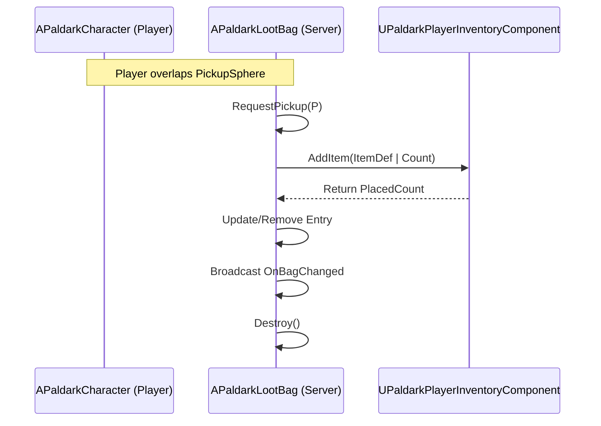
```mermaid
sequenceDiagram
    participant P as APaldarkCharacter (Player)
    participant B as APaldarkLootBag (Server)
    participant I as UPaldarkPlayerInventoryComponent
    Note over P,B: Player overlaps PickupSphere
    B->>B: RequestPickup(P)
    B->>I: AddItem(ItemDef | Count)
    I-->>B: Return PlacedCount
    B->>B: Update/Remove Entry
    B->>B: Broadcast OnBagChanged
    B->>B: Destroy()
```

Sources:[Source/PaldarkLab/Public/Loot/PaldarkLootBag.h#1-132](https://github.com/thanhtinpro/devin-paldarklab/blob/864c77b4/Source/PaldarkLab/Public/Loot/PaldarkLootBag.h#L1-L132)[Source/PaldarkLab/Private/Loot/PaldarkLootBag.cpp#1-175](https://github.com/thanhtinpro/devin-paldarklab/blob/864c77b4/Source/PaldarkLab/Private/Loot/PaldarkLootBag.cpp#L1-L175)

---

# Inventory-System

# Inventory System
Relevant source files

- [Content/Paldark/Inventory/Backpacks/README.txt](https://github.com/thanhtinpro/devin-paldarklab/blob/864c77b4/Content/Paldark/Inventory/Backpacks/README.txt)
- [Source/PaldarkLab/PaldarkLab.cpp](https://github.com/thanhtinpro/devin-paldarklab/blob/864c77b4/Source/PaldarkLab/PaldarkLab.cpp)
- [Source/PaldarkLab/PaldarkLab.h](https://github.com/thanhtinpro/devin-paldarklab/blob/864c77b4/Source/PaldarkLab/PaldarkLab.h)
- [Source/PaldarkLab/Private/Inventory/PaldarkItemDefinition.cpp](https://github.com/thanhtinpro/devin-paldarklab/blob/864c77b4/Source/PaldarkLab/Private/Inventory/PaldarkItemDefinition.cpp)
- [Source/PaldarkLab/Private/Player/Components/PaldarkPlayerInventoryComponent.cpp](https://github.com/thanhtinpro/devin-paldarklab/blob/864c77b4/Source/PaldarkLab/Private/Player/Components/PaldarkPlayerInventoryComponent.cpp)
- [Source/PaldarkLab/Public/Inventory/Fragments/PaldarkItemFragment_Backpack.h](https://github.com/thanhtinpro/devin-paldarklab/blob/864c77b4/Source/PaldarkLab/Public/Inventory/Fragments/PaldarkItemFragment_Backpack.h)
- [Source/PaldarkLab/Public/Inventory/Fragments/PaldarkItemFragment_Equipable.h](https://github.com/thanhtinpro/devin-paldarklab/blob/864c77b4/Source/PaldarkLab/Public/Inventory/Fragments/PaldarkItemFragment_Equipable.h)
- [Source/PaldarkLab/Public/Inventory/PaldarkItemDefinition.h](https://github.com/thanhtinpro/devin-paldarklab/blob/864c77b4/Source/PaldarkLab/Public/Inventory/PaldarkItemDefinition.h)
- [Source/PaldarkLab/Public/Inventory/PaldarkItemFragment.h](https://github.com/thanhtinpro/devin-paldarklab/blob/864c77b4/Source/PaldarkLab/Public/Inventory/PaldarkItemFragment.h)
- [Source/PaldarkLab/Public/Player/Components/PaldarkPlayerInventoryComponent.h](https://github.com/thanhtinpro/devin-paldarklab/blob/864c77b4/Source/PaldarkLab/Public/Player/Components/PaldarkPlayerInventoryComponent.h)

The Paldark inventory system is a server-authoritative, fragment-based architecture designed to handle diverse item behaviors—from stackable ammunition to complex nested containers—without class inheritance bloat. It utilizes a composition-over-inheritance pattern inspired by the Lyra framework and modern extraction shooters [Source/PaldarkLab/Public/Inventory/PaldarkItemFragment.h#3-15](https://github.com/thanhtinpro/devin-paldarklab/blob/864c77b4/Source/PaldarkLab/Public/Inventory/PaldarkItemFragment.h#L3-L15)

The system manages item definitions, physical properties (weight/stacking), equipment slots, and player encumbrance. It is designed to be extensible, allowing designers to create new item types by mixing and matching data fragments in the Unreal Editor [Source/PaldarkLab/Public/Inventory/PaldarkItemDefinition.h#10-15](https://github.com/thanhtinpro/devin-paldarklab/blob/864c77b4/Source/PaldarkLab/Public/Inventory/PaldarkItemDefinition.h#L10-L15)

## System Architecture

The inventory system is built upon three primary pillars: Data (Definitions/Fragments), Storage (Inventory Component), and Logic (Encumbrance/Authority).

### Entity Mapping: Natural Language to Code

The following diagram illustrates how high-level inventory concepts map to specific C++ entities within the codebase.

Inventory Entity Mapping

[Flowchart Diagram]

Sources: [Source/PaldarkLab/Public/Inventory/PaldarkItemDefinition.h#32-58](https://github.com/thanhtinpro/devin-paldarklab/blob/864c77b4/Source/PaldarkLab/Public/Inventory/PaldarkItemDefinition.h#L32-L58)[Source/PaldarkLab/Public/Player/Components/PaldarkPlayerInventoryComponent.h#67-121](https://github.com/thanhtinpro/devin-paldarklab/blob/864c77b4/Source/PaldarkLab/Public/Player/Components/PaldarkPlayerInventoryComponent.h#L67-L121)

### Core Components

| Class | Role | Key Responsibility |
| --- | --- | --- |
| `UPaldarkItemDefinition` | Data Asset | A `UPrimaryDataAsset` that serves as the unique template for an item type (e.g., "Pistol", "9mm Ammo") [Source/PaldarkLab/Public/Inventory/PaldarkItemDefinition.h#32](https://github.com/thanhtinpro/devin-paldarklab/blob/864c77b4/Source/PaldarkLab/Public/Inventory/PaldarkItemDefinition.h#L32-L32) |
| `UPaldarkItemFragment` | Component Data | Instanced subobjects owned by a definition that define specific behaviors like weight or stack size [Source/PaldarkLab/Public/Inventory/PaldarkItemFragment.h#31](https://github.com/thanhtinpro/devin-paldarklab/blob/864c77b4/Source/PaldarkLab/Public/Inventory/PaldarkItemFragment.h#L31-L31) |
| `UPaldarkPlayerInventoryComponent` | Manager | Attached to the Player Character; manages the list of entries, replication, and weight calculations [Source/PaldarkLab/Public/Player/Components/PaldarkPlayerInventoryComponent.h#121](https://github.com/thanhtinpro/devin-paldarklab/blob/864c77b4/Source/PaldarkLab/Public/Player/Components/PaldarkPlayerInventoryComponent.h#L121-L121) |
| `FPaldarkInventoryEntry` | Data Structure | A replicated struct representing a single "slot" in the inventory, containing an item reference and stack count [Source/PaldarkLab/Public/Player/Components/PaldarkPlayerInventoryComponent.h#67](https://github.com/thanhtinpro/devin-paldarklab/blob/864c77b4/Source/PaldarkLab/Public/Player/Components/PaldarkPlayerInventoryComponent.h#L67-L67) |

## Item Definitions and Fragments

Items are defined as `UPrimaryDataAsset` objects registered with the `AssetManager`[Source/PaldarkLab/Public/Inventory/PaldarkItemDefinition.h#17-20](https://github.com/thanhtinpro/devin-paldarklab/blob/864c77b4/Source/PaldarkLab/Public/Inventory/PaldarkItemDefinition.h#L17-L20) Each definition contains an `ItemTag` (stable identity) and a `Fragments` array [Source/PaldarkLab/Public/Inventory/PaldarkItemDefinition.h#44-58](https://github.com/thanhtinpro/devin-paldarklab/blob/864c77b4/Source/PaldarkLab/Public/Inventory/PaldarkItemDefinition.h#L44-L58)

Common fragments include:

- Stackable: Defines `MaxStackSize`[Source/PaldarkLab/Private/Player/Components/PaldarkPlayerInventoryComponent.cpp#91](https://github.com/thanhtinpro/devin-paldarklab/blob/864c77b4/Source/PaldarkLab/Private/Player/Components/PaldarkPlayerInventoryComponent.cpp#L91-L91)
- Weight: Defines `WeightKgPerUnit` for encumbrance [Source/PaldarkLab/Public/Player/Components/PaldarkPlayerInventoryComponent.h#10-11](https://github.com/thanhtinpro/devin-paldarklab/blob/864c77b4/Source/PaldarkLab/Public/Player/Components/PaldarkPlayerInventoryComponent.h#L10-L11)
- Backpack: Grants `MaxWeightBonusKg` and `ExtraSlots` when equipped [Source/PaldarkLab/Public/Inventory/Fragments/PaldarkItemFragment_Backpack.h#29-54](https://github.com/thanhtinpro/devin-paldarklab/blob/864c77b4/Source/PaldarkLab/Public/Inventory/Fragments/PaldarkItemFragment_Backpack.h#L29-L54)
- Equipable: Specifies a target `EquipSlot` tag and an optional `AbilityToGrantOnEquip`[Source/PaldarkLab/Public/Inventory/Fragments/PaldarkItemFragment_Equipable.h#23-39](https://github.com/thanhtinpro/devin-paldarklab/blob/864c77b4/Source/PaldarkLab/Public/Inventory/Fragments/PaldarkItemFragment_Equipable.h#L23-L39)

For detailed documentation on all fragment types and asset authoring, see [Item Definitions and Fragments](#7.1).

Sources: [Source/PaldarkLab/Public/Inventory/PaldarkItemDefinition.h#32-82](https://github.com/thanhtinpro/devin-paldarklab/blob/864c77b4/Source/PaldarkLab/Public/Inventory/PaldarkItemDefinition.h#L32-L82)[Source/PaldarkLab/Public/Inventory/PaldarkItemFragment.h#1-41](https://github.com/thanhtinpro/devin-paldarklab/blob/864c77b4/Source/PaldarkLab/Public/Inventory/PaldarkItemFragment.h#L1-L41)[Source/PaldarkLab/Public/Inventory/Fragments/PaldarkItemFragment_Backpack.h#1-60](https://github.com/thanhtinpro/devin-paldarklab/blob/864c77b4/Source/PaldarkLab/Public/Inventory/Fragments/PaldarkItemFragment_Backpack.h#L1-L60)

## Player Inventory and Encumbrance

The `UPaldarkPlayerInventoryComponent` manages the player's carried items and enforces server-authoritative rules for adding or removing items [Source/PaldarkLab/Public/Player/Components/PaldarkPlayerInventoryComponent.h#131-135](https://github.com/thanhtinpro/devin-paldarklab/blob/864c77b4/Source/PaldarkLab/Public/Player/Components/PaldarkPlayerInventoryComponent.h#L131-L135)

### Inventory Logic Flow

The following diagram describes the server-side logic when adding an item to a player's inventory.

AddItem Logic Flow

[Flowchart Diagram]

Sources: [Source/PaldarkLab/Private/Player/Components/PaldarkPlayerInventoryComponent.cpp#71-154](https://github.com/thanhtinpro/devin-paldarklab/blob/864c77b4/Source/PaldarkLab/Private/Player/Components/PaldarkPlayerInventoryComponent.cpp#L71-L154)

### Encumbrance System

The system calculates weight dynamically. The `BaseMaxWeightKg` (default 30kg) is combined with any `MaxWeightBonusKg` provided by an `EquippedBackpack`[Source/PaldarkLab/Public/Player/Components/PaldarkPlayerInventoryComponent.h#24-30](https://github.com/thanhtinpro/devin-paldarklab/blob/864c77b4/Source/PaldarkLab/Public/Player/Components/PaldarkPlayerInventoryComponent.h#L24-L30) Current weight is the sum of all item weights multiplied by their stack counts [Source/PaldarkLab/Public/Player/Components/PaldarkPlayerInventoryComponent.h#10-11](https://github.com/thanhtinpro/devin-paldarklab/blob/864c77b4/Source/PaldarkLab/Public/Player/Components/PaldarkPlayerInventoryComponent.h#L10-L11)

For details on replication, nesting (containers), and the save-game snapshot system, see [Player Inventory Component](#7.2).

Sources: [Source/PaldarkLab/Public/Player/Components/PaldarkPlayerInventoryComponent.h#1-125](https://github.com/thanhtinpro/devin-paldarklab/blob/864c77b4/Source/PaldarkLab/Public/Player/Components/PaldarkPlayerInventoryComponent.h#L1-L125)[Source/PaldarkLab/Private/Player/Components/PaldarkPlayerInventoryComponent.cpp#1-204](https://github.com/thanhtinpro/devin-paldarklab/blob/864c77b4/Source/PaldarkLab/Private/Player/Components/PaldarkPlayerInventoryComponent.cpp#L1-L204)

## Developer Utilities

Designers can manipulate the inventory system via console commands defined in the core module [Source/PaldarkLab/PaldarkLab.cpp#16-19](https://github.com/thanhtinpro/devin-paldarklab/blob/864c77b4/Source/PaldarkLab/PaldarkLab.cpp#L16-L19)

- `Paldark.Inventory.List`: Dumps the local player's inventory to the log [Source/PaldarkLab/PaldarkLab.h#68](https://github.com/thanhtinpro/devin-paldarklab/blob/864c77b4/Source/PaldarkLab/PaldarkLab.h#L68-L68)
- `Paldark.Inventory.Add <Tag> [Count]`: Adds items by their gameplay tag [Source/PaldarkLab/PaldarkLab.h#69](https://github.com/thanhtinpro/devin-paldarklab/blob/864c77b4/Source/PaldarkLab/PaldarkLab.h#L69-L69)
- `Paldark.Inventory.EquipBackpack <T1|T2|T3>`: Equips a specific tier of backpack to test encumbrance [Source/PaldarkLab/PaldarkLab.h#82](https://github.com/thanhtinpro/devin-paldarklab/blob/864c77b4/Source/PaldarkLab/PaldarkLab.h#L82-L82)
- `Paldark.Inventory.GiveAll`: Fills the inventory with every registered item asset [Source/PaldarkLab/PaldarkLab.h#81](https://github.com/thanhtinpro/devin-paldarklab/blob/864c77b4/Source/PaldarkLab/PaldarkLab.h#L81-L81)

Sources: [Source/PaldarkLab/PaldarkLab.cpp#16-19](https://github.com/thanhtinpro/devin-paldarklab/blob/864c77b4/Source/PaldarkLab/PaldarkLab.cpp#L16-L19)[Source/PaldarkLab/PaldarkLab.h#64-88](https://github.com/thanhtinpro/devin-paldarklab/blob/864c77b4/Source/PaldarkLab/PaldarkLab.h#L64-L88)

---

# Item-Definitions-and-Fragments

# Item Definitions and Fragments
Relevant source files

- [Content/Paldark/Inventory/Containers/README.txt](https://github.com/thanhtinpro/devin-paldarklab/blob/864c77b4/Content/Paldark/Inventory/Containers/README.txt)
- [Documents/GameDesign/09-Inventory_GDD.md](https://github.com/thanhtinpro/devin-paldarklab/blob/864c77b4/Documents/GameDesign/09-Inventory_GDD.md?plain=1)
- [Source/PaldarkLab/Private/Inventory/Fragments/PaldarkItemFragment_Backpack.cpp](https://github.com/thanhtinpro/devin-paldarklab/blob/864c77b4/Source/PaldarkLab/Private/Inventory/Fragments/PaldarkItemFragment_Backpack.cpp)
- [Source/PaldarkLab/Private/Inventory/Fragments/PaldarkItemFragment_Container.cpp](https://github.com/thanhtinpro/devin-paldarklab/blob/864c77b4/Source/PaldarkLab/Private/Inventory/Fragments/PaldarkItemFragment_Container.cpp)
- [Source/PaldarkLab/Private/Inventory/Fragments/PaldarkItemFragment_Equipable.cpp](https://github.com/thanhtinpro/devin-paldarklab/blob/864c77b4/Source/PaldarkLab/Private/Inventory/Fragments/PaldarkItemFragment_Equipable.cpp)
- [Source/PaldarkLab/Private/Inventory/Fragments/PaldarkItemFragment_MarketValue.cpp](https://github.com/thanhtinpro/devin-paldarklab/blob/864c77b4/Source/PaldarkLab/Private/Inventory/Fragments/PaldarkItemFragment_MarketValue.cpp)
- [Source/PaldarkLab/Private/Inventory/Fragments/PaldarkItemFragment_Stackable.cpp](https://github.com/thanhtinpro/devin-paldarklab/blob/864c77b4/Source/PaldarkLab/Private/Inventory/Fragments/PaldarkItemFragment_Stackable.cpp)
- [Source/PaldarkLab/Private/Inventory/Fragments/PaldarkItemFragment_Weight.cpp](https://github.com/thanhtinpro/devin-paldarklab/blob/864c77b4/Source/PaldarkLab/Private/Inventory/Fragments/PaldarkItemFragment_Weight.cpp)
- [Source/PaldarkLab/Private/Inventory/PaldarkItemDefinition.cpp](https://github.com/thanhtinpro/devin-paldarklab/blob/864c77b4/Source/PaldarkLab/Private/Inventory/PaldarkItemDefinition.cpp)
- [Source/PaldarkLab/Private/Inventory/PaldarkItemFragment.cpp](https://github.com/thanhtinpro/devin-paldarklab/blob/864c77b4/Source/PaldarkLab/Private/Inventory/PaldarkItemFragment.cpp)
- [Source/PaldarkLab/Public/Inventory/Fragments/PaldarkItemFragment_Backpack.h](https://github.com/thanhtinpro/devin-paldarklab/blob/864c77b4/Source/PaldarkLab/Public/Inventory/Fragments/PaldarkItemFragment_Backpack.h)
- [Source/PaldarkLab/Public/Inventory/Fragments/PaldarkItemFragment_Container.h](https://github.com/thanhtinpro/devin-paldarklab/blob/864c77b4/Source/PaldarkLab/Public/Inventory/Fragments/PaldarkItemFragment_Container.h)
- [Source/PaldarkLab/Public/Inventory/Fragments/PaldarkItemFragment_Equipable.h](https://github.com/thanhtinpro/devin-paldarklab/blob/864c77b4/Source/PaldarkLab/Public/Inventory/Fragments/PaldarkItemFragment_Equipable.h)
- [Source/PaldarkLab/Public/Inventory/Fragments/PaldarkItemFragment_MarketValue.h](https://github.com/thanhtinpro/devin-paldarklab/blob/864c77b4/Source/PaldarkLab/Public/Inventory/Fragments/PaldarkItemFragment_MarketValue.h)
- [Source/PaldarkLab/Public/Inventory/Fragments/PaldarkItemFragment_Stackable.h](https://github.com/thanhtinpro/devin-paldarklab/blob/864c77b4/Source/PaldarkLab/Public/Inventory/Fragments/PaldarkItemFragment_Stackable.h)
- [Source/PaldarkLab/Public/Inventory/Fragments/PaldarkItemFragment_Weight.h](https://github.com/thanhtinpro/devin-paldarklab/blob/864c77b4/Source/PaldarkLab/Public/Inventory/Fragments/PaldarkItemFragment_Weight.h)
- [Source/PaldarkLab/Public/Inventory/PaldarkItemDefinition.h](https://github.com/thanhtinpro/devin-paldarklab/blob/864c77b4/Source/PaldarkLab/Public/Inventory/PaldarkItemDefinition.h)
- [Source/PaldarkLab/Public/Inventory/PaldarkItemFragment.h](https://github.com/thanhtinpro/devin-paldarklab/blob/864c77b4/Source/PaldarkLab/Public/Inventory/PaldarkItemFragment.h)

The inventory system in PaldarkLab utilizes a Composition over Inheritance pattern inspired by the Lyra Starter Game and the Udemy Inventory Systems course [Documents/GameDesign/09-Inventory_GDD.md#116-119](https://github.com/thanhtinpro/devin-paldarklab/blob/864c77b4/Documents/GameDesign/09-Inventory_GDD.md?plain=1#L116-L119) Instead of a monolithic class for items, PaldarkLab uses `UPaldarkItemDefinition` to act as a container for various `UPaldarkItemFragment` subobjects. This allows designers to define item behavior (weight, stackability, equipability) by mixing and matching data fragments without modifying C++ code [Source/PaldarkLab/Public/Inventory/PaldarkItemFragment.h#3-15](https://github.com/thanhtinpro/devin-paldarklab/blob/864c77b4/Source/PaldarkLab/Public/Inventory/PaldarkItemFragment.h#L3-L15)

## UPaldarkItemDefinition

`UPaldarkItemDefinition` is the top-level `UPrimaryDataAsset` representing a gameplay item [Source/PaldarkLab/Public/Inventory/PaldarkItemDefinition.h#31-32](https://github.com/thanhtinpro/devin-paldarklab/blob/864c77b4/Source/PaldarkLab/Public/Inventory/PaldarkItemDefinition.h#L31-L32) Every item in the game (e.g., Pistols, Ammo, Bandages) is an instance of this data asset [Source/PaldarkLab/Public/Inventory/PaldarkItemDefinition.h#3-9](https://github.com/thanhtinpro/devin-paldarklab/blob/864c77b4/Source/PaldarkLab/Public/Inventory/PaldarkItemDefinition.h#L3-L9)

### Key Components

- ItemTag: A stable `FGameplayTag` (e.g., `Paldark.Item.Pistol`) used for lookups in the inventory component and save system, ensuring stability even if the asset path is renamed [Source/PaldarkLab/Public/Inventory/PaldarkItemDefinition.h#44-45](https://github.com/thanhtinpro/devin-paldarklab/blob/864c77b4/Source/PaldarkLab/Public/Inventory/PaldarkItemDefinition.h#L44-L45)
- Fragments: A `TArray` of `UPaldarkItemFragment` instanced subobjects. These are edited inline within the Data Asset [Source/PaldarkLab/Public/Inventory/PaldarkItemDefinition.h#57-58](https://github.com/thanhtinpro/devin-paldarklab/blob/864c77b4/Source/PaldarkLab/Public/Inventory/PaldarkItemDefinition.h#L57-L58)
- Primary Asset ID: Registered as `PaldarkItem` for discovery by the `UPaldarkAssetManager`[Source/PaldarkLab/Private/Inventory/PaldarkItemDefinition.cpp#36-39](https://github.com/thanhtinpro/devin-paldarklab/blob/864c77b4/Source/PaldarkLab/Private/Inventory/PaldarkItemDefinition.cpp#L36-L39)

### Fragment Retrieval

The class provides a linear scan mechanism to find specific behavior fragments. Because the fragment arrays are typically small (≤ 5 elements), a linear scan is more efficient than a map [Source/PaldarkLab/Public/Inventory/PaldarkItemDefinition.h#60-63](https://github.com/thanhtinpro/devin-paldarklab/blob/864c77b4/Source/PaldarkLab/Public/Inventory/PaldarkItemDefinition.h#L60-L63)

- `FindFragmentByClass(TSubclassOf<UPaldarkItemFragment> FragmentClass)`: Returns the first matching fragment [Source/PaldarkLab/Private/Inventory/PaldarkItemDefinition.cpp#7-21](https://github.com/thanhtinpro/devin-paldarklab/blob/864c77b4/Source/PaldarkLab/Private/Inventory/PaldarkItemDefinition.cpp#L7-L21)
- `FindFragmentByClass<T>()`: A templated helper for typed access [Source/PaldarkLab/Public/Inventory/PaldarkItemDefinition.h#67-71](https://github.com/thanhtinpro/devin-paldarklab/blob/864c77b4/Source/PaldarkLab/Public/Inventory/PaldarkItemDefinition.h#L67-L71)

Sources:[Source/PaldarkLab/Public/Inventory/PaldarkItemDefinition.h#1-83](https://github.com/thanhtinpro/devin-paldarklab/blob/864c77b4/Source/PaldarkLab/Public/Inventory/PaldarkItemDefinition.h#L1-L83)[Source/PaldarkLab/Private/Inventory/PaldarkItemDefinition.cpp#1-40](https://github.com/thanhtinpro/devin-paldarklab/blob/864c77b4/Source/PaldarkLab/Private/Inventory/PaldarkItemDefinition.cpp#L1-L40)

---

## Item Fragment Architecture

`UPaldarkItemFragment` is an abstract base class for all behavior-specific data [Source/PaldarkLab/Public/Inventory/PaldarkItemFragment.h#30-31](https://github.com/thanhtinpro/devin-paldarklab/blob/864c77b4/Source/PaldarkLab/Public/Inventory/PaldarkItemFragment.h#L30-L31) Fragments are pure data containers; runtime logic is currently handled by the Inventory Component which reads these fields [Source/PaldarkLab/Public/Inventory/PaldarkItemFragment.h#16-20](https://github.com/thanhtinpro/devin-paldarklab/blob/864c77b4/Source/PaldarkLab/Public/Inventory/PaldarkItemFragment.h#L16-L20)

### Composition Diagram

This diagram illustrates how a concrete Item Definition (e.g., a Pistol) is composed of discrete fragment entities.

"Item Definition Composition"

[Flowchart Diagram]

Sources:[Source/PaldarkLab/Public/Inventory/PaldarkItemDefinition.h#57-58](https://github.com/thanhtinpro/devin-paldarklab/blob/864c77b4/Source/PaldarkLab/Public/Inventory/PaldarkItemDefinition.h#L57-L58)[Source/PaldarkLab/Public/Inventory/Fragments/PaldarkItemFragment_Equipable.h#23-42](https://github.com/thanhtinpro/devin-paldarklab/blob/864c77b4/Source/PaldarkLab/Public/Inventory/Fragments/PaldarkItemFragment_Equipable.h#L23-L42)[Source/PaldarkLab/Public/Inventory/PaldarkItemFragment.h#10](https://github.com/thanhtinpro/devin-paldarklab/blob/864c77b4/Source/PaldarkLab/Public/Inventory/PaldarkItemFragment.h#L10-L10)

---

## Concrete Fragments

### Stackable Fragment

`UPaldarkItemFragment_Stackable` defines the maximum number of items of this type that can occupy a single inventory entry [Source/PaldarkLab/Public/Inventory/Fragments/PaldarkItemFragment_Stackable.h](https://github.com/thanhtinpro/devin-paldarklab/blob/864c77b4/Source/PaldarkLab/Public/Inventory/Fragments/PaldarkItemFragment_Stackable.h)

- MaxStackSize: The limit for stacking (e.g., 120 for 9mm ammo) [Source/PaldarkLab/Public/Inventory/PaldarkItemFragment.h#11](https://github.com/thanhtinpro/devin-paldarklab/blob/864c77b4/Source/PaldarkLab/Public/Inventory/PaldarkItemFragment.h#L11-L11)

### Weight Fragment

`UPaldarkItemFragment_Weight` contributes to the player's encumbrance [Source/PaldarkLab/Public/Inventory/Fragments/PaldarkItemFragment_Weight.h](https://github.com/thanhtinpro/devin-paldarklab/blob/864c77b4/Source/PaldarkLab/Public/Inventory/Fragments/PaldarkItemFragment_Weight.h)

- WeightKgPerUnit: Weight in kilograms for a single unit of the item [Source/PaldarkLab/Private/Inventory/Fragments/PaldarkItemFragment_Weight.cpp#5](https://github.com/thanhtinpro/devin-paldarklab/blob/864c77b4/Source/PaldarkLab/Private/Inventory/Fragments/PaldarkItemFragment_Weight.cpp#L5-L5)

### Equipable Fragment

`UPaldarkItemFragment_Equipable` allows an item to be slotted into a loadout [Source/PaldarkLab/Public/Inventory/Fragments/PaldarkItemFragment_Equipable.h#23-24](https://github.com/thanhtinpro/devin-paldarklab/blob/864c77b4/Source/PaldarkLab/Public/Inventory/Fragments/PaldarkItemFragment_Equipable.h#L23-L24)

- EquipSlot: A `FGameplayTag` (e.g., `Paldark.Equip.Slot.Primary`) [Source/PaldarkLab/Public/Inventory/Fragments/PaldarkItemFragment_Equipable.h#33](https://github.com/thanhtinpro/devin-paldarklab/blob/864c77b4/Source/PaldarkLab/Public/Inventory/Fragments/PaldarkItemFragment_Equipable.h#L33-L33)
- AbilityToGrantOnEquip: A `TSoftClassPtr<UGameplayAbility>` resolved and granted to the player's ASC when the item is equipped [Source/PaldarkLab/Public/Inventory/Fragments/PaldarkItemFragment_Equipable.h#39](https://github.com/thanhtinpro/devin-paldarklab/blob/864c77b4/Source/PaldarkLab/Public/Inventory/Fragments/PaldarkItemFragment_Equipable.h#L39-L39)

### Backpack Fragment

`UPaldarkItemFragment_Backpack` provides bonuses to the carrying capacity [Source/PaldarkLab/Public/Inventory/Fragments/PaldarkItemFragment_Backpack.h#29-30](https://github.com/thanhtinpro/devin-paldarklab/blob/864c77b4/Source/PaldarkLab/Public/Inventory/Fragments/PaldarkItemFragment_Backpack.h#L29-L30)

- BackpackTierTag: Identifies the tier (T1, T2, T3) for save data and console commands [Source/PaldarkLab/Public/Inventory/Fragments/PaldarkItemFragment_Backpack.h#39](https://github.com/thanhtinpro/devin-paldarklab/blob/864c77b4/Source/PaldarkLab/Public/Inventory/Fragments/PaldarkItemFragment_Backpack.h#L39-L39)
- MaxWeightBonusKg: Added to the inventory's base weight cap [Source/PaldarkLab/Public/Inventory/Fragments/PaldarkItemFragment_Backpack.h#46](https://github.com/thanhtinpro/devin-paldarklab/blob/864c77b4/Source/PaldarkLab/Public/Inventory/Fragments/PaldarkItemFragment_Backpack.h#L46-L46)
- ExtraSlots: Virtual slots used for sizing future UMG grid widgets [Source/PaldarkLab/Public/Inventory/Fragments/PaldarkItemFragment_Backpack.h#54](https://github.com/thanhtinpro/devin-paldarklab/blob/864c77b4/Source/PaldarkLab/Public/Inventory/Fragments/PaldarkItemFragment_Backpack.h#L54-L54)

### Container Fragment

`UPaldarkItemFragment_Container` enables "bag-in-bag" functionality, allowing an item to hold its own nested inventory [Source/PaldarkLab/Public/Inventory/Fragments/PaldarkItemFragment_Container.h#3-7](https://github.com/thanhtinpro/devin-paldarklab/blob/864c77b4/Source/PaldarkLab/Public/Inventory/Fragments/PaldarkItemFragment_Container.h#L3-L7)

- InnerMaxWeightKg: The weight limit for items inside this specific container [Source/PaldarkLab/Public/Inventory/Fragments/PaldarkItemFragment_Container.h#39](https://github.com/thanhtinpro/devin-paldarklab/blob/864c77b4/Source/PaldarkLab/Public/Inventory/Fragments/PaldarkItemFragment_Container.h#L39-L39)
- InnerMaxSlots: A hard cap on nested entries (clamped to 16 to prevent replication bottlenecks) [Source/PaldarkLab/Public/Inventory/Fragments/PaldarkItemFragment_Container.h#46-49](https://github.com/thanhtinpro/devin-paldarklab/blob/864c77b4/Source/PaldarkLab/Public/Inventory/Fragments/PaldarkItemFragment_Container.h#L46-L49)

### Market Value Fragment

`UPaldarkItemFragment_MarketValue` stores the base price used by the Hub Town Marketplace for transactions [Source/PaldarkLab/Public/Inventory/Fragments/PaldarkItemFragment_MarketValue.h](https://github.com/thanhtinpro/devin-paldarklab/blob/864c77b4/Source/PaldarkLab/Public/Inventory/Fragments/PaldarkItemFragment_MarketValue.h)

---

## Data Flow: Fragment Interaction

The following diagram demonstrates how the `UPaldarkPlayerInventoryComponent` interacts with fragments during an item addition or equipment change.

"Inventory-Fragment Data Flow"

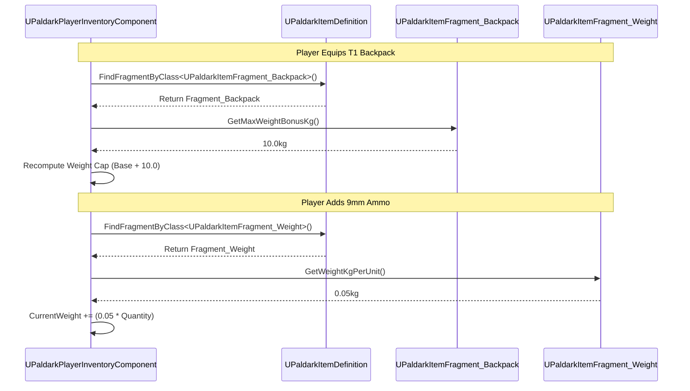
```mermaid
sequenceDiagram
    participant PC as UPaldarkPlayerInventoryComponent
    participant ID as UPaldarkItemDefinition
    participant FB as UPaldarkItemFragment_Backpack
    participant FW as UPaldarkItemFragment_Weight
    Note over PC,FW: Player Equips T1 Backpack
    PC->>ID: FindFragmentByClass<UPaldarkItemFragment_Backpack>()
    ID-->>PC: Return Fragment_Backpack
    PC->>FB: GetMaxWeightBonusKg()
    FB-->>PC: 10.0kg
    PC->>PC: Recompute Weight Cap (Base + 10.0)
    Note over PC,FW: Player Adds 9mm Ammo
    PC->>ID: FindFragmentByClass<UPaldarkItemFragment_Weight>()
    ID-->>PC: Return Fragment_Weight
    PC->>FW: GetWeightKgPerUnit()
    FW-->>PC: 0.05kg
    PC->>PC: CurrentWeight += (0.05 * Quantity)
```

Sources:[Source/PaldarkLab/Public/Inventory/Fragments/PaldarkItemFragment_Backpack.h#13-15](https://github.com/thanhtinpro/devin-paldarklab/blob/864c77b4/Source/PaldarkLab/Public/Inventory/Fragments/PaldarkItemFragment_Backpack.h#L13-L15)[Source/PaldarkLab/Public/Inventory/Fragments/PaldarkItemFragment_Weight.h](https://github.com/thanhtinpro/devin-paldarklab/blob/864c77b4/Source/PaldarkLab/Public/Inventory/Fragments/PaldarkItemFragment_Weight.h)[Source/PaldarkLab/Public/Inventory/PaldarkItemDefinition.h#67-71](https://github.com/thanhtinpro/devin-paldarklab/blob/864c77b4/Source/PaldarkLab/Public/Inventory/PaldarkItemDefinition.h#L67-L71)

---

# Player-Inventory-Component

# Player Inventory Component
Relevant source files

- [Content/Paldark/Inventory/Backpacks/README.txt](https://github.com/thanhtinpro/devin-paldarklab/blob/864c77b4/Content/Paldark/Inventory/Backpacks/README.txt)
- [Source/PaldarkLab/PaldarkLab.cpp](https://github.com/thanhtinpro/devin-paldarklab/blob/864c77b4/Source/PaldarkLab/PaldarkLab.cpp)
- [Source/PaldarkLab/PaldarkLab.h](https://github.com/thanhtinpro/devin-paldarklab/blob/864c77b4/Source/PaldarkLab/PaldarkLab.h)
- [Source/PaldarkLab/Private/Player/Components/PaldarkPlayerActivityComponent.cpp](https://github.com/thanhtinpro/devin-paldarklab/blob/864c77b4/Source/PaldarkLab/Private/Player/Components/PaldarkPlayerActivityComponent.cpp)
- [Source/PaldarkLab/Private/Player/Components/PaldarkPlayerCombatComponent.cpp](https://github.com/thanhtinpro/devin-paldarklab/blob/864c77b4/Source/PaldarkLab/Private/Player/Components/PaldarkPlayerCombatComponent.cpp)
- [Source/PaldarkLab/Private/Player/Components/PaldarkPlayerDamageComponent.cpp](https://github.com/thanhtinpro/devin-paldarklab/blob/864c77b4/Source/PaldarkLab/Private/Player/Components/PaldarkPlayerDamageComponent.cpp)
- [Source/PaldarkLab/Private/Player/Components/PaldarkPlayerEquipmentComponent.cpp](https://github.com/thanhtinpro/devin-paldarklab/blob/864c77b4/Source/PaldarkLab/Private/Player/Components/PaldarkPlayerEquipmentComponent.cpp)
- [Source/PaldarkLab/Private/Player/Components/PaldarkPlayerHealthComponent.cpp](https://github.com/thanhtinpro/devin-paldarklab/blob/864c77b4/Source/PaldarkLab/Private/Player/Components/PaldarkPlayerHealthComponent.cpp)
- [Source/PaldarkLab/Private/Player/Components/PaldarkPlayerInventoryComponent.cpp](https://github.com/thanhtinpro/devin-paldarklab/blob/864c77b4/Source/PaldarkLab/Private/Player/Components/PaldarkPlayerInventoryComponent.cpp)
- [Source/PaldarkLab/Private/Player/Components/PaldarkPlayerStaminaComponent.cpp](https://github.com/thanhtinpro/devin-paldarklab/blob/864c77b4/Source/PaldarkLab/Private/Player/Components/PaldarkPlayerStaminaComponent.cpp)
- [Source/PaldarkLab/Public/Player/Components/PaldarkPlayerInventoryComponent.h](https://github.com/thanhtinpro/devin-paldarklab/blob/864c77b4/Source/PaldarkLab/Public/Player/Components/PaldarkPlayerInventoryComponent.h)

The `UPaldarkPlayerInventoryComponent` is a server-authoritative, fragment-based inventory system that manages player items, encumbrance, and nested container storage. It facilitates item acquisition, removal, and persistence via a snapshot-based save system.

## Component Overview

The component manages a collection of `FPaldarkInventoryEntry` structs. Each entry represents a stack of items defined by a `UPaldarkItemDefinition`. The system is designed to be lightweight, using soft object pointers for item definitions to prevent unnecessary asset loading on clients until the UI specifically requests them [Source/PaldarkLab/Public/Player/Components/PaldarkPlayerInventoryComponent.h#47-50](https://github.com/thanhtinpro/devin-paldarklab/blob/864c77b4/Source/PaldarkLab/Public/Player/Components/PaldarkPlayerInventoryComponent.h#L47-L50)

### Key Responsibilities

- Authority-Only Mutation: All Add/Remove/Drop operations are restricted to the server [Source/PaldarkLab/Public/Player/Components/PaldarkPlayerInventoryComponent.h#131-135](https://github.com/thanhtinpro/devin-paldarklab/blob/864c77b4/Source/PaldarkLab/Public/Player/Components/PaldarkPlayerInventoryComponent.h#L131-L135)
- Encumbrance Management: Calculates total weight based on item fragments and manages the dynamic weight cap influenced by equipped backpacks [Source/PaldarkLab/Public/Player/Components/PaldarkPlayerInventoryComponent.h#10-11](https://github.com/thanhtinpro/devin-paldarklab/blob/864c77b4/Source/PaldarkLab/Public/Player/Components/PaldarkPlayerInventoryComponent.h#L10-L11)
- Composite Storage: Supports one level of nested item storage (containers within the inventory) [Source/PaldarkLab/Public/Player/Components/PaldarkPlayerInventoryComponent.h#31-35](https://github.com/thanhtinpro/devin-paldarklab/blob/864c77b4/Source/PaldarkLab/Public/Player/Components/PaldarkPlayerInventoryComponent.h#L31-L35)
- Replication: Synchronizes the inventory state to clients using `DOREPLIFETIME` for the `Entries` array, `BaseMaxWeightKg`, and `EquippedBackpack`[Source/PaldarkLab/Private/Player/Components/PaldarkPlayerInventoryComponent.cpp#34-41](https://github.com/thanhtinpro/devin-paldarklab/blob/864c77b4/Source/PaldarkLab/Private/Player/Components/PaldarkPlayerInventoryComponent.cpp#L34-L41)

## Data Structures

### FPaldarkInventoryEntry

A replicated row in the inventory grid.

| Field | Type | Description |
| --- | --- | --- |
| `ItemDef` | `TSoftObjectPtr<UPaldarkItemDefinition>` | Soft reference to the item data asset [Source/PaldarkLab/Public/Player/Components/PaldarkPlayerInventoryComponent.h#72](https://github.com/thanhtinpro/devin-paldarklab/blob/864c77b4/Source/PaldarkLab/Public/Player/Components/PaldarkPlayerInventoryComponent.h#L72-L72) |
| `StackCount` | `int32` | Number of items in this stack, clamped by the item's `MaxStackSize` fragment [Source/PaldarkLab/Public/Player/Components/PaldarkPlayerInventoryComponent.h#75](https://github.com/thanhtinpro/devin-paldarklab/blob/864c77b4/Source/PaldarkLab/Public/Player/Components/PaldarkPlayerInventoryComponent.h#L75-L75) |
| `InnerEntries` | `TArray<FPaldarkInventoryEntry>` | Nested items if the parent item has a `Container` fragment [Source/PaldarkLab/Public/Player/Components/PaldarkPlayerInventoryComponent.h#82](https://github.com/thanhtinpro/devin-paldarklab/blob/864c77b4/Source/PaldarkLab/Public/Player/Components/PaldarkPlayerInventoryComponent.h#L82-L82) |
| `MigrationReplicationKey` | `int32` | A transient, non-replicated ID used for the L-32 FastArraySerializer migration scaffold [Source/PaldarkLab/Public/Player/Components/PaldarkPlayerInventoryComponent.h#107-108](https://github.com/thanhtinpro/devin-paldarklab/blob/864c77b4/Source/PaldarkLab/Public/Player/Components/PaldarkPlayerInventoryComponent.h#L107-L108) |

Sources: [Source/PaldarkLab/Public/Player/Components/PaldarkPlayerInventoryComponent.h#66-111](https://github.com/thanhtinpro/devin-paldarklab/blob/864c77b4/Source/PaldarkLab/Public/Player/Components/PaldarkPlayerInventoryComponent.h#L66-L111)

## Item Addition Pipeline

The `AddItem` function operates in two distinct phases to optimize stack management.

### Logic Flow: AddItem

1. Validation: Ensures the call is on the Authority and the item definition is valid [Source/PaldarkLab/Private/Player/Components/PaldarkPlayerInventoryComponent.cpp#73-81](https://github.com/thanhtinpro/devin-paldarklab/blob/864c77b4/Source/PaldarkLab/Private/Player/Components/PaldarkPlayerInventoryComponent.cpp#L73-L81)
2. Phase 1 (Top-off): Iterates through existing `Entries`. If an entry matches the `ItemTag` and is not at `MaxStackSize`, it adds as many units as possible to that stack [Source/PaldarkLab/Private/Player/Components/PaldarkPlayerInventoryComponent.cpp#96-116](https://github.com/thanhtinpro/devin-paldarklab/blob/864c77b4/Source/PaldarkLab/Private/Player/Components/PaldarkPlayerInventoryComponent.cpp#L96-L116)
3. Phase 2 (New Entry): If units remain, it creates new `FPaldarkInventoryEntry` rows. Non-stackable items skip Phase 1 and always create new rows [Source/PaldarkLab/Private/Player/Components/PaldarkPlayerInventoryComponent.cpp#118-135](https://github.com/thanhtinpro/devin-paldarklab/blob/864c77b4/Source/PaldarkLab/Private/Player/Components/PaldarkPlayerInventoryComponent.cpp#L118-L135)
4. Notification: Calls `MarkInventoryDirty` to trigger the `OnInventoryChanged` delegate and handle replication [Source/PaldarkLab/Private/Player/Components/PaldarkPlayerInventoryComponent.cpp#151](https://github.com/thanhtinpro/devin-paldarklab/blob/864c77b4/Source/PaldarkLab/Private/Player/Components/PaldarkPlayerInventoryComponent.cpp#L151-L151)

Sources: [Source/PaldarkLab/Private/Player/Components/PaldarkPlayerInventoryComponent.cpp#71-154](https://github.com/thanhtinpro/devin-paldarklab/blob/864c77b4/Source/PaldarkLab/Private/Player/Components/PaldarkPlayerInventoryComponent.cpp#L71-L154)

## Encumbrance and Backpacks

Encumbrance is calculated dynamically by summing the weight of all items and comparing it against a variable maximum.

### Weight Calculation

- Current Weight: Sum of `(WeightKgPerUnit * StackCount)` for every entry. If an item is a container, the weight of its `InnerEntries` is also added [Source/PaldarkLab/Public/Player/Components/PaldarkPlayerInventoryComponent.h#10-11](https://github.com/thanhtinpro/devin-paldarklab/blob/864c77b4/Source/PaldarkLab/Public/Player/Components/PaldarkPlayerInventoryComponent.h#L10-L11)
- Max Weight: Calculated as `BaseMaxWeightKg` (default 30kg) plus any `MaxWeightBonusKg` provided by the `EquippedBackpack`[Source/PaldarkLab/Public/Player/Components/PaldarkPlayerInventoryComponent.h#29-30](https://github.com/thanhtinpro/devin-paldarklab/blob/864c77b4/Source/PaldarkLab/Public/Player/Components/PaldarkPlayerInventoryComponent.h#L29-L30)

### Backpack Integration

When a backpack is equipped via `SetEquippedBackpack`, the component resolves the `UPaldarkItemFragment_Backpack` from the item definition to update the player's carry capacity and available slots [Source/PaldarkLab/Public/Player/Components/PaldarkPlayerInventoryComponent.h#25-28](https://github.com/thanhtinpro/devin-paldarklab/blob/864c77b4/Source/PaldarkLab/Public/Player/Components/PaldarkPlayerInventoryComponent.h#L25-L28)

Sources: [Source/PaldarkLab/Public/Player/Components/PaldarkPlayerInventoryComponent.h#180-191](https://github.com/thanhtinpro/devin-paldarklab/blob/864c77b4/Source/PaldarkLab/Public/Player/Components/PaldarkPlayerInventoryComponent.h#L180-L191)[Content/Paldark/Inventory/Backpacks/README.txt#1-14](https://github.com/thanhtinpro/devin-paldarklab/blob/864c77b4/Content/Paldark/Inventory/Backpacks/README.txt#L1-L14)

## Persistence and Snapshots

The inventory integrates with the `UPaldarkSaveSubsystem` through a snapshot pattern.

- CaptureSnapshot: Converts the live `Entries` and `EquippedBackpack` into an `FPaldarkInventorySnapshot` struct for serialization [Source/PaldarkLab/Public/Player/Components/PaldarkPlayerInventoryComponent.h#168](https://github.com/thanhtinpro/devin-paldarklab/blob/864c77b4/Source/PaldarkLab/Public/Player/Components/PaldarkPlayerInventoryComponent.h#L168-L168)
- ApplySnapshot: Restores inventory state from a saved snapshot. This is used during login or when extracting from a raid [Source/PaldarkLab/Public/Player/Components/PaldarkPlayerInventoryComponent.h#171](https://github.com/thanhtinpro/devin-paldarklab/blob/864c77b4/Source/PaldarkLab/Public/Player/Components/PaldarkPlayerInventoryComponent.h#L171-L171)

Sources: [Source/PaldarkLab/Public/Player/Components/PaldarkPlayerInventoryComponent.h#165-172](https://github.com/thanhtinpro/devin-paldarklab/blob/864c77b4/Source/PaldarkLab/Public/Player/Components/PaldarkPlayerInventoryComponent.h#L165-L172)

## System Architecture Diagrams

### Inventory Data Flow

The following diagram illustrates the relationship between the Inventory Component, Item Definitions, and Fragments.

Sources: [Source/PaldarkLab/Public/Player/Components/PaldarkPlayerInventoryComponent.h#1-43](https://github.com/thanhtinpro/devin-paldarklab/blob/864c77b4/Source/PaldarkLab/Public/Player/Components/PaldarkPlayerInventoryComponent.h#L1-L43)[Source/PaldarkLab/Private/Player/Components/PaldarkPlayerInventoryComponent.cpp#8-13](https://github.com/thanhtinpro/devin-paldarklab/blob/864c77b4/Source/PaldarkLab/Private/Player/Components/PaldarkPlayerInventoryComponent.cpp#L8-L13)

### Authority and Replication Bridge

This diagram maps the C++ logic for adding items from natural language requests to code execution.

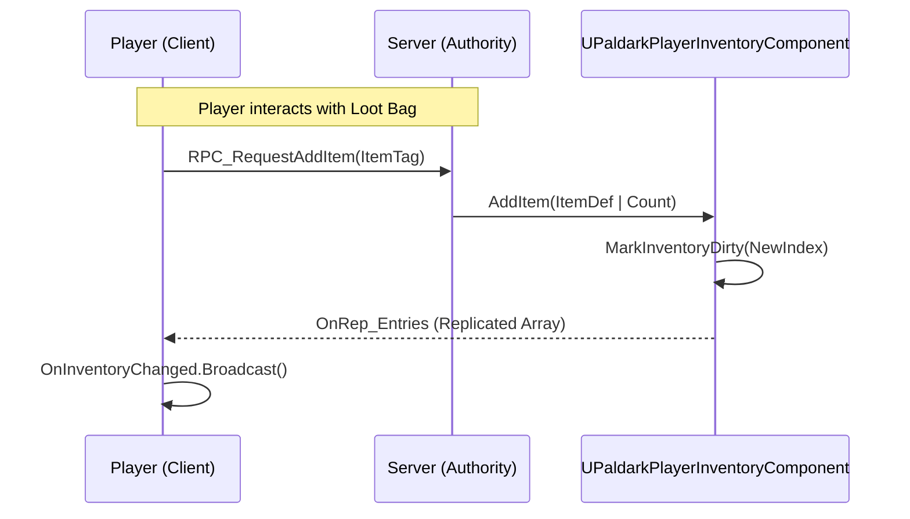
```mermaid
sequenceDiagram
    participant P as Player (Client)
    participant S as Server (Authority)
    participant C as UPaldarkPlayerInventoryComponent
    Note over P,S: Player interacts with Loot Bag
    P->>S: RPC_RequestAddItem(ItemTag)
    S->>C: AddItem(ItemDef | Count)
    C->>C: MarkInventoryDirty(NewIndex)
    C-->>P: OnRep_Entries (Replicated Array)
    P->>P: OnInventoryChanged.Broadcast()
```

Sources: [Source/PaldarkLab/Public/Player/Components/PaldarkPlayerInventoryComponent.h#113-118](https://github.com/thanhtinpro/devin-paldarklab/blob/864c77b4/Source/PaldarkLab/Public/Player/Components/PaldarkPlayerInventoryComponent.h#L113-L118)[Source/PaldarkLab/Private/Player/Components/PaldarkPlayerInventoryComponent.cpp#71-154](https://github.com/thanhtinpro/devin-paldarklab/blob/864c77b4/Source/PaldarkLab/Private/Player/Components/PaldarkPlayerInventoryComponent.cpp#L71-L154)

## FastArraySerializer Migration (L-32 Scaffold)

The component currently uses a standard `TArray` for replication, but it contains a scaffold for a future migration to `FFastArraySerializer` (W47).

- MigrationReplicationKey: A per-row monotonic ID stamped by the server when a new entry is created [Source/PaldarkLab/Public/Player/Components/PaldarkPlayerInventoryComponent.h#84-91](https://github.com/thanhtinpro/devin-paldarklab/blob/864c77b4/Source/PaldarkLab/Public/Player/Components/PaldarkPlayerInventoryComponent.h#L84-L91)
- GReplicationKeyCounter: A thread-safe atomic counter used to generate unique keys across the process [Source/PaldarkLab/Private/Player/Components/PaldarkPlayerInventoryComponent.cpp#23-26](https://github.com/thanhtinpro/devin-paldarklab/blob/864c77b4/Source/PaldarkLab/Private/Player/Components/PaldarkPlayerInventoryComponent.cpp#L23-L26)
- MarkInventoryDirty: Currently handles the `OnInventoryChanged` delegate and `MarkArrayDirty` logic, providing a single funnel for the eventual migration [Source/PaldarkLab/Private/Player/Components/PaldarkPlayerInventoryComponent.cpp#148-151](https://github.com/thanhtinpro/devin-paldarklab/blob/864c77b4/Source/PaldarkLab/Private/Player/Components/PaldarkPlayerInventoryComponent.cpp#L148-L151)

Sources: [Source/PaldarkLab/Public/Player/Components/PaldarkPlayerInventoryComponent.h#58-65](https://github.com/thanhtinpro/devin-paldarklab/blob/864c77b4/Source/PaldarkLab/Public/Player/Components/PaldarkPlayerInventoryComponent.h#L58-L65)[Source/PaldarkLab/Private/Player/Components/PaldarkPlayerInventoryComponent.cpp#16-26](https://github.com/thanhtinpro/devin-paldarklab/blob/864c77b4/Source/PaldarkLab/Private/Player/Components/PaldarkPlayerInventoryComponent.cpp#L16-L26)

---

# Squad-and-Coordination-System

# Squad and Coordination System
Relevant source files

- [Documents/Devlog/W22-23-Build.md](https://github.com/thanhtinpro/devin-paldarklab/blob/864c77b4/Documents/Devlog/W22-23-Build.md?plain=1)
- [Source/PaldarkLab/Private/Squad/PaldarkPingSubsystem.cpp](https://github.com/thanhtinpro/devin-paldarklab/blob/864c77b4/Source/PaldarkLab/Private/Squad/PaldarkPingSubsystem.cpp)
- [Source/PaldarkLab/Private/Squad/PaldarkSquadCommandComponent.cpp](https://github.com/thanhtinpro/devin-paldarklab/blob/864c77b4/Source/PaldarkLab/Private/Squad/PaldarkSquadCommandComponent.cpp)
- [Source/PaldarkLab/Private/Squad/PaldarkSquadMembershipComponent.cpp](https://github.com/thanhtinpro/devin-paldarklab/blob/864c77b4/Source/PaldarkLab/Private/Squad/PaldarkSquadMembershipComponent.cpp)
- [Source/PaldarkLab/Private/Squad/PaldarkSquadSubsystem.cpp](https://github.com/thanhtinpro/devin-paldarklab/blob/864c77b4/Source/PaldarkLab/Private/Squad/PaldarkSquadSubsystem.cpp)
- [Source/PaldarkLab/Public/Pal/Activities/PaldarkActivity_FollowSquadCommand.h](https://github.com/thanhtinpro/devin-paldarklab/blob/864c77b4/Source/PaldarkLab/Public/Pal/Activities/PaldarkActivity_FollowSquadCommand.h)
- [Source/PaldarkLab/Public/Squad/PaldarkPingSubsystem.h](https://github.com/thanhtinpro/devin-paldarklab/blob/864c77b4/Source/PaldarkLab/Public/Squad/PaldarkPingSubsystem.h)
- [Source/PaldarkLab/Public/Squad/PaldarkSquadMembershipComponent.h](https://github.com/thanhtinpro/devin-paldarklab/blob/864c77b4/Source/PaldarkLab/Public/Squad/PaldarkSquadMembershipComponent.h)
- [Source/PaldarkLab/Public/Squad/PaldarkSquadSubsystem.h](https://github.com/thanhtinpro/devin-paldarklab/blob/864c77b4/Source/PaldarkLab/Public/Squad/PaldarkSquadSubsystem.h)

The Squad and Coordination System provides the social and tactical layer for 4-player cooperative play. It manages squad membership, enables tactical communication via a ping system, and allows players to issue direct commands to their Pal companions. This system bridges player intent to AI behavior through a server-authoritative broadcast architecture.

## System Architecture

The coordination layer is divided into two primary subsystems that manage different aspects of team interaction. Both subsystems are host-only (`NM_DedicatedServer`, `NM_ListenServer`, or `NM_Standalone`) to ensure authoritative state management [Source/PaldarkLab/Private/Squad/PaldarkSquadSubsystem.cpp#30-31](https://github.com/thanhtinpro/devin-paldarklab/blob/864c77b4/Source/PaldarkLab/Private/Squad/PaldarkSquadSubsystem.cpp#L30-L31)[Source/PaldarkLab/Private/Squad/PaldarkPingSubsystem.cpp#31-32](https://github.com/thanhtinpro/devin-paldarklab/blob/864c77b4/Source/PaldarkLab/Private/Squad/PaldarkPingSubsystem.cpp#L31-L32)

### Coordination Flow

The following diagram illustrates how a player's tactical request (Ping or Command) flows from the Controller through the Subsystems to affect the world and Pal AI.

Tactical Coordination Flow

[Flowchart Diagram]

Sources: [Source/PaldarkLab/Public/Squad/PaldarkPingSubsystem.h#4-8](https://github.com/thanhtinpro/devin-paldarklab/blob/864c77b4/Source/PaldarkLab/Public/Squad/PaldarkPingSubsystem.h#L4-L8)[Source/PaldarkLab/Public/Squad/PaldarkSquadSubsystem.h#56-60](https://github.com/thanhtinpro/devin-paldarklab/blob/864c77b4/Source/PaldarkLab/Public/Squad/PaldarkSquadSubsystem.h#L56-L60)[Source/PaldarkLab/Private/Squad/PaldarkSquadCommandComponent.cpp#63-64](https://github.com/thanhtinpro/devin-paldarklab/blob/864c77b4/Source/PaldarkLab/Private/Squad/PaldarkSquadCommandComponent.cpp#L63-L64)

## Squad Management and Commands

The squad system groups up to 4 players into a tactical unit identified by a `SquadTag` (defaulting to `Paldark.Squad.Default`) [Source/PaldarkLab/Private/Squad/PaldarkSquadMembershipComponent.cpp#16](https://github.com/thanhtinpro/devin-paldarklab/blob/864c77b4/Source/PaldarkLab/Private/Squad/PaldarkSquadMembershipComponent.cpp#L16-L16)

### Squad Subsystem (`UPaldarkSquadSubsystem`)

This subsystem maintains a `SquadRegistry` which is a map of `SquadTag` to a roster of `APaldarkCharacter` weak pointers [Source/PaldarkLab/Public/Squad/PaldarkSquadSubsystem.h#131](https://github.com/thanhtinpro/devin-paldarklab/blob/864c77b4/Source/PaldarkLab/Public/Squad/PaldarkSquadSubsystem.h#L131-L131) It serves as the central hub for:

- Registration: Managed by `UPaldarkSquadMembershipComponent` on `BeginPlay`[Source/PaldarkLab/Private/Squad/PaldarkSquadMembershipComponent.cpp#40](https://github.com/thanhtinpro/devin-paldarklab/blob/864c77b4/Source/PaldarkLab/Private/Squad/PaldarkSquadMembershipComponent.cpp#L40-L40)
- Command Broadcasting: The `BroadcastSquadCommand` function fires the `OnSquadCommandIssued` delegate, which Pal AI activities listen to [Source/PaldarkLab/Public/Squad/PaldarkSquadSubsystem.h#92-95](https://github.com/thanhtinpro/devin-paldarklab/blob/864c77b4/Source/PaldarkLab/Public/Squad/PaldarkSquadSubsystem.h#L92-L95)
- Standing Commands: It caches the most recent command per squad (`StandingCommandPerSquad`) so that Pals spawned mid-match can immediately adopt the current squad formation [Source/PaldarkLab/Public/Squad/PaldarkSquadSubsystem.h#136-137](https://github.com/thanhtinpro/devin-paldarklab/blob/864c77b4/Source/PaldarkLab/Public/Squad/PaldarkSquadSubsystem.h#L136-L137)

### Pal Command Integration

Pal companions utilize the `UPaldarkActivity_FollowSquadCommand` (Priority 22) to react to player orders [Documents/Devlog/W22-23-Build.md#31-33](https://github.com/thanhtinpro/devin-paldarklab/blob/864c77b4/Documents/Devlog/W22-23-Build.md?plain=1#L31-L33) This activity sits between standard `Follow` (P20) and `Investigate` (P30), ensuring that tactical commands can override leashing but won't interrupt active investigation of a ping unless the command is of higher importance [Source/PaldarkLab/Public/Pal/Activities/PaldarkActivity_FollowSquadCommand.h#13-18](https://github.com/thanhtinpro/devin-paldarklab/blob/864c77b4/Source/PaldarkLab/Public/Pal/Activities/PaldarkActivity_FollowSquadCommand.h#L13-L18)

| Command Tag | Behavior |
| --- | --- |
| `Paldark.Squad.Command.Follow` | Re-leash on the issuer at full speed [Source/PaldarkLab/Public/Pal/Activities/PaldarkActivity_FollowSquadCommand.h#22](https://github.com/thanhtinpro/devin-paldarklab/blob/864c77b4/Source/PaldarkLab/Public/Pal/Activities/PaldarkActivity_FollowSquadCommand.h#L22-L22) |
| `Paldark.Squad.Command.Stay` | Hold current position and clear movement input [Source/PaldarkLab/Public/Pal/Activities/PaldarkActivity_FollowSquadCommand.h#23](https://github.com/thanhtinpro/devin-paldarklab/blob/864c77b4/Source/PaldarkLab/Public/Pal/Activities/PaldarkActivity_FollowSquadCommand.h#L23-L23) |
| `Paldark.Squad.Command.Attack` | Move toward the `OptionalLocation` (last enemy ping) [Source/PaldarkLab/Public/Pal/Activities/PaldarkActivity_FollowSquadCommand.h#25](https://github.com/thanhtinpro/devin-paldarklab/blob/864c77b4/Source/PaldarkLab/Public/Pal/Activities/PaldarkActivity_FollowSquadCommand.h#L25-L25) |

For details, see [Squad Subsystem and Commands](#8.1).

## Ping System

The ping system allows players to mark locations or enemies in the world. It is designed for low-frequency, high-impact tactical communication with built-in anti-spam measures.

### Ping Subsystem (`UPaldarkPingSubsystem`)

The subsystem handles the server-authoritative spawning of `APaldarkPingMarker` actors. It enforces a rate limit (`MinSecondsBetweenPings`, default 1.0s) per player to prevent network congestion [Source/PaldarkLab/Public/Squad/PaldarkPingSubsystem.h#68-70](https://github.com/thanhtinpro/devin-paldarklab/blob/864c77b4/Source/PaldarkLab/Public/Squad/PaldarkPingSubsystem.h#L68-L70)

### Ping Markers (`APaldarkPingMarker`)

Markers are replicated actors that exist for a limited duration (`DefaultPingLifetime`, default 3.0s) [Source/PaldarkLab/Public/Squad/PaldarkPingSubsystem.h#75-76](https://github.com/thanhtinpro/devin-paldarklab/blob/864c77b4/Source/PaldarkLab/Public/Squad/PaldarkPingSubsystem.h#L75-L76)

- Spot Pings: Static world-space markers at a specific coordinate [Documents/Devlog/W22-23-Build.md#112](https://github.com/thanhtinpro/devin-paldarklab/blob/864c77b4/Documents/Devlog/W22-23-Build.md?plain=1#L112-L112)
- Enemy Pings: Dynamic markers that attach to and follow a specific actor [Documents/Devlog/W22-23-Build.md#113](https://github.com/thanhtinpro/devin-paldarklab/blob/864c77b4/Documents/Devlog/W22-23-Build.md?plain=1#L113-L113)

### Code Entity Mapping: Ping Request

This diagram shows the relationship between player input and the code entities that process a ping.

Ping Execution Pipeline

[Class Diagram]

Sources: [Source/PaldarkLab/Public/Squad/PaldarkPingSubsystem.h#57-61](https://github.com/thanhtinpro/devin-paldarklab/blob/864c77b4/Source/PaldarkLab/Public/Squad/PaldarkPingSubsystem.h#L57-L61)[Documents/Devlog/W22-23-Build.md#36-38](https://github.com/thanhtinpro/devin-paldarklab/blob/864c77b4/Documents/Devlog/W22-23-Build.md?plain=1#L36-L38)

For details, see [Ping System](#8.2).

## Child Pages

- [Squad Subsystem and Commands](#8.1) — Detailed documentation on squad rosters, the command data asset, and the Pal command activity.
- [Ping System](#8.2) — Technical details on ping replication, anti-cheat line traces, and marker lifecycle management.

Sources:

- [Documents/Devlog/W22-23-Build.md#1-43](https://github.com/thanhtinpro/devin-paldarklab/blob/864c77b4/Documents/Devlog/W22-23-Build.md?plain=1#L1-L43)
- [Source/PaldarkLab/Public/Squad/PaldarkSquadSubsystem.h#1-141](https://github.com/thanhtinpro/devin-paldarklab/blob/864c77b4/Source/PaldarkLab/Public/Squad/PaldarkSquadSubsystem.h#L1-L141)
- [Source/PaldarkLab/Private/Squad/PaldarkSquadSubsystem.cpp#12-147](https://github.com/thanhtinpro/devin-paldarklab/blob/864c77b4/Source/PaldarkLab/Private/Squad/PaldarkSquadSubsystem.cpp#L12-L147)
- [Source/PaldarkLab/Public/Squad/PaldarkPingSubsystem.h#1-86](https://github.com/thanhtinpro/devin-paldarklab/blob/864c77b4/Source/PaldarkLab/Public/Squad/PaldarkPingSubsystem.h#L1-L86)
- [Source/PaldarkLab/Private/Squad/PaldarkPingSubsystem.cpp#11-115](https://github.com/thanhtinpro/devin-paldarklab/blob/864c77b4/Source/PaldarkLab/Private/Squad/PaldarkPingSubsystem.cpp#L11-L115)
- [Source/PaldarkLab/Public/Squad/PaldarkSquadMembershipComponent.h#1-68](https://github.com/thanhtinpro/devin-paldarklab/blob/864c77b4/Source/PaldarkLab/Public/Squad/PaldarkSquadMembershipComponent.h#L1-L68)
- [Source/PaldarkLab/Private/Squad/PaldarkSquadMembershipComponent.cpp#12-41](https://github.com/thanhtinpro/devin-paldarklab/blob/864c77b4/Source/PaldarkLab/Private/Squad/PaldarkSquadMembershipComponent.cpp#L12-L41)
- [Source/PaldarkLab/Public/Pal/Activities/PaldarkActivity_FollowSquadCommand.h#1-95](https://github.com/thanhtinpro/devin-paldarklab/blob/864c77b4/Source/PaldarkLab/Public/Pal/Activities/PaldarkActivity_FollowSquadCommand.h#L1-L95)

---

# Squad-Subsystem-and-Commands

# Squad Subsystem and Commands
Relevant source files

- [Documents/Devlog/W22-23-Build.md](https://github.com/thanhtinpro/devin-paldarklab/blob/864c77b4/Documents/Devlog/W22-23-Build.md?plain=1)
- [Source/PaldarkLab/Private/Squad/PaldarkPingSubsystem.cpp](https://github.com/thanhtinpro/devin-paldarklab/blob/864c77b4/Source/PaldarkLab/Private/Squad/PaldarkPingSubsystem.cpp)
- [Source/PaldarkLab/Private/Squad/PaldarkSquadCommandComponent.cpp](https://github.com/thanhtinpro/devin-paldarklab/blob/864c77b4/Source/PaldarkLab/Private/Squad/PaldarkSquadCommandComponent.cpp)
- [Source/PaldarkLab/Private/Squad/PaldarkSquadCommandSet.cpp](https://github.com/thanhtinpro/devin-paldarklab/blob/864c77b4/Source/PaldarkLab/Private/Squad/PaldarkSquadCommandSet.cpp)
- [Source/PaldarkLab/Private/Squad/PaldarkSquadMembershipComponent.cpp](https://github.com/thanhtinpro/devin-paldarklab/blob/864c77b4/Source/PaldarkLab/Private/Squad/PaldarkSquadMembershipComponent.cpp)
- [Source/PaldarkLab/Private/Squad/PaldarkSquadSubsystem.cpp](https://github.com/thanhtinpro/devin-paldarklab/blob/864c77b4/Source/PaldarkLab/Private/Squad/PaldarkSquadSubsystem.cpp)
- [Source/PaldarkLab/Public/Pal/Activities/PaldarkActivity_FollowSquadCommand.h](https://github.com/thanhtinpro/devin-paldarklab/blob/864c77b4/Source/PaldarkLab/Public/Pal/Activities/PaldarkActivity_FollowSquadCommand.h)
- [Source/PaldarkLab/Public/Squad/PaldarkPingSubsystem.h](https://github.com/thanhtinpro/devin-paldarklab/blob/864c77b4/Source/PaldarkLab/Public/Squad/PaldarkPingSubsystem.h)
- [Source/PaldarkLab/Public/Squad/PaldarkSquadCommandComponent.h](https://github.com/thanhtinpro/devin-paldarklab/blob/864c77b4/Source/PaldarkLab/Public/Squad/PaldarkSquadCommandComponent.h)
- [Source/PaldarkLab/Public/Squad/PaldarkSquadCommandSet.h](https://github.com/thanhtinpro/devin-paldarklab/blob/864c77b4/Source/PaldarkLab/Public/Squad/PaldarkSquadCommandSet.h)
- [Source/PaldarkLab/Public/Squad/PaldarkSquadMembershipComponent.h](https://github.com/thanhtinpro/devin-paldarklab/blob/864c77b4/Source/PaldarkLab/Public/Squad/PaldarkSquadMembershipComponent.h)
- [Source/PaldarkLab/Public/Squad/PaldarkSquadSubsystem.h](https://github.com/thanhtinpro/devin-paldarklab/blob/864c77b4/Source/PaldarkLab/Public/Squad/PaldarkSquadSubsystem.h)

The Squad Subsystem provides a server-authoritative coordination layer for 4-player teams and their Pal companions [Documents/Devlog/W22-23-Build.md#16-17](https://github.com/thanhtinpro/devin-paldarklab/blob/864c77b4/Documents/Devlog/W22-23-Build.md?plain=1#L16-L17) It enables players to issue tactical commands via a radial wheel (Attack, Follow, Stay, Regroup) and register into specific squads for coordinated AI behavior [Documents/Devlog/W22-23-Build.md#24-27](https://github.com/thanhtinpro/devin-paldarklab/blob/864c77b4/Documents/Devlog/W22-23-Build.md?plain=1#L24-L27)

## System Architecture

The system is built on a "World Subsystem + Actor Component" pattern. The `UPaldarkSquadSubsystem` acts as the central registry and broadcast hub, while components on the player character handle membership and command emission [Source/PaldarkLab/Public/Squad/PaldarkSquadSubsystem.h#3-10](https://github.com/thanhtinpro/devin-paldarklab/blob/864c77b4/Source/PaldarkLab/Public/Squad/PaldarkSquadSubsystem.h#L3-L10)

### Squad Subsystem and Commands Logic Flow

This diagram illustrates the data flow from a player's input to the Pal AI's reaction.

[Flowchart Diagram]

Sources: [Source/PaldarkLab/Public/Squad/PaldarkSquadSubsystem.h#50-60](https://github.com/thanhtinpro/devin-paldarklab/blob/864c77b4/Source/PaldarkLab/Public/Squad/PaldarkSquadSubsystem.h#L50-L60)[Source/PaldarkLab/Private/Squad/PaldarkSquadCommandComponent.cpp#49-64](https://github.com/thanhtinpro/devin-paldarklab/blob/864c77b4/Source/PaldarkLab/Private/Squad/PaldarkSquadCommandComponent.cpp#L49-L64)[Source/PaldarkLab/Public/Pal/Activities/PaldarkActivity_FollowSquadCommand.h#3-7](https://github.com/thanhtinpro/devin-paldarklab/blob/864c77b4/Source/PaldarkLab/Public/Pal/Activities/PaldarkActivity_FollowSquadCommand.h#L3-L7)

## Core Components

### UPaldarkSquadSubsystem

A `UWorldSubsystem` that exists only on the host (Server/Standalone) [Source/PaldarkLab/Private/Squad/PaldarkSquadSubsystem.cpp#29-31](https://github.com/thanhtinpro/devin-paldarklab/blob/864c77b4/Source/PaldarkLab/Private/Squad/PaldarkSquadSubsystem.cpp#L29-L31) It maintains a `SquadRegistry` mapping `FGameplayTag` squad IDs to `FPaldarkSquadRoster` structures containing weak pointers to player characters [Source/PaldarkLab/Public/Squad/PaldarkSquadSubsystem.h#39-48](https://github.com/thanhtinpro/devin-paldarklab/blob/864c77b4/Source/PaldarkLab/Public/Squad/PaldarkSquadSubsystem.h#L39-L48)

Key Responsibilities:

- Registration: Manages player entry/exit via `RegisterPlayerToSquad` and `UnregisterPlayerFromSquad`[Source/PaldarkLab/Public/Squad/PaldarkSquadSubsystem.h#81-85](https://github.com/thanhtinpro/devin-paldarklab/blob/864c77b4/Source/PaldarkLab/Public/Squad/PaldarkSquadSubsystem.h#L81-L85)
- Command Broadcasting: Fires the `OnSquadCommandIssued` multicast delegate when a player issues a command [Source/PaldarkLab/Public/Squad/PaldarkSquadSubsystem.h#92-95](https://github.com/thanhtinpro/devin-paldarklab/blob/864c77b4/Source/PaldarkLab/Public/Squad/PaldarkSquadSubsystem.h#L92-L95)
- Standing Commands: Maintains `StandingCommandPerSquad` and `StandingCommandLocationPerSquad` so Pals spawning mid-match can immediately adopt the current squad posture [Source/PaldarkLab/Public/Squad/PaldarkSquadSubsystem.h#130-141](https://github.com/thanhtinpro/devin-paldarklab/blob/864c77b4/Source/PaldarkLab/Public/Squad/PaldarkSquadSubsystem.h#L130-L141)

Sources: [Source/PaldarkLab/Public/Squad/PaldarkSquadSubsystem.h#63-141](https://github.com/thanhtinpro/devin-paldarklab/blob/864c77b4/Source/PaldarkLab/Public/Squad/PaldarkSquadSubsystem.h#L63-L141)[Source/PaldarkLab/Private/Squad/PaldarkSquadSubsystem.cpp#114-147](https://github.com/thanhtinpro/devin-paldarklab/blob/864c77b4/Source/PaldarkLab/Private/Squad/PaldarkSquadSubsystem.cpp#L114-L147)

### UPaldarkSquadMembershipComponent

Attached to `APaldarkCharacter`, this component handles automatic lifecycle management with the subsystem [Source/PaldarkLab/Public/Squad/PaldarkSquadMembershipComponent.h#3-5](https://github.com/thanhtinpro/devin-paldarklab/blob/864c77b4/Source/PaldarkLab/Public/Squad/PaldarkSquadMembershipComponent.h#L3-L5)

- Auto-Registration: On `BeginPlay`, it registers the owner to the `SquadTag` (defaults to `Paldark.Squad.Default`) [Source/PaldarkLab/Private/Squad/PaldarkSquadMembershipComponent.cpp#19-41](https://github.com/thanhtinpro/devin-paldarklab/blob/864c77b4/Source/PaldarkLab/Private/Squad/PaldarkSquadMembershipComponent.cpp#L19-L41)
- Cleanup: On `EndPlay`, it removes the player from the registry to prevent stale weak references [Source/PaldarkLab/Private/Squad/PaldarkSquadMembershipComponent.cpp#43-58](https://github.com/thanhtinpro/devin-paldarklab/blob/864c77b4/Source/PaldarkLab/Private/Squad/PaldarkSquadMembershipComponent.cpp#L43-L58)

Sources: [Source/PaldarkLab/Public/Squad/PaldarkSquadMembershipComponent.h#34-68](https://github.com/thanhtinpro/devin-paldarklab/blob/864c77b4/Source/PaldarkLab/Public/Squad/PaldarkSquadMembershipComponent.h#L34-L68)[Source/PaldarkLab/Private/Squad/PaldarkSquadMembershipComponent.cpp#12-17](https://github.com/thanhtinpro/devin-paldarklab/blob/864c77b4/Source/PaldarkLab/Private/Squad/PaldarkSquadMembershipComponent.cpp#L12-L17)

### UPaldarkSquadCommandComponent

The interface for players to interact with their squad [Source/PaldarkLab/Public/Squad/PaldarkSquadCommandComponent.h#3-12](https://github.com/thanhtinpro/devin-paldarklab/blob/864c77b4/Source/PaldarkLab/Public/Squad/PaldarkSquadCommandComponent.h#L3-L12)

- `IssueCommand`: Client-side entry point that validates the `FGameplayTag` against the authored `UPaldarkSquadCommandSet`[Source/PaldarkLab/Private/Squad/PaldarkSquadCommandComponent.cpp#18-47](https://github.com/thanhtinpro/devin-paldarklab/blob/864c77b4/Source/PaldarkLab/Private/Squad/PaldarkSquadCommandComponent.cpp#L18-L47)
- `Server_IssueCommand`: Reliable RPC that re-validates the request on the server before calling the subsystem's broadcast method [Source/PaldarkLab/Private/Squad/PaldarkSquadCommandComponent.cpp#49-64](https://github.com/thanhtinpro/devin-paldarklab/blob/864c77b4/Source/PaldarkLab/Private/Squad/PaldarkSquadCommandComponent.cpp#L49-L64)

Sources: [Source/PaldarkLab/Public/Squad/PaldarkSquadCommandComponent.h#34-77](https://github.com/thanhtinpro/devin-paldarklab/blob/864c77b4/Source/PaldarkLab/Public/Squad/PaldarkSquadCommandComponent.h#L34-L77)[Source/PaldarkLab/Private/Squad/PaldarkSquadCommandComponent.cpp#49-64](https://github.com/thanhtinpro/devin-paldarklab/blob/864c77b4/Source/PaldarkLab/Private/Squad/PaldarkSquadCommandComponent.cpp#L49-L64)

## Data Assets and Tags

### UPaldarkSquadCommandSet

A `UPrimaryDataAsset` used by designers to define the available commands for the radial wheel [Source/PaldarkLab/Public/Squad/PaldarkSquadCommandSet.h#22-53](https://github.com/thanhtinpro/devin-paldarklab/blob/864c77b4/Source/PaldarkLab/Public/Squad/PaldarkSquadCommandSet.h#L22-L53) It contains an array of `FPaldarkSquadCommandRow`[Source/PaldarkLab/Public/Squad/PaldarkSquadCommandSet.h#62-63](https://github.com/thanhtinpro/devin-paldarklab/blob/864c77b4/Source/PaldarkLab/Public/Squad/PaldarkSquadCommandSet.h#L62-L63)

| Field | Type | Description |
| --- | --- | --- |
| `CommandTag` | `FGameplayTag` | The unique identifier (e.g., `Paldark.Squad.Command.Attack`) [Source/PaldarkLab/Public/Squad/PaldarkSquadCommandSet.h#38](https://github.com/thanhtinpro/devin-paldarklab/blob/864c77b4/Source/PaldarkLab/Public/Squad/PaldarkSquadCommandSet.h#L38-L38) |
| `DisplayName` | `FText` | The localized string shown in the UI [Source/PaldarkLab/Public/Squad/PaldarkSquadCommandSet.h#43](https://github.com/thanhtinpro/devin-paldarklab/blob/864c77b4/Source/PaldarkLab/Public/Squad/PaldarkSquadCommandSet.h#L43-L43) |
| `Icon` | `TSoftObjectPtr<UTexture2D>` | The visual representation for the radial wheel [Source/PaldarkLab/Public/Squad/PaldarkSquadCommandSet.h#48](https://github.com/thanhtinpro/devin-paldarklab/blob/864c77b4/Source/PaldarkLab/Public/Squad/PaldarkSquadCommandSet.h#L48-L48) |

Sources: [Source/PaldarkLab/Public/Squad/PaldarkSquadCommandSet.h#30-72](https://github.com/thanhtinpro/devin-paldarklab/blob/864c77b4/Source/PaldarkLab/Public/Squad/PaldarkSquadCommandSet.h#L30-L72)

### Native Gameplay Tags

Commands are identified by native tags defined in `PaldarkLabCore`[Documents/Devlog/W22-23-Build.md#121-122](https://github.com/thanhtinpro/devin-paldarklab/blob/864c77b4/Documents/Devlog/W22-23-Build.md?plain=1#L121-L122)

| Tag | Purpose |
| --- | --- |
| `Paldark.Squad.Command.Attack` | Move to and engage at the last enemy ping location [Documents/Devlog/W22-23-Build.md#108](https://github.com/thanhtinpro/devin-paldarklab/blob/864c77b4/Documents/Devlog/W22-23-Build.md?plain=1#L108-L108) |
| `Paldark.Squad.Command.Follow` | Re-leash on the issuing player [Documents/Devlog/W22-23-Build.md#109](https://github.com/thanhtinpro/devin-paldarklab/blob/864c77b4/Documents/Devlog/W22-23-Build.md?plain=1#L109-L109) |
| `Paldark.Squad.Command.Stay` | Hold current position and clear movement [Documents/Devlog/W22-23-Build.md#110](https://github.com/thanhtinpro/devin-paldarklab/blob/864c77b4/Documents/Devlog/W22-23-Build.md?plain=1#L110-L110) |
| `Paldark.Squad.Command.Regroup` | All squad Pals move to the issuer's location [Documents/Devlog/W22-23-Build.md#111](https://github.com/thanhtinpro/devin-paldarklab/blob/864c77b4/Documents/Devlog/W22-23-Build.md?plain=1#L111-L111) |

Sources: [Documents/Devlog/W22-23-Build.md#105-120](https://github.com/thanhtinpro/devin-paldarklab/blob/864c77b4/Documents/Devlog/W22-23-Build.md?plain=1#L105-L120)

## Pal AI Integration

Friendly Pals react to squad commands through the `UPaldarkActivity_FollowSquadCommand` activity (Priority 22) [Source/PaldarkLab/Public/Pal/Activities/PaldarkActivity_FollowSquadCommand.h#1-10](https://github.com/thanhtinpro/devin-paldarklab/blob/864c77b4/Source/PaldarkLab/Public/Pal/Activities/PaldarkActivity_FollowSquadCommand.h#L1-L10)

### Activity Hierarchy and Entity Mapping

This diagram maps the Squad System's C++ classes to their functional roles in the Pal AI FSM.

Sources: [Source/PaldarkLab/Public/Pal/Activities/PaldarkActivity_FollowSquadCommand.h#9-26](https://github.com/thanhtinpro/devin-paldarklab/blob/864c77b4/Source/PaldarkLab/Public/Pal/Activities/PaldarkActivity_FollowSquadCommand.h#L9-L26)[Source/PaldarkLab/Private/Pal/Activities/PaldarkActivity_FollowSquadCommand.cpp#65-100](https://github.com/thanhtinpro/devin-paldarklab/blob/864c77b4/Source/PaldarkLab/Private/Pal/Activities/PaldarkActivity_FollowSquadCommand.cpp#L65-L100)

### Initialization and Execution

1. Binding: In `InitActivity`, the Pal binds `HandleSquadCommandIssued` to the subsystem's delegate [Source/PaldarkLab/Public/Pal/Activities/PaldarkActivity_FollowSquadCommand.h#65-68](https://github.com/thanhtinpro/devin-paldarklab/blob/864c77b4/Source/PaldarkLab/Public/Pal/Activities/PaldarkActivity_FollowSquadCommand.h#L65-L68)
2. Standing Command: Freshly spawned Pals query `GetStandingCommand` during initialization to synchronize with the squad's current state [Source/PaldarkLab/Public/Squad/PaldarkSquadSubsystem.h#120-124](https://github.com/thanhtinpro/devin-paldarklab/blob/864c77b4/Source/PaldarkLab/Public/Squad/PaldarkSquadSubsystem.h#L120-L124)
3. Gating: `CanRun` checks if the command issuer is the Pal's owner or a squadmate [Source/PaldarkLab/Public/Pal/Activities/PaldarkActivity_FollowSquadCommand.h#3-7](https://github.com/thanhtinpro/devin-paldarklab/blob/864c77b4/Source/PaldarkLab/Public/Pal/Activities/PaldarkActivity_FollowSquadCommand.h#L3-L7)
4. Priority: At P22, it overrides basic following (P20) but is overridden by Investigate (P30) and Combat (P40) [Source/PaldarkLab/Public/Pal/Activities/PaldarkActivity_FollowSquadCommand.h#9-11](https://github.com/thanhtinpro/devin-paldarklab/blob/864c77b4/Source/PaldarkLab/Public/Pal/Activities/PaldarkActivity_FollowSquadCommand.h#L9-L11)

Sources: [Source/PaldarkLab/Public/Pal/Activities/PaldarkActivity_FollowSquadCommand.h#50-95](https://github.com/thanhtinpro/devin-paldarklab/blob/864c77b4/Source/PaldarkLab/Public/Pal/Activities/PaldarkActivity_FollowSquadCommand.h#L50-L95)[Source/PaldarkLab/Private/Pal/Activities/PaldarkActivity_FollowSquadCommand.cpp#1-60](https://github.com/thanhtinpro/devin-paldarklab/blob/864c77b4/Source/PaldarkLab/Private/Pal/Activities/PaldarkActivity_FollowSquadCommand.cpp#L1-L60)

---

# Ping-System

# Ping System
Relevant source files

- [Documents/Devlog/W22-23-Build.md](https://github.com/thanhtinpro/devin-paldarklab/blob/864c77b4/Documents/Devlog/W22-23-Build.md?plain=1)
- [Source/PaldarkLab/Private/Squad/PaldarkPingMarker.cpp](https://github.com/thanhtinpro/devin-paldarklab/blob/864c77b4/Source/PaldarkLab/Private/Squad/PaldarkPingMarker.cpp)
- [Source/PaldarkLab/Private/Squad/PaldarkPingSubsystem.cpp](https://github.com/thanhtinpro/devin-paldarklab/blob/864c77b4/Source/PaldarkLab/Private/Squad/PaldarkPingSubsystem.cpp)
- [Source/PaldarkLab/Public/Pal/Activities/PaldarkActivity_FollowSquadCommand.h](https://github.com/thanhtinpro/devin-paldarklab/blob/864c77b4/Source/PaldarkLab/Public/Pal/Activities/PaldarkActivity_FollowSquadCommand.h)
- [Source/PaldarkLab/Public/Squad/PaldarkPingMarker.h](https://github.com/thanhtinpro/devin-paldarklab/blob/864c77b4/Source/PaldarkLab/Public/Squad/PaldarkPingMarker.h)
- [Source/PaldarkLab/Public/Squad/PaldarkPingSubsystem.h](https://github.com/thanhtinpro/devin-paldarklab/blob/864c77b4/Source/PaldarkLab/Public/Squad/PaldarkPingSubsystem.h)

The Ping System provides a 4-player squad coordination layer through server-authoritative world-space markers and actor tracking [Documents/Devlog/W22-23-Build.md#1-27](https://github.com/thanhtinpro/devin-paldarklab/blob/864c77b4/Documents/Devlog/W22-23-Build.md?plain=1#L1-L27) It enables players to communicate tactical information (locations, enemies, loot) without voice chat, while providing a foundation for Pal AI to react to player intents [Source/PaldarkLab/Public/Pal/Activities/PaldarkActivity_FollowSquadCommand.h#1-11](https://github.com/thanhtinpro/devin-paldarklab/blob/864c77b4/Source/PaldarkLab/Public/Pal/Activities/PaldarkActivity_FollowSquadCommand.h#L1-L11)

## System Architecture

The system follows a hub-and-spoke topology where the `UPaldarkPingSubsystem` acts as the central authority on the server [Source/PaldarkLab/Public/Squad/PaldarkPingSubsystem.h#3-8](https://github.com/thanhtinpro/devin-paldarklab/blob/864c77b4/Source/PaldarkLab/Public/Squad/PaldarkPingSubsystem.h#L3-L8)

### Core Components

| Class | Responsibility |
| --- | --- |
| `UPaldarkPingSubsystem` | Manages ping lifecycle, rate limiting, and spawning logic [Source/PaldarkLab/Public/Squad/PaldarkPingSubsystem.h#36-38](https://github.com/thanhtinpro/devin-paldarklab/blob/864c77b4/Source/PaldarkLab/Public/Squad/PaldarkPingSubsystem.h#L36-L38) |
| `APaldarkPingMarker` | Replicated actor representing the ping in the world; handles tracking for moving targets [Source/PaldarkLab/Public/Squad/PaldarkPingMarker.h#31-32](https://github.com/thanhtinpro/devin-paldarklab/blob/864c77b4/Source/PaldarkLab/Public/Squad/PaldarkPingMarker.h#L31-L32) |
| `APaldarkPlayerController` | Entry point for client requests via `Server_RequestPing` and `Server_RequestMarkUnderCrosshair`[Documents/Devlog/W22-23-Build.md#36-38](https://github.com/thanhtinpro/devin-paldarklab/blob/864c77b4/Documents/Devlog/W22-23-Build.md?plain=1#L36-L38) |

### Ping Flow: Client to World

The following diagram illustrates the data flow from a player input to a replicated world marker.

Ping Request Sequence

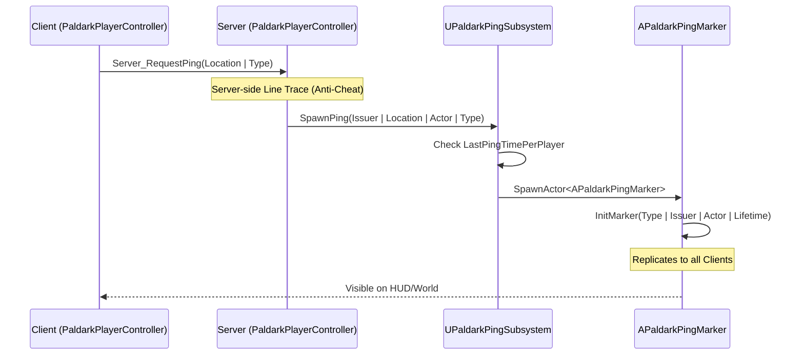
```mermaid
sequenceDiagram
    participant C as Client (PaldarkPlayerController)
    participant S as Server (PaldarkPlayerController)
    participant Sub as UPaldarkPingSubsystem
    participant M as APaldarkPingMarker
    C->>S: Server_RequestPing(Location | Type)
    Note over S: Server-side Line Trace (Anti-Cheat)
    S->>Sub: SpawnPing(Issuer | Location | Actor | Type)
    Sub->>Sub: Check LastPingTimePerPlayer
    Sub->>M: SpawnActor<APaldarkPingMarker>
    M->>M: InitMarker(Type | Issuer | Actor | Lifetime)
    Note over M: Replicates to all Clients
    M-->>C: Visible on HUD/World
```

Sources:[Source/PaldarkLab/Public/Squad/PaldarkPingSubsystem.h#47-61](https://github.com/thanhtinpro/devin-paldarklab/blob/864c77b4/Source/PaldarkLab/Public/Squad/PaldarkPingSubsystem.h#L47-L61)[Source/PaldarkLab/Private/Squad/PaldarkPingSubsystem.cpp#47-115](https://github.com/thanhtinpro/devin-paldarklab/blob/864c77b4/Source/PaldarkLab/Private/Squad/PaldarkPingSubsystem.cpp#L47-L115)[Documents/Devlog/W22-23-Build.md#36-38](https://github.com/thanhtinpro/devin-paldarklab/blob/864c77b4/Documents/Devlog/W22-23-Build.md?plain=1#L36-L38)

---

## UPaldarkPingSubsystem

The `UPaldarkPingSubsystem` is a `UWorldSubsystem` that exists only on the server (and standalone/listen server hosts) [Source/PaldarkLab/Private/Squad/PaldarkPingSubsystem.cpp#31-32](https://github.com/thanhtinpro/devin-paldarklab/blob/864c77b4/Source/PaldarkLab/Private/Squad/PaldarkPingSubsystem.cpp#L31-L32) It prevents network spam and manages the `APaldarkPingMarker` class configuration.

### Rate Limiting

To prevent client-side RPC spam from impacting server performance, the subsystem tracks the wall-clock time of the last successful ping per player character using a `TMap<TWeakObjectPtr<APaldarkCharacter>, float> LastPingTimePerPlayer`[Source/PaldarkLab/Public/Squad/PaldarkPingSubsystem.h#84-85](https://github.com/thanhtinpro/devin-paldarklab/blob/864c77b4/Source/PaldarkLab/Public/Squad/PaldarkPingSubsystem.h#L84-L85)

- Default Limit: 1.0 second between pings [Source/PaldarkLab/Public/Squad/PaldarkPingSubsystem.h#70](https://github.com/thanhtinpro/devin-paldarklab/blob/864c77b4/Source/PaldarkLab/Public/Squad/PaldarkPingSubsystem.h#L70-L70)
- Enforcement: If `NowSec - LastTime < MinSecondsBetweenPings`, the request is discarded with a verbose log [Source/PaldarkLab/Private/Squad/PaldarkPingSubsystem.cpp#77-83](https://github.com/thanhtinpro/devin-paldarklab/blob/864c77b4/Source/PaldarkLab/Private/Squad/PaldarkPingSubsystem.cpp#L77-L83)

### Key Functions

- `SpawnPing`: The primary entry point. It calculates the spawn location (either a raw vector or the location of a `MarkedActor`), spawns the marker actor, and initializes its replicated state [Source/PaldarkLab/Private/Squad/PaldarkPingSubsystem.cpp#47-115](https://github.com/thanhtinpro/devin-paldarklab/blob/864c77b4/Source/PaldarkLab/Private/Squad/PaldarkPingSubsystem.cpp#L47-L115)
- `ShouldCreateSubsystem`: Ensures the subsystem only initializes on authoritative hosts, preventing overhead on dedicated clients [Source/PaldarkLab/Private/Squad/PaldarkPingSubsystem.cpp#16-32](https://github.com/thanhtinpro/devin-paldarklab/blob/864c77b4/Source/PaldarkLab/Private/Squad/PaldarkPingSubsystem.cpp#L16-L32)

Sources:[Source/PaldarkLab/Public/Squad/PaldarkPingSubsystem.h#36-86](https://github.com/thanhtinpro/devin-paldarklab/blob/864c77b4/Source/PaldarkLab/Public/Squad/PaldarkPingSubsystem.h#L36-L86)[Source/PaldarkLab/Private/Squad/PaldarkPingSubsystem.cpp#11-134](https://github.com/thanhtinpro/devin-paldarklab/blob/864c77b4/Source/PaldarkLab/Private/Squad/PaldarkPingSubsystem.cpp#L11-L134)

---

## APaldarkPingMarker

`APaldarkPingMarker` is a minimal replicated actor used to represent a ping in world space. It is designed for "late-join" correctness; since it is a replicated actor rather than a transient multicast RPC, players joining mid-match can still see active pings [Source/PaldarkLab/Public/Squad/PaldarkPingMarker.h#15-19](https://github.com/thanhtinpro/devin-paldarklab/blob/864c77b4/Source/PaldarkLab/Public/Squad/PaldarkPingMarker.h#L15-L19)

### Replication and Lifetime

The actor replicates its `PingType`, `OwningPlayer`, `MarkedActor`, and `ExpirationServerTime`[Source/PaldarkLab/Private/Squad/PaldarkPingMarker.cpp#28-35](https://github.com/thanhtinpro/devin-paldarklab/blob/864c77b4/Source/PaldarkLab/Private/Squad/PaldarkPingMarker.cpp#L28-L35)

- Self-Destruction: The server checks `NowSec >= ExpirationServerTime` inside its `Tick` (interval 0.1s) and calls `Destroy()` when the lifetime expires [Source/PaldarkLab/Private/Squad/PaldarkPingMarker.cpp#83-87](https://github.com/thanhtinpro/devin-paldarklab/blob/864c77b4/Source/PaldarkLab/Private/Squad/PaldarkPingMarker.cpp#L83-L87)
- Target Tracking: If `MarkedActor` is valid (e.g., an Enemy ping), the marker updates its location to match the actor every tick [Source/PaldarkLab/Private/Squad/PaldarkPingMarker.cpp#89-92](https://github.com/thanhtinpro/devin-paldarklab/blob/864c77b4/Source/PaldarkLab/Private/Squad/PaldarkPingMarker.cpp#L89-L92)

### Ping Types

Pings are categorized by `FGameplayTag` to drive HUD icon selection:

- `Paldark.Ping.Type.Spot`: Generic location marker [Documents/Devlog/W22-23-Build.md#112](https://github.com/thanhtinpro/devin-paldarklab/blob/864c77b4/Documents/Devlog/W22-23-Build.md?plain=1#L112-L112)
- `Paldark.Ping.Type.Enemy`: Tracking marker for hostile actors [Documents/Devlog/W22-23-Build.md#113](https://github.com/thanhtinpro/devin-paldarklab/blob/864c77b4/Documents/Devlog/W22-23-Build.md?plain=1#L113-L113)
- `Paldark.Ping.Type.Loot` / `Danger`: Reserved for specialized context pings [Documents/Devlog/W22-23-Build.md#114-115](https://github.com/thanhtinpro/devin-paldarklab/blob/864c77b4/Documents/Devlog/W22-23-Build.md?plain=1#L114-L115)

Sources:[Source/PaldarkLab/Public/Squad/PaldarkPingMarker.h#1-85](https://github.com/thanhtinpro/devin-paldarklab/blob/864c77b4/Source/PaldarkLab/Public/Squad/PaldarkPingMarker.h#L1-L85)[Source/PaldarkLab/Private/Squad/PaldarkPingMarker.cpp#11-103](https://github.com/thanhtinpro/devin-paldarklab/blob/864c77b4/Source/PaldarkLab/Private/Squad/PaldarkPingMarker.cpp#L11-L103)

---

## Server Authority and Anti-Cheat

The system enforces server authority through two specific RPCs in the `APaldarkPlayerController`:

1. `Server_RequestPing`: Used for basic ground pings. The server validates the location before passing it to the subsystem [Documents/Devlog/W22-23-Build.md#36-38](https://github.com/thanhtinpro/devin-paldarklab/blob/864c77b4/Documents/Devlog/W22-23-Build.md?plain=1#L36-L38)
2. `Server_RequestMarkUnderCrosshair`: Used for marking actors. The server performs its own line trace from the player's camera to verify that the target actor is actually under the crosshair, preventing clients from marking enemies through walls or at impossible distances [Documents/Devlog/W22-23-Build.md#36-38](https://github.com/thanhtinpro/devin-paldarklab/blob/864c77b4/Documents/Devlog/W22-23-Build.md?plain=1#L36-L38)

Sources:[Documents/Devlog/W22-23-Build.md#36-38](https://github.com/thanhtinpro/devin-paldarklab/blob/864c77b4/Documents/Devlog/W22-23-Build.md?plain=1#L36-L38)[Source/PaldarkLab/Public/Squad/PaldarkPingSubsystem.h#47-51](https://github.com/thanhtinpro/devin-paldarklab/blob/864c77b4/Source/PaldarkLab/Public/Squad/PaldarkPingSubsystem.h#L47-L51)

---

## System Integration

The Ping system interacts with the Pal AI through the `UPaldarkActivity_FollowSquadCommand` activity.

Entity Space Mapping

[Flowchart Diagram]

Sources:[Source/PaldarkLab/Public/Pal/Activities/PaldarkActivity_FollowSquadCommand.h#1-11](https://github.com/thanhtinpro/devin-paldarklab/blob/864c77b4/Source/PaldarkLab/Public/Pal/Activities/PaldarkActivity_FollowSquadCommand.h#L1-L11)[Source/PaldarkLab/Public/Squad/PaldarkPingSubsystem.h#3-8](https://github.com/thanhtinpro/devin-paldarklab/blob/864c77b4/Source/PaldarkLab/Public/Squad/PaldarkPingSubsystem.h#L3-L8)[Documents/Devlog/W22-23-Build.md#16-43](https://github.com/thanhtinpro/devin-paldarklab/blob/864c77b4/Documents/Devlog/W22-23-Build.md?plain=1#L16-L43)

### Pal Interaction

Pals with the `UPaldarkActivity_FollowSquadCommand` (Priority 22) listen to `OnSquadCommandIssued` from the `UPaldarkSquadSubsystem`[Source/PaldarkLab/Public/Pal/Activities/PaldarkActivity_FollowSquadCommand.h#1-11](https://github.com/thanhtinpro/devin-paldarklab/blob/864c77b4/Source/PaldarkLab/Public/Pal/Activities/PaldarkActivity_FollowSquadCommand.h#L1-L11) While not directly triggered by a Ping, many Squad Commands (like `Attack`) use the location or actor targeted by the most recent Ping to direct Pal behavior [Source/PaldarkLab/Public/Pal/Activities/PaldarkActivity_FollowSquadCommand.h#21-26](https://github.com/thanhtinpro/devin-paldarklab/blob/864c77b4/Source/PaldarkLab/Public/Pal/Activities/PaldarkActivity_FollowSquadCommand.h#L21-L26)

Sources:[Source/PaldarkLab/Public/Pal/Activities/PaldarkActivity_FollowSquadCommand.h#1-95](https://github.com/thanhtinpro/devin-paldarklab/blob/864c77b4/Source/PaldarkLab/Public/Pal/Activities/PaldarkActivity_FollowSquadCommand.h#L1-L95)

---

# Hub-Town-System

# Hub Town System
Relevant source files

- [Source/PaldarkLab/Private/Backend/PaldarkBackendSubsystem.cpp](https://github.com/thanhtinpro/devin-paldarklab/blob/864c77b4/Source/PaldarkLab/Private/Backend/PaldarkBackendSubsystem.cpp)
- [Source/PaldarkLab/Private/Hub/PaldarkHubBuilding.cpp](https://github.com/thanhtinpro/devin-paldarklab/blob/864c77b4/Source/PaldarkLab/Private/Hub/PaldarkHubBuilding.cpp)
- [Source/PaldarkLab/Private/Hub/PaldarkHubBuildingDefinition.cpp](https://github.com/thanhtinpro/devin-paldarklab/blob/864c77b4/Source/PaldarkLab/Private/Hub/PaldarkHubBuildingDefinition.cpp)
- [Source/PaldarkLab/Private/Hub/PaldarkHubSubsystem.cpp](https://github.com/thanhtinpro/devin-paldarklab/blob/864c77b4/Source/PaldarkLab/Private/Hub/PaldarkHubSubsystem.cpp)
- [Source/PaldarkLab/Private/Net/PaldarkNetSubsystem.cpp](https://github.com/thanhtinpro/devin-paldarklab/blob/864c77b4/Source/PaldarkLab/Private/Net/PaldarkNetSubsystem.cpp)
- [Source/PaldarkLab/Public/Backend/PaldarkBackendSubsystem.h](https://github.com/thanhtinpro/devin-paldarklab/blob/864c77b4/Source/PaldarkLab/Public/Backend/PaldarkBackendSubsystem.h)
- [Source/PaldarkLab/Public/Backend/PaldarkBackendTypes.h](https://github.com/thanhtinpro/devin-paldarklab/blob/864c77b4/Source/PaldarkLab/Public/Backend/PaldarkBackendTypes.h)
- [Source/PaldarkLab/Public/Hub/PaldarkHubBuilding.h](https://github.com/thanhtinpro/devin-paldarklab/blob/864c77b4/Source/PaldarkLab/Public/Hub/PaldarkHubBuilding.h)
- [Source/PaldarkLab/Public/Hub/PaldarkHubBuildingDefinition.h](https://github.com/thanhtinpro/devin-paldarklab/blob/864c77b4/Source/PaldarkLab/Public/Hub/PaldarkHubBuildingDefinition.h)
- [Source/PaldarkLab/Public/Hub/PaldarkHubSubsystem.h](https://github.com/thanhtinpro/devin-paldarklab/blob/864c77b4/Source/PaldarkLab/Public/Hub/PaldarkHubSubsystem.h)
- [Source/PaldarkLab/Public/Pal/PaldarkPalSphere.h](https://github.com/thanhtinpro/devin-paldarklab/blob/864c77b4/Source/PaldarkLab/Public/Pal/PaldarkPalSphere.h)
- [Source/PaldarkLab/Public/Save/PaldarkSaveTypes.h](https://github.com/thanhtinpro/devin-paldarklab/blob/864c77b4/Source/PaldarkLab/Public/Save/PaldarkSaveTypes.h)

The Hub Town System provides a persistent, social meta-environment where up to 8 players can manage their Pal roster, trade items, and prepare for upcoming raids. It serves as the central node in the "Hub-and-Spoke" game loop, facilitating the transition from safe-zone management to high-stakes extraction gameplay.

## System Architecture

The hub is managed by the `UPaldarkHubSubsystem`, a server-side world subsystem that tracks interactive buildings and manages the transition pipeline to raid instances.

### Hub Town Logic Flow

The following diagram illustrates how the Hub Town facilitates the transition from the social space to the raid space via the `UPaldarkHubSubsystem` and `UPaldarkNetSubsystem`.

Diagram: Hub-to-Raid Pipeline

[Flowchart Diagram]

Sources: [Source/PaldarkLab/Public/Hub/PaldarkHubSubsystem.h#3-19](https://github.com/thanhtinpro/devin-paldarklab/blob/864c77b4/Source/PaldarkLab/Public/Hub/PaldarkHubSubsystem.h#L3-L19)[Source/PaldarkLab/Private/Hub/PaldarkHubSubsystem.cpp#44-62](https://github.com/thanhtinpro/devin-paldarklab/blob/864c77b4/Source/PaldarkLab/Private/Hub/PaldarkHubSubsystem.cpp#L44-L62)[Source/PaldarkLab/Private/Net/PaldarkNetSubsystem.cpp#174-184](https://github.com/thanhtinpro/devin-paldarklab/blob/864c77b4/Source/PaldarkLab/Private/Net/PaldarkNetSubsystem.cpp#L174-L184)

## Core Components

### Hub Subsystem

`UPaldarkHubSubsystem` is a `UWorldSubsystem` responsible for the server-side registry of all hub buildings. It handles idempotent registration via `RegisterHubBuilding` and provides query helpers like `GetBuildingsByTag`[Source/PaldarkLab/Public/Hub/PaldarkHubSubsystem.h#32-59](https://github.com/thanhtinpro/devin-paldarklab/blob/864c77b4/Source/PaldarkLab/Public/Hub/PaldarkHubSubsystem.h#L32-L59) It also stores the `PendingRaidMapTag`, which dictates which map the briefing room will travel to [Source/PaldarkLab/Public/Hub/PaldarkHubSubsystem.h#61-65](https://github.com/thanhtinpro/devin-paldarklab/blob/864c77b4/Source/PaldarkLab/Public/Hub/PaldarkHubSubsystem.h#L61-L65)

### Hub Buildings

All interactive structures in the hub derive from `APaldarkHubBuilding`. These actors use a `USphereComponent` for interaction volume and a `UPaldarkHubBuildingDefinition` data asset for configuration [Source/PaldarkLab/Public/Hub/PaldarkHubBuilding.h#31-43](https://github.com/thanhtinpro/devin-paldarklab/blob/864c77b4/Source/PaldarkLab/Public/Hub/PaldarkHubBuilding.h#L31-L43)

| Building Type | Class | Primary Function |
| --- | --- | --- |
| Pal Stable | `APaldarkPalStable` | Manage Pal roster, deposit/withdraw Pals, and heal companions. |
| Marketplace | `APaldarkMarketplaceKiosk` | Purchase items and equipment using Credits. |
| Briefing Room | `APaldarkBriefingRoom` | Initiate the voting session and travel to the queued raid map. |

For details, see [Hub Subsystem and Buildings](#9.1).

## Briefing and Travel

The transition from Hub to Raid is governed by the Briefing Room. It validates the `PendingRaidMapTag` against its own `AllowedRaidMaps` list before triggering the travel sequence [Source/PaldarkLab/Public/Hub/PaldarkHubBuildingDefinition.h#76-82](https://github.com/thanhtinpro/devin-paldarklab/blob/864c77b4/Source/PaldarkLab/Public/Hub/PaldarkHubBuildingDefinition.h#L76-L82)

1. Selection: An admin or authorized player sets the map via console command `Paldark.Hub.QueueRaid <MapTag>`[Source/PaldarkLab/Private/Hub/PaldarkHubSubsystem.cpp#51-55](https://github.com/thanhtinpro/devin-paldarklab/blob/864c77b4/Source/PaldarkLab/Private/Hub/PaldarkHubSubsystem.cpp#L51-L55)
2. Interaction: Players interact with the Briefing Room building to enter the session.
3. Handoff: The building calls `UPaldarkNetSubsystem::HostRaidServer`, which requests a fleet allocation from the backend [Source/PaldarkLab/Private/Net/PaldarkNetSubsystem.cpp#174-184](https://github.com/thanhtinpro/devin-paldarklab/blob/864c77b4/Source/PaldarkLab/Private/Net/PaldarkNetSubsystem.cpp#L174-L184)

For details, see [Briefing Session and Hub-to-Raid Travel](#9.2).

## Persistence and Economy

Hub activities are the primary drivers of player progression. The Pal Stable interacts with the `UPaldarkPalDepositComponent` to persist Pals in a 24-slot storage, while the Marketplace uses `UPaldarkItemDefinition` fragments to determine item costs [Source/PaldarkLab/Public/Hub/PaldarkHubBuildingDefinition.h#61-75](https://github.com/thanhtinpro/devin-paldarklab/blob/864c77b4/Source/PaldarkLab/Public/Hub/PaldarkHubBuildingDefinition.h#L61-L75)

Diagram: Data Entity Mapping

[Class Diagram]

Sources: [Source/PaldarkLab/Public/Hub/PaldarkHubSubsystem.h#84-92](https://github.com/thanhtinpro/devin-paldarklab/blob/864c77b4/Source/PaldarkLab/Public/Hub/PaldarkHubSubsystem.h#L84-L92)[Source/PaldarkLab/Public/Hub/PaldarkHubBuilding.h#42-59](https://github.com/thanhtinpro/devin-paldarklab/blob/864c77b4/Source/PaldarkLab/Public/Hub/PaldarkHubBuilding.h#L42-L59)[Source/PaldarkLab/Public/Backend/PaldarkBackendTypes.h#96-120](https://github.com/thanhtinpro/devin-paldarklab/blob/864c77b4/Source/PaldarkLab/Public/Backend/PaldarkBackendTypes.h#L96-L120)

For details, see [Pal Stable and Marketplace](#9.3).

## Related Child Pages

- [Hub Subsystem and Buildings](#9.1): Deep dive into the registry, `APaldarkHubBuilding` lifecycle, and `UPaldarkHubBuildingDefinition` configuration.
- [Briefing Session and Hub-to-Raid Travel](#9.2): Detailed breakdown of the voting state machine and the `UPaldarkNetSubsystem` travel implementation.
- [Pal Stable and Marketplace](#9.3): Technical details on the transaction guards, roster management, and marketplace UI bridge.

---

# Hub-Subsystem-and-Buildings

# Hub Subsystem and Buildings
Relevant source files

- [Source/PaldarkLab/Private/Backend/PaldarkBackendSubsystem.cpp](https://github.com/thanhtinpro/devin-paldarklab/blob/864c77b4/Source/PaldarkLab/Private/Backend/PaldarkBackendSubsystem.cpp)
- [Source/PaldarkLab/Private/Framework/PaldarkGameMode_Hub.cpp](https://github.com/thanhtinpro/devin-paldarklab/blob/864c77b4/Source/PaldarkLab/Private/Framework/PaldarkGameMode_Hub.cpp)
- [Source/PaldarkLab/Private/Hub/PaldarkBriefingRoom.cpp](https://github.com/thanhtinpro/devin-paldarklab/blob/864c77b4/Source/PaldarkLab/Private/Hub/PaldarkBriefingRoom.cpp)
- [Source/PaldarkLab/Private/Hub/PaldarkHubBuilding.cpp](https://github.com/thanhtinpro/devin-paldarklab/blob/864c77b4/Source/PaldarkLab/Private/Hub/PaldarkHubBuilding.cpp)
- [Source/PaldarkLab/Private/Hub/PaldarkHubBuildingDefinition.cpp](https://github.com/thanhtinpro/devin-paldarklab/blob/864c77b4/Source/PaldarkLab/Private/Hub/PaldarkHubBuildingDefinition.cpp)
- [Source/PaldarkLab/Private/Hub/PaldarkHubSubsystem.cpp](https://github.com/thanhtinpro/devin-paldarklab/blob/864c77b4/Source/PaldarkLab/Private/Hub/PaldarkHubSubsystem.cpp)
- [Source/PaldarkLab/Private/Hub/PaldarkPalStable.cpp](https://github.com/thanhtinpro/devin-paldarklab/blob/864c77b4/Source/PaldarkLab/Private/Hub/PaldarkPalStable.cpp)
- [Source/PaldarkLab/Private/Net/PaldarkNetSubsystem.cpp](https://github.com/thanhtinpro/devin-paldarklab/blob/864c77b4/Source/PaldarkLab/Private/Net/PaldarkNetSubsystem.cpp)
- [Source/PaldarkLab/Public/Backend/PaldarkBackendSubsystem.h](https://github.com/thanhtinpro/devin-paldarklab/blob/864c77b4/Source/PaldarkLab/Public/Backend/PaldarkBackendSubsystem.h)
- [Source/PaldarkLab/Public/Backend/PaldarkBackendTypes.h](https://github.com/thanhtinpro/devin-paldarklab/blob/864c77b4/Source/PaldarkLab/Public/Backend/PaldarkBackendTypes.h)
- [Source/PaldarkLab/Public/Framework/PaldarkGameMode_Hub.h](https://github.com/thanhtinpro/devin-paldarklab/blob/864c77b4/Source/PaldarkLab/Public/Framework/PaldarkGameMode_Hub.h)
- [Source/PaldarkLab/Public/Hub/PaldarkBriefingRoom.h](https://github.com/thanhtinpro/devin-paldarklab/blob/864c77b4/Source/PaldarkLab/Public/Hub/PaldarkBriefingRoom.h)
- [Source/PaldarkLab/Public/Hub/PaldarkHubBuilding.h](https://github.com/thanhtinpro/devin-paldarklab/blob/864c77b4/Source/PaldarkLab/Public/Hub/PaldarkHubBuilding.h)
- [Source/PaldarkLab/Public/Hub/PaldarkHubBuildingDefinition.h](https://github.com/thanhtinpro/devin-paldarklab/blob/864c77b4/Source/PaldarkLab/Public/Hub/PaldarkHubBuildingDefinition.h)
- [Source/PaldarkLab/Public/Hub/PaldarkHubSubsystem.h](https://github.com/thanhtinpro/devin-paldarklab/blob/864c77b4/Source/PaldarkLab/Public/Hub/PaldarkHubSubsystem.h)
- [Source/PaldarkLab/Public/Hub/PaldarkPalStable.h](https://github.com/thanhtinpro/devin-paldarklab/blob/864c77b4/Source/PaldarkLab/Public/Hub/PaldarkPalStable.h)
- [Source/PaldarkLab/Public/Pal/PaldarkPalSphere.h](https://github.com/thanhtinpro/devin-paldarklab/blob/864c77b4/Source/PaldarkLab/Public/Pal/PaldarkPalSphere.h)
- [Source/PaldarkLab/Public/Save/PaldarkSaveTypes.h](https://github.com/thanhtinpro/devin-paldarklab/blob/864c77b4/Source/PaldarkLab/Public/Save/PaldarkSaveTypes.h)

The Hub Town system provides a persistent social and preparation space for players between raids. The architecture relies on `UPaldarkHubSubsystem` to manage the lifecycle and registration of specialized buildings—the Pal Stable, Marketplace, and Briefing Room. These buildings serve as the primary interface for meta-progression, economy, and raid matchmaking.

## Hub Subsystem (`UPaldarkHubSubsystem`)

`UPaldarkHubSubsystem` is a server-side `UWorldSubsystem` responsible for maintaining a registry of all hub buildings within the current map [Source/PaldarkLab/Public/Hub/PaldarkHubSubsystem.h#3-6](https://github.com/thanhtinpro/devin-paldarklab/blob/864c77b4/Source/PaldarkLab/Public/Hub/PaldarkHubSubsystem.h#L3-L6) It mirrors the architectural pattern of the Point of Interest (POI) subsystem, using a sweep-on-initialize strategy combined with an idempotent registration flow to handle race conditions during map loading [Source/PaldarkLab/Public/Hub/PaldarkHubSubsystem.h#49-54](https://github.com/thanhtinpro/devin-paldarklab/blob/864c77b4/Source/PaldarkLab/Public/Hub/PaldarkHubSubsystem.h#L49-L54)

### Key Responsibilities

- Actor Registry: Maintains a `TSet` of `APaldarkHubBuilding` pointers [Source/PaldarkLab/Public/Hub/PaldarkHubSubsystem.h#87](https://github.com/thanhtinpro/devin-paldarklab/blob/864c77b4/Source/PaldarkLab/Public/Hub/PaldarkHubSubsystem.h#L87-L87)
- Raid Queueing: Manages the `PendingRaidMapTag`, which dictates the destination for the next raid transition [Source/PaldarkLab/Public/Hub/PaldarkHubSubsystem.h#61-65](https://github.com/thanhtinpro/devin-paldarklab/blob/864c77b4/Source/PaldarkLab/Public/Hub/PaldarkHubSubsystem.h#L61-L65)
- Query Interface: Provides methods to find buildings by tag or proximity for use by AI or UI systems [Source/PaldarkLab/Public/Hub/PaldarkHubSubsystem.h#57-59](https://github.com/thanhtinpro/devin-paldarklab/blob/864c77b4/Source/PaldarkLab/Public/Hub/PaldarkHubSubsystem.h#L57-L59)

### Console Commands

The subsystem registers three primary commands for designer debugging and system control:

| Command | Description |
| --- | --- |
| `Paldark.Hub.List` | Dumps all registered buildings, their tags, and world locations to the log [Source/PaldarkLab/Private/Hub/PaldarkHubSubsystem.cpp#45-49](https://github.com/thanhtinpro/devin-paldarklab/blob/864c77b4/Source/PaldarkLab/Private/Hub/PaldarkHubSubsystem.cpp#L45-L49) |
| `Paldark.Hub.QueueRaid <MapTag>` | Sets the `PendingRaidMapTag` used by the Briefing Room [Source/PaldarkLab/Private/Hub/PaldarkHubSubsystem.cpp#51-55](https://github.com/thanhtinpro/devin-paldarklab/blob/864c77b4/Source/PaldarkLab/Private/Hub/PaldarkHubSubsystem.cpp#L51-L55) |
| `Paldark.Hub.Status` | Reports the registered building count and current GameMode player limits [Source/PaldarkLab/Private/Hub/PaldarkHubSubsystem.cpp#57-61](https://github.com/thanhtinpro/devin-paldarklab/blob/864c77b4/Source/PaldarkLab/Private/Hub/PaldarkHubSubsystem.cpp#L57-L61) |

Sources:[Source/PaldarkLab/Public/Hub/PaldarkHubSubsystem.h#1-99](https://github.com/thanhtinpro/devin-paldarklab/blob/864c77b4/Source/PaldarkLab/Public/Hub/PaldarkHubSubsystem.h#L1-L99)[Source/PaldarkLab/Private/Hub/PaldarkHubSubsystem.cpp#1-214](https://github.com/thanhtinpro/devin-paldarklab/blob/864c77b4/Source/PaldarkLab/Private/Hub/PaldarkHubSubsystem.cpp#L1-L214)

---

## Hub Building Base (`APaldarkHubBuilding`)

`APaldarkHubBuilding` is an abstract base class for all interactable structures in the Hub [Source/PaldarkLab/Public/Hub/PaldarkHubBuilding.h#31-32](https://github.com/thanhtinpro/devin-paldarklab/blob/864c77b4/Source/PaldarkLab/Public/Hub/PaldarkHubBuilding.h#L31-L32) It provides a standardized interaction volume and registration logic.

### Building Definition (`UPaldarkHubBuildingDefinition`)

Designers configure buildings via a `UPrimaryDataAsset`. This asset defines:

- BuildingTag: A unique `FGameplayTag` (e.g., `Paldark.Hub.Building.PalStable`) [Source/PaldarkLab/Public/Hub/PaldarkHubBuildingDefinition.h#40](https://github.com/thanhtinpro/devin-paldarklab/blob/864c77b4/Source/PaldarkLab/Public/Hub/PaldarkHubBuildingDefinition.h#L40-L40)
- InteractRadius: The size of the `USphereComponent` used for interaction detection [Source/PaldarkLab/Public/Hub/PaldarkHubBuildingDefinition.h#52](https://github.com/thanhtinpro/devin-paldarklab/blob/864c77b4/Source/PaldarkLab/Public/Hub/PaldarkHubBuildingDefinition.h#L52-L52)
- Per-Type Payloads: Specific data like the `MarketplaceCatalog` (items for sale) or `AllowedRaidMaps` (valid raid destinations) [Source/PaldarkLab/Public/Hub/PaldarkHubBuildingDefinition.h#61-82](https://github.com/thanhtinpro/devin-paldarklab/blob/864c77b4/Source/PaldarkLab/Public/Hub/PaldarkHubBuildingDefinition.h#L61-L82)

### Interaction Flow

The building uses a `USphereComponent` named `InteractSphere` as its root [Source/PaldarkLab/Public/Hub/PaldarkHubBuilding.h#75](https://github.com/thanhtinpro/devin-paldarklab/blob/864c77b4/Source/PaldarkLab/Public/Hub/PaldarkHubBuilding.h#L75-L75) While the base class implements a stub `OnInteract`, subclasses override this to trigger specific UI or logic [Source/PaldarkLab/Public/Hub/PaldarkHubBuilding.h#59](https://github.com/thanhtinpro/devin-paldarklab/blob/864c77b4/Source/PaldarkLab/Public/Hub/PaldarkHubBuilding.h#L59-L59)

### System Relationship Diagram

This diagram illustrates how the Subsystem, Building Actors, and Data Assets interact.

Title: Hub System Entity Relationship

[Flowchart Diagram]

Sources:[Source/PaldarkLab/Public/Hub/PaldarkHubBuilding.h#1-76](https://github.com/thanhtinpro/devin-paldarklab/blob/864c77b4/Source/PaldarkLab/Public/Hub/PaldarkHubBuilding.h#L1-L76)[Source/PaldarkLab/Private/Hub/PaldarkHubBuilding.cpp#12-95](https://github.com/thanhtinpro/devin-paldarklab/blob/864c77b4/Source/PaldarkLab/Private/Hub/PaldarkHubBuilding.cpp#L12-L95)[Source/PaldarkLab/Public/Hub/PaldarkHubBuildingDefinition.h#1-85](https://github.com/thanhtinpro/devin-paldarklab/blob/864c77b4/Source/PaldarkLab/Public/Hub/PaldarkHubBuildingDefinition.h#L1-L85)

---

## Concrete Building Subclasses

### 1. Briefing Room (`APaldarkBriefingRoom`)

The Briefing Room is the gateway to raid content. It is the only building in the initial Hub implementation with functional travel logic [Source/PaldarkLab/Public/Hub/PaldarkBriefingRoom.h#3](https://github.com/thanhtinpro/devin-paldarklab/blob/864c77b4/Source/PaldarkLab/Public/Hub/PaldarkBriefingRoom.h#L3-L3)

- Logic: When `OnInteract` is called, it retrieves the `PendingRaidMapTag` from the subsystem [Source/PaldarkLab/Public/Hub/PaldarkBriefingRoom.h#4-5](https://github.com/thanhtinpro/devin-paldarklab/blob/864c77b4/Source/PaldarkLab/Public/Hub/PaldarkBriefingRoom.h#L4-L5)
- Validation: It checks the tag against the `AllowedRaidMaps` list in its definition [Source/PaldarkLab/Public/Hub/PaldarkBriefingRoom.h#6-7](https://github.com/thanhtinpro/devin-paldarklab/blob/864c77b4/Source/PaldarkLab/Public/Hub/PaldarkBriefingRoom.h#L6-L7)
- Travel: It executes a deferred `ServerTravel` via `UPaldarkNetSubsystem::HostHubServer` to transition the entire shard to the raid map [Source/PaldarkLab/Public/Hub/PaldarkBriefingRoom.h#8-11](https://github.com/thanhtinpro/devin-paldarklab/blob/864c77b4/Source/PaldarkLab/Public/Hub/PaldarkBriefingRoom.h#L8-L11)

### 2. Pal Stable (`APaldarkPalStable`)

The Pal Stable manages the player's Pal collection.

- Function: Handles depositing and withdrawing Pals from the persistent roster.
- Config: The `RosterSlotCount` in the building definition determines the capacity of the storage UI presented to the player [Source/PaldarkLab/Public/Hub/PaldarkHubBuildingDefinition.h#67](https://github.com/thanhtinpro/devin-paldarklab/blob/864c77b4/Source/PaldarkLab/Public/Hub/PaldarkHubBuildingDefinition.h#L67-L67)

### 3. Marketplace (`APaldarkMarketplace`)

The Marketplace facilitates the Hub economy.

- Function: Provides a kiosk interface for buying and selling items.
- Config: Uses the `MarketplaceCatalog` (a collection of `UPaldarkItemDefinition` soft references) to populate the available trade goods [Source/PaldarkLab/Public/Hub/PaldarkHubBuildingDefinition.h#74](https://github.com/thanhtinpro/devin-paldarklab/blob/864c77b4/Source/PaldarkLab/Public/Hub/PaldarkHubBuildingDefinition.h#L74-L74)

Sources:[Source/PaldarkLab/Public/Hub/PaldarkBriefingRoom.h#1-38](https://github.com/thanhtinpro/devin-paldarklab/blob/864c77b4/Source/PaldarkLab/Public/Hub/PaldarkBriefingRoom.h#L1-L38)[Source/PaldarkLab/Public/Hub/PaldarkHubBuildingDefinition.h#61-82](https://github.com/thanhtinpro/devin-paldarklab/blob/864c77b4/Source/PaldarkLab/Public/Hub/PaldarkHubBuildingDefinition.h#L61-L82)

---

## Data and Implementation Flow

The following diagram traces the data flow from a console command through the Subsystem to the Briefing Room's travel execution.

Title: Raid Queue and Travel Data Flow

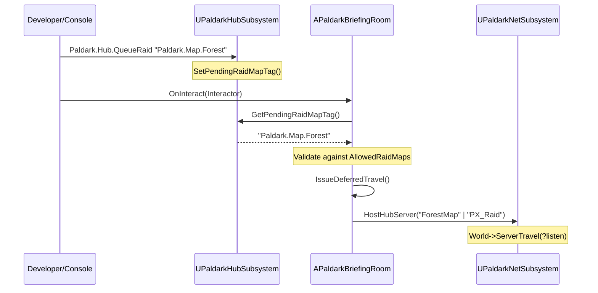
```mermaid
sequenceDiagram
    participant User as Developer/Console
    participant Sub as UPaldarkHubSubsystem
    participant Room as APaldarkBriefingRoom
    participant Net as UPaldarkNetSubsystem
    User->>Sub: Paldark.Hub.QueueRaid "Paldark.Map.Forest"
    Note over Sub: SetPendingRaidMapTag()
    User->>Room: OnInteract(Interactor)
    Room->>Sub: GetPendingRaidMapTag()
    Sub-->>Room: "Paldark.Map.Forest"
    Note over Room: Validate against AllowedRaidMaps
    Room->>Room: IssueDeferredTravel()
    Room->>Net: HostHubServer("ForestMap" | "PX_Raid")
    Note over Net: World->ServerTravel(?listen)
```

### Registration Lifecycle

1. Actor Spawn: `APaldarkHubBuilding::BeginPlay` checks for authority [Source/PaldarkLab/Private/Hub/PaldarkHubBuilding.cpp#33](https://github.com/thanhtinpro/devin-paldarklab/blob/864c77b4/Source/PaldarkLab/Private/Hub/PaldarkHubBuilding.cpp#L33-L33)
2. Configuration: The actor loads its `UPaldarkHubBuildingDefinition` synchronously to set the `InteractSphere` radius [Source/PaldarkLab/Private/Hub/PaldarkHubBuilding.cpp#56-61](https://github.com/thanhtinpro/devin-paldarklab/blob/864c77b4/Source/PaldarkLab/Private/Hub/PaldarkHubBuilding.cpp#L56-L61)
3. Registration: The actor calls `UPaldarkHubSubsystem::RegisterHubBuilding(this)`[Source/PaldarkLab/Private/Hub/PaldarkHubBuilding.cpp#67](https://github.com/thanhtinpro/devin-paldarklab/blob/864c77b4/Source/PaldarkLab/Private/Hub/PaldarkHubBuilding.cpp#L67-L67)
4. Race Guard: If the subsystem initializes after buildings have spawned, `UPaldarkHubSubsystem::Initialize` performs a `SweepWorldForBuildings` using a `TActorIterator` to ensure all buildings are captured [Source/PaldarkLab/Private/Hub/PaldarkHubSubsystem.cpp#42-224](https://github.com/thanhtinpro/devin-paldarklab/blob/864c77b4/Source/PaldarkLab/Private/Hub/PaldarkHubSubsystem.cpp#L42-L224)

Sources:[Source/PaldarkLab/Private/Hub/PaldarkHubSubsystem.cpp#1-214](https://github.com/thanhtinpro/devin-paldarklab/blob/864c77b4/Source/PaldarkLab/Private/Hub/PaldarkHubSubsystem.cpp#L1-L214)[Source/PaldarkLab/Private/Hub/PaldarkHubBuilding.cpp#1-124](https://github.com/thanhtinpro/devin-paldarklab/blob/864c77b4/Source/PaldarkLab/Private/Hub/PaldarkHubBuilding.cpp#L1-L124)[Source/PaldarkLab/Private/Net/PaldarkNetSubsystem.cpp#157-172](https://github.com/thanhtinpro/devin-paldarklab/blob/864c77b4/Source/PaldarkLab/Private/Net/PaldarkNetSubsystem.cpp#L157-L172)

---

# Briefing-Session-and-Hub-to-Raid-Travel

# Briefing Session and Hub-to-Raid Travel
Relevant source files

- [Documents/Devlog/Q1-Bug-Bash.md](https://github.com/thanhtinpro/devin-paldarklab/blob/864c77b4/Documents/Devlog/Q1-Bug-Bash.md?plain=1)
- [Documents/Devlog/Q2-Bug-Bash.md](https://github.com/thanhtinpro/devin-paldarklab/blob/864c77b4/Documents/Devlog/Q2-Bug-Bash.md?plain=1)
- [Documents/Devlog/Q3-Bug-Bash.md](https://github.com/thanhtinpro/devin-paldarklab/blob/864c77b4/Documents/Devlog/Q3-Bug-Bash.md?plain=1)
- [Documents/Devlog/Q4-Bug-Bash.md](https://github.com/thanhtinpro/devin-paldarklab/blob/864c77b4/Documents/Devlog/Q4-Bug-Bash.md?plain=1)
- [Documents/Devlog/Q4-Playtest-Checklist.md](https://github.com/thanhtinpro/devin-paldarklab/blob/864c77b4/Documents/Devlog/Q4-Playtest-Checklist.md?plain=1)
- [Source/PaldarkLab/Private/Hub/PaldarkBriefingController.cpp](https://github.com/thanhtinpro/devin-paldarklab/blob/864c77b4/Source/PaldarkLab/Private/Hub/PaldarkBriefingController.cpp)
- [Source/PaldarkLab/Private/Hub/PaldarkBriefingSessionComponent.cpp](https://github.com/thanhtinpro/devin-paldarklab/blob/864c77b4/Source/PaldarkLab/Private/Hub/PaldarkBriefingSessionComponent.cpp)
- [Source/PaldarkLab/Private/Hub/PaldarkBriefingWidget.cpp](https://github.com/thanhtinpro/devin-paldarklab/blob/864c77b4/Source/PaldarkLab/Private/Hub/PaldarkBriefingWidget.cpp)
- [Source/PaldarkLab/Private/Pal/Components/PaldarkPalActivityComponent.cpp](https://github.com/thanhtinpro/devin-paldarklab/blob/864c77b4/Source/PaldarkLab/Private/Pal/Components/PaldarkPalActivityComponent.cpp)
- [Source/PaldarkLab/Public/Hub/PaldarkBriefingController.h](https://github.com/thanhtinpro/devin-paldarklab/blob/864c77b4/Source/PaldarkLab/Public/Hub/PaldarkBriefingController.h)
- [Source/PaldarkLab/Public/Hub/PaldarkBriefingSessionComponent.h](https://github.com/thanhtinpro/devin-paldarklab/blob/864c77b4/Source/PaldarkLab/Public/Hub/PaldarkBriefingSessionComponent.h)
- [Source/PaldarkLab/Public/Hub/PaldarkBriefingWidget.h](https://github.com/thanhtinpro/devin-paldarklab/blob/864c77b4/Source/PaldarkLab/Public/Hub/PaldarkBriefingWidget.h)
- [Source/PaldarkLab/Public/Pal/Components/PaldarkPalActivityComponent.h](https://github.com/thanhtinpro/devin-paldarklab/blob/864c77b4/Source/PaldarkLab/Public/Pal/Components/PaldarkPalActivityComponent.h)
- [Source/PaldarkLab/Public/Player/Components/PaldarkPlayerActivityComponent.h](https://github.com/thanhtinpro/devin-paldarklab/blob/864c77b4/Source/PaldarkLab/Public/Player/Components/PaldarkPlayerActivityComponent.h)

The Briefing Session is the transitionary state within the Hub Town where players coordinate their next Raid destination. It utilizes a server-authoritative voting and readiness system to synchronize the departure of all players in a shard to a specific map.

## System Overview

The briefing system is partitioned into three distinct layers:

1. State Layer (`UPaldarkBriefingSessionComponent`): A replicated component residing on the `APaldarkGameStateBase` that maintains the "source of truth" for votes, readiness, and the session phase [Source/PaldarkLab/Public/Hub/PaldarkBriefingSessionComponent.h#3-7](https://github.com/thanhtinpro/devin-paldarklab/blob/864c77b4/Source/PaldarkLab/Public/Hub/PaldarkBriefingSessionComponent.h#L3-L7)
2. Controller Layer (`UPaldarkBriefingController`): A component on `APaldarkPlayerController` acting as the RPC bridge between the client UI and the server state [Source/PaldarkLab/Public/Hub/PaldarkBriefingController.h#3-7](https://github.com/thanhtinpro/devin-paldarklab/blob/864c77b4/Source/PaldarkLab/Public/Hub/PaldarkBriefingController.h#L3-L7)
3. UI Layer (`UPaldarkBriefingWidget`): A C++ base for designer-authored UMG widgets that visualizes the session state and captures player input [Source/PaldarkLab/Public/Hub/PaldarkBriefingWidget.h#3-9](https://github.com/thanhtinpro/devin-paldarklab/blob/864c77b4/Source/PaldarkLab/Public/Hub/PaldarkBriefingWidget.h#L3-L9)

### Briefing Session Lifecycle

The session operates as a state machine driven by the `PhaseTag`[Source/PaldarkLab/Private/Hub/PaldarkBriefingSessionComponent.cpp#43](https://github.com/thanhtinpro/devin-paldarklab/blob/864c77b4/Source/PaldarkLab/Private/Hub/PaldarkBriefingSessionComponent.cpp#L43-L43):

| Phase Tag | Description |
| --- | --- |
| `Paldark.Hub.Brief.Phase.Idle` | Default state. Players can cast/clear votes and toggle ready status. |
| `Paldark.Hub.Brief.Phase.Countdown` | Triggered when a majority map is selected and the `MinReadyPlayers` threshold is met. |
| `Paldark.Hub.Brief.Phase.Travelling` | Final state. All votes and ready bits are locked while `ServerTravel` is initiated. |

Sources: [Source/PaldarkLab/Public/Hub/PaldarkBriefingSessionComponent.h#130-134](https://github.com/thanhtinpro/devin-paldarklab/blob/864c77b4/Source/PaldarkLab/Public/Hub/PaldarkBriefingSessionComponent.h#L130-L134)[Source/PaldarkLab/Private/Hub/PaldarkBriefingSessionComponent.cpp#120-124](https://github.com/thanhtinpro/devin-paldarklab/blob/864c77b4/Source/PaldarkLab/Private/Hub/PaldarkBriefingSessionComponent.cpp#L120-L124)

## Implementation Details

### Replicated Session State

The `UPaldarkBriefingSessionComponent` uses `VoterStates`, a replicated array of `FPaldarkBriefingVoterState`, to track individual player choices [Source/PaldarkLab/Public/Hub/PaldarkBriefingSessionComponent.h#68-81](https://github.com/thanhtinpro/devin-paldarklab/blob/864c77b4/Source/PaldarkLab/Public/Hub/PaldarkBriefingSessionComponent.h#L68-L81)

#### Data Structures

- `FPaldarkBriefingVoterState`: Tracks a `TWeakObjectPtr` to the `APaldarkPlayerState`, the `VotedMapTag`, and a `bIsReady` boolean [Source/PaldarkLab/Public/Hub/PaldarkBriefingSessionComponent.h#69-81](https://github.com/thanhtinpro/devin-paldarklab/blob/864c77b4/Source/PaldarkLab/Public/Hub/PaldarkBriefingSessionComponent.h#L69-L81)
- `FPaldarkBriefingVoteTally`: A compact struct generated on-demand for the UI to display map rankings [Source/PaldarkLab/Public/Hub/PaldarkBriefingSessionComponent.h#53-62](https://github.com/thanhtinpro/devin-paldarklab/blob/864c77b4/Source/PaldarkLab/Public/Hub/PaldarkBriefingSessionComponent.h#L53-L62)

### Server Evaluation Logic

Whenever a player updates their state via RPC, the server executes `ServerEvaluateThreshold()` to determine if the session should transition to the countdown phase [Source/PaldarkLab/Private/Hub/PaldarkBriefingSessionComponent.cpp#139-176](https://github.com/thanhtinpro/devin-paldarklab/blob/864c77b4/Source/PaldarkLab/Private/Hub/PaldarkBriefingSessionComponent.cpp#L139-L176)

#### Travel Trigger Conditions

1. Majority Map: The map with the highest `VoteCount` is identified via `GetLeadingMapTag()`[Source/PaldarkLab/Private/Hub/PaldarkBriefingSessionComponent.cpp#258-285](https://github.com/thanhtinpro/devin-paldarklab/blob/864c77b4/Source/PaldarkLab/Private/Hub/PaldarkBriefingSessionComponent.cpp#L258-L285)
2. Readiness: The number of players with `bIsReady = true` must meet the minimum threshold [Source/PaldarkLab/Private/Hub/PaldarkBriefingSessionComponent.cpp#244-255](https://github.com/thanhtinpro/devin-paldarklab/blob/864c77b4/Source/PaldarkLab/Private/Hub/PaldarkBriefingSessionComponent.cpp#L244-L255)
3. Transition: If met, the `PhaseTag` switches to `Countdown` and a `FTimerHandle` is set for the departure [Source/PaldarkLab/Private/Hub/PaldarkBriefingSessionComponent.cpp#49-52](https://github.com/thanhtinpro/devin-paldarklab/blob/864c77b4/Source/PaldarkLab/Private/Hub/PaldarkBriefingSessionComponent.cpp#L49-L52)

Sources: [Source/PaldarkLab/Private/Hub/PaldarkBriefingSessionComponent.cpp#114-178](https://github.com/thanhtinpro/devin-paldarklab/blob/864c77b4/Source/PaldarkLab/Private/Hub/PaldarkBriefingSessionComponent.cpp#L114-L178)[Source/PaldarkLab/Public/Hub/PaldarkBriefingSessionComponent.h#146-158](https://github.com/thanhtinpro/devin-paldarklab/blob/864c77b4/Source/PaldarkLab/Public/Hub/PaldarkBriefingSessionComponent.h#L146-L158)

## Hub-to-Raid Travel Flow

The transition from Hub to Raid is a coordinated `ServerTravel` execution managed by the `UPaldarkNetSubsystem`.

### Interaction and UI Bridge

The flow begins when a player interacts with an `APaldarkBriefingRoom` building.

Title: Briefing Interaction Flow

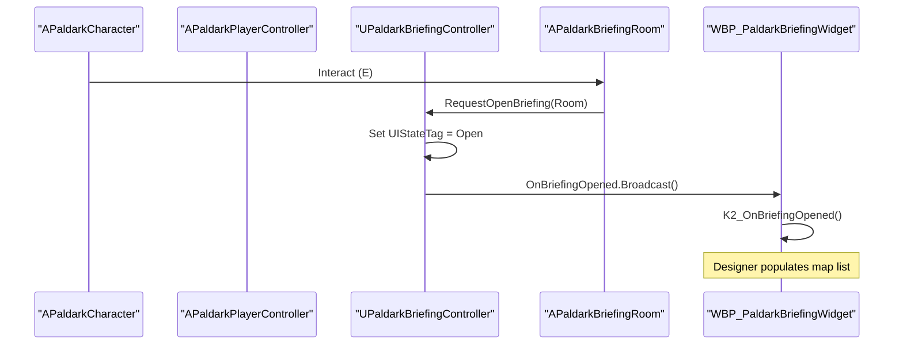
```mermaid
sequenceDiagram
    participant Player as "APaldarkCharacter"
    participant PC as "APaldarkPlayerController"
    participant BC as "UPaldarkBriefingController"
    participant Room as "APaldarkBriefingRoom"
    participant Widget as "WBP_PaldarkBriefingWidget"
    Player->>Room: Interact (E)
    Room->>BC: RequestOpenBriefing(Room)
    BC->>BC: Set UIStateTag = Open
    BC->>Widget: OnBriefingOpened.Broadcast()
    Widget->>Widget: K2_OnBriefingOpened()
    Note over Widget: Designer populates map list
```

Sources: [Source/PaldarkLab/Public/Hub/PaldarkBriefingController.h#95-96](https://github.com/thanhtinpro/devin-paldarklab/blob/864c77b4/Source/PaldarkLab/Public/Hub/PaldarkBriefingController.h#L95-L96)[Source/PaldarkLab/Private/Hub/PaldarkBriefingController.cpp#49-60](https://github.com/thanhtinpro/devin-paldarklab/blob/864c77b4/Source/PaldarkLab/Private/Hub/PaldarkBriefingController.cpp#L49-L60)[Source/PaldarkLab/Public/Hub/PaldarkBriefingWidget.h#57-59](https://github.com/thanhtinpro/devin-paldarklab/blob/864c77b4/Source/PaldarkLab/Public/Hub/PaldarkBriefingWidget.h#L57-L59)

### Voting and Departure Logic

Title: Briefing Voting and Travel Execution

[Flowchart Diagram]

Sources: [Source/PaldarkLab/Private/Hub/PaldarkBriefingController.cpp#103-143](https://github.com/thanhtinpro/devin-paldarklab/blob/864c77b4/Source/PaldarkLab/Private/Hub/PaldarkBriefingController.cpp#L103-L143)[Source/PaldarkLab/Private/Hub/PaldarkBriefingSessionComponent.cpp#114-141](https://github.com/thanhtinpro/devin-paldarklab/blob/864c77b4/Source/PaldarkLab/Private/Hub/PaldarkBriefingSessionComponent.cpp#L114-L141)[Source/PaldarkLab/Public/Hub/PaldarkBriefingController.h#15-36](https://github.com/thanhtinpro/devin-paldarklab/blob/864c77b4/Source/PaldarkLab/Public/Hub/PaldarkBriefingController.h#L15-L36)

## UI Integration Pattern

The system follows the "Stub" pattern used in other Hub systems (Marketplace/Stable), where a C++ base class handles all networking and data resolution, leaving visual implementation to Blueprints.

### `UPaldarkBriefingWidget` Functions

- `GetBriefingController()`: Helper to find the controller on the local `APaldarkPlayerController`[Source/PaldarkLab/Private/Hub/PaldarkBriefingWidget.cpp#17-27](https://github.com/thanhtinpro/devin-paldarklab/blob/864c77b4/Source/PaldarkLab/Private/Hub/PaldarkBriefingWidget.cpp#L17-L27)
- `GetSessionComponent()`: Shortcut to resolve the `UPaldarkBriefingSessionComponent` via the GameState [Source/PaldarkLab/Private/Hub/PaldarkBriefingWidget.cpp#29-32](https://github.com/thanhtinpro/devin-paldarklab/blob/864c77b4/Source/PaldarkLab/Private/Hub/PaldarkBriefingWidget.cpp#L29-L32)
- `K2_OnSessionChanged()`: A Blueprint hook called whenever the replicated state (votes, phase, or countdown) changes [Source/PaldarkLab/Public/Hub/PaldarkBriefingWidget.h#81-83](https://github.com/thanhtinpro/devin-paldarklab/blob/864c77b4/Source/PaldarkLab/Public/Hub/PaldarkBriefingWidget.h#L81-L83)

### Action Results

To provide immediate feedback, `Client_ReceiveActionResult` passes a `ResultTag` (e.g., `Paldark.Hub.Result.Success` or `Fail.NotAllowed`) back to the widget, allowing designers to play UI sounds or show error toasts [Source/PaldarkLab/Public/Hub/PaldarkBriefingController.h#68-73](https://github.com/thanhtinpro/devin-paldarklab/blob/864c77b4/Source/PaldarkLab/Public/Hub/PaldarkBriefingController.h#L68-L73)[Source/PaldarkLab/Private/Hub/PaldarkBriefingController.cpp#137-142](https://github.com/thanhtinpro/devin-paldarklab/blob/864c77b4/Source/PaldarkLab/Private/Hub/PaldarkBriefingController.cpp#L137-L142)

Sources: [Source/PaldarkLab/Public/Hub/PaldarkBriefingWidget.h#32-83](https://github.com/thanhtinpro/devin-paldarklab/blob/864c77b4/Source/PaldarkLab/Public/Hub/PaldarkBriefingWidget.h#L32-L83)[Source/PaldarkLab/Private/Hub/PaldarkBriefingWidget.cpp#34-56](https://github.com/thanhtinpro/devin-paldarklab/blob/864c77b4/Source/PaldarkLab/Private/Hub/PaldarkBriefingWidget.cpp#L34-L56)

---

# Pal-Stable-and-Marketplace

# Pal Stable and Marketplace
Relevant source files

- [Source/PaldarkLab/Private/Hub/PaldarkMarketplaceController.cpp](https://github.com/thanhtinpro/devin-paldarklab/blob/864c77b4/Source/PaldarkLab/Private/Hub/PaldarkMarketplaceController.cpp)
- [Source/PaldarkLab/Private/Hub/PaldarkMarketplaceKiosk.cpp](https://github.com/thanhtinpro/devin-paldarklab/blob/864c77b4/Source/PaldarkLab/Private/Hub/PaldarkMarketplaceKiosk.cpp)
- [Source/PaldarkLab/Private/Hub/PaldarkMarketplaceWidget.cpp](https://github.com/thanhtinpro/devin-paldarklab/blob/864c77b4/Source/PaldarkLab/Private/Hub/PaldarkMarketplaceWidget.cpp)
- [Source/PaldarkLab/Private/Hub/PaldarkStableController.cpp](https://github.com/thanhtinpro/devin-paldarklab/blob/864c77b4/Source/PaldarkLab/Private/Hub/PaldarkStableController.cpp)
- [Source/PaldarkLab/Private/Hub/PaldarkStableWidget.cpp](https://github.com/thanhtinpro/devin-paldarklab/blob/864c77b4/Source/PaldarkLab/Private/Hub/PaldarkStableWidget.cpp)
- [Source/PaldarkLab/Private/Pal/PaldarkPalDepositComponent.cpp](https://github.com/thanhtinpro/devin-paldarklab/blob/864c77b4/Source/PaldarkLab/Private/Pal/PaldarkPalDepositComponent.cpp)
- [Source/PaldarkLab/Private/Pal/PaldarkPlayerPalRosterComponent.cpp](https://github.com/thanhtinpro/devin-paldarklab/blob/864c77b4/Source/PaldarkLab/Private/Pal/PaldarkPlayerPalRosterComponent.cpp)
- [Source/PaldarkLab/Public/Hub/PaldarkMarketplaceController.h](https://github.com/thanhtinpro/devin-paldarklab/blob/864c77b4/Source/PaldarkLab/Public/Hub/PaldarkMarketplaceController.h)
- [Source/PaldarkLab/Public/Hub/PaldarkMarketplaceKiosk.h](https://github.com/thanhtinpro/devin-paldarklab/blob/864c77b4/Source/PaldarkLab/Public/Hub/PaldarkMarketplaceKiosk.h)
- [Source/PaldarkLab/Public/Hub/PaldarkMarketplaceWidget.h](https://github.com/thanhtinpro/devin-paldarklab/blob/864c77b4/Source/PaldarkLab/Public/Hub/PaldarkMarketplaceWidget.h)
- [Source/PaldarkLab/Public/Hub/PaldarkStableController.h](https://github.com/thanhtinpro/devin-paldarklab/blob/864c77b4/Source/PaldarkLab/Public/Hub/PaldarkStableController.h)
- [Source/PaldarkLab/Public/Hub/PaldarkStableWidget.h](https://github.com/thanhtinpro/devin-paldarklab/blob/864c77b4/Source/PaldarkLab/Public/Hub/PaldarkStableWidget.h)
- [Source/PaldarkLab/Public/Pal/PaldarkPalDepositComponent.h](https://github.com/thanhtinpro/devin-paldarklab/blob/864c77b4/Source/PaldarkLab/Public/Pal/PaldarkPalDepositComponent.h)

The Hub Town features two primary economic and management buildings: the Pal Stable and the Marketplace. These systems facilitate Pal roster management (deposit, withdrawal, healing) and item commerce (buying and selling). Both systems follow a controller-delegate pattern where a C++ `ActorComponent` on the `APaldarkPlayerController` manages the network handshake between the Hub building (Kiosk) and the player's authoritative state.

## Pal Stable System

The Pal Stable allows players to manage their captured Pals by moving them between their active roster and long-term storage, as well as healing injured Pals for a credit cost.

### Stable Architecture and Data Flow

The system is driven by `UPaldarkStableController`, which acts as the bridge between the `UPaldarkStableWidget` (UMG) and the authoritative components on the `APaldarkPlayerState` and `APaldarkCharacter`[Source/PaldarkLab/Public/Hub/PaldarkStableController.h#3-11](https://github.com/thanhtinpro/devin-paldarklab/blob/864c77b4/Source/PaldarkLab/Public/Hub/PaldarkStableController.h#L3-L11)

| Component | Responsibility |
| --- | --- |
| `UPaldarkStableController` | Handles RPCs (`RequestDeposit`, `RequestWithdraw`, `RequestHeal`) and transaction guards [Source/PaldarkLab/Public/Hub/PaldarkStableController.h#69-108](https://github.com/thanhtinpro/devin-paldarklab/blob/864c77b4/Source/PaldarkLab/Public/Hub/PaldarkStableController.h#L69-L108) |
| `UPaldarkPalDepositComponent` | Persistent storage for Pals not in the active roster. Lives on `APaldarkPlayerState`[Source/PaldarkLab/Public/Pal/PaldarkPalDepositComponent.h#1-5](https://github.com/thanhtinpro/devin-paldarklab/blob/864c77b4/Source/PaldarkLab/Public/Pal/PaldarkPalDepositComponent.h#L1-L5) |
| `UPaldarkPlayerPalRosterComponent` | Match-scoped active roster for deployed Pals. Lives on `APaldarkCharacter`[Source/PaldarkLab/Public/Pal/PaldarkPlayerPalRosterComponent.h#11-15](https://github.com/thanhtinpro/devin-paldarklab/blob/864c77b4/Source/PaldarkLab/Public/Pal/PaldarkPlayerPalRosterComponent.h#L11-L15) |
| `UPaldarkStableWidget` | C++ base for `WBP_PaldarkStableWidget`. Forwards controller events to Blueprint [Source/PaldarkLab/Public/Hub/PaldarkStableWidget.h#1-17](https://github.com/thanhtinpro/devin-paldarklab/blob/864c77b4/Source/PaldarkLab/Public/Hub/PaldarkStableWidget.h#L1-L17) |

### Transaction Flow: Deposit and Withdraw

The controller uses a `bIsTransactionInFlight` boolean guard to prevent RPC spam during state mutations [Source/PaldarkLab/Public/Hub/PaldarkStableController.h#33-35](https://github.com/thanhtinpro/devin-paldarklab/blob/864c77b4/Source/PaldarkLab/Public/Hub/PaldarkStableController.h#L33-L35)

1. Interaction: `APaldarkPalStable::OnInteract` calls `RequestOpenStable` on the client controller [Source/PaldarkLab/Public/Hub/PaldarkStableController.h#78-84](https://github.com/thanhtinpro/devin-paldarklab/blob/864c77b4/Source/PaldarkLab/Public/Hub/PaldarkStableController.h#L78-L84)
2. Request: The player triggers `RequestDeposit(int32 RosterIndex)`[Source/PaldarkLab/Private/Hub/PaldarkStableController.cpp#84-92](https://github.com/thanhtinpro/devin-paldarklab/blob/864c77b4/Source/PaldarkLab/Private/Hub/PaldarkStableController.cpp#L84-L92)
3. Validation: The server checks `bIsTransactionInFlight`, validates the index, and ensures the `UPaldarkPalDepositComponent` is not full [Source/PaldarkLab/Private/Hub/PaldarkStableController.cpp#123-170](https://github.com/thanhtinpro/devin-paldarklab/blob/864c77b4/Source/PaldarkLab/Private/Hub/PaldarkStableController.cpp#L123-L170)
4. Mutation: The Pal is removed from `UPaldarkPlayerPalRosterComponent` and added to `UPaldarkPalDepositComponent`[Source/PaldarkLab/Private/Hub/PaldarkStableController.cpp#172-173](https://github.com/thanhtinpro/devin-paldarklab/blob/864c77b4/Source/PaldarkLab/Private/Hub/PaldarkStableController.cpp#L172-L173)
5. Response: `Client_ReceiveActionResult` notifies the widget to refresh [Source/PaldarkLab/Private/Hub/PaldarkStableController.cpp#186-192](https://github.com/thanhtinpro/devin-paldarklab/blob/864c77b4/Source/PaldarkLab/Private/Hub/PaldarkStableController.cpp#L186-L192)

### Pal Healing Logic

The `RequestHeal` RPC allows restoring a Pal's health in the roster. It requires a credit balance check against the `Paldark.Item.Resource.Currency.Credits` tag in the player's inventory [Source/PaldarkLab/Public/Hub/PaldarkStableController.h#104-107](https://github.com/thanhtinpro/devin-paldarklab/blob/864c77b4/Source/PaldarkLab/Public/Hub/PaldarkStableController.h#L104-L107) The cost is defined by `HealPriceCredits` (default 50) [Source/PaldarkLab/Public/Hub/PaldarkStableController.h#136-138](https://github.com/thanhtinpro/devin-paldarklab/blob/864c77b4/Source/PaldarkLab/Public/Hub/PaldarkStableController.h#L136-L138)

Stable Logic Entities

[Flowchart Diagram]

Sources: [Source/PaldarkLab/Public/Hub/PaldarkStableController.h#43-61](https://github.com/thanhtinpro/devin-paldarklab/blob/864c77b4/Source/PaldarkLab/Public/Hub/PaldarkStableController.h#L43-L61)[Source/PaldarkLab/Private/Hub/PaldarkStableController.cpp#136-193](https://github.com/thanhtinpro/devin-paldarklab/blob/864c77b4/Source/PaldarkLab/Private/Hub/PaldarkStableController.cpp#L136-L193)[Source/PaldarkLab/Public/Pal/PaldarkPalDepositComponent.h#1-12](https://github.com/thanhtinpro/devin-paldarklab/blob/864c77b4/Source/PaldarkLab/Public/Pal/PaldarkPalDepositComponent.h#L1-L12)

---

## Marketplace System

The Marketplace facilitates the exchange of items for credits. It utilizes an asynchronous catalog loading pattern to ensure the UI remains responsive while fetching item definitions.

### Catalog Management and Pricing

Prices are sourced from the `UPaldarkItemFragment_MarketValue` attached to `UPaldarkItemDefinition` assets [Source/PaldarkLab/Public/Hub/PaldarkMarketplaceController.h#20-23](https://github.com/thanhtinpro/devin-paldarklab/blob/864c77b4/Source/PaldarkLab/Public/Hub/PaldarkMarketplaceController.h#L20-L23) This fragment contains `BuyPriceCredits` and `SellPriceCredits`. If an item lacks this fragment, it is treated as "not for sale" [Source/PaldarkLab/Public/Hub/PaldarkMarketplaceController.h#22-23](https://github.com/thanhtinpro/devin-paldarklab/blob/864c77b4/Source/PaldarkLab/Public/Hub/PaldarkMarketplaceController.h#L22-L23)

The `UPaldarkMarketplaceController` manages the lifecycle of the marketplace UI:

1. RequestOpenMarketplace: Flips state to `Paldark.Hub.UI.OpeningMarket` and initiates an async load of the `MarketplaceCatalog` soft references found in the `UPaldarkHubBuildingDefinition`[Source/PaldarkLab/Private/Hub/PaldarkMarketplaceController.cpp#47-81](https://github.com/thanhtinpro/devin-paldarklab/blob/864c77b4/Source/PaldarkLab/Private/Hub/PaldarkMarketplaceController.cpp#L47-L81)
2. OnCatalogLoadCompleted: Once the `FStreamableHandle` completes, the `CachedCatalog` is populated and `OnMarketplaceOpened` is broadcast [Source/PaldarkLab/Private/Hub/PaldarkMarketplaceController.cpp#113-145](https://github.com/thanhtinpro/devin-paldarklab/blob/864c77b4/Source/PaldarkLab/Private/Hub/PaldarkMarketplaceController.cpp#L113-L145)

### Transaction Security

The server re-validates that any `ItemTag` received in a `Server_RequestBuy` or `Server_RequestSell` RPC actually exists within the `ActiveKiosk` catalog to prevent client-side spoofing of items [Source/PaldarkLab/Public/Hub/PaldarkMarketplaceController.h#25-27](https://github.com/thanhtinpro/devin-paldarklab/blob/864c77b4/Source/PaldarkLab/Public/Hub/PaldarkMarketplaceController.h#L25-L27)

Marketplace Data Flow

[Flowchart Diagram]

Sources: [Source/PaldarkLab/Private/Hub/PaldarkMarketplaceController.cpp#47-111](https://github.com/thanhtinpro/devin-paldarklab/blob/864c77b4/Source/PaldarkLab/Private/Hub/PaldarkMarketplaceController.cpp#L47-L111)[Source/PaldarkLab/Public/Hub/PaldarkMarketplaceController.h#120-135](https://github.com/thanhtinpro/devin-paldarklab/blob/864c77b4/Source/PaldarkLab/Public/Hub/PaldarkMarketplaceController.h#L120-L135)[Source/PaldarkLab/Public/Hub/PaldarkMarketplaceKiosk.h#1-11](https://github.com/thanhtinpro/devin-paldarklab/blob/864c77b4/Source/PaldarkLab/Public/Hub/PaldarkMarketplaceKiosk.h#L1-L11)

---

## Pal Deposit Component

The `UPaldarkPalDepositComponent` provides the storage backend for the Stable.

- Scope: Lives on `APaldarkPlayerState` to ensure data survives character death and respawn [Source/PaldarkLab/Public/Pal/PaldarkPalDepositComponent.h#1-5](https://github.com/thanhtinpro/devin-paldarklab/blob/864c77b4/Source/PaldarkLab/Public/Pal/PaldarkPalDepositComponent.h#L1-L5)
- Replication: Uses `COND_OwnerOnly` for the `DepositedEntries` array to maintain player privacy [Source/PaldarkLab/Public/Pal/PaldarkPalDepositComponent.h#17-18](https://github.com/thanhtinpro/devin-paldarklab/blob/864c77b4/Source/PaldarkLab/Public/Pal/PaldarkPalDepositComponent.h#L17-L18)
- Capacity: Limited by `MaxDepositSlots` (default 24) [Source/PaldarkLab/Public/Pal/PaldarkPalDepositComponent.h#88-90](https://github.com/thanhtinpro/devin-paldarklab/blob/864c77b4/Source/PaldarkLab/Public/Pal/PaldarkPalDepositComponent.h#L88-L90)
- Persistence: Includes `CaptureSnapshot` and `ApplySnapshot` functions to facilitate saving the roster to the `UPaldarkSaveSubsystem`[Source/PaldarkLab/Private/Pal/PaldarkPalDepositComponent.cpp#79-94](https://github.com/thanhtinpro/devin-paldarklab/blob/864c77b4/Source/PaldarkLab/Private/Pal/PaldarkPalDepositComponent.cpp#L79-L94)

### Snapshot Logic

When capturing a snapshot for saving, the component strips runtime-only data (like `PalDefinitionId`) and stores only the essential `FPaldarkRosterEntrySaved` data (SpeciesTag, BondLevel, Health) [Source/PaldarkLab/Private/Pal/PaldarkPalDepositComponent.cpp#79-94](https://github.com/thanhtinpro/devin-paldarklab/blob/864c77b4/Source/PaldarkLab/Private/Pal/PaldarkPalDepositComponent.cpp#L79-L94) Upon loading, `ApplySnapshot` re-derives the `PalDefinitionId` from the `SpeciesTag` leaf name [Source/PaldarkLab/Private/Pal/PaldarkPalDepositComponent.cpp#125-132](https://github.com/thanhtinpro/devin-paldarklab/blob/864c77b4/Source/PaldarkLab/Private/Pal/PaldarkPalDepositComponent.cpp#L125-L132)

Sources: [Source/PaldarkLab/Public/Pal/PaldarkPalDepositComponent.h#42-80](https://github.com/thanhtinpro/devin-paldarklab/blob/864c77b4/Source/PaldarkLab/Public/Pal/PaldarkPalDepositComponent.h#L42-L80)[Source/PaldarkLab/Private/Pal/PaldarkPalDepositComponent.cpp#22-47](https://github.com/thanhtinpro/devin-paldarklab/blob/864c77b4/Source/PaldarkLab/Private/Pal/PaldarkPalDepositComponent.cpp#L22-L47)[Source/PaldarkLab/Private/Pal/PaldarkPalDepositComponent.cpp#105-140](https://github.com/thanhtinpro/devin-paldarklab/blob/864c77b4/Source/PaldarkLab/Private/Pal/PaldarkPalDepositComponent.cpp#L105-L140)

---

## Widget Stub Pattern

Both systems use a C++ "Stub" widget pattern (`UPaldarkStableWidget` and `UPaldarkMarketplaceWidget`). This ensures that the complex logic of finding the local player's controller and binding to its delegates is handled in C++, while the visual layout remains in UMG.

- Initialization: `NativeOnInitialized` finds the local `UPaldarkStableController` and binds `HandleStableOpened` to the controller's multicast delegate [Source/PaldarkLab/Private/Hub/PaldarkStableWidget.cpp#39-55](https://github.com/thanhtinpro/devin-paldarklab/blob/864c77b4/Source/PaldarkLab/Private/Hub/PaldarkStableWidget.cpp#L39-L55)
- Blueprint Hooks: The C++ handlers call `BlueprintImplementableEvent` functions (prefixed with `K2_`) such as `K2_OnStableOpened` and `K2_OnStableActionResult`[Source/PaldarkLab/Private/Hub/PaldarkStableWidget.cpp#69-86](https://github.com/thanhtinpro/devin-paldarklab/blob/864c77b4/Source/PaldarkLab/Private/Hub/PaldarkStableWidget.cpp#L69-L86)
- Cleanup: `NativeDestruct` unbinds all delegates to prevent memory leaks or calling into destroyed widgets [Source/PaldarkLab/Private/Hub/PaldarkStableWidget.cpp#57-67](https://github.com/thanhtinpro/devin-paldarklab/blob/864c77b4/Source/PaldarkLab/Private/Hub/PaldarkStableWidget.cpp#L57-L67)

Sources: [Source/PaldarkLab/Public/Hub/PaldarkStableWidget.h#18-23](https://github.com/thanhtinpro/devin-paldarklab/blob/864c77b4/Source/PaldarkLab/Public/Hub/PaldarkStableWidget.h#L18-L23)[Source/PaldarkLab/Private/Hub/PaldarkStableWidget.cpp#9-37](https://github.com/thanhtinpro/devin-paldarklab/blob/864c77b4/Source/PaldarkLab/Private/Hub/PaldarkStableWidget.cpp#L9-L37)[Source/PaldarkLab/Public/Hub/PaldarkMarketplaceWidget.h#1-19](https://github.com/thanhtinpro/devin-paldarklab/blob/864c77b4/Source/PaldarkLab/Public/Hub/PaldarkMarketplaceWidget.h#L1-L19)

---

# Match-System-and-Extraction

# Match System and Extraction
Relevant source files

- [Documents/Devlog/W24-25-Build.md](https://github.com/thanhtinpro/devin-paldarklab/blob/864c77b4/Documents/Devlog/W24-25-Build.md?plain=1)
- [Source/PaldarkLab/Private/Match/PaldarkExtractionBeacon.cpp](https://github.com/thanhtinpro/devin-paldarklab/blob/864c77b4/Source/PaldarkLab/Private/Match/PaldarkExtractionBeacon.cpp)
- [Source/PaldarkLab/Private/Match/PaldarkMatchSubsystem.cpp](https://github.com/thanhtinpro/devin-paldarklab/blob/864c77b4/Source/PaldarkLab/Private/Match/PaldarkMatchSubsystem.cpp)
- [Source/PaldarkLab/Private/Pal/PaldarkPalSphere.cpp](https://github.com/thanhtinpro/devin-paldarklab/blob/864c77b4/Source/PaldarkLab/Private/Pal/PaldarkPalSphere.cpp)
- [Source/PaldarkLab/Public/Match/PaldarkExtractionBeacon.h](https://github.com/thanhtinpro/devin-paldarklab/blob/864c77b4/Source/PaldarkLab/Public/Match/PaldarkExtractionBeacon.h)
- [Source/PaldarkLab/Public/Match/PaldarkMatchSubsystem.h](https://github.com/thanhtinpro/devin-paldarklab/blob/864c77b4/Source/PaldarkLab/Public/Match/PaldarkMatchSubsystem.h)
- [Source/PaldarkLab/Public/Match/PaldarkMatchTypes.h](https://github.com/thanhtinpro/devin-paldarklab/blob/864c77b4/Source/PaldarkLab/Public/Match/PaldarkMatchTypes.h)

The Match System provides a server-authoritative state machine for managing the lifecycle of an extraction raid. It coordinates player entry, match phases (Warmup, Active, Extracting, Ended), extraction mechanics via world-placed beacons, and the recording of terminal player outcomes (Extracted, KIA, or Disconnected). This system ensures that the game session progresses logically from initial spawn to a definitive end-state, mirroring results to the client for HUD updates.

## Match Lifecycle and Phases

The match lifecycle is managed by the `UPaldarkMatchSubsystem`, a server-only `UWorldSubsystem`[Source/PaldarkLab/Public/Match/PaldarkMatchSubsystem.h#3-15](https://github.com/thanhtinpro/devin-paldarklab/blob/864c77b4/Source/PaldarkLab/Public/Match/PaldarkMatchSubsystem.h#L3-L15) It drives a monotonic Finite State Machine (FSM) defined by the `EPaldarkMatchPhase` enum [Source/PaldarkLab/Public/Match/PaldarkMatchTypes.h#35-41](https://github.com/thanhtinpro/devin-paldarklab/blob/864c77b4/Source/PaldarkLab/Public/Match/PaldarkMatchTypes.h#L35-L41)

### Match Phase FSM

The FSM transitions through the following states:

- Warmup: Initial state where players register upon joining. A timer (default 30s) or a full lobby triggers the transition to Active [Source/PaldarkLab/Private/Match/PaldarkMatchSubsystem.cpp#85-98](https://github.com/thanhtinpro/devin-paldarklab/blob/864c77b4/Source/PaldarkLab/Private/Match/PaldarkMatchSubsystem.cpp#L85-L98)
- Active: The main gameplay phase. Extraction beacons are enabled.
- Extracting: An informational phase triggered when the first player successfully extracts [Source/PaldarkLab/Private/Match/PaldarkMatchSubsystem.cpp#167-170](https://github.com/thanhtinpro/devin-paldarklab/blob/864c77b4/Source/PaldarkLab/Private/Match/PaldarkMatchSubsystem.cpp#L167-L170)
- Ended: Terminal state. All player outcomes are locked, and the match results are broadcast [Source/PaldarkLab/Private/Match/PaldarkMatchSubsystem.cpp#217-229](https://github.com/thanhtinpro/devin-paldarklab/blob/864c77b4/Source/PaldarkLab/Private/Match/PaldarkMatchSubsystem.cpp#L217-L229)

### Match Flow Diagram

The following diagram maps the logical match flow to the code entities responsible for each transition.

Title: Match Phase Transition Logic

Sources: [Source/PaldarkLab/Private/Match/PaldarkMatchSubsystem.cpp#32-44](https://github.com/thanhtinpro/devin-paldarklab/blob/864c77b4/Source/PaldarkLab/Private/Match/PaldarkMatchSubsystem.cpp#L32-L44)[Source/PaldarkLab/Private/Match/PaldarkMatchSubsystem.cpp#113-143](https://github.com/thanhtinpro/devin-paldarklab/blob/864c77b4/Source/PaldarkLab/Private/Match/PaldarkMatchSubsystem.cpp#L113-L143)[Source/PaldarkLab/Private/Match/PaldarkMatchSubsystem.cpp#145-173](https://github.com/thanhtinpro/devin-paldarklab/blob/864c77b4/Source/PaldarkLab/Private/Match/PaldarkMatchSubsystem.cpp#L145-L173)[Source/PaldarkLab/Private/Match/PaldarkMatchSubsystem.cpp#203-229](https://github.com/thanhtinpro/devin-paldarklab/blob/864c77b4/Source/PaldarkLab/Private/Match/PaldarkMatchSubsystem.cpp#L203-L229)[Documents/Devlog/W24-25-Build.md#33-56](https://github.com/thanhtinpro/devin-paldarklab/blob/864c77b4/Documents/Devlog/W24-25-Build.md?plain=1#L33-L56)

## Extraction Mechanics

Extraction is facilitated by the `APaldarkExtractionBeacon`, a designer-placeable actor [Source/PaldarkLab/Public/Match/PaldarkExtractionBeacon.h#3-6](https://github.com/thanhtinpro/devin-paldarklab/blob/864c77b4/Source/PaldarkLab/Public/Match/PaldarkExtractionBeacon.h#L3-L6) It uses a `USphereComponent` to detect player overlaps and increments a progress ramp over a specified `ExtractionDuration` (default 5s) [Source/PaldarkLab/Public/Match/PaldarkExtractionBeacon.h#92-96](https://github.com/thanhtinpro/devin-paldarklab/blob/864c77b4/Source/PaldarkLab/Public/Match/PaldarkExtractionBeacon.h#L92-L96)

- Progress Tracking: The beacon maintains a server-side `TMap` of player progress [Source/PaldarkLab/Public/Match/PaldarkExtractionBeacon.h#130](https://github.com/thanhtinpro/devin-paldarklab/blob/864c77b4/Source/PaldarkLab/Public/Match/PaldarkExtractionBeacon.h#L130-L130)
- Consent: If `bRequireExplicitConsent` is true, players must press an interaction key to start the ramp [Source/PaldarkLab/Public/Match/PaldarkExtractionBeacon.h#98-101](https://github.com/thanhtinpro/devin-paldarklab/blob/864c77b4/Source/PaldarkLab/Public/Match/PaldarkExtractionBeacon.h#L98-L101)
- Replication: Progress is mirrored to `APaldarkPlayerState::ExtractionProgress` using a throttled update to avoid network saturation [Source/PaldarkLab/Private/Match/PaldarkExtractionBeacon.cpp#125-132](https://github.com/thanhtinpro/devin-paldarklab/blob/864c77b4/Source/PaldarkLab/Private/Match/PaldarkExtractionBeacon.cpp#L125-L132)

For details on beacon configuration and overlap logic, see [Match Subsystem and Extraction Beacon](#10.1).

Sources: [Source/PaldarkLab/Private/Match/PaldarkExtractionBeacon.cpp#14-28](https://github.com/thanhtinpro/devin-paldarklab/blob/864c77b4/Source/PaldarkLab/Private/Match/PaldarkExtractionBeacon.cpp#L14-L28)[Source/PaldarkLab/Private/Match/PaldarkExtractionBeacon.cpp#66-158](https://github.com/thanhtinpro/devin-paldarklab/blob/864c77b4/Source/PaldarkLab/Private/Match/PaldarkExtractionBeacon.cpp#L66-L158)[Documents/Devlog/W24-25-Build.md#92-123](https://github.com/thanhtinpro/devin-paldarklab/blob/864c77b4/Documents/Devlog/W24-25-Build.md?plain=1#L92-L123)

## Player Outcomes and Death Hooks

Every player in the match is tracked via a `FPaldarkMatchPlayerRow` within the subsystem [Source/PaldarkLab/Public/Match/PaldarkMatchTypes.h#72-101](https://github.com/thanhtinpro/devin-paldarklab/blob/864c77b4/Source/PaldarkLab/Public/Match/PaldarkMatchTypes.h#L72-L101) Their `EPaldarkPlayerOutcome` can transition from `Alive` to one of three terminal states:

1. Extracted: Achieved via the Extraction Beacon.
2. KIA (Killed In Action): Triggered by the `OnHealthZeroed` delegate in the `UPaldarkAttributeSet`, which is caught by a server-only hook in `APaldarkCharacter`[Documents/Devlog/W24-25-Build.md#124-141](https://github.com/thanhtinpro/devin-paldarklab/blob/864c77b4/Documents/Devlog/W24-25-Build.md?plain=1#L124-L141)
3. Disconnected: Triggered by `APaldarkGameMode_Extraction::Logout`[Source/PaldarkLab/Private/Match/PaldarkMatchSubsystem.cpp#188-201](https://github.com/thanhtinpro/devin-paldarklab/blob/864c77b4/Source/PaldarkLab/Private/Match/PaldarkMatchSubsystem.cpp#L188-L201)

### Outcome Logic Diagram

This diagram shows how various gameplay events resolve into terminal player states.

Title: Player Outcome Resolution

[Flowchart Diagram]

Sources: [Source/PaldarkLab/Private/Match/PaldarkMatchSubsystem.cpp#145-186](https://github.com/thanhtinpro/devin-paldarklab/blob/864c77b4/Source/PaldarkLab/Private/Match/PaldarkMatchSubsystem.cpp#L145-L186)[Source/PaldarkLab/Public/Match/PaldarkMatchTypes.h#51-57](https://github.com/thanhtinpro/devin-paldarklab/blob/864c77b4/Source/PaldarkLab/Public/Match/PaldarkMatchTypes.h#L51-L57)[Documents/Devlog/W24-25-Build.md#58-91](https://github.com/thanhtinpro/devin-paldarklab/blob/864c77b4/Documents/Devlog/W24-25-Build.md?plain=1#L58-L91)

## Pal Integration

The match system also encompasses the management of Pals during the raid.

- Roster Management: The `UPaldarkPlayerPalRosterComponent` manages the active set of Pals a player has brought into the match.
- Taming: Players can capture new Pals using the `APaldarkPalSphere` projectile, which triggers the capture formula in `UPaldarkPalTameComponent`.

For details on the Pal roster and taming mechanics, see [Pal Roster, Tame Mechanic, and PalSphere](#10.2).

Sources: [Source/PaldarkLab/Private/Pal/PaldarkPalSphere.cpp#82-131](https://github.com/thanhtinpro/devin-paldarklab/blob/864c77b4/Source/PaldarkLab/Private/Pal/PaldarkPalSphere.cpp#L82-L131)[Source/PaldarkLab/Public/Match/PaldarkMatchTypes.h#10-11](https://github.com/thanhtinpro/devin-paldarklab/blob/864c77b4/Source/PaldarkLab/Public/Match/PaldarkMatchTypes.h#L10-L11)

## Child Pages

- [Match Subsystem and Extraction Beacon](#10.1) — Detailed documentation on phase transitions, beacon overlap logic, and GameState replication.
- [Pal Roster, Tame Mechanic, and PalSphere](#10.2) — Detailed documentation on the match-scoped Pal roster and the PalSphere taming pipeline.

---

# Match-Subsystem-and-Extraction-Beacon

# Match Subsystem and Extraction Beacon
Relevant source files

- [Documents/Devlog/W24-25-Build.md](https://github.com/thanhtinpro/devin-paldarklab/blob/864c77b4/Documents/Devlog/W24-25-Build.md?plain=1)
- [Source/PaldarkLab/Private/Framework/PaldarkGameMode_Extraction.cpp](https://github.com/thanhtinpro/devin-paldarklab/blob/864c77b4/Source/PaldarkLab/Private/Framework/PaldarkGameMode_Extraction.cpp)
- [Source/PaldarkLab/Private/Match/PaldarkExtractionBeacon.cpp](https://github.com/thanhtinpro/devin-paldarklab/blob/864c77b4/Source/PaldarkLab/Private/Match/PaldarkExtractionBeacon.cpp)
- [Source/PaldarkLab/Private/Match/PaldarkMatchSubsystem.cpp](https://github.com/thanhtinpro/devin-paldarklab/blob/864c77b4/Source/PaldarkLab/Private/Match/PaldarkMatchSubsystem.cpp)
- [Source/PaldarkLab/Private/Pal/PaldarkPalSphere.cpp](https://github.com/thanhtinpro/devin-paldarklab/blob/864c77b4/Source/PaldarkLab/Private/Pal/PaldarkPalSphere.cpp)
- [Source/PaldarkLab/Public/Framework/PaldarkGameMode_Extraction.h](https://github.com/thanhtinpro/devin-paldarklab/blob/864c77b4/Source/PaldarkLab/Public/Framework/PaldarkGameMode_Extraction.h)
- [Source/PaldarkLab/Public/Match/PaldarkExtractionBeacon.h](https://github.com/thanhtinpro/devin-paldarklab/blob/864c77b4/Source/PaldarkLab/Public/Match/PaldarkExtractionBeacon.h)
- [Source/PaldarkLab/Public/Match/PaldarkMatchSubsystem.h](https://github.com/thanhtinpro/devin-paldarklab/blob/864c77b4/Source/PaldarkLab/Public/Match/PaldarkMatchSubsystem.h)
- [Source/PaldarkLab/Public/Match/PaldarkMatchTypes.h](https://github.com/thanhtinpro/devin-paldarklab/blob/864c77b4/Source/PaldarkLab/Public/Match/PaldarkMatchTypes.h)

The Match Subsystem and Extraction Beacon form the core orchestration layer for Paldark's extraction-shooter loop. This system manages the server-authoritative lifecycle of a raid, transitioning through distinct phases, tracking player outcomes (Extracted, KIA, Disconnected), and providing the physical triggers required for players to exit the map.

## Match Subsystem (UPaldarkMatchSubsystem)

`UPaldarkMatchSubsystem` is a server-authoritative `UWorldSubsystem` that acts as the Finite State Machine (FSM) for the match [Source/PaldarkLab/Public/Match/PaldarkMatchSubsystem.h#3-15](https://github.com/thanhtinpro/devin-paldarklab/blob/864c77b4/Source/PaldarkLab/Public/Match/PaldarkMatchSubsystem.h#L3-L15) It maintains a registry of all players and their current status, evaluating end-conditions (like team wipes or timeouts) to terminate the session.

### Match Phases (EPaldarkMatchPhase)

The match follows a monotonic state machine where phases progress forward and cannot be rewound [Documents/Devlog/W24-25-Build.md#33-56](https://github.com/thanhtinpro/devin-paldarklab/blob/864c77b4/Documents/Devlog/W24-25-Build.md?plain=1#L33-L56)

| Phase | Description | Transition Trigger |
| --- | --- | --- |
| `Warmup` | Initial state. Players join and load assets. | `WarmupTimerHandle` expires or `StartMatch()` called [Source/PaldarkLab/Private/Match/PaldarkMatchSubsystem.cpp#113-143](https://github.com/thanhtinpro/devin-paldarklab/blob/864c77b4/Source/PaldarkLab/Private/Match/PaldarkMatchSubsystem.cpp#L113-L143) |
| `Active` | Standard gameplay. Combat and looting are enabled. | First player calls `RecordExtraction()` via a beacon [Source/PaldarkLab/Private/Match/PaldarkMatchSubsystem.cpp#167-170](https://github.com/thanhtinpro/devin-paldarklab/blob/864c77b4/Source/PaldarkLab/Private/Match/PaldarkMatchSubsystem.cpp#L167-L170) |
| `Extracting` | Informational phase indicating at least one player has left. | End-condition met (All Extracted, Team Wipe, or Timeout) [Source/PaldarkLab/Private/Match/PaldarkMatchSubsystem.cpp#185-201](https://github.com/thanhtinpro/devin-paldarklab/blob/864c77b4/Source/PaldarkLab/Private/Match/PaldarkMatchSubsystem.cpp#L185-L201) |
| `Ended` | Terminal state. Results are logged and session awaits cleanup. | None (Terminal) [Source/PaldarkLab/Public/Match/PaldarkMatchTypes.h#40](https://github.com/thanhtinpro/devin-paldarklab/blob/864c77b4/Source/PaldarkLab/Public/Match/PaldarkMatchTypes.h#L40-L40) |

### Player Outcome Tracking

The subsystem maintains a `TMap<TObjectPtr<APlayerState>, FPaldarkMatchPlayerRow>`[Documents/Devlog/W24-25-Build.md#60-74](https://github.com/thanhtinpro/devin-paldarklab/blob/864c77b4/Documents/Devlog/W24-25-Build.md?plain=1#L60-L74) This map is server-only to prevent cheating; status is mirrored to clients via replicated properties on `APaldarkPlayerState` and `APaldarkGameStateBase`[Source/PaldarkLab/Public/Match/PaldarkMatchSubsystem.h#17-21](https://github.com/thanhtinpro/devin-paldarklab/blob/864c77b4/Source/PaldarkLab/Public/Match/PaldarkMatchSubsystem.h#L17-L21)

Match Lifecycle Logic Flow
Title: Match Phase and Outcome Flow

[Flowchart Diagram]

Sources: [Source/PaldarkLab/Private/Framework/PaldarkGameMode_Extraction.cpp#12-32](https://github.com/thanhtinpro/devin-paldarklab/blob/864c77b4/Source/PaldarkLab/Private/Framework/PaldarkGameMode_Extraction.cpp#L12-L32)[Source/PaldarkLab/Private/Match/PaldarkMatchSubsystem.cpp#145-173](https://github.com/thanhtinpro/devin-paldarklab/blob/864c77b4/Source/PaldarkLab/Private/Match/PaldarkMatchSubsystem.cpp#L145-L173)[Source/PaldarkLab/Public/Match/PaldarkMatchSubsystem.h#132-134](https://github.com/thanhtinpro/devin-paldarklab/blob/864c77b4/Source/PaldarkLab/Public/Match/PaldarkMatchSubsystem.h#L132-L134)

## Extraction Beacon (APaldarkExtractionBeacon)

`APaldarkExtractionBeacon` is a replicated actor placed by designers to define extraction zones [Source/PaldarkLab/Public/Match/PaldarkExtractionBeacon.h#1-13](https://github.com/thanhtinpro/devin-paldarklab/blob/864c77b4/Source/PaldarkLab/Public/Match/PaldarkExtractionBeacon.h#L1-L13) It uses a `USphereComponent` to detect player overlaps and drive a progress ramp.

### Implementation Details

- Progress Accumulation: The beacon maintains a `ProgressByPlayer` map. If a player stays within the `TriggerRadius` for the `ExtractionDuration`, the beacon calls `RecordExtraction` on the subsystem [Source/PaldarkLab/Private/Match/PaldarkExtractionBeacon.cpp#111-146](https://github.com/thanhtinpro/devin-paldarklab/blob/864c77b4/Source/PaldarkLab/Private/Match/PaldarkExtractionBeacon.cpp#L111-L146)
- Consent Mechanism: If `bRequireExplicitConsent` is true, players must trigger the `InteractExtraction` input to begin the ramp; otherwise, overlap is sufficient [Source/PaldarkLab/Public/Match/PaldarkExtractionBeacon.h#98-101](https://github.com/thanhtinpro/devin-paldarklab/blob/864c77b4/Source/PaldarkLab/Public/Match/PaldarkExtractionBeacon.h#L98-L101)
- Throttled Updates: To save bandwidth, progress is mirrored to `APaldarkPlayerState::ExtractionProgress` at a frequency defined by `WireUpdateInterval` (default 0.1s) [Source/PaldarkLab/Private/Match/PaldarkExtractionBeacon.cpp#125-132](https://github.com/thanhtinpro/devin-paldarklab/blob/864c77b4/Source/PaldarkLab/Private/Match/PaldarkExtractionBeacon.cpp#L125-L132)

Extraction Progress Logic
Title: Extraction Beacon Progress and Validation

Sources: [Source/PaldarkLab/Private/Match/PaldarkExtractionBeacon.cpp#66-158](https://github.com/thanhtinpro/devin-paldarklab/blob/864c77b4/Source/PaldarkLab/Private/Match/PaldarkExtractionBeacon.cpp#L66-L158)[Source/PaldarkLab/Private/Match/PaldarkExtractionBeacon.cpp#160-196](https://github.com/thanhtinpro/devin-paldarklab/blob/864c77b4/Source/PaldarkLab/Private/Match/PaldarkExtractionBeacon.cpp#L160-L196)

## Game Mode Integration (APaldarkGameMode_Extraction)

`APaldarkGameMode_Extraction` provides the glue between the engine's login/logout flow and the Match Subsystem [Source/PaldarkLab/Public/Framework/PaldarkGameMode_Extraction.h#1-11](https://github.com/thanhtinpro/devin-paldarklab/blob/864c77b4/Source/PaldarkLab/Public/Framework/PaldarkGameMode_Extraction.h#L1-L11)

### Key Hooks

1. PostLogin: Calls `MatchSubsystem->RegisterPlayer(PS)` to ensure every joining player is tracked [Source/PaldarkLab/Private/Framework/PaldarkGameMode_Extraction.cpp#12-32](https://github.com/thanhtinpro/devin-paldarklab/blob/864c77b4/Source/PaldarkLab/Private/Framework/PaldarkGameMode_Extraction.cpp#L12-L32)
2. Logout: Calls `RecordDisconnect` and `UnregisterPlayer` to update the alive count and evaluate end conditions [Source/PaldarkLab/Private/Framework/PaldarkGameMode_Extraction.cpp#34-48](https://github.com/thanhtinpro/devin-paldarklab/blob/864c77b4/Source/PaldarkLab/Private/Framework/PaldarkGameMode_Extraction.cpp#L34-L48)
3. Match End: Binds to `OnMatchEnded` to trigger the final scoreboard log via `DumpToLog()`[Source/PaldarkLab/Private/Framework/PaldarkGameMode_Extraction.cpp#73-86](https://github.com/thanhtinpro/devin-paldarklab/blob/864c77b4/Source/PaldarkLab/Private/Framework/PaldarkGameMode_Extraction.cpp#L73-L86)

## State Mirroring and Replication

While the `UPaldarkMatchSubsystem` is server-only, the `APaldarkGameStateBase` mirrors critical phase data for client-side HUDs [Source/PaldarkLab/Public/Match/PaldarkMatchSubsystem.h#17-21](https://github.com/thanhtinpro/devin-paldarklab/blob/864c77b4/Source/PaldarkLab/Public/Match/PaldarkMatchSubsystem.h#L17-L21)

| Replicated Property | Location | Purpose |
| --- | --- | --- |
| `MatchPhase` | `APaldarkGameStateBase` | Drives HUD "Extraction Phase" banners [Documents/Devlog/W24-25-Build.md#164-165](https://github.com/thanhtinpro/devin-paldarklab/blob/864c77b4/Documents/Devlog/W24-25-Build.md?plain=1#L164-L165) |
| `PhaseEndServerTime` | `APaldarkGameStateBase` | Allows clients to render countdown timers locally [Documents/Devlog/W24-25-Build.md#170-172](https://github.com/thanhtinpro/devin-paldarklab/blob/864c77b4/Documents/Devlog/W24-25-Build.md?plain=1#L170-L172) |
| `MatchOutcome` | `APaldarkPlayerState` | Displays "Extracted" or "KIA" status in the squad list [Documents/Devlog/W24-25-Build.md#177-178](https://github.com/thanhtinpro/devin-paldarklab/blob/864c77b4/Documents/Devlog/W24-25-Build.md?plain=1#L177-L178) |
| `ExtractionProgress` | `APaldarkPlayerState` | Drives the circular progress bar when standing in a beacon [Documents/Devlog/W24-25-Build.md#81](https://github.com/thanhtinpro/devin-paldarklab/blob/864c77b4/Documents/Devlog/W24-25-Build.md?plain=1#L81-L81) |

### Death Hook Implementation

Player death is integrated via the Gameplay Ability System (GAS). When a character's health attribute reaches zero, `UPaldarkAttributeSet::OnHealthZeroed` broadcasts a delegate. `APaldarkCharacter` captures this and routes it to `MatchSubsystem->RecordDeath(PlayerState)`, flipping the player's outcome to `KIA`[Documents/Devlog/W24-25-Build.md#124-140](https://github.com/thanhtinpro/devin-paldarklab/blob/864c77b4/Documents/Devlog/W24-25-Build.md?plain=1#L124-L140)

Sources: [Documents/Devlog/W24-25-Build.md#124-140](https://github.com/thanhtinpro/devin-paldarklab/blob/864c77b4/Documents/Devlog/W24-25-Build.md?plain=1#L124-L140)[Source/PaldarkLab/Private/Match/PaldarkMatchSubsystem.cpp#280-292](https://github.com/thanhtinpro/devin-paldarklab/blob/864c77b4/Source/PaldarkLab/Private/Match/PaldarkMatchSubsystem.cpp#L280-L292)[Source/PaldarkLab/Public/Match/PaldarkMatchTypes.h#43-57](https://github.com/thanhtinpro/devin-paldarklab/blob/864c77b4/Source/PaldarkLab/Public/Match/PaldarkMatchTypes.h#L43-L57)

---

# Pal-Roster,-Tame-Mechanic,-and-PalSphere

# Pal Roster, Tame Mechanic, and PalSphere
Relevant source files

- [Source/PaldarkLab/Private/Backend/PaldarkBackendSubsystem.cpp](https://github.com/thanhtinpro/devin-paldarklab/blob/864c77b4/Source/PaldarkLab/Private/Backend/PaldarkBackendSubsystem.cpp)
- [Source/PaldarkLab/Private/Gas/Abilities/PaldarkGameplayAbility_UsePalSphere.cpp](https://github.com/thanhtinpro/devin-paldarklab/blob/864c77b4/Source/PaldarkLab/Private/Gas/Abilities/PaldarkGameplayAbility_UsePalSphere.cpp)
- [Source/PaldarkLab/Private/Hub/PaldarkHubSubsystem.cpp](https://github.com/thanhtinpro/devin-paldarklab/blob/864c77b4/Source/PaldarkLab/Private/Hub/PaldarkHubSubsystem.cpp)
- [Source/PaldarkLab/Private/Net/PaldarkNetSubsystem.cpp](https://github.com/thanhtinpro/devin-paldarklab/blob/864c77b4/Source/PaldarkLab/Private/Net/PaldarkNetSubsystem.cpp)
- [Source/PaldarkLab/Private/Pal/Components/PaldarkPalLocomotionComponent.cpp](https://github.com/thanhtinpro/devin-paldarklab/blob/864c77b4/Source/PaldarkLab/Private/Pal/Components/PaldarkPalLocomotionComponent.cpp)
- [Source/PaldarkLab/Private/Pal/Components/PaldarkPalPatrolComponent.cpp](https://github.com/thanhtinpro/devin-paldarklab/blob/864c77b4/Source/PaldarkLab/Private/Pal/Components/PaldarkPalPatrolComponent.cpp)
- [Source/PaldarkLab/Private/Pal/Components/PaldarkPalTameComponent.cpp](https://github.com/thanhtinpro/devin-paldarklab/blob/864c77b4/Source/PaldarkLab/Private/Pal/Components/PaldarkPalTameComponent.cpp)
- [Source/PaldarkLab/Private/Pal/PaldarkPalDepositComponent.cpp](https://github.com/thanhtinpro/devin-paldarklab/blob/864c77b4/Source/PaldarkLab/Private/Pal/PaldarkPalDepositComponent.cpp)
- [Source/PaldarkLab/Private/Pal/PaldarkPlayerPalRosterComponent.cpp](https://github.com/thanhtinpro/devin-paldarklab/blob/864c77b4/Source/PaldarkLab/Private/Pal/PaldarkPlayerPalRosterComponent.cpp)
- [Source/PaldarkLab/Public/Backend/PaldarkBackendSubsystem.h](https://github.com/thanhtinpro/devin-paldarklab/blob/864c77b4/Source/PaldarkLab/Public/Backend/PaldarkBackendSubsystem.h)
- [Source/PaldarkLab/Public/Backend/PaldarkBackendTypes.h](https://github.com/thanhtinpro/devin-paldarklab/blob/864c77b4/Source/PaldarkLab/Public/Backend/PaldarkBackendTypes.h)
- [Source/PaldarkLab/Public/Gas/Abilities/PaldarkGameplayAbility_UsePalSphere.h](https://github.com/thanhtinpro/devin-paldarklab/blob/864c77b4/Source/PaldarkLab/Public/Gas/Abilities/PaldarkGameplayAbility_UsePalSphere.h)
- [Source/PaldarkLab/Public/Hub/PaldarkHubSubsystem.h](https://github.com/thanhtinpro/devin-paldarklab/blob/864c77b4/Source/PaldarkLab/Public/Hub/PaldarkHubSubsystem.h)
- [Source/PaldarkLab/Public/Pal/Components/PaldarkPalLocomotionComponent.h](https://github.com/thanhtinpro/devin-paldarklab/blob/864c77b4/Source/PaldarkLab/Public/Pal/Components/PaldarkPalLocomotionComponent.h)
- [Source/PaldarkLab/Public/Pal/Components/PaldarkPalPatrolComponent.h](https://github.com/thanhtinpro/devin-paldarklab/blob/864c77b4/Source/PaldarkLab/Public/Pal/Components/PaldarkPalPatrolComponent.h)
- [Source/PaldarkLab/Public/Pal/Components/PaldarkPalTameComponent.h](https://github.com/thanhtinpro/devin-paldarklab/blob/864c77b4/Source/PaldarkLab/Public/Pal/Components/PaldarkPalTameComponent.h)
- [Source/PaldarkLab/Public/Pal/PaldarkPalDepositComponent.h](https://github.com/thanhtinpro/devin-paldarklab/blob/864c77b4/Source/PaldarkLab/Public/Pal/PaldarkPalDepositComponent.h)
- [Source/PaldarkLab/Public/Pal/PaldarkPalSphere.h](https://github.com/thanhtinpro/devin-paldarklab/blob/864c77b4/Source/PaldarkLab/Public/Pal/PaldarkPalSphere.h)
- [Source/PaldarkLab/Public/Pal/PaldarkPlayerPalRosterComponent.h](https://github.com/thanhtinpro/devin-paldarklab/blob/864c77b4/Source/PaldarkLab/Public/Pal/PaldarkPlayerPalRosterComponent.h)
- [Source/PaldarkLab/Public/Save/PaldarkSaveTypes.h](https://github.com/thanhtinpro/devin-paldarklab/blob/864c77b4/Source/PaldarkLab/Public/Save/PaldarkSaveTypes.h)

This section documents the systems responsible for capturing, storing, and managing Pal companions. The architecture comprises a server-authoritative projectile system (`APaldarkPalSphere`), a capture probability engine (`UPaldarkPalTameComponent`), and a match-scoped storage container (`UPaldarkPlayerPalRosterComponent`).

## System Architecture

The taming process follows a strict server-authoritative flow to prevent client-side manipulation of capture rates. The interaction begins with a Gameplay Ability and concludes with the destruction of the world Pal and the creation of a roster entry.

### Taming Data Flow

The following diagram illustrates the sequence from throwing a sphere to a successful tame.

Tame Resolution Sequence

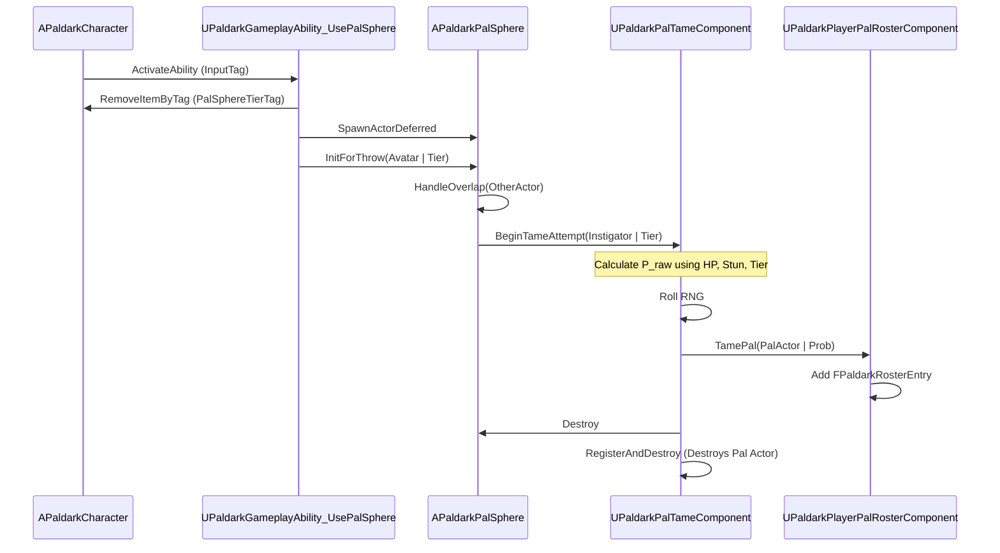
```mermaid
sequenceDiagram
    participant PC as APaldarkCharacter
    participant GA as UPaldarkGameplayAbility_UsePalSphere
    participant Sphere as APaldarkPalSphere
    participant TameComp as UPaldarkPalTameComponent
    participant Roster as UPaldarkPlayerPalRosterComponent
    PC->>GA: ActivateAbility (InputTag)
    GA->>PC: RemoveItemByTag (PalSphereTierTag)
    GA->>Sphere: SpawnActorDeferred
    GA->>Sphere: InitForThrow(Avatar | Tier)
    Sphere->>Sphere: HandleOverlap(OtherActor)
    Sphere->>TameComp: BeginTameAttempt(Instigator | Tier)
    Note over TameComp: Calculate P_raw using HP, Stun, Tier
    TameComp->>TameComp: Roll RNG
    TameComp->>Roster: TamePal(PalActor | Prob)
    Roster->>Roster: Add FPaldarkRosterEntry
    TameComp->>Sphere: Destroy
    TameComp->>TameComp: RegisterAndDestroy (Destroys Pal Actor)
```

Sources: [Source/PaldarkLab/Private/Gas/Abilities/PaldarkGameplayAbility_UsePalSphere.cpp#31-135](https://github.com/thanhtinpro/devin-paldarklab/blob/864c77b4/Source/PaldarkLab/Private/Gas/Abilities/PaldarkGameplayAbility_UsePalSphere.cpp#L31-L135)[Source/PaldarkLab/Private/Pal/Components/PaldarkPalTameComponent.cpp#48-147](https://github.com/thanhtinpro/devin-paldarklab/blob/864c77b4/Source/PaldarkLab/Private/Pal/Components/PaldarkPalTameComponent.cpp#L48-L147)[Source/PaldarkLab/Public/Pal/PaldarkPalSphere.h#10-17](https://github.com/thanhtinpro/devin-paldarklab/blob/864c77b4/Source/PaldarkLab/Public/Pal/PaldarkPalSphere.h#L10-L17)

## Pal Sphere Projectile

`APaldarkPalSphere` is a replicated projectile actor spawned on the server when a player uses the `UsePalSphere` ability.

### Key Implementation Details

- Initialization: The sphere is initialized via `InitForThrow`[Source/PaldarkLab/Public/Pal/PaldarkPalSphere.h#57](https://github.com/thanhtinpro/devin-paldarklab/blob/864c77b4/Source/PaldarkLab/Public/Pal/PaldarkPalSphere.h#L57-L57) which sets the `OwnerPlayer` and `PalSphereTierTag`.
- Movement: Uses a `UProjectileMovementComponent` configured for a gravity-affected arc (1500 cm/s) [Source/PaldarkLab/Public/Pal/PaldarkPalSphere.h#11-12](https://github.com/thanhtinpro/devin-paldarklab/blob/864c77b4/Source/PaldarkLab/Public/Pal/PaldarkPalSphere.h#L11-L12)
- Resolution Guard: The `bHasResolved` boolean [Source/PaldarkLab/Public/Pal/PaldarkPalSphere.h#104](https://github.com/thanhtinpro/devin-paldarklab/blob/864c77b4/Source/PaldarkLab/Public/Pal/PaldarkPalSphere.h#L104-L104) prevents re-entrancy, ensuring a single sphere cannot trigger multiple tame attempts if it overlaps multiple Pal collision hulls in a single tick.
- Server Authority: Overlap handling (`HandleOverlap`) is server-only, routing the attempt to the hit Pal's `UPaldarkPalTameComponent`[Source/PaldarkLab/Public/Pal/PaldarkPalSphere.h#16-17](https://github.com/thanhtinpro/devin-paldarklab/blob/864c77b4/Source/PaldarkLab/Public/Pal/PaldarkPalSphere.h#L16-L17)

Sources: [Source/PaldarkLab/Public/Pal/PaldarkPalSphere.h#1-105](https://github.com/thanhtinpro/devin-paldarklab/blob/864c77b4/Source/PaldarkLab/Public/Pal/PaldarkPalSphere.h#L1-L105)

## Tame Mechanic

The `UPaldarkPalTameComponent` (11th subobject on `APaldarkPalCharacter`) handles the logic and probability calculations for capturing a Pal.

### Capture Formula

The capture probability $P$ is calculated as:
$$P_{raw} = \frac{BaseCaptureProbability \times (1 - HpPct) \times (1 + StunPct) \times TierMultiplier}{TameDifficulty}$$
The result is clamped between `MinCaptureProbability` (0.01) and `MaxCaptureProbability` (0.99) [Source/PaldarkLab/Private/Pal/Components/PaldarkPalTameComponent.cpp#105-110](https://github.com/thanhtinpro/devin-paldarklab/blob/864c77b4/Source/PaldarkLab/Private/Pal/Components/PaldarkPalTameComponent.cpp#L105-L110)

| Variable | Description | Source |
| --- | --- | --- |
| `HpPct` | Current HP / Max HP. Must be < 0.8 (80%) to attempt capture. | [Source/PaldarkLab/Private/Pal/Components/PaldarkPalTameComponent.cpp#81-90](https://github.com/thanhtinpro/devin-paldarklab/blob/864c77b4/Source/PaldarkLab/Private/Pal/Components/PaldarkPalTameComponent.cpp#L81-L90) |
| `StunPct` | Current Stun / Max Stun. Higher stun increases probability. | [Source/PaldarkLab/Private/Pal/Components/PaldarkPalTameComponent.cpp#84-107](https://github.com/thanhtinpro/devin-paldarklab/blob/864c77b4/Source/PaldarkLab/Private/Pal/Components/PaldarkPalTameComponent.cpp#L84-L107) |
| `TierMultiplier` | T1: 1.0, T2: 1.5, T3: 2.0. | [Source/PaldarkLab/Private/Pal/Components/PaldarkPalTameComponent.cpp#171-186](https://github.com/thanhtinpro/devin-paldarklab/blob/864c77b4/Source/PaldarkLab/Private/Pal/Components/PaldarkPalTameComponent.cpp#L171-L186) |
| `TameDifficulty` | Species-specific divisor (e.g., Boltmane = 2.5). | [Source/PaldarkLab/Public/Pal/Components/PaldarkPalTameComponent.h#100-105](https://github.com/thanhtinpro/devin-paldarklab/blob/864c77b4/Source/PaldarkLab/Public/Pal/Components/PaldarkPalTameComponent.h#L100-L105) |

### Result Tags

The component broadcasts results using `EPaldarkTameResult`[Source/PaldarkLab/Public/Pal/Components/PaldarkPalTameComponent.h#58-64](https://github.com/thanhtinpro/devin-paldarklab/blob/864c77b4/Source/PaldarkLab/Public/Pal/Components/PaldarkPalTameComponent.h#L58-L64):

- Success: Pal is added to roster; actor is destroyed.
- FailHpTooHigh: Attempt rejected because HP > 80%. Sphere is consumed.
- FailRngMiss: RNG roll failed. Drains 30% of `MaxStun` to prevent infinite stun-locking via spam [Source/PaldarkLab/Private/Pal/Components/PaldarkPalTameComponent.cpp#136-142](https://github.com/thanhtinpro/devin-paldarklab/blob/864c77b4/Source/PaldarkLab/Private/Pal/Components/PaldarkPalTameComponent.cpp#L136-L142)

Sources: [Source/PaldarkLab/Private/Pal/Components/PaldarkPalTameComponent.cpp#1-186](https://github.com/thanhtinpro/devin-paldarklab/blob/864c77b4/Source/PaldarkLab/Private/Pal/Components/PaldarkPalTameComponent.cpp#L1-L186)[Source/PaldarkLab/Public/Pal/Components/PaldarkPalTameComponent.h#1-151](https://github.com/thanhtinpro/devin-paldarklab/blob/864c77b4/Source/PaldarkLab/Public/Pal/Components/PaldarkPalTameComponent.h#L1-L151)

## Player Pal Roster

`UPaldarkPlayerPalRosterComponent` is a match-scoped, transient component on `APaldarkCharacter` that stores captured Pals.

### Roster Storage and Replication

- Transient Nature: The roster is reset every match and is not persisted to the save-game directly from this component [Source/PaldarkLab/Public/Pal/PaldarkPlayerPalRosterComponent.h#4-5](https://github.com/thanhtinpro/devin-paldarklab/blob/864c77b4/Source/PaldarkLab/Public/Pal/PaldarkPlayerPalRosterComponent.h#L4-L5)
- Privacy: Uses `COND_OwnerOnly` replication so players cannot see each other's active rosters [Source/PaldarkLab/Public/Pal/PaldarkPlayerPalRosterComponent.h#138-139](https://github.com/thanhtinpro/devin-paldarklab/blob/864c77b4/Source/PaldarkLab/Public/Pal/PaldarkPlayerPalRosterComponent.h#L138-L139)
- FPaldarkRosterEntry: Stores snapshots of the Pal's state at the moment of capture, including `PalDefinitionId`, `SpeciesTag`, `BondLevel`, and `HealthAtTame`[Source/PaldarkLab/Public/Pal/PaldarkPlayerPalRosterComponent.h#34-68](https://github.com/thanhtinpro/devin-paldarklab/blob/864c77b4/Source/PaldarkLab/Public/Pal/PaldarkPlayerPalRosterComponent.h#L34-L68)

### Code Entity Mapping

The following diagram maps the logical taming concepts to their specific C++ classes and data structures.

Taming System Entity Map

[Flowchart Diagram]

Sources: [Source/PaldarkLab/Public/Pal/PaldarkPlayerPalRosterComponent.h#34-140](https://github.com/thanhtinpro/devin-paldarklab/blob/864c77b4/Source/PaldarkLab/Public/Pal/PaldarkPlayerPalRosterComponent.h#L34-L140)[Source/PaldarkLab/Public/Pal/Components/PaldarkPalTameComponent.h#75-131](https://github.com/thanhtinpro/devin-paldarklab/blob/864c77b4/Source/PaldarkLab/Public/Pal/Components/PaldarkPalTameComponent.h#L75-L131)[Source/PaldarkLab/Private/Pal/PaldarkPalDepositComponent.cpp#79-94](https://github.com/thanhtinpro/devin-paldarklab/blob/864c77b4/Source/PaldarkLab/Private/Pal/PaldarkPalDepositComponent.cpp#L79-L94)

### Hub Integration (Pal Stable)

When in the Hub Town, players can move Pals between their match-scoped roster and persistent storage:

- Deposit: `UPaldarkPalDepositComponent` on the `PlayerState` handles long-term storage [Source/PaldarkLab/Private/Pal/PaldarkPalDepositComponent.cpp#22-47](https://github.com/thanhtinpro/devin-paldarklab/blob/864c77b4/Source/PaldarkLab/Private/Pal/PaldarkPalDepositComponent.cpp#L22-L47)
- Healing: `HealEntryToFull` allows the Marketplace/Stable to restore a roster entry's HP [Source/PaldarkLab/Public/Pal/PaldarkPlayerPalRosterComponent.h#109](https://github.com/thanhtinpro/devin-paldarklab/blob/864c77b4/Source/PaldarkLab/Public/Pal/PaldarkPlayerPalRosterComponent.h#L109-L109)

Sources: [Source/PaldarkLab/Public/Pal/PaldarkPlayerPalRosterComponent.h#1-141](https://github.com/thanhtinpro/devin-paldarklab/blob/864c77b4/Source/PaldarkLab/Public/Pal/PaldarkPlayerPalRosterComponent.h#L1-L141)[Source/PaldarkLab/Private/Pal/PaldarkPalDepositComponent.cpp#1-167](https://github.com/thanhtinpro/devin-paldarklab/blob/864c77b4/Source/PaldarkLab/Private/Pal/PaldarkPalDepositComponent.cpp#L1-L167)

---

# Networking-and-Backend-Integration

# Networking and Backend Integration
Relevant source files

- [Documents/Devlog/W14-15-Build.md](https://github.com/thanhtinpro/devin-paldarklab/blob/864c77b4/Documents/Devlog/W14-15-Build.md?plain=1)
- [Source/PaldarkLab/Private/Backend/PaldarkBackendSubsystem.cpp](https://github.com/thanhtinpro/devin-paldarklab/blob/864c77b4/Source/PaldarkLab/Private/Backend/PaldarkBackendSubsystem.cpp)
- [Source/PaldarkLab/Private/Hub/PaldarkHubSubsystem.cpp](https://github.com/thanhtinpro/devin-paldarklab/blob/864c77b4/Source/PaldarkLab/Private/Hub/PaldarkHubSubsystem.cpp)
- [Source/PaldarkLab/Private/Net/PaldarkNetSubsystem.cpp](https://github.com/thanhtinpro/devin-paldarklab/blob/864c77b4/Source/PaldarkLab/Private/Net/PaldarkNetSubsystem.cpp)
- [Source/PaldarkLab/Public/Backend/PaldarkBackendSubsystem.h](https://github.com/thanhtinpro/devin-paldarklab/blob/864c77b4/Source/PaldarkLab/Public/Backend/PaldarkBackendSubsystem.h)
- [Source/PaldarkLab/Public/Backend/PaldarkBackendTypes.h](https://github.com/thanhtinpro/devin-paldarklab/blob/864c77b4/Source/PaldarkLab/Public/Backend/PaldarkBackendTypes.h)
- [Source/PaldarkLab/Public/Hub/PaldarkHubSubsystem.h](https://github.com/thanhtinpro/devin-paldarklab/blob/864c77b4/Source/PaldarkLab/Public/Hub/PaldarkHubSubsystem.h)
- [Source/PaldarkLab/Public/Net/PaldarkNetSubsystem.h](https://github.com/thanhtinpro/devin-paldarklab/blob/864c77b4/Source/PaldarkLab/Public/Net/PaldarkNetSubsystem.h)
- [Source/PaldarkLab/Public/Pal/PaldarkPalSphere.h](https://github.com/thanhtinpro/devin-paldarklab/blob/864c77b4/Source/PaldarkLab/Public/Pal/PaldarkPalSphere.h)
- [Source/PaldarkLab/Public/Save/PaldarkSaveTypes.h](https://github.com/thanhtinpro/devin-paldarklab/blob/864c77b4/Source/PaldarkLab/Public/Save/PaldarkSaveTypes.h)

The PaldarkLab networking stack provides a unified interface for session management, map travel, and AWS-integrated backend services. It abstracts the complexity of transitioning between the 8-player persistent Hub Town and the 4-player instanced Raid matches, while providing a seamless fallback for local development without cloud infrastructure.

The architecture centers on two primary `UGameInstanceSubsystem` components that persist across map boundaries, ensuring that session state and authentication tokens remain valid during `ServerTravel`.

### System Hierarchy and Code Entities

The following diagram maps the natural language concepts of the networking stack to their corresponding C++ entities and data structures.

Networking Entity Map

[Flowchart Diagram]

Sources: [Source/PaldarkLab/Public/Net/PaldarkNetSubsystem.h#3-5](https://github.com/thanhtinpro/devin-paldarklab/blob/864c77b4/Source/PaldarkLab/Public/Net/PaldarkNetSubsystem.h#L3-L5)[Source/PaldarkLab/Public/Backend/PaldarkBackendSubsystem.h#3-11](https://github.com/thanhtinpro/devin-paldarklab/blob/864c77b4/Source/PaldarkLab/Public/Backend/PaldarkBackendSubsystem.h#L3-L11)[Source/PaldarkLab/Public/Backend/PaldarkBackendTypes.h#23-27](https://github.com/thanhtinpro/devin-paldarklab/blob/864c77b4/Source/PaldarkLab/Public/Backend/PaldarkBackendTypes.h#L23-L27)

---

## Net Subsystem and Session Topology

The `UPaldarkNetSubsystem` manages the physical movement of players between servers. It provides high-level wrappers for hosting and joining sessions, specifically tailored for the Hub-and-Spoke meta-loop.

### Key Responsibilities

- Travel Coordination: Wraps `ServerTravel` and `ClientTravel` to handle Experience loading via URL options [Source/PaldarkLab/Private/Net/PaldarkNetSubsystem.cpp#142-146](https://github.com/thanhtinpro/devin-paldarklab/blob/864c77b4/Source/PaldarkLab/Private/Net/PaldarkNetSubsystem.cpp#L142-L146)
- Topology Awareness: Caches `Paldark.Net.Mode` (Standalone, ListenServer, DedicatedServer) and `Paldark.Net.Role` tags to allow gameplay systems to query the network state without `GetNetMode()` switches [Documents/Devlog/W14-15-Build.md#66-69](https://github.com/thanhtinpro/devin-paldarklab/blob/864c77b4/Documents/Devlog/W14-15-Build.md?plain=1#L66-L69)
- Fleet Integration: Consumes `FPaldarkFleetSpec` data from the backend to issue connection requests to AWS GameLift instances [Source/PaldarkLab/Public/Net/PaldarkNetSubsystem.h#141-148](https://github.com/thanhtinpro/devin-paldarklab/blob/864c77b4/Source/PaldarkLab/Public/Net/PaldarkNetSubsystem.h#L141-L148)

For detailed implementation of travel logic and session lifecycle, see [Net Subsystem and Session Topology](#11.1).

---

## AWS Backend Integration

The `UPaldarkBackendSubsystem` serves as the gateway to AWS cloud services. It handles authentication via AWS Cognito and session orchestration via AWS Lambda.

### Core Integration Components

- Authentication: Exchanges credentials for a JWT `FPaldarkSessionToken` containing Access and Refresh tokens [Source/PaldarkLab/Public/Backend/PaldarkBackendTypes.h#23-31](https://github.com/thanhtinpro/devin-paldarklab/blob/864c77b4/Source/PaldarkLab/Public/Backend/PaldarkBackendTypes.h#L23-L31)
- Fleet Allocation: Requests dedicated server instances for Hubs (8 players) or Raids (4 players) using `RequestHubFleet` and `RequestRaidFleet`[Source/PaldarkLab/Public/Backend/PaldarkBackendSubsystem.h#9-11](https://github.com/thanhtinpro/devin-paldarklab/blob/864c77b4/Source/PaldarkLab/Public/Backend/PaldarkBackendSubsystem.h#L9-L11)
- Mock Fallback: Includes a `bUseAWSBackend` toggle. When false, the system generates synthetic "loopback" fleet specs (127.0.0.1:7777) to support offline development [Source/PaldarkLab/Public/Backend/PaldarkBackendSubsystem.h#16-20](https://github.com/thanhtinpro/devin-paldarklab/blob/864c77b4/Source/PaldarkLab/Public/Backend/PaldarkBackendSubsystem.h#L16-L20)

### Backend Communication Flow

The diagram below illustrates the sequence for a player requesting a Raid session through the backend.

Raid Allocation Sequence

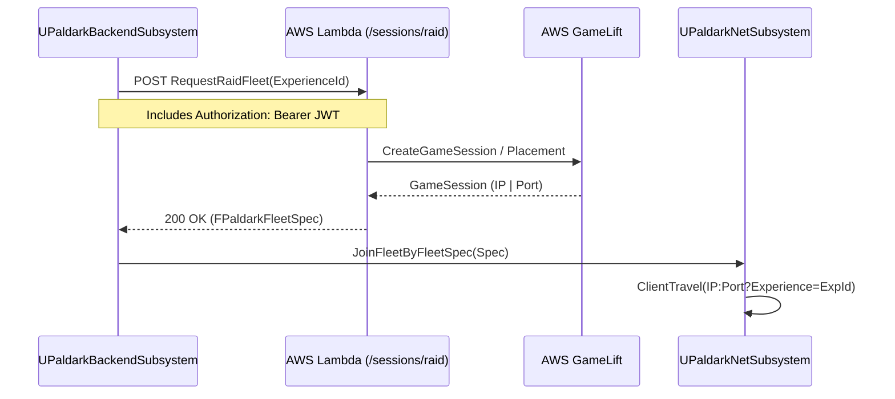
```mermaid
sequenceDiagram
    participant C as UPaldarkBackendSubsystem
    participant L as AWS Lambda (/sessions/raid)
    participant G as AWS GameLift
    participant N as UPaldarkNetSubsystem
    C->>L: POST RequestRaidFleet(ExperienceId)
    Note over C,L: Includes Authorization: Bearer JWT
    L->>G: CreateGameSession / Placement
    G-->>L: GameSession (IP | Port)
    L-->>C: 200 OK (FPaldarkFleetSpec)
    C->>N: JoinFleetByFleetSpec(Spec)
    N->>N: ClientTravel(IP:Port?Experience=ExpId)
```

Sources: [Source/PaldarkLab/Public/Backend/PaldarkBackendSubsystem.h#102-105](https://github.com/thanhtinpro/devin-paldarklab/blob/864c77b4/Source/PaldarkLab/Public/Backend/PaldarkBackendSubsystem.h#L102-L105)[Source/PaldarkLab/Public/Backend/PaldarkBackendTypes.h#86-94](https://github.com/thanhtinpro/devin-paldarklab/blob/864c77b4/Source/PaldarkLab/Public/Backend/PaldarkBackendTypes.h#L86-L94)[Source/PaldarkLab/Private/Net/PaldarkNetSubsystem.cpp#186-200](https://github.com/thanhtinpro/devin-paldarklab/blob/864c77b4/Source/PaldarkLab/Private/Net/PaldarkNetSubsystem.cpp#L186-L200)

For details on API contracts, JWT management, and AWS configuration, see [AWS Backend Integration](#11.2).

---

## Networking Data Structures

The system uses several POD (Plain Old Data) structs to pass network state across the engine.

| Struct | Purpose | Key Fields |
| --- | --- | --- |
| `FPaldarkNetSnapshot` | Local network status for HUD/Debug. | `Role`, `Mode`, `ConnectedPeerCount`, `MapName` |
| `FPaldarkSessionToken` | Cached JWT credentials. | `AccessToken`, `RefreshToken`, `ExpirySeconds` |
| `FPaldarkFleetSpec` | Connection info for a server. | `IP`, `Port`, `FleetTag`, `ExperienceId` |
| `FPaldarkBackendError` | Standardized error envelope. | `StatusCode`, `ResultTag`, `Message` |

Sources: [Source/PaldarkLab/Public/Net/PaldarkNetSubsystem.h#67-96](https://github.com/thanhtinpro/devin-paldarklab/blob/864c77b4/Source/PaldarkLab/Public/Net/PaldarkNetSubsystem.h#L67-L96)[Source/PaldarkLab/Public/Backend/PaldarkBackendTypes.h#33-176](https://github.com/thanhtinpro/devin-paldarklab/blob/864c77b4/Source/PaldarkLab/Public/Backend/PaldarkBackendTypes.h#L33-L176)

## Console Utilities

Both subsystems register console commands to facilitate testing and debugging in-editor:

- `Paldark.Net.Status`: Dumps current role, mode, and peer count [Source/PaldarkLab/Public/Net/PaldarkNetSubsystem.h#27-28](https://github.com/thanhtinpro/devin-paldarklab/blob/864c77b4/Source/PaldarkLab/Public/Net/PaldarkNetSubsystem.h#L27-L28)
- `Paldark.Backend.Login <email> <pass>`: Manually triggers the auth flow [Source/PaldarkLab/Private/Backend/PaldarkBackendSubsystem.cpp#51-55](https://github.com/thanhtinpro/devin-paldarklab/blob/864c77b4/Source/PaldarkLab/Private/Backend/PaldarkBackendSubsystem.cpp#L51-L55)
- `Paldark.Net.HostHub <Map>`: Initiates the Hub travel sequence (AWS or Local) [Source/PaldarkLab/Public/Net/PaldarkNetSubsystem.h#128-130](https://github.com/thanhtinpro/devin-paldarklab/blob/864c77b4/Source/PaldarkLab/Public/Net/PaldarkNetSubsystem.h#L128-L130)

Sources: [Source/PaldarkLab/Private/Net/PaldarkNetSubsystem.cpp#59-93](https://github.com/thanhtinpro/devin-paldarklab/blob/864c77b4/Source/PaldarkLab/Private/Net/PaldarkNetSubsystem.cpp#L59-L93)[Source/PaldarkLab/Private/Backend/PaldarkBackendSubsystem.cpp#49-73](https://github.com/thanhtinpro/devin-paldarklab/blob/864c77b4/Source/PaldarkLab/Private/Backend/PaldarkBackendSubsystem.cpp#L49-L73)

---

# Net-Subsystem-and-Session-Topology

# Net Subsystem and Session Topology
Relevant source files

- [Documents/Courses/06-Udemy-ue5-blueprint-multiplayer-crash-course.md](https://github.com/thanhtinpro/devin-paldarklab/blob/864c77b4/Documents/Courses/06-Udemy-ue5-blueprint-multiplayer-crash-course.md?plain=1)
- [Documents/Courses/07-Udemy-ue5-multiplayer-crash-course.md](https://github.com/thanhtinpro/devin-paldarklab/blob/864c77b4/Documents/Courses/07-Udemy-ue5-multiplayer-crash-course.md?plain=1)
- [Documents/Courses/10-Udemy-ue5-cpp-multiplayer-shooter.md](https://github.com/thanhtinpro/devin-paldarklab/blob/864c77b4/Documents/Courses/10-Udemy-ue5-cpp-multiplayer-shooter.md?plain=1)
- [Documents/Devlog/W14-15-Build.md](https://github.com/thanhtinpro/devin-paldarklab/blob/864c77b4/Documents/Devlog/W14-15-Build.md?plain=1)
- [Documents/UE5_Course/P02_Core_Framework.md](https://github.com/thanhtinpro/devin-paldarklab/blob/864c77b4/Documents/UE5_Course/P02_Core_Framework.md?plain=1)
- [Documents/UE5_Course/P06_Replication.md](https://github.com/thanhtinpro/devin-paldarklab/blob/864c77b4/Documents/UE5_Course/P06_Replication.md?plain=1)
- [Source/PaldarkLab/Private/Framework/PaldarkGameInstance.cpp](https://github.com/thanhtinpro/devin-paldarklab/blob/864c77b4/Source/PaldarkLab/Private/Framework/PaldarkGameInstance.cpp)
- [Source/PaldarkLab/Public/Framework/PaldarkGameInstance.h](https://github.com/thanhtinpro/devin-paldarklab/blob/864c77b4/Source/PaldarkLab/Public/Framework/PaldarkGameInstance.h)
- [Source/PaldarkLab/Public/Net/PaldarkNetSubsystem.h](https://github.com/thanhtinpro/devin-paldarklab/blob/864c77b4/Source/PaldarkLab/Public/Net/PaldarkNetSubsystem.h)

The Net Subsystem and Session Topology framework provides the backbone for PaldarkLab's multiplayer connectivity, handling the transition between Hub Town (8-player social space) and Raid (4-player extraction match) environments. It manages the lifecycle of network connections, tracks topology state (Dedicated vs. Listen vs. Standalone), and coordinates travel between local and AWS-hosted game instances.

## 1. UPaldarkNetSubsystem

`UPaldarkNetSubsystem` is a `UGameInstanceSubsystem`, ensuring it persists across level transitions and map travels [Source/PaldarkLab/Public/Net/PaldarkNetSubsystem.h#3-5](https://github.com/thanhtinpro/devin-paldarklab/blob/864c77b4/Source/PaldarkLab/Public/Net/PaldarkNetSubsystem.h#L3-L5) It acts as a centralized coordinator for hosting, joining, and monitoring the network state.

### Key Responsibilities

- Host Management: Provides wrappers for hosting listen servers (`HostListenServer`) and specialized raid/hub servers [Source/PaldarkLab/Public/Net/PaldarkNetSubsystem.h#107-139](https://github.com/thanhtinpro/devin-paldarklab/blob/864c77b4/Source/PaldarkLab/Public/Net/PaldarkNetSubsystem.h#L107-L139)
- Backend Coordination: Interfaces with `UPaldarkBackendSubsystem` to resolve AWS GameLift fleet specifications for dedicated server hosting [Source/PaldarkLab/Public/Net/PaldarkNetSubsystem.h#118-123](https://github.com/thanhtinpro/devin-paldarklab/blob/864c77b4/Source/PaldarkLab/Public/Net/PaldarkNetSubsystem.h#L118-L123)
- Topology Tracking: Maintains a `FPaldarkNetSnapshot` containing the current role, mode, peer count, and server address [Source/PaldarkLab/Public/Net/PaldarkNetSubsystem.h#67-96](https://github.com/thanhtinpro/devin-paldarklab/blob/864c77b4/Source/PaldarkLab/Public/Net/PaldarkNetSubsystem.h#L67-L96)
- Lifecycle Delegates: Broadcasts `OnPlayerLogin` and `OnPlayerLogout` events, which are consumed by UMG lobby widgets and the `UPaldarkSquadSubsystem`[Source/PaldarkLab/Public/Net/PaldarkNetSubsystem.h#47-64](https://github.com/thanhtinpro/devin-paldarklab/blob/864c77b4/Source/PaldarkLab/Public/Net/PaldarkNetSubsystem.h#L47-L64)

### Session Hosting Logic

The subsystem distinguishes between developer quick-testing and production AWS flows:

1. HostHubServer/HostRaidServer: If `bUseAWSBackend` is enabled, it requests a fleet from the backend and performs a `ClientTravel` to the returned IP [Source/PaldarkLab/Public/Net/PaldarkNetSubsystem.h#118-123](https://github.com/thanhtinpro/devin-paldarklab/blob/864c77b4/Source/PaldarkLab/Public/Net/PaldarkNetSubsystem.h#L118-L123)
2. Fallback: If AWS is disabled, it defaults to `HostListenServer`, appending `?listen` and the requested `ExperienceId` to the travel URL [Source/PaldarkLab/Public/Net/PaldarkNetSubsystem.h#124-125](https://github.com/thanhtinpro/devin-paldarklab/blob/864c77b4/Source/PaldarkLab/Public/Net/PaldarkNetSubsystem.h#L124-L125)

### Net Subsystem Entity Mapping

Title: Net Subsystem Entity Mapping

[Flowchart Diagram]

Sources: [Source/PaldarkLab/Public/Net/PaldarkNetSubsystem.h#107-148](https://github.com/thanhtinpro/devin-paldarklab/blob/864c77b4/Source/PaldarkLab/Public/Net/PaldarkNetSubsystem.h#L107-L148)[Source/PaldarkLab/Public/Net/PaldarkNetSubsystem.h#67-96](https://github.com/thanhtinpro/devin-paldarklab/blob/864c77b4/Source/PaldarkLab/Public/Net/PaldarkNetSubsystem.h#L67-L96)

---

## 2. Topology and Role Management

PaldarkLab uses a tag-based topology system to avoid scattering `GetNetMode()` switches throughout the codebase. These tags are cached in the subsystem and updated during world initialization [Documents/Devlog/W14-15-Build.md#66-69](https://github.com/thanhtinpro/devin-paldarklab/blob/864c77b4/Documents/Devlog/W14-15-Build.md?plain=1#L66-L69)

### Paldark.Net Tags

| Tag | ENetMode / ENetRole Equivalent | Description |
| --- | --- | --- |
| `Paldark.Net.Role.Host` | `NM_ListenServer` / `NM_Standalone` | The local machine is the authority and has a local player. |
| `Paldark.Net.Role.Client` | `NM_Client` | The local machine is a remote client. |
| `Paldark.Net.Mode.Standalone` | `NM_Standalone` | Single-player session. |
| `Paldark.Net.Mode.ListenServer` | `NM_ListenServer` | Multi-player session hosted by a player. |
| `Paldark.Net.Mode.DedicatedServer` | `NM_DedicatedServer` | Headless server instance. |

Sources: [Documents/Devlog/W14-15-Build.md#58-64](https://github.com/thanhtinpro/devin-paldarklab/blob/864c77b4/Documents/Devlog/W14-15-Build.md?plain=1#L58-L64)[Source/PaldarkLab/Public/Net/PaldarkNetSubsystem.h#71-81](https://github.com/thanhtinpro/devin-paldarklab/blob/864c77b4/Source/PaldarkLab/Public/Net/PaldarkNetSubsystem.h#L71-L81)

---

## 3. Persistent Session Logic (UPaldarkGameInstance)

`UPaldarkGameInstance` handles cross-level persistence and critical boot-time verification for dedicated servers.

### Dedicated Server Plugin Verification

On a dedicated server (`PaldarkLabServer` target), game feature plugins (like `PaldarkRaidContent`) may not automatically reach the `Active` state. `UPaldarkGameInstance::Init` invokes `EnsureFeaturePluginsActiveForDedicatedServer` to force-activate these plugins [Source/PaldarkLab/Private/Framework/PaldarkGameInstance.cpp#13-24](https://github.com/thanhtinpro/devin-paldarklab/blob/864c77b4/Source/PaldarkLab/Private/Framework/PaldarkGameInstance.cpp#L13-L24)

- Process: Iterates all discovered plugins via `IPluginManager`.
- Condition: If a plugin is enabled and `bIsGameFeaturePlugin` is true, it checks `UGameFeaturesSubsystem::GetPluginState`[Source/PaldarkLab/Private/Framework/PaldarkGameInstance.cpp#70-98](https://github.com/thanhtinpro/devin-paldarklab/blob/864c77b4/Source/PaldarkLab/Private/Framework/PaldarkGameInstance.cpp#L70-L98)
- Recovery: If the state is below `Active`, it calls `LoadAndActivateGameFeaturePlugin`[Source/PaldarkLab/Private/Framework/PaldarkGameInstance.cpp#109-121](https://github.com/thanhtinpro/devin-paldarklab/blob/864c77b4/Source/PaldarkLab/Private/Framework/PaldarkGameInstance.cpp#L109-L121)

Sources: [Source/PaldarkLab/Private/Framework/PaldarkGameInstance.cpp#8-25](https://github.com/thanhtinpro/devin-paldarklab/blob/864c77b4/Source/PaldarkLab/Private/Framework/PaldarkGameInstance.cpp#L8-L25)[Source/PaldarkLab/Private/Framework/PaldarkGameInstance.cpp#33-153](https://github.com/thanhtinpro/devin-paldarklab/blob/864c77b4/Source/PaldarkLab/Private/Framework/PaldarkGameInstance.cpp#L33-L153)[Source/PaldarkLab/Public/Framework/PaldarkGameInstance.h#7-22](https://github.com/thanhtinpro/devin-paldarklab/blob/864c77b4/Source/PaldarkLab/Public/Framework/PaldarkGameInstance.h#L7-L22)

---

## 4. Topology Refresh and Travel Boundaries

The network topology is refreshed at specific lifecycle boundaries to ensure the `FPaldarkNetSnapshot` remains accurate.

### Travel Flow and Persistence

PaldarkLab utilizes Seamless Travel for transitions between the Hub and Raid maps. This affects the lifetime of core framework classes:

- Reset: `AGameModeBase`, `AGameStateBase`, `APawn`[Documents/UE5_Course/P02_Core_Framework.md#128-132](https://github.com/thanhtinpro/devin-paldarklab/blob/864c77b4/Documents/UE5_Course/P02_Core_Framework.md?plain=1#L128-L132)
- Persist: `APlayerController`, `APlayerState` (carries progress/score), `UGameInstance`[Documents/UE5_Course/P02_Core_Framework.md#130-133](https://github.com/thanhtinpro/devin-paldarklab/blob/864c77b4/Documents/UE5_Course/P02_Core_Framework.md?plain=1#L130-L133)

### Connection Lifecycle Hooks

`APaldarkGameModeBase` manages the player count and session access:

1. PreLogin: Validates the `ConnectedPlayerCount` against `MaxPlayersPerSession` (default 4). Rejects the (N+1)th client [Documents/Devlog/W14-15-Build.md#116-120](https://github.com/thanhtinpro/devin-paldarklab/blob/864c77b4/Documents/Devlog/W14-15-Build.md?plain=1#L116-L120)
2. PostLogin: Increments player count and triggers the topology refresh [Documents/Devlog/W14-15-Build.md#121-122](https://github.com/thanhtinpro/devin-paldarklab/blob/864c77b4/Documents/Devlog/W14-15-Build.md?plain=1#L121-L122)
3. Logout: Decrements player count and cleans up squad/roster references [Documents/Devlog/W14-15-Build.md#123-124](https://github.com/thanhtinpro/devin-paldarklab/blob/864c77b4/Documents/Devlog/W14-15-Build.md?plain=1#L123-L124)

### Session Travel Topology

Title: Session Travel Topology

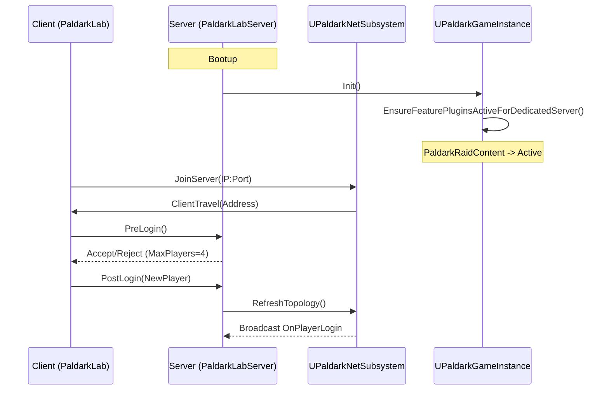
```mermaid
sequenceDiagram
    participant C as Client (PaldarkLab)
    participant S as Server (PaldarkLabServer)
    participant NS as UPaldarkNetSubsystem
    participant GI as UPaldarkGameInstance
    Note over S: Bootup
    S->>GI: Init()
    GI->>GI: EnsureFeaturePluginsActiveForDedicatedServer()
    Note over GI: PaldarkRaidContent -> Active
    C->>NS: JoinServer(IP:Port)
    NS->>C: ClientTravel(Address)
    C->>S: PreLogin()
    S-->>C: Accept/Reject (MaxPlayers=4)
    C->>S: PostLogin(NewPlayer)
    S->>NS: RefreshTopology()
    NS-->>S: Broadcast OnPlayerLogin
```

Sources: [Source/PaldarkLab/Private/Framework/PaldarkGameInstance.cpp#33-48](https://github.com/thanhtinpro/devin-paldarklab/blob/864c77b4/Source/PaldarkLab/Private/Framework/PaldarkGameInstance.cpp#L33-L48)[Source/PaldarkLab/Public/Net/PaldarkNetSubsystem.h#150-152](https://github.com/thanhtinpro/devin-paldarklab/blob/864c77b4/Source/PaldarkLab/Public/Net/PaldarkNetSubsystem.h#L150-L152)[Documents/Devlog/W14-15-Build.md#116-124](https://github.com/thanhtinpro/devin-paldarklab/blob/864c77b4/Documents/Devlog/W14-15-Build.md?plain=1#L116-L124)

---

# AWS-Backend-Integration

# AWS Backend Integration
Relevant source files

- [Documents/GameDesign/08-AWS_GameLift_GDD.md](https://github.com/thanhtinpro/devin-paldarklab/blob/864c77b4/Documents/GameDesign/08-AWS_GameLift_GDD.md?plain=1)
- [Source/PaldarkLab/Private/Backend/PaldarkBackendSettings.cpp](https://github.com/thanhtinpro/devin-paldarklab/blob/864c77b4/Source/PaldarkLab/Private/Backend/PaldarkBackendSettings.cpp)
- [Source/PaldarkLab/Private/Backend/PaldarkBackendSubsystem.cpp](https://github.com/thanhtinpro/devin-paldarklab/blob/864c77b4/Source/PaldarkLab/Private/Backend/PaldarkBackendSubsystem.cpp)
- [Source/PaldarkLab/Private/Hub/PaldarkHubSubsystem.cpp](https://github.com/thanhtinpro/devin-paldarklab/blob/864c77b4/Source/PaldarkLab/Private/Hub/PaldarkHubSubsystem.cpp)
- [Source/PaldarkLab/Private/Net/PaldarkNetSubsystem.cpp](https://github.com/thanhtinpro/devin-paldarklab/blob/864c77b4/Source/PaldarkLab/Private/Net/PaldarkNetSubsystem.cpp)
- [Source/PaldarkLab/Public/Backend/PaldarkBackendSettings.h](https://github.com/thanhtinpro/devin-paldarklab/blob/864c77b4/Source/PaldarkLab/Public/Backend/PaldarkBackendSettings.h)
- [Source/PaldarkLab/Public/Backend/PaldarkBackendSubsystem.h](https://github.com/thanhtinpro/devin-paldarklab/blob/864c77b4/Source/PaldarkLab/Public/Backend/PaldarkBackendSubsystem.h)
- [Source/PaldarkLab/Public/Backend/PaldarkBackendTypes.h](https://github.com/thanhtinpro/devin-paldarklab/blob/864c77b4/Source/PaldarkLab/Public/Backend/PaldarkBackendTypes.h)
- [Source/PaldarkLab/Public/Hub/PaldarkHubSubsystem.h](https://github.com/thanhtinpro/devin-paldarklab/blob/864c77b4/Source/PaldarkLab/Public/Hub/PaldarkHubSubsystem.h)
- [Source/PaldarkLab/Public/Pal/PaldarkPalSphere.h](https://github.com/thanhtinpro/devin-paldarklab/blob/864c77b4/Source/PaldarkLab/Public/Pal/PaldarkPalSphere.h)
- [Source/PaldarkLab/Public/Save/PaldarkSaveTypes.h](https://github.com/thanhtinpro/devin-paldarklab/blob/864c77b4/Source/PaldarkLab/Public/Save/PaldarkSaveTypes.h)

The AWS Backend Integration system provides the infrastructure for player authentication and dedicated server orchestration using AWS services (Cognito, Lambda, API Gateway, and GameLift). It enables a persistent online experience where players log in to a central account, maintain a session across map transitions, and are dynamically allocated to dedicated server "fleets" for Hub or Raid gameplay.

## System Overview

The integration is centered around the `UPaldarkBackendSubsystem`, a `UGameInstanceSubsystem` that manages the lifecycle of the player's session and coordinates with the `UPaldarkNetSubsystem` to perform server travel based on backend allocations [Source/PaldarkLab/Public/Backend/PaldarkBackendSubsystem.h#1-14](https://github.com/thanhtinpro/devin-paldarklab/blob/864c77b4/Source/PaldarkLab/Public/Backend/PaldarkBackendSubsystem.h#L1-L14)

### Key Features

- JWT Session Management: Handles Cognito-issued Access and Refresh tokens [Source/PaldarkLab/Public/Backend/PaldarkBackendTypes.h#23-31](https://github.com/thanhtinpro/devin-paldarklab/blob/864c77b4/Source/PaldarkLab/Public/Backend/PaldarkBackendTypes.h#L23-L31)
- Dynamic Fleet Allocation: Requests specific server instances (Hub or Raid) via Lambda endpoints [Source/PaldarkLab/Public/Backend/PaldarkBackendSubsystem.h#9-11](https://github.com/thanhtinpro/devin-paldarklab/blob/864c77b4/Source/PaldarkLab/Public/Backend/PaldarkBackendSubsystem.h#L9-L11)
- Mock Fallback: A developer-friendly `bUseAWSBackend` toggle allows the entire system to run in a "Loopback" mode, simulating backend responses for local testing without AWS infrastructure [Source/PaldarkLab/Public/Backend/PaldarkBackendSettings.h#39-49](https://github.com/thanhtinpro/devin-paldarklab/blob/864c77b4/Source/PaldarkLab/Public/Backend/PaldarkBackendSettings.h#L39-L49)
- Automatic Token Refresh: Proactively refreshes the JWT before expiry using a timer-driven lead window [Source/PaldarkLab/Public/Backend/PaldarkBackendSubsystem.h#12-13](https://github.com/thanhtinpro/devin-paldarklab/blob/864c77b4/Source/PaldarkLab/Public/Backend/PaldarkBackendSubsystem.h#L12-L13)

### Backend Architecture Diagram

This diagram bridges the Natural Language Space of AWS services to the Code Entity Space of the PaldarkLab classes and structs.

"AWS Backend System Mapping"

[Flowchart Diagram]

Sources: [Source/PaldarkLab/Public/Backend/PaldarkBackendSubsystem.h#1-35](https://github.com/thanhtinpro/devin-paldarklab/blob/864c77b4/Source/PaldarkLab/Public/Backend/PaldarkBackendSubsystem.h#L1-L35)[Source/PaldarkLab/Public/Backend/PaldarkBackendSettings.h#47-65](https://github.com/thanhtinpro/devin-paldarklab/blob/864c77b4/Source/PaldarkLab/Public/Backend/PaldarkBackendSettings.h#L47-L65)[Source/PaldarkLab/Public/Backend/PaldarkBackendTypes.h#86-94](https://github.com/thanhtinpro/devin-paldarklab/blob/864c77b4/Source/PaldarkLab/Public/Backend/PaldarkBackendTypes.h#L86-L94)[Documents/GameDesign/08-AWS_GameLift_GDD.md#46-65](https://github.com/thanhtinpro/devin-paldarklab/blob/864c77b4/Documents/GameDesign/08-AWS_GameLift_GDD.md?plain=1#L46-L65)

---

## Data Structures and Types

### FPaldarkSessionToken

Stores the authentication state for the current session. It includes a short-lived `AccessToken` for request authorization and a long-lived `RefreshToken` for obtaining new access tokens [Source/PaldarkLab/Public/Backend/PaldarkBackendTypes.h#33-46](https://github.com/thanhtinpro/devin-paldarklab/blob/864c77b4/Source/PaldarkLab/Public/Backend/PaldarkBackendTypes.h#L33-L46)

- IsValid(): Checks if the token is non-empty and has more than 60 seconds remaining before expiry [Source/PaldarkLab/Public/Backend/PaldarkBackendTypes.h#64-72](https://github.com/thanhtinpro/devin-paldarklab/blob/864c77b4/Source/PaldarkLab/Public/Backend/PaldarkBackendTypes.h#L64-L72)
- ExpirySeconds: UNIX epoch timestamp provided by Cognito [Source/PaldarkLab/Public/Backend/PaldarkBackendTypes.h#54-59](https://github.com/thanhtinpro/devin-paldarklab/blob/864c77b4/Source/PaldarkLab/Public/Backend/PaldarkBackendTypes.h#L54-L59)

### FPaldarkFleetSpec

The result envelope for a successful fleet allocation. It contains the connection details (`IP`, `Port`) and metadata (`FleetId`, `ExperienceId`) required to join a dedicated server [Source/PaldarkLab/Public/Backend/PaldarkBackendTypes.h#96-133](https://github.com/thanhtinpro/devin-paldarklab/blob/864c77b4/Source/PaldarkLab/Public/Backend/PaldarkBackendTypes.h#L96-L133)

- ShardKey: Used for Hub fleets to ensure players rejoin the same persistent shard [Source/PaldarkLab/Public/Backend/PaldarkBackendTypes.h#127-132](https://github.com/thanhtinpro/devin-paldarklab/blob/864c77b4/Source/PaldarkLab/Public/Backend/PaldarkBackendTypes.h#L127-L132)

### FPaldarkBackendError

A unified error structure containing an HTTP `StatusCode` and a `ResultTag` (e.g., `Paldark.Backend.Result.Fail.Auth`) to allow UMG widgets to branch on specific failure types [Source/PaldarkLab/Public/Backend/PaldarkBackendTypes.h#164-176](https://github.com/thanhtinpro/devin-paldarklab/blob/864c77b4/Source/PaldarkLab/Public/Backend/PaldarkBackendTypes.h#L164-L176)

Sources: [Source/PaldarkLab/Public/Backend/PaldarkBackendTypes.h#1-176](https://github.com/thanhtinpro/devin-paldarklab/blob/864c77b4/Source/PaldarkLab/Public/Backend/PaldarkBackendTypes.h#L1-L176)

---

## UPaldarkBackendSubsystem Implementation

The subsystem manages all async HTTP traffic and maintains the state machine for the backend connection.

### Core Lifecycle

- Initialize: Resets the session token and registers console commands (`Paldark.Backend.Login`, `Paldark.Backend.Status`, etc.) [Source/PaldarkLab/Private/Backend/PaldarkBackendSubsystem.cpp#42-78](https://github.com/thanhtinpro/devin-paldarklab/blob/864c77b4/Source/PaldarkLab/Private/Backend/PaldarkBackendSubsystem.cpp#L42-L78)
- Deinitialize: Crucially cancels all `InFlightRequests` and the token refresh timer to prevent the `IHttpRequest` callback from firing on a destroyed object [Source/PaldarkLab/Private/Backend/PaldarkBackendSubsystem.cpp#80-100](https://github.com/thanhtinpro/devin-paldarklab/blob/864c77b4/Source/PaldarkLab/Private/Backend/PaldarkBackendSubsystem.cpp#L80-L100)

### Request Flow and Data Flow

"Backend Request Pipeline"

```mermaid
sequenceDiagram
    participant UI as UMG / Console
    participant SUB as UPaldarkBackendSubsystem
    participant HTTP as IHttpRequest
    participant AWS as AWS Lambda
    UI->>SUB: Login(Email | Pass)
    SUB->>SUB: TransitionState(Authenticating)
    SUB->>HTTP: IssueHttpRequest("POST" | "/sessions/login")
    HTTP->>AWS: Request Body (JSON)
    AWS-->>HTTP: Response 200 (Token JSON)
    HTTP-->>SUB: OnProcessRequestComplete()
    SUB->>SUB: JsonObjectStringToUStruct(Token)
    SUB->>SUB: ScheduleTokenRefresh()
    SUB->>SUB: TransitionState(LoggedIn)
    SUB-->>UI: OnLoginCompleted.Broadcast()
```

Sources: [Source/PaldarkLab/Private/Backend/PaldarkBackendSubsystem.cpp#102-164](https://github.com/thanhtinpro/devin-paldarklab/blob/864c77b4/Source/PaldarkLab/Private/Backend/PaldarkBackendSubsystem.cpp#L102-L164)[Source/PaldarkLab/Public/Backend/PaldarkBackendSubsystem.h#132-137](https://github.com/thanhtinpro/devin-paldarklab/blob/864c77b4/Source/PaldarkLab/Public/Backend/PaldarkBackendSubsystem.h#L132-L137)

### Key Functions

| Function | Purpose | Behavior |
| --- | --- | --- |
| `Login` | Authenticates user | Async; exchanges credentials for JWT; no retries [Source/PaldarkLab/Public/Backend/PaldarkBackendSubsystem.h#87-88](https://github.com/thanhtinpro/devin-paldarklab/blob/864c77b4/Source/PaldarkLab/Public/Backend/PaldarkBackendSubsystem.h#L87-L88) |
| `RequestHubFleet` | Allocates Hub | Requests 8-player shard; supports `MaxRetries` and backoff [Source/PaldarkLab/Public/Backend/PaldarkBackendSubsystem.h#94-100](https://github.com/thanhtinpro/devin-paldarklab/blob/864c77b4/Source/PaldarkLab/Public/Backend/PaldarkBackendSubsystem.h#L94-L100) |
| `RequestRaidFleet` | Allocates Raid | Requests 4-player match; identical to Hub logic but with Raid tag [Source/PaldarkLab/Public/Backend/PaldarkBackendSubsystem.h#102-105](https://github.com/thanhtinpro/devin-paldarklab/blob/864c77b4/Source/PaldarkLab/Public/Backend/PaldarkBackendSubsystem.h#L102-L105) |
| `RefreshToken` | Renews JWT | Uses `RefreshToken` to update `AccessToken` before expiry [Source/PaldarkLab/Public/Backend/PaldarkBackendSubsystem.h#107-110](https://github.com/thanhtinpro/devin-paldarklab/blob/864c77b4/Source/PaldarkLab/Public/Backend/PaldarkBackendSubsystem.h#L107-L110) |
| `Logout` | Clears Session | Resets `SessionToken`, cancels timers, transitions to `LoggedOut`[Source/PaldarkLab/Public/Backend/PaldarkBackendSubsystem.h#91-92](https://github.com/thanhtinpro/devin-paldarklab/blob/864c77b4/Source/PaldarkLab/Public/Backend/PaldarkBackendSubsystem.h#L91-L92) |

Sources: [Source/PaldarkLab/Public/Backend/PaldarkBackendSubsystem.h#79-133](https://github.com/thanhtinpro/devin-paldarklab/blob/864c77b4/Source/PaldarkLab/Public/Backend/PaldarkBackendSubsystem.h#L79-L133)[Source/PaldarkLab/Private/Backend/PaldarkBackendSubsystem.cpp#166-184](https://github.com/thanhtinpro/devin-paldarklab/blob/864c77b4/Source/PaldarkLab/Private/Backend/PaldarkBackendSubsystem.cpp#L166-L184)

---

## Configuration and Settings

Backend knobs are managed via `UPaldarkBackendSettings`, which inherits from `UDeveloperSettings`. This allows configuration via `DefaultGame.ini` and exposure in the Project Settings -> Plugins -> Paldark Backend menu [Source/PaldarkLab/Public/Backend/PaldarkBackendSettings.h#1-15](https://github.com/thanhtinpro/devin-paldarklab/blob/864c77b4/Source/PaldarkLab/Public/Backend/PaldarkBackendSettings.h#L1-L15)

### Configuration Parameters

| Parameter | Default | Purpose |
| --- | --- | --- |
| `bUseAWSBackend` | `false` | Master switch between real AWS HTTP and synthetic mock responses [Source/PaldarkLab/Public/Backend/PaldarkBackendSettings.h#47-50](https://github.com/thanhtinpro/devin-paldarklab/blob/864c77b4/Source/PaldarkLab/Public/Backend/PaldarkBackendSettings.h#L47-L50) |
| `LambdaApiBaseUrl` | Empty | The endpoint for API Gateway (e.g., `https://.../prod`) [Source/PaldarkLab/Public/Backend/PaldarkBackendSettings.h#62-65](https://github.com/thanhtinpro/devin-paldarklab/blob/864c77b4/Source/PaldarkLab/Public/Backend/PaldarkBackendSettings.h#L62-L65) |
| `CognitoUserPoolId` | Empty | Sent as `X-Paldark-Pool` header for routing [Source/PaldarkLab/Public/Backend/PaldarkBackendSettings.h#70-72](https://github.com/thanhtinpro/devin-paldarklab/blob/864c77b4/Source/PaldarkLab/Public/Backend/PaldarkBackendSettings.h#L70-L72) |
| `TokenRefreshLeadSeconds` | `300` | Proactively refresh token 5 minutes before expiry [Source/PaldarkLab/Public/Backend/PaldarkBackendSettings.h#108-111](https://github.com/thanhtinpro/devin-paldarklab/blob/864c77b4/Source/PaldarkLab/Public/Backend/PaldarkBackendSettings.h#L108-L111) |
| `MaxRetries` | `3` | Automatic retries for fleet requests on 5xx/network errors [Source/PaldarkLab/Public/Backend/PaldarkBackendSettings.h#91-94](https://github.com/thanhtinpro/devin-paldarklab/blob/864c77b4/Source/PaldarkLab/Public/Backend/PaldarkBackendSettings.h#L91-L94) |

Sources: [Source/PaldarkLab/Public/Backend/PaldarkBackendSettings.h#29-112](https://github.com/thanhtinpro/devin-paldarklab/blob/864c77b4/Source/PaldarkLab/Public/Backend/PaldarkBackendSettings.h#L29-L112)

---

## Mock Fallback (Local Testing)

When `bUseAWSBackend` is false, the subsystem bypasses the HTTP stack entirely.

1. Login: Returns a synthetic `FPaldarkSessionToken` with `UserId = "mock-user"` on the next tick [Source/PaldarkLab/Private/Backend/PaldarkBackendSubsystem.cpp#123-124](https://github.com/thanhtinpro/devin-paldarklab/blob/864c77b4/Source/PaldarkLab/Private/Backend/PaldarkBackendSubsystem.cpp#L123-L124)
2. Fleet Requests: Returns `FPaldarkFleetSpec::MakeLoopback()`, which points to `127.0.0.1:7777`[Source/PaldarkLab/Public/Backend/PaldarkBackendTypes.h#146-156](https://github.com/thanhtinpro/devin-paldarklab/blob/864c77b4/Source/PaldarkLab/Public/Backend/PaldarkBackendTypes.h#L146-L156)
3. Net Subsystem Integration: `UPaldarkNetSubsystem::HostHubServer` and `HostRaidServer` use these loopback specs to trigger `ServerTravel` to a local listen server, preserving the W40-41 development workflow [Source/PaldarkLab/Private/Net/PaldarkNetSubsystem.cpp#157-184](https://github.com/thanhtinpro/devin-paldarklab/blob/864c77b4/Source/PaldarkLab/Private/Net/PaldarkNetSubsystem.cpp#L157-L184)

Sources: [Source/PaldarkLab/Public/Backend/PaldarkBackendTypes.h#141-157](https://github.com/thanhtinpro/devin-paldarklab/blob/864c77b4/Source/PaldarkLab/Public/Backend/PaldarkBackendTypes.h#L141-L157)[Source/PaldarkLab/Private/Net/PaldarkNetSubsystem.cpp#157-184](https://github.com/thanhtinpro/devin-paldarklab/blob/864c77b4/Source/PaldarkLab/Private/Net/PaldarkNetSubsystem.cpp#L157-L184)[Source/PaldarkLab/Private/Backend/PaldarkBackendSubsystem.cpp#177-180](https://github.com/thanhtinpro/devin-paldarklab/blob/864c77b4/Source/PaldarkLab/Private/Backend/PaldarkBackendSubsystem.cpp#L177-L180)

---

# Save-and-Persistence-System

# Save and Persistence System
Relevant source files

- [Source/PaldarkLab/Private/Backend/PaldarkBackendSubsystem.cpp](https://github.com/thanhtinpro/devin-paldarklab/blob/864c77b4/Source/PaldarkLab/Private/Backend/PaldarkBackendSubsystem.cpp)
- [Source/PaldarkLab/Private/Hub/PaldarkHubSubsystem.cpp](https://github.com/thanhtinpro/devin-paldarklab/blob/864c77b4/Source/PaldarkLab/Private/Hub/PaldarkHubSubsystem.cpp)
- [Source/PaldarkLab/Private/Net/PaldarkNetSubsystem.cpp](https://github.com/thanhtinpro/devin-paldarklab/blob/864c77b4/Source/PaldarkLab/Private/Net/PaldarkNetSubsystem.cpp)
- [Source/PaldarkLab/Private/Save/PaldarkPlayerSaveGame.cpp](https://github.com/thanhtinpro/devin-paldarklab/blob/864c77b4/Source/PaldarkLab/Private/Save/PaldarkPlayerSaveGame.cpp)
- [Source/PaldarkLab/Private/Save/PaldarkSaveSlotPickerWidget.cpp](https://github.com/thanhtinpro/devin-paldarklab/blob/864c77b4/Source/PaldarkLab/Private/Save/PaldarkSaveSlotPickerWidget.cpp)
- [Source/PaldarkLab/Private/Save/PaldarkSaveSubsystem.cpp](https://github.com/thanhtinpro/devin-paldarklab/blob/864c77b4/Source/PaldarkLab/Private/Save/PaldarkSaveSubsystem.cpp)
- [Source/PaldarkLab/Public/Backend/PaldarkBackendSubsystem.h](https://github.com/thanhtinpro/devin-paldarklab/blob/864c77b4/Source/PaldarkLab/Public/Backend/PaldarkBackendSubsystem.h)
- [Source/PaldarkLab/Public/Backend/PaldarkBackendTypes.h](https://github.com/thanhtinpro/devin-paldarklab/blob/864c77b4/Source/PaldarkLab/Public/Backend/PaldarkBackendTypes.h)
- [Source/PaldarkLab/Public/Hub/PaldarkHubSubsystem.h](https://github.com/thanhtinpro/devin-paldarklab/blob/864c77b4/Source/PaldarkLab/Public/Hub/PaldarkHubSubsystem.h)
- [Source/PaldarkLab/Public/Pal/PaldarkPalSphere.h](https://github.com/thanhtinpro/devin-paldarklab/blob/864c77b4/Source/PaldarkLab/Public/Pal/PaldarkPalSphere.h)
- [Source/PaldarkLab/Public/Save/PaldarkPlayerSaveGame.h](https://github.com/thanhtinpro/devin-paldarklab/blob/864c77b4/Source/PaldarkLab/Public/Save/PaldarkPlayerSaveGame.h)
- [Source/PaldarkLab/Public/Save/PaldarkSaveSlotPickerWidget.h](https://github.com/thanhtinpro/devin-paldarklab/blob/864c77b4/Source/PaldarkLab/Public/Save/PaldarkSaveSlotPickerWidget.h)
- [Source/PaldarkLab/Public/Save/PaldarkSaveSubsystem.h](https://github.com/thanhtinpro/devin-paldarklab/blob/864c77b4/Source/PaldarkLab/Public/Save/PaldarkSaveSubsystem.h)
- [Source/PaldarkLab/Public/Save/PaldarkSaveTypes.h](https://github.com/thanhtinpro/devin-paldarklab/blob/864c77b4/Source/PaldarkLab/Public/Save/PaldarkSaveTypes.h)

The Save and Persistence system provides a robust framework for capturing, serializing, and restoring player progression across sessions and server transitions. It manages the serialization of inventory states, Pal rosters, and meta-progression using an asynchronous pipeline to prevent game-thread hitches.

## Save Subsystem (UPaldarkSaveSubsystem)

`UPaldarkSaveSubsystem` is a `UGameInstanceSubsystem` that orchestrates the end-to-end persistence lifecycle. Because it resides in the `UGameInstance`, it survives `UWorld` teardowns during `ServerTravel` (e.g., moving from Hub to Raid) [Source/PaldarkLab/Public/Save/PaldarkSaveSubsystem.h#3-5](https://github.com/thanhtinpro/devin-paldarklab/blob/864c77b4/Source/PaldarkLab/Public/Save/PaldarkSaveSubsystem.h#L3-L5)

### Core Responsibilities

- Snapshot Capture: Iterates through live components on the `APaldarkCharacter` and `APaldarkPlayerState` to generate a `UPaldarkPlayerSaveGame` object [Source/PaldarkLab/Public/Save/PaldarkSaveSubsystem.h#30-35](https://github.com/thanhtinpro/devin-paldarklab/blob/864c77b4/Source/PaldarkLab/Public/Save/PaldarkSaveSubsystem.h#L30-L35)
- Async I/O: Wraps `UGameplayStatics::AsyncSaveGameToSlot` and `AsyncLoadGameFromSlot` to handle disk operations on background threads [Source/PaldarkLab/Public/Save/PaldarkSaveSubsystem.h#37-46](https://github.com/thanhtinpro/devin-paldarklab/blob/864c77b4/Source/PaldarkLab/Public/Save/PaldarkSaveSubsystem.h#L37-L46)
- Race-Condition Guarding: Maintains `InFlightSaveSlots` and `InFlightLoads` sets to prevent multiple simultaneous operations on the same slot [Source/PaldarkLab/Private/Save/PaldarkSaveSubsystem.cpp#112-118](https://github.com/thanhtinpro/devin-paldarklab/blob/864c77b4/Source/PaldarkLab/Private/Save/PaldarkSaveSubsystem.cpp#L112-L118)
- Automated Hooks: Listens for player extraction and logout events to trigger auto-saves [Source/PaldarkLab/Public/Save/PaldarkSaveSubsystem.h#7-19](https://github.com/thanhtinpro/devin-paldarklab/blob/864c77b4/Source/PaldarkLab/Public/Save/PaldarkSaveSubsystem.h#L7-L19)

### Save/Load Data Flow

The following diagram illustrates the transformation from live Actor components to serialized disk data.

Data Flow: Component to Disk

[Flowchart Diagram]

Sources: [Source/PaldarkLab/Public/Save/PaldarkSaveSubsystem.h#30-46](https://github.com/thanhtinpro/devin-paldarklab/blob/864c77b4/Source/PaldarkLab/Public/Save/PaldarkSaveSubsystem.h#L30-L46)[Source/PaldarkLab/Private/Save/PaldarkSaveSubsystem.cpp#120-146](https://github.com/thanhtinpro/devin-paldarklab/blob/864c77b4/Source/PaldarkLab/Private/Save/PaldarkSaveSubsystem.cpp#L120-L146)

## Data Structures and Serialization

The system uses specific "Saved" variants of runtime structs to ensure stability across content updates. Instead of storing soft object pointers (which break if assets are moved), the persistence layer stores `FGameplayTag` identifiers [Source/PaldarkLab/Public/Save/PaldarkSaveTypes.h#11-16](https://github.com/thanhtinpro/devin-paldarklab/blob/864c77b4/Source/PaldarkLab/Public/Save/PaldarkSaveTypes.h#L11-L16)

### Key Serialization Types

| Type | Purpose | Key Fields |
| --- | --- | --- |
| `FPaldarkRosterEntrySaved` | Represents a single Pal in storage. | `SpeciesTag`, `BondLevel`, `Nickname` |
| `FPaldarkInventoryEntrySaved` | Represents an item stack. | `ItemTag`, `StackCount` |
| `FPaldarkProgressSnapshot` | Meta-progression and onboarding. | `CompletedTutorials`, `UnlockedExperiences` |
| `UPaldarkPlayerSaveGame` | The `USaveGame` container. | `SchemaVersion`, `Timestamp`, `ActiveRoster` |

Sources: [Source/PaldarkLab/Public/Save/PaldarkSaveTypes.h#39-59](https://github.com/thanhtinpro/devin-paldarklab/blob/864c77b4/Source/PaldarkLab/Public/Save/PaldarkSaveTypes.h#L39-L59)[Source/PaldarkLab/Public/Save/PaldarkSaveTypes.h#82-93](https://github.com/thanhtinpro/devin-paldarklab/blob/864c77b4/Source/PaldarkLab/Public/Save/PaldarkSaveTypes.h#L82-L93)[Source/PaldarkLab/Public/Save/PaldarkSaveTypes.h#119-151](https://github.com/thanhtinpro/devin-paldarklab/blob/864c77b4/Source/PaldarkLab/Public/Save/PaldarkSaveTypes.h#L119-L151)

## Automation and Hooks

The subsystem automates persistence during critical gameplay transitions to ensure no progress is lost during crashes or intended logouts.

### Auto-Save Triggers

1. Extraction: When `UPaldarkMatchSubsystem` broadcasts `OnPlayerOutcomeChanged` with a status of `Extracted`, the system triggers a save with the `Paldark.Save.Trigger.HubReturn` tag [Source/PaldarkLab/Public/Save/PaldarkSaveSubsystem.h#9-13](https://github.com/thanhtinpro/devin-paldarklab/blob/864c77b4/Source/PaldarkLab/Public/Save/PaldarkSaveSubsystem.h#L9-L13)
2. Logout: The subsystem binds to `UPaldarkNetSubsystem::OnPlayerLogout` to capture state immediately before the PlayerController is destroyed [Source/PaldarkLab/Public/Save/PaldarkSaveSubsystem.h#15-19](https://github.com/thanhtinpro/devin-paldarklab/blob/864c77b4/Source/PaldarkLab/Public/Save/PaldarkSaveSubsystem.h#L15-L19)
3. Handoff Smoke: A specialized `RequestHubToRaidHandoffSmoke` function allows QA to manually simulate the save/load cycle used during map transitions [Source/PaldarkLab/Public/Save/PaldarkSaveSubsystem.h#21-27](https://github.com/thanhtinpro/devin-paldarklab/blob/864c77b4/Source/PaldarkLab/Public/Save/PaldarkSaveSubsystem.h#L21-L27)

Entity Association: Save Triggers

[Flowchart Diagram]

Sources: [Source/PaldarkLab/Private/Save/PaldarkSaveSubsystem.cpp#45-52](https://github.com/thanhtinpro/devin-paldarklab/blob/864c77b4/Source/PaldarkLab/Private/Save/PaldarkSaveSubsystem.cpp#L45-L52)[Source/PaldarkLab/Public/Save/PaldarkSaveSubsystem.h#148-157](https://github.com/thanhtinpro/devin-paldarklab/blob/864c77b4/Source/PaldarkLab/Public/Save/PaldarkSaveSubsystem.h#L148-L157)

## UI Bridge (UPaldarkSaveSlotPickerWidget)

The `UPaldarkSaveSlotPickerWidget` serves as a C++ base for designer-authored UMG widgets (e.g., `WBP_PaldarkSaveSlotPicker`). It handles the complex binding logic to the `UPaldarkSaveSubsystem` while exposing simple events to Blueprint [Source/PaldarkLab/Public/Save/PaldarkSaveSlotPickerWidget.h#1-24](https://github.com/thanhtinpro/devin-paldarklab/blob/864c77b4/Source/PaldarkLab/Public/Save/PaldarkSaveSlotPickerWidget.h#L1-L24)

### Key Functions

- RequestSave(SlotName): Initiates an async save via the subsystem [Source/PaldarkLab/Private/Save/PaldarkSaveSlotPickerWidget.cpp#60-75](https://github.com/thanhtinpro/devin-paldarklab/blob/864c77b4/Source/PaldarkLab/Private/Save/PaldarkSaveSlotPickerWidget.cpp#L60-L75)
- RequestLoad(SlotName): Initiates an async load [Source/PaldarkLab/Private/Save/PaldarkSaveSlotPickerWidget.cpp#77-90](https://github.com/thanhtinpro/devin-paldarklab/blob/864c77b4/Source/PaldarkLab/Private/Save/PaldarkSaveSlotPickerWidget.cpp#L77-L90)
- K2_OnSaveCompleted: A `BlueprintImplementableEvent` fired when the async operation finishes, allowing the UI to refresh its state or show a success toast [Source/PaldarkLab/Public/Save/PaldarkSaveSlotPickerWidget.h#103-108](https://github.com/thanhtinpro/devin-paldarklab/blob/864c77b4/Source/PaldarkLab/Public/Save/PaldarkSaveSlotPickerWidget.h#L103-L108)

Sources: [Source/PaldarkLab/Private/Save/PaldarkSaveSlotPickerWidget.cpp#18-35](https://github.com/thanhtinpro/devin-paldarklab/blob/864c77b4/Source/PaldarkLab/Private/Save/PaldarkSaveSlotPickerWidget.cpp#L18-L35)[Source/PaldarkLab/Public/Save/PaldarkSaveSlotPickerWidget.h#48-53](https://github.com/thanhtinpro/devin-paldarklab/blob/864c77b4/Source/PaldarkLab/Public/Save/PaldarkSaveSlotPickerWidget.h#L48-L53)

## Technical Implementation Details

### Race Condition Prevention

To prevent file corruption, the subsystem rejects save requests if an operation is already in flight for the target slot.

- Save Guard: `InFlightSaveSlots.Contains(SlotName)`[Source/PaldarkLab/Private/Save/PaldarkSaveSubsystem.cpp#112-118](https://github.com/thanhtinpro/devin-paldarklab/blob/864c77b4/Source/PaldarkLab/Private/Save/PaldarkSaveSubsystem.cpp#L112-L118)
- Load Guard: `InFlightLoads` maintains a queue of pending load operations [Source/PaldarkLab/Private/Save/PaldarkSaveSubsystem.cpp#170-173](https://github.com/thanhtinpro/devin-paldarklab/blob/864c77b4/Source/PaldarkLab/Private/Save/PaldarkSaveSubsystem.cpp#L170-L173)

### Schema Versioning

`UPaldarkPlayerSaveGame` includes a `SchemaVersion` integer. Upon loading, the subsystem validates this version; if a mismatch is detected, the load is rejected to prevent crashes from deprecated data structures [Source/PaldarkLab/Public/Save/PaldarkSaveSubsystem.h#43-46](https://github.com/thanhtinpro/devin-paldarklab/blob/864c77b4/Source/PaldarkLab/Public/Save/PaldarkSaveSubsystem.h#L43-L46)

### Default Slot Naming

The system uses `GetDefaultSlotName(PC)` to generate unique filenames based on the player's unique network ID. This ensures that in local play-in-editor (PIE) sessions with multiple clients, each instance maintains its own isolated save file [Source/PaldarkLab/Public/Save/PaldarkSaveSubsystem.h#50-52](https://github.com/thanhtinpro/devin-paldarklab/blob/864c77b4/Source/PaldarkLab/Public/Save/PaldarkSaveSubsystem.h#L50-L52)

Sources: [Source/PaldarkLab/Private/Save/PaldarkSaveSubsystem.cpp#104-107](https://github.com/thanhtinpro/devin-paldarklab/blob/864c77b4/Source/PaldarkLab/Private/Save/PaldarkSaveSubsystem.cpp#L104-L107)[Source/PaldarkLab/Private/Save/PaldarkSaveSubsystem.cpp#258-261](https://github.com/thanhtinpro/devin-paldarklab/blob/864c77b4/Source/PaldarkLab/Private/Save/PaldarkSaveSubsystem.cpp#L258-L261)

---

# World-and-Map-System

# World and Map System
Relevant source files

- [Source/PaldarkLab/Private/Loot/PaldarkLootTable.cpp](https://github.com/thanhtinpro/devin-paldarklab/blob/864c77b4/Source/PaldarkLab/Private/Loot/PaldarkLootTable.cpp)
- [Source/PaldarkLab/Private/Map/PaldarkMapConsoleCommands.cpp](https://github.com/thanhtinpro/devin-paldarklab/blob/864c77b4/Source/PaldarkLab/Private/Map/PaldarkMapConsoleCommands.cpp)
- [Source/PaldarkLab/Private/Map/PaldarkMapDefinition.cpp](https://github.com/thanhtinpro/devin-paldarklab/blob/864c77b4/Source/PaldarkLab/Private/Map/PaldarkMapDefinition.cpp)
- [Source/PaldarkLab/Private/Map/PaldarkPOISubsystem.cpp](https://github.com/thanhtinpro/devin-paldarklab/blob/864c77b4/Source/PaldarkLab/Private/Map/PaldarkPOISubsystem.cpp)
- [Source/PaldarkLab/Private/Map/PaldarkPalSpawnPoint.cpp](https://github.com/thanhtinpro/devin-paldarklab/blob/864c77b4/Source/PaldarkLab/Private/Map/PaldarkPalSpawnPoint.cpp)
- [Source/PaldarkLab/Private/Map/PaldarkPointOfInterest.cpp](https://github.com/thanhtinpro/devin-paldarklab/blob/864c77b4/Source/PaldarkLab/Private/Map/PaldarkPointOfInterest.cpp)
- [Source/PaldarkLab/Private/Pal/PaldarkHostilePalSpawner.cpp](https://github.com/thanhtinpro/devin-paldarklab/blob/864c77b4/Source/PaldarkLab/Private/Pal/PaldarkHostilePalSpawner.cpp)
- [Source/PaldarkLab/Private/Pal/PaldarkPalDefinition.cpp](https://github.com/thanhtinpro/devin-paldarklab/blob/864c77b4/Source/PaldarkLab/Private/Pal/PaldarkPalDefinition.cpp)
- [Source/PaldarkLab/Public/Framework/PaldarkGameStateBase.h](https://github.com/thanhtinpro/devin-paldarklab/blob/864c77b4/Source/PaldarkLab/Public/Framework/PaldarkGameStateBase.h)
- [Source/PaldarkLab/Public/Map/PaldarkMapDefinition.h](https://github.com/thanhtinpro/devin-paldarklab/blob/864c77b4/Source/PaldarkLab/Public/Map/PaldarkMapDefinition.h)
- [Source/PaldarkLab/Public/Map/PaldarkPOISubsystem.h](https://github.com/thanhtinpro/devin-paldarklab/blob/864c77b4/Source/PaldarkLab/Public/Map/PaldarkPOISubsystem.h)
- [Source/PaldarkLab/Public/Map/PaldarkPalSpawnPoint.h](https://github.com/thanhtinpro/devin-paldarklab/blob/864c77b4/Source/PaldarkLab/Public/Map/PaldarkPalSpawnPoint.h)
- [Source/PaldarkLab/Public/Map/PaldarkPointOfInterest.h](https://github.com/thanhtinpro/devin-paldarklab/blob/864c77b4/Source/PaldarkLab/Public/Map/PaldarkPointOfInterest.h)
- [Source/PaldarkLab/Public/Pal/PaldarkHostilePalSpawner.h](https://github.com/thanhtinpro/devin-paldarklab/blob/864c77b4/Source/PaldarkLab/Public/Pal/PaldarkHostilePalSpawner.h)
- [Source/PaldarkLab/Public/Pal/PaldarkPalSpawnSubsystem.h](https://github.com/thanhtinpro/devin-paldarklab/blob/864c77b4/Source/PaldarkLab/Public/Pal/PaldarkPalSpawnSubsystem.h)

The World and Map system provides the structural metadata and runtime registry for playable environments. It shifts the project from brittle hard-coded level references to a data-driven model using `UPaldarkMapDefinition`. This system also manages Points of Interest (POI) for AI navigation/budgeting and a sophisticated Pal spawning pipeline that supports both designer-placed points and procedural pack spawning.

## Map Definitions and Content Structure

Playable maps are defined via `UPaldarkMapDefinition` primary data assets located in `Content/Paldark/Maps/`. These assets decouple the gameplay metadata (player counts, expected POIs) from the actual `.umap` asset.

### UPaldarkMapDefinition

This class serves as the source of truth for a level's configuration [Source/PaldarkLab/Public/Map/PaldarkMapDefinition.h#57-58](https://github.com/thanhtinpro/devin-paldarklab/blob/864c77b4/Source/PaldarkLab/Public/Map/PaldarkMapDefinition.h#L57-L58) It is registered as a primary asset type, allowing the `UPaldarkAssetManager` to discover and load maps by row name [Source/PaldarkLab/Public/Map/PaldarkMapDefinition.h#21-25](https://github.com/thanhtinpro/devin-paldarklab/blob/864c77b4/Source/PaldarkLab/Public/Map/PaldarkMapDefinition.h#L21-L25)

| Field | Purpose |
| --- | --- |
| `MapTag` | Stable identity tag (e.g., `Paldark.Map.RungHong`) used for logic checks [Source/PaldarkLab/Public/Map/PaldarkMapDefinition.h#72](https://github.com/thanhtinpro/devin-paldarklab/blob/864c77b4/Source/PaldarkLab/Public/Map/PaldarkMapDefinition.h#L72-L72) |
| `MapAsset` | Soft pointer to the `UWorld` asset to prevent circular dependencies [Source/PaldarkLab/Public/Map/PaldarkMapDefinition.h#85](https://github.com/thanhtinpro/devin-paldarklab/blob/864c77b4/Source/PaldarkLab/Public/Map/PaldarkMapDefinition.h#L85-L85) |
| `RecommendedPOICount` | Designer hint for validation; used to check if a map is "complete" [Source/PaldarkLab/Public/Map/PaldarkMapDefinition.h#104](https://github.com/thanhtinpro/devin-paldarklab/blob/864c77b4/Source/PaldarkLab/Public/Map/PaldarkMapDefinition.h#L104-L104) |
| `IntrinsicTagsToAssert` | Tags required by the map (species, POI types) for AI Director planning [Source/PaldarkLab/Public/Map/PaldarkMapDefinition.h#119](https://github.com/thanhtinpro/devin-paldarklab/blob/864c77b4/Source/PaldarkLab/Public/Map/PaldarkMapDefinition.h#L119-L119) |
| `bIsIndoor` | Hint for the Significance Manager to use tighter LOD distances [Source/PaldarkLab/Public/Map/PaldarkMapDefinition.h#129](https://github.com/thanhtinpro/devin-paldarklab/blob/864c77b4/Source/PaldarkLab/Public/Map/PaldarkMapDefinition.h#L129-L129) |

Sources:[Source/PaldarkLab/Public/Map/PaldarkMapDefinition.h#1-140](https://github.com/thanhtinpro/devin-paldarklab/blob/864c77b4/Source/PaldarkLab/Public/Map/PaldarkMapDefinition.h#L1-L140)[Source/PaldarkLab/Private/Map/PaldarkMapDefinition.cpp#1-26](https://github.com/thanhtinpro/devin-paldarklab/blob/864c77b4/Source/PaldarkLab/Private/Map/PaldarkMapDefinition.cpp#L1-L26)

---

## Point of Interest (POI) Subsystem

The `UPaldarkPOISubsystem` is a server-authoritative world subsystem that maintains a registry of all `APaldarkPointOfInterest` actors in the current world [Source/PaldarkLab/Public/Map/PaldarkPOISubsystem.h#44-46](https://github.com/thanhtinpro/devin-paldarklab/blob/864c77b4/Source/PaldarkLab/Public/Map/PaldarkPOISubsystem.h#L44-L46)

### POI Registration Flow

POIs register themselves during `BeginPlay`[Source/PaldarkLab/Private/Map/PaldarkPointOfInterest.cpp#48-51](https://github.com/thanhtinpro/devin-paldarklab/blob/864c77b4/Source/PaldarkLab/Private/Map/PaldarkPointOfInterest.cpp#L48-L51) To handle race conditions where a POI might spawn before the subsystem is ready, the subsystem performs a "Sweep" using `TActorIterator` during its own initialization and again on `OnWorldBeginPlay`[Source/PaldarkLab/Private/Map/PaldarkPOISubsystem.cpp#30-51](https://github.com/thanhtinpro/devin-paldarklab/blob/864c77b4/Source/PaldarkLab/Private/Map/PaldarkPOISubsystem.cpp#L30-L51)

### Technical Entity Mapping: POI System

The following diagram maps the relationship between the designer-placed actors and the management subsystem.

[Flowchart Diagram]

### Key Query Functions

- `GetNearestPOI(Location, MaxRadius)`: Performs an O(N) sweep to find the closest POI [Source/PaldarkLab/Private/Map/PaldarkPOISubsystem.cpp#151-170](https://github.com/thanhtinpro/devin-paldarklab/blob/864c77b4/Source/PaldarkLab/Private/Map/PaldarkPOISubsystem.cpp#L151-L170)
- `GetPOIsByTag(InTag)`: Returns all POIs matching a specific `Paldark.POI.Type.*` tag [Source/PaldarkLab/Private/Map/PaldarkPOISubsystem.cpp#115-133](https://github.com/thanhtinpro/devin-paldarklab/blob/864c77b4/Source/PaldarkLab/Private/Map/PaldarkPOISubsystem.cpp#L115-L133)
- `GetPOIsByDangerTier(InTier)`: Filters POIs by `EPaldarkPOIDangerTier` (Low, Medium, High) [Source/PaldarkLab/Private/Map/PaldarkPOISubsystem.cpp#135-149](https://github.com/thanhtinpro/devin-paldarklab/blob/864c77b4/Source/PaldarkLab/Private/Map/PaldarkPOISubsystem.cpp#L135-L149)

Sources:[Source/PaldarkLab/Public/Map/PaldarkPOISubsystem.h#1-104](https://github.com/thanhtinpro/devin-paldarklab/blob/864c77b4/Source/PaldarkLab/Public/Map/PaldarkPOISubsystem.h#L1-L104)[Source/PaldarkLab/Private/Map/PaldarkPOISubsystem.cpp#1-221](https://github.com/thanhtinpro/devin-paldarklab/blob/864c77b4/Source/PaldarkLab/Private/Map/PaldarkPOISubsystem.cpp#L1-L221)[Source/PaldarkLab/Public/Map/PaldarkPointOfInterest.h#41-46](https://github.com/thanhtinpro/devin-paldarklab/blob/864c77b4/Source/PaldarkLab/Public/Map/PaldarkPointOfInterest.h#L41-L46)

---

## Pal Spawning Systems

The codebase provides two primary methods for populating the world with Pals: single-point spawning and pack-based spawning.

### 1. Pal Spawn Points (Single Instances)

`APaldarkPalSpawnPoint` is used for precise placement of individual Pals. It supports two resolution paths [Source/PaldarkLab/Public/Map/PaldarkPalSpawnPoint.h#1-25](https://github.com/thanhtinpro/devin-paldarklab/blob/864c77b4/Source/PaldarkLab/Public/Map/PaldarkPalSpawnPoint.h#L1-L25):

1. Definition Path: Uses `UPaldarkPalSpawnSubsystem::SpawnPalAsync` to load a `UPaldarkPalDefinition` before spawning.
2. Class Path: Fallback that directly spawns a `TSubclassOf<APaldarkPalCharacter>`.

### 2. Hostile Pal Spawners (Packs)

`APaldarkHostilePalSpawner` (often called a "Pal Den") spawns a cluster of Pals (default 4) and distributes waypoints among them for patrolling [Source/PaldarkLab/Public/Pal/PaldarkHostilePalSpawner.h#1-18](https://github.com/thanhtinpro/devin-paldarklab/blob/864c77b4/Source/PaldarkLab/Public/Pal/PaldarkHostilePalSpawner.h#L1-L18) It uses `SpawnHostilePackAt` to scatter Pals within a `SpawnSpreadRadius` and snap them to the ground via line traces [Source/PaldarkLab/Public/Pal/PaldarkHostilePalSpawner.h#97-110](https://github.com/thanhtinpro/devin-paldarklab/blob/864c77b4/Source/PaldarkLab/Public/Pal/PaldarkHostilePalSpawner.h#L97-L110)

### 3. Pal Spawn Subsystem (Async Pipeline)

The `UPaldarkPalSpawnSubsystem` manages the asynchronous loading of Pal assets (meshes, animations, abilities) using `FStreamableManager`[Source/PaldarkLab/Public/Pal/PaldarkPalSpawnSubsystem.h#1-15](https://github.com/thanhtinpro/devin-paldarklab/blob/864c77b4/Source/PaldarkLab/Public/Pal/PaldarkPalSpawnSubsystem.h#L1-L15)

```mermaid
sequenceDiagram
    participant S as APaldarkPalSpawnPoint
    participant Sub as UPaldarkPalSpawnSubsystem
    participant AM as UAssetManager
    participant P as APaldarkPalCharacter
    S->>Sub: SpawnPalAsync(DefId | Transform)
    Sub->>AM: LoadPrimaryAsset(DefId | "Spawn" Bundle)
    AM-->>Sub: Load Complete
    Sub->>Sub: FindWarmedDefinition(DefId)
    Sub->>P: SpawnActor(PalClass)
    Sub->>P: Apply Mesh/Anim/Abilities from Definition
    Sub-->>S: OnSpawned Callback
```

Sources:[Source/PaldarkLab/Public/Map/PaldarkPalSpawnPoint.h#64-153](https://github.com/thanhtinpro/devin-paldarklab/blob/864c77b4/Source/PaldarkLab/Public/Map/PaldarkPalSpawnPoint.h#L64-L153)[Source/PaldarkLab/Public/Pal/PaldarkHostilePalSpawner.h#41-111](https://github.com/thanhtinpro/devin-paldarklab/blob/864c77b4/Source/PaldarkLab/Public/Pal/PaldarkHostilePalSpawner.h#L41-L111)[Source/PaldarkLab/Public/Pal/PaldarkPalSpawnSubsystem.h#1-155](https://github.com/thanhtinpro/devin-paldarklab/blob/864c77b4/Source/PaldarkLab/Public/Pal/PaldarkPalSpawnSubsystem.h#L1-L155)

---

## Console Commands

The system includes several developer utilities for map and POI validation [Source/PaldarkLab/Private/Map/PaldarkMapConsoleCommands.cpp#1-20](https://github.com/thanhtinpro/devin-paldarklab/blob/864c77b4/Source/PaldarkLab/Private/Map/PaldarkMapConsoleCommands.cpp#L1-L20)

| Command | Function |
| --- | --- |
| `Paldark.POI.Dump` | Logs every registered POI with its type, tier, and coordinates to `LogPaldarkLab`[Source/PaldarkLab/Private/Map/PaldarkMapConsoleCommands.cpp#40-55](https://github.com/thanhtinpro/devin-paldarklab/blob/864c77b4/Source/PaldarkLab/Private/Map/PaldarkMapConsoleCommands.cpp#L40-L55) |
| `Paldark.POI.HighlightTier <Tier>` | Draws debug spheres around POIs of the specified tier (Low/Medium/High) for 5 seconds [Source/PaldarkLab/Private/Map/PaldarkMapConsoleCommands.cpp#57-123](https://github.com/thanhtinpro/devin-paldarklab/blob/864c77b4/Source/PaldarkLab/Private/Map/PaldarkMapConsoleCommands.cpp#L57-L123) |
| `Paldark.Map.LoadDefinition <RowName>` | Async-loads a map definition and prints its metadata to verify AssetManager configuration [Source/PaldarkLab/Private/Map/PaldarkMapConsoleCommands.cpp#125-178](https://github.com/thanhtinpro/devin-paldarklab/blob/864c77b4/Source/PaldarkLab/Private/Map/PaldarkMapConsoleCommands.cpp#L125-L178) |

Sources:[Source/PaldarkLab/Private/Map/PaldarkMapConsoleCommands.cpp#1-195](https://github.com/thanhtinpro/devin-paldarklab/blob/864c77b4/Source/PaldarkLab/Private/Map/PaldarkMapConsoleCommands.cpp#L1-L195)

---

# CI-CD,-Tooling,-and-Developer-Utilities

# CI/CD, Tooling, and Developer Utilities
Relevant source files

- [Content/Paldark/Inventory/Backpacks/README.txt](https://github.com/thanhtinpro/devin-paldarklab/blob/864c77b4/Content/Paldark/Inventory/Backpacks/README.txt)
- [Source/PaldarkLab/PaldarkLab.cpp](https://github.com/thanhtinpro/devin-paldarklab/blob/864c77b4/Source/PaldarkLab/PaldarkLab.cpp)
- [Source/PaldarkLab/PaldarkLab.h](https://github.com/thanhtinpro/devin-paldarklab/blob/864c77b4/Source/PaldarkLab/PaldarkLab.h)
- [Source/PaldarkLab/Private/Actors/PaldarkLabSampleActor.cpp](https://github.com/thanhtinpro/devin-paldarklab/blob/864c77b4/Source/PaldarkLab/Private/Actors/PaldarkLabSampleActor.cpp)
- [Source/PaldarkLab/Private/Player/Components/PaldarkPlayerInventoryComponent.cpp](https://github.com/thanhtinpro/devin-paldarklab/blob/864c77b4/Source/PaldarkLab/Private/Player/Components/PaldarkPlayerInventoryComponent.cpp)
- [Source/PaldarkLab/Public/Actors/PaldarkLabSampleActor.h](https://github.com/thanhtinpro/devin-paldarklab/blob/864c77b4/Source/PaldarkLab/Public/Actors/PaldarkLabSampleActor.h)
- [Source/PaldarkLab/Public/Player/Components/PaldarkPlayerInventoryComponent.h](https://github.com/thanhtinpro/devin-paldarklab/blob/864c77b4/Source/PaldarkLab/Public/Player/Components/PaldarkPlayerInventoryComponent.h)
- [Source/PaldarkLab/Public/Subsystems/PaldarkLabWorldSubsystem.h](https://github.com/thanhtinpro/devin-paldarklab/blob/864c77b4/Source/PaldarkLab/Public/Subsystems/PaldarkLabWorldSubsystem.h)
- [Source/PaldarkLabCore/Private/PaldarkGameplayTags.cpp](https://github.com/thanhtinpro/devin-paldarklab/blob/864c77b4/Source/PaldarkLabCore/Private/PaldarkGameplayTags.cpp)
- [Source/PaldarkLabCore/Public/PaldarkGameplayTags.h](https://github.com/thanhtinpro/devin-paldarklab/blob/864c77b4/Source/PaldarkLabCore/Public/PaldarkGameplayTags.h)
- [Source/PaldarkLabEditor/PaldarkLabEditor.Build.cs](https://github.com/thanhtinpro/devin-paldarklab/blob/864c77b4/Source/PaldarkLabEditor/PaldarkLabEditor.Build.cs)
- [Source/PaldarkLabEditor/Private/PaldarkLabEditor.cpp](https://github.com/thanhtinpro/devin-paldarklab/blob/864c77b4/Source/PaldarkLabEditor/Private/PaldarkLabEditor.cpp)
- [Source/PaldarkLabEditor/Public/PaldarkLabEditor.h](https://github.com/thanhtinpro/devin-paldarklab/blob/864c77b4/Source/PaldarkLabEditor/Public/PaldarkLabEditor.h)
- [scripts/ci/validate_paldarklab.py](https://github.com/thanhtinpro/devin-paldarklab/blob/864c77b4/scripts/ci/validate_paldarklab.py)

This section documents the infrastructure supporting the PaldarkLab development lifecycle, including automated structural validation, the editor-specific module, and the extensive suite of console commands used for system testing and designer iteration.

## CI Structural Validation

PaldarkLab utilizes a custom Python-based validation script, `validate_paldarklab.py`, located in `scripts/ci/`. This script is designed to run in a CI environment (such as GitHub Actions) without requiring the full Unreal Engine SDK. It enforces structural contracts and project-specific coding standards established during early development.

### Validation Pipeline

The script performs several critical checks to ensure project integrity:

| Check Type | Description |
| --- | --- |
| Project Manifest | Parses `PaldarkLab.uproject` to verify the three core modules (`PaldarkLab`, `PaldarkLabCore`, `PaldarkLabEditor`) and their loading phases. [scripts/ci/validate_paldarklab.py#31-35](https://github.com/thanhtinpro/devin-paldarklab/blob/864c77b4/scripts/ci/validate_paldarklab.py#L31-L35) |
| Build Targets | Verifies existence of `PaldarkLab.Target.cs`, `PaldarkLabEditor.Target.cs`, and `PaldarkLabServer.Target.cs`. [scripts/ci/validate_paldarklab.py#37-41](https://github.com/thanhtinpro/devin-paldarklab/blob/864c77b4/scripts/ci/validate_paldarklab.py#L37-L41) |
| Module Structure | Ensures each module folder contains a valid `.Build.cs` and the mandatory `IMPLEMENT_MODULE` or `IMPLEMENT_PRIMARY_GAME_MODULE` macros. [scripts/ci/validate_paldarklab.py#7-9](https://github.com/thanhtinpro/devin-paldarklab/blob/864c77b4/scripts/ci/validate_paldarklab.py#L7-L9) |
| Logging Consistency | Enforces that exactly the 7 project-specific log categories (e.g., `LogPaldarkPal`, `LogPaldarkGAS`) are declared in C++ and mirrored in `DefaultEngine.ini`. [scripts/ci/validate_paldarklab.py#43-59](https://github.com/thanhtinpro/devin-paldarklab/blob/864c77b4/scripts/ci/validate_paldarklab.py#L43-L59) |
| Source Integrity | Validates that no source file contains a UTF-8 BOM (Byte Order Mark), as required by project roadmap W1. [scripts/ci/validate_paldarklab.py#14](https://github.com/thanhtinpro/devin-paldarklab/blob/864c77b4/scripts/ci/validate_paldarklab.py#L14-L14) |
| Class Enforcement | Checks for expected header/CPP pairs for critical framework classes (e.g., `APaldarkCharacter`, `UPaldarkExperienceDefinition`). [scripts/ci/validate_paldarklab.py#65-89](https://github.com/thanhtinpro/devin-paldarklab/blob/864c77b4/scripts/ci/validate_paldarklab.py#L65-L89) |

### Code Entity Space: CI Validation

The following diagram maps the validation script logic to the project file structure.

CI Validation Logic Flow

Sources:`scripts/ci/validate_paldarklab.py:1-89`, `Source/PaldarkLab/PaldarkLab.cpp:1-10`.

---

## Developer Utilities and Console Commands

The `PaldarkLab` module registers approximately 60 console commands to allow designers and engineers to test complex gameplay systems (GAS, AI, Inventory, Hub) without needing a fully realized UI. These commands are managed by `FPaldarkLabModule` and registered during `StartupModule`. [Source/PaldarkLab/PaldarkLab.h#12-20](https://github.com/thanhtinpro/devin-paldarklab/blob/864c77b4/Source/PaldarkLab/PaldarkLab.h#L12-L20)

### Key Command Groups

#### 1. Experience and Input

Used to verify the Lyra-inspired experience loading pipeline and Enhanced Input bindings.

- `Paldark.Experience.Current`: Prints the active experience ID. [Source/PaldarkLab/PaldarkLab.cpp#110-128](https://github.com/thanhtinpro/devin-paldarklab/blob/864c77b4/Source/PaldarkLab/PaldarkLab.cpp#L110-L128)
- `Paldark.Input.ListBindings`: Lists all active Input Mapping Contexts (IMCs) and InputConfig rows for the local player. [Source/PaldarkLab/PaldarkLab.h#27](https://github.com/thanhtinpro/devin-paldarklab/blob/864c77b4/Source/PaldarkLab/PaldarkLab.h#L27-L27)

#### 2. Pal AI and Spawning

Commands to manipulate the Pal AI FSM and test the async spawning subsystem.

- `Paldark.Pal.SetActivity <Idle|Follow|Investigate>`: Forces every Pal AI into a specific state. [Source/PaldarkLab/PaldarkLab.cpp#9-10](https://github.com/thanhtinpro/devin-paldarklab/blob/864c77b4/Source/PaldarkLab/PaldarkLab.cpp#L9-L10)
- `Paldark.Pal.SpawnFromDefinition <DefId>`: Exercises `UPaldarkPalSpawnSubsystem` by async-loading a `PaldarkPalDefinition` and spawning the actor. [Source/PaldarkLab/PaldarkLab.cpp#20-22](https://github.com/thanhtinpro/devin-paldarklab/blob/864c77b4/Source/PaldarkLab/PaldarkLab.cpp#L20-L22)

#### 3. Gameplay Ability System (GAS)

Used for real-time attribute debugging and damage testing.

- `Paldark.Gas.DumpAttributes`: Logs `Health`, `Stamina`, `MoveSpeed`, and `Armor` for all actors implementing `IAbilitySystemInterface`. [Source/PaldarkLab/PaldarkLab.cpp#12](https://github.com/thanhtinpro/devin-paldarklab/blob/864c77b4/Source/PaldarkLab/PaldarkLab.cpp#L12-L12)
- `Paldark.Gas.Damage <Amount>`: Applies a SetByCaller magnitude damage effect to the local player. [Source/PaldarkLab/PaldarkLab.cpp#13](https://github.com/thanhtinpro/devin-paldarklab/blob/864c77b4/Source/PaldarkLab/PaldarkLab.cpp#L13-L13)

#### 4. Inventory and Hub Systems

Commands to manage the player's items and Hub-specific transactions.

- `Paldark.Inventory.Add <Tag> [Count]`: Adds items via `Paldark.Item.*` tags. [Source/PaldarkLab/PaldarkLab.cpp#17](https://github.com/thanhtinpro/devin-paldarklab/blob/864c77b4/Source/PaldarkLab/PaldarkLab.cpp#L17-L17)
- `Paldark.Hub.Stable.Heal <Idx>`: Triggers a server RPC via `UPaldarkStableController` to refill a Pal's HP in exchange for credits. [Source/PaldarkLab/PaldarkLab.cpp#26](https://github.com/thanhtinpro/devin-paldarklab/blob/864c77b4/Source/PaldarkLab/PaldarkLab.cpp#L26-L26)

### Code Entity Space: Command Execution

The following diagram illustrates how a console command interacts with the runtime systems.

Console Command Data Flow

```mermaid
sequenceDiagram
    participant User as "Developer Console"
    participant Module as "FPaldarkLabModule"
    participant Logic as "HandleInventoryAddCommand"
    participant Comp as "UPaldarkPlayerInventoryComponent"
    User->>Module: "Paldark.Inventory.Add Paldark.Item.Pistol 1"
    Module->>Logic: "Args: {Paldark.Item.Pistol, 1}"
    Logic->>Comp: "AddItem(ItemDef | 1)"
    Comp-->>Logic: "AddedCount: 1"
    Logic-->>User: "UE_LOG(LogPaldark | Log | ...)"
```

Sources:`Source/PaldarkLab/PaldarkLab.cpp:16-19`, `Source/PaldarkLab/Public/Player/Components/PaldarkPlayerInventoryComponent.h:136-154`.

---

## PaldarkLabEditor Module

The `PaldarkLabEditor` module is a dedicated `Editor` type module [Source/PaldarkLabEditor/PaldarkLabEditor.Build.cs#7-8](https://github.com/thanhtinpro/devin-paldarklab/blob/864c77b4/Source/PaldarkLabEditor/PaldarkLabEditor.Build.cs#L7-L8) that ensures editor-only utilities do not bleed into cooked game builds.

### Module Characteristics

- Loading Phase:`Default` (within the Editor target). [scripts/ci/validate_paldarklab.py#34](https://github.com/thanhtinpro/devin-paldarklab/blob/864c77b4/scripts/ci/validate_paldarklab.py#L34-L34)
- Dependencies: Depends on `UnrealEd`, `AssetTools`, and the project's runtime modules (`PaldarkLab`, `PaldarkLabCore`). [Source/PaldarkLabEditor/PaldarkLabEditor.Build.cs#18-21](https://github.com/thanhtinpro/devin-paldarklab/blob/864c77b4/Source/PaldarkLabEditor/PaldarkLabEditor.Build.cs#L18-L21)
- Role: Serves as the future host for custom Asset Type Actions, Blueprint node extensions, and automated asset validators. [Source/PaldarkLabEditor/Public/PaldarkLabEditor.h#1-3](https://github.com/thanhtinpro/devin-paldarklab/blob/864c77b4/Source/PaldarkLabEditor/Public/PaldarkLabEditor.h#L1-L3)

Sources:`Source/PaldarkLabEditor/PaldarkLabEditor.Build.cs:1-24`, `Source/PaldarkLabEditor/Private/PaldarkLabEditor.cpp:1-19`.

---

## Native Tag Registry Consistency

The `PaldarkLabCore` module contains the `PaldarkGameplayTags` namespace, which is the authoritative source for C++ tag references. To ensure the CI script and the C++ code remain synchronized, the validator checks `PaldarkGameplayTags.h` and `.cpp` against a hardcoded list of mandatory tags. [scripts/ci/validate_paldarklab.py#124-140](https://github.com/thanhtinpro/devin-paldarklab/blob/864c77b4/scripts/ci/validate_paldarklab.py#L124-L140)

### Tag Registry Implementation

- Declaration: Uses `UE_DECLARE_GAMEPLAY_TAG_EXTERN` in the header. [Source/PaldarkLabCore/Public/PaldarkGameplayTags.h#27-35](https://github.com/thanhtinpro/devin-paldarklab/blob/864c77b4/Source/PaldarkLabCore/Public/PaldarkGameplayTags.h#L27-L35)
- Definition: Uses `UE_DEFINE_GAMEPLAY_TAG` in the source file, which registers the tag at module load (PreDefault phase). [Source/PaldarkLabCore/Private/PaldarkGameplayTags.cpp#6-12](https://github.com/thanhtinpro/devin-paldarklab/blob/864c77b4/Source/PaldarkLabCore/Private/PaldarkGameplayTags.cpp#L6-L12)

Sources:`Source/PaldarkLabCore/Public/PaldarkGameplayTags.h:1-44`, `Source/PaldarkLabCore/Private/PaldarkGameplayTags.cpp:1-13`.

---

# Reference-Learning-Resources-and-Design-Documents

# Reference: Learning Resources and Design Documents
Relevant source files

- [Documents/Courses/12-Udemy-ue4-pro-unreal-engine-game-coding.md](https://github.com/thanhtinpro/devin-paldarklab/blob/864c77b4/Documents/Courses/12-Udemy-ue4-pro-unreal-engine-game-coding.md?plain=1)
- [Documents/Courses/13-Udemy-ue5-multiplayer-in-unreal-with-gas-and-aws-dedicated-servers.md](https://github.com/thanhtinpro/devin-paldarklab/blob/864c77b4/Documents/Courses/13-Udemy-ue5-multiplayer-in-unreal-with-gas-and-aws-dedicated-servers.md?plain=1)
- [Documents/Courses/14-Udemy-ue5-exploring-lyra-for-game-development.md](https://github.com/thanhtinpro/devin-paldarklab/blob/864c77b4/Documents/Courses/14-Udemy-ue5-exploring-lyra-for-game-development.md?plain=1)
- [Documents/Courses/15-Udemy-ue5-build-an-rpg-using-lyra-framework.md](https://github.com/thanhtinpro/devin-paldarklab/blob/864c77b4/Documents/Courses/15-Udemy-ue5-build-an-rpg-using-lyra-framework.md?plain=1)
- [Documents/Donchitos_GameStudios_Framework.md](https://github.com/thanhtinpro/devin-paldarklab/blob/864c77b4/Documents/Donchitos_GameStudios_Framework.md?plain=1)
- [Documents/GameDesign/01-ActionRoguelike_GDD.md](https://github.com/thanhtinpro/devin-paldarklab/blob/864c77b4/Documents/GameDesign/01-ActionRoguelike_GDD.md?plain=1)
- [Documents/GameDesign/02-Palworld_GDD.md](https://github.com/thanhtinpro/devin-paldarklab/blob/864c77b4/Documents/GameDesign/02-Palworld_GDD.md?plain=1)
- [Documents/GameDesign/03-PUBG_GDD.md](https://github.com/thanhtinpro/devin-paldarklab/blob/864c77b4/Documents/GameDesign/03-PUBG_GDD.md?plain=1)
- [Documents/GameDesign/04-ReadyOrNot_GDD.md](https://github.com/thanhtinpro/devin-paldarklab/blob/864c77b4/Documents/GameDesign/04-ReadyOrNot_GDD.md?plain=1)
- [Documents/GameDesign/10-MP_Shooter_GDD.md](https://github.com/thanhtinpro/devin-paldarklab/blob/864c77b4/Documents/GameDesign/10-MP_Shooter_GDD.md?plain=1)
- [Documents/GameDesign/12-Pro_UE_GDD.md](https://github.com/thanhtinpro/devin-paldarklab/blob/864c77b4/Documents/GameDesign/12-Pro_UE_GDD.md?plain=1)
- [Documents/GameDesign/13-Crunch_GDD.md](https://github.com/thanhtinpro/devin-paldarklab/blob/864c77b4/Documents/GameDesign/13-Crunch_GDD.md?plain=1)
- [Documents/GameDesign/14-Exploring_Lyra_GDD.md](https://github.com/thanhtinpro/devin-paldarklab/blob/864c77b4/Documents/GameDesign/14-Exploring_Lyra_GDD.md?plain=1)
- [Documents/GameDesign/15-Lyra_RPG_GDD.md](https://github.com/thanhtinpro/devin-paldarklab/blob/864c77b4/Documents/GameDesign/15-Lyra_RPG_GDD.md?plain=1)
- [Documents/Learning_Roadmap.md](https://github.com/thanhtinpro/devin-paldarklab/blob/864c77b4/Documents/Learning_Roadmap.md?plain=1)
- [Documents/Methodology/00-Vision_Reverse_Engineering.md](https://github.com/thanhtinpro/devin-paldarklab/blob/864c77b4/Documents/Methodology/00-Vision_Reverse_Engineering.md?plain=1)
- [Documents/Methodology/01-Donchitos_Applied.md](https://github.com/thanhtinpro/devin-paldarklab/blob/864c77b4/Documents/Methodology/01-Donchitos_Applied.md?plain=1)
- [Documents/PALDARK/02-Pillar_Coverage.md](https://github.com/thanhtinpro/devin-paldarklab/blob/864c77b4/Documents/PALDARK/02-Pillar_Coverage.md?plain=1)
- [Documents/PALDARK/04-Resource_Map.md](https://github.com/thanhtinpro/devin-paldarklab/blob/864c77b4/Documents/PALDARK/04-Resource_Map.md?plain=1)
- [Documents/Projects/PUBG_Assessment.md](https://github.com/thanhtinpro/devin-paldarklab/blob/864c77b4/Documents/Projects/PUBG_Assessment.md?plain=1)
- [Documents/Projects/ReadyOrNot_Assessment.md](https://github.com/thanhtinpro/devin-paldarklab/blob/864c77b4/Documents/Projects/ReadyOrNot_Assessment.md?plain=1)
- [Documents/UE5_Core_Pillars.md](https://github.com/thanhtinpro/devin-paldarklab/blob/864c77b4/Documents/UE5_Core_Pillars.md?plain=1)
- [Documents/UE5_Course/00-Course_Index.md](https://github.com/thanhtinpro/devin-paldarklab/blob/864c77b4/Documents/UE5_Course/00-Course_Index.md?plain=1)
- [Documents/UE5_Course/P03_Composition.md](https://github.com/thanhtinpro/devin-paldarklab/blob/864c77b4/Documents/UE5_Course/P03_Composition.md?plain=1)
- [Documents/UE5_Course/P07_Dedicated_Server.md](https://github.com/thanhtinpro/devin-paldarklab/blob/864c77b4/Documents/UE5_Course/P07_Dedicated_Server.md?plain=1)
- [Documents/UE5_Course/P12_DataDriven.md](https://github.com/thanhtinpro/devin-paldarklab/blob/864c77b4/Documents/UE5_Course/P12_DataDriven.md?plain=1)
- [Documents/UE5_Course/P13_SaveLoad.md](https://github.com/thanhtinpro/devin-paldarklab/blob/864c77b4/Documents/UE5_Course/P13_SaveLoad.md?plain=1)
- [Documents/UE5_Course/P14_AssetMgr.md](https://github.com/thanhtinpro/devin-paldarklab/blob/864c77b4/Documents/UE5_Course/P14_AssetMgr.md?plain=1)
- [Documents/UE5_Course/P15_Performance.md](https://github.com/thanhtinpro/devin-paldarklab/blob/864c77b4/Documents/UE5_Course/P15_Performance.md?plain=1)
- [Documents/UE5_Course/P17_Lyra.md](https://github.com/thanhtinpro/devin-paldarklab/blob/864c77b4/Documents/UE5_Course/P17_Lyra.md?plain=1)
- [Documents/UE5_Course/P18_Backend_LiveOps.md](https://github.com/thanhtinpro/devin-paldarklab/blob/864c77b4/Documents/UE5_Course/P18_Backend_LiveOps.md?plain=1)

The PaldarkLab codebase is not built in isolation; it is the result of a rigorous reverse-engineering and synthesis process involving AAA game architectures (Palworld, Ready or Not, PUBG) and professional Unreal Engine 5 learning paths. This page serves as a technical index for the `Documents/` directory, mapping specific codebase systems to their intellectual origins and design methodologies.

## 1. Intellectual Source Matrix

PaldarkLab utilizes a "Pillar-first" approach, where features are mapped against 18 core UE5 technical pillars. The following table identifies the primary sources for each major system.

| System | Primary Influence | Documentation Reference |
| --- | --- | --- |
| Experience Framework | Lyra Starter Game | [Documents/UE5_Course/P17_Lyra.md#1-20](https://github.com/thanhtinpro/devin-paldarklab/blob/864c77b4/Documents/UE5_Course/P17_Lyra.md?plain=1#L1-L20) |
| AI Activity FSM | Ready or Not (VOID Interactive) | [Documents/GameDesign/04-ReadyOrNot_GDD.md#94-104](https://github.com/thanhtinpro/devin-paldarklab/blob/864c77b4/Documents/GameDesign/04-ReadyOrNot_GDD.md?plain=1#L94-L104) |
| GAS Architecture | Aura (RPG) & Crunch (MOBA) | [Documents/GameDesign/13-Crunch_GDD.md#90-98](https://github.com/thanhtinpro/devin-paldarklab/blob/864c77b4/Documents/GameDesign/13-Crunch_GDD.md?plain=1#L90-L98) |
| Inventory Fragments | UE5 Inventory Course [09] | [Documents/UE5_Course/P11_Inventory.md#1-10](https://github.com/thanhtinpro/devin-paldarklab/blob/864c77b4/Documents/UE5_Course/P11_Inventory.md?plain=1#L1-L10) |
| Lag Compensation | Multiplayer Shooter [10] | [Documents/UE5_Course/P06_Replication.md#132-140](https://github.com/thanhtinpro/devin-paldarklab/blob/864c77b4/Documents/UE5_Course/P06_Replication.md?plain=1#L132-L140) |
| Backend/AWS | GameLift & AWS Lambda | [Documents/UE5_Course/P18_Backend_LiveOps.md#1-10](https://github.com/thanhtinpro/devin-paldarklab/blob/864c77b4/Documents/UE5_Course/P18_Backend_LiveOps.md?plain=1#L1-L10) |

Sources: [Documents/UE5_Course/00-Course_Index.md#32-52](https://github.com/thanhtinpro/devin-paldarklab/blob/864c77b4/Documents/UE5_Course/00-Course_Index.md?plain=1#L32-L52)[Documents/PALDARK/02-Pillar_Coverage.md#10-31](https://github.com/thanhtinpro/devin-paldarklab/blob/864c77b4/Documents/PALDARK/02-Pillar_Coverage.md?plain=1#L10-L31)

## 2. Design Methodology: The Donchitos Framework

The project follows the Donchitos Game Studios Framework, a reverse-engineering methodology used to deconstruct existing games into actionable C++ patterns. This involves a 7-phase process: Brainstorm, Decompose, Define, Game Pillars, Architecture Decisions (ADR), System Map, and Stories Taught.

### Natural Language to Code Entity Mapping (AI System)

The diagram below illustrates how natural language requirements from the "Ready or Not" assessment were transformed into concrete C++ entities in PaldarkLab.

AI System Transition: Requirement to Implementation

[Flowchart Diagram]

Sources: [Documents/Projects/ReadyOrNot_Assessment.md#91-99](https://github.com/thanhtinpro/devin-paldarklab/blob/864c77b4/Documents/Projects/ReadyOrNot_Assessment.md?plain=1#L91-L99)[Documents/GameDesign/04-ReadyOrNot_GDD.md#151-169](https://github.com/thanhtinpro/devin-paldarklab/blob/864c77b4/Documents/GameDesign/04-ReadyOrNot_GDD.md?plain=1#L151-L169)

## 3. The 18-Pillar Architecture

PaldarkLab is structured around 18 technical pillars. The codebase achieves 17/18 pillar coverage at ≥90% maturity, specifically adopting Lyra as the "backbone" rather than just a feature.

### System Mapping: Core Pillars to Code

This diagram maps the high-level technical pillars to the specific C++ classes and components that implement them.

Core Pillar Implementation Map

[Flowchart Diagram]

Sources: [Documents/PALDARK/02-Pillar_Coverage.md#10-31](https://github.com/thanhtinpro/devin-paldarklab/blob/864c77b4/Documents/PALDARK/02-Pillar_Coverage.md?plain=1#L10-L31)[Documents/UE5_Course/00-Course_Index.md#32-52](https://github.com/thanhtinpro/devin-paldarklab/blob/864c77b4/Documents/UE5_Course/00-Course_Index.md?plain=1#L32-L52)

## 4. Learning Resources Index

### Lyra Framework (P17)

The project transitioned to the Lyra architecture at Week 33 of development. This allows for data-driven game modes where `APaldarkGameModeBase` serves as a thin wrapper for `UPaldarkExperienceDefinition`.

- Key Concept: Content as Game Feature Plugins (e.g., `PaldarkCombat`, `PaldarkPalCore`).
- Implementation: Modular Gameplay via `UGameFeatureAction_AddComponents` and `UGameFeatureAction_AddAbilities`.
- Sources:[Documents/UE5_Course/P17_Lyra.md#65-130](https://github.com/thanhtinpro/devin-paldarklab/blob/864c77b4/Documents/UE5_Course/P17_Lyra.md?plain=1#L65-L130)[Documents/GameDesign/14-Exploring_Lyra_GDD.md#33-53](https://github.com/thanhtinpro/devin-paldarklab/blob/864c77b4/Documents/GameDesign/14-Exploring_Lyra_GDD.md?plain=1#L33-L53)

### AI and Activity FSM (P09)

Inspired by "Ready or Not", PaldarkLab rejects standard Behavior Trees for a utility-based Activity FSM.

- Core Class:`UPaldarkBaseActivity`[Documents/GameDesign/04-ReadyOrNot_GDD.md#94-104](https://github.com/thanhtinpro/devin-paldarklab/blob/864c77b4/Documents/GameDesign/04-ReadyOrNot_GDD.md?plain=1#L94-L104)
- Decision Logic: Activities use `CanRun()` and `EvaluateAndSwitch()` to handle mid-execution priority changes [Documents/GameDesign/04-ReadyOrNot_GDD.md#151-156](https://github.com/thanhtinpro/devin-paldarklab/blob/864c77b4/Documents/GameDesign/04-ReadyOrNot_GDD.md?plain=1#L151-L156)

### Data-Driven Design (P12)

The project aims for a "42-DataAsset pattern" where all gameplay balance is handled by designers via `UPrimaryDataAsset` subclasses.

- Key Assets:`UPaldarkPalDefinition`, `UPaldarkItemDefinition`, `UPaldarkExperienceDefinition`.
- Sources:[Documents/UE5_Course/P12_DataDriven.md#176-208](https://github.com/thanhtinpro/devin-paldarklab/blob/864c77b4/Documents/UE5_Course/P12_DataDriven.md?plain=1#L176-L208)[Documents/Projects/ReadyOrNot_Assessment.md#66-67](https://github.com/thanhtinpro/devin-paldarklab/blob/864c77b4/Documents/Projects/ReadyOrNot_Assessment.md?plain=1#L66-L67)

## 5. Course and Project Assessments

| Document | Purpose |
| --- | --- |
| `ReadyOrNot_Assessment.md` | Analysis of "God-Object" tech debt and custom AI Sense patterns. |
| `PUBG_Assessment.md` | Evaluation of Battle Royale mechanics: Airplane, Zone, and Loot Spawners. |
| `Palworld_GDD.md` | Reverse engineering of the "Capture Transcends Combat" loop. |
| `P17_Lyra.md` | Strategy for adopting Lyra at Week 33 to save 5+ weeks of plugin architecture. |

Sources: [Documents/Projects/ReadyOrNot_Assessment.md#1-10](https://github.com/thanhtinpro/devin-paldarklab/blob/864c77b4/Documents/Projects/ReadyOrNot_Assessment.md?plain=1#L1-L10)[Documents/Projects/PUBG_Assessment.md#1-6](https://github.com/thanhtinpro/devin-paldarklab/blob/864c77b4/Documents/Projects/PUBG_Assessment.md?plain=1#L1-L6)[Documents/GameDesign/02-Palworld_GDD.md#1-16](https://github.com/thanhtinpro/devin-paldarklab/blob/864c77b4/Documents/GameDesign/02-Palworld_GDD.md?plain=1#L1-L16)

---

# Glossary

# Glossary
Relevant source files

- [Documents/Devlog/W16-17-Build.md](https://github.com/thanhtinpro/devin-paldarklab/blob/864c77b4/Documents/Devlog/W16-17-Build.md?plain=1)
- [Documents/Devlog/W18-19-Build.md](https://github.com/thanhtinpro/devin-paldarklab/blob/864c77b4/Documents/Devlog/W18-19-Build.md?plain=1)
- [README.md](https://github.com/thanhtinpro/devin-paldarklab/blob/864c77b4/README.md?plain=1)
- [Source/PaldarkLab/Private/Backend/PaldarkBackendSubsystem.cpp](https://github.com/thanhtinpro/devin-paldarklab/blob/864c77b4/Source/PaldarkLab/Private/Backend/PaldarkBackendSubsystem.cpp)
- [Source/PaldarkLab/Private/Hub/PaldarkHubSubsystem.cpp](https://github.com/thanhtinpro/devin-paldarklab/blob/864c77b4/Source/PaldarkLab/Private/Hub/PaldarkHubSubsystem.cpp)
- [Source/PaldarkLab/Private/Inventory/PaldarkItemDefinition.cpp](https://github.com/thanhtinpro/devin-paldarklab/blob/864c77b4/Source/PaldarkLab/Private/Inventory/PaldarkItemDefinition.cpp)
- [Source/PaldarkLab/Private/Loot/PaldarkLootBag.cpp](https://github.com/thanhtinpro/devin-paldarklab/blob/864c77b4/Source/PaldarkLab/Private/Loot/PaldarkLootBag.cpp)
- [Source/PaldarkLab/Private/Net/PaldarkNetSubsystem.cpp](https://github.com/thanhtinpro/devin-paldarklab/blob/864c77b4/Source/PaldarkLab/Private/Net/PaldarkNetSubsystem.cpp)
- [Source/PaldarkLab/Private/Pal/Activities/PaldarkActivity_Follow.cpp](https://github.com/thanhtinpro/devin-paldarklab/blob/864c77b4/Source/PaldarkLab/Private/Pal/Activities/PaldarkActivity_Follow.cpp)
- [Source/PaldarkLab/Private/Pal/Activities/PaldarkActivity_Idle.cpp](https://github.com/thanhtinpro/devin-paldarklab/blob/864c77b4/Source/PaldarkLab/Private/Pal/Activities/PaldarkActivity_Idle.cpp)
- [Source/PaldarkLab/Private/Pal/Activities/PaldarkBaseActivity.cpp](https://github.com/thanhtinpro/devin-paldarklab/blob/864c77b4/Source/PaldarkLab/Private/Pal/Activities/PaldarkBaseActivity.cpp)
- [Source/PaldarkLab/Private/Pal/PaldarkPalCharacter.cpp](https://github.com/thanhtinpro/devin-paldarklab/blob/864c77b4/Source/PaldarkLab/Private/Pal/PaldarkPalCharacter.cpp)
- [Source/PaldarkLab/Private/Player/PaldarkCharacter.cpp](https://github.com/thanhtinpro/devin-paldarklab/blob/864c77b4/Source/PaldarkLab/Private/Player/PaldarkCharacter.cpp)
- [Source/PaldarkLab/Private/Player/PaldarkPlayerController.cpp](https://github.com/thanhtinpro/devin-paldarklab/blob/864c77b4/Source/PaldarkLab/Private/Player/PaldarkPlayerController.cpp)
- [Source/PaldarkLab/Private/Save/PaldarkSaveSlotPickerWidget.cpp](https://github.com/thanhtinpro/devin-paldarklab/blob/864c77b4/Source/PaldarkLab/Private/Save/PaldarkSaveSlotPickerWidget.cpp)
- [Source/PaldarkLab/Private/Save/PaldarkSaveSubsystem.cpp](https://github.com/thanhtinpro/devin-paldarklab/blob/864c77b4/Source/PaldarkLab/Private/Save/PaldarkSaveSubsystem.cpp)
- [Source/PaldarkLab/Public/Backend/PaldarkBackendSubsystem.h](https://github.com/thanhtinpro/devin-paldarklab/blob/864c77b4/Source/PaldarkLab/Public/Backend/PaldarkBackendSubsystem.h)
- [Source/PaldarkLab/Public/Backend/PaldarkBackendTypes.h](https://github.com/thanhtinpro/devin-paldarklab/blob/864c77b4/Source/PaldarkLab/Public/Backend/PaldarkBackendTypes.h)
- [Source/PaldarkLab/Public/Combat/PaldarkLagCompensationComponent.h](https://github.com/thanhtinpro/devin-paldarklab/blob/864c77b4/Source/PaldarkLab/Public/Combat/PaldarkLagCompensationComponent.h)
- [Source/PaldarkLab/Public/Combat/PaldarkLagCompensationTypes.h](https://github.com/thanhtinpro/devin-paldarklab/blob/864c77b4/Source/PaldarkLab/Public/Combat/PaldarkLagCompensationTypes.h)
- [Source/PaldarkLab/Public/Hub/PaldarkHubSubsystem.h](https://github.com/thanhtinpro/devin-paldarklab/blob/864c77b4/Source/PaldarkLab/Public/Hub/PaldarkHubSubsystem.h)
- [Source/PaldarkLab/Public/Inventory/Fragments/PaldarkItemFragment_Backpack.h](https://github.com/thanhtinpro/devin-paldarklab/blob/864c77b4/Source/PaldarkLab/Public/Inventory/Fragments/PaldarkItemFragment_Backpack.h)
- [Source/PaldarkLab/Public/Inventory/Fragments/PaldarkItemFragment_Equipable.h](https://github.com/thanhtinpro/devin-paldarklab/blob/864c77b4/Source/PaldarkLab/Public/Inventory/Fragments/PaldarkItemFragment_Equipable.h)
- [Source/PaldarkLab/Public/Inventory/PaldarkItemDefinition.h](https://github.com/thanhtinpro/devin-paldarklab/blob/864c77b4/Source/PaldarkLab/Public/Inventory/PaldarkItemDefinition.h)
- [Source/PaldarkLab/Public/Inventory/PaldarkItemFragment.h](https://github.com/thanhtinpro/devin-paldarklab/blob/864c77b4/Source/PaldarkLab/Public/Inventory/PaldarkItemFragment.h)
- [Source/PaldarkLab/Public/Loot/PaldarkLootBag.h](https://github.com/thanhtinpro/devin-paldarklab/blob/864c77b4/Source/PaldarkLab/Public/Loot/PaldarkLootBag.h)
- [Source/PaldarkLab/Public/Loot/PaldarkLootTable.h](https://github.com/thanhtinpro/devin-paldarklab/blob/864c77b4/Source/PaldarkLab/Public/Loot/PaldarkLootTable.h)
- [Source/PaldarkLab/Public/Pal/Activities/PaldarkActivity_Combat.h](https://github.com/thanhtinpro/devin-paldarklab/blob/864c77b4/Source/PaldarkLab/Public/Pal/Activities/PaldarkActivity_Combat.h)
- [Source/PaldarkLab/Public/Pal/Activities/PaldarkActivity_Follow.h](https://github.com/thanhtinpro/devin-paldarklab/blob/864c77b4/Source/PaldarkLab/Public/Pal/Activities/PaldarkActivity_Follow.h)
- [Source/PaldarkLab/Public/Pal/Activities/PaldarkActivity_Idle.h](https://github.com/thanhtinpro/devin-paldarklab/blob/864c77b4/Source/PaldarkLab/Public/Pal/Activities/PaldarkActivity_Idle.h)
- [Source/PaldarkLab/Public/Pal/Activities/PaldarkBaseActivity.h](https://github.com/thanhtinpro/devin-paldarklab/blob/864c77b4/Source/PaldarkLab/Public/Pal/Activities/PaldarkBaseActivity.h)
- [Source/PaldarkLab/Public/Pal/Components/PaldarkPalCombatComponent.h](https://github.com/thanhtinpro/devin-paldarklab/blob/864c77b4/Source/PaldarkLab/Public/Pal/Components/PaldarkPalCombatComponent.h)
- [Source/PaldarkLab/Public/Pal/PaldarkPalCharacter.h](https://github.com/thanhtinpro/devin-paldarklab/blob/864c77b4/Source/PaldarkLab/Public/Pal/PaldarkPalCharacter.h)
- [Source/PaldarkLab/Public/Pal/PaldarkPalDefinition.h](https://github.com/thanhtinpro/devin-paldarklab/blob/864c77b4/Source/PaldarkLab/Public/Pal/PaldarkPalDefinition.h)
- [Source/PaldarkLab/Public/Pal/PaldarkPalSphere.h](https://github.com/thanhtinpro/devin-paldarklab/blob/864c77b4/Source/PaldarkLab/Public/Pal/PaldarkPalSphere.h)
- [Source/PaldarkLab/Public/Player/PaldarkCharacter.h](https://github.com/thanhtinpro/devin-paldarklab/blob/864c77b4/Source/PaldarkLab/Public/Player/PaldarkCharacter.h)
- [Source/PaldarkLab/Public/Save/PaldarkSaveSlotPickerWidget.h](https://github.com/thanhtinpro/devin-paldarklab/blob/864c77b4/Source/PaldarkLab/Public/Save/PaldarkSaveSlotPickerWidget.h)
- [Source/PaldarkLab/Public/Save/PaldarkSaveSubsystem.h](https://github.com/thanhtinpro/devin-paldarklab/blob/864c77b4/Source/PaldarkLab/Public/Save/PaldarkSaveSubsystem.h)
- [Source/PaldarkLab/Public/Save/PaldarkSaveTypes.h](https://github.com/thanhtinpro/devin-paldarklab/blob/864c77b4/Source/PaldarkLab/Public/Save/PaldarkSaveTypes.h)
- [Source/PaldarkLabCore/Private/PaldarkGameplayTags.cpp](https://github.com/thanhtinpro/devin-paldarklab/blob/864c77b4/Source/PaldarkLabCore/Private/PaldarkGameplayTags.cpp)
- [Source/PaldarkLabCore/Public/PaldarkGameplayTags.h](https://github.com/thanhtinpro/devin-paldarklab/blob/864c77b4/Source/PaldarkLabCore/Public/PaldarkGameplayTags.h)
- [scripts/ci/validate_paldarklab.py](https://github.com/thanhtinpro/devin-paldarklab/blob/864c77b4/scripts/ci/validate_paldarklab.py)

This glossary defines the technical terminology, architectural patterns, and gameplay concepts used within the PaldarkLab codebase. It serves as a reference for onboarding engineers to map high-level design concepts to their specific C++ implementations and data structures.

## Core Framework & Experience

The system architecture is heavily influenced by the "Experience" pattern, which allows the game to dynamically reconfigure itself (GameMode, Pawn classes, UI, and Input) based on the loaded map or game type.

| Term | Definition | Primary Entity |
| --- | --- | --- |
| Experience | A collection of data that defines a game session's rules, including which PawnData to use and which ActionSets to apply. | `UPaldarkExperienceDefinition`[Source/PaldarkLab/Public/Experience/PaldarkExperienceDefinition.h#44](https://github.com/thanhtinpro/devin-paldarklab/blob/864c77b4/Source/PaldarkLab/Public/Experience/PaldarkExperienceDefinition.h#L44-L44) |
| Pawn Data | A data asset defining the visual mesh, input configuration, and initial GAS attributes/abilities for a character. | `UPaldarkPawnData`[Source/PaldarkLab/Public/Experience/PaldarkPawnData.h#71](https://github.com/thanhtinpro/devin-paldarklab/blob/864c77b4/Source/PaldarkLab/Public/Experience/PaldarkPawnData.h#L71-L71) |
| Action Set | An additive bundle of gameplay tags and logic applied when an experience loads. | `UPaldarkExperienceActionSet`[Source/PaldarkLab/Public/Experience/PaldarkExperienceActionSet.h#73](https://github.com/thanhtinpro/devin-paldarklab/blob/864c77b4/Source/PaldarkLab/Public/Experience/PaldarkExperienceActionSet.h#L73-L73) |
| Input Config | A mapping of Gameplay Tags to `UInputAction` assets, allowing C++ to bind logic to input without hardcoding keys. | `UPaldarkInputConfig`[Source/PaldarkLab/Public/Experience/PaldarkInputConfig.h#78](https://github.com/thanhtinpro/devin-paldarklab/blob/864c77b4/Source/PaldarkLab/Public/Experience/PaldarkInputConfig.h#L78-L78) |

Sources:[README.md#39-58](https://github.com/thanhtinpro/devin-paldarklab/blob/864c77b4/README.md?plain=1#L39-L58)[scripts/ci/validate_paldarklab.py#65-78](https://github.com/thanhtinpro/devin-paldarklab/blob/864c77b4/scripts/ci/validate_paldarklab.py#L65-L78)

### Experience Loading Data Flow

The following diagram illustrates how the `APaldarkGameModeBase` transitions from a URL option to a fully initialized game state.

Title: Experience Initialization Pipeline

[Flowchart Diagram]

Sources:[README.md#39-58](https://github.com/thanhtinpro/devin-paldarklab/blob/864c77b4/README.md?plain=1#L39-L58)[scripts/ci/validate_paldarklab.py#65-78](https://github.com/thanhtinpro/devin-paldarklab/blob/864c77b4/scripts/ci/validate_paldarklab.py#L65-L78)[Source/PaldarkLab/Private/Player/PaldarkPlayerController.cpp#1-50](https://github.com/thanhtinpro/devin-paldarklab/blob/864c77b4/Source/PaldarkLab/Private/Player/PaldarkPlayerController.cpp#L1-L50)

---

## Pal AI & Activity System

Pals utilize a Finite State Machine (FSM) driven by "Activities." This system is a port of the architecture found in *Ready or Not*.

| Term | Definition | Primary Entity |
| --- | --- | --- |
| Activity | A discrete state for a Pal (e.g., Idle, Follow, Combat) containing logic for entry, ticking, and exit. | `UPaldarkBaseActivity`[Source/PaldarkLab/Public/Pal/Activities/PaldarkBaseActivity.h#44](https://github.com/thanhtinpro/devin-paldarklab/blob/864c77b4/Source/PaldarkLab/Public/Pal/Activities/PaldarkBaseActivity.h#L44-L44) |
| Activity Component | The manager on the Pal Pawn that evaluates which Activity should be active based on priority. | `UPaldarkPalActivityComponent`[scripts/ci/validate_paldarklab.py#113](https://github.com/thanhtinpro/devin-paldarklab/blob/864c77b4/scripts/ci/validate_paldarklab.py#L113-L113) |
| Consideration | A Utility-AI-lite structure used to score how much an activity "wants" to run (e.g., based on health or distance). | `FPaldarkConsideration`[Documents/Devlog/W18-19-Build.md#36](https://github.com/thanhtinpro/devin-paldarklab/blob/864c77b4/Documents/Devlog/W18-19-Build.md?plain=1#L36-L36) |
| Hysteresis | A logic gate in `ShouldContinue()` that prevents AI from rapidly flickering between two states. | `UPaldarkBaseActivity::ShouldContinue`[Source/PaldarkLab/Public/Pal/Activities/PaldarkBaseActivity.h#69](https://github.com/thanhtinpro/devin-paldarklab/blob/864c77b4/Source/PaldarkLab/Public/Pal/Activities/PaldarkBaseActivity.h#L69-L69) |

Sources:[Source/PaldarkLab/Public/Pal/Activities/PaldarkBaseActivity.h#1-120](https://github.com/thanhtinpro/devin-paldarklab/blob/864c77b4/Source/PaldarkLab/Public/Pal/Activities/PaldarkBaseActivity.h#L1-L120)[Documents/Devlog/W18-19-Build.md#7-41](https://github.com/thanhtinpro/devin-paldarklab/blob/864c77b4/Documents/Devlog/W18-19-Build.md?plain=1#L7-L41)

---

## Combat & Lag Compensation

PaldarkLab uses a server-authoritative combat model with client-side prediction and server-side rewind (Lag Compensation).

| Term | Definition | Primary Entity |
| --- | --- | --- |
| Server-Side Rewind | The process of the server moving hitboxes back in time to match what a high-latency client saw when they fired. | `UPaldarkLagCompensationComponent`[Source/PaldarkLab/Public/Combat/PaldarkLagCompensationComponent.h#88](https://github.com/thanhtinpro/devin-paldarklab/blob/864c77b4/Source/PaldarkLab/Public/Combat/PaldarkLagCompensationComponent.h#L88-L88) |
| Frame Package | A snapshot of all character hitbox transforms at a specific server timestamp. | `FPaldarkFramePackage`[Source/PaldarkLab/Public/Combat/PaldarkLagCompensationTypes.h#1-50](https://github.com/thanhtinpro/devin-paldarklab/blob/864c77b4/Source/PaldarkLab/Public/Combat/PaldarkLagCompensationTypes.h#L1-L50) |
| Hitbox Box | A `UBoxComponent` attached to a specific bone (e.g., `head`, `pelvis`) used for rewind traces. | `APaldarkCharacter::BoxSpecs`[Source/PaldarkLab/Private/Player/PaldarkCharacter.cpp#123-140](https://github.com/thanhtinpro/devin-paldarklab/blob/864c77b4/Source/PaldarkLab/Private/Player/PaldarkCharacter.cpp#L123-L140) |
| SetByCaller | A GAS mechanism to pass dynamic values (like weapon damage) into a Gameplay Effect at runtime. | `TAG_Paldark_SetByCaller_BaseDamage`[Source/PaldarkLabCore/Public/PaldarkGameplayTags.h#71](https://github.com/thanhtinpro/devin-paldarklab/blob/864c77b4/Source/PaldarkLabCore/Public/PaldarkGameplayTags.h#L71-L71) |

Sources:[Source/PaldarkLab/Private/Player/PaldarkCharacter.cpp#106-140](https://github.com/thanhtinpro/devin-paldarklab/blob/864c77b4/Source/PaldarkLab/Private/Player/PaldarkCharacter.cpp#L106-L140)[Documents/Devlog/W16-17-Build.md#1-50](https://github.com/thanhtinpro/devin-paldarklab/blob/864c77b4/Documents/Devlog/W16-17-Build.md?plain=1#L1-L50)[Source/PaldarkLabCore/Public/PaldarkGameplayTags.h#66-73](https://github.com/thanhtinpro/devin-paldarklab/blob/864c77b4/Source/PaldarkLabCore/Public/PaldarkGameplayTags.h#L66-L73)

### Combat Trace Entity Mapping

This diagram bridges the gap between the player's action and the underlying server validation entities.

Title: Hitscan Validation & Rewind Mapping

[Flowchart Diagram]

Sources:[Source/PaldarkLab/Private/Player/PaldarkCharacter.cpp#106-140](https://github.com/thanhtinpro/devin-paldarklab/blob/864c77b4/Source/PaldarkLab/Private/Player/PaldarkCharacter.cpp#L106-L140)[Source/PaldarkLabCore/Public/PaldarkGameplayTags.h#114-120](https://github.com/thanhtinpro/devin-paldarklab/blob/864c77b4/Source/PaldarkLabCore/Public/PaldarkGameplayTags.h#L114-L120)[Documents/Devlog/W16-17-Build.md#1-50](https://github.com/thanhtinpro/devin-paldarklab/blob/864c77b4/Documents/Devlog/W16-17-Build.md?plain=1#L1-L50)

---

## Inventory & Loot Systems

The inventory is a "fragment-based" system where item behavior is composed of small data objects rather than a rigid class hierarchy.

| Term | Definition | Primary Entity |
| --- | --- | --- |
| Item Fragment | A small, specialized data object defining one aspect of an item (e.g., `Weight`, `Stackable`). | `UPaldarkItemFragment`[Source/PaldarkLab/Public/Inventory/PaldarkItemFragment.h#31](https://github.com/thanhtinpro/devin-paldarklab/blob/864c77b4/Source/PaldarkLab/Public/Inventory/PaldarkItemFragment.h#L31-L31) |
| Item Definition | The primary data asset for an item, acting as a container for fragments. | `UPaldarkItemDefinition`[Source/PaldarkLab/Public/Inventory/PaldarkItemDefinition.h#99](https://github.com/thanhtinpro/devin-paldarklab/blob/864c77b4/Source/PaldarkLab/Public/Inventory/PaldarkItemDefinition.h#L99-L99) |
| Loot Table | A weighted collection of Item Definitions used to generate random drops upon Pal death. | `UPaldarkLootTable`[Source/PaldarkLab/Public/Loot/PaldarkTable.h#99](https://github.com/thanhtinpro/devin-paldarklab/blob/864c77b4/Source/PaldarkLab/Public/Loot/PaldarkTable.h#L99-L99) |
| Loot Bag | A physical actor spawned in the world containing items dropped from a character. | `APaldarkLootBag`[Source/PaldarkLab/Public/Loot/PaldarkLootBag.h#43](https://github.com/thanhtinpro/devin-paldarklab/blob/864c77b4/Source/PaldarkLab/Public/Loot/PaldarkLootBag.h#L43-L43) |

Sources:[Source/PaldarkLab/Public/Inventory/PaldarkItemFragment.h#1-20](https://github.com/thanhtinpro/devin-paldarklab/blob/864c77b4/Source/PaldarkLab/Public/Inventory/PaldarkItemFragment.h#L1-L20)[Source/PaldarkLab/Public/Loot/PaldarkLootTable.h#1-34](https://github.com/thanhtinpro/devin-paldarklab/blob/864c77b4/Source/PaldarkLab/Public/Loot/PaldarkLootTable.h#L1-L34)

---

## Technical Abbreviations

| Abbreviation | Full Term | Context |
| --- | --- | --- |
| ASC | Ability System Component | The heart of GAS, attached to Characters and PlayerStates. |
| GA / GE | Gameplay Ability / Effect | The logic (GA) and data (GE) units of the Ability System. |
| IMC | Input Mapping Context | Enhanced Input structure defining key-to-action bindings. |
| POI | Point of Interest | A marked location on the map used for spawning or navigation. |
| RPC | Remote Procedure Call | Functions executed across the network (Server, Client, or Multicast). |
| BOM | Byte Order Mark | A UTF-8 character sequence forbidden in this codebase by CI. |

Sources:[README.md#17-36](https://github.com/thanhtinpro/devin-paldarklab/blob/864c77b4/README.md?plain=1#L17-L36)[scripts/ci/validate_paldarklab.py#1-19](https://github.com/thanhtinpro/devin-paldarklab/blob/864c77b4/scripts/ci/validate_paldarklab.py#L1-L19)[Source/PaldarkLabCore/Public/PaldarkGameplayTags.h#1-120](https://github.com/thanhtinpro/devin-paldarklab/blob/864c77b4/Source/PaldarkLabCore/Public/PaldarkGameplayTags.h#L1-L120)

---

# Glossary-1

# Glossary
Relevant source files

- [Documents/Devlog/W16-17-Build.md](https://github.com/thanhtinpro/devin-paldarklab/blob/864c77b4/Documents/Devlog/W16-17-Build.md?plain=1)
- [Documents/Devlog/W18-19-Build.md](https://github.com/thanhtinpro/devin-paldarklab/blob/864c77b4/Documents/Devlog/W18-19-Build.md?plain=1)
- [README.md](https://github.com/thanhtinpro/devin-paldarklab/blob/864c77b4/README.md?plain=1)
- [Source/PaldarkLab/Private/Backend/PaldarkBackendSubsystem.cpp](https://github.com/thanhtinpro/devin-paldarklab/blob/864c77b4/Source/PaldarkLab/Private/Backend/PaldarkBackendSubsystem.cpp)
- [Source/PaldarkLab/Private/Hub/PaldarkHubSubsystem.cpp](https://github.com/thanhtinpro/devin-paldarklab/blob/864c77b4/Source/PaldarkLab/Private/Hub/PaldarkHubSubsystem.cpp)
- [Source/PaldarkLab/Private/Inventory/PaldarkItemDefinition.cpp](https://github.com/thanhtinpro/devin-paldarklab/blob/864c77b4/Source/PaldarkLab/Private/Inventory/PaldarkItemDefinition.cpp)
- [Source/PaldarkLab/Private/Loot/PaldarkLootBag.cpp](https://github.com/thanhtinpro/devin-paldarklab/blob/864c77b4/Source/PaldarkLab/Private/Loot/PaldarkLootBag.cpp)
- [Source/PaldarkLab/Private/Net/PaldarkNetSubsystem.cpp](https://github.com/thanhtinpro/devin-paldarklab/blob/864c77b4/Source/PaldarkLab/Private/Net/PaldarkNetSubsystem.cpp)
- [Source/PaldarkLab/Private/Pal/Activities/PaldarkActivity_Follow.cpp](https://github.com/thanhtinpro/devin-paldarklab/blob/864c77b4/Source/PaldarkLab/Private/Pal/Activities/PaldarkActivity_Follow.cpp)
- [Source/PaldarkLab/Private/Pal/Activities/PaldarkActivity_Idle.cpp](https://github.com/thanhtinpro/devin-paldarklab/blob/864c77b4/Source/PaldarkLab/Private/Pal/Activities/PaldarkActivity_Idle.cpp)
- [Source/PaldarkLab/Private/Pal/Activities/PaldarkBaseActivity.cpp](https://github.com/thanhtinpro/devin-paldarklab/blob/864c77b4/Source/PaldarkLab/Private/Pal/Activities/PaldarkBaseActivity.cpp)
- [Source/PaldarkLab/Private/Pal/PaldarkPalCharacter.cpp](https://github.com/thanhtinpro/devin-paldarklab/blob/864c77b4/Source/PaldarkLab/Private/Pal/PaldarkPalCharacter.cpp)
- [Source/PaldarkLab/Private/Player/PaldarkCharacter.cpp](https://github.com/thanhtinpro/devin-paldarklab/blob/864c77b4/Source/PaldarkLab/Private/Player/PaldarkCharacter.cpp)
- [Source/PaldarkLab/Private/Player/PaldarkPlayerController.cpp](https://github.com/thanhtinpro/devin-paldarklab/blob/864c77b4/Source/PaldarkLab/Private/Player/PaldarkPlayerController.cpp)
- [Source/PaldarkLab/Private/Save/PaldarkSaveSlotPickerWidget.cpp](https://github.com/thanhtinpro/devin-paldarklab/blob/864c77b4/Source/PaldarkLab/Private/Save/PaldarkSaveSlotPickerWidget.cpp)
- [Source/PaldarkLab/Private/Save/PaldarkSaveSubsystem.cpp](https://github.com/thanhtinpro/devin-paldarklab/blob/864c77b4/Source/PaldarkLab/Private/Save/PaldarkSaveSubsystem.cpp)
- [Source/PaldarkLab/Public/Backend/PaldarkBackendSubsystem.h](https://github.com/thanhtinpro/devin-paldarklab/blob/864c77b4/Source/PaldarkLab/Public/Backend/PaldarkBackendSubsystem.h)
- [Source/PaldarkLab/Public/Backend/PaldarkBackendTypes.h](https://github.com/thanhtinpro/devin-paldarklab/blob/864c77b4/Source/PaldarkLab/Public/Backend/PaldarkBackendTypes.h)
- [Source/PaldarkLab/Public/Combat/PaldarkLagCompensationComponent.h](https://github.com/thanhtinpro/devin-paldarklab/blob/864c77b4/Source/PaldarkLab/Public/Combat/PaldarkLagCompensationComponent.h)
- [Source/PaldarkLab/Public/Combat/PaldarkLagCompensationTypes.h](https://github.com/thanhtinpro/devin-paldarklab/blob/864c77b4/Source/PaldarkLab/Public/Combat/PaldarkLagCompensationTypes.h)
- [Source/PaldarkLab/Public/Hub/PaldarkHubSubsystem.h](https://github.com/thanhtinpro/devin-paldarklab/blob/864c77b4/Source/PaldarkLab/Public/Hub/PaldarkHubSubsystem.h)
- [Source/PaldarkLab/Public/Inventory/Fragments/PaldarkItemFragment_Backpack.h](https://github.com/thanhtinpro/devin-paldarklab/blob/864c77b4/Source/PaldarkLab/Public/Inventory/Fragments/PaldarkItemFragment_Backpack.h)
- [Source/PaldarkLab/Public/Inventory/Fragments/PaldarkItemFragment_Equipable.h](https://github.com/thanhtinpro/devin-paldarklab/blob/864c77b4/Source/PaldarkLab/Public/Inventory/Fragments/PaldarkItemFragment_Equipable.h)
- [Source/PaldarkLab/Public/Inventory/PaldarkItemDefinition.h](https://github.com/thanhtinpro/devin-paldarklab/blob/864c77b4/Source/PaldarkLab/Public/Inventory/PaldarkItemDefinition.h)
- [Source/PaldarkLab/Public/Inventory/PaldarkItemFragment.h](https://github.com/thanhtinpro/devin-paldarklab/blob/864c77b4/Source/PaldarkLab/Public/Inventory/PaldarkItemFragment.h)
- [Source/PaldarkLab/Public/Loot/PaldarkLootBag.h](https://github.com/thanhtinpro/devin-paldarklab/blob/864c77b4/Source/PaldarkLab/Public/Loot/PaldarkLootBag.h)
- [Source/PaldarkLab/Public/Loot/PaldarkLootTable.h](https://github.com/thanhtinpro/devin-paldarklab/blob/864c77b4/Source/PaldarkLab/Public/Loot/PaldarkLootTable.h)
- [Source/PaldarkLab/Public/Pal/Activities/PaldarkActivity_Combat.h](https://github.com/thanhtinpro/devin-paldarklab/blob/864c77b4/Source/PaldarkLab/Public/Pal/Activities/PaldarkActivity_Combat.h)
- [Source/PaldarkLab/Public/Pal/Activities/PaldarkActivity_Follow.h](https://github.com/thanhtinpro/devin-paldarklab/blob/864c77b4/Source/PaldarkLab/Public/Pal/Activities/PaldarkActivity_Follow.h)
- [Source/PaldarkLab/Public/Pal/Activities/PaldarkActivity_Idle.h](https://github.com/thanhtinpro/devin-paldarklab/blob/864c77b4/Source/PaldarkLab/Public/Pal/Activities/PaldarkActivity_Idle.h)
- [Source/PaldarkLab/Public/Pal/Activities/PaldarkBaseActivity.h](https://github.com/thanhtinpro/devin-paldarklab/blob/864c77b4/Source/PaldarkLab/Public/Pal/Activities/PaldarkBaseActivity.h)
- [Source/PaldarkLab/Public/Pal/Components/PaldarkPalCombatComponent.h](https://github.com/thanhtinpro/devin-paldarklab/blob/864c77b4/Source/PaldarkLab/Public/Pal/Components/PaldarkPalCombatComponent.h)
- [Source/PaldarkLab/Public/Pal/PaldarkPalCharacter.h](https://github.com/thanhtinpro/devin-paldarklab/blob/864c77b4/Source/PaldarkLab/Public/Pal/PaldarkPalCharacter.h)
- [Source/PaldarkLab/Public/Pal/PaldarkPalDefinition.h](https://github.com/thanhtinpro/devin-paldarklab/blob/864c77b4/Source/PaldarkLab/Public/Pal/PaldarkPalDefinition.h)
- [Source/PaldarkLab/Public/Pal/PaldarkPalSphere.h](https://github.com/thanhtinpro/devin-paldarklab/blob/864c77b4/Source/PaldarkLab/Public/Pal/PaldarkPalSphere.h)
- [Source/PaldarkLab/Public/Player/PaldarkCharacter.h](https://github.com/thanhtinpro/devin-paldarklab/blob/864c77b4/Source/PaldarkLab/Public/Player/PaldarkCharacter.h)
- [Source/PaldarkLab/Public/Save/PaldarkSaveSlotPickerWidget.h](https://github.com/thanhtinpro/devin-paldarklab/blob/864c77b4/Source/PaldarkLab/Public/Save/PaldarkSaveSlotPickerWidget.h)
- [Source/PaldarkLab/Public/Save/PaldarkSaveSubsystem.h](https://github.com/thanhtinpro/devin-paldarklab/blob/864c77b4/Source/PaldarkLab/Public/Save/PaldarkSaveSubsystem.h)
- [Source/PaldarkLab/Public/Save/PaldarkSaveTypes.h](https://github.com/thanhtinpro/devin-paldarklab/blob/864c77b4/Source/PaldarkLab/Public/Save/PaldarkSaveTypes.h)
- [Source/PaldarkLabCore/Private/PaldarkGameplayTags.cpp](https://github.com/thanhtinpro/devin-paldarklab/blob/864c77b4/Source/PaldarkLabCore/Private/PaldarkGameplayTags.cpp)
- [Source/PaldarkLabCore/Public/PaldarkGameplayTags.h](https://github.com/thanhtinpro/devin-paldarklab/blob/864c77b4/Source/PaldarkLabCore/Public/PaldarkGameplayTags.h)
- [scripts/ci/validate_paldarklab.py](https://github.com/thanhtinpro/devin-paldarklab/blob/864c77b4/scripts/ci/validate_paldarklab.py)

This glossary defines the technical terminology, architectural patterns, and gameplay concepts used within the PaldarkLab codebase. It serves as a reference for onboarding engineers to map high-level design concepts to their specific C++ implementations and data structures.

## Core Framework & Experience

The system architecture is heavily influenced by the "Experience" pattern, which allows the game to dynamically reconfigure itself (GameMode, Pawn classes, UI, and Input) based on the loaded map or game type.

| Term | Definition | Primary Entity |
| --- | --- | --- |
| Experience | A collection of data that defines a game session's rules, including which PawnData to use and which ActionSets to apply. | `UPaldarkExperienceDefinition`[Source/PaldarkLab/Public/Experience/PaldarkExperienceDefinition.h#44](https://github.com/thanhtinpro/devin-paldarklab/blob/864c77b4/Source/PaldarkLab/Public/Experience/PaldarkExperienceDefinition.h#L44-L44) |
| Pawn Data | A data asset defining the visual mesh, input configuration, and initial GAS attributes/abilities for a character. | `UPaldarkPawnData`[Source/PaldarkLab/Public/Experience/PaldarkPawnData.h#71](https://github.com/thanhtinpro/devin-paldarklab/blob/864c77b4/Source/PaldarkLab/Public/Experience/PaldarkPawnData.h#L71-L71) |
| Action Set | An additive bundle of gameplay tags and logic applied when an experience loads. | `UPaldarkExperienceActionSet`[Source/PaldarkLab/Public/Experience/PaldarkExperienceActionSet.h#73](https://github.com/thanhtinpro/devin-paldarklab/blob/864c77b4/Source/PaldarkLab/Public/Experience/PaldarkExperienceActionSet.h#L73-L73) |
| Input Config | A mapping of Gameplay Tags to `UInputAction` assets, allowing C++ to bind logic to input without hardcoding keys. | `UPaldarkInputConfig`[Source/PaldarkLab/Public/Experience/PaldarkInputConfig.h#78](https://github.com/thanhtinpro/devin-paldarklab/blob/864c77b4/Source/PaldarkLab/Public/Experience/PaldarkInputConfig.h#L78-L78) |

Sources:[README.md#39-58](https://github.com/thanhtinpro/devin-paldarklab/blob/864c77b4/README.md?plain=1#L39-L58)[scripts/ci/validate_paldarklab.py#65-78](https://github.com/thanhtinpro/devin-paldarklab/blob/864c77b4/scripts/ci/validate_paldarklab.py#L65-L78)

### Experience Loading Data Flow

The following diagram illustrates how the `APaldarkGameModeBase` transitions from a URL option to a fully initialized game state.

Title: Experience Initialization Pipeline

[Flowchart Diagram]

Sources:[README.md#39-58](https://github.com/thanhtinpro/devin-paldarklab/blob/864c77b4/README.md?plain=1#L39-L58)[scripts/ci/validate_paldarklab.py#65-78](https://github.com/thanhtinpro/devin-paldarklab/blob/864c77b4/scripts/ci/validate_paldarklab.py#L65-L78)[Source/PaldarkLab/Private/Player/PaldarkPlayerController.cpp#1-50](https://github.com/thanhtinpro/devin-paldarklab/blob/864c77b4/Source/PaldarkLab/Private/Player/PaldarkPlayerController.cpp#L1-L50)

---

## Pal AI & Activity System

Pals utilize a Finite State Machine (FSM) driven by "Activities." This system is a port of the architecture found in *Ready or Not*.

| Term | Definition | Primary Entity |
| --- | --- | --- |
| Activity | A discrete state for a Pal (e.g., Idle, Follow, Combat) containing logic for entry, ticking, and exit. | `UPaldarkBaseActivity`[Source/PaldarkLab/Public/Pal/Activities/PaldarkBaseActivity.h#44](https://github.com/thanhtinpro/devin-paldarklab/blob/864c77b4/Source/PaldarkLab/Public/Pal/Activities/PaldarkBaseActivity.h#L44-L44) |
| Activity Component | The manager on the Pal Pawn that evaluates which Activity should be active based on priority. | `UPaldarkPalActivityComponent`[scripts/ci/validate_paldarklab.py#113](https://github.com/thanhtinpro/devin-paldarklab/blob/864c77b4/scripts/ci/validate_paldarklab.py#L113-L113) |
| Consideration | A Utility-AI-lite structure used to score how much an activity "wants" to run (e.g., based on health or distance). | `FPaldarkConsideration`[Documents/Devlog/W18-19-Build.md#36](https://github.com/thanhtinpro/devin-paldarklab/blob/864c77b4/Documents/Devlog/W18-19-Build.md?plain=1#L36-L36) |
| Hysteresis | A logic gate in `ShouldContinue()` that prevents AI from rapidly flickering between two states. | `UPaldarkBaseActivity::ShouldContinue`[Source/PaldarkLab/Public/Pal/Activities/PaldarkBaseActivity.h#69](https://github.com/thanhtinpro/devin-paldarklab/blob/864c77b4/Source/PaldarkLab/Public/Pal/Activities/PaldarkBaseActivity.h#L69-L69) |

Sources:[Source/PaldarkLab/Public/Pal/Activities/PaldarkBaseActivity.h#1-120](https://github.com/thanhtinpro/devin-paldarklab/blob/864c77b4/Source/PaldarkLab/Public/Pal/Activities/PaldarkBaseActivity.h#L1-L120)[Documents/Devlog/W18-19-Build.md#7-41](https://github.com/thanhtinpro/devin-paldarklab/blob/864c77b4/Documents/Devlog/W18-19-Build.md?plain=1#L7-L41)

---

## Combat & Lag Compensation

PaldarkLab uses a server-authoritative combat model with client-side prediction and server-side rewind (Lag Compensation).

| Term | Definition | Primary Entity |
| --- | --- | --- |
| Server-Side Rewind | The process of the server moving hitboxes back in time to match what a high-latency client saw when they fired. | `UPaldarkLagCompensationComponent`[Source/PaldarkLab/Public/Combat/PaldarkLagCompensationComponent.h#88](https://github.com/thanhtinpro/devin-paldarklab/blob/864c77b4/Source/PaldarkLab/Public/Combat/PaldarkLagCompensationComponent.h#L88-L88) |
| Frame Package | A snapshot of all character hitbox transforms at a specific server timestamp. | `FPaldarkFramePackage`[Source/PaldarkLab/Public/Combat/PaldarkLagCompensationTypes.h#1-50](https://github.com/thanhtinpro/devin-paldarklab/blob/864c77b4/Source/PaldarkLab/Public/Combat/PaldarkLagCompensationTypes.h#L1-L50) |
| Hitbox Box | A `UBoxComponent` attached to a specific bone (e.g., `head`, `pelvis`) used for rewind traces. | `APaldarkCharacter::BoxSpecs`[Source/PaldarkLab/Private/Player/PaldarkCharacter.cpp#123-140](https://github.com/thanhtinpro/devin-paldarklab/blob/864c77b4/Source/PaldarkLab/Private/Player/PaldarkCharacter.cpp#L123-L140) |
| SetByCaller | A GAS mechanism to pass dynamic values (like weapon damage) into a Gameplay Effect at runtime. | `TAG_Paldark_SetByCaller_BaseDamage`[Source/PaldarkLabCore/Public/PaldarkGameplayTags.h#71](https://github.com/thanhtinpro/devin-paldarklab/blob/864c77b4/Source/PaldarkLabCore/Public/PaldarkGameplayTags.h#L71-L71) |

Sources:[Source/PaldarkLab/Private/Player/PaldarkCharacter.cpp#106-140](https://github.com/thanhtinpro/devin-paldarklab/blob/864c77b4/Source/PaldarkLab/Private/Player/PaldarkCharacter.cpp#L106-L140)[Documents/Devlog/W16-17-Build.md#1-50](https://github.com/thanhtinpro/devin-paldarklab/blob/864c77b4/Documents/Devlog/W16-17-Build.md?plain=1#L1-L50)[Source/PaldarkLabCore/Public/PaldarkGameplayTags.h#66-73](https://github.com/thanhtinpro/devin-paldarklab/blob/864c77b4/Source/PaldarkLabCore/Public/PaldarkGameplayTags.h#L66-L73)

### Combat Trace Entity Mapping

This diagram bridges the gap between the player's action and the underlying server validation entities.

Title: Hitscan Validation & Rewind Mapping

[Flowchart Diagram]

Sources:[Source/PaldarkLab/Private/Player/PaldarkCharacter.cpp#106-140](https://github.com/thanhtinpro/devin-paldarklab/blob/864c77b4/Source/PaldarkLab/Private/Player/PaldarkCharacter.cpp#L106-L140)[Source/PaldarkLabCore/Public/PaldarkGameplayTags.h#114-120](https://github.com/thanhtinpro/devin-paldarklab/blob/864c77b4/Source/PaldarkLabCore/Public/PaldarkGameplayTags.h#L114-L120)[Documents/Devlog/W16-17-Build.md#1-50](https://github.com/thanhtinpro/devin-paldarklab/blob/864c77b4/Documents/Devlog/W16-17-Build.md?plain=1#L1-L50)

---

## Inventory & Loot Systems

The inventory is a "fragment-based" system where item behavior is composed of small data objects rather than a rigid class hierarchy.

| Term | Definition | Primary Entity |
| --- | --- | --- |
| Item Fragment | A small, specialized data object defining one aspect of an item (e.g., `Weight`, `Stackable`). | `UPaldarkItemFragment`[Source/PaldarkLab/Public/Inventory/PaldarkItemFragment.h#31](https://github.com/thanhtinpro/devin-paldarklab/blob/864c77b4/Source/PaldarkLab/Public/Inventory/PaldarkItemFragment.h#L31-L31) |
| Item Definition | The primary data asset for an item, acting as a container for fragments. | `UPaldarkItemDefinition`[Source/PaldarkLab/Public/Inventory/PaldarkItemDefinition.h#99](https://github.com/thanhtinpro/devin-paldarklab/blob/864c77b4/Source/PaldarkLab/Public/Inventory/PaldarkItemDefinition.h#L99-L99) |
| Loot Table | A weighted collection of Item Definitions used to generate random drops upon Pal death. | `UPaldarkLootTable`[Source/PaldarkLab/Public/Loot/PaldarkTable.h#99](https://github.com/thanhtinpro/devin-paldarklab/blob/864c77b4/Source/PaldarkLab/Public/Loot/PaldarkTable.h#L99-L99) |
| Loot Bag | A physical actor spawned in the world containing items dropped from a character. | `APaldarkLootBag`[Source/PaldarkLab/Public/Loot/PaldarkLootBag.h#43](https://github.com/thanhtinpro/devin-paldarklab/blob/864c77b4/Source/PaldarkLab/Public/Loot/PaldarkLootBag.h#L43-L43) |

Sources:[Source/PaldarkLab/Public/Inventory/PaldarkItemFragment.h#1-20](https://github.com/thanhtinpro/devin-paldarklab/blob/864c77b4/Source/PaldarkLab/Public/Inventory/PaldarkItemFragment.h#L1-L20)[Source/PaldarkLab/Public/Loot/PaldarkLootTable.h#1-34](https://github.com/thanhtinpro/devin-paldarklab/blob/864c77b4/Source/PaldarkLab/Public/Loot/PaldarkLootTable.h#L1-L34)

---

## Technical Abbreviations

| Abbreviation | Full Term | Context |
| --- | --- | --- |
| ASC | Ability System Component | The heart of GAS, attached to Characters and PlayerStates. |
| GA / GE | Gameplay Ability / Effect | The logic (GA) and data (GE) units of the Ability System. |
| IMC | Input Mapping Context | Enhanced Input structure defining key-to-action bindings. |
| POI | Point of Interest | A marked location on the map used for spawning or navigation. |
| RPC | Remote Procedure Call | Functions executed across the network (Server, Client, or Multicast). |
| BOM | Byte Order Mark | A UTF-8 character sequence forbidden in this codebase by CI. |

Sources:[README.md#17-36](https://github.com/thanhtinpro/devin-paldarklab/blob/864c77b4/README.md?plain=1#L17-L36)[scripts/ci/validate_paldarklab.py#1-19](https://github.com/thanhtinpro/devin-paldarklab/blob/864c77b4/scripts/ci/validate_paldarklab.py#L1-L19)[Source/PaldarkLabCore/Public/PaldarkGameplayTags.h#1-120](https://github.com/thanhtinpro/devin-paldarklab/blob/864c77b4/Source/PaldarkLabCore/Public/PaldarkGameplayTags.h#L1-L120)
