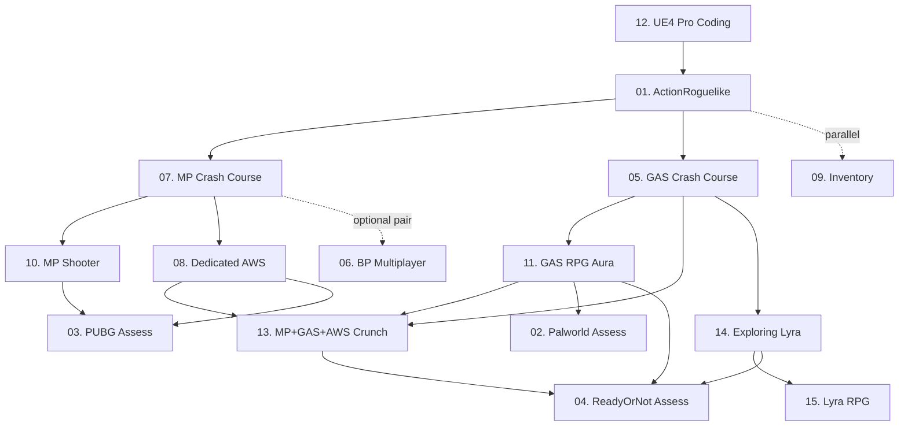

# Learning Roadmap — UE5 Beginner → Pro

> **Mục đích:** Sắp xếp 12 khóa Udemy + 1 khóa Tom Looman + 3 dự án thực tế thành một lộ trình học có thứ tự, kèm rationale để dạy AI làm Unreal Engine một cách hệ thống (không vibe-coding).
>
> **Tài liệu đi kèm:**
> - [Donchitos_GameStudios_Framework.md](./Donchitos_GameStudios_Framework.md) — khung quy trình thiết kế / phát triển game (apply trước khi code).
> - [UE5_Core_Pillars.md](./UE5_Core_Pillars.md) — các trụ cột kỹ thuật rút ra từ toàn bộ khóa học.
> - [Courses/](./Courses/) — phân tích từng khóa: lộ trình giảng dạy + cốt lõi.
> - [Projects/](./Projects/) — đánh giá Palworld, PUBG, ReadyOrNot theo pillars.

---

## 1. Tổng quan 15 nguồn

| # | Tên | Loại | Engine | Trọng tâm |
|---|------|------|--------|-----------|
| 01 | [Tom Looman — Pro Game Development in UE5 C++ (ActionRoguelike)](./Courses/01-Tomlooman-ActionRoguelike.md) | Course + project | UE5.6 C++ | Action Roguelike co-op, Action System tự viết, Save System, EQS, AI |
| 02 | [Palworld (KYWorld/PalworldProject)](./Projects/Palworld_Assessment.md) | Project | UE5 C++ | Open-world creature collection — chỉ có khung |
| 03 | [PUBG (PUBG-KI/PUBG-KI)](./Projects/PUBG_Assessment.md) | Project | UE5 C++ | Battle Royale, Manager pattern, dedicated server |
| 04 | [ReadyOrNot (Void Interactive — community study)](./Projects/ReadyOrNot_Assessment.md) | Project (AAA) | UE4/5 C++ | Tactical FPS, ~298k LOC, Activity AI |
| 05 | [GAS Crash Course](./Courses/05-Udemy-ue5-gas-crash-course.md) | Course | UE5 C++ | GAS cơ bản (ASC, Attributes, Abilities, Tasks, Tags) |
| 06 | Blueprint Multiplayer Crash Course | Course (Blueprint) | UE5 BP | *Bị thiếu source — chỉ Note.txt* |
| 07 | [C++ Multiplayer Crash Course](./Courses/07-Udemy-ue5-multiplayer-crash-course.md) | Course | UE5 C++ | Replication, RPC, Class framework, Travel |
| 08 | [Dedicated Servers + AWS GameLift](./Courses/08-Udemy-ue5-dedicated-servers-with-aws-and-gamelift.md) | Course | UE5 C++ + AWS | GameLift, Lambda, Cognito, DynamoDB, Leaderboards |
| 09 | [C++ Inventory Systems](./Courses/09-Udemy-ue5-inventory-systems.md) | Course | UE5 C++ | Inventory pattern, Item Fragments, Composite, Equipment |
| 10 | [C++ Multiplayer Shooter (Blaster)](./Courses/10-Udemy-ue5-cpp-multiplayer-shooter.md) | Course | UE5 C++ | Full shooter, Lag Compensation, Teams/CTF |
| 11 | [GAS Top-Down RPG (Aura)](./Courses/11-Udemy-ue5-gas-top-down-rpg.md) | Course | UE5 C++ | GAS toàn diện, Damage, Spells, Save, AI |
| 12 | [Pro UE4 Game Coding (UE4)](./Courses/12-Udemy-ue4-pro-unreal-engine-game-coding.md) | Course | UE4 C++ | Math, Physics, Vehicles, AI, Camera — nền tảng coding |
| 13 | [Multiplayer + GAS + AWS Dedicated (Crunch)](./Courses/13-Udemy-ue5-multiplayer-in-unreal-with-gas-and-aws-dedicated-servers.md) | Course | UE5 C++ + AWS | MOBA-style full stack: GAS, Lobby, Coordinator, AWS deploy |
| 14 | [Exploring Lyra](./Courses/14-Udemy-ue5-exploring-lyra-for-game-development.md) | Course | UE5 (Lyra) | Lyra deep-dive, Experiences, Game Features |
| 15 | [Build RPG using Lyra Framework](./Courses/15-Udemy-ue5-build-an-rpg-using-lyra-framework.md) | Course | UE5.6 (Lyra) | RPG trên Lyra: State Trees, Inventory, Indicator |

---

## 2. Lộ trình học (Beginner → Pro)

> **Quy tắc:** không nhảy cóc. Mỗi tier giả định bạn đã thấm tier trước.
> Số trong ngoặc là `[Course #]`. Các khóa có dấu `*` là tùy chọn / song song.

```
T0  Foundation                  → C++/UE concepts, editor, build, math
T1  Single-Player C++ Game      → Actor/Component, AI, Save, Action System
T2  Online Fundamentals         → Replication, RPC, Sessions
T3  Combat Systems              → GAS Core (ASC, Attributes, Effects)
T4  Specialized Systems         → Inventory, full shooter, GAS RPG
T5  Pro Production              → Dedicated servers, AWS, Lyra framework
T6  Real Project Reverse-Eng    → Palworld, PUBG, ReadyOrNot
```

### Tier 0 — Foundation (1–2 tuần)
| Course | Lý do xếp ở đây |
|--------|-----------------|
| **[12] Pro UE4 Game Coding** | Khóa duy nhất dành chỉ cho **kỹ năng coding nền** trong Unreal: editor, version control, math (vectors, quaternions, easing, interpolation), graphics, timing, physics, audio cơ bản, AI cơ bản. Phải làm trước để hiểu mọi khóa sau. UE4 vẫn áp dụng được cho UE5 vì 90% concept giữ nguyên. |

**Đầu ra Tier 0:** đọc/viết được C++ Unreal style, hiểu coordinate system, biết debug, hiểu vòng đời Actor.

### Tier 1 — Single-player C++ Game (2–3 tuần)
| Course | Lý do xếp ở đây |
|--------|-----------------|
| **[01] Tom Looman — ActionRoguelike** | Khóa toàn diện nhất cho người mới sau khi xong Tier 0. Tom xây nguyên 1 game co-op từ đầu: Enhanced Input, **Action System** (clone đơn giản của GAS), AttributeComponent, AI với Behavior Tree + EQS, Asset Manager, Async Loading, **Save System**, UMG, GameplayTags. Không vướng GAS phức tạp ngay — Action System của Tom dạy bạn *pattern* trước, *GAS chính chủ* để sau. |

**Đầu ra Tier 1:** xây được game single-player có character, AI, ability, save/load, UI.

### Tier 2 — Online Fundamentals (1–2 tuần)
| Course | Lý do xếp ở đây |
|--------|-----------------|
| **[07] C++ Multiplayer Crash Course** | Crash course đúng nghĩa: chỉ 6 chương về Client-Server model, Replication, Authority, Variable Replication, RepNotify, RPC (Run on Server/Client/Multicast), Class Framework, Travel. **Bắt buộc** trước bất kỳ khóa nào về multiplayer. |
| **[06] Blueprint Multiplayer Crash Course** *(optional)* | Cùng nội dung Tier 2 nhưng bằng Blueprint — học song song nếu muốn pair với designer. *(Source không có trong repo.)* |

**Đầu ra Tier 2:** hiểu được listen server vs dedicated, biết replicate biến và RPC.

### Tier 3 — Combat Systems / GAS Core (2 tuần)
| Course | Lý do xếp ở đây |
|--------|-----------------|
| **[05] GAS Crash Course** | Nhập môn GAS sạch sẽ: ASC, AttributeSet, GameplayEffect, GameplayAbility, AbilityTask, GameplayTags, Cues. Demo nhỏ. Phải xong Tier 1 (Action System của Tom) để có context "tại sao GAS lại thiết kế thế này". |

**Đầu ra Tier 3:** đọc được code GAS, viết được ability + effect + tag riêng.

### Tier 4 — Specialized Systems (3–5 tuần)
Học song song được — chọn theo loại game muốn làm.

| Course | Khi nào học | Lý do |
|--------|-------------|-------|
| **[09] Inventory Systems** | Khi cần inventory phức tạp (stacks, fragments, equipment) | Dạy **Composite Pattern** + Item Fragments — pattern dùng được cho mọi inventory. |
| **[10] C++ Multiplayer Shooter (Blaster)** | Sau Tier 2 + Tier 3 | Multiplayer shooter từ đầu: Weapon, Aim, Health, Ammo, **Lag Compensation (Server-Side Rewind)**, Teams, CTF. Cao hơn [07] nhiều — đây là *real-game* multiplayer. |
| **[11] GAS Top-Down RPG (Aura)** | Sau Tier 3 | Khóa GAS dài nhất (33 chương). Đi sâu Attributes Set Modifiers, **Damage chain**, Cost/Cooldown, Spell Menu, Passive abilities, Save Progress, Checkpoints. Đây là *production-grade GAS*. |

**Đầu ra Tier 4:** đã có ≥ 1 game system production-quality (inventory hoặc shooter hoặc full RPG).

### Tier 5 — Pro Production (4–6 tuần)
| Course | Lý do xếp ở đây |
|--------|-----------------|
| **[08] Dedicated Servers + AWS GameLift** | Sau Tier 2/3. Production multiplayer: GameLift Fleets, Lambda backend, API Gateway, Cognito auth, Access Tokens, Sessions, **DynamoDB Leaderboards**. Backend ops thực sự. |
| **[13] Multiplayer + GAS + AWS Dedicated (Crunch)** | Sau [11] + [08]. Khóa "khủng" — gộp GAS + AWS + Lobby + Coordinator + Containerization (28 chương). Là tổng kết của tier 3, 4, 5. |
| **[14] Exploring Lyra** | Sau Tier 3. Lyra là **mẫu chuẩn của Epic**: Experiences, Game Features Plugins, Modular Gameplay, CommonUI. Hiểu Lyra = hiểu cách Epic muốn bạn làm UE5. |
| **[15] Build RPG using Lyra Framework** | Sau [14]. Mở rộng Lyra cho 1 RPG: State Trees AI, Indicator System, Quick Bar Inventory, FrontEnd Menu. |

**Đầu ra Tier 5:** triển khai được dedicated server lên AWS, hiểu/extend được Lyra.

### Tier 6 — Real-Project Reverse Engineering (xuyên suốt)
| Project | Mục tiêu khi đọc |
|---------|------------------|
| **[02] Palworld (KYWorld base)** | Chỉ là khung — dùng làm **bài tập áp dụng**: implement đầy đủ các pillar còn trống. Xem [Palworld_Assessment](./Projects/Palworld_Assessment.md). |
| **[03] PUBG (PUBG-KI)** | Open-world Battle Royale có Manager pattern + dedicated server. Học cách tổ chức 60+ Manager class. Xem [PUBG_Assessment](./Projects/PUBG_Assessment.md). |
| **[04] ReadyOrNot** | AAA tactical FPS — 298k LOC, Activity AI, monolithic Character, FMOD, mod.io. **Không nên copy** mà đọc để hiểu trade-off khi scale. Xem [ReadyOrNot_Assessment](./Projects/ReadyOrNot_Assessment.md). |

---

## 3. Dependency Graph



---

## 4. Heuristic chọn course theo mục tiêu

| Bạn muốn làm... | Đường tắt nhất |
|-----------------|----------------|
| Single-player action RPG | T0 → 01 → 05 → 11 |
| MOBA / PvP arena | T0 → 01 → 07 → 05 → 13 |
| BR / Shooter multiplayer | T0 → 01 → 07 → 10 → 08 |
| Survival / Open world co-op | T0 → 01 → 07 → 09 → 11 |
| Tactical FPS như RoN | T0 → 01 → 07 → 10 → study 04 |
| AAA Lyra-based | T0 → 01 → 05 → 14 → 15 |

---

## 5. Cảnh báo

1. **Đừng học song song nhiều khóa cùng tier** — dễ rối pattern.
2. **GAS có 2 trường phái:** Tom Looman style (custom action system, dễ hiểu) vs DruidMech/Epic style (GAS chính chủ). Đọc cả hai để có quan điểm.
3. **Lyra là dao 2 lưỡi:** mạnh nhưng over-engineered cho game nhỏ. Course [14][15] dạy *cách ăn theo* Lyra, không phải copy Lyra.
4. **Course [12] UE4 đừng skip** kể cả khi định làm UE5. Math/timing/audio không đổi.
5. **3 dự án thực tế ≠ chuẩn mực.** Palworld base trống rỗng, PUBG-KI là phỏng theo (không phải code chính thức Krafton), ReadyOrNot là community reverse — nhiều quyết định *không phải best practice* (Character file 368KB là god-object).

---

## 6. Tài liệu sẽ ra tiếp

- [x] Documents/Learning_Roadmap.md (file này)
- [x] Documents/Donchitos_GameStudios_Framework.md
- [x] Documents/UE5_Core_Pillars.md
- [x] Documents/Courses/01..15-*.md (per-course)
- [x] Documents/Projects/Palworld_Assessment.md
- [x] Documents/Projects/PUBG_Assessment.md
- [x] Documents/Projects/ReadyOrNot_Assessment.md
- [x] Documents/Projects_Comparison.md
