# PaldarkLab — DeepWiki

> **Repo:** [SlimeVRX/Soliz-PaldarkLab](https://github.com/SlimeVRX/Soliz-PaldarkLab) · **Commit:** `161fdd92` · **Engine:** Unreal Engine 5.4
>
> DeepWiki này là bản viết lại có cấu trúc của codebase PaldarkLab — sandbox C++ + data-driven cho dự án PALDARK 52-tuần. Mỗi page bám trực tiếp vào file nguồn trong repo và đối chiếu với [Documents/PALDARK/](../Documents/PALDARK/) khi cần ngữ cảnh thiết kế.

---

## Mục lục

1. [Project Overview](#1-project-overview)
2. [Vision & Game Design](#2-vision--game-design)
3. [Project Setup & Build Targets](#3-project-setup--build-targets)
4. [Engine Configuration](#4-engine-configuration)
   - 4.1 [DefaultEngine.ini — Runtime & Rendering](#41-defaultengineini--runtime--rendering)
   - 4.2 [DefaultGame.ini — Asset Manager & Backend](#42-defaultgameini--asset-manager--backend)
   - 4.3 [DefaultInput.ini — Enhanced Input](#43-defaultinputini--enhanced-input)
5. [Core Module — PaldarkLabCore](#5-core-module--paldarklabcore)
6. [Core Framework](#6-core-framework)
   - 6.1 [Experience System](#61-experience-system)
   - 6.2 [Game Modes](#62-game-modes)
   - 6.3 [PaldarkRaidContent Game Feature Plugin](#63-paldarkraidcontent-game-feature-plugin)
7. [Player Systems](#7-player-systems)
   - 7.1 [Player Character & Controller](#71-player-character--controller)
   - 7.2 [Player Component Slots](#72-player-component-slots)
   - 7.3 [Inventory & Equipment](#73-inventory--equipment)
   - 7.4 [Squad & Ping System](#74-squad--ping-system)
8. [Pal (Companion) Systems](#8-pal-companion-systems)
   - 8.1 [Pal Character & Species](#81-pal-character--species)
   - 8.2 [Activity FSM](#82-activity-fsm)
   - 8.3 [Pal Combat & Perception](#83-pal-combat--perception)
   - 8.4 [Taming & Bond System](#84-taming--bond-system)
   - 8.5 [Pal Spawning & Roster](#85-pal-spawning--roster)
9. [Gameplay Ability System (GAS)](#9-gameplay-ability-system-gas)
   - 9.1 [Attribute Set & Damage Pipeline](#91-attribute-set--damage-pipeline)
   - 9.2 [Gameplay Abilities](#92-gameplay-abilities)
   - 9.3 [Lag Compensation (Server-Side Rewind)](#93-lag-compensation-server-side-rewind)
10. [Map & Match Systems](#10-map--match-systems)
    - 10.1 [Map Definition & Points of Interest](#101-map-definition--points-of-interest)
    - 10.2 [Match Lifecycle & Extraction](#102-match-lifecycle--extraction)
11. [Loot System](#11-loot-system)
    - 11.1 [Loot Tables & Drop Pipeline](#111-loot-tables--drop-pipeline)
    - 11.2 [Inventory Fragments Reference](#112-inventory-fragments-reference)
12. [Hub Town Systems](#12-hub-town-systems)
    - 12.1 [Hub Building Framework](#121-hub-building-framework)
    - 12.2 [Pal Stable](#122-pal-stable)
    - 12.3 [Marketplace](#123-marketplace)
    - 12.4 [Briefing Room](#124-briefing-room)
13. [Networking & Backend](#13-networking--backend)
    - 13.1 [Net Subsystem (W14-15)](#131-net-subsystem-w14-15)
    - 13.2 [AWS Backend Subsystem (W42-43)](#132-aws-backend-subsystem-w42-43)
    - 13.3 [Save System (W47-48)](#133-save-system-w47-48)
14. [Glossary](#14-glossary)

---

# 1. Project Overview

> **Source files:** [.gitignore](https://github.com/SlimeVRX/Soliz-PaldarkLab/blob/161fdd92/.gitignore) · [00-VISION.md](https://github.com/SlimeVRX/Soliz-PaldarkLab/blob/161fdd92/00-VISION.md) · [PaldarkLab.uproject](https://github.com/SlimeVRX/Soliz-PaldarkLab/blob/161fdd92/PaldarkLab.uproject) · [README.md](https://github.com/SlimeVRX/Soliz-PaldarkLab/blob/161fdd92/README.md)

PaldarkLab là **technical foundation** cho PALDARK — co-op extraction shooter trộn creature-collection (Palworld) + tactical extraction (Tarkov) + tactical co-op (Ready or Not). Codebase tổ chức theo roadmap 52 tuần: từ C++ scaffold (W1) → vertical slice (W26) → content + world (W39) → beta closed (W52).

Engine: **Unreal Engine 5.4**. Kiến trúc nhấn mạnh **data-driven Experience** — designer tune game rules / pawn data / input config qua Data Asset, không hardcode vào C++.

## 1.1 Three Game Pillars

Mỗi quyết định kỹ thuật phải phục vụ một trong ba pillar (xem [00-VISION.md](https://github.com/SlimeVRX/Soliz-PaldarkLab/blob/161fdd92/00-VISION.md#L55-L85)):

1. **Pal Bond Trumps Gun** — Pal companion là persistent, high-value asset có permadeath risk. Súng disposable, Pal thì không.
2. **Information is Survival** — Minimal HUD, dựa vào environmental cue: âm thanh propagation (FMOD), Pal alert, vết chân, mùi.
3. **Tame Once, Trust Forever** — Pal đã thuần lưu vĩnh viễn, có gen di truyền (Speed / Strength / Stealth / Smarts), breed-able, có lineage signature từ tamer gốc.

Chi tiết design: [§2 Vision & Game Design](#2-vision--game-design).

## 1.2 System Architecture (High-Level)

PaldarkLab chia thành **3 C++ module** + **1 Game Feature plugin** để tách dependency rõ, optimize build time, và cho phép designer toggle content runtime.

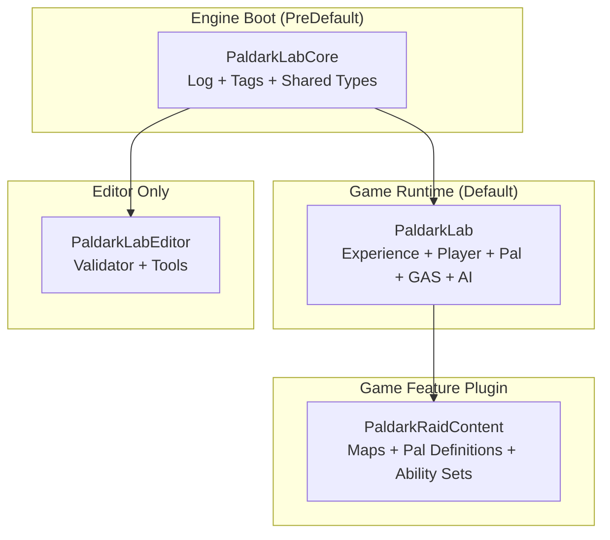

| Module | Type | Loading Phase | Purpose |
|--------|------|---------------|---------|
| `PaldarkLabCore` | Runtime | `PreDefault` | Shared definitions, log categories, native gameplay tags. Load đầu tiên để mọi module khác dùng được. |
| `PaldarkLab` | Runtime | `Default` | Game logic chính: Experience system, player framework, GAS, AI Activity FSM, Inventory. |
| `PaldarkLabEditor` | Editor | `Default` | Editor-only utility + asset validator. |
| `PaldarkRaidContent` (plugin) | Runtime | `Default` | Map + Pal Definition + Ability Set raid-specific. Stream được, không cook vào base game. |

Sources: [PaldarkLab.uproject#L6-L32](https://github.com/SlimeVRX/Soliz-PaldarkLab/blob/161fdd92/PaldarkLab.uproject#L6-L32), [README.md#L9-L22](https://github.com/SlimeVRX/Soliz-PaldarkLab/blob/161fdd92/README.md#L9-L22)

## 1.3 High-Level Code Map

Mapping natural-language concept → code entity:

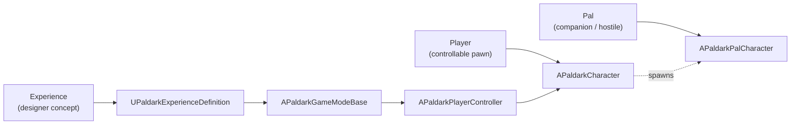

## 1.4 Build Targets

3 build target trong `Source/`:

1. **Game** (`PaldarkLab.Target.cs`) — client-side standalone executable.
2. **Editor** (`PaldarkLabEditor.Target.cs`) — Unreal Editor environment.
3. **Server** (`PaldarkLabServer.Target.cs`) — dedicated server target cho AWS deployment (P07/W42-43).

Chi tiết: [§3 Project Setup & Build Targets](#3-project-setup--build-targets).

## 1.5 Shared Foundation: PaldarkLabCore

Mọi system trong PaldarkLab dùng `PaldarkLabCore` cho standardized log + tag. Module này define **5 log category**:

- `LogPaldark` — general
- `LogPaldarkPal` — AI / Pal behaviour
- `LogPaldarkInventory` — items
- `LogPaldarkNet` — networking
- `LogPaldarkGAS` — abilities / effects

Và **native gameplay tags** namespace `PaldarkGameplayTags` (Input / Pawn / Experience / Activity).

Chi tiết: [§5 Core Module — PaldarkLabCore](#5-core-module--paldarklabcore).

## 1.6 Technical Workflow — Experience Bootstrap

Workflow chính khi game khởi động một map, switch giữa Raid (extraction) và Hub (social) chỉ qua URL option `?Experience=...`:

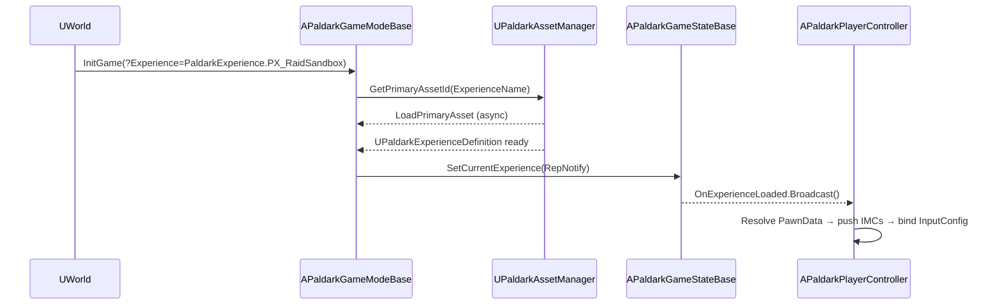

Sources: [README.md#L159-L194](https://github.com/SlimeVRX/Soliz-PaldarkLab/blob/161fdd92/README.md#L159-L194)

## 1.7 Key Subsystems

- **Experience System** — decouples game logic from level. URL option `?Experience=...` chọn `UPaldarkExperienceDefinition`, designer compose action set + class override.
- **Player Framework** — `APaldarkCharacter` với **12 component slot** modular (Health / Stamina / Combat / Inventory / Equipment / PalCompanion / Locomotion / Activity / Interaction / Camera / Network / Damage).
- **Pal AI (Activity FSM)** — `UPaldarkPalActivityComponent` quản lý stack `UPaldarkBaseActivity` (Idle / Follow / Investigate / Patrol / Stalk / Combat / BossPhase / FollowSquadCommand), priority-based preemption với hysteresis.
- **GAS & Combat** — `UPaldarkAttributeSet` (Health / Stamina / MoveSpeed / Armor / IncomingDamage) + `UPaldarkDamageExecutionCalculation` cho hitscan combat.
- **Inventory** — fragment composition (Weight / Stackable / Equipable) trên `UPaldarkItemDefinition`, replicated `UPaldarkPlayerInventoryComponent`.
- **Net Subsystem** — `UPaldarkNetSubsystem` (GameInstance scope) cho dedicated/listen topology + 4-player connection lifecycle.

---

# 2. Vision & Game Design

> **Source files:** [00-VISION.md](https://github.com/SlimeVRX/Soliz-PaldarkLab/blob/161fdd92/00-VISION.md)

PALDARK là technical execution của một hybrid genre: **Co-op Extraction Shooter** fused với **Creature-Collection**. Bối cảnh post-apocalyptic — Pal cổ đại bị "Neural Resonance" làm điên, người chơi phải vào **Dark Zone** (vùng nhiễm xạ) để thu thập tài nguyên + bắt/cứu Pal sạch.

Project ưu tiên **tactical depth + persistent progression + high-fidelity AI** hơn raw map scale.

## 2.1 Core Pillars

(Đã giới thiệu ở [§1.1](#11-three-game-pillars). Mở rộng:)

### Pillar 1 — Pal Bond Trumps Gun

Pal companion có `BondLevel` (0–20). Bond cao unlock ability mới:

| Bond | Khả năng mở |
|------|-------------|
| 0–4 | Follow + basic attack |
| 5–8 | Scout (ra trước 30m) |
| 9–12 | Mark enemy (qua AI Sense) |
| 13–16 | Revive player (1 lần/raid) |
| 17–20 | Signature ability (per-species — Foxparks distract bomb, Boltmane lightning dash) |

Pal chết **vĩnh viễn** nếu bị 1-shot, hồi sinh được nếu kéo xác về extraction trong 5 phút.

### Pillar 2 — Information is Survival

- Audio propagation qua tường (FMOD Studio + Audio Propagation Component port từ Ready or Not).
- Pal có sense system riêng (sight / sound / scent / aura) — alert player trước khi enemy visible.
- Map có dấu vết (vết chân, máu, lông Pal rơi) — đọc được = sống.
- HUD raid tối giản — không minimap, chỉ compass + ping + Pal indicator.

### Pillar 3 — Tame Once, Trust Forever

- Pal đã thuần persist vĩnh viễn trong hub (server-side, AWS DynamoDB).
- 4 gen stat (Speed / Strength / Stealth / Smarts, 0–100 mỗi cái). Breed averaged + random mutation ±10.
- Pal lineage truyền lại — tặng Pal cho người chơi khác kèm chữ ký tamer gốc.
- Top server có "Pal Hall of Fame" — Pal huyền thoại bắt từ raid khó nhất.

## 2.2 Game Loop

Gameplay chia thành 2 environment:

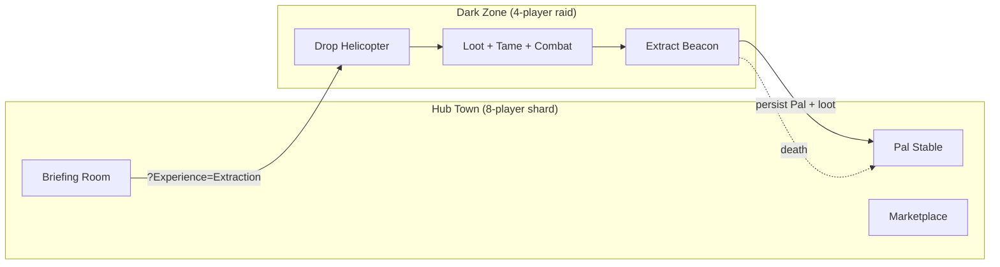

**Macro loop (1 phiên chơi):** Hub → Brief + plan squad → Drop → 45-90 phút raid → Extract → Persist → Hub.

**Micro loop (trong raid):** Drop → Scout 5 phút → 2-4 combat encounter → Tame attempt (nếu thấy Pal phù hợp) → Extract timer 5 phút → Hold → Bay về.

## 2.3 52-Week Roadmap

| Phase | Tuần | Theme | Major Deliverables |
|-------|------|-------|--------------------|
| **Q1 Foundation** | W1–W13 | Build chạy + 1 Pal follow + GAS + Inventory | `APaldarkCharacter`, Sprint, Hitscan, Fragment system |
| **Q2 Combat & Network** | W14–W26 | 4-player dedicated + Server-Side Rewind + Echo Pal AI | `UPaldarkNetSubsystem`, Lag Comp, Squad ping, Extraction |
| **Q3 Content & World** | W27–W39 | 3 map + 10 Pal + Bond/tame + Loot economy | AssetManager async, Map definitions, Pal lineage |
| **Q4 Polish & Beta** | W40–W52 | Hub town + AWS backend + Save + Audio + Performance | `UPaldarkHubSubsystem`, Cognito + DynamoDB, FMOD, Significance |

Chi tiết tuần-từng-tuần: [Documents/PALDARK/03-Roadmap_1_Year.md](https://github.com/SlimeVRX/Soliz-PaldarkLab/blob/161fdd92/Documents/PALDARK/03-Roadmap_1_Year.md).

## 2.4 18 UE5 Pillar Coverage (Target Beta)

PaldarkLab target **17/18 pillar ≥ 90%** — tham vọng nhất so với 3 reference project đã study (Palworld 20% / PUBG 53% / Ready or Not 73% / **PALDARK 97%**).

| Pillar | Beta Target | Pillar | Beta Target |
|--------|------|--------|------|
| P1 C++/Build | 100% | P10 UI | 90% |
| P2 Core Framework | 100% | P11 Inventory | 95% |
| P3 Composition | 95% | P12 Data-driven | 100% |
| P4 Enhanced Input | 100% | P13 Save/Load | 90% |
| P5 Animation | 90% | P14 AssetMgr/Async | 100% |
| P6 Replication | 100% | P15 Performance | 100% |
| P7 Dedicated Server | 100% | P16 Math/Physics/Audio | 90% |
| P8 GAS | 100% | P17 Lyra | 100% (backbone) |
| P9 AI | 100% | P18 Backend/Live Ops | 100% |

Chi tiết: [Documents/PALDARK/02-Pillar_Coverage.md](https://github.com/SlimeVRX/Soliz-PaldarkLab/blob/161fdd92/Documents/PALDARK/02-Pillar_Coverage.md).

## 2.5 Beta Scope (12 tháng)

**Cắt bỏ ngay (đẩy v1.0):**
- ❌ Open world 64km², 100-player MMO, PvP raid, vehicle, full crafting tree, console release, localization.

**Beta scope:**
- ✅ 3 Dark Zone map (1×1km mỗi map): *Cảng Bỏ Hoang*, *Rừng Hỏng*, *Cơ Xưởng PalCorp*
- ✅ 10 Pal loài (5 thường, 4 hiếm, 1 huyền thoại)
- ✅ 4-player co-op + dedicated server AWS GameLift
- ✅ Hub town shard 8 người
- ✅ Permadeath extraction loop
- ✅ Pal bond + breeding cơ bản (4 stat gen, 2 generation deep)
- ✅ Activity FSM cho companion + hostile
- ✅ Audio propagation FMOD
- ✅ 15 weapon (3 tier × 5 loại)

---

# 3. Project Setup & Build Targets

> **Source files:** [PaldarkLab.uproject](https://github.com/SlimeVRX/Soliz-PaldarkLab/blob/161fdd92/PaldarkLab.uproject) · [Source/PaldarkLab.Target.cs](https://github.com/SlimeVRX/Soliz-PaldarkLab/blob/161fdd92/Source/PaldarkLab.Target.cs) · [Source/PaldarkLab/PaldarkLab.Build.cs](https://github.com/SlimeVRX/Soliz-PaldarkLab/blob/161fdd92/Source/PaldarkLab/PaldarkLab.Build.cs) · [Plugins/PaldarkRaidContent/](https://github.com/SlimeVRX/Soliz-PaldarkLab/blob/161fdd92/Plugins/PaldarkRaidContent/)

Page này document kiến trúc workspace PaldarkLab: 3 C++ module, build targets cho deployment scenarios khác nhau, và `PaldarkRaidContent` Game Feature Plugin.

## 3.1 Module Architecture

PaldarkLab chia thành 3 module để optimize compilation + clean dependency graph.

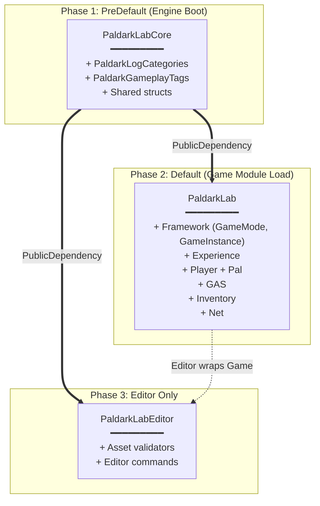

| Module | Type | Loading Phase | Build.cs |
|--------|------|---------------|----------|
| `PaldarkLabCore` | Runtime | `PreDefault` | [PaldarkLabCore.Build.cs](https://github.com/SlimeVRX/Soliz-PaldarkLab/blob/161fdd92/Source/PaldarkLabCore/PaldarkLabCore.Build.cs) |
| `PaldarkLab` | Runtime | `Default` | [PaldarkLab.Build.cs](https://github.com/SlimeVRX/Soliz-PaldarkLab/blob/161fdd92/Source/PaldarkLab/PaldarkLab.Build.cs) |
| `PaldarkLabEditor` | Editor | `Default` | [PaldarkLabEditor.Build.cs](https://github.com/SlimeVRX/Soliz-PaldarkLab/blob/161fdd92/Source/PaldarkLabEditor/PaldarkLabEditor.Build.cs) |

Sources: [PaldarkLab.uproject#L15-L31](https://github.com/SlimeVRX/Soliz-PaldarkLab/blob/161fdd92/PaldarkLab.uproject#L15-L31)

## 3.2 Build Targets

Source root chứa 3 target file. UBT dùng các target này để package binaries.

### Game Target (`PaldarkLab.Target.cs`)

Standalone client build. Include `PaldarkLabCore` + `PaldarkLab`.

```csharp
Type = TargetType.Game;
ExtraModuleNames.Add("PaldarkLabCore");
ExtraModuleNames.Add("PaldarkLab");
```

### Editor Target (`PaldarkLabEditor.Target.cs`)

Unreal Editor environment. Include cả 3 module.

```csharp
Type = TargetType.Editor;
ExtraModuleNames.Add("PaldarkLabCore");
ExtraModuleNames.Add("PaldarkLab");
ExtraModuleNames.Add("PaldarkLabEditor");
```

### Server Target (`PaldarkLabServer.Target.cs`)

Dedicated server cho AWS Fleet deployment. Exclude `PaldarkLabEditor` + rendering-specific để minimize binary footprint.

```bash
RunUAT.bat BuildCookRun -project=PaldarkLab.uproject -platform=Win64 \
   -target=PaldarkLabServer -clientconfig=Development -serverconfig=Development \
   -build -cook -stage -archive -archivedirectory=out/
```

Sources: [README.md#L149-L157](https://github.com/SlimeVRX/Soliz-PaldarkLab/blob/161fdd92/README.md#L149-L157)

## 3.3 PaldarkRaidContent Plugin

Critical Game Feature Plugin (W27-28) holding raid-specific content tách khỏi base game's root cook.

### Plugin Metadata

- **Type:** Runtime Game Feature Plugin
- **Module:** `PaldarkRaidContent` implements `IModuleInterface`
- **Purpose:** Maps, Pal definitions, ability sets — stream/toggle dynamic được

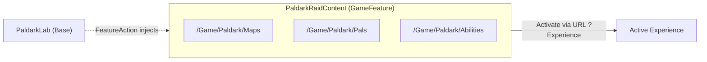

Sources: [Plugins/PaldarkRaidContent/PaldarkRaidContent.uplugin](https://github.com/SlimeVRX/Soliz-PaldarkLab/blob/161fdd92/Plugins/PaldarkRaidContent/PaldarkRaidContent.uplugin), [Plugins/PaldarkRaidContent/Source/PaldarkRaidContent/PaldarkRaidContent.Build.cs#L26-L36](https://github.com/SlimeVRX/Soliz-PaldarkLab/blob/161fdd92/Plugins/PaldarkRaidContent/Source/PaldarkRaidContent/PaldarkRaidContent.Build.cs#L26-L36)

## 3.4 Setup & Compilation

### Generate Project Files

1. Yêu cầu: **Unreal Engine 5.4** đã cài qua Epic Games Launcher.
2. Right-click `PaldarkLab.uproject` → *Generate Visual Studio project files*.

### Compile & Run

- Visual Studio: set build configuration `Development Editor`, startup project = `PaldarkLab`, F5 → compile + launch editor.
- Editor launch: `FPaldarkLabModule::StartupModule` register debug console commands (e.g. `Paldark.HelloWorld`).

### Console Commands Registered

| Command | Phase | Mục đích |
|---------|-------|----------|
| `Paldark.HelloWorld [message]` | W1 | Generic hello-world |
| `Paldark.Experience.Current` | W1 d6-7 | Print FPrimaryAssetId của experience hiện tại |
| `Paldark.Experience.Hello` | W1 d6-7 | Log HelloWorldMessage |
| `Paldark.Experience.ListExtensions` | W1 d8-10 | List class override + action set + tag |
| `Paldark.Input.ListBindings` | W1 d11-14 | List PawnData + IMC + InputConfig rows |
| `Paldark.Pal.SpawnTestCompanion [index]` | W3-4 | Server-only, spawn 1 Pal behind player |
| `Paldark.Pal.CurrentActivity` | W5-6 | Log active activity per Pal |
| `Paldark.Pal.SetActivity <name>` | W5-6 | Force-switch FSM (Idle/Follow/Investigate) |
| `Paldark.Pal.Ping [X Y Z]` | W5-6 | File Investigate request |
| `Paldark.Gas.DumpAttributes` | W7-8 | Log live AttributeSet values |
| `Paldark.Gas.Damage [Amount]` | W7-8 | Subtract Health (placeholder cho W9-10) |
| `Paldark.Combat.SpawnDummy [Distance]` | W9-10 | Spawn `APaldarkDummyTarget` cm trước player |
| `Paldark.Combat.Fire` | W9-10 | Activate Fire ability qua tag |
| `Paldark.Net.Status` | W14-15 | Print net topology + peer count |
| `Paldark.Net.Join <ip:port>` | W14-15 | Client travel to listen server |

Sources: [README.md#L23-L36](https://github.com/SlimeVRX/Soliz-PaldarkLab/blob/161fdd92/README.md#L23-L36)

---

# 4. Engine Configuration

> **Source files:** [Config/DefaultEngine.ini](https://github.com/SlimeVRX/Soliz-PaldarkLab/blob/161fdd92/Config/DefaultEngine.ini) · [Config/DefaultGame.ini](https://github.com/SlimeVRX/Soliz-PaldarkLab/blob/161fdd92/Config/DefaultGame.ini) · [Config/DefaultInput.ini](https://github.com/SlimeVRX/Soliz-PaldarkLab/blob/161fdd92/Config/DefaultInput.ini)

`Config/` directory là **glue layer** giữa Unreal Engine và Paldark framework. Define entry point (GameInstance, GameMode), configure Asset Manager, establish networking baseline.

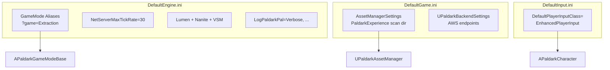

## 4.1 DefaultEngine.ini — Runtime & Rendering

> **Source:** [Config/DefaultEngine.ini](https://github.com/SlimeVRX/Soliz-PaldarkLab/blob/161fdd92/Config/DefaultEngine.ini)

`DefaultEngine.ini` define foundational runtime environment. Override `UGameInstance` + `UAssetManager` với Paldark-specific implementation.

### Key Configurations

| Section | Setting | Effect |
|---------|---------|--------|
| `[/Script/Engine.Engine]` | `GameInstance=/Script/PaldarkLab.PaldarkGameInstance` | Override default GameInstance |
| `[/Script/Engine.AssetManagerSettings]` | `AssetManagerClassName=/Script/PaldarkLab.PaldarkAssetManager` | Custom Asset Manager (scan rules ở DefaultGame.ini) |
| `[/Script/Engine.GameMapsSettings]` | GameMode aliases — `Extraction` | Designer launch raid qua `?game=Extraction` |
| `[/Script/OnlineSubsystemUtils.IpNetDriver]` | `NetServerMaxTickRate=30` | 30 Hz server tick rate, base cho lag comp |
| `[/Script/Engine.GameSession]` | `MaxPlayers=4` | Hard cap cho raid (defence in depth với `PreLogin` check) |
| `[/Script/Engine.RendererSettings]` | Lumen + Nanite + Virtual Shadow Maps enabled | High-fidelity baseline cho OpenWorld map |
| `[Core.Log]` | `LogPaldark=Verbose`, `LogPaldarkPal=Verbose`, `LogPaldarkGAS=Verbose`, `LogPaldarkNet=Verbose`, `LogPaldarkInventory=Verbose` | Dev verbose default; ship build sẽ set Display |

### Network Tuning

```ini
[/Script/OnlineSubsystemUtils.IpNetDriver]
NetServerMaxTickRate=30
MaxClientRate=15000
MaxInternetClientRate=15000
```

30 Hz match với `NetUpdateFrequency` trên `APaldarkPalCharacter` — server không bottleneck với 4 Pal × 4 client (xem [§13.1](#131-net-subsystem-w14-15)).

Sources: [Config/DefaultEngine.ini#L1-L61](https://github.com/SlimeVRX/Soliz-PaldarkLab/blob/161fdd92/Config/DefaultEngine.ini#L1-L61)

## 4.2 DefaultGame.ini — Asset Manager & Backend

> **Source:** [Config/DefaultGame.ini](https://github.com/SlimeVRX/Soliz-PaldarkLab/blob/161fdd92/Config/DefaultGame.ini)

Responsible cho Asset Manager scan rules + AWS Backend Subsystem config.

### Asset Discovery

Asset Manager auto-scan các thư mục để resolve soft reference + primary asset ID at runtime.

| Primary Asset Type | Base Class | Scan Directory |
|--------------------|------------|----------------|
| `PaldarkExperience` | `UPaldarkExperienceDefinition` | `/Game/Paldark/Experiences` |
| `PaldarkItem` | `UPaldarkItemDefinition` | `/Game/Paldark/Items` |
| `PaldarkPalDefinition` | `UPaldarkPalDefinition` | `/Game/Paldark/Pals` |
| `PaldarkMapDefinition` | `UPaldarkMapDefinition` | `/Game/Paldark/Maps` |
| `PaldarkPawnData` | `UPaldarkPawnData` | `/Game/Paldark/PawnData` |
| `PaldarkExperienceActionSet` | `UPaldarkExperienceActionSet` | `/Game/Paldark/ActionSets` |
| `PaldarkInputConfig` | `UPaldarkInputConfig` | `/Game/Paldark/Input` |

```ini
[/Script/Engine.AssetManagerSettings]
+PrimaryAssetTypesToScan=(PrimaryAssetType="PaldarkExperience",
    AssetBaseClass=/Script/PaldarkLab.PaldarkExperienceDefinition,
    bHasBlueprintClasses=False, bIsEditorOnly=False,
    Directories=((Path="/Game/Paldark/Experiences")))
```

### Backend Settings

`UPaldarkBackendSettings` (DeveloperSettings) controls local loopback → AWS Cognito/Lambda transition.

```ini
[/Script/PaldarkLab.PaldarkBackendSettings]
ApiBaseUrl=https://api.paldark.local
CognitoRegion=ap-southeast-1
UseLocalLoopback=True
```

Sources: [Config/DefaultGame.ini#L17-L80](https://github.com/SlimeVRX/Soliz-PaldarkLab/blob/161fdd92/Config/DefaultGame.ini#L17-L80)

## 4.3 DefaultInput.ini — Enhanced Input

> **Source:** [Config/DefaultInput.ini](https://github.com/SlimeVRX/Soliz-PaldarkLab/blob/161fdd92/Config/DefaultInput.ini)

Pin Enhanced Input framework để `CastChecked<UEnhancedInputComponent>` trong `APaldarkCharacter` không bao giờ null.

```ini
[/Script/Engine.InputSettings]
DefaultPlayerInputClass=/Script/EnhancedInput.EnhancedPlayerInput
DefaultInputComponentClass=/Script/EnhancedInput.EnhancedInputComponent
```

Không có này, UE fallback về legacy input system → `CastChecked` sẽ crash hoặc trả về null.

### Input Flow

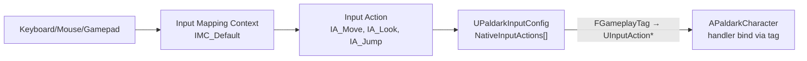

Designer chỉ chạm vào `IMC_*` + `UPaldarkInputConfig`. C++ binding code không cần biết tên cụ thể của `UInputAction*` — chỉ biết tag.

Sources: [Config/DefaultInput.ini#L1-L18](https://github.com/SlimeVRX/Soliz-PaldarkLab/blob/161fdd92/Config/DefaultInput.ini#L1-L18)

---

# 5. Core Module — PaldarkLabCore

> **Source files:** [Source/PaldarkLabCore/](https://github.com/SlimeVRX/Soliz-PaldarkLab/blob/161fdd92/Source/PaldarkLabCore/)

`PaldarkLabCore` là **PreDefault loading module** — load đầu tiên, trước bất kỳ game logic nào, để mọi module khác dùng được log + tag.

## 5.1 Module Purpose

Chứa shared types travel qua network hoặc save xuống disk:
- **Log categories** — 5 category cho từng subsystem
- **Native gameplay tags** — declared via `UE_DECLARE_GAMEPLAY_TAG` / `UE_DEFINE_GAMEPLAY_TAG`
- **Backend specs** — struct `FPaldarkFleetSpec` cho `UPaldarkBackendSubsystem` request AWS resources
- **Extraction metadata** — enum match outcomes (`Escaped`, `KilledInAction`, `TimedOut`)
- **Item fragment base** — `UPaldarkItemFragment` base class (logic concrete fragments ở game module)

## 5.2 Log Categories

> **Source:** [PaldarkLogCategories.h](https://github.com/SlimeVRX/Soliz-PaldarkLab/blob/161fdd92/Source/PaldarkLabCore/Public/PaldarkLogCategories.h)

```cpp
DECLARE_LOG_CATEGORY_EXTERN(LogPaldark,         Log, All);  // general
DECLARE_LOG_CATEGORY_EXTERN(LogPaldarkPal,      Log, All);  // Pal AI / behaviour
DECLARE_LOG_CATEGORY_EXTERN(LogPaldarkInventory,Log, All);  // inventory & equipment
DECLARE_LOG_CATEGORY_EXTERN(LogPaldarkNet,      Log, All);  // replication & RPC
DECLARE_LOG_CATEGORY_EXTERN(LogPaldarkGAS,      Log, All);  // GAS / abilities / effects
```

Mục đích: filter output log theo subsystem. Designer khi PIE chỉ cần `Log LogPaldarkPal Verbose` để xem riêng Pal FSM switches mà không bị tràn bởi general engine log.

## 5.3 Gameplay Tags

> **Source:** [PaldarkGameplayTags.h](https://github.com/SlimeVRX/Soliz-PaldarkLab/blob/161fdd92/Source/PaldarkLabCore/Public/PaldarkGameplayTags.h) · [PaldarkGameplayTags.cpp](https://github.com/SlimeVRX/Soliz-PaldarkLab/blob/161fdd92/Source/PaldarkLabCore/Private/PaldarkGameplayTags.cpp)

Native tags được declared với macro UE, register vào tag manager lúc module load:

### Tag Namespaces

| Namespace | Tags | Purpose |
|-----------|------|---------|
| `Paldark.Experience.*` | `Default`, `RaidSandbox` | Experience identity |
| `Paldark.Pawn.*` | `Player`, `Pal` | Pawn classification |
| `Paldark.InputTag.*` | `Move`, `Look`, `Jump`, `Fire`, `Sprint` | Input lookup keys |
| `Paldark.Ability.*` | `Sprint`, `Fire`, `PalAttack` | GA activation tags |
| `Paldark.Pal.Activity.*` | `Idle`, `Follow`, `Investigate`, `Patrol`, `Stalk`, `Combat`, `BossPhase`, `FollowSquadCommand` | Activity FSM identity |
| `Paldark.Hit.*` | `Headshot` | Damage classification |
| `Paldark.SetByCaller.*` | `BaseDamage`, `HeadshotMultiplier` | GE magnitude keys |
| `Paldark.State.*` | `IsDead`, `IsSprinting`, `IsAiming` | Pawn state flags |
| `Paldark.Squad.Command.*` | `Stack`, `Cover`, `Push`, `Retreat` | Squad radial |
| `Paldark.Team.*` | `Player`, `Hostile` | Team identity (W18-19) |

### Declaration Pattern

```cpp
// .h
namespace PaldarkGameplayTags
{
    UE_DECLARE_GAMEPLAY_TAG_EXTERN(InputTag_Move);
    UE_DECLARE_GAMEPLAY_TAG_EXTERN(Pal_Activity_Idle);
    // ...
}

// .cpp
namespace PaldarkGameplayTags
{
    UE_DEFINE_GAMEPLAY_TAG(InputTag_Move,        "Paldark.InputTag.Move");
    UE_DEFINE_GAMEPLAY_TAG(Pal_Activity_Idle,    "Paldark.Pal.Activity.Idle");
    // ...
}
```

Native tag rẻ hơn DataTable-based tag (no asset load), và compile-error nếu typo (DataTable tag fail silently).

## 5.4 External Dependencies

`PaldarkLabCore.Build.cs` private dependencies:

| Module | Purpose |
|--------|---------|
| `Core`, `CoreUObject`, `Engine` | Foundation |
| `GameplayTags` | Native tag macros |
| `HTTP`, `Json`, `JsonUtilities` | AWS Backend serialization (W42-43) |
| `DeveloperSettings` | `UPaldarkBackendSettings` Project Settings UI |
| `UMG` | Core UI data structures cho Pal Stable + Marketplace |

Sources: [PaldarkLabCore.Build.cs](https://github.com/SlimeVRX/Soliz-PaldarkLab/blob/161fdd92/Source/PaldarkLabCore/PaldarkLabCore.Build.cs), [PaldarkLab.Build.cs#L34-L53](https://github.com/SlimeVRX/Soliz-PaldarkLab/blob/161fdd92/Source/PaldarkLab/PaldarkLab.Build.cs#L34-L53)

---

# 6. Core Framework

> **Source files:** [Source/PaldarkLab/Public/Framework/](https://github.com/SlimeVRX/Soliz-PaldarkLab/blob/161fdd92/Source/PaldarkLab/Public/Framework/) · [Source/PaldarkLab/Public/Experience/](https://github.com/SlimeVRX/Soliz-PaldarkLab/blob/161fdd92/Source/PaldarkLab/Public/Experience/)

Core Framework là backbone của PaldarkLab: data-driven Experience system, custom GameMode/GameState/GameInstance, và Game Feature Plugin để inject content runtime.

## 6.1 Experience System

> **Source:** [PaldarkExperienceDefinition.h](https://github.com/SlimeVRX/Soliz-PaldarkLab/blob/161fdd92/Source/PaldarkLab/Public/Experience/PaldarkExperienceDefinition.h) · [PaldarkExperienceActionSet.h](https://github.com/SlimeVRX/Soliz-PaldarkLab/blob/161fdd92/Source/PaldarkLab/Public/Experience/PaldarkExperienceActionSet.h) · [PaldarkPawnData.h](https://github.com/SlimeVRX/Soliz-PaldarkLab/blob/161fdd92/Source/PaldarkLab/Public/Experience/PaldarkPawnData.h)

Vendor-neutral mirror của Lyra's data-driven experience pattern — không yêu cầu Lyra plugin, chạy được trên vanilla UE 5.4. Reused/replaced ở W33 nếu Lyra adoption.

### Class Diagram

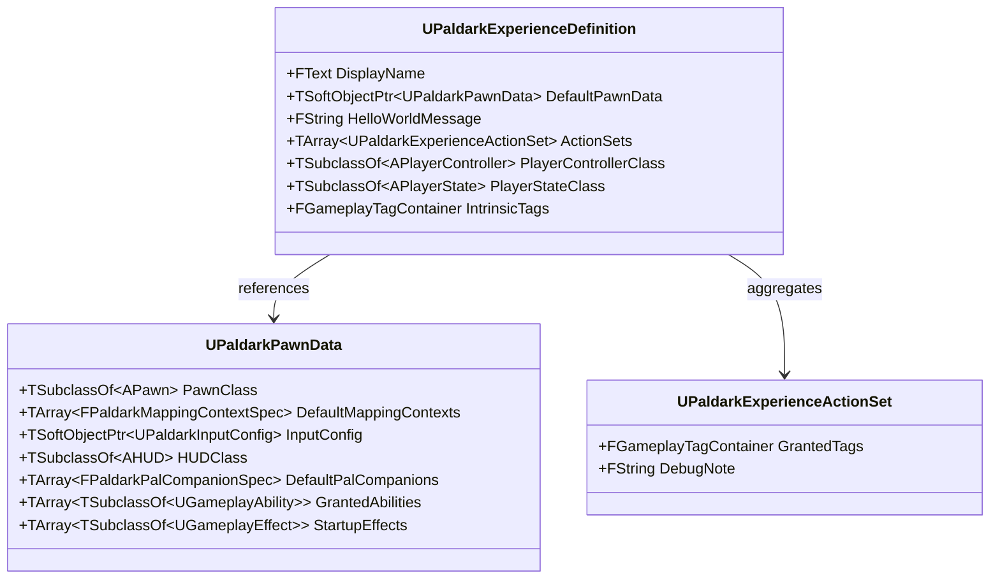

### Initialization Flow

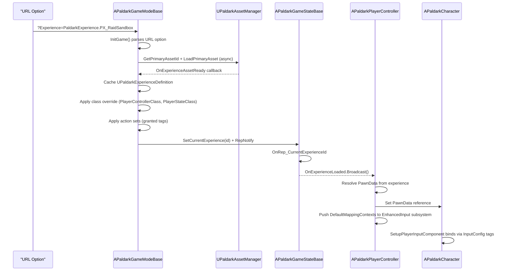

### Authoring Workflow

Designer khởi tạo experience qua editor (sau Generate Project Files + compile):

1. **PawnData** (`Content/Paldark/PawnData/`): right-click → Data Asset → `PaldarkPawnData` → `PD_RaidPlayer`. Set `PawnClass = PaldarkCharacter`, `InputConfig = InputConfig_Default`, `DefaultMappingContexts = [IMC_Default]`.
2. **ActionSet** (`Content/Paldark/ActionSets/`): Data Asset → `PaldarkExperienceActionSet` → `AS_RaidSandbox_Core`. Set `GrantedTags = {Paldark.Experience.RaidSandbox}`, `DebugNote = "Raid sandbox core extensions."`.
3. **Experience** (`Content/Paldark/Experiences/`): Data Asset → `PaldarkExperience` → `PX_RaidSandbox`. Set `DefaultPawnData = PD_RaidPlayer`, `ActionSets = [AS_RaidSandbox_Core]`, `PlayerControllerClass = PaldarkPlayerController`.
4. **Launch:** Editor console → `open Raid_Sandbox?Experience=PaldarkExperience.PX_RaidSandbox`.
5. **Verify:** `Paldark.Experience.Current` (prints id) → `Paldark.Experience.ListExtensions` (prints class overrides, granted tags, action sets).

Sources: [README.md#L159-L224](https://github.com/SlimeVRX/Soliz-PaldarkLab/blob/161fdd92/README.md#L159-L224)

### Async vs Sync Load

Hiện tại (W1 scaffold), action set + class override flow dùng **synchronous** `LoadSynchronous` trong `OnExperienceAssetReady` cho clarity. Switching to async `FStreamableManager::RequestAsyncLoad` là P14 (AssetMgr) follow-up — schedule ở W27-28.

## 6.2 Game Modes

> **Source:** [PaldarkGameModeBase.h](https://github.com/SlimeVRX/Soliz-PaldarkLab/blob/161fdd92/Source/PaldarkLab/Public/Framework/PaldarkGameModeBase.h) · [PaldarkGameStateBase.h](https://github.com/SlimeVRX/Soliz-PaldarkLab/blob/161fdd92/Source/PaldarkLab/Public/Framework/PaldarkGameStateBase.h) · [PaldarkGameInstance.h](https://github.com/SlimeVRX/Soliz-PaldarkLab/blob/161fdd92/Source/PaldarkLab/Public/Framework/PaldarkGameInstance.h)

### Class Hierarchy

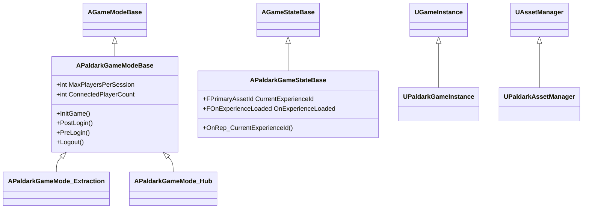

### APaldarkGameModeBase Responsibilities

- **`InitGame()`** — parse `?Experience=...` URL option, kick off async load qua `UPaldarkAssetManager`.
- **`OnExperienceAssetReady()`** — cache `UPaldarkExperienceDefinition`, apply class override (PlayerController/PlayerState), merge action set tags vào `IntrinsicTags`.
- **`PreLogin()`** — reject (N+1)th client với message `"Server full (4/4). Please try again later."` nếu `ConnectedPlayerCount >= MaxPlayersPerSession`.
- **`PostLogin()`** — increment `ConnectedPlayerCount`, log `[PostLogin] PC_0 joined — 1/4 player(s)` to `LogPaldarkNet`.
- **`Logout()`** — decrement counter.

`MaxPlayersPerSession` là `UPROPERTY(EditDefaultsOnly)` — designer override trong `BP_GameMode` CDO không cần recompile.

### Subclass: APaldarkGameMode_Extraction (W24-25)

Override `PostLogin` để register player vào `UPaldarkMatchSubsystem`, start match warm-up timer. Khi player extract success → trigger persist write-back qua `UPaldarkBackendSubsystem`.

### Subclass: APaldarkGameMode_Hub (W40-41)

Hub town shard, không có match lifecycle. Player free-roam giữa Pal Stable, Marketplace, Briefing Room.

### APaldarkGameStateBase

Replicate experience identity:

```cpp
UPROPERTY(ReplicatedUsing = OnRep_CurrentExperienceId)
FPrimaryAssetId CurrentExperienceId;

DECLARE_DYNAMIC_MULTICAST_DELEGATE_OneParam(FOnExperienceLoaded, const UPaldarkExperienceDefinition*, Experience);
UPROPERTY(BlueprintAssignable)
FOnExperienceLoaded OnExperienceLoaded;
```

Khi client receive RepNotify, resolve soft pointer → fire same delegate như server. Bind point này cho PlayerController push IMC + InputConfig.

Sources: [README.md#L159-L194](https://github.com/SlimeVRX/Soliz-PaldarkLab/blob/161fdd92/README.md#L159-L194), [README.md#L525-L534](https://github.com/SlimeVRX/Soliz-PaldarkLab/blob/161fdd92/README.md#L525-L534)

## 6.3 PaldarkRaidContent Game Feature Plugin

> **Source:** [Plugins/PaldarkRaidContent/](https://github.com/SlimeVRX/Soliz-PaldarkLab/blob/161fdd92/Plugins/PaldarkRaidContent/)

Game Feature Plugin (GFP) cho phép designer toggle content dynamic — map, Pal definition, ability set — mà không cook vào base game's root pak.

### Plugin Architecture

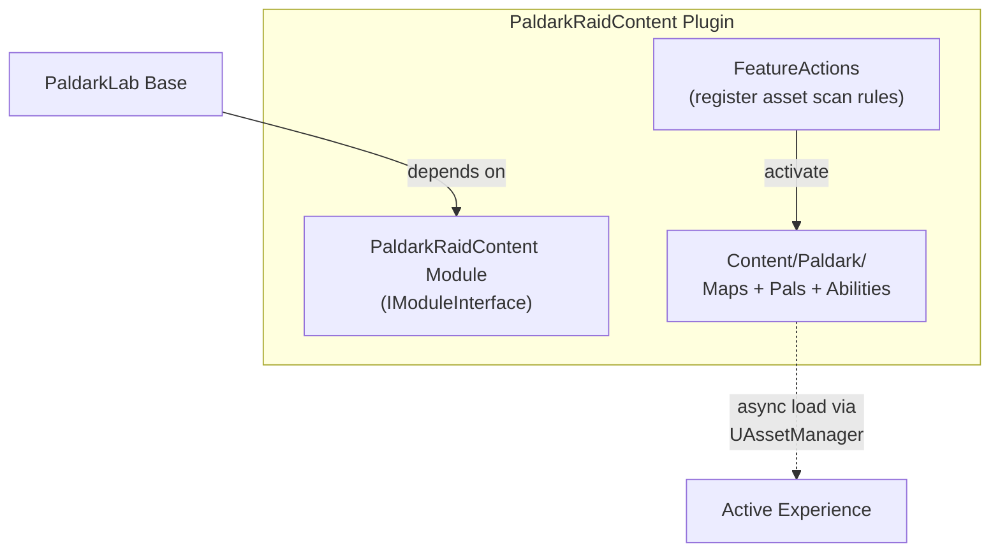

### Activation Flow

```cpp
// PaldarkRaidContent.uplugin
{
    "FileVersion": 3,
    "Version": 1,
    "VersionName": "0.1",
    "FriendlyName": "PaldarkRaidContent",
    "Type": "Runtime",
    "LoadingPhase": "Default",
    "EnabledByDefault": true,
    "Modules": [
        {
            "Name": "PaldarkRaidContent",
            "Type": "Runtime",
            "LoadingPhase": "Default"
        }
    ]
}
```

### Why Plugin (Not Base Module)?

- **Cook isolation:** Raid content (potentially 5-10GB cho 3 map) không bị cook vào hub-only client build.
- **Hot reload:** Designer toggle plugin trong editor để A/B test content set.
- **Dedicated server scope:** Server target có thể disable raid plugin nếu chạy hub-only shard.
- **Mod.io extension path:** Sau W42-43, mod.io community map cũng follow cùng GFP pattern.

Sources: [Plugins/PaldarkRaidContent/PaldarkRaidContent.uplugin#L6](https://github.com/SlimeVRX/Soliz-PaldarkLab/blob/161fdd92/Plugins/PaldarkRaidContent/PaldarkRaidContent.uplugin#L6), [Plugins/PaldarkRaidContent/Source/PaldarkRaidContent/Public/PaldarkRaidContent.h#L14-L19](https://github.com/SlimeVRX/Soliz-PaldarkLab/blob/161fdd92/Plugins/PaldarkRaidContent/Source/PaldarkRaidContent/Public/PaldarkRaidContent.h#L14-L19)

---

# 7. Player Systems

> **Source files:** [Source/PaldarkLab/Public/Player/](https://github.com/SlimeVRX/Soliz-PaldarkLab/blob/161fdd92/Source/PaldarkLab/Public/Player/) · [Source/PaldarkLab/Public/Inventory/](https://github.com/SlimeVRX/Soliz-PaldarkLab/blob/161fdd92/Source/PaldarkLab/Public/Inventory/) · [Source/PaldarkLab/Public/Squad/](https://github.com/SlimeVRX/Soliz-PaldarkLab/blob/161fdd92/Source/PaldarkLab/Public/Squad/)

Player Systems chia thành 4 sub-page: character/controller, component slot layout, inventory, squad coordination.

## 7.1 Player Character & Controller

> **Source:** [PaldarkCharacter.h](https://github.com/SlimeVRX/Soliz-PaldarkLab/blob/161fdd92/Source/PaldarkLab/Public/Player/PaldarkCharacter.h) · [PaldarkPlayerController.h](https://github.com/SlimeVRX/Soliz-PaldarkLab/blob/161fdd92/Source/PaldarkLab/Public/Player/PaldarkPlayerController.h) · [PaldarkPlayerState.h](https://github.com/SlimeVRX/Soliz-PaldarkLab/blob/161fdd92/Source/PaldarkLab/Public/Player/PaldarkPlayerState.h)

### Class Hierarchy

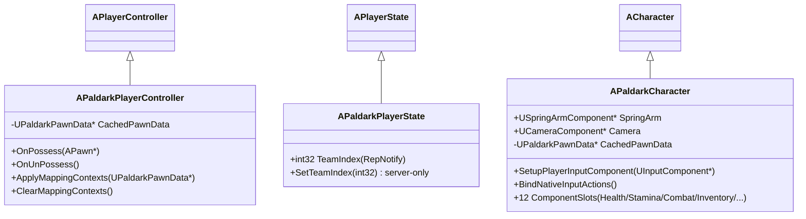

### APaldarkPlayerController

PlayerController owns Enhanced Input plumbing:

- **`OnPossess(APawn*)`** — resolve PawnData từ active experience, cache nó. Hand PawnData cho character. Iterate `DefaultMappingContexts` → call `AddMappingContext` trên `UEnhancedInputLocalPlayerSubsystem`.
- **`OnUnPossess()`** — symmetric: clear mapping contexts.

```cpp
void APaldarkPlayerController::OnPossess(APawn* InPawn)
{
    Super::OnPossess(InPawn);
    if (UPaldarkExperienceDefinition* Exp = GetActiveExperience())
    {
        CachedPawnData = Exp->DefaultPawnData.LoadSynchronous();
        if (auto* PaldarkChar = Cast<APaldarkCharacter>(InPawn))
        {
            PaldarkChar->SetCachedPawnData(CachedPawnData);
        }
        ApplyMappingContexts(CachedPawnData);
    }
}
```

### APaldarkCharacter — 3rd Person Skeleton

Composition pattern (P03 pillar):

- `USpringArmComponent` (TargetArmLength = 400, lag enabled)
- `UCameraComponent` attached to spring arm
- 12 component slots (xem [§7.2](#72-player-component-slots))

`SetupPlayerInputComponent` cast to `UEnhancedInputComponent`, load `UPaldarkInputConfig` từ cached PawnData, bind Move/Look/Jump handler via `Paldark.InputTag.*` lookup key.

```cpp
void APaldarkCharacter::SetupPlayerInputComponent(UInputComponent* PlayerInputComponent)
{
    Super::SetupPlayerInputComponent(PlayerInputComponent);
    auto* EnhancedInput = CastChecked<UEnhancedInputComponent>(PlayerInputComponent);
    auto* Config = CachedPawnData->InputConfig.LoadSynchronous();
    
    if (auto* MoveAction = Config->FindNativeInputActionForTag(PaldarkGameplayTags::InputTag_Move))
    {
        EnhancedInput->BindAction(MoveAction, ETriggerEvent::Triggered, this, &APaldarkCharacter::HandleMove);
    }
    // ... Look, Jump similar
}
```

### APaldarkPlayerState

Holds replicated team identity:

```cpp
UPROPERTY(ReplicatedUsing = OnRep_TeamIndex)
int32 TeamIndex = 0;

UFUNCTION(BlueprintCallable, Server, Reliable)
void SetTeamIndex(int32 NewIndex);
```

W7+ sẽ là ASC owner (mount GAS lên PlayerState theo Aura pattern).

Sources: [README.md#L46-L58](https://github.com/SlimeVRX/Soliz-PaldarkLab/blob/161fdd92/README.md#L46-L58), [README.md#L226-L253](https://github.com/SlimeVRX/Soliz-PaldarkLab/blob/161fdd92/README.md#L226-L253)

## 7.2 Player Component Slots

> **Source:** [Source/PaldarkLab/Public/Player/Components/](https://github.com/SlimeVRX/Soliz-PaldarkLab/blob/161fdd92/Source/PaldarkLab/Public/Player/Components/)

`APaldarkCharacter` carry **12 empty player component slot**. Mỗi slot là `UActorComponent` subclass reserved cho week tương lai. Anti-pattern phải tránh: god-character như Ready or Not (5K LOC trong 1 file).

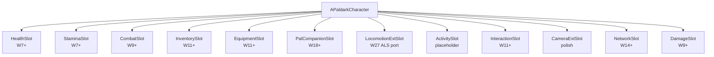

### Slot Status (cập nhật theo README)

| Slot | Status | Week landed | Class |
|------|--------|-------------|-------|
| `HealthSlot` | Stub | (W7+ via GAS AttributeSet) | `UActorComponent` |
| `StaminaSlot` | Stub | (W7+ via GAS AttributeSet) | `UActorComponent` |
| `CombatSlot` | Stub | (W9+ via `GA_HitscanFire`) | `UActorComponent` |
| `InventorySlot` | **Live W11-12** | W11-12 | `UPaldarkPlayerInventoryComponent` (replicated) |
| `EquipmentSlot` | Stub | W11+ | `UActorComponent` |
| `PalCompanionSlot` | Stub | W18+ | `UActorComponent` |
| `LocomotionExtSlot` | Stub | W27 (ALS port) | `UActorComponent` |
| `ActivitySlot` | Reserved | — | `UActorComponent` |
| `InteractionSlot` | Stub | W11+ | `UActorComponent` |
| `CameraExtSlot` | Stub | polish | `UActorComponent` |
| `NetworkSlot` | Stub | W14+ | `UActorComponent` |
| `DamageSlot` | Stub | W9+ | `UActorComponent` |

### Why Empty Slots Now?

- **Stable file layout:** Phụ thuộc class path đã pin (Blueprint subclass có thể reference) — sau này swap implementation không break BP reference.
- **Designer extension via BP:** Designer subclass `UHealthSlot` thành `BP_HealthSlot_Heavy` để test trước khi C++ logic land.
- **Compile time bound:** Mỗi slot là 1 header + cpp ~10 dòng → compile fast, không như god-character cần 5K dòng/compile.

Sources: [README.md#L59-L64](https://github.com/SlimeVRX/Soliz-PaldarkLab/blob/161fdd92/README.md#L59-L64)

## 7.3 Inventory & Equipment

> **Source:** [PaldarkPlayerInventoryComponent.h](https://github.com/SlimeVRX/Soliz-PaldarkLab/blob/161fdd92/Source/PaldarkLab/Public/Inventory/PaldarkPlayerInventoryComponent.h) · [PaldarkItemDefinition.h](https://github.com/SlimeVRX/Soliz-PaldarkLab/blob/161fdd92/Source/PaldarkLab/Public/Inventory/PaldarkItemDefinition.h) · [PaldarkItemFragment.h](https://github.com/SlimeVRX/Soliz-PaldarkLab/blob/161fdd92/Source/PaldarkLab/Public/Inventory/PaldarkItemFragment.h)

W11-12 inventory port từ Udemy [09] *UE5 C++ Inventory Systems*, rephrase để match tag-keyed data model của PALDARK.

### Class Diagram

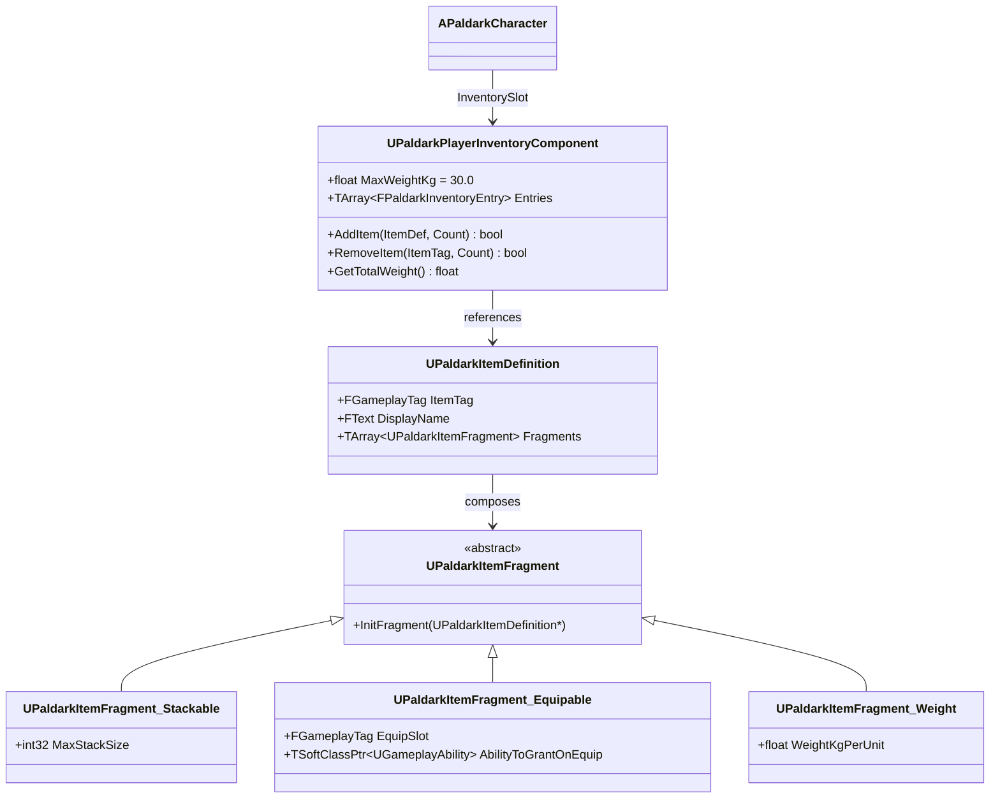

### Item Definition (Primary Data Asset)

Mỗi item là 1 Data Asset — `DA_Item_Pistol`, `DA_Item_Ammo9mm`, `DA_Item_Bandage`, `DA_Item_PalSphere`, `DA_Item_EnergyDrink` (5 item W11-12).

```cpp
UCLASS(BlueprintType)
class UPaldarkItemDefinition : public UPrimaryDataAsset
{
    GENERATED_BODY()
public:
    UPROPERTY(EditAnywhere)
    FGameplayTag ItemTag;  // "Paldark.Item.Pistol"

    UPROPERTY(EditAnywhere)
    FText DisplayName;

    UPROPERTY(EditAnywhere, Instanced, EditInlineNew)
    TArray<TObjectPtr<UPaldarkItemFragment>> Fragments;
};
```

`Instanced + EditInlineNew` cho phép designer inline-edit fragment trong inspector — không cần tạo riêng fragment asset.

### Replicated Inventory Component

```cpp
UCLASS(ClassGroup="Paldark", meta=(BlueprintSpawnableComponent))
class UPaldarkPlayerInventoryComponent : public UActorComponent
{
    GENERATED_BODY()
public:
    UPROPERTY(Replicated, EditDefaultsOnly)
    float MaxWeightKg = 30.0f;

    UPROPERTY(ReplicatedUsing = OnRep_Entries)
    TArray<FPaldarkInventoryEntry> Entries;

    UFUNCTION(BlueprintCallable, Server, Reliable)
    void Server_AddItem(UPaldarkItemDefinition* Def, int32 Count);

    UFUNCTION(BlueprintCallable, BlueprintPure)
    float GetTotalWeight() const;
};
```

Weight enforcement: trước khi `AddItem`, component check `GetTotalWeight() + (Def.WeightFragment.WeightKgPerUnit * Count) <= MaxWeightKg`. Nếu vượt → reject + log to `LogPaldarkInventory`.

### Console Commands (W11-12)

| Command | Effect |
|---------|--------|
| `Paldark.Inv.Add <ItemTag> [Count]` | Server-add item to local player inventory |
| `Paldark.Inv.Remove <ItemTag> [Count]` | Server-remove |
| `Paldark.Inv.Dump` | Log toàn bộ entries + total weight |
| `Paldark.Inv.SetMaxWeight <Kg>` | Override `MaxWeightKg` runtime |

### Anti-Patterns Avoided

- **Storing item as `UObject*` thay vì `UPrimaryDataAsset`:** Mất khả năng AssetManager scan + soft reference.
- **Fragment là `UStruct`:** Mất polymorphism, không subclass được trong BP.
- **Replicate full `UPaldarkItemDefinition`:** Reference data asset bằng `FGameplayTag` (item tag), client tự resolve qua AssetManager — bandwidth-cheap.
- **Tính weight per-frame:** Cache total weight, recompute chỉ khi `Entries` change.

Sources: [README.md#L372-L466](https://github.com/SlimeVRX/Soliz-PaldarkLab/blob/161fdd92/README.md#L372-L466)

## 7.4 Squad & Ping System

> **Source:** [Source/PaldarkLab/Public/Squad/](https://github.com/SlimeVRX/Soliz-PaldarkLab/blob/161fdd92/Source/PaldarkLab/Public/Squad/) — W22-23

W22-23 squad system gồm 3 `UWorldSubsystem` + 1 replicated marker actor:

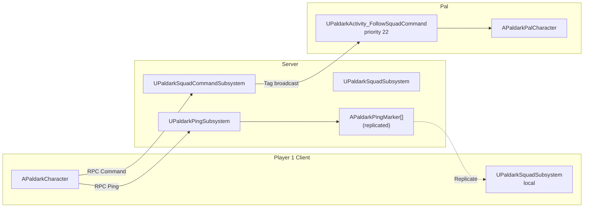

### Subsystems

| Subsystem | Scope | Purpose |
|-----------|-------|---------|
| `UPaldarkSquadSubsystem` | World | Tracks squad membership, broadcasts roster updates |
| `UPaldarkPingSubsystem` | World | Manages `APaldarkPingMarker` lifecycle, replicates to all clients |
| `UPaldarkSquadCommandSubsystem` | World | Holds last squad command tag (`Stack`/`Cover`/`Push`/`Retreat`), broadcasts via `OnCommandChanged` |

### Ping Lifecycle

1. Player aim + press `T` → `IA_Ping` triggered → `APaldarkCharacter::HandlePing()` server RPC with world location + ping type.
2. `UPaldarkPingSubsystem::ServerSpawnPing(Location, Type, Instigator)` spawns `APaldarkPingMarker` (replicated).
3. Marker auto-destroy sau `LifetimeSeconds` (default 8s) hoặc khi player ping cùng vị trí ±50cm.
4. Client receive replicated marker → UI render via `UPaldarkPingIndicator` widget.

### Squad Command Radial

8-slot radial wheel:

```
        [Stack]
   [Pal-Heel]  [Cover]
[Pal-Defend]      [Push]
   [Pal-Scout]  [Retreat]
        [Pal-Attack]
```

4 Pal command + 4 squad command. Designer author qua DataAsset `UPaldarkRadialCommandSet`.

### Activity Integration

`UPaldarkActivity_FollowSquadCommand` (priority 22, giữa Follow=20 và Stalk=25) — Pal listen `OnCommandChanged` event. Khi command = `Stack` thì Pal di chuyển vào player's standing position; `Cover` thì tìm nearest cover; `Push` thì di chuyển forward.

Sources: [README.md#L1440-L1670](https://github.com/SlimeVRX/Soliz-PaldarkLab/blob/161fdd92/README.md#L1440-L1670)

---

# 8. Pal (Companion) Systems

> **Source files:** [Source/PaldarkLab/Public/Pal/](https://github.com/SlimeVRX/Soliz-PaldarkLab/blob/161fdd92/Source/PaldarkLab/Public/Pal/) · [Source/PaldarkLab/Private/Pal/](https://github.com/SlimeVRX/Soliz-PaldarkLab/blob/161fdd92/Source/PaldarkLab/Private/Pal/)

Pal Systems là pillar **quan trọng nhất** của PALDARK — Pal Bond Trumps Gun. Chia 5 sub-page: Pal pawn + species, Activity FSM, Combat + Perception, Taming + Bond, Spawning + Roster.

## 8.1 Pal Character & Species

> **Source:** [PaldarkPalCharacter.h](https://github.com/SlimeVRX/Soliz-PaldarkLab/blob/161fdd92/Source/PaldarkLab/Public/Pal/PaldarkPalCharacter.h) · [PaldarkPalDefinition.h](https://github.com/SlimeVRX/Soliz-PaldarkLab/blob/161fdd92/Source/PaldarkLab/Public/Pal/PaldarkPalDefinition.h)

`APaldarkPalCharacter` là `ACharacter` subclass dùng cho **cả companion lẫn hostile**. Phân biệt qua `UPaldarkPalDefinition` (data asset) + team tag.

### 8-Slot Component Layout

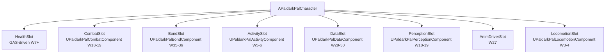

Trong 8 slot, chỉ `LocomotionSlot` có behaviour thật ở W3-4. Còn lại stub đến week tương ứng:

| Slot | Week | Component class |
|------|------|-----------------|
| `LocomotionSlot` | **W3-4 live** | `UPaldarkPalLocomotionComponent` |
| `ActivitySlot` | **W5-6 live** | `UPaldarkPalActivityComponent` |
| `HealthSlot` | W7-8 | (ASC + AttributeSet thay vì component riêng) |
| `CombatSlot` | W18-19 | `UPaldarkPalCombatComponent` |
| `PerceptionSlot` | W18-19 | `UPaldarkPalPerceptionComponent` |
| `AnimDriverSlot` | W27 | (Linked AnimInstance) |
| `DataSlot` | W29-30 | `UPaldarkPalDataComponent` |
| `BondSlot` | W35-36 | `UPaldarkPalBondComponent` |

### UPaldarkPalDefinition (Primary Data Asset)

Mỗi loài Pal là 1 Data Asset:

```cpp
UCLASS(BlueprintType)
class UPaldarkPalDefinition : public UPrimaryDataAsset
{
    GENERATED_BODY()
public:
    UPROPERTY(EditAnywhere)
    FGameplayTag SpeciesTag;  // "Paldark.Pal.Species.Foxparks"

    UPROPERTY(EditAnywhere)
    FText DisplayName;

    UPROPERTY(EditAnywhere)
    TSoftClassPtr<APaldarkPalCharacter> PalClass;  // Blueprint subclass

    UPROPERTY(EditAnywhere)
    FPaldarkPalStatRange BaseStats;  // Speed/Strength/Stealth/Smarts range

    UPROPERTY(EditAnywhere)
    TArray<TSubclassOf<UGameplayAbility>> GrantedAbilities;

    UPROPERTY(EditAnywhere)
    TArray<FPaldarkBossPhaseSpec> BossPhases;  // for boss-tier (Boltmane Alpha)

    UPROPERTY(EditAnywhere)
    EPaldarkPalRole DefaultRole;  // Companion | Hostile_Ground | Hostile_Aerial | Boss
};
```

### 10 Species (Beta Target)

| Species | Tier | Role | Bahaviour ladder | Signature |
|---------|------|------|------------------|-----------|
| **Foxparks** | Common | Companion | Idle → Follow → Investigate → Combat | Distract bomb (W29-30) |
| **Tombat** | Common | Companion | Idle → Follow → Scout → Mark | Aerial mark (W29-30) |
| **Direhound** | Common | Hostile Ground (pack) | Patrol → Stalk → Combat | Pack call (W20-21) |
| **Razorbird** | Common | Hostile Aerial (solo) | Patrol → Stalk → Hit-and-run | Dive attack (W20-21) |
| **Stoneclad** | Rare | Hostile (tank) | Patrol → Charge → Combat | Body slam (W29-30) |
| **Vinewraith** | Rare | Hostile (ranged) | Patrol → Root → Ranged | Vine snare (W29-30) |
| **Boltmane** | Rare | Companion | Idle → Follow → Combat | Lightning dash (W29-30) |
| **Boltmane Alpha** | Legendary | Boss | Patrol → Stalk → BossPhase | 3-phase HP threshold (W29-30 + W39 L-28) |
| ... | | | | |

Sources: [README.md#L2169-L2447](https://github.com/SlimeVRX/Soliz-PaldarkLab/blob/161fdd92/README.md#L2169-L2447)

## 8.2 Activity FSM

> **Source:** [Source/PaldarkLab/Public/Pal/Activities/](https://github.com/SlimeVRX/Soliz-PaldarkLab/blob/161fdd92/Source/PaldarkLab/Public/Pal/Activities/) · [PaldarkPalActivityComponent.h](https://github.com/SlimeVRX/Soliz-PaldarkLab/blob/161fdd92/Source/PaldarkLab/Public/Pal/Components/PaldarkPalActivityComponent.h)

**Core behavioural engine** của mọi Pal (companion + hostile). Server-side authority, priority-based preemption với hysteresis. Pattern port từ Ready or Not's Activity FSM.

### Architecture

2 class chính:

1. **`UPaldarkPalActivityComponent`** — orchestrator. Manage list candidate, select + tick activity hiện tại.
2. **`UPaldarkBaseActivity`** — base class cho mọi behaviour. Provide lifecycle hook (`Enter` / `Tick` / `Exit`) + utility helpers.

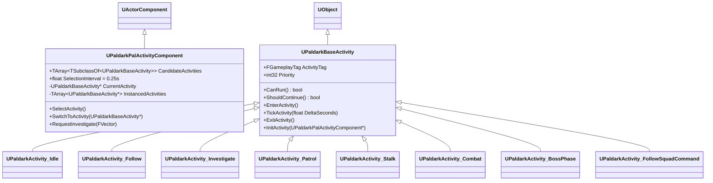

### Activity Lifecycle

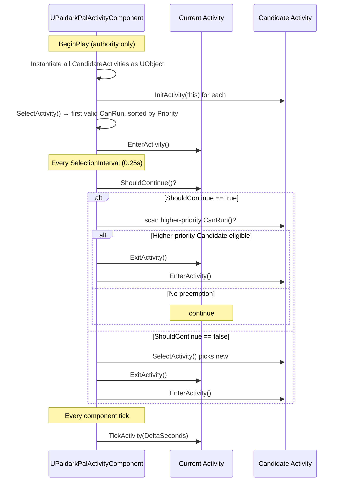

### Lifecycle Hooks

- **`InitActivity(Comp*)`** — called once on `BeginPlay`, cache reference to Pal owner + other components (Locomotion, Combat, Perception).
- **`CanRun()`** — predicate, evaluated every `SelectionInterval` to check eligibility.
- **`ShouldContinue()`** — hysteresis. Allow activity tiếp tục dù higher-priority eligible (prevent chatter at threshold).
- **`EnterActivity()`** — state setup (e.g., disable follow leash, play animation montage).
- **`TickActivity(float)`** — per-frame logic (e.g., `AddMovementInput`).
- **`ExitActivity()`** — restore state (e.g., re-enable leash, restore walk speed).

Tất cả là `BlueprintNativeEvent` — designer subclass trong BP không cần touch C++.

### 8 Concrete Activities

| Activity | Priority | Purpose | Key Logic |
|----------|----------|---------|-----------|
| `Idle` | 10 | Fallback state | Disables locomotion follow |
| `Patrol` | 15 | Hostile-Pal movement | Cycles waypoints in `UPaldarkPalPatrolComponent` |
| `Follow` | 20 | Companion leash | Moves toward owner based on `EnterDistance` / `ExitDistance` hysteresis |
| `FollowSquadCommand` | 22 | Squad reaction | React `TAG_Paldark_Squad_Command_*` from `UPaldarkSquadSubsystem` |
| `Stalk` | 25 | Predatory approach | Approach target while outside `MinEngageRange`, reduced speed |
| `Investigate` | 30 | Ping response | Move to specific location requested via `RequestInvestigate(Location)` |
| `Combat` | 40 | Engagement | Face target + trigger `TryFireAttack` on `UPaldarkPalCombatComponent` |
| `BossPhase` | 50 | Boss mechanics | Health-based phase (Normal → Enraged → Telegraph) |

### Investigate Activity Detail (W5-6)

`UPaldarkActivity_Investigate` (priority 30):
- `CanRun` gated by `UPaldarkPalActivityComponent::HasActiveInvestigateRequest()`, set via `RequestInvestigate(Location)`.
- `EnterActivity` pause leash (`SetFollowEnabled(false)`).
- `TickActivity` steer toward request location qua `AddMovementInput`. Clear request khi distance < `ArrivalRadius` (default 150cm), hard-timeout sau `MaxInvestigateTime` (default 8s).
- `ExitActivity` re-enable leash.

### Hysteresis Pattern (Follow)

Anti-chatter design: Follow EnterDistance > ExitDistance.

```cpp
bool UPaldarkActivity_Follow::CanRun_Implementation() const
{
    return GetPlanarDistanceToFollowedPawn() > EnterDistance;  // 700cm
}

bool UPaldarkActivity_Follow::ShouldContinue_Implementation() const
{
    return GetPlanarDistanceToFollowedPawn() > ExitDistance;   // 450cm
}
```

Player đứng exactly tại locomotion threshold (500cm) → distance hover quanh 500 → Idle/Follow không flip ping-pong vì gap 250cm.

### Authoring Custom Activity

```cpp
// 1. Subclass
UCLASS()
class UPaldarkActivity_Patrol : public UPaldarkBaseActivity
{
    GENERATED_BODY()
public:
    UPaldarkActivity_Patrol()
    {
        ActivityTag = PaldarkGameplayTags::Pal_Activity_Patrol;
        Priority = 15;
    }

    virtual bool CanRun_Implementation() const override
    {
        return PatrolComp && PatrolComp->HasWaypoints();
    }

    virtual void TickActivity_Implementation(float DeltaSeconds) override
    {
        FVector Target = PatrolComp->GetCurrentWaypoint();
        GetPalOwner()->AddMovementInput((Target - GetPalOwner()->GetActorLocation()).GetSafeNormal());
        if (DistanceSq < ArrivalSq) PatrolComp->AdvanceWaypoint();
    }
};
```

2. Add to `UPaldarkPalActivityComponent::CandidateActivities` (or BP subclass).
3. Priority guidance:
   - `0–19`: ambient / idle
   - `20–49`: routine (Follow, Patrol, Investigate)
   - `50–79`: player-driven (Investigate, GoTo)
   - `80+`: combat / threat reactions (BossPhase)

### Anti-Patterns Avoided

- **Calling `AddMovementInput` from `EnterActivity`** — movement input must apply every frame, dùng `TickActivity`.
- **Modify activity component from inside tick** — mutate component-owned request state thay vì call `SwitchToActivity` recursive.
- **Same activity class twice in `CandidateActivities`** — FSM instantiate duplicate, priority tie-break order-dependent (later wins, designer confused).
- **Replicate activity state directly** — FSM runs authority-only. Replicate qua *outcome* (movement, anim notify, GE effect) trên subsystem đã replicated rồi.

Sources: [README.md#L255-L277](https://github.com/SlimeVRX/Soliz-PaldarkLab/blob/161fdd92/README.md#L255-L277)

## 8.3 Pal Combat & Perception

> **Source:** [PaldarkPalCombatComponent.h](https://github.com/SlimeVRX/Soliz-PaldarkLab/blob/161fdd92/Source/PaldarkLab/Public/Pal/Components/PaldarkPalCombatComponent.h) · [PaldarkPalPerceptionComponent.h](https://github.com/SlimeVRX/Soliz-PaldarkLab/blob/161fdd92/Source/PaldarkLab/Public/Pal/Components/PaldarkPalPerceptionComponent.h) · [PaldarkPalConsideration.h](https://github.com/SlimeVRX/Soliz-PaldarkLab/blob/161fdd92/Source/PaldarkLab/Public/Pal/Combat/PaldarkPalConsideration.h) — W18-19

Combat + Perception là Pal's nervous system: perception detect threat → combat react.

### Component Architecture

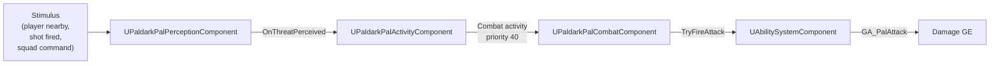

### UPaldarkPalPerceptionComponent

Lightweight sense system — chưa dùng AIPerception built-in của UE (đắt với 16+ Pal). Tick at 5Hz, scan `ThreatOctree` (W22-23 spatial subsystem):

```cpp
UCLASS(ClassGroup="Paldark")
class UPaldarkPalPerceptionComponent : public UActorComponent
{
    GENERATED_BODY()
public:
    UPROPERTY(EditDefaultsOnly)
    float SightRange = 2000.f;    // 20m

    UPROPERTY(EditDefaultsOnly)
    float SightFOV = 120.f;       // degrees

    UPROPERTY(EditDefaultsOnly)
    float HearingRange = 4000.f;  // 40m, hear shots

    UPROPERTY(BlueprintAssignable)
    FOnThreatPerceived OnThreatPerceived;

    AActor* GetBestThreat() const;
};
```

Threat scoring uses 3 consideration:
1. **Distance** — closer = higher
2. **LoS** — clear line of sight 2x weight
3. **Team tag** — `Paldark.Team.Player` for hostile-Pal, `Paldark.Team.Hostile` for companion

### UPaldarkPalCombatComponent

State machine cho combat trong combat activity:

- **Engage** — face target, walk to MinEngageRange
- **Aim** — pause, anim cue `Pal.Aim`
- **Attack** — activate `GA_PalAttack` qua ASC
- **Cooldown** — wait `AttackInterval` (1.2s default, modified by BossPhase)
- **Disengage** — target lost (distance > MaxEngageRange + LoS fail × 3) → exit

### UPaldarkPalConsideration (Utility AI)

Utility scoring cho Combat activity selection:

```cpp
USTRUCT(BlueprintType)
struct FPaldarkConsiderationScore
{
    GENERATED_BODY()
    UPROPERTY() float ThreatDistanceScore;    // 0-1, inverted distance
    UPROPERTY() float SelfHealthScore;         // 0-1, low health = lower
    UPROPERTY() float AttackReadinessScore;   // 0-1, off-cooldown = 1
    UPROPERTY() float CombinedScore;          // weighted sum
};
```

Combat activity's `CanRun` gates on `CombinedScore >= EngageThreshold` (default 0.6). Pattern này cho phép designer A/B test threat reaction profile per-species qua DataAsset.

### Aggro Hysteresis

Tránh chatter:
- `EngageThreshold = 0.6` (enter combat)
- `DisengageThreshold = 0.4` (exit combat)

Pal aggro vào player ở score 0.6, stay aggro đến khi score drop < 0.4. Gap 0.2 đủ chống flicker.

Sources: [README.md#L859-L1097](https://github.com/SlimeVRX/Soliz-PaldarkLab/blob/161fdd92/README.md#L859-L1097)

## 8.4 Taming & Bond System

> **Source:** [PaldarkPalBondComponent.h](https://github.com/SlimeVRX/Soliz-PaldarkLab/blob/161fdd92/Source/PaldarkLab/Public/Pal/Components/PaldarkPalBondComponent.h) · [PaldarkPalTameComponent.h](https://github.com/SlimeVRX/Soliz-PaldarkLab/blob/161fdd92/Source/PaldarkLab/Public/Pal/Components/PaldarkPalTameComponent.h) — W35-36

W35-36 tame minigame + Bond Level progression.

### Tame Flow

```mermaid
sequenceDiagram
    participant Player as Player
    participant PalChar as Hostile Pal
    participant Tame as UPaldarkPalTameComponent
    participant Roster as UPaldarkPalRosterSubsystem

    Player->>PalChar: Throw Pal Sphere (consume from inventory)
    PalChar->>Tame: BeginTameAttempt(Instigator, SphereTier)
    Tame->>Tame: Compute SuccessRate (PalHP%, SphereTier, BondLevel buff)
    Tame->>Tame: 3 mini-event QTE over 4s
    alt All QTE success
        Tame->>PalChar: ConvertToCompanion(Player)
        PalChar->>PalChar: SwitchTeamTag → Paldark.Team.Player
        PalChar->>Roster: AddPalToRoster(NewPalInstance)
        Roster-->>Player: OnPalTamed event
    else Any QTE fail
        Tame->>PalChar: BreakFree() → resume hostile activity
    end
```

### UPaldarkPalBondComponent

`BondLevel` 0-20, ramp via combat success / time-with-owner / feed event:

```cpp
UCLASS(ClassGroup="Paldark")
class UPaldarkPalBondComponent : public UActorComponent
{
    GENERATED_BODY()
public:
    UPROPERTY(ReplicatedUsing = OnRep_BondLevel, EditAnywhere)
    int32 BondLevel = 0;

    UPROPERTY(EditDefaultsOnly)
    UCurveTable* BondToAbilityUnlocks;

    void AddBondXP(int32 Amount);
    int32 GetUnlockedAbilityCount() const;
    bool CanRevivePlayer() const { return BondLevel >= 13; }
};
```

Bond → ability unlock theo curve table (xem [§2.1 Pillar 1](#pillar-1--pal-bond-trumps-gun) cho mapping table).

### Permadeath & Body Extraction

Pal HP = 0 → state `Paldark.State.IsDead` set. Body persist 5 phút trong raid. Nếu player kéo body về extract beacon → server-side persist với `bResurrectedFromBody=true`. Otherwise → wipe từ roster on extract.

Sources: [README.md#L2759-L2884](https://github.com/SlimeVRX/Soliz-PaldarkLab/blob/161fdd92/README.md#L2759-L2884)

## 8.5 Pal Spawning & Roster

> **Source:** [PaldarkPalRosterSubsystem.h](https://github.com/SlimeVRX/Soliz-PaldarkLab/blob/161fdd92/Source/PaldarkLab/Public/Pal/PaldarkPalRosterSubsystem.h) · [PaldarkPalSpawner.h](https://github.com/SlimeVRX/Soliz-PaldarkLab/blob/161fdd92/Source/PaldarkLab/Public/Pal/PaldarkPalSpawner.h)

### Spawner Actor (Hostile-Pal, W20-21)

```cpp
UCLASS(Blueprintable)
class APaldarkPalSpawner : public AActor
{
    GENERATED_BODY()
public:
    UPROPERTY(EditAnywhere)
    TArray<FPaldarkPalSpawnEntry> SpawnTable;  // Pal class + weight

    UPROPERTY(EditAnywhere)
    int32 MaxConcurrent = 4;

    UPROPERTY(EditAnywhere)
    float RespawnDelay = 30.f;

    void SpawnPal();
    void OnPalDestroyed(AActor* Pal);
};
```

Spawner pool quản lý concurrent count. Khi 1 Pal chết → `OnPalDestroyed` schedule respawn sau `RespawnDelay` nếu dưới `MaxConcurrent`.

### Roster Subsystem (Companion, W3-4 + W35-36)

`UPaldarkPalRosterSubsystem` (GameInstance scope) — cross-session Pal list cho 1 player.

```cpp
UCLASS()
class UPaldarkPalRosterSubsystem : public UGameInstanceSubsystem
{
    GENERATED_BODY()
public:
    void AddPal(const FPaldarkPalInstance& Pal);
    void RemovePal(FGuid PalId);
    TArray<FPaldarkPalInstance> GetRoster() const;
    FPaldarkPalInstance* FindPal(FGuid PalId);
};

USTRUCT()
struct FPaldarkPalInstance
{
    GENERATED_BODY()
    UPROPERTY() FGuid PalId;
    UPROPERTY() FGameplayTag SpeciesTag;
    UPROPERTY() int32 BondLevel;
    UPROPERTY() FPaldarkPalGenes Genes;  // Speed/Strength/Stealth/Smarts
    UPROPERTY() int32 Generation;
    UPROPERTY() FString OriginalTamerName;
    UPROPERTY() FDateTime TameTimestamp;
};
```

W42-43 sẽ wire `UPaldarkPalRosterSubsystem` lên `UPaldarkBackendSubsystem` để persist qua AWS DynamoDB. Pre-W42 chỉ in-memory.

### Console Commands

| Command | Effect |
|---------|--------|
| `Paldark.Pal.SpawnTestCompanion [index|class_path]` | W3-4: spawn 1 Pal behind local player |
| `Paldark.Pal.Roster.List` | Print roster |
| `Paldark.Pal.Roster.Clear` | Clear roster (dev only) |
| `Paldark.Pal.Roster.AddDebug <SpeciesTag>` | Add Pal instance với random gen |

Sources: [README.md#L1098-L1440](https://github.com/SlimeVRX/Soliz-PaldarkLab/blob/161fdd92/README.md#L1098-L1440), [README.md#L2169-L2447](https://github.com/SlimeVRX/Soliz-PaldarkLab/blob/161fdd92/README.md#L2169-L2447)

---

# 9. Gameplay Ability System (GAS)

> **Source files:** [Source/PaldarkLab/Public/Gas/](https://github.com/SlimeVRX/Soliz-PaldarkLab/blob/161fdd92/Source/PaldarkLab/Public/Gas/) · [Source/PaldarkLab/Private/Gas/](https://github.com/SlimeVRX/Soliz-PaldarkLab/blob/161fdd92/Source/PaldarkLab/Private/Gas/)

PaldarkLab dùng GAS (Gameplay Ability System) cho ability + damage + status. Player + Pal đều có ASC mount on Pawn (theo Aura pattern). 3 sub-page: AttributeSet + Damage Pipeline, Gameplay Abilities, Lag Compensation.

## 9.1 Attribute Set & Damage Pipeline

> **Source:** [PaldarkAttributeSet.h](https://github.com/SlimeVRX/Soliz-PaldarkLab/blob/161fdd92/Source/PaldarkLab/Public/Gas/PaldarkAttributeSet.h) · [PaldarkDamageExecutionCalculation.h](https://github.com/SlimeVRX/Soliz-PaldarkLab/blob/161fdd92/Source/PaldarkLab/Public/Gas/PaldarkDamageExecutionCalculation.h) · [PaldarkAbilitySystemComponent.h](https://github.com/SlimeVRX/Soliz-PaldarkLab/blob/161fdd92/Source/PaldarkLab/Public/Gas/PaldarkAbilitySystemComponent.h)

### Attribute Set (W7-8 + W9-10)

```cpp
UCLASS()
class UPaldarkAttributeSet : public UAttributeSet
{
    GENERATED_BODY()
public:
    UPROPERTY(BlueprintReadOnly, ReplicatedUsing = OnRep_Health)
    FGameplayAttributeData Health;
    ATTRIBUTE_ACCESSORS(UPaldarkAttributeSet, Health);

    UPROPERTY(BlueprintReadOnly, ReplicatedUsing = OnRep_MaxHealth)
    FGameplayAttributeData MaxHealth;
    ATTRIBUTE_ACCESSORS(UPaldarkAttributeSet, MaxHealth);

    UPROPERTY(BlueprintReadOnly, ReplicatedUsing = OnRep_Stamina)
    FGameplayAttributeData Stamina;
    
    UPROPERTY(BlueprintReadOnly, ReplicatedUsing = OnRep_MaxStamina)
    FGameplayAttributeData MaxStamina;
    
    UPROPERTY(BlueprintReadOnly, ReplicatedUsing = OnRep_MoveSpeed)
    FGameplayAttributeData MoveSpeed;

    UPROPERTY(BlueprintReadOnly, ReplicatedUsing = OnRep_Armor)
    FGameplayAttributeData Armor;  // W9-10

    // Meta-attribute (transient, not replicated)
    UPROPERTY(BlueprintReadOnly)
    FGameplayAttributeData IncomingDamage;  // W9-10
    
    // Delegate broadcast khi Health == 0
    FOnHealthZeroed OnHealthZeroed;

    virtual void PostGameplayEffectExecute(const FGameplayEffectModCallbackData& Data) override;
};
```

### Damage Pipeline (W9-10)

```mermaid
sequenceDiagram
    participant GA as GA_HitscanFire (server)
    participant SrcASC as Source ASC (player)
    participant TgtASC as Target ASC (dummy)
    participant Exec as UPaldarkDamageExecutionCalculation
    participant AttrSet as UPaldarkAttributeSet

    GA->>GA: Line trace from camera, detect hit + headshot
    GA->>SrcASC: MakeOutgoingSpec(GE_Damage_Standard)
    GA->>SrcASC: SetSetByCallerMagnitude(BaseDamage, 25)
    GA->>SrcASC: SetSetByCallerMagnitude(HeadshotMultiplier, 2.0)
    GA->>SrcASC: AddDynamicAssetTag(Paldark.Hit.Headshot)
    SrcASC->>TgtASC: ApplyGameplayEffectSpecToTarget
    TgtASC->>Exec: Execute()
    Exec->>Exec: Capture Target.Armor
    Exec->>Exec: final = base × headshot × (100 / (100 + armor))
    Exec->>AttrSet: AddOutputModifier(IncomingDamage, final)
    AttrSet->>AttrSet: PostGameplayEffectExecute
    AttrSet->>AttrSet: Drain IncomingDamage → Health
    AttrSet->>AttrSet: Clamp Health [0, MaxHealth]
    alt Health == 0
        AttrSet->>AttrSet: OnHealthZeroed.Broadcast(InstigatorASC)
    end
```

### UPaldarkDamageExecutionCalculation

Damage formula data-driven via `SetByCaller`:

```cpp
void UPaldarkDamageExecutionCalculation::Execute_Implementation(
    const FGameplayEffectCustomExecutionParameters& ExecutionParams,
    OUT FGameplayEffectCustomExecutionOutput& OutExecutionOutput) const
{
    float Armor = 0.f;
    ExecutionParams.AttemptCalculateCapturedAttributeMagnitude(ArmorDef, EvalParams, Armor);

    const FGameplayEffectSpec& Spec = ExecutionParams.GetOwningSpec();
    float BaseDamage = Spec.GetSetByCallerMagnitude(PaldarkGameplayTags::SetByCaller_BaseDamage);
    float HeadshotMult = Spec.GetSetByCallerMagnitude(PaldarkGameplayTags::SetByCaller_HeadshotMultiplier);

    float Mitigation = 100.f / (100.f + Armor);
    float FinalDamage = BaseDamage * HeadshotMult * Mitigation;

    OutExecutionOutput.AddOutputModifier(FGameplayModifierEvaluatedData(
        IncomingDamageProperty, EGameplayModOp::Additive, FinalDamage));

    UE_LOG(LogPaldarkGAS, Log, TEXT("DamageExec — base=%.2f headshot=%.2f armor=%.2f mitigation=%.3f final=%.2f"),
        BaseDamage, HeadshotMult, Armor, Mitigation, FinalDamage);
}
```

### PostGameplayEffectExecute (AttributeSet)

```cpp
void UPaldarkAttributeSet::PostGameplayEffectExecute(const FGameplayEffectModCallbackData& Data)
{
    Super::PostGameplayEffectExecute(Data);
    if (Data.EvaluatedData.Attribute == GetIncomingDamageAttribute())
    {
        const float DmgValue = GetIncomingDamage();
        SetIncomingDamage(0.f);  // drain meta-attribute
        const float NewHealth = FMath::Clamp(GetHealth() - DmgValue, 0.f, GetMaxHealth());
        SetHealth(NewHealth);
        UE_LOG(LogPaldarkGAS, Log, TEXT("PostExec — IncomingDamage=%.2f -> Health %.2f → %.2f"),
            DmgValue, GetHealth() + DmgValue, NewHealth);
        if (NewHealth <= 0.f)
        {
            UE_LOG(LogPaldarkGAS, Log, TEXT("Health hit 0, broadcasting OnHealthZeroed."));
            OnHealthZeroed.Broadcast(Data.EffectSpec.GetEffectContext().GetInstigatorAbilitySystemComponent());
        }
    }
}
```

### Anti-Patterns Avoided

- **Adding `Health` modifier to damage GE alongside execution calc:** Both apply → damage double (or clamp twice). Stick với `IncomingDamage` meta-attribute path.
- **Reading `Health` directly inside execution calc:** Captured magnitudes evaluated at execute time → stale `Health` read. Write `IncomingDamage`, let `PostGameplayEffectExecute` move sang Health.
- **Skipping `CommitAbility` in Fire ability:** Không có nó, no cost/cooldown GE fire → W17+ ammo/cooldown work không reuse được cùng call site.
- **Driving damage on client:** Client fabricate damage. Server-only `NetExecutionPolicy = ServerOnly` cho damage abilities. Authority qua server đến khi W22+ predicted weapons.
- **Replicate `IncomingDamage`:** Meta-attribute transient, không persistent. Replicate leak intermediate state + break audit trail.
- **Call `Destroy()` directly inside `OnHealthZeroed`:** AttributeSet still hold strong ref khi GE đang executing. Schedule via `FTimerHandle` (1.5s default) cho GE chain unwind first.

Sources: [README.md#L278-L371](https://github.com/SlimeVRX/Soliz-PaldarkLab/blob/161fdd92/README.md#L278-L371)

## 9.2 Gameplay Abilities

> **Source:** [Source/PaldarkLab/Public/Gas/Abilities/](https://github.com/SlimeVRX/Soliz-PaldarkLab/blob/161fdd92/Source/PaldarkLab/Public/Gas/Abilities/)

### Base Class — UPaldarkGameplayAbility

```cpp
UCLASS(Abstract)
class UPaldarkGameplayAbility : public UGameplayAbility
{
    GENERATED_BODY()
public:
    UPROPERTY(EditDefaultsOnly, Category="Paldark|Activation")
    FGameplayTag ActivationInputTag;  // lookup key for InputConfig binding
};
```

`ActivationInputTag` là key cho `UPaldarkAbilitySystemComponent::ActivateAbilityByInputTag(Tag)` — tránh hardcode `UClass` reference từ binding code.

### Concrete Abilities

| Ability | Week | Activation Tag | Effect |
|---------|------|----------------|--------|
| `UPaldarkGameplayAbility_Sprint` | W7-8 | `Paldark.Ability.Sprint` | Apply Sprint cost GE (drain stamina) + MoveSpeed buff GE |
| `UPaldarkGameplayAbility_HitscanFire` | W9-10 | `Paldark.Ability.Fire` | Line trace from camera, apply `GE_Damage_Standard` to hit target |
| `UPaldarkGameplayAbility_PalAttack` | W18-19 | `Paldark.Ability.PalAttack` | Pal's combat activity trigger này via ASC |
| `UPaldarkGameplayAbility_Reload` | W17+ | `Paldark.Ability.Reload` | (Future) reload weapon |

### GA_HitscanFire Detail (W9-10)

```cpp
UCLASS()
class UPaldarkGameplayAbility_HitscanFire : public UPaldarkGameplayAbility
{
    GENERATED_BODY()
public:
    UPROPERTY(EditDefaultsOnly)
    TSubclassOf<UGameplayEffect> DamageEffectClass;  // GE_Damage_Standard

    UPROPERTY(EditDefaultsOnly)
    float FireRange = 10000.f;  // 100m

    UPROPERTY(EditDefaultsOnly)
    float BaseDamage = 25.f;

    UPROPERTY(EditDefaultsOnly)
    float HeadshotMultiplier = 2.0f;

    UPROPERTY(EditDefaultsOnly)
    FName HeadBoneName = TEXT("head");

    virtual void ActivateAbility(const FGameplayAbilitySpecHandle Handle, const FGameplayAbilityActorInfo* ActorInfo, const FGameplayAbilityActivationInfo ActivationInfo, const FGameplayEventData* TriggerEventData) override;
};
```

`ActivateAbility` runs line trace from camera, identify head bone hit, apply `GE_Damage_Standard` via `MakeOutgoingSpec` + `SetSetByCallerMagnitude` (BaseDamage + HeadshotMultiplier) + `ApplyGameplayEffectSpecToTarget`.

### Ability Tag Activation Pattern

```cpp
// UPaldarkAbilitySystemComponent
bool UPaldarkAbilitySystemComponent::TryActivateAbilityByInputTag(FGameplayTag InputTag)
{
    for (const FGameplayAbilitySpec& Spec : GetActivatableAbilities())
    {
        if (auto* Ability = Cast<UPaldarkGameplayAbility>(Spec.Ability))
        {
            if (Ability->ActivationInputTag.MatchesTagExact(InputTag))
            {
                return TryActivateAbility(Spec.Handle);
            }
        }
    }
    return false;
}
```

Pattern này cho phép `InputAction` (data) → `InputTag` (tag) → `Ability` (GA class) hoàn toàn data-driven. C++ binding code không bao giờ name một GA class cụ thể.

Sources: [README.md#L278-L371](https://github.com/SlimeVRX/Soliz-PaldarkLab/blob/161fdd92/README.md#L278-L371)

## 9.3 Lag Compensation (Server-Side Rewind)

> **Source:** [Source/PaldarkLab/Public/Combat/PaldarkLagCompComponent.h](https://github.com/SlimeVRX/Soliz-PaldarkLab/blob/161fdd92/Source/PaldarkLab/Public/Combat/PaldarkLagCompComponent.h) — W16-17

Server-side rewind cho hitscan accuracy với 100ms+ ping artificial. Pattern port từ Udemy [10] *MP Shooter — Lag Compensation*.

### Architecture

```mermaid
flowchart TD
    subgraph Client["Client (shooter)"]
        Aim["Aim camera + fire"]
        StampedShot["FShotRequest<br/>{HitLocation, ClientTimestamp}"]
    end
    subgraph Server
        Buffer["FramePackageBuffer<br/>(ring buffer, last 1s)"]
        Rewind["RewindHitboxes(ClientTimestamp)"]
        Trace["Server trace + damage"]
    end
    Aim --> StampedShot
    StampedShot -->|"Server RPC"| Rewind
    Rewind --> Buffer
    Buffer -.->|"interpolate snapshot"| Rewind
    Rewind --> Trace
    Trace -->|"Apply GE_Damage_Standard"| Target["Target ASC"]
```

### Frame Package Buffer

Mỗi server tick, `UPaldarkLagCompComponent` snapshot hitbox transforms cho tất cả pawn:

```cpp
USTRUCT()
struct FFramePackage
{
    GENERATED_BODY()
    UPROPERTY() float ServerTimestamp;
    UPROPERTY() TArray<FNamedHitbox> Hitboxes;  // (BoneName, Transform)
};

UCLASS()
class UPaldarkLagCompComponent : public UActorComponent
{
    GENERATED_BODY()
public:
    UPROPERTY(EditDefaultsOnly)
    float MaxBufferDuration = 1.0f;  // 1 second history

    virtual void TickComponent(float DeltaTime, ELevelTick TickType, FActorComponentTickFunction* ThisTickFunction) override;
    
    FFramePackage InterpolateBetweenFrames(float Timestamp) const;
    bool ServerSideRewind(const FShotRequest& Request, FHitResult& OutHit);
};
```

### Time Sync Handshake

Client compute `ServerTimeDelta` via ping handshake:

```cpp
// Client side
void RequestServerTime()
{
    Server_RequestTime(LocalGameTime);
}

// Server RPC
UFUNCTION(Server, Reliable)
void Server_RequestTime(float ClientTime)
{
    Client_ReportTime(ClientTime, GetServerTime());  // round-trip
}

// Client RPC back
UFUNCTION(Client, Reliable)
void Client_ReportTime(float OriginalClientTime, float ServerTime)
{
    float RoundTrip = GetClientTime() - OriginalClientTime;
    ServerTimeDelta = ServerTime + RoundTrip * 0.5f - GetClientTime();
}
```

Client gửi shot request với `ServerTimestamp = LocalTime + ServerTimeDelta`. Server rewind to that timestamp.

### Console Commands (W16-17)

| Command | Effect |
|---------|--------|
| `Paldark.LagComp.Status` | Print buffer size + oldest/newest timestamp |
| `Paldark.LagComp.Replay <PingMs>` | Simulate shot with artificial ping |
| `Paldark.LagComp.Dump` | Dump frame buffer history |

### Anti-Patterns Avoided

- **Trust client hit result:** Client fabricate hit on AFK player → free kill. Always re-trace server-side.
- **Buffer > 1s:** Memory + cache thrash. 1s đủ cho up to 500ms RTT (round-trip < 1s).
- **Per-bone replication:** Overkill, replicate root + animation, rebuild hitbox from skeleton on rewind.
- **Tick buffer at 60Hz:** Match `NetServerMaxTickRate=30` để cache stay coherent.

Sources: [README.md#L666-L857](https://github.com/SlimeVRX/Soliz-PaldarkLab/blob/161fdd92/README.md#L666-L857)

---

# 10. Map & Match Systems

> **Source files:** [Source/PaldarkLab/Public/Map/](https://github.com/SlimeVRX/Soliz-PaldarkLab/blob/161fdd92/Source/PaldarkLab/Public/Map/) · [Source/PaldarkLab/Public/Match/](https://github.com/SlimeVRX/Soliz-PaldarkLab/blob/161fdd92/Source/PaldarkLab/Public/Match/)

2 sub-page: Map Definition + POI, Match Lifecycle + Extraction.

## 10.1 Map Definition & Points of Interest

> **Source:** [PaldarkMapDefinition.h](https://github.com/SlimeVRX/Soliz-PaldarkLab/blob/161fdd92/Source/PaldarkLab/Public/Map/PaldarkMapDefinition.h) — W31-32

`UPaldarkMapDefinition` (Primary Data Asset) — mỗi raid map có 1 definition. Designer author POI list, spawn rules, extract beacon, music ambience.

### Class Diagram

```mermaid
classDiagram
    class UPaldarkMapDefinition {
        +FGameplayTag MapTag
        +FText DisplayName
        +TSoftObjectPtr~UWorld~ Level
        +TArray~FPaldarkPOI~ PointsOfInterest
        +TArray~FPaldarkExtractBeaconSpec~ ExtractBeacons
        +TArray~FPaldarkPalSpawnRule~ HostilePalSpawnRules
        +TSoftObjectPtr~UMetaSoundSource~ AmbientMusic
    }
    class FPaldarkPOI {
        +FName POIName
        +FVector WorldLocation
        +FGameplayTag POITag
        +TSoftClassPtr~AActor~ POIClass
    }
    class FPaldarkExtractBeaconSpec {
        +FName BeaconName
        +FVector WorldLocation
        +float ActivationDelay
        +float HoldTimeRequired
    }
    UPaldarkMapDefinition --> FPaldarkPOI : contains
    UPaldarkMapDefinition --> FPaldarkExtractBeaconSpec : contains
```

### 3 Beta Maps

| Map | Theme | Size | POI Count | Extract Beacons |
|-----|-------|------|-----------|-----------------|
| **Cảng Bỏ Hoang** | Port + container yard, vertical cover-heavy | 1×1km | 30-40 | 4-6 |
| **Rừng Hỏng** | Burnt forest + glow tree, limited vision, Pal-dense | 1×1km | 30-40 | 4-6 |
| **Cơ Xưởng PalCorp** | Indoor lab, closed-quarter, tech loot | 1×1km | 30-40 | 4-6 |

### POI Tag Schema

```
Paldark.POI.LootSpawn
Paldark.POI.PalSpawn
Paldark.POI.ExtractBeacon
Paldark.POI.HuntingGrounds
Paldark.POI.SafeRoom
```

Match runtime: `UPaldarkMatchSubsystem` resolve POI list từ active map definition → spawn loot table, spawn Pal table, register extract beacon actors.

Sources: [README.md#L2447-L2607](https://github.com/SlimeVRX/Soliz-PaldarkLab/blob/161fdd92/README.md#L2447-L2607), [README.md#L2657-L2759](https://github.com/SlimeVRX/Soliz-PaldarkLab/blob/161fdd92/README.md#L2657-L2759)

## 10.2 Match Lifecycle & Extraction

> **Source:** [PaldarkMatchSubsystem.h](https://github.com/SlimeVRX/Soliz-PaldarkLab/blob/161fdd92/Source/PaldarkLab/Public/Match/PaldarkMatchSubsystem.h) · [PaldarkExtractionBeacon.h](https://github.com/SlimeVRX/Soliz-PaldarkLab/blob/161fdd92/Source/PaldarkLab/Public/Match/PaldarkExtractionBeacon.h) — W24-25

### Match State Machine

```mermaid
stateDiagram-v2
    [*] --> Warmup: server spawn
    Warmup --> Active: all 4 player loaded
    Active --> Ending_Success: any player extract success
    Active --> Ending_Wipe: all 4 player dead
    Active --> Ending_Timeout: match timer expire (90 min)
    Ending_Success --> [*]: persist + return to hub
    Ending_Wipe --> [*]: persist death + return to hub
    Ending_Timeout --> [*]: persist + return to hub
```

### Subsystem

```cpp
UCLASS()
class UPaldarkMatchSubsystem : public UWorldSubsystem
{
    GENERATED_BODY()
public:
    UPROPERTY(BlueprintReadOnly)
    EPaldarkMatchState CurrentState;

    UPROPERTY(BlueprintReadOnly)
    float MatchTimeRemaining;

    UPROPERTY(BlueprintAssignable)
    FOnMatchStateChanged OnMatchStateChanged;

    void StartMatch();
    void RequestExtraction(APlayerController* PC, APaldarkExtractionBeacon* Beacon);
    void HandlePlayerDeath(APlayerController* PC);
};
```

### Extraction Beacon

```cpp
UCLASS()
class APaldarkExtractionBeacon : public AActor
{
    GENERATED_BODY()
public:
    UPROPERTY(EditAnywhere)
    float ActivationDelay = 5.f;

    UPROPERTY(EditAnywhere)
    float HoldTimeRequired = 30.f;

    UPROPERTY(ReplicatedUsing = OnRep_State)
    EBeaconState State = Idle;

    void Server_Activate(APlayerController* PC);
    void Server_TickHold(float DeltaTime);
};
```

Activation flow:
1. Player approach beacon, press `IA_Interact` → `Server_Activate(PC)`.
2. Beacon enter `Activating` state, 5s countdown.
3. Beacon enter `Holding` state, 30s timer. Player must remain in trigger volume.
4. Player exit volume → reset timer.
5. Hold complete → `UPaldarkMatchSubsystem::RequestExtraction(PC, Beacon)` → match end success cho player đó.

### Persist Write-Back

Server callback `OnPlayerExtracted`:
1. Snapshot player's inventory (loot earned in raid).
2. Snapshot active companion Pal (BondLevel may have ramped).
3. Send to `UPaldarkBackendSubsystem::PersistMatchResult(PlayerId, Inventory, Pals)`.
4. Backend write DynamoDB: `inventory` table, `pals` table (any BondLevel/gen change), `match_history` table.
5. Player return to hub town shard.

### Death Path

`UPaldarkAttributeSet::OnHealthZeroed` → match subsystem `HandlePlayerDeath(PC)`:
1. Server spawn pickup actor at death location holding all player's raid inventory.
2. If companion Pal also dead (body present 5min) → register in `PendingPalRecovery` list.
3. Mark player as KIA in match state. If all 4 KIA → match end wipe.

Sources: [README.md#L1671-L1938](https://github.com/SlimeVRX/Soliz-PaldarkLab/blob/161fdd92/README.md#L1671-L1938)

---

# 11. Loot System

> **Source files:** [Source/PaldarkLab/Public/Loot/](https://github.com/SlimeVRX/Soliz-PaldarkLab/blob/161fdd92/Source/PaldarkLab/Public/Loot/) · [Source/PaldarkLab/Public/Inventory/Fragments/](https://github.com/SlimeVRX/Soliz-PaldarkLab/blob/161fdd92/Source/PaldarkLab/Public/Inventory/Fragments/) — W37-38

2 sub-page: Loot Tables + Drop Pipeline, Inventory Fragments Reference.

## 11.1 Loot Tables & Drop Pipeline

> **Source:** [PaldarkLootTable.h](https://github.com/SlimeVRX/Soliz-PaldarkLab/blob/161fdd92/Source/PaldarkLab/Public/Loot/PaldarkLootTable.h)

W37-38: full economy với 30 items, backpack tier 1-3, composite container, drop-on-death.

### Loot Table Definition

```cpp
USTRUCT()
struct FPaldarkLootEntry
{
    GENERATED_BODY()
    UPROPERTY(EditAnywhere) TSoftObjectPtr<UPaldarkItemDefinition> Item;
    UPROPERTY(EditAnywhere) int32 Weight = 1;
    UPROPERTY(EditAnywhere) FIntPoint CountRange = FIntPoint(1, 1);
};

UCLASS(BlueprintType)
class UPaldarkLootTable : public UPrimaryDataAsset
{
    GENERATED_BODY()
public:
    UPROPERTY(EditAnywhere) FGameplayTag LootTableTag;
    UPROPERTY(EditAnywhere) TArray<FPaldarkLootEntry> Entries;
    UPROPERTY(EditAnywhere) int32 RollsPerSpawn = 3;

    FPaldarkInventoryEntry RollOnce(FRandomStream& Stream) const;
};
```

Designer author table như `LT_PalCorp_Lab`, `LT_Port_Container`, `LT_Foxparks_Drop` per POI hoặc per Pal species.

### Drop Pipeline

```mermaid
flowchart TD
    Trigger["Trigger:<br/>(a) POI spawn<br/>(b) Pal death<br/>(c) Player death"]
    Trigger --> Roll[UPaldarkLootRoller<br/>RollEntries(Table, Count)]
    Roll --> Actor[APaldarkLootDrop<br/>(replicated)]
    Actor --> Pickup[Player interact → AddItem]
    Pickup --> Inv[UPaldarkPlayerInventoryComponent]
```

### Composite Container (Backpack Tier)

```mermaid
classDiagram
    UObject <|-- UPaldarkContainer
    UPaldarkContainer <|-- UPaldarkBackpack
    UPaldarkContainer <|-- UPaldarkAmmoBox
    class UPaldarkContainer {
        +int32 MaxSlots
        +float MaxInternalWeight
        +TArray~FPaldarkInventoryEntry~ Contents
        +AddItem(Def, Count) bool
    }
    class UPaldarkBackpack {
        +int32 Tier  // 1/2/3
        // Tier 1: 20kg / 16 slot
        // Tier 2: 30kg / 24 slot
        // Tier 3: 45kg / 32 slot
    }
```

Composite pattern: backpack is item (có Fragment_Equipable) **and** is container. Player equip backpack tier 3 → `MaxWeightKg` của inventory component tăng.

Sources: [README.md#L2884-L3008](https://github.com/SlimeVRX/Soliz-PaldarkLab/blob/161fdd92/README.md#L2884-L3008)

## 11.2 Inventory Fragments Reference

> **Source:** [Source/PaldarkLab/Public/Inventory/Fragments/](https://github.com/SlimeVRX/Soliz-PaldarkLab/blob/161fdd92/Source/PaldarkLab/Public/Inventory/Fragments/)

Composition pattern — mỗi item là tập hợp `UPaldarkItemFragment` instance, không inheritance chain.

### Fragment Catalogue

| Fragment | Fields | Effect |
|----------|--------|--------|
| `UPaldarkItemFragment_Stackable` | `MaxStackSize: int32` | Item stack up đến N (e.g. ammo: 60) |
| `UPaldarkItemFragment_Equipable` | `EquipSlot: FGameplayTag`, `AbilityToGrantOnEquip: TSoftClassPtr<UGameplayAbility>` | Item equip vào slot, grant ability (e.g. pistol grant `GA_HitscanFire`) |
| `UPaldarkItemFragment_Weight` | `WeightKgPerUnit: float` | Contributes to inventory weight |
| `UPaldarkItemFragment_Consumable` | `EffectsOnUse: TArray<TSoftClassPtr<UGameplayEffect>>` | Use → apply GE list (e.g. bandage: GE_Heal) |
| `UPaldarkItemFragment_PalCapture` | `SuccessRateMultiplier: float`, `RarityTier: int32` | Pal Sphere — affect tame minigame |
| `UPaldarkItemFragment_Backpack` | `ContainerClass: TSubclassOf<UPaldarkContainer>` | Item là container (link to composite) |
| `UPaldarkItemFragment_Statful` | `AttributeModifiers: TMap<FGameplayAttribute, FScalableFloat>` | Item equip → apply attribute modifier (e.g. armor +20) |
| `UPaldarkItemFragment_Sellable` | `BasePrice: int32`, `RarityTier: int32` | Marketplace price |

### Fragment Composition Example

```
DA_Item_Pistol_Tier1
├─ ItemTag      = Paldark.Item.Pistol.Tier1
├─ DisplayName  = "Pistol Tier 1"
└─ Fragments
   ├─ UPaldarkItemFragment_Equipable
   │  ├─ EquipSlot = Paldark.Equip.PrimaryWeapon
   │  └─ AbilityToGrantOnEquip = BP_GA_HitscanFire (BaseDamage 25)
   ├─ UPaldarkItemFragment_Weight
   │  └─ WeightKgPerUnit = 1.2
   └─ UPaldarkItemFragment_Sellable
      ├─ BasePrice = 500
      └─ RarityTier = 1
```

### Adding a New Fragment

1. Subclass `UPaldarkItemFragment` (abstract base).
2. Add `UPROPERTY(EditAnywhere)` cho fields.
3. (Optional) Override `InitFragment(UPaldarkItemDefinition*)` cho post-load logic.
4. Inspector — `DA_Item_*` → expand `Fragments` array → Add → `MyNewFragment`. Set fields inline.

```cpp
UCLASS(EditInlineNew, Blueprintable, DefaultToInstanced)
class UPaldarkItemFragment_Consumable : public UPaldarkItemFragment
{
    GENERATED_BODY()
public:
    UPROPERTY(EditAnywhere)
    TArray<TSoftClassPtr<UGameplayEffect>> EffectsOnUse;
};
```

Sources: [README.md#L437-L466](https://github.com/SlimeVRX/Soliz-PaldarkLab/blob/161fdd92/README.md#L437-L466)

---
