# Lesson 06 — AttributeSet (Health/Stamina/Armor + Meta-Attribute IncomingDamage)

## Câu hỏi cốt lõi
**Vì sao Paldark dùng `UAttributeSet` + meta-attribute `IncomingDamage` thay vì viết `Health -= Damage` thẳng tay trong combat code?**

## WHY — Bản chất

### Vấn đề 1: nhiều đường ghi vào Health
Nếu bất kỳ ai cũng có thể `Pawn->Health -= 10`, thì khi gặp bug "Health âm" bạn phải grep cả codebase. **Single source of truth bị phá.**

### Vấn đề 2: bỏ qua clamp / formula / death broadcast
Mỗi nơi sửa Health phải nhớ:
- Clamp [0, MaxHealth]
- Áp dụng armor formula
- Phát hiện chuyển 0 → broadcast death
- Replicate qua mạng
- Trigger gameplay cue (red flash, damage number)

Một nơi quên = bug khó tìm. **Không có chokepoint.**

### Giải pháp: `UAttributeSet` + meta-attribute
**`UAttributeSet`** là UObject treo trên `UAbilitySystemComponent` chứa các `FGameplayAttributeData`. Mọi thay đổi đi qua hai hook:

| Hook | Khi nào fire | Dùng cho |
|---|---|---|
| `PreAttributeChange` | Bất kỳ write nào (GE, SetX, ApplyMod) | **Clamp**, validate, dependent-attr (vd: max thay đổi → clamp current) |
| `PostGameplayEffectExecute` | Sau khi GE commit modifier | **Meta-attribute translation**, death broadcast, gameplay cue trigger |

**Meta-attribute `IncomingDamage`** là "hộp thư" write-only:
1. GE từ vũ khí/skill **không** chạm Health trực tiếp.
2. GE deposit damage value vào `IncomingDamage`.
3. `PostGameplayEffectExecute` thấy modifier trên `IncomingDamage` → đọc value → dịch sang `Health -= value` → reset `IncomingDamage = 0`.

**Lợi ích:**
- **Một chỗ duy nhất** áp formula damage. Lesson 07 sẽ chèn `Damage * (100 / (100 + Armor))` ở chính chỗ này.
- Health vẫn được clamp qua `PreAttributeChange` cho mọi đường ghi (kể cả heal, debug set).
- Death broadcast (`OnHealthZeroed`) cũng một chỗ, sau khi clamp xong, không trigger nhiều lần.

### Vì sao không gộp damage formula vào caller?
Vì có nhiều caller: melee, ranged, AoE, DoT, environmental, debug command. Mỗi caller mà tự tính = duplicate logic. Meta-attribute biến caller thành "chỉ nói damage là bao nhiêu", còn "áp dụng thế nào" là việc của AttributeSet.

## Flow

```mermaid
flowchart TD
  A[GE_Damage modifier IncomingDamage = 30] --> B[ASC.ApplyGameplayEffectToSelf]
  B --> C[Modifier commit: IncomingDamage += 30]
  C --> D[PreAttributeChange&#40;IncomingDamage&#41; — no clamp here]
  C --> E[PostGameplayEffectExecute&#40;IncomingDamage&#41;]
  E --> F[Read GetIncomingDamage = 30]
  E --> G[SetIncomingDamage&#40;0&#41; — reset mailbox]
  E --> H[SetHealth&#40;Health - 30&#41;]
  H --> I[PreAttributeChange&#40;Health&#41; clamp to 0, MaxHealth]
  H --> J[If Health 0 -- 0: OnHealthZeroed.Broadcast]
```



## Test plan

Mở Editor → Play (PIE). `UTestAttrDriver` (UWorldSubsystem) spawn `ATestAttrPawn` trong `OnWorldBeginPlay`, defer 1 tick để `BeginPlay` (`InitAbilityActorInfo`) xong, rồi chạy 7 TCs. Filter Output Log: `LogSandboxAttr`.

| # | Bước reproduce                                                             | Assertion observable                                                                 | PASS criteria                              |
|---|----------------------------------------------------------------------------|--------------------------------------------------------------------------------------|--------------------------------------------|
| 1 | Bấm Play                                                                   | Init defaults: H=100/100, S=100/100, Armor=50, IncomingDamage=0                       | `[TC1] ... PASS`                           |
| 2 | `ApplyInstantOverride(Health, 999)`                                        | `PreAttributeChange` clamp → Health=100; log "clamped to 100.00 [0, 100]"            | `[TC2] ... PASS` + clamp log               |
| 3 | `ApplyInstantOverride(Health, -50)`                                        | `PreAttributeChange` clamp → Health=0                                                | `[TC3] ... PASS`                           |
| 4 | `ApplyInstantOverride(Health, 60)`                                         | In-range → Health=60 (không log clamp)                                               | `[TC4] ... PASS`                           |
| 5 | `ApplyInstantOverride(IncomingDamage, 30)`                                 | PostExecute: Health 60→30, IncomingDamage reset 0                                    | `[TC5] ... PASS`                           |
| 6 | `ApplyInstantOverride(IncomingDamage, 9999)`                               | Health=0 (clamp), `OnHealthZeroed` fire đúng 1 lần                                   | `[TC6] ... PASS`                           |
| 7 | (cùng pass)                                                                | Stamina=100, Armor=50 (không bị tác động bởi TC2-6) — chứng minh attribute isolation | `[TC7] ... PASS`                           |

## Expected output (đoạn quan trọng)

```
LogSandboxAttr: === Lesson06 AttributeSet :: OnWorldBeginPlay — spawning ATestAttrPawn ===
LogSandboxAttr: ATestAttrPawn::BeginPlay -> ASC InitAbilityActorInfo done
LogSandboxAttr: === Lesson06 AttributeSet :: RUN ALL TESTS ===
LogSandboxAttr: [TC1] Init H=100/100 S=100/100 Armor=50 InDmg=0: PASS
LogSandboxAttr: PreAttributeChange(Health): requested 999.00 clamped to 100.00 [0, 100.00]
LogSandboxAttr: [TC2] Override Health=999 -> clamped to 100 (max 100): PASS
LogSandboxAttr: PreAttributeChange(Health): requested -50.00 clamped to 0.00 [0, 100.00]
LogSandboxAttr: [TC3] Override Health=-50 -> clamped to 0 (min 0): PASS
LogSandboxAttr: [TC4] Override Health=60 (in range) -> 60: PASS
LogSandboxAttr: PostGameplayEffectExecute: IncomingDamage=30.00 translated -> Health 60.00 -> 30.00
LogSandboxAttr: [TC5] Deposit IncomingDamage=30: Health 60 -> 30, IncomingDamage=0 (mailbox cleared): PASS
LogSandboxAttr: PreAttributeChange(Health): requested -9969.00 clamped to 0.00 [0, 100.00]
LogSandboxAttr: PostGameplayEffectExecute: IncomingDamage=9999.00 translated -> Health 30.00 -> 0.00
LogSandboxAttr: PostGameplayEffectExecute: Health hit zero -> broadcasting OnHealthZeroed
LogSandboxAttr: [TC6] Lethal IncomingDamage=9999: Health=0, OnHealthZeroed fired count=1 (delta 1): PASS
LogSandboxAttr: [TC7] Untouched attrs: Stamina=100 (init 100), Armor=50 (init 50): PASS
LogSandboxAttr: === Lesson06 AttributeSet :: DONE ===
```

## Cách chứng minh thủ công

1. **Bypass meta-attribute (anti-pattern):** Trong `TC5`, thay `IncomingDamage` bằng `Health` (override Health = 60-30=30 trực tiếp). Kết quả giống nhưng:
   - Không có chỗ áp formula (armor mitigation) — caller phải tự tính.
   - `OnHealthZeroed` không trigger (vì không qua PostExecute path mà gắn delegate). TC6 sẽ FAIL.
2. **Xóa clamp:** Trong `PreAttributeChange`, comment `NewValue = FMath::Clamp(...)`. TC2 sẽ FAIL (Health=999, MaxHealth=100 — invariant bị phá).
3. **Re-entrant guard:** Thêm `SetIncomingDamage(50)` vào `PostGameplayEffectExecute` sau `SetHealth(...)`. Sẽ trigger PostExecute lần nữa → vòng lặp. Production cần "Damage > 0 && not currently processing" guard.

## Placeholder mapping (sandbox → thực tế)

| Sandbox                                | Trong PaldarkLab thật                                                  |
|----------------------------------------|------------------------------------------------------------------------|
| `Health/MaxHealth/Stamina/MaxStamina/Armor` | Cùng tên — pattern Lyra                                              |
| `IncomingDamage` (meta)                | Có thêm `IncomingHealing`, `DamageOverTime`, `ShieldOverHealth`        |
| Runtime-built `GE_SandboxOverride`     | Cooked `UGE_Damage` data assets với SetByCaller magnitude (Lesson 07)  |
| `InitHealth(100)` ở ctor               | Init từ `UCurveTable` row indexed bởi level                            |
| Pawn-owned ASC                         | PlayerState-owned ASC (survive respawn)                                |
| Single PIE local test                  | Replicated qua `OnRep_Health` + `DOREPLIFETIME_CONDITION_NOTIFY`       |

## Bridge đến các Lesson sau
- **Lesson 07 (Damage Pipeline):** Chèn `Damage * (100 / (100 + Armor))` vào `PostGameplayEffectExecute` trước khi áp Health. `ExecutionCalculation` thay cho ModifierMagnitude khi formula cần nhiều input attributes.
- **Lesson 08 (Sprint Ability):** GameplayAbility `Ability.Sprint` periodic apply GE_DrainStamina. Cùng PreAttributeChange clamp cho Stamina ∈ [0, MaxStamina].
- **Lesson 14 (Loot):** `OnHealthZeroed` delegate trong PR-06 là entry point — Lesson 14 subscribe và async load loot table.

## Câu hỏi mở (chuyển sang Lesson 07)
Damage 30 luôn = 30 HP mất? Sai. Nếu Armor=50 thì mitigation cần áp. Public via SetByCaller magnitude từ caller, mitigation bằng `(100 / (100 + Armor))` — diminishing returns. Đâu là nơi chứa formula? → **ExecutionCalculation trong damage pipeline.**
