# Lesson 05 — PlayerController + Clock Sync (ServerTime - RTT/2)

## Câu hỏi cốt lõi
**Khi client gửi "tôi bắn lúc T", server làm sao biết T này tương ứng với frame nào trong lịch sử của server?**

## WHY — Bản chất

### Vấn đề: hai clock không liên quan
Server có thể đã chạy 17 phút khi player join. Client mới load xong, `World->GetTimeSeconds()` của nó bắt đầu lại từ ~0. Hai số này **không có quan hệ tự nhiên**.

Mỗi client cũng có ping khác nhau (50ms, 200ms, 300ms+). Khi player bắn:
- Client local: `TimeOfShot = 10.5s`
- Packet đến server: server local `= 1042.7s` (đã trừ thời gian truyền)
- Server cần biết: "Hit này tương ứng với frame nào của target ở past?" để rewind hitbox (Lag Compensation — Lesson 9)

**Không có sync → server không thể trả lời câu hỏi đó.** Server phải tin client mù quáng (cheaty) hoặc bỏ qua hit (laggy).

### Giải pháp: NTP-style handshake

Ba số đo:
| Số | Nghĩa |
|---|---|
| `T1` | Client local time **khi gửi request** |
| `S`  | Server time **khi nhận request** (server tự sample clock của nó) |
| `T2` | Client local time **khi nhận response** chứa S |

Công thức (giả định symmetric latency):
```
RTT          = T2 - T1
half-RTT     = RTT / 2
estimated_server_at_T2  =  S + half-RTT
offset                  =  estimated_server_at_T2 - T2
```

Sau đó:
```
EstimatedServerTime(local) = LocalNow + offset
```

### Giả định symmetric — load-bearing
Nếu upstream (client → server) khác wildly downstream (server → client), offset sai bằng nửa độ chênh. Production: chạy nhiều round, drop outlier, EMA-smooth. Sandbox chỉ làm 1 round để math dễ đọc.

### PlayerController phần
Trong Lyra/Paldark, sync handshake là việc của **PlayerController** (PC), vì PC là entity tồn tại 1:1 với client connection và chạy code ở cả side. PC trong `BeginPlayingState` (hoặc `OnRep_PlayerState`):
1. Resolve PawnData (từ ExperienceManager — Lesson 02).
2. Init GAS (`InitAbilityActorInfo`).
3. **Kick off clock-sync handshake** (`ServerRPC_RequestServerTime`).
4. Subscribe `ClientRPC_ServerTimeResponse` → call `ProcessHandshakeResponse`.

Sandbox tách clock sync ra UWorldSubsystem để observable trong single process — math đồng nhất.

## Flow

```mermaid
sequenceDiagram
  participant C as Client
  participant S as Server
  Note over C: T1 = local time
  C->>S: ServerRPC_RequestServerTime&#40;T1&#41;
  Note over S: S = server clock at receipt
  S->>C: ClientRPC_ServerTimeResponse&#40;T1, S&#41;
  Note over C: T2 = local time at receipt
  Note over C: RTT = T2 - T1
  Note over C: offset = &#40;S + RTT/2&#41; - T2
  Note over C: from now: EstServerTime = LocalNow + offset
```



## Test plan

Mở Editor → Play (PIE). `UTestSyncDriver` (UWorldSubsystem) khởi tạo Server + Client clock trong `Initialize` (synthetic offset = 1000s). `OnWorldBeginPlay` chạy test suite. Filter Output Log: `LogSandboxClock`.

| # | Bước reproduce                                | Assertion observable                                                                              | PASS criteria                  |
|---|-----------------------------------------------|---------------------------------------------------------------------------------------------------|--------------------------------|
| 1 | Bấm Play                                      | `Server->GetServerTime() - Client->GetLocalTime() ≈ 1000s` (synthetic offset enforced)            | `[TC1] ... PASS`               |
| 2 | (cùng pass)                                   | Pre-sync naive estimate (chỉ dùng local) sai ~1000s so với truth                                  | `[TC2] ... PASS`               |
| 3 | `DoSyntheticHandshake(0.100)`                 | `LastRTT == 0.100s`, computed offset ≈ 1000s (±5ms)                                               | `[TC3] ... PASS`               |
| 4 | (cùng pass)                                   | `GetEstimatedServerTime()` cách `GetServerTime()` < 5ms                                            | `[TC4] ... PASS`               |
| 5 | `DoSyntheticHandshake(0.500)`                 | Sau sync, error < 25ms (cao hơn vì SetTimer granularity + asymmetry)                              | `[TC5] ... PASS`               |
| 6 | `DoAsyncHandshakeRoundtrip(0.200)`            | Log "awaiting reply" trước; ~200ms sau log "Async response received" + PASS                       | `[TC6] ... PASS` + order log    |
| 7 | (cùng async pass) Compute TimeOfShot scenario | "Client TimeOfShot=X (local)" + offset → mapped vào server timeline ≈ 0.050s trong server history | `[TC7] ... PASS`               |

## Expected output (đoạn quan trọng)

```
LogSandboxClock: === Lesson05 ClockSync :: OnWorldBeginPlay — RUN ALL TESTS ===
LogSandboxClock: [TC1] Server time 1000.0xxx vs client local 0.0xxx (diff ~1000s ~= synthetic 1000s): PASS
LogSandboxClock: [TC2] Pre-sync naive estimate=0.0xxx, true server=1000.0xxx, error~1000s (huge): PASS
LogSandboxClock: Handshake: T1=0.xxxx ServerS=1000.xxx T2=0.1xxx -> RTT=0.1000s halfRTT=0.0500s offset=1000.xxx
LogSandboxClock: [TC3] Synthetic RTT=100ms -> recorded RTT=0.1000s offset~1000s: PASS
LogSandboxClock: [TC4] Post-sync estimate≈truth, error<5ms: PASS
LogSandboxClock: Handshake: T1=0.xxxx ServerS=1000.xxx T2=0.5xxx -> RTT=0.5000s halfRTT=0.2500s offset=1000.xxx
LogSandboxClock: [TC5] RTT=500ms post-sync error=<25ms: PASS
LogSandboxClock: [TC6] Kicking async handshake (200ms simulated)...
LogSandboxClock: Async handshake: sent at T1=..., awaiting reply in 200 ms...
(~200 ms later)
LogSandboxClock: Handshake: T1=... ServerS=... T2=... -> RTT~0.200s halfRTT~0.100s offset=1000.xxx
LogSandboxClock: [TC6] Async response received, post-sync error=<25ms: PASS
LogSandboxClock: [TC7] Client TimeOfShot=X (local) -> server interprets at X+offset (server). ServerNow=Y. Shot is ~0.050s in server history (target ~0.050s): PASS
LogSandboxClock: === Lesson05 ClockSync :: DONE ===
```

## Cách chứng minh thủ công

1. **Tắt sync, giữ TC4-7:** Trong `DoSyntheticHandshake`, đổi `Client->ProcessHandshakeResponse(T1, ServerAtT1Mid, T2)` thành no-op. `LocalToServerOffset` giữ ~0. TC4 sẽ FAIL với error~1000s. **WHY: không sync = không có cách dịch "TimeOfShot" của client sang server timeline.**
2. **Asymmetric latency:** Đổi `ServerAtT1Mid = Server->GetServerTime() + (SimulatedRTT * 0.9)` (90% latency upstream, 10% downstream). Symmetric assumption phá → offset sai ~0.4 × RTT. TC4 sẽ FAIL ở RTT=500ms. **WHY: half-RTT đúng chỉ khi đối xứng. Production cần multi-sample + median.**
3. **Bạn run lại sync 5 lần (giả lập jitter):** giá trị offset sẽ dao động — production có buffer để smooth.

## Placeholder mapping (sandbox → thực tế)

| Sandbox                                  | Trong PaldarkLab thật                                                |
|------------------------------------------|----------------------------------------------------------------------|
| `UTestServerClock.SyntheticOffsetSeconds`| Không tồn tại — server's `World->GetTimeSeconds()` is whatever it is |
| Single-process driver gọi cả 2 clock     | `APaldarkPlayerController::ServerRPC_RequestServerTime(T1)` + `ClientRPC_ServerTimeResponse(T1, S)` qua actual network |
| `SetTimer(SimulatedRTT)`                 | Real RTT đo từ `UNetConnection` ping                                 |
| 1 handshake round                        | Periodic handshake (vd mỗi 5s) + EMA smoothing                       |
| `bSynced` flag                           | `APaldarkPlayerController::bClockSynced` block input cho đến khi true |

## Bridge đến các Lesson sau
- **Lesson 06+ (GAS):** `UAttributeSet` lifecycle (PreAttributeChange, PostExecute) chạy trên server với server time. Khi client thấy attribute thay đổi qua Replication, có thể interpolate dựa trên `EstimatedServerTime`.
- **Lesson 09 (Lag Compensation):** Server lưu `SaveFramePackage` mỗi tick gắn với `ServerTime`. Client gửi `HitTime` (đã convert sang server timeline via offset). Server lookup 2 frame package gần nhất với HitTime, interpolate hitbox vị trí, trace, reset. **Lesson 05 là tiền đề toán học.**

## Câu hỏi mở (chuyển sang Lesson 06)
Có clock đồng bộ → đã đủ làm combat? Chưa. Combat cần: HP, damage formula, armor giảm sát thương. Hardcoded float `HP -= damage` không networked được, không testable, không scale. → **GAS AttributeSet (Health/Armor/Stamina) với PreAttributeChange clamp.**
