# Lesson 04 — Component Slots (composition over god-class)

## Câu hỏi cốt lõi
**Vì sao `Character` chỉ là vỏ rỗng + N component plugin, thay vì một class khổng lồ chứa Health + Inventory + Ability + Camera + Movement + ...?**

## WHY — Bản chất

### God-class antipattern
Hình dung `APaldarkCharacter.cpp` 5000 dòng. Bug ở Inventory? Đọc cả file. Add feature Stamina? Sửa Header → recompile mọi file include nó → cả module phải link lại. Test? Test gì? Khởi tạo cả character chỉ để kiểm tra `AddItem` work?

### Slot pattern
Character/Pawn là **shell rỗng**:
```cpp
ATestShellPawn::ATestShellPawn()
{
    HealthComp    = CreateDefaultSubobject<UTestHealthComponent>(TEXT("HealthComp"));
    InventoryComp = CreateDefaultSubobject<UTestInventoryComponent>(TEXT("InventoryComp"));
    AbilityComp   = CreateDefaultSubobject<UTestAbilityComponent>(TEXT("AbilityComp"));
    // ... 13 dòng cho 13 slot trong PaldarkLab thật
}
```

Thêm feature Stamina = thêm 1 dòng + 1 component class mới. **Không sửa pawn, không sửa các component khác.** Open/Closed Principle áp dụng.

### Component independence (critical invariant)
`TestInventoryComponent.h` **không include** `TestHealthComponent.h`. Không reference type. Nếu bạn xóa Health component khỏi pawn (vd: làm Spectator pawn), Inventory vẫn compile và chạy được. **Decoupling là vật lý, không chỉ logic.**

### Broker pattern — khi cần communication
Inventory vẫn cần phản ứng khi player chết (drop loot). Health vẫn cần thông báo chết. Nhưng KHÔNG được include nhau. Giải pháp:

1. Health expose **multicast delegate** `OnHealthZeroed`.
2. **Shell** (pawn) biết tất cả slot của mình, wire delegate trong `BeginPlay`:
   ```cpp
   HealthComp->OnHealthZeroed.AddUObject(InventoryComp, &UTestInventoryComponent::DropAll);
   HealthComp->OnHealthZeroed.AddUObject(AbilityComp,   &UTestAbilityComponent::CancelAll);
   ```

Shell là **broker**: nó biết cả hai bên, kết nối chúng. Hai bên vẫn không biết nhau. Thêm listener mới = thêm 1 dòng trong shell.

### Tại sao không dùng GetComponentByClass everywhere?
Có thể: trong `UTestInventoryComponent::BeginPlay`, query `GetOwner()->FindComponentByClass<UTestHealthComponent>()` rồi subscribe. **Nhưng**:
- Inventory.cpp giờ DEPEND vào Health (include header) → coupling quay lại.
- Order of BeginPlay không đảm bảo: nếu Inventory chạy trước Health init xong, lookup fail.
- Test khó: muốn test Inventory cô lập, phải mock Health.

Broker (shell) tránh hết: dependency direction đi 1 chiều (shell → components, không ngược).

## Flow

```mermaid
flowchart TD
  A[Driver UWorldSubsystem] --> B[SpawnActor ATestShellPawn]
  B --> C[Ctor: CreateDefaultSubobject Health + Inventory + Ability]
  C --> D[BeginPlay: shell wires Health.OnHealthZeroed -> Inventory.DropAll + Ability.CancelAll]
  D --> E[Driver next-tick: RunAllTestCases]

  F[ApplyDamage 999] --> G[Health=0]
  G --> H[Broadcast OnHealthZeroed]
  H --> I[Inventory.DropAll runs &#40;subscriber 1&#41;]
  H --> J[Ability.CancelAll runs &#40;subscriber 2&#41;]
```



## Test plan

Mở Editor → Play (PIE). `UTestShellDriver` (UWorldSubsystem) spawn `ATestShellPawn` trong `OnWorldBeginPlay`, queue `SetTimerForNextTick` để chờ pawn `BeginPlay` xong, rồi chạy 7 TCs. Filter Output Log: `LogSandboxShell`.

| # | Bước reproduce                                          | Assertion observable                                                                              | PASS criteria                  |
|---|---------------------------------------------------------|---------------------------------------------------------------------------------------------------|--------------------------------|
| 1 | Bấm Play                                                | Driver spawn được pawn (`SpawnedPawn != nullptr`)                                                  | `[TC1] ... PASS`               |
| 2 | (cùng pass)                                             | Pawn có cả `HealthComp`, `InventoryComp`, `AbilityComp`                                            | `[TC2] ... PASS`               |
| 3 | (cùng pass)                                             | `FindComponentByClass<X>` trả về đúng instance cho từng type                                       | `[TC3] ... PASS`               |
| 4 | `Health.ApplyDamage(20)`                                | Health: 100→80; Inventory size unchanged; Ability count unchanged                                  | `[TC4] ... PASS`               |
| 5 | `Inventory.AddItem("Potion"); AddItem("Key")`           | Inventory size=2; Health unchanged (vẫn 80); Ability count unchanged                               | `[TC5] ... PASS`               |
| 6 | `Ability.ActivateAbility(Sprint); Activate(Jump)`        | ActiveAbilities count=2; Health unchanged; Inventory unchanged                                     | `[TC6] ... PASS`               |
| 7 | `Health.ApplyDamage(999)` → fire `OnHealthZeroed`        | Sau khi broker chạy: Health=0, Inventory size=0 (DropAll), Ability count=0 (CancelAll)             | `[TC7] ... PASS`               |

## Expected output (đoạn quan trọng)

```
LogSandboxShell: === Lesson04 ComponentSlots :: OnWorldBeginPlay — spawning ATestShellPawn ===
LogSandboxShell: ShellPawn::BeginPlay -> brokering inter-component delegates
LogSandboxShell: === Lesson04 ComponentSlots :: RUN ALL TESTS ===
LogSandboxShell: [TC1] ATestShellPawn auto-spawned by driver: PASS
LogSandboxShell: [TC2] Shell has Health+Inventory+Ability slots: PASS
LogSandboxShell: [TC3] FindComponentByClass returns the same instance per type: PASS
LogSandboxShell: Health: 100 -> 80 (damage 20)
LogSandboxShell: [TC4] Damage 20 -> Health=80, Inventory size=0 (unchanged), Ability count=0 (unchanged): PASS
LogSandboxShell: Inventory: +Potion (size now 1)
LogSandboxShell: Inventory: +Key (size now 2)
LogSandboxShell: [TC5] AddItem x2 -> Inventory=2, Health=80 (unchanged), Ability=0 (unchanged): PASS
LogSandboxShell: Ability: +Sandbox.Ability.Sprint (active count 1)
LogSandboxShell: Ability: +Sandbox.Ability.Jump (active count 2)
LogSandboxShell: [TC6] ActivateAbility x2 -> Ability=2, Health=80 (unchanged), Inventory=2 (unchanged): PASS
LogSandboxShell: [TC7] Pre-kill state: Health=80 Inv=2 Ability=2
LogSandboxShell: Health: 80 -> 0 (damage 999)
LogSandboxShell: Health: zeroed -> broadcasting OnHealthZeroed
LogSandboxShell: Inventory: DropAll -> dropped 2 items
LogSandboxShell: Ability: CancelAll -> cancelled 2 abilities
LogSandboxShell: [TC7] Post-kill (via OnHealthZeroed broker): Health=0 Inv=0 Ability=0 -> PASS
```

## Cách chứng minh thủ công

1. **Test thêm slot không sửa code cũ:** Tạo `UTestStaminaComponent` (HP-style int Stamina + Drain method). Thêm 1 dòng `StaminaComp = CreateDefaultSubobject<UTestStaminaComponent>(...)` trong shell ctor. Build → mọi TC1-7 vẫn pass mà không sửa Health/Inventory/Ability. **Đây là Open/Closed thực tế.**
2. **Test break decoupling:** Trong `TestInventoryComponent.cpp` thử include `TestHealthComponent.h` và query `GetOwner()->FindComponentByClass<UTestHealthComponent>()`. Build vẫn pass. **Nhưng** xóa Health component khỏi shell → Inventory crash với null deref. Đây là phản-ví dụ của decoupling đúng.

## Placeholder mapping (sandbox → thực tế)

| Sandbox                              | Trong PaldarkLab thật                                                  |
|--------------------------------------|------------------------------------------------------------------------|
| 3 components (Health, Inv, Ability)  | 13-slot pattern: AbilitySystem, Health, Stamina, Inventory, Equipment, Camera, Interaction, Animation, Movement (Quinn), Networking, VFX, Audio, Capture |
| `int32 Health`                       | `UPaldarkHealthSet` (UAttributeSet) — Lesson 06 sẽ build pipeline thật |
| `TArray<FName> Items`                | Lesson 13: ItemDefinition + Fragment composition                       |
| `FGameplayTagContainer ActiveAbilities` | UAbilitySystemComponent + GameplayAbility activation/cooldown        |
| Shell wire delegates trong BeginPlay | `ALyraCharacter::BeginPlay` + interface broadcasts; có khi cả `UPaldarkPawnExtensionComponent::CheckDefaultInitialization` orchestrator |

## Câu hỏi mở (chuyển sang Lesson 05)
Pawn có components — nhưng PlayerController (đại diện client) cần state SHARED với pawn không? Network ping bao nhiêu giữa client-server? Combat hit khi ping cao thế nào không trật? → **PlayerController + Clock Sync (ServerTime - RTT/2).**
