# Lesson 02 — Experience System

## Câu hỏi cốt lõi
**Vì sao Paldark tách "luật chơi" (rules, classes, granted tags) ra `ExperienceDefinition` data asset, thay vì viết thẳng vào `GameMode` subclass?**

## WHY — Bản chất

Một game thường có **N kiểu trải nghiệm trên cùng một map**:
- `TestLevel` chạy Raid: 4 player PvE, time limit 20 phút.
- `TestLevel` chạy Hub: 32 player social, không thời gian, không combat.
- `TestLevel` chạy Tutorial: 1 player, mọi AI tắt.

Nếu nhúng "luật chơi" vào GameMode C++ subclass, bạn cần:
- 3 `AGameMode` subclass riêng (`ARaidGameMode`, `AHubGameMode`, `ATutorialGameMode`).
- 3 entry trong WorldSettings của map → bắt buộc duplicate map hoặc nhồi `bUseSeamlessTravel` thủ công.
- Mọi thay đổi rule = recompile C++.

**Experience System đảo ngược:** GameMode chỉ là **launcher**. Logic = **data asset** (`UExperienceDefinition`) chỉ định:
- Class overrides (`PlayerController`, `PlayerState`, `Pawn`).
- `MaxPlayers`, time limits, win conditions.
- `IntrinsicTags` (tags player nào cũng có).
- `ActionSets[]` — composition units mang `GrantedTags`, abilities, effects, input bindings.

Cùng `TestLevel`, URL `?Experience=Raid` chọn rule pack khác `?Experience=Hub`. Designer thay rule không cần coder. Đây là pattern **Lyra ExperienceManagerComponent** rút gọn.

### Composition over inheritance
`ActionSet` là composition unit — mix Combat + Voice → "Raid với voice chat". Không cần lập class `ARaidWithVoiceGameMode`. Mỗi ActionSet đóng gói một concern (combat, social, voice, vehicle) tái sử dụng giữa các experiences.

### Async load — vì sao quan trọng?
Khi map transition, asset cần load (mesh, sound, ability blueprints) có thể nặng vài MB. **Sync load** = freeze 1-2 frame ở thời điểm tệ nhất (đầu match). **Async load** qua AssetManager + delegate callback giữ frame tốc độ ổn định, có thể show loading screen song song.

### Graceful fallback
URL từ client không tin được. `?Experience=DefinitelyNotARealName` không được phép crash server. Fallback về default = **defense in depth**.

## Flow

```mermaid
flowchart TD
  A[GameMode::InitGame URL] --> B[ExperienceManager.LoadAndApplyExperience &quot;?Experience=Raid&quot;]
  B --> C[ParseOption -> &quot;Raid&quot;]
  C --> D{Registry hit?}
  D -- yes --> E[Resolved Def]
  D -- no  --> F[Fallback to Default 'Hub']
  F --> E
  E --> G[AssetManager async load &#40;sandbox: next-tick timer&#41;]
  G --> H[ApplyExperience: set CurrentExperience]
  H --> I[Broadcast OnExperienceLoaded]
  I --> J[Listeners react: PC swap class, HUD reset, ...]
```



## Test plan

Mở Editor → Play (PIE). `UTestExperienceManager` (UWorldSubsystem) tự seed registry trong `Initialize` và auto-run test suite khi `UWorld::OnWorldBeginPlay` fire. Filter Output Log category `LogSandboxExperience`.

| # | Bước reproduce                                          | Assertion observable                                                              | PASS criteria                                |
|---|---------------------------------------------------------|-----------------------------------------------------------------------------------|----------------------------------------------|
| 1 | Bấm Play → world begin play                             | `ResolveExperience("?Experience=Raid")->ExperienceName == "Raid"`                 | `[TC1] ... PASS`                             |
| 2 | (cùng pass)                                             | `ResolveExperience("")` trả default `"Hub"`                                       | `[TC2] ... PASS`                             |
| 3 | (cùng pass)                                             | `ResolveExperience("?Experience=Bogus")` trả default `"Hub"` + log Warning        | `[TC3] ... PASS` + dòng `Warning`            |
| 4 | (cùng pass)                                             | `Raid.PCClassName == "PC_Raid"`, `Hub.PCClassName == "PC_Hub"`                    | `[TC4] ... PASS`                             |
| 5 | (cùng pass)                                             | Raid effective tags = `{PlayerBase, Combat}`, Hub = `{PlayerBase, Social, Voice}` | `[TC5] ... PASS`                             |
| 6 | (cùng pass)                                             | `Raid.MaxPlayers=4` ≠ `Hub.MaxPlayers=32` (cùng "map", khác rule)                 | `[TC6] ... PASS`                             |
| 7 | (cùng pass) `LoadAndApplyExperience("?Experience=Raid")` | Log "scheduling..." rồi "returned synchronously" trước; log "delegate fired" sau (next tick) | Thứ tự log đúng + `[TC7] ... PASS` |
| 8 | (cùng pass)                                             | `MaxPlayers` đúng: Raid=4, Hub=32                                                  | `[TC8] ... PASS`                             |

## Expected output (đoạn quan trọng)

```
LogSandboxExperience: === Lesson02 Experience :: Subsystem Initialize — seeding registry ===
LogSandboxExperience: Registry seeded: 2 experiences (Default=Hub)
LogSandboxExperience: === Lesson02 Experience :: OnWorldBeginPlay — RUN ALL TESTS ===
LogSandboxExperience: ResolveExperience: 'Raid' -> registry hit
LogSandboxExperience: [TC1] URL '?Experience=Raid' -> 'Raid': PASS
LogSandboxExperience: ResolveExperience: URL has no '?Experience=' option -> fallback 'Hub'
LogSandboxExperience: [TC2] Empty URL -> default 'Hub': PASS
LogSandboxExperience: Warning: ResolveExperience: 'Bogus' not in registry -> graceful fallback 'Hub'
LogSandboxExperience: [TC3] '?Experience=Bogus' -> graceful 'Hub': PASS
LogSandboxExperience: [TC4] PC override Raid=PC_Raid Hub=PC_Hub -> PASS
LogSandboxExperience: [TC5] Effective tags Raid=Sandbox.Intrinsic.PlayerBase,Sandbox.Granted.Combat Hub=Sandbox.Intrinsic.PlayerBase,Sandbox.Granted.Social,Sandbox.Granted.Voice -> PASS
LogSandboxExperience: [TC6] Same map -> different rules: Raid.MaxPlayers=4 Hub.MaxPlayers=32 -> PASS
LogSandboxExperience: LoadAndApplyExperience: scheduling async apply for 'Raid' (next tick)
LogSandboxExperience: [TC7] LoadAndApplyExperience returned synchronously; delegate has NOT fired yet (proves async)
LogSandboxExperience: [TC8] MaxPlayers Raid=4 Hub=32 -> PASS
LogSandboxExperience: === Lesson02 Experience :: sync TCs done (TC7 async result follows on next tick) ===
LogSandboxExperience: ApplyExperience: 'Raid' MaxPlayers=4 PC=PC_Raid PS=PS_Default — broadcasting OnExperienceLoaded
LogSandboxExperience: [TC7] OnExperienceLoaded delegate fired with 'Raid' -> PASS (delegate is async, fired after caller returned)
```

Quan sát kỹ thứ tự `TC7`: dòng `returned synchronously` xuất hiện **trước** dòng `delegate fired`. Đây là bằng chứng async behavior.

## Cách chứng minh thủ công

1. Đổi `LoadAndApplyExperience` cho gọi `ApplyExperience(Def)` thẳng (sync). Build, play, quan sát: dòng "delegate fired" sẽ in **trước** dòng "returned synchronously" → mất tính async, lộ ra cách deferred làm cho dependent code (UI/PC) có cơ hội subscribe trước khi load xong.
2. Đổi `ResolveExperience` trả `nullptr` thay vì fallback. Play, gửi `?Experience=Bogus`. Server sẽ tiến vào `ApplyExperience(nullptr)` → log `Error`, simulate crash trong production thật.

## Placeholder mapping (sandbox → thực tế)

| Sandbox                                | Trong PaldarkLab thật                                                  |
|----------------------------------------|------------------------------------------------------------------------|
| `FName OverridePlayerControllerClassName` | `TSubclassOf<APlayerController>` được spawn bởi GameMode             |
| `UTestExperienceDefinition` (UObject)   | `UExperienceDefinition` (UPrimaryDataAsset cooked to disk)            |
| `UTestActionSet`                        | `ULyraExperienceActionSet` (chứa AbilitySets, EffectsToGrant, AttributeSets, InputConfigs, MeshOverrides) |
| `SetTimerForNextTick`                   | `UAssetManager::Get().LoadPrimaryAsset(...)` + `FStreamableHandle` callback |
| `UTestExperienceManager` (UWorldSubsystem) | `ULyraExperienceManagerComponent` (UGameStateComponent, replicated)  |
| `OnExperienceLoaded` delegate           | `FOnLyraExperienceLoaded` — fan-out đến PC, HUD, AbilitySystem        |
| `?Experience=Raid` (URL option)         | Hệt nhau — URL passed qua `ServerTravel` hoặc `Open` console          |

## Câu hỏi mở (chuyển sang Lesson 03)
Experience cho biết PC class + ActionSet. Nhưng **PC làm sao biết bind input nào cho input action nào**? Hardcode `if (Key == EKeys::W) Move()` ở mọi class? → **PawnData + InputConfig (tag-based input lookup).**
