# Lesson 01 — GameplayTags + Log Categories

## Câu hỏi cốt lõi
**Vì sao Paldark dùng `UE_DEFINE_GAMEPLAY_TAG` (native tag) thay vì `FName("Sandbox.State.Sprinting")` (string tag)?**

> Note: `UE_DEFINE_GAMEPLAY_TAG_COMMENT(name, tag, comment)` chỉ có ở UE 5.x. UE 4.27 dùng `UE_DEFINE_GAMEPLAY_TAG(name, tag)`. Project này build trên UE 4.27.

## WHY — Bản chất

Một `FGameplayTag` về bản chất chỉ là **một FName đã được đăng ký** trong `UGameplayTagsManager`. Khác biệt thật sự không nằm ở việc "tag có hoạt động hay không" — cả hai đều hoạt động — mà ở **lúc nào lỗi được phát hiện** và **so sánh tốn bao nhiêu CPU**.

| Tiêu chí                | `FName("Sandbox.State.Spriting")` (string)                | `TAG_Sandbox_State_Sprinting` (native)                  |
|-------------------------|------------------------------------------------------------|---------------------------------------------------------|
| Typo phát hiện          | **Runtime, silent invalid** — không log, không assert      | **Compile time / link time** — không build được         |
| So sánh `==`            | Hash lookup → có thể là string compare nội bộ              | **So sánh integer (FName index)** — O(1) thực sự         |
| IDE autocomplete        | Không (string literal)                                     | Có (typing `TAG_Sandbox_` ra full list)                  |
| Đăng ký vào TagManager  | Phải thêm vào `DefaultGameplayTags.ini` thủ công           | Tự động qua static constructor khi module load          |
| Refactor / rename       | Find-replace thủ công, dễ sót                              | IDE rename symbol toàn project                          |

Đối với combat hot loop (mỗi frame query "actor có đang Stun không?", "ability có blocked tag X không?"), so sánh integer của native tag là khác biệt **đo được**. Đối với production stability, **silent typo là loại bug tệ nhất** vì hệ thống không báo gì, chỉ là logic im lặng sai.

Log category đi cùng với tag system vì cùng lý do: production cần **filter có chọn lọc**. `log LogSandboxTags Verbose` bật trace chi tiết của riêng subsystem này, không phải nhấn chìm tất cả log khác.

## Flow

```mermaid
flowchart TD
  A[Paldark module load] --> B[static FNativeGameplayTag ctor]
  B --> C[UGameplayTagsManager registry]
  C --> D[FGameplayTag = FName index — shared instance]
  D --> E1[Macro reference: TAG_Sandbox_State_Sprinting]
  D --> E2[String lookup: RequestGameplayTag&quot;Sandbox.State.Sprinting&quot;]
  E1 --> F[== compare → integer compare O&#40;1&#41;]
  E2 --> F
```



## Test plan

Mở project trong Editor → bấm **Play** (PIE). `UTestTagSubsystem::Initialize` chạy tự động trên Game Instance startup. Quan sát Output Log filter category `LogSandboxTags`.

| # | Bước reproduce                                            | Assertion observable                                                                  | PASS criteria                          |
|---|-----------------------------------------------------------|---------------------------------------------------------------------------------------|----------------------------------------|
| 1 | Bấm Play → subsystem init                                 | `RequestGameplayTag("Sandbox.State.Sprinting").IsValid()`                             | Log `[TC1] ... PASS`                   |
| 2 | (cùng lần init)                                            | `TAG_Sandbox_State_Sprinting == RequestGameplayTag("Sandbox.State.Sprinting")`        | Log `[TC2] ... PASS`                   |
| 3 | (cùng lần init)                                            | `RequestGameplayTag("Sandbox.State.Spriting", false).IsValid() == false`              | Log `[TC3] ... PASS` + dòng giải thích |
| 4 | (cùng lần init)                                            | `Sprinting.MatchesTag(State)=true`, `MatchesTagExact(State)=false`                    | Log `[TC4] ... PASS`                   |
| 5 | (cùng lần init)                                            | Container `{Sprint,Crouch}` vs query `{Sprint,Jump}`: `HasAny=1`, `HasAll=0`          | Log `[TC5] ... PASS`                   |
| 6 | (cùng lần init)                                            | Display-level log fires on `LogSandboxTags` (Verbose ẩn theo default)                 | Log `[TC6] ... PASS`                   |
| 7 | **Optional** — Drag `ATestTagActor` vào level rồi Play     | Actor BeginPlay → cả 6 TC chạy lại trong context world                                | Log dòng `---ATestTagActor::BeginPlay---` rồi 6 dòng `[TCx] ... PASS` |

## Expected output (đoạn quan trọng)

```
LogSandboxTags: === Lesson01 GameplayTags :: Subsystem Initialize — RUN ALL TESTS ===
LogSandboxTags: [TC1] Native tag 'Sandbox.State.Sprinting' auto-registered at module load: PASS
LogSandboxTags: [TC2] Native macro == string lookup (shared FName/index, O(1) compare): PASS
LogSandboxTags: [TC3] String typo 'Sandbox.State.Spriting' silently invalid (runtime bug risk): PASS
LogSandboxTags:        (A native-macro typo would FAIL AT COMPILE TIME — that is the WHY)
LogSandboxTags: [TC4] Hierarchy: Sprinting.MatchesTag(State)=1, Sprinting.MatchesTagExact(State)=0 → PASS
LogSandboxTags: [TC5] Container {Sprint,Crouch} vs Query {Sprint,Jump}: HasAny=1 HasAll=0 → PASS
LogSandboxTags: [TC6] Log category 'LogSandboxTags' isolated from LogTemp/LogEngine: PASS
LogSandboxTags: === Lesson01 GameplayTags :: DONE ===
```

## Cách chứng minh "compile-time safety" thủ công

1. Mở `TestTagSubsystem.cpp`.
2. Đổi `TAG_Sandbox_State_Sprinting` ở dòng TC2 thành `TAG_Sandbox_State_Spriting` (cố tình typo).
3. Chạy `Paldark/build.bat`.
4. **Kết quả mong đợi:** build fail với lỗi `undefined reference / identifier not found`. Compare với TC3 (string typo vẫn build OK nhưng silent invalid runtime).

## Placeholder mapping (sandbox → thực tế)

| Sandbox                       | Trong PaldarkLab thật sự là                                            |
|-------------------------------|-------------------------------------------------------------------------|
| `Sandbox.State.Sprinting`     | `Status.Movement.Sprinting`, `Status.Stance.Crouching`, ...             |
| `Sandbox.Ability.Sprint`      | `Ability.Sprint`, `Ability.Reload`, `Ability.Interact`, ...             |
| `LogSandboxTags`              | `LogPaldarkAbility`, `LogPaldarkInventory`, `LogPaldarkCombat`, ...     |
| `UTestTagSubsystem`           | Production code không có test subsystem — tags được dùng trực tiếp trong AttributeSet, GameplayAbility, InputBinding, ... |

## Câu hỏi mở (chuyển sang Lesson 02)
Tags là *từ vựng* — nhưng "luật chơi" (PlayerController class, MaxPlayers, default abilities) đến từ đâu? → **Experience System.**
