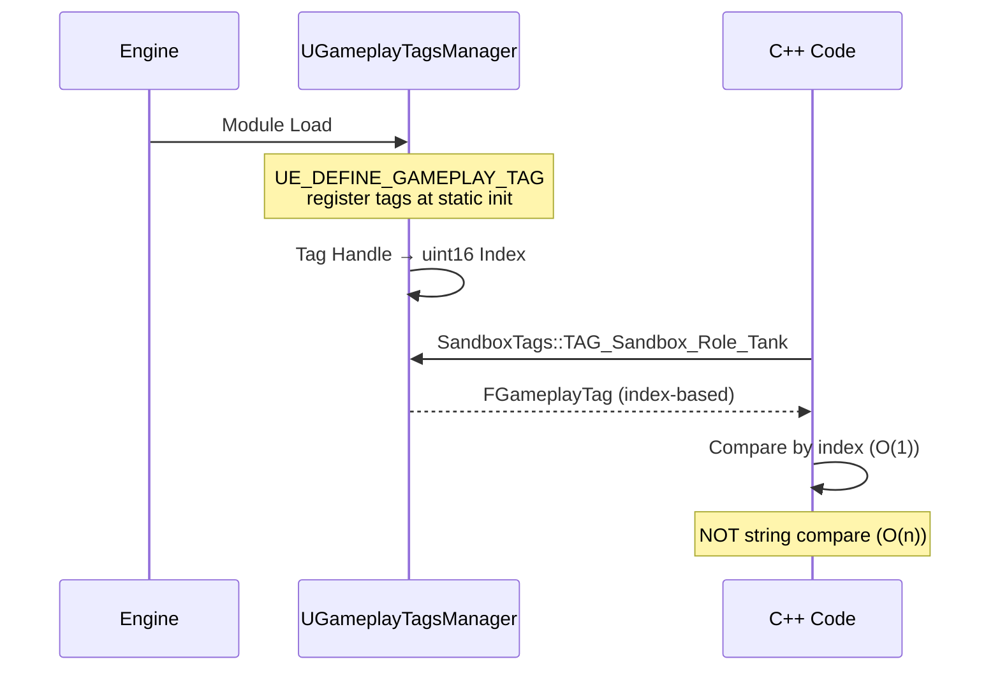

# Lesson 01 — Gameplay Tags + Log Categories

## Câu hỏi cốt lõi
> Tại sao dùng `UE_DEFINE_GAMEPLAY_TAG` (compile-time handle) thay vì `FGameplayTag::RequestGameplayTag("string")` (runtime lookup)?

## WHY — Không chỉ WHAT

### Vấn đề với string-based tags
- Typo "Sandbox.Role.Tnk" → `IsValid() == false` → BUG ẨN, không crash, không compile error
- So sánh string mỗi frame = O(n) per character
- Không autocomplete trong IDE

### Native tags giải quyết gì
- `UE_DECLARE_GAMEPLAY_TAG_EXTERN(TAG_Sandbox_Role_Tank)` → typo tên biến C++ = **compile error**
- So sánh bằng uint16 index → O(1)
- IDE autocomplete `SandboxTags::TAG_` → thấy tất cả tags

### Log Categories giải quyết gì
- Production code có hàng nghìn log/frame
- `DECLARE_LOG_CATEGORY_EXTERN(LogSandboxCombat, ...)` → lọc riêng combat: `Log LogSandboxCombat Verbose`
- Trong thực tế PaldarkLab có 7 categories: General, Pal, Inventory, Net, GAS, Backend, UI

## Flow Diagram



## Test Plan

| # | Test | Bước reproduce | PASS criteria |
|---|------|---------------|---------------|
| 1 | Native tag exists | Spawn ATestTagActor | Log: `[PASS] Test01_NativeTagExists` |
| 2 | Compare cheap | BeginPlay auto-run | Log: `Tank==Tank: true, Tank!=Healer: true` |
| 3 | String typo fails silently | BeginPlay auto-run | Log: `Typo tag IsValid() = false (expected false)` |
| 4 | Native typo fails at compile | Thử đổi `TAG_Sandbox_Role_Tank` → `TAG_Sandbox_Role_Tnk` trong code, build | Compile ERROR (không phải runtime bug) |
| 5 | Tag hierarchy | BeginPlay auto-run | Log: `Tank.MatchesTag(Sandbox.Role) = true` |
| 6 | Log category filter | Console: `Log LogSandboxCombat Verbose` | Chỉ thấy `[Combat]` messages |
| 7 | Tag container | BeginPlay auto-run | Log: `HasDPS=Y, NoDead=Y, HasAlive=Y` |

## Expected Output (copy-paste để verify)

```
LogSandboxGeneral: === LESSON 01: GameplayTags + Log Categories ===
LogSandboxGeneral: [PASS] Test01_NativeTagExists — TAG_Sandbox_Role_Tank.IsValid() = true
LogSandboxGeneral: [PASS] Test02_NativeTagCompareCheap — Tank==Tank: true, Tank!=Healer: true
LogSandboxGeneral: [PASS] Test03_StringLookup_TypoFails — Typo tag 'Sandbox.Role.Tnk' IsValid() = false (expected false)
LogSandboxGeneral: [PASS] Test05_TagHierarchy — Tank.MatchesTag(Sandbox.Role) = true
LogSandboxGeneral: [General] This is a general message
LogSandboxCombat: Warning: [Combat] This is a combat warning
LogSandboxCombat: [Combat] Damage applied: 50
LogSandboxGeneral: [PASS] Test06_LogCategory — Check Output Log — 2 categories visible
LogSandboxGeneral: [PASS] Test07_TagContainer — HasDPS=Y, NoDead=Y, HasAlive=Y
LogSandboxGeneral: === END LESSON 01 ===
```

## Mapping sang code thật

| Sandbox | Production |
|---------|-----------|
| `SandboxTags` namespace | `PaldarkGameplayTags` namespace |
| `TAG_Sandbox_Role_*` | `TAG_Paldark_Pawn_Player`, `TAG_Paldark_Pawn_Pal` |
| `TAG_Sandbox_State_*` | `TAG_Paldark_State_IsDead`, `TAG_Paldark_State_Sprinting` |
| `LogSandboxGeneral` | `LogPaldark` |
| `LogSandboxCombat` | `LogPaldarkGAS` |

## Manual Test 04: Compile-time error

Để chứng minh native tags catch typo tại compile time:

1. Mở file `ATestTagActor.cpp`
2. Trong hàm `Test04_NativeTag_TypoFailsAtCompile`, uncomment dòng:
   ```cpp
   FGameplayTag TypoTag = SandboxTags::TAG_Sandbox_Role_Tnk; // This will NOT compile!
   ```
3. Chạy build.bat
4. Kết quả: **COMPILE ERROR** — `TAG_Sandbox_Role_Tnk` không tồn tại, không cần chạy game để phát hiện bug

Đây là lợi ích lớn nhất của native tags: typo được catch tại build time, không phải runtime.
