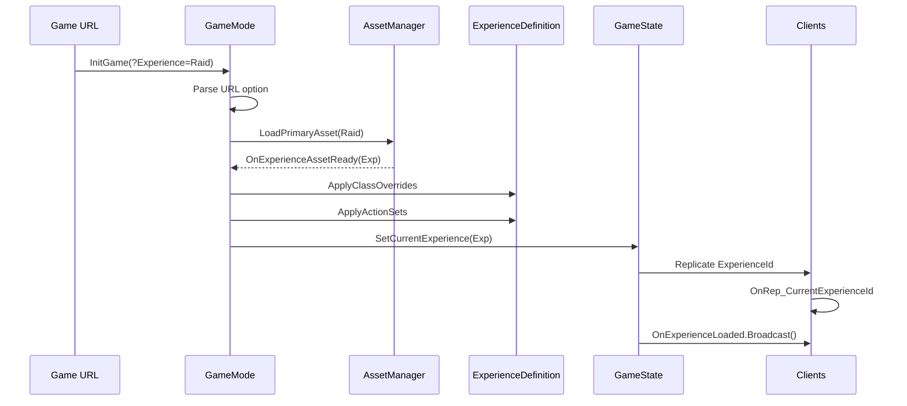

# Lesson 02 — Experience System

## Câu hỏi cốt lõi
> Tại sao cùng 1 map có thể chạy Raid (4 players, combat) hoặc Hub Town (8 players, trading) chỉ bằng cách đổi `?Experience=` trong URL?

## WHY — Không chỉ WHAT

### Vấn đề nếu hardcode rules vào GameMode
- Mỗi game mode (Raid, Hub, Tutorial) = 1 GameMode C++ class mới → code explosion
- Sửa max players = sửa code, rebuild, redeploy
- Designer không tự thay đổi được rules → bottleneck engineer

### Experience System giải quyết gì
- **Data-driven**: Rules nằm trong data asset (ExperienceDefinition), không phải code
- **Composition**: ActionSets additive — cùng base experience, thêm/bớt features qua ActionSet
- **Decouple**: Map ≠ Rules. TestMap + Raid = combat. TestMap + Hub = trading. Cùng binary, cùng map, khác behavior
- **Async**: Load experience qua AssetManager, không hitch khi map transition

### Flow cốt lõi (6 bước)
1. `InitGame(Options)` → gọi `RequestExperienceLoad(Options)`
2. Parse `?Experience=` từ URL, fallback to `DefaultExperience`
3. `LoadPrimaryAsset(AssetId)` async → callback `OnExperienceAssetReady`
4. `ApplyExperienceClassOverrides` — swap PC, PS class
5. `ApplyExperienceActionSets` — merge IntrinsicTags + ActionSet.GrantedTags
6. `GameState::SetCurrentExperience` → replicate ID to clients → `OnRep` → broadcast delegate

## Flow Diagram



## Test Plan

| # | Test | Bước reproduce | PASS criteria |
|---|------|---------------|---------------|
| 1 | URL selects Raid | Spawn ATestExperienceActor, URL has ?Experience=RaidSandbox | Log: `[PASS] Test01_URLOption_SelectsRaid` |
| 2 | No URL → default | URL has no ?Experience= | Log: `[PASS] Test02_NoURLOption_FallbackToDefault` |
| 3 | Invalid experience | URL has ?Experience=NonExistent | Log: Warning + `[PASS] Test03_InvalidExperience_GracefulFallback` |
| 4 | Class overrides | Load Raid | Log: PC=RaidPlayerController, PS=RaidPlayerState |
| 5 | ActionSet merge tags | Load Raid | Log: Raid=Y Combat=Y LagComp=Y NoTrading=Y |
| 6 | Same map, diff rules | Load Raid then Hub | Log: different pawn, different tags |
| 7 | Delegate fires | Subscribe then load | Log: DelegateFired=Y |
| 8 | MaxPlayers per experience | Load Raid (4) and Hub (8) | Log: Raid=4 Hub=8 |

## Expected Output

```
LogSandboxExpTest: === LESSON 02: Experience System ===
LogSandboxExperience: [Registry] Registered experience 'RaidSandbox' (Raid Sandbox)
LogSandboxExperience: [Registry] Registered experience 'HubTown' (Hub Town)
LogSandboxExperience: [RequestLoad] URL resolved: 'RaidSandbox'
LogSandboxExperience: [RequestLoad] Async load started for 'RaidSandbox' (SANDBOX: synchronous).
LogSandboxExperience: [Override] PlayerController → RaidPlayerController
LogSandboxExperience: [Override] PlayerState → RaidPlayerState
LogSandboxExperience: [ActionSet] CombatLoop ActionSet
LogSandboxExperience: [Ready] Experience 'RaidSandbox' loaded. Pawn=PaldarkCharacter PC=RaidPlayerController PS=RaidPlayerState ActionSets=1 Tags=3
LogSandboxExpTest: [PASS] Test01_URLOption_SelectsRaid — ResolvedKey='RaidSandbox'
LogSandboxExperience: [RequestLoad] No URL option, fallback to default: 'RaidSandbox'
LogSandboxExperience: [RequestLoad] Async load started for 'RaidSandbox' (SANDBOX: synchronous).
LogSandboxExperience: [Override] PlayerController → RaidPlayerController
LogSandboxExperience: [Override] PlayerState → RaidPlayerState
LogSandboxExperience: [ActionSet] CombatLoop ActionSet
LogSandboxExperience: [Ready] Experience 'RaidSandbox' loaded. Pawn=PaldarkCharacter PC=RaidPlayerController PS=RaidPlayerState ActionSets=1 Tags=3
LogSandboxExpTest: [PASS] Test02_NoURLOption_FallbackToDefault — ResolvedKey='RaidSandbox' (expected 'RaidSandbox' as default)
LogSandboxExperience: [RequestLoad] URL resolved: 'NonExistent'
LogSandboxExperience: [RequestLoad] Experience 'NonExistent' not found in registry. bExperienceLoaded=true (fallback).
LogSandboxExpTest: [PASS] Test03_InvalidExperience_GracefulFallback — LoadedExperience is nullptr (graceful fallback, check Warning log above)
LogSandboxExperience: [RequestLoad] URL resolved: 'RaidSandbox'
LogSandboxExperience: [RequestLoad] Async load started for 'RaidSandbox' (SANDBOX: synchronous).
LogSandboxExperience: [Override] PlayerController → RaidPlayerController
LogSandboxExperience: [Override] PlayerState → RaidPlayerState
LogSandboxExperience: [ActionSet] CombatLoop ActionSet
LogSandboxExperience: [Ready] Experience 'RaidSandbox' loaded. Pawn=PaldarkCharacter PC=RaidPlayerController PS=RaidPlayerState ActionSets=1 Tags=3
LogSandboxExpTest: [PASS] Test04_ClassOverrides_PCandPS — PC=RaidPlayerController PS=RaidPlayerState
LogSandboxExperience: [RequestLoad] URL resolved: 'RaidSandbox'
LogSandboxExperience: [RequestLoad] Async load started for 'RaidSandbox' (SANDBOX: synchronous).
LogSandboxExperience: [Override] PlayerController → RaidPlayerController
LogSandboxExperience: [Override] PlayerState → RaidPlayerState
LogSandboxExperience: [ActionSet] CombatLoop ActionSet
LogSandboxExperience: [Ready] Experience 'RaidSandbox' loaded. Pawn=PaldarkCharacter PC=RaidPlayerController PS=RaidPlayerState ActionSets=1 Tags=3
LogSandboxExpTest: [PASS] Test05_ActionSets_MergeTags — Raid=Y Combat=Y LagComp=Y NoTrading=Y
LogSandboxExperience: [RequestLoad] URL resolved: 'RaidSandbox'
LogSandboxExperience: [RequestLoad] Async load started for 'RaidSandbox' (SANDBOX: synchronous).
LogSandboxExperience: [Override] PlayerController → RaidPlayerController
LogSandboxExperience: [Override] PlayerState → RaidPlayerState
LogSandboxExperience: [ActionSet] CombatLoop ActionSet
LogSandboxExperience: [Ready] Experience 'RaidSandbox' loaded. Pawn=PaldarkCharacter PC=RaidPlayerController PS=RaidPlayerState ActionSets=1 Tags=3
LogSandboxExperience: [RequestLoad] URL resolved: 'HubTown'
LogSandboxExperience: [RequestLoad] Async load started for 'HubTown' (SANDBOX: synchronous).
LogSandboxExperience: [Override] PlayerController → HubPlayerController
LogSandboxExperience: [Override] PlayerState → HubPlayerState
LogSandboxExperience: [ActionSet] Social ActionSet
LogSandboxExperience: [Ready] Experience 'HubTown' loaded. Pawn=HubCharacter PC=HubPlayerController PS=HubPlayerState ActionSets=1 Tags=3
LogSandboxExpTest: [PASS] Test06_SameMap_DifferentRules — Raid:Combat=Y Hub:Trading=Y Hub:NoCombat=Y DiffPawn=Y (Raid=PaldarkCharacter, Hub=HubCharacter)
LogSandboxExperience: [RequestLoad] URL resolved: 'HubTown'
LogSandboxExperience: [RequestLoad] Async load started for 'HubTown' (SANDBOX: synchronous).
LogSandboxExperience: [Override] PlayerController → HubPlayerController
LogSandboxExperience: [Override] PlayerState → HubPlayerState
LogSandboxExperience: [ActionSet] Social ActionSet
LogSandboxExperience: [Ready] Experience 'HubTown' loaded. Pawn=HubCharacter PC=HubPlayerController PS=HubPlayerState ActionSets=1 Tags=3
LogSandboxExpTest: [PASS] Test07_OnExperienceLoadedDelegate — DelegateFired=Y ExpName='Hub Town'
LogSandboxExperience: [RequestLoad] URL resolved: 'RaidSandbox'
LogSandboxExperience: [RequestLoad] Async load started for 'RaidSandbox' (SANDBOX: synchronous).
LogSandboxExperience: [Override] PlayerController → RaidPlayerController
LogSandboxExperience: [Override] PlayerState → RaidPlayerState
LogSandboxExperience: [ActionSet] CombatLoop ActionSet
LogSandboxExperience: [Ready] Experience 'RaidSandbox' loaded. Pawn=PaldarkCharacter PC=RaidPlayerController PS=RaidPlayerState ActionSets=1 Tags=3
LogSandboxExperience: [RequestLoad] URL resolved: 'HubTown'
LogSandboxExperience: [RequestLoad] Async load started for 'HubTown' (SANDBOX: synchronous).
LogSandboxExperience: [Override] PlayerController → HubPlayerController
LogSandboxExperience: [Override] PlayerState → HubPlayerState
LogSandboxExperience: [ActionSet] Social ActionSet
LogSandboxExperience: [Ready] Experience 'HubTown' loaded. Pawn=HubCharacter PC=HubPlayerController PS=HubPlayerState ActionSets=1 Tags=3
LogSandboxExpTest: [PASS] Test08_MaxPlayers — Raid=4 Hub=8
LogSandboxExpTest: === END LESSON 02 ===
```

## Mapping sang code thật

| Sandbox | Production |
|---------|-----------|
| `USandboxExperienceDefinition` | `UPaldarkExperienceDefinition` |
| `FSandboxActionSet` | `UPaldarkExperienceActionSet` |
| `USandboxExperienceManager` | `APaldarkGameModeBase` + `UPaldarkAssetManager` + `APaldarkGameStateBase` |
| `RegisterExperience()` | `DefaultGame.ini` PrimaryAssetTypesToScan |
| `RequestExperienceLoad()` | `APaldarkGameModeBase::RequestExperienceLoad()` |
| `OnExperienceAssetReady()` | `APaldarkGameModeBase::OnExperienceAssetReady()` |
| `ApplyClassOverrides()` | `APaldarkGameModeBase::ApplyExperienceClassOverrides()` |
| `ApplyActionSets()` | `APaldarkGameModeBase::ApplyExperienceActionSets()` |
| `OnExperienceLoaded delegate` | `APaldarkGameStateBase::OnExperienceLoaded` |
| String-based "PawnClassName" | `TSoftObjectPtr<UPaldarkPawnData>` → `PawnClass` |

## Manual Test

Để chứng minh core insight của Experience System:

1. Mở file `ATestExperienceActor.cpp`
2. Chạy game và spawn `ATestExperienceActor`
3. Quan sát log output — bạn sẽ thấy:
   - Test06 chứng minh cùng map (TestMap) nhưng khác rules:
     - Raid: Combat enabled, Trading disabled, MaxPlayers=4
     - Hub: Combat disabled, Trading enabled, MaxPlayers=8
   - Điều này chứng minh **Map ≠ Rules** — cùng binary, cùng map, khác behavior chỉ bằng URL parameter

Đây là lợi ích lớn nhất của Experience System: designer có thể tạo hàng chúc experience khác nhau từ cùng 1 map mà không cần engineer viết code mới.
