# Lesson 03 — PawnData + InputConfig (tag-based input lookup)

## Câu hỏi cốt lõi
**Vì sao Paldark dùng `InputTag` (`Input.Move`, `Input.Jump`) để lookup `InputAction`, thay vì Character hardcode `BindAction(MoveAction, ...)` trực tiếp?**

## WHY — Bản chất

Hai vấn đề kinh điển khi hardcode input trong Character:

### 1. Inflexibility — đổi controller scheme = sửa code
Nếu `APaldarkCharacter::SetupPlayerInputComponent` viết:
```cpp
InputComp->BindAction(MoveAction_WASD, ETriggerEvent::Triggered, this, &ThisClass::Move);
InputComp->BindAction(JumpAction_Space, ETriggerEvent::Started, this, &ThisClass::Jump);
```
Để hỗ trợ gamepad, bạn phải:
- Sửa Character C++ (recompile).
- Hoặc thêm `if (bIsGamepad) BindAction(StickMove, ...)` — nhánh logic phình to.
- Hoặc tạo `APaldarkCharacter_Gamepad` subclass — explosion class hierarchy.

### 2. Coupling — không có gì swap được runtime
Spectator pawn cũng dùng cùng Character class nhưng KHÔNG nên bind Jump. Hardcode = không thể turn off mà không recompile.

### Giải pháp: hai bước indirection
1. **Tag = intent**. `TAG_Input_Move` nghĩa là "ý định di chuyển", không phải "phím W". Code Character chỉ hiểu intent.
2. **PawnData → InputConfig** = bảng map `Tag → ConcreteAction`. Data asset. Designer edit, không cần code.

Lúc possess pawn, Character làm việc duy nhất:
```cpp
for (auto& Binding : PawnData->InputConfig->NativeInputActions)
{
    InputComp->BindAction(Binding.InputAction, Triggered, this, &Func_For_Tag(Binding.InputTag));
}
```
Không hardcode. Đổi controller scheme = chọn PawnData khác (KBM / Gamepad / Spectator). Cùng Character class, hành vi khác. **Composition + indirection thay vì inheritance.**

### Tag lookup chậm hơn direct binding không?
`FGameplayTag::operator==` là so sánh integer (Lesson 01). N action mỗi pawn = N integer compare khi setup ONE LẦN. Sau khi bind xong, callback chạy không qua tag map nữa. Cost = O(N) ở possess time, O(1) sau đó.

## Flow

```mermaid
flowchart TD
  A[Character possessed] --> B[Resolve PawnData &#40;from Experience or default&#41;]
  B --> C[PawnData.InputConfig.NativeInputActions]
  C --> D[For each &#40;InputTag, InputAction&#41;]
  D --> E[InputComp.BindAction&#40;InputAction, ETriggerEvent, Handler_For_Tag&#41;]
  F[User presses W] --> G[EnhancedInput fires UInputAction]
  G --> H[Bound handler runs — Character moves]
  I[Swap PawnData &#40;KBM->Gamepad&#41;] --> J[Re-run binding loop -> different actions wired]
```



## Test plan

Mở Editor → Play (PIE). `UTestInputBinder` (UWorldSubsystem) seed 2 PawnData variants (`PD_KBM` + `PD_Gamepad`) trong `Initialize`. `OnWorldBeginPlay` chạy 6 TCs. Filter Output Log: `LogSandboxInput`.

| # | Bước reproduce                                            | Assertion observable                                                                     | PASS criteria                  |
|---|-----------------------------------------------------------|------------------------------------------------------------------------------------------|--------------------------------|
| 1 | Bấm Play                                                  | Cả `PD_KBM` và `PD_Gamepad` đều có `InputConfig != nullptr`                              | `[TC1] ... PASS`               |
| 2 | (cùng pass)                                               | `KBM.Move → "IA_Move_WASD"`, `Gamepad.Move → "IA_Move_LStick"` (cùng intent, khác action) | `[TC2] ... PASS`               |
| 3 | `BindToPawnData(Gamepad)` rồi `SimulateInput(Input.Sprint)` | Gamepad không bind Sprint → counter không tăng + log Warning "input ignored (graceful)"  | `[TC3] ... PASS` + Warning log |
| 4 | `BindToPawnData(KBM)` rồi `BindToPawnData(Gamepad)`        | Cùng `PawnClass=BP_PaldarkCharacter`. KBM=5 bindings, Gamepad=4 bindings                  | `[TC4] ... PASS`               |
| 5 | `BindToPawnData(KBM)` rồi `SimulateInput(Input.Jump)`     | `IA_Jump_Space` counter=1, `IA_Move_WASD` counter=0 (tag routing isolated)                | `[TC5] ... PASS`               |
| 6 | `BindToPawnData(Gamepad)` rồi `SimulateInput(Input.Move)` | `IA_Move_LStick` counter=1, `IA_Move_WASD` counter=0 (hot-swap rebind)                    | `[TC6] ... PASS`               |

## Expected output (đoạn quan trọng)

```
LogSandboxInput: === Lesson03 PawnData+Input :: Subsystem Initialize — seeding PawnData variants ===
LogSandboxInput: === Lesson03 PawnData+Input :: OnWorldBeginPlay — RUN ALL TESTS ===
LogSandboxInput: [TC1] Both PawnData variants have InputConfig: PASS
LogSandboxInput: [TC2] Input.Move: KBM->IA_Move_WASD Gamepad->IA_Move_LStick : PASS
LogSandboxInput: BindToPawnData: 'PD_Gamepad' (PawnClass=BP_PaldarkCharacter) -> 4 tag callbacks installed
LogSandboxInput: Warning: SimulateInput: tag 'Sandbox.Input.Sprint' not bound on current PawnData — input ignored (graceful)
LogSandboxInput: [TC3] Gamepad bound, simulate Input.Sprint (unmapped): Sprint count 0->0 : PASS
LogSandboxInput: BindToPawnData: 'PD_KBM' (PawnClass=BP_PaldarkCharacter) -> 5 tag callbacks installed
LogSandboxInput: BindToPawnData: 'PD_Gamepad' (PawnClass=BP_PaldarkCharacter) -> 4 tag callbacks installed
LogSandboxInput: [TC4] Same PawnClass=BP_PaldarkCharacter, KBM bindings=5, Gamepad bindings=4 : PASS
LogSandboxInput: BindToPawnData: 'PD_KBM' (PawnClass=BP_PaldarkCharacter) -> 5 tag callbacks installed
LogSandboxInput: [TC5] After SimulateInput(Jump): Jump=1 Move=0 : PASS
LogSandboxInput: BindToPawnData: 'PD_Gamepad' (PawnClass=BP_PaldarkCharacter) -> 4 tag callbacks installed
LogSandboxInput: [TC6] After hot-swap to Gamepad + SimulateInput(Move): KBM.Move=0 Gamepad.Move=1 : PASS
LogSandboxInput: === Lesson03 PawnData+Input :: DONE ===
```

## Cách chứng minh thủ công

1. Thêm một `FTestInputActionBinding{TAG_Input_Sprint, MakeAction("IA_Sprint_R3")}` vào `GamepadConfig` trong `SeedTwoPawnDataVariants` → TC3 sẽ FAIL (Sprint giờ fire), TC4 binding count Gamepad=5 (không còn lệch). **Đây chứng minh thay đổi scheme = edit data, không cần Pawn code.**
2. Đổi `BindToPawnData` xoá vòng for, hardcode `TagCallbacks.Add(TAG_Input_Move, ...)` → TC4-TC6 phá, vì hot-swap không còn hiệu lực.

## Placeholder mapping (sandbox → thực tế)

| Sandbox                              | Trong PaldarkLab thật                                                  |
|--------------------------------------|------------------------------------------------------------------------|
| `UTestInputAction { FName ActionId }`| `UInputAction` (EnhancedInput plugin, asset on disk)                   |
| `UTestInputConfig.NativeInputActions`| `ULyraInputConfig::NativeInputActions` (cùng cấu trúc `{Tag, Action}`) |
| `UTestPawnData`                      | `ULyraPawnData` — refs PawnClass, AbilitySets, InputConfig, CameraMode |
| `SimulateInput(Tag)`                 | Real flow: EnhancedInput hệ thống tự fire UInputAction, Character bind sẵn handler |
| `UTestInputBinder` (UWorldSubsystem) | Logic này nằm trong `ALyraCharacter::InitializePlayerInput` — sandbox tách ra để observable |

## Câu hỏi mở (chuyển sang Lesson 04)
PawnData chỉ là *manifest*. Character vẫn cần biết: ai handle movement, ai handle health, ai handle inventory? Stuff hết vào `APaldarkCharacter.cpp` → file 2000 dòng. → **Component slot pattern: Character là shell, mỗi feature một component.**

## Bridge đến Lesson 02
Trong production thật, `PawnData` không phải designer chọn thủ công cho mỗi player — nó đến từ `ExperienceDefinition.DefaultPawnData`. Possessed pawn = lookup CurrentExperience → đọc PawnData → bind. PR-03 sandbox tách rời để focus vào tag-routing; bridge với PR-02 sẽ làm ở các PR sau.
