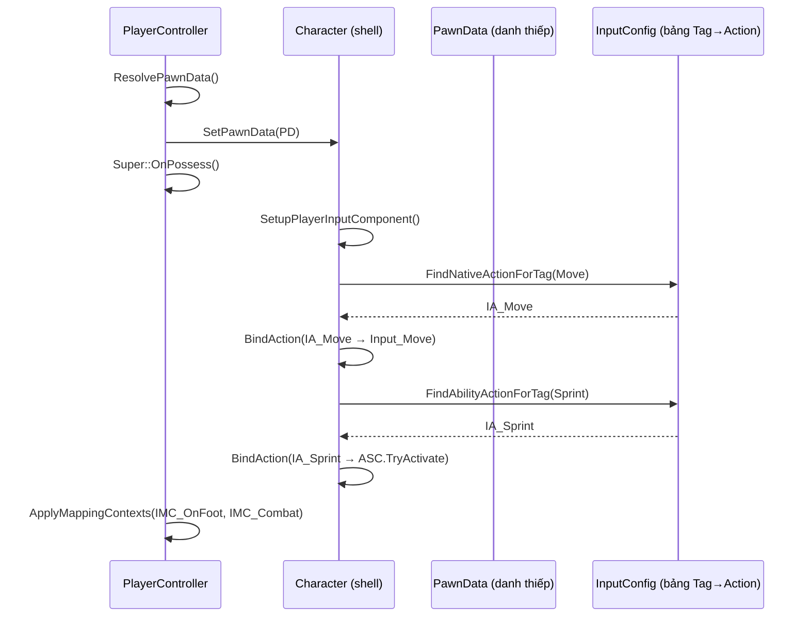

# Lesson 03 — PawnData + Input Configuration

## Câu hỏi cốt lõi
> Tại sao dùng `FGameplayTag` tra cứu `UInputAction` thay vì hardcode `IA_Move` trong Character? Tại sao "PawnData" là tấm danh thiếp của character chứ không phải character tự biết mình là ai?

## WHY — Không chỉ WHAT

### Vấn đề nếu hardcode input trong Character
- Character code chứa `UPROPERTY() UInputAction* IA_Move` → sửa input = sửa code, rebuild
- Raid character cần Jump + Sprint + Fire. Hub character cần Trade + Interact. → 2 Character class riêng?
- Designer không tự đổi keybind → bottleneck engineer
- Thêm 1 action mới = sửa Character.h + .cpp, compile toàn bộ module

### Tag-based lookup giải quyết gì
- **Data-driven**: InputConfig chứa bảng (Tag → UInputAction). Đổi bảng = đổi input, zero code change
- **Swappable**: Raid PawnData → InputConfig_Raid (Move/Look/Jump/Sprint/Fire). Hub PawnData → InputConfig_Hub (Move/Look/Trade/Interact). Cùng Character class, khác behavior
- **Extensible**: Thêm ability mới = thêm 1 row vào AbilityInputActions, không sửa Character
- **Two paths, one system**: NativeInputActions (Move/Look/Jump) → character C++ handler. AbilityInputActions (Sprint/Fire) → GAS activation by tag. Cùng InputConfig asset.

### PawnData = "tấm danh thiếp"
- Experience → PawnData → (PawnClass + InputConfig + MappingContexts + GrantedAbilities)
- Character là shell rỗng. PawnData nói cho nó biết: "bạn là ai, bạn dùng input gì, bạn có ability gì"
- Đổi Experience = đổi PawnData = đổi MỌI THỨ (class, input, abilities) mà Character code KHÔNG biết

## Flow Diagram (mermaid)

## Test Plan

| # | Test | PASS criteria |
|---|------|---------------|
| 1 | Tag lookup finds action | `FindNativeActionForTag(Move)` = "IA_Move" |
| 2 | Missing tag returns empty | `FindNativeActionForTag(Trade)` = "" |
| 3 | OnPossess binds 3 native | NativeBindCount = 3 |
| 4 | OnPossess binds 2 ability | AbilityBindCount = 2 |
| 5 | MappingContexts applied | 2 IMCs (OnFoot + Combat) |
| 6 | Different PawnData = different bindings | Raid:Jump=Y, Hub:Jump=N, Hub:Trade=Y, Raid:Trade=N |
| 7 | Simulate native press | "NATIVE: Move → Input_Move(Pressed)" |
| 8 | Simulate ability press | "ABILITY: Sprint → ASC->TryActivateAbilityByTag" |
| 9 | Simulate ability release | "CancelAbilityByTag" |
| 10 | No PawnData → graceful | 0 bindings, no crash |
| 11 | No InputConfig → graceful | 0 bindings, no crash |

## Mapping sang code thật
| Sandbox | Production |
|---------|-----------|
| `USandboxPawnData` | `UPaldarkPawnData` |
| `USandboxInputConfig` | `UPaldarkInputConfig` |
| `FSandboxInputAction` | `FPaldarkInputAction` |
| `FSandboxMappingContext` | `FPaldarkMappingContextAndPriority` |
| `USandboxCharacterSim` | `APaldarkCharacter` + `APaldarkPlayerController` |
| `FindNativeActionForTag()` | `UPaldarkInputConfig::FindNativeInputActionForTag()` |
| `FindAbilityActionForTag()` | `UPaldarkInputConfig::FindAbilityInputActionForTag()` |
| `SimulateOnPossess()` | `APaldarkPlayerController::OnPossess()` |
| `BindNativeInputActions()` | `APaldarkCharacter::BindNativeInputActions()` |
| `BindAbilityInputActions()` | `APaldarkCharacter::BindAbilityInputActions()` |
| `SimulateInputPress(Sprint)` | `APaldarkCharacter::Input_Sprint_Pressed → ASC->TryActivateAbilityByActivationTag` |
| String ActionName | `TObjectPtr<const UInputAction>` |
| String MappingContextName | `TSoftObjectPtr<UInputMappingContext>` |
